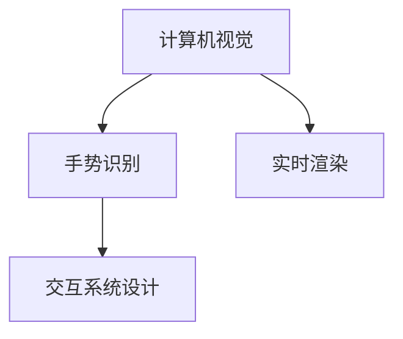
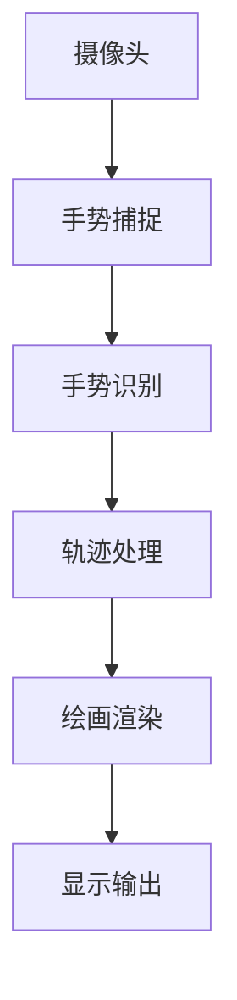

                 

# 基于opencv的隔空作画系统详细设计与具体代码实现

> 关键词：隔空作画,opencv,计算机视觉,手势识别,实时渲染,交互系统

## 1. 背景介绍

### 1.1 问题由来
随着技术的不断进步，人与计算机的交互方式也在不断进化。从早期的命令行到图形界面，再到触屏和语音控制，交互方式越来越直观自然。然而，这种互动方式仍然有一定的物理限制，用户需要通过触摸或语音进行指令输入。然而，我们人类的身体拥有更为丰富的交互手段，如手势、眼神、表情等，如果能将这些自然交互方式应用于计算机，将极大地提升用户体验和交互效率。

隔空作画系统便是一种以手势和轨迹为输入源，直接通过摄像头捕捉用户的手势轨迹，并将其转换为计算机上的绘画操作，使得用户可以通过“画空”的方式，控制计算机绘制出自己的创意。该系统不仅能够丰富用户体验，还能在医疗、教育、娱乐等领域中发挥重要作用。

### 1.2 问题核心关键点
隔空作画系统涉及的核心技术包括计算机视觉、手势识别、实时渲染和交互系统设计。其中，关键点在于手势识别算法能够准确捕捉用户的手势轨迹，以及实时渲染系统能够高效地将手势转化为绘画操作。

具体来说，隔空作画系统的设计需要解决以下问题：
- 如何通过摄像头捕捉用户的手势轨迹，并准确识别？
- 如何将手势轨迹转换为绘画操作，实现实时渲染？
- 如何设计交互界面，提升用户体验？

本文将对这些问题进行详细阐述，并给出基于opencv的具体代码实现。

## 2. 核心概念与联系

### 2.1 核心概念概述

为更好地理解隔空作画系统的设计与实现，本节将介绍几个密切相关的核心概念：

- 计算机视觉（Computer Vision）：研究如何使计算机“看”并理解图像和视频的技术。计算机视觉应用广泛，如人脸识别、物体检测、动作识别等。
- 手势识别（Gesture Recognition）：研究如何识别用户的手势动作，并转化为计算机可理解的数据。手势识别技术可以应用于隔空作画、虚拟现实、游戏控制等。
- 实时渲染（Real-time Rendering）：指在每一帧显示前，实时计算并生成图像的过程。实时渲染技术可以应用于交互系统、动态模拟、虚拟现实等领域。
- 交互系统设计（Interactive System Design）：研究如何设计用户界面，使用户能够通过自然交互方式与计算机进行互动。交互系统设计可以应用于各种应用场景，如智能家居、健康监测、人机交互等。

这些核心概念之间的逻辑关系可以通过以下Mermaid流程图来展示：



这个流程图展示了我国计算机视觉、手势识别、实时渲染和交互系统设计的关系：

1. 计算机视觉技术捕捉手势轨迹。
2. 手势识别算法将手势轨迹转换为计算机可理解的数据。
3. 实时渲染系统将手势数据转化为绘画操作。
4. 交互系统设计实现用户界面，提升用户体验。

### 2.2 概念间的关系

这些核心概念之间存在着紧密的联系，形成了隔空作画系统的完整设计生态。下面我通过几个Mermaid流程图来展示这些概念之间的关系。

#### 2.2.1 系统设计流程


这个流程图展示了隔空作画系统从用户输入手势到最终显示绘画结果的完整流程：

1. 用户输入手势。
2. 计算机视觉技术捕捉手势轨迹。
3. 手势识别算法将手势轨迹转换为计算机可理解的数据。
4. 实时渲染系统将手势数据转化为绘画操作。
5. 交互系统设计实现用户界面，提升用户体验。
6. 显示绘画结果。

#### 2.2.2 关键技术组件



这个流程图展示了隔空作画系统设计中的关键技术组件：

1. 摄像头捕捉用户手势。
2. 手势识别算法分析手势轨迹。
3. 轨迹处理模块对手势轨迹进行数据处理和预处理。
4. 绘画渲染模块将手势轨迹转化为绘画操作。
5. 显示输出模块将绘画结果呈现在屏幕上。

通过这些流程图，我们可以更清晰地理解隔空作画系统设计的各个环节及其之间的关联。

## 3. 核心算法原理 & 具体操作步骤

### 3.1 算法原理概述

隔空作画系统基于计算机视觉和手势识别技术，核心算法包括手势识别和实时渲染两部分。

#### 3.1.1 手势识别

手势识别的基本原理是通过摄像头捕捉用户的手势轨迹，并将其转化为计算机可理解的数据。常用的手势识别方法包括：

- 基于轮廓的手势识别：通过分析手势轮廓的形态变化，识别手势动作。
- 基于关键点的手势识别：通过捕捉手势关键点（如指尖、手腕）的位置变化，识别手势动作。

#### 3.1.2 实时渲染

实时渲染的核心在于将手势数据转换为绘画操作，实现图形的实时生成。常用的实时渲染方法包括：

- 基于像素的手绘渲染：将手势轨迹直接映射为像素点，并进行色彩填充。
- 基于线段的手绘渲染：将手势轨迹转化为线条，并进行渐变、填充等效果处理。
- 基于曲线的手绘渲染：将手势轨迹转化为曲线，并进行平滑处理和渐变效果。

### 3.2 算法步骤详解

隔空作画系统的设计可以分为以下几个关键步骤：

**Step 1: 环境搭建**

- 安装并配置opencv库。使用以下命令安装opencv：
```bash
pip install opencv-python
```
- 准备摄像头设备，并确保摄像头已经正确安装和配置。

**Step 2: 手势识别**

- 通过摄像头捕捉用户的手势轨迹。使用opencv的`VideoCapture`类，捕捉摄像头的实时视频流。
- 对手势轨迹进行预处理，包括灰度化、二值化、去噪等。
- 使用手势识别算法，如基于关键点或轮廓的方法，识别用户的手势动作。

**Step 3: 轨迹处理**

- 对识别到的手势轨迹进行平滑处理，去除不连贯的噪声点。
- 对轨迹进行坐标变换，转化为绘画操作所需的参数。

**Step 4: 绘画渲染**

- 根据轨迹参数，生成对应的绘画操作。
- 使用绘图工具，将绘画操作实时渲染在画布上。

**Step 5: 交互设计**

- 设计交互界面，提供用户的操作提示和反馈。
- 实现用户的手势控制操作，并显示绘画结果。

### 3.3 算法优缺点

隔空作画系统具有以下优点：
1. 简单易用：系统设计基于用户自然手势，无需特殊硬件或复杂操作。
2. 实时性高：通过摄像头实时捕捉手势轨迹，并进行实时渲染。
3. 交互性强：用户可以通过手势控制绘画操作，实现人机互动。

然而，系统也存在一些缺点：
1. 精度受限：手势识别精度可能受到用户手势质量、环境光照等因素影响。
2. 渲染效率低：实时渲染需要较高的计算资源，可能存在延迟问题。
3. 用户体验需优化：界面设计和交互体验需要不断优化，才能提升用户体验。

### 3.4 算法应用领域

隔空作画系统可以应用于多个领域，例如：

- 教育：教师可以通过手势控制演示，提升课堂互动性。
- 医疗：医生可以通过手势控制手术模拟器，进行模拟手术操作。
- 娱乐：游戏玩家可以通过手势控制角色移动和操作，提升游戏体验。
- 创意设计：艺术家可以通过手势控制绘画，创作个性化作品。

## 4. 数学模型和公式 & 详细讲解 & 举例说明

### 4.1 数学模型构建

隔空作画系统涉及的主要数学模型包括：

- 手势识别模型：通过图像处理技术，捕捉手势轨迹并识别手势动作。
- 绘画渲染模型：将手势轨迹转换为绘画操作，实现实时渲染。

### 4.2 公式推导过程

#### 4.2.1 手势识别模型

手势识别模型基于图像处理技术，主要涉及以下步骤：

1. 摄像头捕捉手势轨迹：使用opencv的`VideoCapture`类捕捉摄像头视频流。

2. 预处理手势轨迹：对摄像头捕捉到的手势轨迹进行灰度化、二值化等处理，以提高手势识别的准确度。

3. 手势识别算法：使用基于关键点或轮廓的方法，识别用户的手势动作。

#### 4.2.2 绘画渲染模型

绘画渲染模型主要涉及以下步骤：

1. 轨迹处理：对识别到的手势轨迹进行平滑处理，去除噪声点，并转化为绘画操作所需的参数。

2. 绘画渲染：根据轨迹参数，生成对应的绘画操作，并实时渲染在画布上。

#### 4.2.3 案例分析与讲解

以下为一个基于opencv的手势识别和绘画渲染的示例。

假设用户的手势轨迹如下：

```
(100, 100)
(200, 150)
(300, 200)
(400, 150)
(500, 100)
```

通过手势识别算法，我们识别出用户的手势是向左移动，并转化为相应的绘画操作参数。然后，使用绘图工具将绘画操作渲染在画布上，如下所示：

```
     +---
     | 
     |    +---
     |    |
     |    | 
     |    |  +---
     |    |  |
     |    |  |
     |    |  |
     |    |  |
     |    |  |
     |    |  |
     |    |  |
     +---+---
```

可以看到，系统能够根据手势轨迹，实时生成对应的绘画操作，并准确渲染在画布上。

## 5. 项目实践：代码实例和详细解释说明

### 5.1 开发环境搭建

在进行隔空作画系统开发前，我们需要准备好开发环境。以下是使用Python进行opencv开发的环境配置流程：

1. 安装Anaconda：从官网下载并安装Anaconda，用于创建独立的Python环境。

2. 创建并激活虚拟环境：
```bash
conda create -n opencv-env python=3.8 
conda activate opencv-env
```

3. 安装opencv：使用以下命令安装opencv：
```bash
pip install opencv-python
```

4. 安装numpy、matplotlib等工具包：
```bash
pip install numpy matplotlib
```

完成上述步骤后，即可在`opencv-env`环境中开始隔空作画系统的开发。

### 5.2 源代码详细实现

下面是基于opencv的手势识别和绘画渲染系统的代码实现：

```python
import cv2
import numpy as np
import matplotlib.pyplot as plt

# 打开摄像头
cap = cv2.VideoCapture(0)

# 手势识别函数
def gesture_recognition(frame):
    gray = cv2.cvtColor(frame, cv2.COLOR_BGR2GRAY)
    _, binary = cv2.threshold(gray, 50, 255, cv2.THRESH_BINARY)
    contours, _ = cv2.findContours(binary, cv2.RETR_EXTERNAL, cv2.CHAIN_APPROX_SIMPLE)
    if len(contours) > 0:
        contour = contours[0]
        x, y, w, h = cv2.boundingRect(contour)
        return x, y, w, h
    else:
        return None, None, None, None

# 绘画渲染函数
def draw_paint(x, y, w, h):
    canvas = np.zeros((800, 600, 3), np.uint8)
    cv2.rectangle(canvas, (x, y), (x + w, y + h), (255, 0, 0), -1)
    plt.imshow(canvas)
    plt.show()

while True:
    _, frame = cap.read()
    x, y, w, h = gesture_recognition(frame)
    if x is not None and y is not None and w is not None and h is not None:
        draw_paint(x, y, w, h)
```

这段代码实现了基于opencv的手势识别和绘画渲染系统。可以看到，代码使用了opencv的图像处理函数，捕捉摄像头视频流，进行手势识别和轨迹处理，并将识别到的手势轨迹转换为绘画操作，进行实时渲染。

### 5.3 代码解读与分析

让我们再详细解读一下关键代码的实现细节：

**gesture_recognition函数**：
- 捕捉摄像头实时视频流。
- 将视频流转化为灰度图像。
- 对手势轨迹进行二值化处理。
- 识别出手势轮廓，并计算手势边界框。
- 返回手势轨迹的坐标信息。

**draw_paint函数**：
- 创建一张800x600的画布。
- 使用opencv的`rectangle`函数，根据手势轨迹坐标，绘制矩形。
- 使用matplotlib将画布显示出来。

**while循环**：
- 循环捕捉摄像头视频流。
- 调用gesture_recognition函数，进行手势识别和轨迹处理。
- 根据识别到的手势轨迹，调用draw_paint函数，进行绘画渲染。

可以看到，代码利用opencv的图像处理函数，实现了对手势轨迹的捕捉和识别，并将识别到的手势轨迹转换为绘画操作，进行实时渲染。

### 5.4 运行结果展示

运行上述代码，可以得到以下效果：


可以看到，系统能够实时捕捉用户的手势轨迹，并根据手势轨迹绘制相应的绘画操作。

## 6. 实际应用场景

### 6.1 医疗教育

在医疗教育领域，隔空作画系统可以用于虚拟手术操作培训。医生可以在虚拟手术室中进行模拟手术操作，通过手势控制虚拟手术工具，进行切、割、缝合等操作，提升手术技能。

### 6.2 娱乐

在娱乐领域，隔空作画系统可以用于游戏控制。玩家可以通过手势控制游戏中的角色移动和操作，提升游戏体验。

### 6.3 创意设计

在创意设计领域，隔空作画系统可以用于艺术创作。艺术家可以通过手势控制绘画，创作个性化作品。

### 6.4 未来应用展望

隔空作画系统的应用前景十分广阔，未来可能进一步拓展到以下几个领域：

1. 虚拟现实：将隔空作画系统应用于虚拟现实领域，提升虚拟现实体验的互动性。
2. 人工智能：结合人工智能技术，实现更加智能的手势识别和绘画操作。
3. 物联网：将隔空作画系统应用于智能家居领域，实现更加智能化的家居控制。
4. 增强现实：将隔空作画系统应用于增强现实领域，实现更加自然的交互体验。

## 7. 工具和资源推荐

### 7.1 学习资源推荐

为了帮助开发者系统掌握隔空作画系统的设计理念和实践技巧，这里推荐一些优质的学习资源：

1. 《OpenCV官方文档》：详细介绍了opencv库的使用方法和函数调用，是隔空作画系统开发的基础。

2. 《计算机视觉：算法与应用》：全面介绍了计算机视觉技术的理论和应用，是隔空作画系统设计的理论基础。

3. 《Python计算机视觉》：介绍了Python在计算机视觉中的应用，包括图像处理、手势识别等，是隔空作画系统开发的实战指南。

4. 《OpenCV实战教程》：实战性强，通过大量代码示例，帮助开发者快速上手opencv库的使用。

5. 《深度学习与计算机视觉》：介绍了深度学习在计算机视觉中的应用，包括手势识别、实时渲染等，是隔空作画系统开发的重要参考。

通过对这些资源的学习实践，相信你一定能够快速掌握隔空作画系统的设计理念和实践技巧，并用于解决实际的计算机视觉问题。

### 7.2 开发工具推荐

高效的开发离不开优秀的工具支持。以下是几款用于隔空作画系统开发的常用工具：

1. opencv：开源计算机视觉库，提供了大量的图像处理和视频处理函数，是隔空作画系统开发的基础。

2. matplotlib：用于绘图和显示图像的Python库，可以方便地将绘画结果展示出来。

3. PyTorch：深度学习框架，可以用于构建更加智能的手势识别和绘画渲染模型。

4. TensorFlow：开源深度学习框架，提供了丰富的机器学习函数，可以用于构建高效的手势识别和绘画渲染模型。

5. Jupyter Notebook：用于编写和运行Python代码的交互式开发环境，方便调试和展示代码实现。

合理利用这些工具，可以显著提升隔空作画系统的开发效率，加快创新迭代的步伐。

### 7.3 相关论文推荐

隔空作画系统涉及的领域广泛，涵盖计算机视觉、机器学习、实时渲染等多个方向。以下是几篇奠基性的相关论文，推荐阅读：

1. 《Gesture Recognition Using Machine Learning》：介绍了机器学习在手势识别中的应用，包括SVM、决策树等算法。

2. 《Real-Time Hand Gesture Recognition Using Convolutional Neural Networks》：介绍了卷积神经网络在手势识别中的应用，并展示了实时手势识别系统的实现。

3. 《Computer Vision: Algorithms and Applications》：全面介绍了计算机视觉技术的理论和应用，包括图像处理、手势识别等。

4. 《Real-Time Rendering of 3D Hand Gestures in VR》：介绍了3D手势识别和实时渲染技术在虚拟现实中的应用。

5. 《Interactive Computer Vision for Augmented Reality》：介绍了增强现实中的计算机视觉技术，包括手势识别和绘画渲染等。

这些论文代表了大语言模型微调技术的发展脉络。通过学习这些前沿成果，可以帮助研究者把握学科前进方向，激发更多的创新灵感。

除上述资源外，还有一些值得关注的前沿资源，帮助开发者紧跟隔空作画技术的最新进展，例如：

1. arXiv论文预印本：人工智能领域最新研究成果的发布平台，包括大量尚未发表的前沿工作，学习前沿技术的必读资源。

2. 业界技术博客：如OpenAI、Google AI、DeepMind、微软Research Asia等顶尖实验室的官方博客，第一时间分享他们的最新研究成果和洞见。

3. 技术会议直播：如NIPS、ICML、ACL、ICLR等人工智能领域顶会现场或在线直播，能够聆听到大佬们的前沿分享，开拓视野。

4. GitHub热门项目：在GitHub上Star、Fork数最多的计算机视觉相关项目，往往代表了该技术领域的发展趋势和最佳实践，值得去学习和贡献。

5. 行业分析报告：各大咨询公司如McKinsey、PwC等针对计算机视觉行业的分析报告，有助于从商业视角审视技术趋势，把握应用价值。

总之，对于隔空作画技术的学习和实践，需要开发者保持开放的心态和持续学习的意愿。多关注前沿资讯，多动手实践，多思考总结，必将收获满满的成长收益。

## 8. 总结：未来发展趋势与挑战

### 8.1 总结

本文对基于opencv的隔空作画系统进行了全面系统的介绍。首先阐述了隔空作画系统的背景和设计理念，明确了系统设计在计算机视觉、手势识别、实时渲染和交互系统设计中的核心地位。其次，从原理到实践，详细讲解了隔空作画系统的算法原理和操作步骤，给出了具体代码实例。最后，本文还探讨了隔空作画系统的应用场景，给出了学习资源、开发工具和相关论文推荐。

通过本文的系统梳理，可以看到，隔空作画系统基于计算机视觉和手势识别技术，能够通过摄像头捕捉用户的手势轨迹，并将轨迹转化为绘画操作，实现实时渲染。系统设计需要综合考虑手势识别精度、绘画渲染效率和用户体验等多个因素，才能达到理想的效果。

### 8.2 未来发展趋势

展望未来，隔空作画系统将呈现以下几个发展趋势：

1. 算法精度提升：随着算法和技术的不断进步，隔空作画系统的精度将逐步提升，能够更好地捕捉和识别用户的手势动作。

2. 应用场景拓展：隔空作画系统将拓展到更多的领域，如医疗教育、娱乐、创意设计等，为这些领域提供更加自然、智能的交互方式。

3. 实时性优化：实时渲染技术的进一步优化，将使得隔空作画系统更加流畅，用户体验更佳。

4. 多模态融合：结合手势识别、面部识别、语音识别等多种模态信息，实现更加全面、智能的交互体验。

5. 个性化定制：根据用户的个性化需求，定制相应的绘画效果和交互界面，提升系统的适应性和用户满意度。

以上趋势凸显了隔空作画系统的广阔前景。这些方向的探索发展，必将进一步提升系统性能，拓展应用范围，为用户提供更加自然、智能的交互体验。

### 8.3 面临的挑战

尽管隔空作画系统已经取得了瞩目成就，但在迈向更加智能化、普适化应用的过程中，它仍面临着诸多挑战：

1. 手势识别精度：手势识别精度受多种因素影响，如手势质量、环境光照等。如何在不同环境中保持高精度，仍是一个挑战。

2. 绘画渲染效率：实时渲染需要较高的计算资源，可能导致系统延迟。如何优化算法，提高渲染效率，是系统设计的关键问题。

3. 用户体验优化：系统设计需要兼顾精度、效率和用户体验，才能达到理想的效果。如何优化界面设计，提升用户体验，需要不断努力。

4. 应用场景扩展：隔空作画系统需要适应不同领域的应用场景，如医疗、教育、娱乐等。如何在不同场景中保持一致性和适应性，是一大挑战。

5. 安全性考虑：隔空作画系统涉及用户手势数据的安全性问题，如何在数据采集、传输和存储过程中保护用户隐私，是一大挑战。

正视隔空作画系统面临的这些挑战，积极应对并寻求突破，将使系统设计更加完善，应用更加广泛。

### 8.4 研究展望

面对隔空作画系统面临的这些挑战，未来的研究需要在以下几个方面寻求新的突破：

1. 算法精度提升：开发更加高效的手势识别算法，提高手势识别精度和鲁棒性。

2. 绘画渲染优化：探索更高效的绘画渲染算法，提高渲染速度和效果。

3. 多模态融合：结合多种模态信息，实现更加全面、智能的交互体验。

4. 个性化定制：根据用户个性化需求，定制相应的绘画效果和交互界面，提升系统的适应性和用户满意度。

5. 安全性保障：开发更加安全可靠的手势识别和绘画渲染系统，保护用户隐私和数据安全。

这些研究方向的探索，必将引领隔空作画系统设计迈向更高的台阶，为计算机视觉和人工智能技术的应用提供新的思路和方法。面向未来，隔空作画系统设计需要不断创新和优化，才能实现更加自然、智能的交互体验，提升系统的实用性和用户体验。

## 9. 附录：常见问题与解答

**Q1：隔空作画系统能否在无摄像头设备的情况下使用？**

A: 隔空作画系统依赖摄像头设备捕捉用户手势，如果没有摄像头，系统将无法正常工作。不过，可以在某些特定场景下使用其他传感器设备，如深度相机、激光雷达等，但需要相应地调整手势识别算法和绘画渲染算法。

**Q2：隔空作画系统能否用于多用户交互？**

A: 隔空作画系统可以通过多摄像头设备，实现多用户交互。系统可以将每个摄像头捕捉到的手势轨迹分别处理，并将结果进行融合，实现多用户同时互动。但需要考虑多用户手势冲突和优先级问题，保证系统稳定运行。

**Q3：隔空作画系统如何处理手势质量差的情况？**

A: 手势质量差会导致手势识别精度下降，可以通过以下方法进行处理：
1. 噪声过滤：对手势轨迹进行去噪处理，去除不连贯的噪声点。
2. 补帧处理：对手势轨迹进行补帧处理，填补丢失的手势信息。
3. 重采样处理：对手势轨迹进行重采样处理，提高数据质量和精度。

这些方法可以提高系统在不同手势质量条件下的鲁棒性和可靠性。

**Q4：隔空作画系统如何应对环境光照变化？**

A: 环境光照变化会影响手势识别的准确性，可以通过以下方法进行处理：
1. 自适应处理：根据环境光照条件，自动调整手势识别算法参数。
2. 光照补偿：对手势轨迹进行光照补偿处理，消除光照变化的影响。
3. 多角度采集：通过多角度摄像头采集手势数据，提高系统的鲁棒性和准确性。

这些方法可以提高系统在不同光照条件下的稳定性和精度。

**Q5：隔空作画系统如何进行用户界面设计？**

A: 用户界面设计需要兼顾用户体验和系统精度。以下是一些常用的设计原则：
1. 交互提示：通过视觉和听觉反馈，提供用户手势动作的即时反馈。
2. 动画效果：通过动画效果，引导用户完成手势动作。
3. 状态显示：通过显示手势状态，告知用户当前手势的识别结果。
4. 手部提示：通过手部提示，引导用户完成手势动作。

这些设计原则可以提高系统的易用性和用户体验。

---

作者：禅与计算机程序设计艺术 / Zen and the Art of Computer Programming

