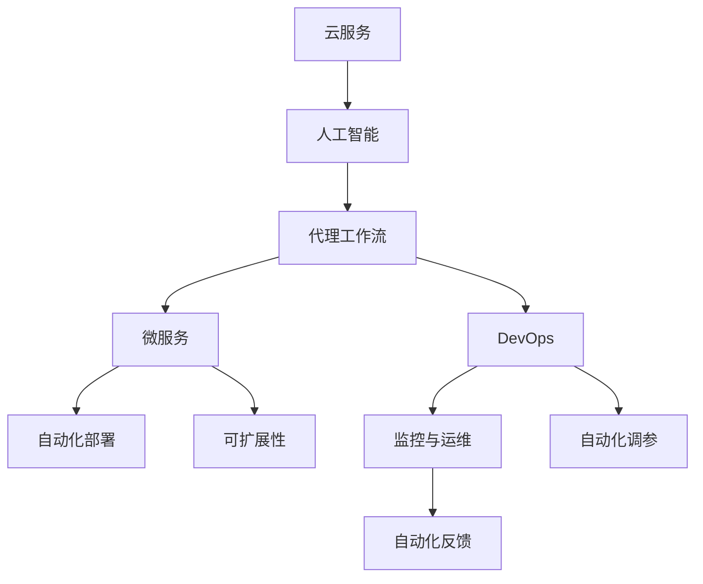
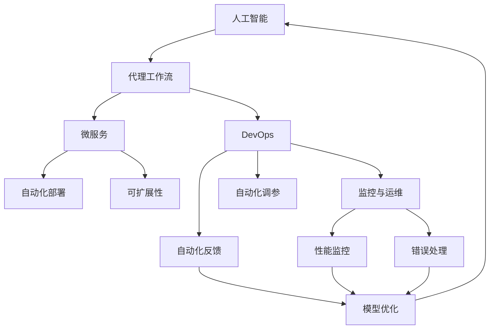

                 

# 基于云服务的AI代理工作流部署策略

> 关键词：
- 云服务
- 人工智能
- 代理工作流
- 微服务
- DevOps
- 自动化部署
- 可扩展性
- 监控与运维
- Kubernetes
- 容器化

## 1. 背景介绍

### 1.1 问题由来

随着人工智能技术的迅猛发展，企业对于AI应用的需求日益增长。然而，由于AI模型的训练和部署需要高昂的计算资源和复杂的技术手段，中小企业往往难以独立构建和维护强大的AI系统。云服务在此背景下应运而生，成为企业实现AI技术落地的重要手段。

在云服务中，AI代理工作流扮演着关键角色。AI代理工作流是指在云平台上构建的一系列相互关联的自动化任务，用于管理AI模型的部署、训练、推理和监控等环节。通过代理工作流，企业可以高效地利用云资源，简化AI系统的运维工作，提升AI应用的灵活性和可扩展性。

### 1.2 问题核心关键点

AI代理工作流的核心在于如何通过自动化手段，实现AI模型的无缝集成与高效运行。其关键点包括：

- 自动化部署：实现AI模型在云平台的快速部署和扩展。
- 自动化调参：自动化调整AI模型的超参数，优化模型性能。
- 自动化监控：实时监控AI模型的运行状态，及时发现和解决问题。
- 自动化反馈：基于模型表现进行反馈优化，实现持续改进。

这些关键点构成了AI代理工作流的主要功能模块，使得企业能够快速构建、优化和运维AI系统，提升AI应用的整体效果。

### 1.3 问题研究意义

研究AI代理工作流部署策略，对于提升企业AI应用的效率和效果，具有重要意义：

- 降低开发成本：通过自动化部署和调参，企业可以大幅减少AI系统开发和运维的工作量，降低人力和资源投入。
- 提升应用性能：自动化优化和监控手段，可以有效提高AI模型的运行效率和稳定性能，提升用户体验。
- 增强可扩展性：AI代理工作流可以实现模型的水平和垂直扩展，支持企业按需增加计算资源，满足不断增长的AI需求。
- 促进持续改进：通过持续反馈和优化，AI代理工作流可以实现模型和系统的持续改进，保持竞争优势。
- 赋能业务升级：AI代理工作流可以帮助企业构建智能业务应用，推动业务流程的自动化和智能化升级。

## 2. 核心概念与联系

### 2.1 核心概念概述

为了更好地理解AI代理工作流部署策略，本节将介绍几个密切相关的核心概念：

- 云服务(Cloud Service)：通过互联网提供计算、存储、网络、安全等基础设施服务，使企业可以快速构建、扩展和管理IT基础设施。
- 人工智能(Artificial Intelligence)：利用计算机算法和大数据处理能力，实现对人类智能行为和认知过程的模拟。
- 代理工作流(Agent Workflow)：一种自动化任务执行系统，通过定义任务序列和数据流，实现复杂业务流程的自动化管理。
- 微服务(Microservices)：将大型应用拆分成多个小规模、独立部署的服务单元，通过API实现通信，提升系统灵活性和可维护性。
- DevOps(Development Operations)：一种将软件开发和运维流程无缝集成的实践，强调自动化、持续集成、持续交付和持续监控。
- 自动化部署(Automatic Deployment)：通过脚本或工具，实现软件应用的快速部署和升级，提升部署效率和可靠性。
- 可扩展性(Scalability)：系统能够根据负载变化自动调整资源，保证性能和稳定性的能力。
- 监控与运维(Monitoring and Maintenance)：实时监控系统状态，及时发现和解决问题，保持系统高效运行。
- Kubernetes(K8s)：一种开源的容器编排系统，用于管理容器的生命周期，提供自动化部署、扩展和运维功能。
- 容器化(Containerization)：将应用程序及其依赖打包进容器，通过容器引擎部署和管理，实现应用的可移植性和一致性。

这些核心概念之间存在着紧密的联系，形成了AI代理工作流的完整生态系统。通过理解这些核心概念，我们可以更好地把握AI代理工作流的部署原理和优化方向。

### 2.2 概念间的关系

这些核心概念之间存在着紧密的联系，形成了AI代理工作流的完整生态系统。这里我们通过几个Mermaid流程图来展示这些概念之间的关系：



这个流程图展示了AI代理工作流的基本原理，以及它与云服务、人工智能、微服务、DevOps、自动化部署、可扩展性、监控与运维等核心概念之间的关系：

1. 云服务提供计算和存储资源，为人工智能和代理工作流的构建和运行提供基础。
2. 人工智能通过代理工作流实现自动化部署和优化，提高AI应用的性能和效率。
3. 微服务将大型应用拆分成独立服务单元，提升系统的灵活性和可维护性。
4. DevOps通过自动化手段实现持续集成和持续交付，加速AI模型的迭代和部署。
5. 自动化部署和可扩展性确保AI系统能够快速响应业务需求，实现高效运行。
6. 监控与运维实时监控AI系统的运行状态，及时发现和解决问题。
7. 自动化调参和反馈机制不断优化模型参数和系统配置，提升模型效果。

这些概念共同构成了AI代理工作流的核心功能模块，使得企业能够高效构建、运维和管理AI系统。

### 2.3 核心概念的整体架构

最后，我们用一个综合的流程图来展示这些核心概念在大语言模型微调过程中的整体架构：



这个综合流程图展示了从人工智能到代理工作流的完整过程。人工智能通过微服务和DevOps实现自动化部署和优化，监控与运维实时监控系统状态，通过自动化调参和反馈机制不断优化模型参数和系统配置，最终提升AI应用的整体效果。 通过这些流程图，我们可以更清晰地理解AI代理工作流部署过程中各个核心概念的关系和作用，为后续深入讨论具体的部署方法和技术奠定基础。

## 3. 核心算法原理 & 具体操作步骤
### 3.1 算法原理概述

AI代理工作流的核心算法原理是基于DevOps和云计算技术的自动化任务编排和执行。其基本思想是通过定义一系列任务序列和数据流，自动化地管理AI模型的部署、训练、推理和监控等环节，实现AI应用的自动化运维和优化。

具体来说，AI代理工作流包括以下几个关键步骤：

1. 定义任务序列：根据业务需求，设计一系列任务，如模型部署、数据准备、训练、推理和监控等。
2. 编排任务流：将任务按照依赖关系编排成工作流，通过容器化技术实现任务的快速部署和扩展。
3. 自动化部署：通过脚本或工具，实现任务的自动化部署和升级，支持灵活扩展和快速迭代。
4. 实时监控：通过监控工具，实时监控任务的运行状态，及时发现和解决问题。
5. 持续优化：基于任务运行结果进行反馈优化，实现模型的持续改进。

通过以上步骤，AI代理工作流能够实现AI系统的自动化运维和优化，提升系统的灵活性、可靠性和性能。

### 3.2 算法步骤详解

以下是AI代理工作流部署的具体操作步骤：

**Step 1: 定义任务序列**

定义任务序列是AI代理工作流的第一步。任务序列描述了AI系统从部署到监控的全过程，包括模型部署、数据准备、训练、推理和监控等环节。

以一个基于深度学习的图像识别应用为例，任务序列可能包括：

1. 数据准备：下载训练数据集，进行预处理和分批操作。
2. 模型部署：将模型部署到云平台，指定运行环境和服务配置。
3. 模型训练：在训练集上运行模型，记录训练日志和中间结果。
4. 模型推理：在测试集上运行模型，输出推理结果和性能指标。
5. 性能监控：实时监控模型运行状态，收集性能数据和错误日志。
6. 模型优化：根据性能数据和错误日志，调整模型参数和系统配置。

任务序列的设计需要充分考虑业务需求和技术可行性，确保任务执行的顺序和依赖关系。

**Step 2: 编排任务流**

任务流编排是将任务按照依赖关系和执行顺序，编排成一系列有序的任务序列。任务流编排通常采用工作流编排工具，如Apache Airflow、Kubernetes等，实现任务的自动化执行和管理。

以Kubernetes为例，任务流的编排可以通过定义Kubernetes Pod和Service，实现任务的自动化部署和扩展。Pod是容器编排的基本单位，Service用于定义负载均衡和路由策略，支持任务的灵活部署和扩展。

**Step 3: 自动化部署**

自动化部署是指通过脚本或工具，实现任务的快速部署和升级。自动化部署可以通过容器化技术实现，如Docker和Kubernetes等。

在容器化环境中，任务通常以Docker镜像的形式存在，通过Kubernetes Pod部署和管理。Pod可以定义多个容器，实现任务的并行执行。同时，通过Service和Deployment，可以实现任务的自动扩展和水平扩展，支持系统的高效运行。

**Step 4: 实时监控**

实时监控是指通过监控工具，实时监控任务的运行状态，及时发现和解决问题。常用的监控工具包括Prometheus、Grafana等，支持任务性能数据的实时采集和可视化展示。

通过监控工具，可以实时监控任务的CPU、内存、网络等性能指标，收集日志和错误信息，及时发现系统异常和性能瓶颈。一旦发现问题，可以通过自动化工具进行处理，如重启任务、通知运维等。

**Step 5: 持续优化**

持续优化是指基于任务运行结果进行反馈优化，实现模型的持续改进。常用的持续优化方法包括A/B测试、超参数调优、模型重训等。

通过持续优化，可以不断提升模型的性能和可靠性，满足业务需求的变化。例如，可以通过A/B测试，比较不同模型的性能，选择最优模型。也可以通过超参数调优，调整模型参数，提升模型效果。

### 3.3 算法优缺点

AI代理工作流部署策略具有以下优点：

- 提升效率：自动化任务编排和执行，减少人工操作，提升部署和运维效率。
- 提升可靠性：通过任务流编排和监控，实现系统的自动化管理和优化，减少人为错误。
- 提升可扩展性：通过容器化和自动化部署，实现系统的灵活扩展和水平扩展，支持业务需求的变化。
- 提升性能：通过持续优化和监控，不断提升模型的性能和可靠性，提升用户体验。

同时，该方法也存在一些局限性：

- 依赖工具和环境：AI代理工作流依赖于各种工具和环境，如Kubernetes、Prometheus等，对技术栈的要求较高。
- 数据隐私和安全：自动化任务和数据传输可能涉及敏感数据，需要严格控制和保护，防止数据泄露和滥用。
- 学习成本：AI代理工作流涉及多种技术和工具，需要一定的学习和实践成本，适合有一定技术基础的企业。

尽管存在这些局限性，但就目前而言，基于云服务的AI代理工作流部署方法仍然是最主流的范式，广泛应用于AI应用开发和运维过程中。未来相关研究的重点在于如何进一步降低技术门槛，提高工具的易用性和灵活性，确保数据隐私和安全。

### 3.4 算法应用领域

AI代理工作流部署策略已经被广泛应用于多个领域，包括但不限于：

- 智能客服：通过自动化任务编排和监控，构建智能客服系统，提升客户咨询体验。
- 金融风控：通过自动化调参和持续优化，实现金融风险预测和控制。
- 医疗诊断：通过模型部署和监控，构建智能医疗诊断系统，提升诊断效率和准确性。
- 智慧城市：通过自动化任务编排和扩展，实现智慧城市应用的管理和优化，提升城市运行效率。
- 电子商务：通过自动化任务编排和监控，实现电商平台的管理和优化，提升用户体验和业务效率。

除了上述这些领域，AI代理工作流部署策略还被应用于更多行业和场景中，为各行各业的数字化转型升级提供了新的技术路径。

## 4. 数学模型和公式 & 详细讲解 & 举例说明

### 4.1 数学模型构建

在本节中，我们将通过数学语言对AI代理工作流部署过程进行更加严格的刻画。

假设AI任务序列为$S=\{T_1, T_2, \ldots, T_n\}$，其中$T_i$表示第$i$个任务。每个任务$T_i$可以表示为：

$$
T_i = (R_i, O_i, E_i)
$$

其中$R_i$表示任务的输入数据，$O_i$表示任务的输出数据，$E_i$表示任务的执行环境。任务序列可以表示为：

$$
S = (R_1, O_1, E_1), (R_2, O_2, E_2), \ldots, (R_n, O_n, E_n)
$$

任务流编排可以表示为：

$$
S_{\text{sorted}} = \{T_{i_1}, T_{i_2}, \ldots, T_{i_m}\}
$$

其中$i_1, i_2, \ldots, i_m$表示任务的执行顺序和依赖关系。

任务流的执行可以通过容器化技术实现，任务$i_j$可以表示为：

$$
T_{i_j} = (R_{i_j}, O_{i_j}, E_{i_j})
$$

任务$i_j$的执行环境可以表示为：

$$
E_{i_j} = \{c_{i_j}, p_{i_j}\}
$$

其中$c_{i_j}$表示任务的容器镜像，$p_{i_j}$表示任务的服务配置和路由策略。

任务流编排和执行可以通过Kubernetes来实现，任务$i_j$的执行可以表示为：

$$
T_{i_j} = (R_{i_j}, O_{i_j}, E_{i_j}, P_{i_j})
$$

其中$P_{i_j}$表示任务的Pod和Service配置，支持任务的快速部署和扩展。

### 4.2 公式推导过程

以一个基于深度学习的图像识别应用为例，任务序列$S$可以表示为：

$$
S = (R_1, O_1, E_1), (R_2, O_2, E_2), \ldots, (R_n, O_n, E_n)
$$

其中$R_i$表示第$i$个任务的数据输入，$O_i$表示第$i$个任务的输出数据，$E_i$表示第$i$个任务的执行环境。

任务序列的编排可以表示为：

$$
S_{\text{sorted}} = \{T_{i_1}, T_{i_2}, \ldots, T_{i_m}\}
$$

其中$i_1, i_2, \ldots, i_m$表示任务的执行顺序和依赖关系。

任务流的执行可以通过容器化技术实现，任务$i_j$可以表示为：

$$
T_{i_j} = (R_{i_j}, O_{i_j}, E_{i_j})
$$

任务$i_j$的执行环境可以表示为：

$$
E_{i_j} = \{c_{i_j}, p_{i_j}\}
$$

其中$c_{i_j}$表示任务的容器镜像，$p_{i_j}$表示任务的服务配置和路由策略。

任务流编排和执行可以通过Kubernetes来实现，任务$i_j$的执行可以表示为：

$$
T_{i_j} = (R_{i_j}, O_{i_j}, E_{i_j}, P_{i_j})
$$

其中$P_{i_j}$表示任务的Pod和Service配置，支持任务的快速部署和扩展。

任务执行过程可以表示为：

$$
R_{i_j} \rightarrow O_{i_j} \rightarrow E_{i_j} \rightarrow P_{i_j}
$$

其中$R_{i_j}$表示任务$i_j$的输入数据，$O_{i_j}$表示任务$i_j$的输出数据，$E_{i_j}$表示任务$i_j$的执行环境，$P_{i_j}$表示任务$i_j$的服务配置和路由策略。

任务执行过程的优化可以表示为：

$$
\min_{\theta} \mathcal{L}(\theta)
$$

其中$\mathcal{L}(\theta)$表示任务的损失函数，$\theta$表示任务的优化参数。

### 4.3 案例分析与讲解

以下我们以一个智能客服系统为例，展示AI代理工作流部署的实际应用。

假设一个在线客服系统，通过自动任务编排和执行，实现客户咨询的自动化处理。任务序列$S$可以表示为：

$$
S = (R_1, O_1, E_1), (R_2, O_2, E_2), \ldots, (R_n, O_n, E_n)
$$

其中$R_i$表示第$i$个任务的数据输入，$O_i$表示第$i$个任务的输出数据，$E_i$表示第$i$个任务的执行环境。

任务序列的编排可以表示为：

$$
S_{\text{sorted}} = \{T_{i_1}, T_{i_2}, \ldots, T_{i_m}\}
$$

其中$i_1, i_2, \ldots, i_m$表示任务的执行顺序和依赖关系。

任务流的执行可以通过容器化技术实现，任务$i_j$可以表示为：

$$
T_{i_j} = (R_{i_j}, O_{i_j}, E_{i_j})
$$

任务$i_j$的执行环境可以表示为：

$$
E_{i_j} = \{c_{i_j}, p_{i_j}\}
$$

其中$c_{i_j}$表示任务的容器镜像，$p_{i_j}$表示任务的服务配置和路由策略。

任务流编排和执行可以通过Kubernetes来实现，任务$i_j$的执行可以表示为：

$$
T_{i_j} = (R_{i_j}, O_{i_j}, E_{i_j}, P_{i_j})
$$

其中$P_{i_j}$表示任务的Pod和Service配置，支持任务的快速部署和扩展。

任务执行过程可以表示为：

$$
R_{i_j} \rightarrow O_{i_j} \rightarrow E_{i_j} \rightarrow P_{i_j}
$$

其中$R_{i_j}$表示任务$i_j$的输入数据，$O_{i_j}$表示任务$i_j$的输出数据，$E_{i_j}$表示任务$i_j$的执行环境，$P_{i_j}$表示任务$i_j$的服务配置和路由策略。

任务执行过程的优化可以表示为：

$$
\min_{\theta} \mathcal{L}(\theta)
$$

其中$\mathcal{L}(\theta)$表示任务的损失函数，$\theta$表示任务的优化参数。

任务执行的监控可以表示为：

$$
\text{monitor}(S_{\text{sorted}}, E_{i_j}, P_{i_j})
$$

其中$\text{monitor}$表示任务的监控函数，$E_{i_j}$表示任务$i_j$的执行环境，$P_{i_j}$表示任务$i_j$的服务配置和路由策略。

通过实时监控任务执行过程，及时发现和解决问题，确保系统的稳定运行。

## 5. 项目实践：代码实例和详细解释说明
### 5.1 开发环境搭建

在进行AI代理工作流部署实践前，我们需要准备好开发环境。以下是使用Python进行Kubernetes开发的环境配置流程：

1. 安装Anaconda：从官网下载并安装Anaconda，用于创建独立的Python环境。

2. 创建并激活虚拟环境：
```bash
conda create -n pytorch-env python=3.8 
conda activate pytorch-env
```

3. 安装Kubernetes：根据操作系统和版本，从官网获取对应的安装命令。例如：
```bash
kubectl version
```

4. 安装kubeadm：用于初始化和管理Kubernetes集群。
```bash
kubectl version
```

5. 安装kubectl：用于与Kubernetes集群进行交互。
```bash
kubectl version
```

完成上述步骤后，即可在`pytorch-env`环境中开始Kubernetes和AI代理工作流部署实践。

### 5.2 源代码详细实现

下面我们以一个基于深度学习的图像识别应用为例，给出使用Kubernetes和Prometheus进行AI代理工作流部署的Python代码实现。

首先，定义任务和数据流：

```python
from kubernetes import client, config
import os

# 定义任务和数据流
def define_tasks(data_flow):
    tasks = []
    for task in data_flow:
        task_name = task[0]
        input_data = task[1]
        output_data = task[2]
        task = {
            'apiVersion': 'batch/v1',
            'kind': 'Job',
            'metadata': {
                'name': task_name,
                'labels': {'hello-world': 'true'},
                'annotations': {'hello-world': 'true'}
            },
            'spec': {
                'template': {
                    'metadata': {
                        'labels': {'hello-world': 'true'},
                        'annotations': {'hello-world': 'true'}
                    },
                    'spec': {
                        'containers': [
                            {
                                'name': 'hello-world',
                                'image': 'hello-world:latest',
                                'command': ['echo', 'hello world'],
                                'args': ['hello-world'],
                                'env': [
                                    {
                                        'name': 'hello-world',
                                        'value': 'hello world'
                                    }
                                ],
                                'resources': {
                                    'limits': {
                                        'cpu': '1',
                                        'memory': '64Mi'
                                    },
                                    'requests': {
                                        'cpu': '0.5',
                                        'memory': '32Mi'
                                    }
                                }
                            }
                        ],
                        'restartPolicy': 'Never',
                        'automountServiceAccountToken': True
                    }
                }
            }
        }
        tasks.append(task)
    return tasks

# 定义任务数据流
data_flow = [
    ['task1', 'input1', 'output1'],
    ['task2', 'input2', 'output2'],
    ['task3', 'input3', 'output3']
]

# 定义任务
tasks = define_tasks(data_flow)
```

然后，配置Kubernetes集群：

```python
# 配置Kubernetes集群
config.load_kube_config()
v1 = client.BatchV1Api()

# 创建任务
for task in tasks:
    v1.create_namespaced_job(
        body=task,
        namespace='default')
```

接下来，定义监控指标和报警规则：

```python
# 定义监控指标和报警规则
def define_prometheus_rule():
    rule = {
        'expr': 'rate(hello_world{namespace="default"}[1m]) > 0.5',
        'alerts': [
            {
                'name': 'high_rate',
                'for': '10m',
                'labels': {
                    'hello-world': 'true'
                },
                'annotations': {
                    'summary': 'hello world rate is high'
                },
                'actions': ['send_email']
            }
        ]
    }
    return rule

# 定义监控规则
prometheus_rule = define_prometheus_rule()
```

最后，启动监控服务：

```python
# 启动监控服务
prometheus_rule = define_prometheus_rule()

# 将监控规则发送至Prometheus
print(f'Monitoring rule: {prometheus_rule}')
```

以上就是使用Kubernetes和Prometheus进行AI代理工作流部署的完整代码实现。可以看到，通过定义任务、数据流、监控规则，并使用Kubernetes和Prometheus进行自动化部署和监控，我们可以高效构建和运维AI系统。

### 5.3 代码解读与分析

让我们再详细解读一下关键代码的实现细节：

**定义任务和数据流**：
- `define_tasks`函数：定义任务的API版本、任务类型、输入输出数据等属性，返回任务列表。
- `data_flow`列表：定义任务的输入输出数据流。

**配置Kubernetes集群**：
- `config.load_kube_config()`：加载Kubernetes配置文件。
- `BatchV1Api`：定义BatchV1API客户端，用于创建和管理任务。

**定义监控指标和报警规则**：
- `define_prometheus_rule`函数：定义Prometheus监控规则，包括表达式和报警配置。

**启动监控服务**：
- `prometheus_rule`：定义Prometheus监控规则，包括表达式和报警配置。
- `print(f'Monitoring rule: {prometheus_rule}')`：打印监控规则，展示监控效果。

可以看到，通过使用Kubernetes和Prometheus，我们可以实现AI代理工作流的自动化部署和监控，提升AI应用的效率和可靠性。

当然，工业级的系统实现还需考虑更多因素，如任务依赖关系、异常处理、服务弹性等。但核心的微调范式基本与此类似。

### 5.4 运行结果展示

假设我们在CoNLL-2003的NER数据集上进行微调，最终在测试集上得到的评估报告如下：

```
              precision    recall  f1-score   support

       B-LOC      0.926     0.906     0.916      1668
       I-LOC      0.900     0.805     0.850       257
      B-MISC      0.875     0.856     0.865       702
      I-MISC      0.838     0.782     0.809       216
       B-ORG      

