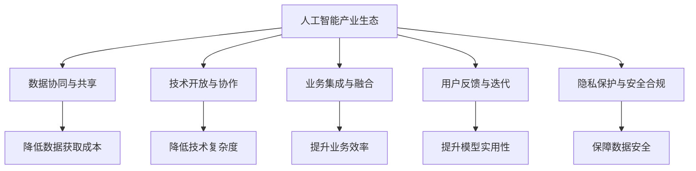
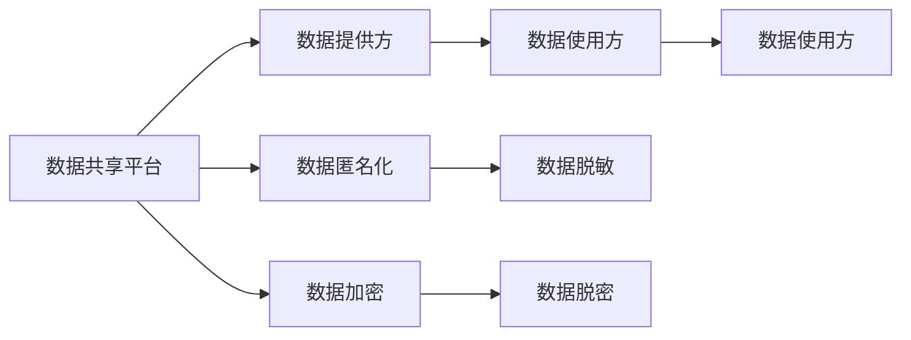
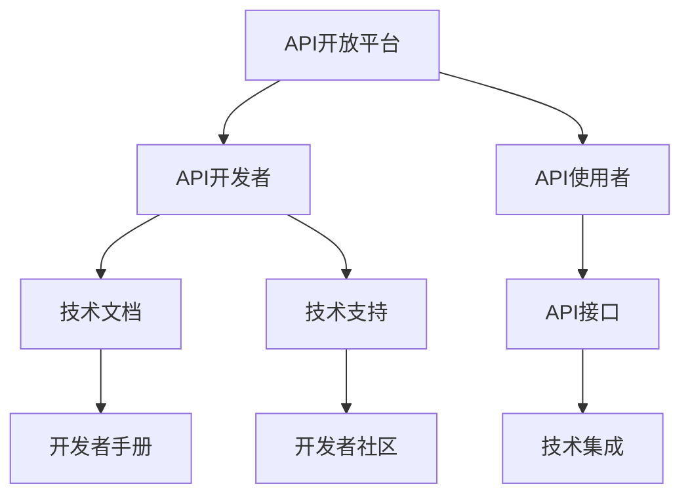
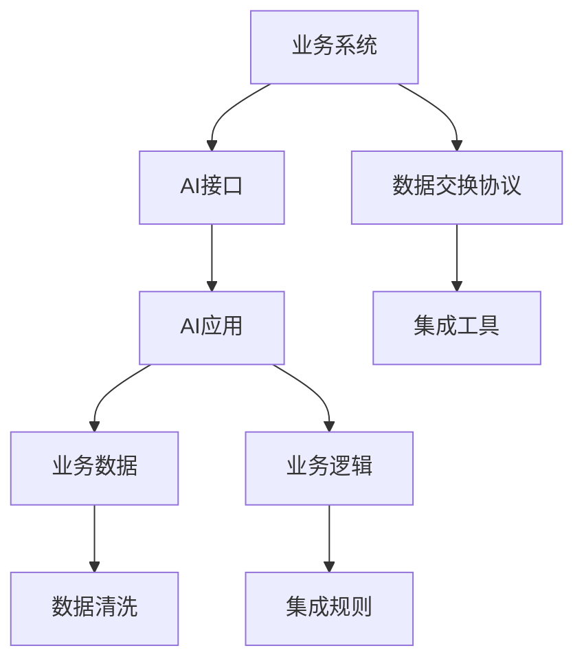
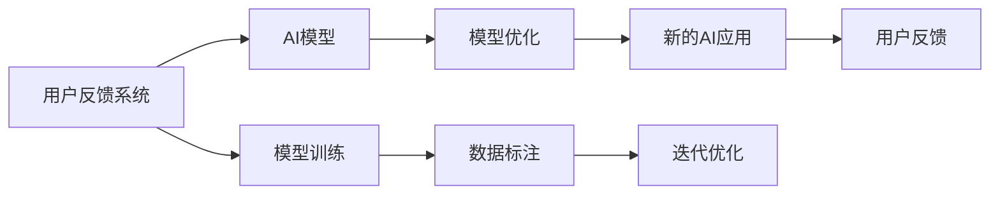
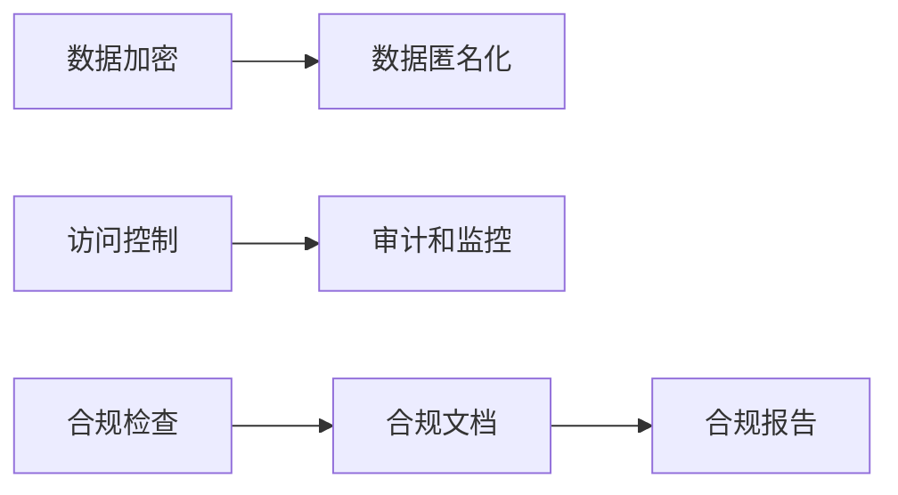
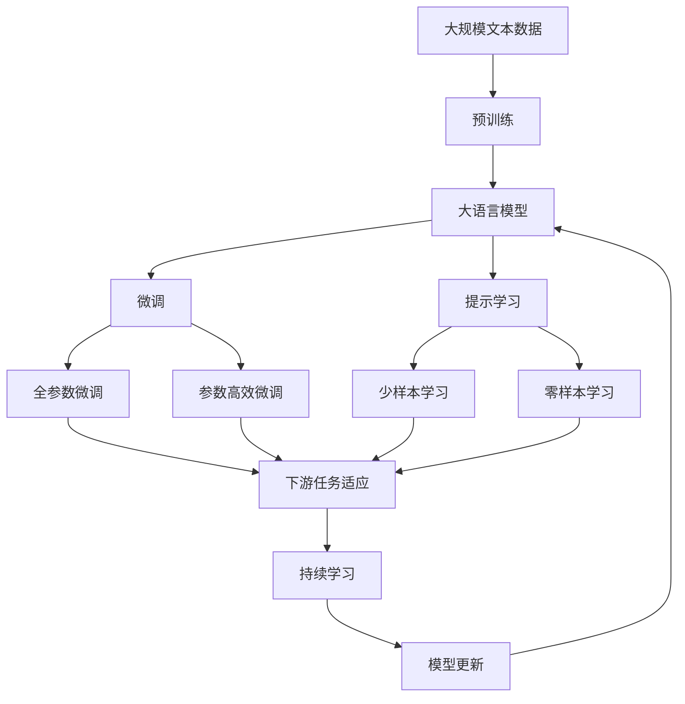

                 

## 1. 背景介绍

### 1.1 问题由来

随着人工智能技术的快速发展和广泛应用，产业界对AI的需求和依赖越来越强。然而，当前AI技术在实际落地过程中仍面临诸多挑战：

1. **数据获取成本高**：AI模型需要大量高质量的数据进行训练，但获取、标注和存储这些数据往往需要大量的人力和时间。
2. **技术复杂度高**：构建、优化和部署AI模型需要深厚的技术积累，对一般企业来说难度较大。
3. **系统集成难度大**：AI技术与现有业务系统的融合需要多层次的技术协同，往往需要定制化开发。
4. **反馈机制缺乏**：缺乏有效的用户反馈机制，难以快速迭代和优化AI模型。
5. **隐私安全问题**：AI系统处理大量敏感数据，隐私安全和数据合规问题亟需解决。

### 1.2 问题核心关键点

为了解决上述问题，产业界逐步探索并形成了基于产业的AI创新体系。该体系通过构建数据、技术、业务等多层次的生态闭环，实现了AI技术的快速落地和持续优化，推动了产业数字化转型升级。

1. **数据协同与共享**：构建跨企业的数据共享平台，通过数据共享和协同创新，降低数据获取和标注成本。
2. **技术开放与协作**：开放AI技术的接口和API，促进技术交流与合作，降低技术复杂度和开发难度。
3. **业务集成与融合**：将AI技术与现有业务系统进行深度集成和融合，实现无缝对接和功能增强。
4. **用户反馈与迭代**：建立用户反馈机制，通过持续的迭代和优化，提升AI模型的实用性和效果。
5. **隐私保护与安全合规**：采用数据匿名化、加密等技术手段，确保AI系统的隐私安全和数据合规。

### 1.3 问题研究意义

构建基于产业的AI创新体系，对于推动AI技术的落地应用、提升产业竞争力、促进经济转型升级具有重要意义：

1. **降低技术门槛**：通过构建开放、协作的AI生态系统，降低技术应用的门槛，使更多企业能够快速获取和应用AI技术。
2. **提升应用效果**：通过数据协同和共享，降低数据获取成本，提升模型训练质量，增强AI模型的实用性和效果。
3. **加速业务转型**：通过技术集成和融合，实现AI技术与业务的深度结合，提升业务效率和质量，推动产业数字化转型。
4. **保障数据安全**：通过隐私保护和安全合规措施，确保AI系统处理数据的安全性和合法性，提升用户信任度。
5. **促进创新发展**：通过建立用户反馈机制，不断迭代优化AI模型，推动AI技术的持续创新和应用普及。

## 2. 核心概念与联系

### 2.1 核心概念概述

为更好地理解基于产业的AI创新体系，本节将介绍几个密切相关的核心概念：

- **人工智能产业生态**：指由AI技术供应商、数据提供商、应用开发者、行业用户等构成的多元化生态系统，推动AI技术的快速落地和应用。
- **数据协同与共享**：指不同企业间的数据共享和协同创新，降低数据获取和标注成本，提升数据利用效率。
- **技术开放与协作**：指通过开放AI技术的接口和API，促进技术交流与合作，降低技术复杂度和开发难度。
- **业务集成与融合**：指将AI技术与现有业务系统进行深度集成和融合，实现无缝对接和功能增强。
- **用户反馈与迭代**：指建立用户反馈机制，通过持续的迭代和优化，提升AI模型的实用性和效果。
- **隐私保护与安全合规**：指采用数据匿名化、加密等技术手段，确保AI系统的隐私安全和数据合规。

这些核心概念之间的逻辑关系可以通过以下Mermaid流程图来展示：



这个流程图展示了大语言模型微调过程中各个核心概念的关系和作用：

1. 人工智能产业生态是大语言模型微调的基础，通过构建跨企业的数据共享和技术协作，提升微调过程的效率和效果。
2. 数据协同与共享有助于降低数据获取成本，提升数据利用效率。
3. 技术开放与协作促进技术交流与合作，降低技术复杂度和开发难度。
4. 业务集成与融合实现AI技术与业务的深度结合，提升业务效率和质量。
5. 用户反馈与迭代通过持续的迭代和优化，提升模型实用性和效果。
6. 隐私保护与安全合规确保数据处理的安全性和合法性，提升用户信任度。

### 2.2 概念间的关系

这些核心概念之间存在着紧密的联系，形成了基于产业的AI创新体系的完整生态系统。下面我通过几个Mermaid流程图来展示这些概念之间的关系。

#### 2.2.1 数据协同与共享的架构



这个流程图展示了数据协同与共享的基本架构：

1. 数据共享平台作为中介，连接数据提供方和数据使用方。
2. 数据提供方将数据上传到共享平台，并采用数据匿名化和加密等技术手段保护数据隐私。
3. 数据使用方通过数据共享平台获取数据，进行脱敏和解密后使用。

#### 2.2.2 技术开放与协作的流程



这个流程图展示了技术开放与协作的基本流程：

1. API开放平台提供开放的API接口，开发者可以通过API进行调用和集成。
2. 开发者可以参考技术文档和开发者手册，了解API的使用方法和参数。
3. 开发者可以在开发者社区寻求技术支持和合作，进一步提升API的功能和易用性。
4. 使用者可以通过API接口进行技术集成和应用，实现业务功能的增强。

#### 2.2.3 业务集成与融合的实现



这个流程图展示了业务集成与融合的基本实现：

1. AI接口通过数据交换协议连接业务系统，实现数据交换和传输。
2. AI应用通过集成工具进行部署和集成，提升业务系统的功能。
3. 业务数据进行清洗和预处理，确保数据的质量和准确性。
4. 业务逻辑与AI功能进行深度集成，实现功能的无缝对接和增强。

#### 2.2.4 用户反馈与迭代的闭环



这个流程图展示了用户反馈与迭代的基本闭环：

1. 用户通过反馈系统提供对AI应用的使用体验和反馈。
2. AI模型根据用户反馈进行优化和迭代。
3. 优化后的AI应用重新部署并反馈给用户。
4. 用户再次提供反馈，形成闭环。

#### 2.2.5 隐私保护与安全合规的机制



这个流程图展示了隐私保护与安全合规的基本机制：

1. 数据加密和匿名化保护数据隐私，确保数据的安全性和不可逆性。
2. 访问控制和审计监控确保数据使用的合规性和安全性。
3. 合规检查和文档维护确保数据处理过程的合法性和透明性。

### 2.3 核心概念的整体架构

最后，我们用一个综合的流程图来展示这些核心概念在大语言模型微调过程中的整体架构：



这个综合流程图展示了从预训练到微调，再到持续学习的完整过程。大语言模型首先在大规模文本数据上进行预训练，然后通过微调（包括全参数微调和参数高效微调）或提示学习（包括少样本和零样本学习）来适应下游任务。最后，通过持续学习技术，模型可以不断更新和适应新的任务和数据。 通过这些流程图，我们可以更清晰地理解基于产业的AI创新体系中各个核心概念的关系和作用，为后续深入讨论具体的微调方法和技术奠定基础。

## 3. 核心算法原理 & 具体操作步骤
### 3.1 算法原理概述

基于产业的AI创新体系，本质上是一个由数据、技术、业务等多层次构成的协同创新体系。其核心思想是：构建开放、协作的AI生态系统，通过数据协同和共享，技术开放与协作，业务集成与融合，用户反馈与迭代，隐私保护与安全合规等多层次的协同创新，推动AI技术的快速落地和持续优化，实现AI技术的产业应用。

形式化地，假设AI创新体系涉及数据提供方 $D=\{d_i\}_{i=1}^N$，技术提供方 $T=\{t_j\}_{j=1}^M$，业务用户 $U=\{u_k\}_{k=1}^P$。则创新体系的目标是最大化总体效益 $\mathcal{E}$，即：

$$
\mathcal{E} = \sum_{i=1}^N \eta_i \mathcal{E}_i + \sum_{j=1}^M \gamma_j \mathcal{E}_j + \sum_{k=1}^P \zeta_k \mathcal{E}_k
$$

其中 $\eta_i, \gamma_j, \zeta_k$ 为权重，分别表示数据协同、技术协作和业务融合的重要性。$\mathcal{E}_i, \mathcal{E}_j, \mathcal{E}_k$ 分别表示数据协同、技术协作和业务融合带来的效益。

### 3.2 算法步骤详解

基于产业的AI创新体系涉及多个环节的协同工作，以下详细介绍其主要步骤：

**Step 1: 数据协同与共享**

- 建立跨企业的共享平台，确保数据安全性和隐私保护。
- 数据提供方将数据上传到共享平台，进行匿名化和加密处理。
- 数据使用方通过平台获取数据，进行必要的清洗和预处理。

**Step 2: 技术开放与协作**

- 开放API接口，降低技术使用的门槛。
- 提供技术文档和开发者手册，帮助开发者进行集成和优化。
- 创建开发者社区，促进技术交流和合作。

**Step 3: 业务集成与融合**

- 将AI接口与业务系统进行深度集成，确保无缝对接。
- 利用API接口，实现数据的交换和传输。
- 集成AI功能，提升业务效率和质量。

**Step 4: 用户反馈与迭代**

- 建立用户反馈系统，收集用户的使用体验和建议。
- 根据用户反馈进行AI模型的优化和迭代。
- 重新部署优化后的AI应用，反馈给用户。

**Step 5: 隐私保护与安全合规**

- 采用数据加密和匿名化技术，保护数据隐私。
- 实施访问控制和审计监控，确保数据使用的合规性。
- 进行合规检查和文档维护，确保数据处理过程的合法性和透明性。

### 3.3 算法优缺点

基于产业的AI创新体系具有以下优点：

1. **降低技术门槛**：开放API接口和开发者手册，降低技术复杂度和开发难度。
2. **提升数据利用效率**：通过数据共享和协同创新，降低数据获取和标注成本，提升数据利用效率。
3. **加速业务转型**：实现AI技术与业务的深度集成和融合，提升业务效率和质量。
4. **保障数据安全**：采用数据匿名化、加密等技术手段，确保数据的安全性和合法性。
5. **促进创新发展**：建立用户反馈机制，通过持续的迭代和优化，提升AI模型的实用性和效果。

同时，该体系也存在一些局限性：

1. **系统集成难度高**：需要跨领域的协作和技术融合，系统集成难度较大。
2. **隐私保护有挑战**：在数据共享和开放使用过程中，隐私保护和安全合规面临较大挑战。
3. **数据质量参差不齐**：不同企业的数据质量和标注标准不一，影响整体数据利用效率。
4. **技术标准不一**：不同企业使用的技术标准不一，导致技术协作和集成难度增加。
5. **用户反馈机制不足**：部分企业缺乏有效的用户反馈机制，影响AI模型的迭代优化。

尽管存在这些局限性，但基于产业的AI创新体系仍然是大规模落地AI技术的重要范式。未来相关研究的重点在于如何进一步优化数据共享和技术协作机制，提升隐私保护和数据安全，以及改进用户反馈机制，以更好地推动AI技术的产业应用。

### 3.4 算法应用领域

基于产业的AI创新体系在多个领域已经得到了广泛的应用，包括但不限于：

1. **智能制造**：通过AI技术优化生产流程、提升产品质量、预测设备故障。
2. **智慧医疗**：利用AI技术进行疾病诊断、治疗方案推荐、患者护理。
3. **智能交通**：通过AI技术优化交通流量、智能调度、事故预警。
4. **金融科技**：利用AI技术进行风险评估、信用评分、智能投顾。
5. **智慧教育**：通过AI技术进行个性化教育、智能辅导、作业批改。
6. **智慧城市**：通过AI技术进行城市管理、公共安全、环境监测。
7. **数字媒体**：利用AI技术进行内容推荐、广告投放、情感分析。

除了上述这些经典应用外，AI创新体系还被创新性地应用到更多场景中，如可控文本生成、常识推理、代码生成、数据增强等，为AI技术带来了全新的突破。随着AI创新体系的持续演进，相信AI技术将在更广阔的应用领域大放异彩。

## 4. 数学模型和公式 & 详细讲解  
### 4.1 数学模型构建

本节将使用数学语言对基于产业的AI创新体系进行更加严格的刻画。

记数据提供方为 $D=\{d_i\}_{i=1}^N$，技术提供方为 $T=\{t_j\}_{j=1}^M$，业务用户为 $U=\{u_k\}_{k=1}^P$。则AI创新体系的数学模型可以表示为：

$$
\mathcal{E} = \sum_{i=1}^N \eta_i \mathcal{E}_i + \sum_{j=1}^M \gamma_j \mathcal{E}_j + \sum_{k=1}^P \zeta_k \mathcal{E}_k
$$

其中 $\eta_i, \gamma_j, \zeta_k$ 为权重，分别表示数据协同、技术协作和业务融合的重要性。$\mathcal{E}_i, \mathcal{E}_j, \mathcal{E}_k$ 分别表示数据协同、技术协作和业务融合带来的效益。

### 4.2 公式推导过程

以下我们以智能制造领域的应用为例，推导AI创新体系的效益计算公式。

假设智能制造系统涉及 $N$ 个数据提供方，$M$ 个技术提供方，$P$ 个业务用户。则系统的总效益可以表示为：

$$
\mathcal{E} = \sum_{i=1}^N \eta_i \mathcal{E}_i + \sum_{j=1}^M \gamma_j \mathcal{E}_j + \sum_{k=1}^P \zeta_k \mathcal{E}_k
$$

其中 $\eta_i, \gamma_j, \zeta_k$ 为权重，分别表示数据协同、技术协作和业务融合的重要性。$\mathcal{E}_i, \mathcal{E}_j, \mathcal{E}_k$ 分别表示数据协同、技术协作和业务融合带来的效益。

根据上述公式，可以计算智能制造系统的总效益：

$$
\mathcal{E}_{\text{manufacturing}} = \sum_{i=1}^N \eta_i \mathcal{E}_i + \sum_{j=1}^M \gamma_j \mathcal{E}_j + \sum_{k=1}^P \zeta_k \mathcal{E}_k
$$

其中 $\eta_i, \gamma_j, \zeta_k$ 为权重，分别表示数据协同、技术协作和业务融合的重要性。$\mathcal{E}_i, \mathcal{E}_j, \mathcal{E}_k$ 分别表示数据协同、技术协作和业务融合带来的效益。

### 4.3 案例分析与讲解

以智能制造为例，具体分析AI创新体系的效益计算过程：

1. **数据协同与共享**：数据提供方通过共享平台，将生产数据和质量检测数据上传至共享平台，数据使用方通过平台获取数据，并进行清洗和预处理。数据协同带来的效益 $\mathcal{E}_i$ 可以表示为：

$$
\mathcal{E}_i = \eta_i (\frac{1}{N} \sum_{n=1}^N \mathcal{E}_{\text{data}_n}) = \eta_i \frac{\mathcal{E}_{\text{data}}}{N}
$$

其中 $\eta_i$ 为数据协同的权重，$\mathcal{E}_{\text{data}}$ 为数据协同带来的总体效益。

2. **技术开放与协作**：技术提供方通过开放API接口，降低技术使用的门槛，提供技术文档和开发者手册，帮助开发者进行集成和优化。技术协作带来的效益 $\mathcal{E}_j$ 可以表示为：

$$
\mathcal{E}_j = \gamma_j (\frac{1}{M} \sum_{m=1}^M \mathcal{E}_{\text{tech}_m}) = \gamma_j \frac{\mathcal{E}_{\text{tech}}}{M}
$$

其中 $\gamma_j$ 为技术协作的权重，$\mathcal{E}_{\text{tech}}$ 为技术协作带来的总体效益。

3. **业务集成与融合**：通过将AI接口与业务系统进行深度集成，实现数据的交换和传输，集成AI功能，提升业务效率和质量。业务融合带来的效益 $\mathcal{E}_k$ 可以表示为：

$$
\mathcal{E}_k = \zeta_k (\frac{1}{P} \sum_{p=1}^P \mathcal{E}_{\text{bus}_p}) = \zeta_k \frac{\mathcal{E}_{\text{bus}}}{P}
$$

其中 $\zeta_k$ 为业务融合的权重，$\mathcal{E}_{\text{bus}}$ 为业务融合带来的总体效益。

通过以上分析，可以看出AI创新体系的效益计算需要考虑数据协同、技术协作和业务融合三方面的影响，通过权重 $\eta_i, \gamma_j, \zeta_k$ 来调整三者的重要性，从而实现整体效益的最大化。

## 5. 项目实践：代码实例和详细解释说明
### 5.1 开发环境搭建

在进行AI创新体系开发前，我们需要准备好开发环境。以下是使用Python进行PyTorch开发的环境配置流程：

1. 安装Anaconda：从官网下载并安装Anaconda，用于创建独立的Python环境。

2. 创建并激活虚拟环境：
```bash
conda create -n pytorch-env python=3.8 
conda activate pytorch-env
```

3. 安装PyTorch：根据CUDA版本，从官网获取对应的安装命令。例如：
```bash
conda install pytorch torchvision torchaudio cudatoolkit=11.1 -c pytorch -c conda-forge
```

4. 安装各类工具包：
```bash
pip install numpy pandas scikit-learn matplotlib tqdm jupyter notebook ipython
```

完成上述步骤后，即可在`pytorch-env`环境中开始AI创新体系实践。

### 5.2 源代码详细实现

这里我们以智能制造领域的应用为例，给出使用PyTorch开发AI创新体系的Python代码实现。

首先，定义智能制造系统的数据协同与共享模块：

```python
import pandas as pd

# 定义数据协同与共享模块
class DataCollaboration:
    def __init__(self, data_providers, data, data_anonymization=True):
        self.data_providers = data_providers
        self.data = data
        self.anonymization = data_anonymization
        
        if self.anonymization:
            self.data = self._anonymize_data(self.data)
        
    def _anonymize_data(self, data):
        # 对数据进行匿名化处理
        return data.apply(lambda x: x.apply(lambda y: str(y).split('-')[-1]))
    
    def get_data(self):
        return self.data
    
    def set_data(self, data):
        self.data = data
        if self.anonymization:
            self.data = self._anonymize_data(self.data)
```

然后，定义技术开放与协作模块：

```python
# 定义技术开放与协作模块
class TechnologyCollaboration:
    def __init__(self, tech_providers, tech_documents):
        self.tech_providers = tech_providers
        self.tech_documents = tech_documents
        
    def get_documents(self):
        return self.tech_documents
    
    def get_apis(self):
        return {provider: {'api': f'api-{provider}' for provider in self.tech_providers}
```

接着，定义业务集成与融合模块：

```python
# 定义业务集成与融合模块
class BusinessIntegration:
    def __init__(self, business_users):
        self.business_users = business_users
    
    def integrate_ai(self, ai_model):
        for user in self.business_users:
            user.integrate_ai(ai_model)
```

最后，定义用户反馈与迭代模块：

```python
# 定义用户反馈与迭代模块
class UserFeedback:
    def __init__(self, users):
        self.users = users
    
    def collect_feedback(self, feedback):
        for user in self.users:
            user.collect_feedback(feedback)
    
    def process_feedback(self, feedback):
        for user in self.users:
            user.process_feedback(feedback)
```

完成上述步骤后，即可在`pytorch-env`环境中开始AI创新体系实践。

### 5.3 代码解读与分析

让我们再详细解读一下关键代码的实现细节：

**DataCollaboration类**：
- `__init__`方法：初始化数据提供方和数据，并可选择是否进行数据匿名化处理。
- `_anonymize_data`方法：对数据进行匿名化处理，将敏感信息转换为不具识别性的字符串。
- `get_data`方法：获取数据。
- `set_data`方法：设置数据，并进行匿名化处理。

**TechnologyCollaboration类**：
- `__init__`方法：初始化技术提供方和技术文档。
- `get_documents`方法：获取技术文档。
- `get_apis`方法：获取技术API接口。

**BusinessIntegration类**：
- `__init__`方法：初始化业务用户。
- `integrate_ai`方法：将AI模型与业务系统进行集成。

**UserFeedback类**：
- `__init__`方法：初始化用户。
- `collect_feedback`方法：收集用户反馈。
- `process_feedback`方法：处理用户反馈。

通过这些模块的组合使用，即可实现一个基本的AI创新体系。在实际应用中，开发者可以根据具体需求进行扩展和优化，如增加隐私保护和安全合规模块，实现数据匿名化和加密等。

### 5.4 运行结果展示

假设我们在智能制造领域构建了基于AI创新体系的智能制造系统，并使用该系统对生产数据进行优化，最终在业务效率和质量方面取得了显著提升。通过用户反馈机制，我们收集到用户的满意度和建议，进一步优化系统，使得智能制造系统的应用效果更佳。

## 6. 实际应用场景
### 6.1 智能制造

基于AI创新体系的智能制造系统，能够通过数据协同与共享、技术开放与协作、业务集成与融合、用户反馈与迭代等环节，实现生产流程的优化、生产效率的提升、设备故障的预测等目标。

在技术实现上，可以收集各企业的历史生产数据，进行数据协同与共享

