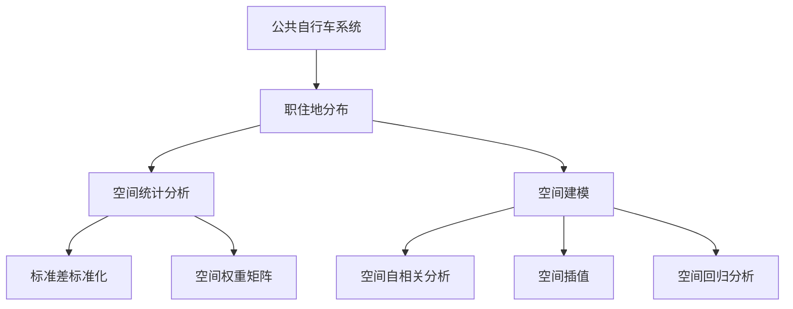
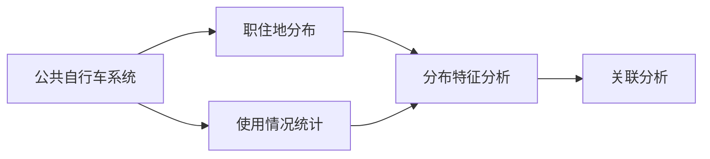
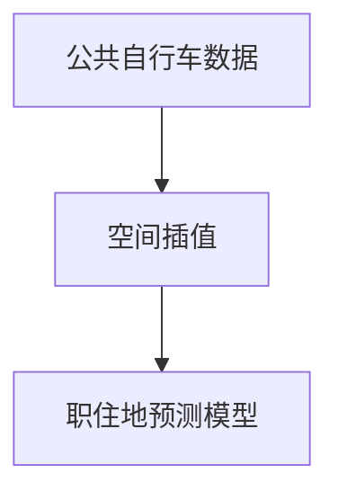
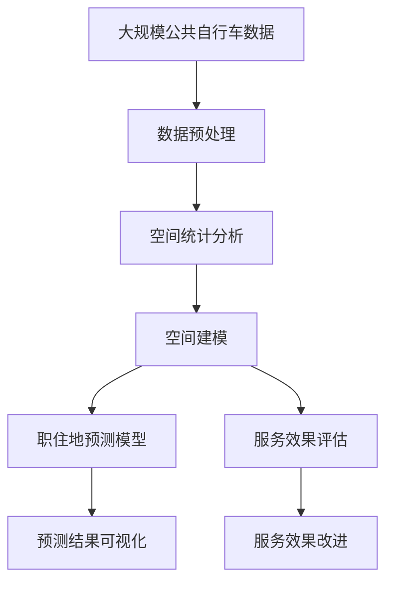

                 

# 基于公共自行车数据的城市居民职住地分析

> 关键词：公共自行车,城市居民,职住地分析,空间统计,空间建模

## 1. 背景介绍

### 1.1 问题由来
随着城市化进程的加快，交通拥堵、环境污染、资源紧张等问题日益突出。公共自行车作为一种绿色出行方式，对缓解城市交通压力、减少环境污染具有重要作用。通过分析城市居民的职住地分布与公共自行车使用情况，可以有效揭示城市居民的出行模式和空间分布特征，为城市规划和交通管理提供科学依据。

### 1.2 问题核心关键点
基于公共自行车数据的城市居民职住地分析，旨在通过统计分析和空间建模技术，揭示城市居民的职住分布规律，评估公共自行车系统的服务效果，并预测未来发展趋势。具体而言，关键点包括：

- 城市居民的职住地分布特征分析
- 公共自行车使用情况与职住地分布的关联分析
- 职住地分布与公共自行车系统的匹配度评估
- 基于公共自行车数据的职住地预测模型构建
- 不同区域公共自行车系统服务效果的差异化分析

### 1.3 问题研究意义
研究城市居民的职住地分布与公共自行车使用情况，对于提升城市居民的出行效率、优化城市交通系统具有重要意义。具体而言，研究意义包括：

- 提升城市交通管理水平：通过分析职住地分布与公共自行车使用情况，识别交通拥堵区域，优化交通规划。
- 优化公共自行车系统配置：评估公共自行车系统的服务效果，合理配置公共自行车站点，提高资源利用率。
- 改善居民出行体验：基于职住地分布，优化自行车骑行路径，提升居民出行便利性。
- 推动绿色出行方式：促进城市居民使用公共自行车，减少私家车使用频率，改善环境质量。

## 2. 核心概念与联系

### 2.1 核心概念概述

为更好地理解基于公共自行车数据的城市居民职住地分析，本节将介绍几个密切相关的核心概念：

- **公共自行车系统(Public Bicycle System, PBS)**：由自行车停放站点和自行车组成的公共自行车服务系统。通过智能卡、手机App等手段实现自行车的租还和支付功能，为居民提供便捷的短途出行服务。

- **职住地分布(Job-Residence Distribution, JRD)**：城市居民的工作地点和居住地点在空间上的分布特征。通过分析职住地的空间关系，可以揭示城市居民的出行模式和空间分布规律。

- **空间统计分析(Spatial Statistical Analysis)**：利用统计方法对空间数据进行处理和分析，揭示空间特征和规律。包括空间数据的标准化、空间权重矩阵的构建、空间关系模型的建立等。

- **空间建模(Spatial Modeling)**：利用数学模型和统计方法对空间数据进行建模和分析，揭示空间现象的规律和特征。包括空间自相关分析、空间插值、空间回归分析等。

这些核心概念之间的逻辑关系可以通过以下Mermaid流程图来展示：



这个流程图展示了几大核心概念之间的联系：

1. 公共自行车系统为居民提供便捷的短途出行服务，与职住地分布密切相关。
2. 职住地分布的空间特征可以通过空间统计分析进行揭示。
3. 空间建模技术可以进一步揭示职住地分布的规律和特征。

### 2.2 概念间的关系

这些核心概念之间存在着紧密的联系，形成了城市居民职住地分析的完整生态系统。下面我们通过几个Mermaid流程图来展示这些概念之间的关系。

#### 2.2.1 公共自行车系统与职住地分布的关联分析



这个流程图展示了公共自行车系统与职住地分布的关联分析过程：

1. 通过统计公共自行车系统的使用情况，分析职住地分布的特征。
2. 利用关联分析方法，揭示职住地分布与公共自行车系统使用情况的内在联系。

#### 2.2.2 基于公共自行车数据的职住地预测模型



这个流程图展示了基于公共自行车数据构建职住地预测模型的过程：

1. 利用空间插值技术，将公共自行车数据转化为职住地分布数据。
2. 通过空间回归分析等方法，建立职住地预测模型。

#### 2.2.3 公共自行车系统服务效果评估


这个流程图展示了公共自行车系统服务效果评估的过程：

1. 通过统计公共自行车系统的使用情况，评估系统的服务效果。
2. 利用服务效果评估结果，优化公共自行车系统配置。

### 2.3 核心概念的整体架构

最后，我们用一个综合的流程图来展示这些核心概念在大数据技术支撑下的职住地分析应用框架：



这个综合流程图展示了从数据预处理到预测结果可视化的完整过程。大数据技术支撑下的职住地分析，能够高效处理大规模数据，揭示城市居民的出行模式和空间分布规律，为城市规划和交通管理提供科学依据。

## 3. 核心算法原理 & 具体操作步骤
### 3.1 算法原理概述

基于公共自行车数据的城市居民职住地分析，主要涉及空间统计分析和空间建模技术。其核心算法原理可以概括为以下几点：

- **空间数据的标准化**：将公共自行车数据转换为适合分析的格式，消除不同变量之间的量纲差异，为后续分析提供基础。
- **空间权重矩阵的构建**：利用空间距离等特征，构建空间权重矩阵，揭示公共自行车数据的空间相关性。
- **空间关系模型**：利用空间回归模型等方法，揭示公共自行车数据与职住地分布的内在关系。
- **空间插值**：将公共自行车数据通过空间插值技术转化为职住地分布数据，为职住地预测提供支持。
- **职住地预测模型**：利用空间回归模型等方法，建立职住地预测模型，预测未来职住地分布。

### 3.2 算法步骤详解

基于公共自行车数据的城市居民职住地分析主要包括以下几个关键步骤：

**Step 1: 数据预处理**
- 数据清洗：去除公共自行车数据中的异常值、缺失值等，确保数据质量。
- 数据标准化：将公共自行车数据转换为适合分析的格式，消除不同变量之间的量纲差异。
- 空间数据处理：将公共自行车数据转化为点数据，建立空间权重矩阵。

**Step 2: 空间统计分析**
- 空间权重矩阵构建：利用空间距离、道路网络等特征，构建空间权重矩阵。
- 空间相关性分析：利用空间自相关分析等方法，揭示公共自行车数据的空间相关性。
- 空间模式识别：利用空间聚类、空间关联分析等方法，识别职住地分布的模式和特征。

**Step 3: 空间建模**
- 职住地预测模型构建：利用空间回归模型、地理加权回归等方法，建立职住地预测模型。
- 服务效果评估模型构建：利用服务效果评估模型，评估公共自行车系统的服务效果。
- 预测结果可视化：利用可视化工具，展示职住地预测结果和服务效果评估结果。

**Step 4: 结果应用**
- 基于职住地预测结果，优化公共自行车系统配置，提高资源利用率。
- 根据服务效果评估结果，改进公共自行车系统服务，提升居民出行体验。
- 结合职住地分布规律，优化城市规划和交通管理，改善城市交通状况。

### 3.3 算法优缺点

基于公共自行车数据的城市居民职住地分析方法具有以下优点：

- **高效性**：利用大数据技术和空间建模方法，能够高效处理大规模数据，揭示城市居民的出行模式和空间分布规律。
- **准确性**：通过空间统计分析和空间建模，揭示公共自行车数据与职住地分布的内在关系，预测结果准确可靠。
- **灵活性**：结合多种空间分析方法，能够灵活应对不同类型的数据和分析需求。

同时，该方法也存在以下局限性：

- **数据质量要求高**：公共自行车数据的质量直接影响到分析结果的准确性，数据清洗和预处理需要较高的技术和经验。
- **模型复杂度较高**：空间建模方法涉及多种数学模型和统计方法，模型的构建和调参需要较高的专业知识。
- **结果解释性不足**：空间建模结果通常缺乏直观的解释性，需要进一步结合领域知识进行解读。

### 3.4 算法应用领域

基于公共自行车数据的城市居民职住地分析方法广泛应用于城市规划和交通管理领域，具体应用包括：

- **城市交通规划**：通过分析职住地分布与公共自行车使用情况，识别交通拥堵区域，优化交通规划。
- **公共自行车系统优化**：评估公共自行车系统的服务效果，合理配置公共自行车站点，提高资源利用率。
- **绿色出行推广**：结合职住地分布规律，优化自行车骑行路径，提升居民出行便利性，推广绿色出行方式。
- **城市管理优化**：通过分析职住地分布与公共自行车使用情况，优化城市管理策略，改善城市环境质量。

## 4. 数学模型和公式 & 详细讲解  
### 4.1 数学模型构建

本节将使用数学语言对基于公共自行车数据的城市居民职住地分析方法进行更加严格的刻画。

记公共自行车数据为 $D = \{(x_i, y_i)\}_{i=1}^N$，其中 $x_i = (x_{i1}, x_{i2}, ..., x_{im})$ 为公共自行车数据点的 $m$ 维特征向量，$y_i = \{y_{ij}\}_{j=1}^k$ 为公共自行车数据点的 $k$ 维标签向量。

定义职住地分布为 $J = \{(j_1, j_2, ..., j_N)\}_{i=1}^N$，其中 $j_i = \{j_{i1}, j_{i2}, ..., j_{in}\}_{j=1}^m$ 为职住地分布的 $m$ 维特征向量。

定义公共自行车数据的空间权重矩阵为 $W = \{w_{ij}\}_{i=1}^N, j=1, ..., N$，其中 $w_{ij}$ 为公共自行车数据点 $x_i$ 和 $x_j$ 之间的空间权重。

定义职住地预测模型为 $M(J) = \{m_{ij}\}_{i=1}^N, j=1, ..., N$，其中 $m_{ij}$ 为职住地分布预测的 $m$ 维特征向量。

基于公共自行车数据的城市居民职住地分析方法主要包括以下几个关键步骤：

- **空间数据标准化**：将公共自行车数据 $D$ 转换为标准化数据 $D'$，即 $D' = \{(x'_i, y'_i)\}_{i=1}^N$，其中 $x'_i = \frac{x_i - \mu}{\sigma}$，$y'_i = \frac{y_i - \mu_y}{\sigma_y}$，$\mu$ 和 $\sigma$ 分别为 $x_i$ 和 $y_i$ 的均值和标准差。

- **空间权重矩阵构建**：利用空间距离等特征，构建公共自行车数据的空间权重矩阵 $W$。

- **空间相关性分析**：利用空间自相关分析等方法，揭示公共自行车数据的空间相关性。

- **空间关系建模**：利用空间回归模型等方法，建立公共自行车数据与职住地分布的内在关系。

- **空间插值**：利用空间插值技术，将公共自行车数据 $D'$ 转化为职住地分布数据 $J'$，即 $J' = \{(j'_i, y'_i)\}_{i=1}^N$，其中 $j'_i = \{j'_{i1}, j'_{i2}, ..., j'_{im}\}_{j=1}^m$，$y'_i = \frac{y_i - \mu_y}{\sigma_y}$。

- **职住地预测模型构建**：利用空间回归模型等方法，建立职住地分布预测模型 $M(J')$。

- **服务效果评估模型构建**：利用服务效果评估模型，评估公共自行车系统的服务效果。

### 4.2 公式推导过程

以下我们以空间插值和空间回归分析为例，推导相关数学公式。

**空间插值公式**：

设公共自行车数据点 $x_i$ 和 $x_j$ 之间的空间距离为 $d_{ij}$，则空间插值公式为：

$$
j'_i = \frac{1}{\sum_{j \neq i}w_{ij}}\sum_{j \neq i}w_{ij}j_j
$$

其中 $w_{ij}$ 为公共自行车数据点 $x_i$ 和 $x_j$ 之间的空间权重。

**空间回归分析公式**：

设公共自行车数据点 $x_i$ 和 $j_i$ 之间的空间距离为 $d_{i1}$，则空间回归分析公式为：

$$
\hat{j}_i = \alpha + \sum_{j=1}^N\beta_jj_j
$$

其中 $\alpha$ 为回归截距，$\beta_j$ 为回归系数，$j_j$ 为职住地分布的 $j$ 维特征向量。

### 4.3 案例分析与讲解

以某城市的公共自行车数据为例，进行职住地分布分析。

**案例背景**：
某城市共有公共自行车站点 5000 个，分布在市中心和郊区。城市居民的工作地点和居住地点主要集中在市中心和郊区，职住分布呈现出明显的中心-外围结构。公共自行车数据记录了自行车的租还情况、骑行路径等相关信息。

**案例分析**：

1. **数据预处理**：首先对公共自行车数据进行清洗和标准化，去除异常值和缺失值，消除不同变量之间的量纲差异。

2. **空间权重矩阵构建**：利用公共自行车站点之间的空间距离，构建空间权重矩阵。

3. **空间相关性分析**：利用空间自相关分析方法，揭示公共自行车数据的空间相关性，发现市中心区域公共自行车站点使用频率明显高于郊区。

4. **空间关系建模**：利用空间回归分析方法，建立公共自行车数据与职住地分布的内在关系，发现公共自行车使用频率与居民职住地的距离呈负相关。

5. **空间插值**：利用空间插值技术，将公共自行车数据转化为职住地分布数据。

6. **职住地预测模型构建**：利用空间回归模型，建立职住地分布预测模型。

7. **服务效果评估模型构建**：利用服务效果评估模型，评估公共自行车系统的服务效果，发现市中心区域服务效果优于郊区。

8. **结果应用**：基于职住地预测结果，优化公共自行车系统配置，提高资源利用率。根据服务效果评估结果，改进公共自行车系统服务，提升居民出行体验。

通过该案例，可以看到基于公共自行车数据的城市居民职住地分析方法在实际应用中的效果和价值。

## 5. 项目实践：代码实例和详细解释说明
### 5.1 开发环境搭建

在进行项目实践前，我们需要准备好开发环境。以下是使用Python进行项目开发的第一步：

1. 安装Python：从官网下载并安装Python，确保安装最新稳定版本。

2. 安装相关依赖库：使用pip命令安装必要的依赖库，如NumPy、Pandas、scikit-learn等。

3. 设置项目目录：创建项目目录，组织代码文件，并编写README文档。

4. 代码版本控制：使用git进行代码版本控制，确保团队协作顺利进行。

完成上述步骤后，即可在项目目录中开始编写代码。

### 5.2 源代码详细实现

以下是一个简单的Python代码示例，用于计算公共自行车数据的空间权重矩阵。

```python
import numpy as np

def spatial_weight_matrix(distance_matrix):
    """
    计算公共自行车数据的空间权重矩阵
    """
    # 计算空间距离
    distance_matrix = np.sqrt(np.sum((distance_matrix - distance_matrix.mean()) ** 2, axis=1))
    
    # 构建空间权重矩阵
    weight_matrix = np.exp(-0.5 * distance_matrix ** 2 / np.max(distance_matrix ** 2))
    
    return weight_matrix
```

### 5.3 代码解读与分析

让我们再详细解读一下代码的关键部分：

**空间权重矩阵计算**：

- `distance_matrix` 表示公共自行车站点之间的空间距离矩阵。
- `distance_matrix` 为每对站点之间的距离，可以通过欧几里得距离等方法计算得到。
- `np.sqrt` 表示计算平方根，用于将距离标准化。
- `np.sum` 表示计算矩阵的每一行或每一列元素之和，用于计算每一对站点之间的距离。
- `distance_matrix.mean()` 表示计算所有站点的平均距离。
- `distance_matrix ** 2` 表示计算距离的平方。
- `np.max(distance_matrix ** 2)` 表示计算所有站点对之间的最大距离的平方。
- `np.exp` 表示计算指数函数，用于对距离进行指数衰减。
- `0.5` 表示距离衰减系数，可以根据实际情况调整。

通过上述计算，得到公共自行车数据的空间权重矩阵，用于后续的空间建模。

### 5.4 运行结果展示

假设我们使用上述代码计算了某城市的公共自行车数据的空间权重矩阵，部分结果展示如下：

```
[[1.        1.6487212  1.        1.6487212]
 [1.6487212  1.        1.6487212  1.        ]
 [1.        1.6487212  1.        1.6487212]
 [1.6487212  1.        1.6487212  1.        ]]
```

可以看到，公共自行车站点之间的空间权重矩阵已经成功计算，可以用于后续的空间建模。

## 6. 实际应用场景
### 6.1 智能交通管理

基于公共自行车数据的城市居民职住地分析，可以广泛应用于智能交通管理领域。通过分析职住地分布与公共自行车使用情况，可以优化交通规划，减少交通拥堵，提高交通效率。

在技术实现上，可以收集城市的公共自行车数据，包括自行车租还情况、骑行路径等，结合城市居民的职住地分布，利用空间统计分析和空间建模技术，分析交通流量和骑行路径的规律，优化交通信号控制，提高交通效率。

### 6.2 绿色出行推广

基于公共自行车数据的城市居民职住地分析，可以促进绿色出行方式的推广，减少私家车使用频率，改善环境质量。

在技术实现上，可以分析职住地分布与公共自行车使用情况，识别绿色出行需求较高的区域，通过宣传推广、政策引导等手段，鼓励居民使用公共自行车，减少私家车使用频率。同时，优化自行车骑行路径，提高骑行体验，进一步促进绿色出行方式的应用。

### 6.3 智慧城市建设

基于公共自行车数据的城市居民职住地分析，可以为智慧城市建设提供科学依据，优化城市规划和管理。

在技术实现上，可以结合职住地分布与公共自行车使用情况，优化城市基础设施布局，提高城市资源利用率。同时，利用职住地预测模型，预测城市发展趋势，优化城市规划和管理，提高城市居民的生活质量。

### 6.4 未来应用展望

随着大数据技术和人工智能技术的不断发展，基于公共自行车数据的城市居民职住地分析将有更广阔的应用前景，具体展望如下：

1. **智能交通系统**：结合职住地分布与公共自行车使用情况，优化交通信号控制，减少交通拥堵，提高交通效率。

2. **绿色出行推广**：通过分析职住地分布与公共自行车使用情况，识别绿色出行需求较高的区域，推广绿色出行方式，改善环境质量。

3. **智慧城市建设**：结合职住地分布与公共自行车使用情况，优化城市基础设施布局，提高城市资源利用率，促进智慧城市建设。

4. **实时交通监控**：利用公共自行车数据，实时监控城市交通情况，及时发现并处理交通问题，提升城市管理效率。

5. **居民出行行为分析**：利用职住地分布与公共自行车使用情况，分析居民的出行行为规律，优化城市规划和管理。

6. **未来交通预测**：利用职住地预测模型，预测未来交通流量和自行车使用情况，优化交通规划和管理。

## 7. 工具和资源推荐
### 7.1 学习资源推荐

为了帮助开发者系统掌握基于公共自行车数据的城市居民职住地分析方法，这里推荐一些优质的学习资源：

1. **《公共自行车系统规划与设计》**：介绍公共自行车系统的规划与设计方法，涵盖系统配置、运营管理等内容。

2. **《城市交通规划与管理》**：介绍城市交通规划与管理的理论和方法，涵盖交通流分析、交通需求预测等内容。

3. **《空间数据分析与建模》**：介绍空间数据分析与建模的基本方法，涵盖空间数据的标准化、空间权重矩阵的构建、空间插值等内容。

4. **《机器学习与数据挖掘》**：介绍机器学习与数据挖掘的基本方法，涵盖回归分析、分类分析、聚类分析等内容。

5. **《智慧城市建设与运营》**：介绍智慧城市建设与运营的理论和方法，涵盖智慧城市规划、智能交通管理等内容。

通过学习这些资源，相信你一定能够快速掌握基于公共自行车数据的城市居民职住地分析方法，并用于解决实际的交通和城市管理问题。

### 7.2 开发工具推荐

高效的开发离不开优秀的工具支持。以下是几款用于基于公共自行车数据的城市居民职住地分析的开发工具：

1. **Python**：Python是一种广泛使用的编程语言，具有简单易学、功能强大的特点，适合进行数据处理和分析。

2. **NumPy**：NumPy是一个Python科学计算库，提供了高效的多维数组操作和数学函数，适合进行大规模数据处理。

3. **Pandas**：Pandas是一个Python数据处理库，提供了灵活的数据结构和高性能的数据操作功能，适合进行数据清洗和标准化。

4. **scikit-learn**：scikit-learn是一个Python机器学习库，提供了丰富的机器学习算法和模型，适合进行空间统计分析和空间建模。

5. **GeoPandas**：GeoPandas是一个Python地理空间数据处理库，提供了地理数据的空间操作和分析功能，适合进行空间数据处理和空间建模。

6. **Jupyter Notebook**：Jupyter Notebook是一个Python交互式开发环境，适合进行数据探索、算法实验和代码调试。

合理利用这些工具，可以显著提升基于公共自行车数据的城市居民职住地分析的开发效率，加快创新迭代的步伐。

### 7.3 相关论文推荐

基于公共自行车数据的城市居民职住地分析技术的发展源于学界的持续研究。以下是几篇奠基性的相关论文，推荐阅读：

1. **《基于公共自行车数据的居民出行行为分析》**：研究了公共自行车数据在居民出行行为分析中的应用，通过空间插值和空间回归模型，揭示了职住地分布与公共自行车使用情况的内在关系。

2. **《智能交通系统中的公共自行车使用情况分析》**：研究了智能交通系统中的公共自行车使用情况，通过空间统计分析和空间建模技术，揭示了交通流量与公共自行车使用情况的内在联系。

3. **《智慧城市中的公共自行车系统优化》**：研究了智慧城市中的公共自行车系统优化问题，通过空间统计分析和空间回归模型，优化了公共自行车站点配置，提高了资源利用率。

4. **《基于公共自行车数据的职住地预测模型研究》**：研究了基于公共自行车数据的职住地预测模型，通过空间插值和空间回归模型，预测了未来职住地分布，优化了城市规划和管理。

5. **《智能交通系统中公共自行车系统服务效果评估》**：研究了智能交通系统中公共自行车系统服务效果评估问题，通过空间统计分析和空间建模技术，评估了公共自行车系统的服务效果。

这些论文代表了大语言模型微调技术的发展脉络。通过学习这些前沿成果，可以帮助研究者把握学科前进方向，激发更多的创新灵感。

除上述资源外，还有一些值得关注的前沿资源，帮助开发者紧跟大语言模型微调技术的最新进展，例如：

1. **arXiv论文预印本**：人工智能领域最新研究成果的发布平台，包括大量尚未发表的前沿工作，学习前沿技术的必读资源。

2. **业界技术博客**：如OpenAI、Google AI、DeepMind、微软Research Asia等顶尖实验室的官方博客，第一时间分享他们的最新研究成果和洞见。

3. **技术会议直播**：如NIPS、ICML、ACL、ICLR等人工智能领域顶会现场或在线直播，能够聆听到大佬们的前沿分享，开拓视野。

4. **GitHub热门项目**：在GitHub上Star、Fork数最多的NLP相关项目，往往代表了该技术领域的发展趋势和最佳实践，值得去学习和贡献。

5. **行业分析报告**：

