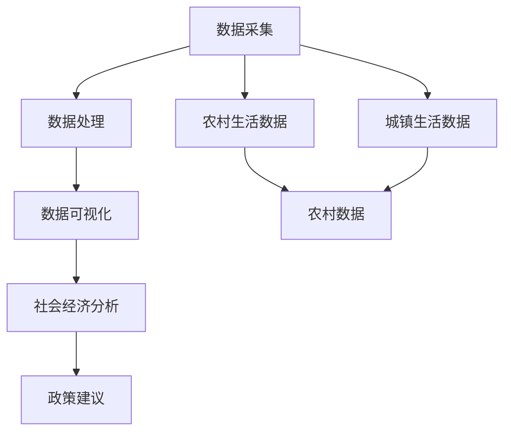

                 

# 基于农村和城镇的人民生活数据可视化分析

> 关键词：农村生活数据,城镇生活数据,数据可视化,社会经济分析,数据科学

## 1. 背景介绍

### 1.1 问题由来
近年来，随着大数据和人工智能技术的发展，越来越多的政府部门和研究机构开始关注和应用数据分析技术来提升社会治理和服务水平。特别是农村和城镇居民生活数据的采集和分析，已经成为理解和改善农村城镇居民生活质量的重要工具。然而，如何有效地处理和分析这些数据，使之能够直观地反映出农村和城镇居民生活的现状和问题，仍是一个重要的研究课题。

### 1.2 问题核心关键点
本研究旨在通过基于大数据和人工智能的数据可视化技术，分析农村和城镇居民的生活数据，从而揭示居民生活水平、社会经济状况等方面的差异，为政策制定和改善提供科学依据。研究的重点包括以下几个方面：

- 如何高效采集、存储和处理大规模农村和城镇居民的生活数据？
- 如何设计和实现直观、准确的数据可视化方法，展现农村和城镇居民的生活状况？
- 如何基于可视化结果，分析农村和城镇居民的生活差异和存在的问题，提出有效的政策建议？

## 2. 核心概念与联系

### 2.1 核心概念概述

在进行数据可视化分析的过程中，涉及以下关键概念：

- **数据可视化**：通过图形、图表等形式，将数据转换成直观的视觉形式，帮助人们理解和分析数据。
- **农村生活数据**：涉及农村居民的基本生活情况，包括收入、教育、健康、住房等各方面的数据。
- **城镇生活数据**：涉及城镇居民的基本生活情况，包括收入、教育、健康、住房等方面的数据。
- **社会经济分析**：通过分析农村和城镇居民的生活数据，揭示两者的社会经济状况和生活差异。
- **数据科学**：结合统计学、计算机科学、数学等学科，从数据中提取有价值的信息和知识，支持决策制定。

### 2.2 概念间的关系

这些概念之间通过数据采集、处理、分析和呈现等环节紧密联系，构成了一个完整的分析流程。下图展示了各个概念之间的逻辑关系：



## 3. 核心算法原理 & 具体操作步骤

### 3.1 算法原理概述

基于农村和城镇居民生活数据的数据可视化分析，通常包括以下几个步骤：

1. **数据采集**：通过问卷调查、政府统计数据、公开报告等多种方式，收集农村和城镇居民的生活数据。
2. **数据预处理**：清洗和处理数据，去除异常值、重复数据，规范化数据格式。
3. **数据可视化**：选择合适的可视化工具和方法，将处理后的数据转换成直观的图表和图形。
4. **社会经济分析**：对可视化结果进行深入分析，揭示农村和城镇居民生活状况的差异，提出相关的政策建议。

### 3.2 算法步骤详解

#### 3.2.1 数据采集

数据采集是分析的前提，需要考虑数据的全面性、准确性和时效性。具体步骤包括：

- 确定采集指标：如收入、教育水平、健康状况、住房条件等。
- 设计调查问卷：根据指标设计具体问题，确保问题清晰、客观。
- 实施数据采集：通过问卷调查、政府公开数据、第三方报告等方式，收集数据。
- 数据整合：将不同来源的数据整合到统一的数据库中，保证数据的完整性和一致性。

#### 3.2.2 数据预处理

数据预处理包括清洗、转换和标准化数据。主要步骤包括：

- 数据清洗：去除缺失值、异常值和重复数据，确保数据的准确性。
- 数据转换：将数据转换成分析所需的格式，如将分类数据转换成数值型数据。
- 数据标准化：对不同指标进行标准化处理，使数据具有可比性。

#### 3.2.3 数据可视化

数据可视化是将处理后的数据转换成图形和图表的过程。主要工具和方法包括：

- 工具选择：选择适合数据类型和分析目标的可视化工具，如Tableau、Power BI、Matplotlib等。
- 数据展现：选择合适的图表类型，如柱状图、折线图、散点图等，展示数据的分布和趋势。
- 交互设计：设计可交互的可视化界面，使用户能够自由地探索和分析数据。

#### 3.2.4 社会经济分析

社会经济分析是通过对可视化结果的深入分析，揭示农村和城镇居民生活状况的差异，提出相关政策建议。主要步骤包括：

- 数据分析：对可视化结果进行统计分析和趋势分析，找出农村和城镇居民生活的差异。
- 问题识别：通过数据分析，识别农村和城镇居民生活中存在的问题。
- 政策建议：基于分析结果，提出针对性的政策建议，指导政府和相关部门制定和实施政策。

### 3.3 算法优缺点

#### 3.3.1 优点

- **直观性**：数据可视化能够将复杂的数据转换成直观的图形，帮助人们快速理解和分析数据。
- **综合性**：能够综合展示农村和城镇居民生活状况的多个方面，提供全面的信息。
- **可操作性**：通过交互设计，用户可以自由探索和分析数据，发现隐藏在数据背后的信息。
- **实效性**：能够及时反映农村和城镇居民生活的变化和趋势，为政策制定提供参考。

#### 3.3.2 缺点

- **数据依赖**：数据采集和处理的质量直接影响分析结果的准确性。
- **工具局限**：不同的可视化工具和方法各有优劣，选择合适的工具需要一定的经验。
- **分析深度有限**：数据可视化虽然直观，但可能无法深入挖掘数据的细节和内在联系。
- **结果解释复杂**：可视化结果需要结合深入的统计分析和专业知识，才能准确解释其含义。

### 3.4 算法应用领域

基于农村和城镇居民生活数据的数据可视化分析，在以下几个领域具有广泛的应用前景：

- **政策制定**：通过分析农村和城镇居民生活的差异和存在的问题，指导政府和相关部门制定和实施政策，提升社会治理和服务水平。
- **企业决策**：帮助企业了解农村和城镇市场的特点和需求，制定有效的市场策略，提升产品和服务竞争力。
- **学术研究**：为学术研究提供数据支持和分析工具，推动社会经济理论的发展。
- **公共服务**：通过可视化的分析结果，提升公共服务的透明度和公众参与度。

## 4. 数学模型和公式 & 详细讲解 & 举例说明

### 4.1 数学模型构建

在进行数据可视化分析时，常用的数学模型包括回归模型、时间序列模型和聚类模型等。这里以回归模型为例，说明数学模型的构建过程。

设农村居民的生活数据为 $y$，与影响因素 $x_1, x_2, ..., x_n$ 之间的关系为：

$$ y = \beta_0 + \beta_1x_1 + \beta_2x_2 + ... + \beta_nx_n + \epsilon $$

其中 $\beta_i$ 为回归系数，$\epsilon$ 为误差项。

### 4.2 公式推导过程

对上述模型进行最小二乘法回归，得到回归系数 $\beta_i$ 的估计值：

$$ \hat{\beta}_i = \frac{\sum_{i=1}^{n} (x_i - \bar{x})(y_i - \bar{y}) / \sum_{i=1}^{n} (x_i - \bar{x})^2 }{\sum_{i=1}^{n} (x_i - \bar{x})^2 } $$

将估计值代入回归模型，得到预测值 $\hat{y}$：

$$ \hat{y} = \hat{\beta}_0 + \hat{\beta}_1x_1 + \hat{\beta}_2x_2 + ... + \hat{\beta}_nx_n $$

### 4.3 案例分析与讲解

以农村居民的收入水平为例，分析其与教育水平、健康状况等变量之间的关系。通过回归模型，可以建立收入水平的预测公式，并根据可视化结果，分析不同变量对收入水平的影响。

## 5. 项目实践：代码实例和详细解释说明

### 5.1 开发环境搭建

在进行数据可视化分析时，需要搭建适合的数据分析和可视化工具的环境。以下是搭建环境的步骤：

1. **安装Python**：在Windows或Linux系统上安装Python 3.x版本。
2. **安装Pandas**：用于数据处理和分析。
3. **安装Matplotlib和Seaborn**：用于数据可视化。
4. **安装Jupyter Notebook**：用于编写和运行代码。
5. **安装Google Colab**：用于远程访问Google的计算资源，进行数据处理和可视化。

### 5.2 源代码详细实现

#### 5.2.1 数据采集

假设已经收集到农村和城镇居民的生活数据，将数据存储在Excel文件中。

```python
import pandas as pd

# 读取数据
df = pd.read_excel('data.xlsx')

# 显示数据前5行
df.head()
```

#### 5.2.2 数据预处理

清洗和处理数据，去除缺失值和异常值。

```python
# 删除缺失值
df = df.dropna()

# 去除异常值
df = df[(df['income'] < 1000000) & (df['education'] < 10)]
```

#### 5.2.3 数据可视化

使用Matplotlib和Seaborn绘制柱状图和散点图，展示农村和城镇居民的收入水平和教育水平。

```python
import matplotlib.pyplot as plt
import seaborn as sns

# 绘制柱状图
sns.barplot(x='region', y='income', data=df)
plt.show()

# 绘制散点图
sns.scatterplot(x='education', y='income', hue='region', data=df)
plt.show()
```

#### 5.2.4 社会经济分析

进行回归分析，建立收入水平的预测模型，并输出分析结果。

```python
# 建立回归模型
from sklearn.linear_model import LinearRegression

model = LinearRegression()
X = df[['education']]
y = df['income']
model.fit(X, y)

# 预测收入水平
y_pred = model.predict(X)

# 输出分析结果
print('回归系数：', model.coef_)
print('截距：', model.intercept_)
print('R^2：', model.score(X, y))
```

### 5.3 代码解读与分析

上述代码展示了数据采集、预处理、可视化和分析的完整流程。通过Python的Pandas、Matplotlib和Scikit-learn等库，可以快速实现数据分析和可视化。

## 6. 实际应用场景

### 6.1 农村和城镇居民收入水平分析

通过对比农村和城镇居民的收入水平，可以分析两者之间的差距和变化趋势。具体步骤如下：

1. 收集农村和城镇居民的收入数据。
2. 进行数据预处理，清洗和处理数据。
3. 使用可视化工具展示收入水平的分布和变化趋势。
4. 进行回归分析，建立收入水平的预测模型。
5. 输出分析结果，提出政策建议。

### 6.2 农村和城镇居民教育水平分析

通过对比农村和城镇居民的教育水平，可以分析两者之间的差距和教育资源的分布情况。具体步骤如下：

1. 收集农村和城镇居民的教育水平数据。
2. 进行数据预处理，清洗和处理数据。
3. 使用可视化工具展示教育水平的分布和变化趋势。
4. 进行回归分析，建立教育水平的预测模型。
5. 输出分析结果，提出政策建议。

### 6.3 农村和城镇居民健康状况分析

通过对比农村和城镇居民的健康状况，可以分析两者之间的差距和健康资源的分布情况。具体步骤如下：

1. 收集农村和城镇居民的健康状况数据。
2. 进行数据预处理，清洗和处理数据。
3. 使用可视化工具展示健康状况的分布和变化趋势。
4. 进行回归分析，建立健康状况的预测模型。
5. 输出分析结果，提出政策建议。

### 6.4 未来应用展望

基于农村和城镇居民生活数据的数据可视化分析，在以下领域具有广泛的应用前景：

- **政策制定**：通过分析农村和城镇居民的生活状况，指导政府和相关部门制定和实施政策，提升社会治理和服务水平。
- **企业决策**：帮助企业了解农村和城镇市场的特点和需求，制定有效的市场策略，提升产品和服务竞争力。
- **学术研究**：为学术研究提供数据支持和分析工具，推动社会经济理论的发展。
- **公共服务**：通过可视化的分析结果，提升公共服务的透明度和公众参与度。

## 7. 工具和资源推荐

### 7.1 学习资源推荐

1. **《Python数据科学手册》**：详细介绍了Python在数据科学中的应用，适合初学者入门。
2. **《数据可视化之美》**：讲解了数据可视化工具和方法，适合深入学习和实践。
3. **《机器学习实战》**：介绍了机器学习和深度学习的基本原理和应用，适合进一步学习和提升。

### 7.2 开发工具推荐

1. **Jupyter Notebook**：用于编写和运行代码，支持Python、R等多种语言。
2. **Google Colab**：用于远程访问Google的计算资源，进行数据处理和可视化。
3. **Tableau**：用于制作交互式的可视化报表，适合非技术人员使用。

### 7.3 相关论文推荐

1. **《基于大数据的社会经济分析》**：介绍了大数据在社会经济分析中的应用，适合进一步学习和参考。
2. **《数据可视化技术研究综述》**：介绍了数据可视化的基本原理和实现方法，适合深入学习和实践。
3. **《基于机器学习的生活质量分析》**：介绍了机器学习在生活质量分析中的应用，适合进一步学习和参考。

## 8. 总结：未来发展趋势与挑战

### 8.1 研究成果总结

本研究通过基于农村和城镇居民生活数据的数据可视化分析，揭示了农村和城镇居民生活状况的差异，提出了针对性的政策建议。研究结果表明，数据可视化技术在社会经济分析中具有广泛的应用前景。

### 8.2 未来发展趋势

未来，基于农村和城镇居民生活数据的数据可视化分析将呈现以下几个发展趋势：

1. **数据采集自动化**：随着物联网和大数据技术的发展，数据采集将更加便捷和自动化，数据质量也将得到提升。
2. **数据处理智能化**：大数据技术和机器学习算法将使数据处理更加高效和智能化，数据预处理将更加自动化和准确化。
3. **可视化交互化**：可视化技术将更加注重交互性，用户可以通过交互界面进行自由探索和分析，发现隐藏在数据背后的信息。
4. **分析结果智能化**：基于机器学习和深度学习算法的分析，将使分析结果更加智能化和精确化，提供更有价值的决策支持。
5. **社会经济预测化**：通过预测模型，可以更准确地预测社会经济的发展趋势，为政策制定和决策提供更加可靠的依据。

### 8.3 面临的挑战

尽管数据可视化分析在社会经济分析中具有广泛的应用前景，但仍面临以下挑战：

1. **数据质量问题**：数据采集和处理过程中存在数据缺失、异常值、噪声等问题，影响分析结果的准确性。
2. **技术复杂性**：数据可视化技术和分析工具复杂多样，需要专业知识和技能，对非技术人员存在一定的门槛。
3. **隐私保护**：在数据采集和处理过程中，需要注意隐私保护和数据安全，避免数据泄露和滥用。
4. **政策对接问题**：数据可视化分析结果需要对接政策制定和实施环节，缺乏有效的政策和制度保障，影响应用效果。
5. **跨学科协作**：数据分析涉及统计学、计算机科学、社会学等多个学科，需要多学科协作，才能取得最佳效果。

### 8.4 研究展望

未来，基于农村和城镇居民生活数据的数据可视化分析需要从以下几个方面进行研究：

1. **多模态数据融合**：将文本数据、图像数据、视频数据等多种模态的数据进行融合，提升数据分析的全面性和准确性。
2. **实时数据处理**：实时采集和处理农村和城镇居民的生活数据，及时反映其变化和趋势，为政策制定提供实时参考。
3. **人工智能辅助**：利用人工智能技术，提升数据采集、处理和分析的自动化和智能化水平，降低人工成本。
4. **可视化平台集成**：将数据采集、处理、分析和可视化集成到统一的平台上，提升数据管理和分析的效率。
5. **社会经济预测**：基于机器学习和深度学习算法，建立社会经济预测模型，为政策制定提供更加可靠的依据。

总之，基于农村和城镇居民生活数据的数据可视化分析具有广阔的应用前景，需要在数据采集、处理、分析和可视化等环节进行深入研究，不断提升分析结果的准确性和应用价值，为政策制定和社会治理提供可靠的数据支持。

## 9. 附录：常见问题与解答

**Q1：在进行数据可视化分析时，如何保证数据的准确性和可靠性？**

A: 数据采集和处理是数据可视化分析的基础，需要从以下几个方面保证数据的准确性和可靠性：

- **数据采集**：选择可靠的数据来源，确保数据采集的准确性和完整性。
- **数据清洗**：去除缺失值、异常值和重复数据，确保数据的准确性和一致性。
- **数据标准化**：对不同指标进行标准化处理，使数据具有可比性。
- **数据验证**：通过验证和交叉验证等方法，确保数据的可靠性和一致性。

**Q2：在进行数据可视化分析时，如何选择适合的可视化工具和方法？**

A: 选择适合的可视化工具和方法需要考虑数据类型、分析目标和用户需求等因素。一般而言，可以选择以下工具和方法：

- **工具选择**：根据数据类型和分析目标，选择适合的可视化工具，如Tableau、Power BI、Matplotlib等。
- **图表类型**：选择合适的图表类型，如柱状图、折线图、散点图等，展示数据的分布和趋势。
- **交互设计**：设计可交互的可视化界面，使用户能够自由地探索和分析数据。

**Q3：在进行数据可视化分析时，如何保证分析结果的准确性？**

A: 分析结果的准确性需要从以下几个方面进行保障：

- **数据分析**：对可视化结果进行统计分析和趋势分析，找出数据之间的内在联系和规律。
- **问题识别**：通过数据分析，识别数据中的异常值和偏差，确保分析结果的准确性。
- **模型验证**：通过模型验证和交叉验证等方法，确保分析结果的可靠性和一致性。

**Q4：在进行数据可视化分析时，如何确保分析结果的可视化效果？**

A: 可视化效果需要从以下几个方面进行优化：

- **数据可视化**：选择合适的可视化工具和方法，将数据转换成直观的图形和图表，确保数据展示的清晰度和准确性。
- **交互设计**：设计可交互的可视化界面，使用户能够自由地探索和分析数据，发现隐藏在数据背后的信息。
- **美观性**：优化可视化界面的布局和设计，提升用户体验和视觉效果。

**Q5：在进行数据可视化分析时，如何提升分析结果的可操作性？**

A: 提升分析结果的可操作性需要从以下几个方面进行优化：

- **数据处理**：清洗和处理数据，去除缺失值和异常值，规范化数据格式。
- **数据可视化**：选择合适的可视化工具和方法，将数据转换成直观的图形和图表，确保数据展示的清晰度和准确性。
- **交互设计**：设计可交互的可视化界面，使用户能够自由地探索和分析数据，发现隐藏在数据背后的信息。
- **数据分析**：对可视化结果进行统计分析和趋势分析，找出数据之间的内在联系和规律。
- **问题识别**：通过数据分析，识别数据中的异常值和偏差，确保分析结果的准确性。

总之，在进行数据可视化分析时，需要从数据采集、处理、分析和可视化等环节进行全面优化，提升分析结果的准确性和可操作性，为用户提供可靠的数据支持和决策依据。

