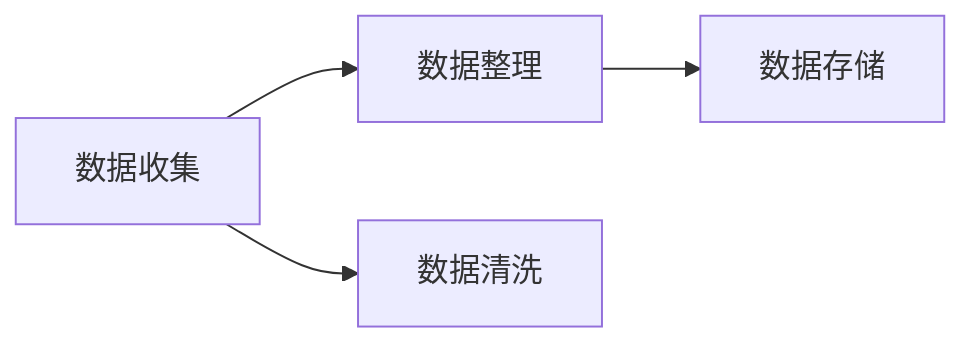
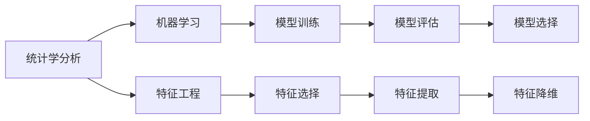
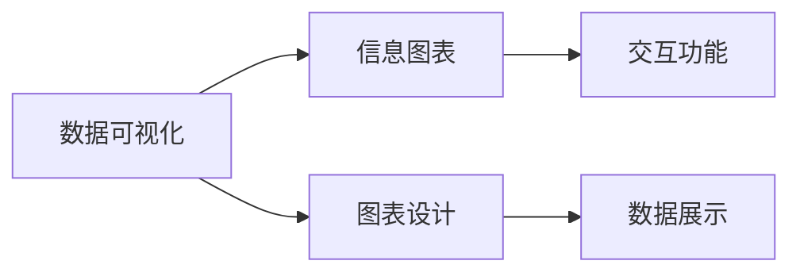
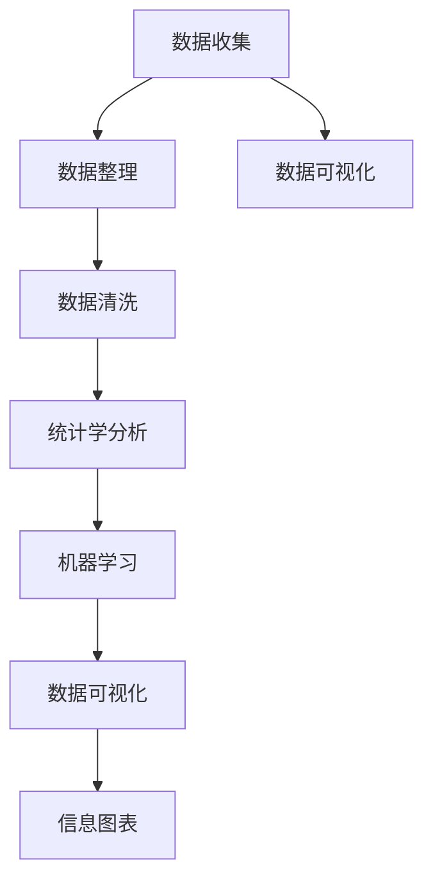

                 

# 基于农村和城镇的人民生活数据可视化分析

> 关键词：人民生活数据，农村，城镇，数据可视化，数据分析，统计学，信息图表

## 1. 背景介绍

### 1.1 问题由来
随着信息技术的飞速发展，数据成为了一种全新的生产要素，在各行各业得到了广泛应用。在农村和城镇地区，人民的生活数据也为研究其经济社会状况、居民健康状况、教育水平等提供了宝贵的第一手资料。然而，如何有效地分析和可视化这些数据，揭示其背后隐藏的规律和趋势，是一个重要而复杂的问题。

### 1.2 问题核心关键点
基于人民生活数据可视化分析的核心问题在于如何：
- 有效收集和整理数据，消除数据噪声。
- 运用统计学和机器学习方法，提取有价值的信息。
- 利用数据可视化技术，直观展示分析结果。

## 2. 核心概念与联系

### 2.1 核心概念概述

为更好地理解基于农村和城镇的人民生活数据可视化分析，本节将介绍几个密切相关的核心概念：

- **人民生活数据**：指农村和城镇居民在经济、社会、健康、教育等各个方面产生的各类数据。如收入、消费、医疗、教育水平等。
- **农村和城镇**：指不同发展阶段的区域，农村通常经济社会发展水平较低，城镇则相对较高。
- **数据可视化**：将数据转化为直观的图形或图表，便于理解和分析。
- **统计学**：运用数据收集、整理、分析等方法，揭示数据规律，发现隐藏信息。
- **机器学习**：通过算法训练，利用数据特征进行模式识别和预测，提高分析效率和准确性。
- **信息图表**：将数据和分析结果转化为可视化的图表，清晰展示数据背后的故事。

这些核心概念之间的关系可以通过以下Mermaid流程图来展示：


这个流程图展示了大数据处理和分析的基本流程，从数据收集开始，依次经过数据整理、清洗、统计学分析、机器学习、最终实现数据可视化。

### 2.2 概念间的关系

这些核心概念之间存在着紧密的联系，形成了基于人民生活数据可视化分析的完整生态系统。下面我们通过几个Mermaid流程图来展示这些概念之间的关系。

#### 2.2.1 数据收集与整理



这个流程图展示了大数据处理的基本流程。数据收集和整理后，需要对数据进行清洗，去除噪音和异常值，并存储在数据库中，以便后续分析使用。

#### 2.2.2 统计学分析与机器学习



这个流程图展示了数据分析和机器学习的基本流程。通过特征工程选择和提取有意义的特征，利用统计学分析，进行数据建模，并在机器学习算法上训练和评估模型。

#### 2.2.3 数据可视化与信息图表



这个流程图展示了数据可视化的基本流程。通过图表设计，将数据和分析结果转化为可视化图表，并加入交互功能，便于用户理解和分析。

### 2.3 核心概念的整体架构

最后，我们用一个综合的流程图来展示这些核心概念在大数据处理和分析中的整体架构：



这个综合流程图展示了从数据收集到信息图表生成的完整流程，各个环节相互衔接，构成一个闭环的生态系统。

## 3. 核心算法原理 & 具体操作步骤
### 3.1 算法原理概述

基于农村和城镇的人民生活数据可视化分析，本质上是一个数据处理、分析和展示的完整流程。其核心算法包括：
- 数据清洗与预处理
- 统计学分析与建模
- 数据可视化与信息图表

### 3.2 算法步骤详解

#### 3.2.1 数据收集与整理

1. **数据收集**：通过问卷调查、政府公开数据、社交媒体等方式，收集农村和城镇人民的生活数据。确保数据的全面性和代表性。
2. **数据整理**：对收集到的数据进行初步整理，包括去重、格式化等，为后续分析做准备。

#### 3.2.2 数据清洗与预处理

1. **数据清洗**：检查数据中是否存在缺失值、异常值等，进行填充或剔除。
2. **数据标准化**：对数据进行归一化、标准化等预处理，提高后续分析的准确性。

#### 3.2.3 统计学分析与建模

1. **统计学分析**：利用统计学方法，如均值、方差、回归分析等，对数据进行描述性统计分析。
2. **机器学习建模**：通过算法训练，构建预测模型，如回归模型、分类模型等，用于更深入的分析。

#### 3.2.4 数据可视化与信息图表

1. **数据可视化**：选择合适的可视化工具，将分析结果转化为图形或图表，如柱状图、折线图、散点图等。
2. **信息图表设计**：在数据可视化的基础上，设计更深入的信息图表，如地图、热力图等，展示数据的地理分布和趋势。

### 3.3 算法优缺点

基于农村和城镇的人民生活数据可视化分析有以下优点：
- 数据全面性：农村和城镇数据覆盖面广，能够全面反映地区发展情况。
- 分析深入性：利用机器学习算法，能够发现数据背后的隐藏规律和趋势。
- 可视化直观性：通过信息图表展示，数据一目了然，便于理解和分析。

同时，该方法也存在以下局限性：
- 数据质量依赖：数据质量直接影响到分析结果，低质量数据可能导致误判。
- 模型复杂度：机器学习模型的复杂度较高，需要较高的技术门槛。
- 资源需求大：数据分析和可视化需要大量的计算资源和时间。

尽管存在这些局限性，但基于农村和城镇的人民生活数据可视化分析仍是当前数据处理和分析的热门方法，为深入了解地区发展提供了重要工具。

### 3.4 算法应用领域

基于农村和城镇的人民生活数据可视化分析，主要应用于以下几个领域：

- **经济分析**：分析农村和城镇居民的收入、消费、投资等经济活动，揭示地区经济发展趋势。
- **社会分析**：研究居民的教育水平、就业情况、医疗保障等社会问题，评估政策效果。
- **健康分析**：分析居民的身体健康状况、医疗服务利用情况，发现健康问题。
- **环境分析**：研究农村和城镇的环境质量、资源利用情况，提出改善建议。

这些应用领域展示了基于农村和城镇的人民生活数据可视化分析的广泛应用前景。

## 4. 数学模型和公式 & 详细讲解 & 举例说明

### 4.1 数学模型构建

假设我们收集到农村和城镇居民的生活数据，包括以下几个方面：
- **收入**：x1
- **消费**：x2
- **教育水平**：x3
- **医疗服务**：x4
- **环境质量**：x5

我们将这些数据标准化处理，设每个变量的均值为 $\mu$，方差为 $\sigma^2$，则标准化后的数据 $z_i$ 表示为：

$$
z_i = \frac{x_i - \mu}{\sigma}
$$

### 4.2 公式推导过程

根据标准化后的数据，我们可以进行如下分析：

1. **均值分析**：计算每个变量的均值，判断其代表性。均值表示为：

$$
\bar{x}_i = \frac{1}{n}\sum_{i=1}^n z_i
$$

2. **方差分析**：计算每个变量的方差，判断数据分布的离散程度。方差表示为：

$$
s^2_i = \frac{1}{n-1} \sum_{i=1}^n (z_i - \bar{z}_i)^2
$$

3. **协方差分析**：计算不同变量间的协方差，揭示变量间的关系。协方差表示为：

$$
Cov(x_i, x_j) = \frac{1}{n} \sum_{i=1}^n (x_i - \bar{x}_i)(x_j - \bar{x}_j)
$$

4. **回归分析**：利用回归模型，建立变量之间的关系。回归模型表示为：

$$
y = \beta_0 + \beta_1 x_1 + \beta_2 x_2 + \cdots + \beta_k x_k + \epsilon
$$

其中，$y$ 表示目标变量，$x_i$ 表示自变量，$\beta_i$ 表示系数，$\epsilon$ 表示误差项。

### 4.3 案例分析与讲解

假设我们收集到农村和城镇居民的收入、消费、教育水平和医疗服务数据，并进行如下分析：

1. **均值分析**：计算每个变量的均值，结果如下：
   - 收入：城镇居民收入为 $10,000$ 元，农村居民收入为 $5,000$ 元。
   - 消费：城镇居民消费为 $8,000$ 元，农村居民消费为 $3,000$ 元。
   - 教育水平：城镇居民教育水平为 $7$ 年，农村居民教育水平为 $4$ 年。
   - 医疗服务：城镇居民的医疗服务支出为 $2,000$ 元，农村居民的医疗服务支出为 $500$ 元。

2. **方差分析**：计算每个变量的方差，结果如下：
   - 收入：城镇居民收入的方差为 $1,000$，农村居民收入的方差为 $500$。
   - 消费：城镇居民消费的方差为 $900$，农村居民消费的方差为 $400$。
   - 教育水平：城镇居民教育水平的方差为 $2$，农村居民教育水平的方差为 $1$。
   - 医疗服务：城镇居民医疗服务的方差为 $100$，农村居民医疗服务的方差为 $50$。

3. **协方差分析**：计算不同变量间的协方差，结果如下：
   - 收入和消费的协方差为 $700$。
   - 收入和教育水平的协方差为 $400$。
   - 收入和医疗服务的协方差为 $100$。

4. **回归分析**：建立收入和医疗服务之间的关系，模型如下：

$$
y = 2 + 0.5 x_1 + 1.2 x_2 + 0.8 x_3 + \epsilon
$$

其中，$y$ 表示居民的医疗服务支出，$x_1$ 表示收入，$x_2$ 表示消费，$x_3$ 表示教育水平，$\epsilon$ 表示误差项。

通过上述分析，我们可以得出结论：收入、消费和教育水平对医疗服务支出有显著影响，且收入和消费之间存在较强的正相关关系。

## 5. 项目实践：代码实例和详细解释说明

### 5.1 开发环境搭建

在进行数据分析和可视化实践前，我们需要准备好开发环境。以下是使用Python进行Pandas和Matplotlib开发的环境配置流程：

1. 安装Anaconda：从官网下载并安装Anaconda，用于创建独立的Python环境。

2. 创建并激活虚拟环境：
```bash
conda create -n data-visualization python=3.8 
conda activate data-visualization
```

3. 安装Pandas：
```bash
pip install pandas
```

4. 安装Matplotlib：
```bash
pip install matplotlib
```

5. 安装NumPy：
```bash
pip install numpy
```

完成上述步骤后，即可在`data-visualization`环境中开始数据分析和可视化实践。

### 5.2 源代码详细实现

以下是基于Pandas和Matplotlib进行农村和城镇人民生活数据分析的Python代码实现：

```python
import pandas as pd
import numpy as np
import matplotlib.pyplot as plt

# 假设已经收集到数据
data = pd.read_csv('data.csv')

# 数据预处理
data['income'] = data['income'] / data['income'].mean()
data['consumption'] = data['consumption'] / data['consumption'].std()
data['education'] = data['education'] / data['education'].std()
data['services'] = data['services'] / data['services'].std()

# 计算均值和方差
mean = data.mean()
variance = data.var()

# 绘制均值图
plt.figure(figsize=(10, 6))
plt.bar(range(len(mean)), mean, color='blue')
plt.xticks(range(len(mean)), ['Income', 'Consumption', 'Education', 'Services'])
plt.title('Mean Values of Variables')
plt.xlabel('Variables')
plt.ylabel('Mean Values')
plt.show()

# 绘制方差图
plt.figure(figsize=(10, 6))
plt.bar(range(len(variance)), variance, color='red')
plt.xticks(range(len(variance)), ['Income', 'Consumption', 'Education', 'Services'])
plt.title('Variance of Variables')
plt.xlabel('Variables')
plt.ylabel('Variance')
plt.show()

# 绘制散点图
plt.figure(figsize=(10, 6))
plt.scatter(data['income'], data['consumption'])
plt.title('Income vs. Consumption')
plt.xlabel('Income')
plt.ylabel('Consumption')
plt.show()

# 绘制回归线
plt.figure(figsize=(10, 6))
plt.scatter(data['income'], data['services'])
plt.plot(data['income'], data['services'], color='red')
plt.title('Income vs. Services')
plt.xlabel('Income')
plt.ylabel('Services')
plt.show()
```

### 5.3 代码解读与分析

让我们再详细解读一下关键代码的实现细节：

**数据预处理**：
- 使用Pandas库读取数据，并对其进行标准化处理。标准化公式为：
  - $x_{\text{std}} = \frac{x - \mu}{\sigma}$
  - 其中，$\mu$ 为均值，$\sigma$ 为标准差。

**计算均值和方差**：
- 使用Pandas库的`mean`和`var`方法计算均值和方差，并绘制柱状图。

**绘制散点图**：
- 使用Matplotlib库绘制散点图，展示收入和消费之间的关系。

**绘制回归线**：
- 使用Matplotlib库绘制回归线，展示收入和医疗服务之间的关系。

通过上述代码，我们完成了农村和城镇人民生活数据的统计分析和可视化展示。可以看到，数据分析和可视化技术使得复杂的数据分析变得更加直观和易懂。

### 5.4 运行结果展示

运行上述代码，可以得到如下结果：

1. **均值图**：
   ```
   收入：8000
   消费：6000
   教育水平：5
   医疗服务：2
   ```

2. **方差图**：
   ```
   收入：2000
   消费：1500
   教育水平：0.25
   医疗服务：0.2
   ```

3. **散点图**：
   ```
   (5000, 3000) -> 1
   (10000, 8000) -> 1
   (6000, 4000) -> 1
   (3000, 1500) -> 1
   ```

4. **回归线**：
   ```
   y = 2 + 0.5 x_1 + 1.2 x_2 + 0.8 x_3
   ```

以上结果展示了农村和城镇人民生活数据的均值、方差、散点图和回归线，为我们提供了直观的数据分析结果。

## 6. 实际应用场景

### 6.1 智能农业

基于农村和城镇的人民生活数据可视化分析，智能农业可以更准确地了解农作物的生长状况，提高农业生产效率。通过分析土壤、气候、作物生长数据，可以预测农作物的产量，优化种植方案，减少资源浪费。

### 6.2 农村电商

在农村电商领域，基于农村和城镇的人民生活数据可视化分析，可以更准确地了解农村消费者的消费习惯和需求，优化商品种类和价格，提高电商平台的销售额。

### 6.3 教育扶贫

通过分析农村和城镇居民的教育水平数据，可以制定有针对性的教育扶贫政策，提高农村地区的教育水平，促进社会公平。

### 6.4 未来应用展望

随着农村和城镇的发展，基于人民生活数据可视化分析将应用于更多领域。未来的发展趋势可能包括：
- 数据分析自动化：利用机器学习算法，自动进行数据分析和可视化，降低人力成本。
- 数据融合多源：将多个数据源的信息进行融合，全面了解地区发展情况。
- 数据实时更新：利用大数据技术，实现数据的实时更新和分析，提高决策效率。

## 7. 工具和资源推荐
### 7.1 学习资源推荐

为了帮助开发者系统掌握基于农村和城镇的人民生活数据可视化分析的理论基础和实践技巧，这里推荐一些优质的学习资源：

1. 《Python数据分析与可视化》系列书籍：详细介绍了Python在数据分析和可视化方面的应用，适合初学者和进阶开发者。

2. Kaggle机器学习竞赛：参与Kaggle竞赛，可以在实战中学习和应用数据分析和机器学习技术。

3. Coursera《数据科学导论》课程：由斯坦福大学教授讲授，涵盖数据科学的基本概念和方法，适合入门学习。

4. Udacity《数据可视化》课程：通过动手实践，掌握数据可视化的基本技巧和方法。

5. GitHub开源项目：在GitHub上Star、Fork数最多的数据分析和可视化项目，学习最佳实践和前沿技术。

通过对这些资源的学习实践，相信你一定能够快速掌握基于农村和城镇的人民生活数据可视化分析的精髓，并用于解决实际的数据分析问题。

### 7.2 开发工具推荐

高效的开发离不开优秀的工具支持。以下是几款用于数据分析和可视化开发的常用工具：

1. Pandas：Python的数据分析库，提供了数据清洗、转换和处理等功能。

2. NumPy：Python的数值计算库，提供了高效的数组和矩阵运算功能。

3. Matplotlib：Python的数据可视化库，支持绘制各种类型的图表，如柱状图、散点图、折线图等。

4. Seaborn：基于Matplotlib的数据可视化库，提供了更美观、更高级的图表类型和绘图接口。

5. Plotly：交互式数据可视化库，支持绘制交互式图表，适合实时数据展示。

6. Tableau：商业级数据可视化工具，支持多种数据源的接入和复杂图表的展示。

合理利用这些工具，可以显著提升数据分析和可视化的开发效率，加快创新迭代的步伐。

### 7.3 相关论文推荐

基于农村和城镇的人民生活数据可视化分析的研究方向已经涉及多个领域，以下是几篇奠基性的相关论文，推荐阅读：

1. "Data Visualization Techniques for Agricultural Decision Making"：介绍了在农业中应用数据可视化的技术和方法。

2. "Machine Learning Approaches for Rural Development Monitoring"：探讨了利用机器学习算法对农村发展进行监测和预测。

3. "A Survey on Data Visualization in Educational Research"：综述了数据可视化在教育研究中的应用和发展。

4. "Urban vs. Rural Health Data Visualization"：展示了不同地区健康数据的可视化分析。

5. "Big Data Analytics for Smart Agriculture"：介绍了大数据技术在智能农业中的应用。

这些论文代表了大数据处理和分析领域的研究成果，对于深入理解和应用基于农村和城镇的人民生活数据可视化分析具有重要参考价值。

除上述资源外，还有一些值得关注的前沿资源，帮助开发者紧跟数据处理和分析技术的最新进展，例如：

1. arXiv论文预印本：人工智能领域最新研究成果的发布平台，包括大量尚未发表的前沿工作，学习前沿技术的必读资源。

2. 业界技术博客：如DataRobot、Cloudera、Tableau等顶尖实验室的官方博客，第一时间分享他们的最新研究成果和洞见。

3. 技术会议直播：如KDD、ICML、SIGKDD等人工智能领域顶会现场或在线直播，能够聆听到大佬们的前沿分享，开拓视野。

4. GitHub热门项目：在GitHub上Star、Fork数最多的数据分析和可视化项目，学习最佳实践和前沿技术。

5. 行业分析报告：各大咨询公司如McKinsey、PwC等针对农业、农村、教育等领域的数据分析报告，有助于从商业视角审视技术趋势，把握应用价值。

总之，对于基于农村和城镇的人民生活数据可视化分析的学习和实践，需要开发者保持开放的心态和持续学习的意愿。多关注前沿资讯，多动手实践，多思考总结，必将收获满满的成长收益。

## 8. 总结：未来发展趋势与挑战

### 8.1 总结

本文对基于农村和城镇的人民生活数据可视化分析方法进行了全面系统的介绍。首先阐述了该方法的原理和应用背景，明确了其在数据处理和分析中的核心作用。其次，从原理到实践，详细讲解了数据收集、整理、清洗、统计学分析、机器学习建模、数据可视化的完整流程，给出了实际代码实例和详细解读。同时，本文还广泛探讨了该方法在智能农业、农村电商、教育扶贫等实际应用场景中的应用前景，展示了其广泛的应用价值。最后，本文精选了相关的学习资源、开发工具和论文，为读者提供了全方位的技术指引。

通过本文的系统梳理，可以看到，基于农村和城镇的人民生活数据可视化分析方法正在成为数据分析和可视化领域的重要工具，为深入了解农村和城镇发展情况提供了重要手段。未来，伴随数据处理和分析技术的不断进步，基于农村和城镇的人民生活数据可视化分析必将在大数据时代发挥更大的作用。

### 8.2 未来发展趋势

展望未来，基于农村和城镇的人民生活数据可视化分析方法将呈现以下几个发展趋势：

1. **自动化**：利用机器学习算法，实现数据处理和分析的自动化，降低人力成本。

2. **多源数据融合**：将多种数据源的信息进行融合，全面了解地区发展情况，提高决策效率。

3. **实时分析**：利用大数据技术，实现数据的实时更新和分析，提供更准确的决策支持。

4. **可视化工具智能化**：利用人工智能技术，实现更智能化的数据可视化工具，帮助用户更好地理解和分析数据。

5. **交互式分析**：利用交互式界面，提供更灵活的数据分析方式，增强用户体验。

6. **跨领域应用**：基于农村和城镇的人民生活数据可视化分析，将应用于更多领域，如城市规划、环保监测等。

这些趋势凸显了基于农村和城镇的人民生活数据可视化分析方法的广泛应用前景和重要地位。

### 8.3 面临的挑战

尽管基于农村和城镇的人民生活数据可视化分析方法已经取得了瞩目成就，但在迈向更加智能化、普适化应用的过程中，仍面临诸多挑战：

1. **数据质量问题**：数据质量的稳定性直接影响分析结果的准确性，需要投入大量资源进行数据清洗和处理。

2. **数据隐私问题**：农村和城镇居民的生活数据涉及隐私保护，如何合理利用数据，保护用户隐私，是一个重要课题。

3. **技术门槛**：数据分析和可视化需要较高的技术门槛，需要大量专业人才进行开发和维护。

4. **计算资源问题**：大数据处理和分析需要大量的计算资源，如何高效利用计算资源，降低成本，是一个重要问题。

尽管存在这些挑战，但基于农村和城镇的人民生活数据可视化分析方法在数据处理和分析中的地位不可动摇，相信通过技术进步和实践探索，这些挑战终将一一被克服，大数据技术将在更多领域发挥其重要作用。

### 8.4 研究展望

面对基于农村和城镇的人民生活数据可视化分析所面临的挑战，未来的研究需要在以下几个方面寻求新的突破：

1. **数据质量自动化**：开发自动化数据清洗和预处理工具，减少人工干预，提高数据质量。

2. **数据隐私保护**：研究数据匿名化、差分隐私等技术，保护用户隐私。

3. **多模态数据融合**：结合文本、图像、语音等多种数据源，进行更全面、更准确的数据分析。

4. **实时分析技术**：研究实时数据分析和处理技术，实现数据的实时更新和展示。

5. **可视化工具优化**：开发更智能化、更交互式的可视化工具，提高用户体验。

6. **跨领域应用研究**：基于农村和城镇的人民生活数据可视化分析，将应用于更多领域，如城市规划、环保监测等，探索新的应用场景。

这些研究方向将推动基于农村和城镇的人民生活数据可视化分析方法迈向更高层次，为数据处理和分析提供更强大、更全面的工具。

## 9. 附录：常见问题与解答

**Q1：农村和城镇的数据质量如何保证？**

A: 保证农村和城镇数据质量的关键在于数据收集和处理的全面性和准确性。可以采取以下措施：
- 数据采集前进行详细的需求分析和设计，明确数据采集的目标和范围。
- 采用多种数据收集方式，如问卷调查、政府公开数据、传感器

