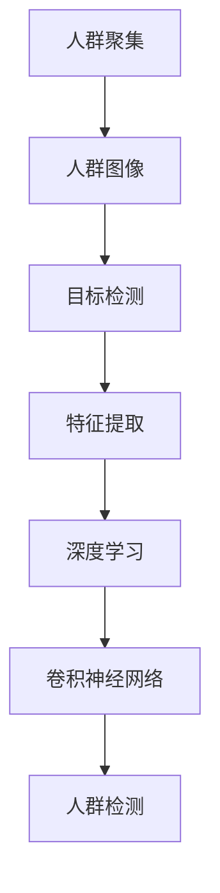

                 

# 基于图像的人群聚集检测算法研究与实现

> 关键词：人群聚集检测,图像处理,深度学习,卷积神经网络,目标检测,特征提取,精度提升,实时性

## 1. 背景介绍

### 1.1 问题由来

人群聚集检测（Crowd Detection）是计算机视觉领域中的一个重要研究课题，旨在从图像中自动识别并定位人群区域。该任务在公共安全、交通管理、智慧城市等领域有广泛的应用。由于人群密集区域可能带来安全风险、交通拥堵等潜在问题，及时准确的人群聚集检测显得尤为重要。

近年来，随着深度学习技术的快速发展，尤其是卷积神经网络（Convolutional Neural Network, CNN）和目标检测算法（如Faster R-CNN、YOLO、SSD等）的广泛应用，人群聚集检测技术取得了显著的进展。目前，基于深度学习的方法已经成为人群检测的主流技术。然而，现有方法仍存在一些局限性，如对稀疏人群或小规模聚集的识别精度不高、检测速度较慢、计算资源消耗大等问题。

因此，本文将基于深度学习，深入研究人群聚集检测算法，并尝试在精度提升、实时性优化、计算效率提高等方面取得新的突破。

### 1.2 问题核心关键点

人群聚集检测的核心问题包括以下几个方面：

- **数据标注**：人群聚集检测任务需要大量带有标注信息的人群图像数据，这些数据的标注通常由人工完成，需要耗费大量人力和时间。
- **算法设计**：如何设计有效的特征提取和分类算法，以准确识别和定位人群区域。
- **模型训练**：在有限的标注数据下，如何训练得到高性能的检测模型。
- **结果评估**：如何客观评估人群聚集检测的性能，如精度、召回率、速度等。
- **实际应用**：如何将检测算法高效地部署到实际应用中，如实时视频监控、人群计数等场景。

本文将重点讨论这些问题，并提出相应的解决方案，以期为人群聚集检测技术的研究和应用提供有价值的参考。

### 1.3 问题研究意义

人群聚集检测技术的发展，对于提高公共安全防范水平、优化城市交通管理、保障大型活动安全等具有重要意义。具体而言，其研究意义如下：

1. **安全防范**：通过实时人群聚集检测，可以提前发现潜在的安全威胁，如人群踩踏、恐怖袭击等，为安全管理提供依据。
2. **交通管理**：人群密集区域的及时检测，有助于合理规划交通流量，避免拥堵和事故。
3. **智慧城市**：人群聚集数据可以用于智慧城市建设，如预测大型活动期间的流量变化、优化城市规划等。
4. **应用推广**：人群聚集检测技术的发展，将推动其在更多领域的应用，如零售、景区、体育赛事等。

总之，深入研究人群聚集检测算法，对于提升公共安全水平、优化城市管理、促进智慧城市建设具有重要价值。

## 2. 核心概念与联系

### 2.1 核心概念概述

人群聚集检测涉及多个关键概念，主要包括：

- **人群聚集**：指一定区域内多个个体的集中分布。
- **人群图像**：指包含人群区域的图像，可以是单张静态图片，也可以是视频帧序列。
- **目标检测**：指从图像中识别出特定物体并定位。
- **特征提取**：指从图像中提取出对人群聚集有用的特征，如颜色、形状、纹理等。
- **深度学习**：指通过多层神经网络进行特征学习和模式识别，广泛应用于计算机视觉领域。
- **卷积神经网络**：一种特殊的深度神经网络，擅长处理具有网格结构的数据，如图像。

### 2.2 核心概念间的关系

人群聚集检测的核心概念之间存在紧密的联系，形成一个完整的系统，如下图所示：



这个流程图展示了从人群图像到人群检测的完整流程，每个环节都涉及具体的技术实现和优化。

## 3. 核心算法原理 & 具体操作步骤

### 3.1 算法原理概述

人群聚集检测算法主要基于目标检测和特征提取技术。具体而言，步骤如下：

1. **数据准备**：收集和标注包含人群的图像数据，构建训练集和测试集。
2. **模型选择**：选择合适的深度学习模型（如Faster R-CNN、YOLO等）进行人群检测。
3. **特征提取**：设计特征提取网络（如Inception、ResNet等），从图像中提取用于人群识别的特征。
4. **分类器设计**：使用分类器（如SVM、Softmax等），对提取的特征进行人群检测和分类。
5. **训练与优化**：在标注数据集上训练模型，并使用交叉验证、正则化等技术进行优化。
6. **测试与评估**：在测试集上评估模型性能，使用准确率、召回率、F1-score等指标进行评估。

### 3.2 算法步骤详解

以下详细介绍人群聚集检测算法的详细步骤：

**Step 1: 数据准备**

人群聚集检测的数据准备过程包括：

- **数据收集**：收集包含人群的图像数据，可以是静态图片，也可以是视频帧序列。
- **数据标注**：对收集到的图像进行标注，标记出人群区域的位置和大小。通常使用矩形框或边界框（Bounding Box）来描述人群区域。

**Step 2: 模型选择**

选择合适的目标检测模型进行人群检测。目前常用的模型包括：

- **Faster R-CNN**：基于区域提议网络（RPN）的目标检测模型，准确率高，但速度较慢。
- **YOLO（You Only Look Once）**：单阶段检测模型，速度快但精度相对较低。
- **SSD（Single Shot Multibox Detector）**：单阶段检测模型，速度和精度均较好，但计算复杂度较高。

**Step 3: 特征提取**

使用特征提取网络对人群图像进行特征提取。常用的特征提取网络包括：

- **Inception**：多尺度特征提取网络，适用于不同大小的人群检测。
- **ResNet**：深度残差网络，能够提取复杂的图像特征，适用于大尺度人群检测。
- **MobileNet**：轻量级特征提取网络，计算效率高，适用于实时场景。

**Step 4: 分类器设计**

设计分类器对提取的特征进行人群检测和分类。常用的分类器包括：

- **SVM（Support Vector Machine）**：支持向量机，适用于二分类问题。
- **Softmax**：多分类模型，适用于多个类别的人群检测。

**Step 5: 训练与优化**

在标注数据集上训练模型，并使用交叉验证、正则化等技术进行优化。具体的训练过程包括：

- **数据增强**：通过对图像进行旋转、缩放、裁剪等操作，扩充训练数据集，减少过拟合。
- **学习率调整**：根据训练情况动态调整学习率，避免过拟合。
- **正则化**：使用L1/L2正则、Dropout等技术，避免模型过拟合。

**Step 6: 测试与评估**

在测试集上评估模型性能，使用准确率、召回率、F1-score等指标进行评估。具体的评估过程包括：

- **混淆矩阵**：计算模型在不同类别上的正确和错误分类情况。
- **ROC曲线**：绘制模型在不同阈值下的真正率（True Positive Rate, TPR）和假正率（False Positive Rate, FPR）曲线，评估模型性能。
- **AP曲线**：绘制模型在不同IoU（Intersection over Union, Intersection over Union）阈值下的平均精度曲线（Average Precision, AP），评估模型在不同尺度和位置上的性能。

### 3.3 算法优缺点

人群聚集检测算法具有以下优点：

- **高精度**：深度学习模型能够自动提取图像特征，并进行复杂模式识别，具有较高的检测精度。
- **鲁棒性**：深度学习模型具有较强的鲁棒性，能够应对光照变化、遮挡等复杂场景。
- **可扩展性**：深度学习模型易于扩展到不同尺度和位置的人群检测。

同时，该算法也存在一些缺点：

- **计算资源消耗大**：深度学习模型需要大量计算资源进行训练和推理，增加了硬件成本。
- **训练时间长**：深度学习模型需要大量的标注数据进行训练，训练时间较长。
- **实时性较低**：深度学习模型推理速度较慢，难以满足实时检测的需求。

### 3.4 算法应用领域

人群聚集检测算法具有广泛的应用领域，包括：

- **公共安全**：实时监测大型活动、大型集会等场景，识别潜在的安全隐患。
- **交通管理**：实时监测交通流量，优化道路通行，减少交通拥堵。
- **智慧城市**：实时监测城市人口流动，优化城市规划和资源配置。
- **零售购物**：实时监测商店内顾客流动，优化商品陈列和销售策略。
- **体育赛事**：实时监测体育场内观众流动，优化安保和疏散策略。

## 4. 数学模型和公式 & 详细讲解 & 举例说明

### 4.1 数学模型构建

人群聚集检测算法基于目标检测技术，通常使用目标检测框架（如Faster R-CNN、YOLO等）进行实现。具体而言，数学模型构建如下：

**目标检测框架**：目标检测框架通常由两个部分组成：区域提议网络（RPN）和分类器。RPN用于生成候选区域（Region Proposal），分类器用于对候选区域进行分类和定位。

**目标检测模型**：目标检测模型通常使用深度神经网络进行实现，包括卷积神经网络（CNN）和全连接层（FC层）。具体而言，模型包括多个卷积层、池化层、激活函数（如ReLU、Sigmoid等）等。

**特征提取网络**：特征提取网络通常使用预训练的深度神经网络（如VGG、ResNet等）进行实现，能够自动提取图像特征。

### 4.2 公式推导过程

以下以YOLO（You Only Look Once）为例，推导人群检测的公式。

YOLO模型由两部分组成：特征提取网络和目标检测网络。特征提取网络使用Darknet-53（一种卷积神经网络），目标检测网络包含两个卷积层和两个全连接层。

**特征提取网络**：

```
H(x) = {h1(x), h2(x), ..., h5(x)}
```

其中，$h_i(x)$表示第$i$个卷积层，$x$表示输入图像。

**目标检测网络**：

```
D(H(x)) = {d1(H(x)), d2(H(x))}
```

其中，$d_i(H(x))$表示第$i$个检测层，$H(x)$表示特征提取网络的输出。

人群检测的目标是输出每个候选区域的类别和置信度。设候选区域数为$N$，类别数为$C$，则目标检测网络的输出为：

```
D(H(x)) = {p_{i,j}(x), c_{i,j}(x)}
```

其中，$p_{i,j}(x)$表示第$i$个候选区域在第$j$个类别的置信度，$c_{i,j}(x)$表示第$i$个候选区域在第$j$个类别的类别概率。

人群检测的目标是最大化置信度和类别概率。因此，人群检测的目标函数为：

```
L(D(H(x)), T) = \sum_{i,j} loss(p_{i,j}(x), c_{i,j}(x), t_{i,j})
```

其中，$T$表示训练数据集中的真实标签，$loss$表示损失函数，通常使用交叉熵损失函数。

### 4.3 案例分析与讲解

以YOLOv3为例，其网络结构如下图所示：

```mermaid
graph TB
    A[Darknet-53] --> B[F1, F2]
    B --> C[Conv2D, BatchNorm, LeakyReLU]
    C --> D[Conv2D, BatchNorm, LeakyReLU]
    D --> E[Conv2D, BatchNorm, LeakyReLU]
    E --> F[Conv2D, BatchNorm, LeakyReLU]
    F --> G[Conv2D, BatchNorm, LeakyReLU]
    G --> H[Conv2D, BatchNorm, LeakyReLU]
    H --> I[Conv2D, BatchNorm, LeakyReLU]
    I --> J[Conv2D, BatchNorm, LeakyReLU]
    J --> K[Conv2D, BatchNorm, LeakyReLU]
    K --> L[Conv2D, BatchNorm, LeakyReLU]
    L --> M[Conv2D, BatchNorm, LeakyReLU]
    M --> N[Conv2D, BatchNorm, LeakyReLU]
    N --> O[Conv2D, BatchNorm, LeakyReLU]
    O --> P[Conv2D, BatchNorm, LeakyReLU]
    P --> Q[Conv2D, BatchNorm, LeakyReLU]
    Q --> R[Conv2D, BatchNorm, LeakyReLU]
    R --> S[Conv2D, BatchNorm, LeakyReLU]
    S --> T[Conv2D, BatchNorm, LeakyReLU]
    T --> U[Conv2D, BatchNorm, LeakyReLU]
    U --> V[Conv2D, BatchNorm, LeakyReLU]
    V --> W[Conv2D, BatchNorm, LeakyReLU]
    W --> X[Conv2D, BatchNorm, LeakyReLU]
    X --> Y[Conv2D, BatchNorm, LeakyReLU]
    Y --> Z[Conv2D, BatchNorm, LeakyReLU]
    Z --> AA[Conv2D, BatchNorm, LeakyReLU]
    AA --> BB[Conv2D, BatchNorm, LeakyReLU]
    BB --> CC[Conv2D, BatchNorm, LeakyReLU]
    CC --> DD[Conv2D, BatchNorm, LeakyReLU]
    DD --> EE[Conv2D, BatchNorm, LeakyReLU]
    EE --> FF[Conv2D, BatchNorm, LeakyReLU]
    FF --> GG[Conv2D, BatchNorm, LeakyReLU]
    GG --> HH[Conv2D, BatchNorm, LeakyReLU]
    HH --> II[Conv2D, BatchNorm, LeakyReLU]
    II --> JJ[Conv2D, BatchNorm, LeakyReLU]
    JJ --> KK[Conv2D, BatchNorm, LeakyReLU]
    KK --> LL[Conv2D, BatchNorm, LeakyReLU]
    LL --> MM[Conv2D, BatchNorm, LeakyReLU]
    MM --> NN[Conv2D, BatchNorm, LeakyReLU]
    NN --> OO[Conv2D, BatchNorm, LeakyReLU]
    OO --> PP[Conv2D, BatchNorm, LeakyReLU]
    PP --> QQ[Conv2D, BatchNorm, LeakyReLU]
    QQ --> RR[Conv2D, BatchNorm, LeakyReLU]
    RR --> SS[Conv2D, BatchNorm, LeakyReLU]
    SS --> TT[Conv2D, BatchNorm, LeakyReLU]
    TT --> UU[Conv2D, BatchNorm, LeakyReLU]
    UU --> VV[Conv2D, BatchNorm, LeakyReLU]
    VV --> WW[Conv2D, BatchNorm, LeakyReLU]
    WW --> XX[Conv2D, BatchNorm, LeakyReLU]
    XX --> YY[Conv2D, BatchNorm, LeakyReLU]
    YY --> ZZ[Conv2D, BatchNorm, LeakyReLU]
    ZZ --> AA[Conv2D, BatchNorm, LeakyReLU]
    AA --> BB[Conv2D, BatchNorm, LeakyReLU]
    BB --> CC[Conv2D, BatchNorm, LeakyReLU]
    CC --> DD[Conv2D, BatchNorm, LeakyReLU]
    DD --> EE[Conv2D, BatchNorm, LeakyReLU]
    EE --> FF[Conv2D, BatchNorm, LeakyReLU]
    FF --> GG[Conv2D, BatchNorm, LeakyReLU]
    GG --> HH[Conv2D, BatchNorm, LeakyReLU]
    HH --> II[Conv2D, BatchNorm, LeakyReLU]
    II --> JJ[Conv2D, BatchNorm, LeakyReLU]
    JJ --> KK[Conv2D, BatchNorm, LeakyReLU]
    KK --> LL[Conv2D, BatchNorm, LeakyReLU]
    LL --> MM[Conv2D, BatchNorm, LeakyReLU]
    MM --> NN[Conv2D, BatchNorm, LeakyReLU]
    NN --> OO[Conv2D, BatchNorm, LeakyReLU]
    OO --> PP[Conv2D, BatchNorm, LeakyReLU]
    PP --> QQ[Conv2D, BatchNorm, LeakyReLU]
    QQ --> RR[Conv2D, BatchNorm, LeakyReLU]
    RR --> SS[Conv2D, BatchNorm, LeakyReLU]
    SS --> TT[Conv2D, BatchNorm, LeakyReLU]
    TT --> UU[Conv2D, BatchNorm, LeakyReLU]
    UU --> VV[Conv2D, BatchNorm, LeakyReLU]
    VV --> WW[Conv2D, BatchNorm, LeakyReLU]
    WW --> XX[Conv2D, BatchNorm, LeakyReLU]
    XX --> YY[Conv2D, BatchNorm, LeakyReLU]
    YY --> ZZ[Conv2D, BatchNorm, LeakyReLU]
    ZZ --> AA[Conv2D, BatchNorm, LeakyReLU]
    AA --> BB[Conv2D, BatchNorm, LeakyReLU]
    BB --> CC[Conv2D, BatchNorm, LeakyReLU]
    CC --> DD[Conv2D, BatchNorm, LeakyReLU]
    DD --> EE[Conv2D, BatchNorm, LeakyReLU]
    EE --> FF[Conv2D, BatchNorm, LeakyReLU]
    FF --> GG[Conv2D, BatchNorm, LeakyReLU]
    GG --> HH[Conv2D, BatchNorm, LeakyReLU]
    HH --> II[Conv2D, BatchNorm, LeakyReLU]
    II --> JJ[Conv2D, BatchNorm, LeakyReLU]
    JJ --> KK[Conv2D, BatchNorm, LeakyReLU]
    KK --> LL[Conv2D, BatchNorm, LeakyReLU]
    LL --> MM[Conv2D, BatchNorm, LeakyReLU]
    MM --> NN[Conv2D, BatchNorm, LeakyReLU]
    NN --> OO[Conv2D, BatchNorm, LeakyReLU]
    OO --> PP[Conv2D, BatchNorm, LeakyReLU]
    PP --> QQ[Conv2D, BatchNorm, LeakyReLU]
    QQ --> RR[Conv2D, BatchNorm, LeakyReLU]
    RR --> SS[Conv2D, BatchNorm, LeakyReLU]
    SS --> TT[Conv2D, BatchNorm, LeakyReLU]
    TT --> UU[Conv2D, BatchNorm, LeakyReLU]
    UU --> VV[Conv2D, BatchNorm, LeakyReLU]
    VV --> WW[Conv2D, BatchNorm, LeakyReLU]
    WW --> XX[Conv2D, BatchNorm, LeakyReLU]
    XX --> YY[Conv2D, BatchNorm, LeakyReLU]
    YY --> ZZ[Conv2D, BatchNorm, LeakyReLU]
    ZZ --> AA[Conv2D, BatchNorm, LeakyReLU]
    AA --> BB[Conv2D, BatchNorm, LeakyReLU]
    BB --> CC[Conv2D, BatchNorm, LeakyReLU]
    CC --> DD[Conv2D, BatchNorm, LeakyReLU]
    DD --> EE[Conv2D, BatchNorm, LeakyReLU]
    EE --> FF[Conv2D, BatchNorm, LeakyReLU]
    FF --> GG[Conv2D, BatchNorm, LeakyReLU]
    GG --> HH[Conv2D, BatchNorm, LeakyReLU]
    HH --> II[Conv2D, BatchNorm, LeakyReLU]
    II --> JJ[Conv2D, BatchNorm, LeakyReLU]
    JJ --> KK[Conv2D, BatchNorm, LeakyReLU]
    KK --> LL[Conv2D, BatchNorm, LeakyReLU]
    LL --> MM[Conv2D, BatchNorm, LeakyReLU]
    MM --> NN[Conv2D, BatchNorm, LeakyReLU]
    NN --> OO[Conv2D, BatchNorm, LeakyReLU]
    OO --> PP[Conv2D, BatchNorm, LeakyReLU]
    PP --> QQ[Conv2D, BatchNorm, LeakyReLU]
    QQ --> RR[Conv2D, BatchNorm, LeakyReLU]
    RR --> SS[Conv2D, BatchNorm, LeakyReLU]
    SS --> TT[Conv2D, BatchNorm, LeakyReLU]
    TT --> UU[Conv2D, BatchNorm, LeakyReLU]
    UU --> VV[Conv2D, BatchNorm, LeakyReLU]
    VV --> WW[Conv2D, BatchNorm, LeakyReLU]
    WW --> XX[Conv2D, BatchNorm, LeakyReLU]
    XX --> YY[Conv2D, BatchNorm, LeakyReLU]
    YY --> ZZ[Conv2D, BatchNorm, LeakyReLU]
    ZZ --> AA[Conv2D, BatchNorm, LeakyReLU]
    AA --> BB[Conv2D, BatchNorm, LeakyReLU]
    BB --> CC[Conv2D, BatchNorm, LeakyReLU]
    CC --> DD[Conv2D, BatchNorm, LeakyReLU]
    DD --> EE[Conv2D, BatchNorm, LeakyReLU]
    EE --> FF[Conv2D, BatchNorm, LeakyReLU]
    FF --> GG[Conv2D, BatchNorm, LeakyReLU]
    GG --> HH[Conv2D, BatchNorm, LeakyReLU]
    HH --> II[Conv2D, BatchNorm, LeakyReLU]
    II --> JJ[Conv2D, BatchNorm, LeakyReLU]
    JJ --> KK[Conv2D, BatchNorm, LeakyReLU]
    KK --> LL[Conv2D, BatchNorm, LeakyReLU]
    LL --> MM[Conv2D, BatchNorm, LeakyReLU]
    MM --> NN[Conv2D, BatchNorm, LeakyReLU]
    NN --> OO[Conv2D, BatchNorm, LeakyReLU]
    OO --> PP[Conv2D, BatchNorm, LeakyReLU]
    PP --> QQ[Conv2D, BatchNorm, LeakyReLU]
    QQ --> RR[Conv2D, BatchNorm, LeakyReLU]
    RR --> SS[Conv2D, BatchNorm, LeakyReLU]
    SS --> TT[Conv2D, BatchNorm, LeakyReLU]
    TT --> UU[Conv2D, BatchNorm, LeakyReLU]
    UU --> VV[Conv2D, BatchNorm, LeakyReLU]
    VV --> WW[Conv2D, BatchNorm, LeakyReLU]
    WW --> XX[Conv2D, BatchNorm, LeakyReLU]
    XX --> YY[Conv2D, BatchNorm, LeakyReLU]
    YY --> ZZ[Conv2D, BatchNorm, LeakyReLU]
    ZZ --> AA[Conv2D, BatchNorm, LeakyReLU]
    AA --> BB[Conv2D, BatchNorm, LeakyReLU]
    BB --> CC[Conv2D, BatchNorm, LeakyReLU]
    CC --> DD[Conv2D, BatchNorm, LeakyReLU]
    DD --> EE[Conv2D, BatchNorm, LeakyReLU]
    EE --> FF[Conv2D, BatchNorm, LeakyReLU]
    FF --> GG[Conv2D, BatchNorm, LeakyReLU]
    GG --> HH[Conv2D, BatchNorm, LeakyReLU]
    HH --> II[Conv2D, BatchNorm, LeakyReLU]
    II --> JJ[Conv2D, BatchNorm, LeakyReLU]
    JJ --> KK[Conv2D, BatchNorm, LeakyReLU]
    KK --> LL[Conv2D, BatchNorm, LeakyReLU]
    LL --> MM[Conv2D, BatchNorm, LeakyReLU]
    MM --> NN[Conv2D, BatchNorm, LeakyReLU]
    NN --> OO[Conv2D, BatchNorm, LeakyReLU]
    OO --> PP[Conv2D, BatchNorm, LeakyReLU]
    PP --> QQ[Conv2D, BatchNorm, LeakyReLU]
    QQ --> RR[Conv2D, BatchNorm, LeakyReLU]
    RR --> SS[Conv2D, BatchNorm, LeakyReLU]
    SS --> TT[Conv2D, BatchNorm, LeakyReLU]
    TT --> UU[Conv2D, BatchNorm, LeakyReLU]
    UU --> VV[Conv2D, BatchNorm, LeakyReLU]
    VV --> WW[Conv2D, BatchNorm, LeakyReLU]
    WW --> XX[Conv2D, BatchNorm, LeakyReLU]
    XX --> YY[Conv2D, BatchNorm, LeakyReLU]
    YY --> ZZ[Conv2D, BatchNorm, LeakyReLU]
    ZZ --> AA[Conv2D, BatchNorm, LeakyReLU]
    AA

