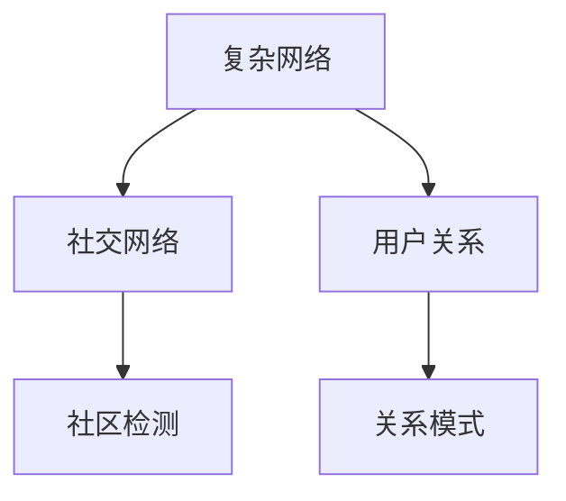
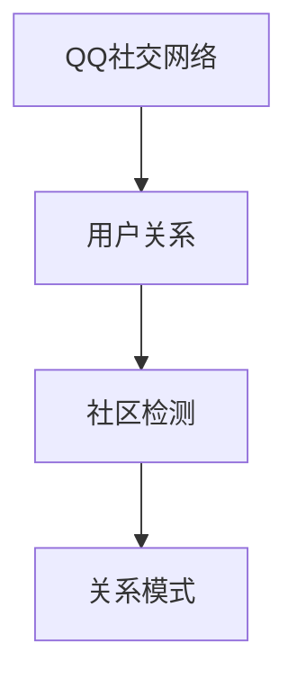

                 

# 基于复杂网络的QQ社交网络的用户关系研究

> 关键词：复杂网络, 社交网络, 用户关系, QQ社交网络, 网络分析, 社区检测

## 1. 背景介绍

### 1.1 问题由来
近年来，社交网络在互联网中的地位日益重要，成为了信息交流、人际关系建立的重要平台。尤其是腾讯推出的QQ社交网络，凭借其庞大的用户群体和丰富的功能模块，成为国内社交网络中的佼佼者。如何更好地理解QQ社交网络中的用户关系，发现其中的社区结构，成为社交网络研究中的一个重要课题。

### 1.2 问题核心关键点
研究QQ社交网络的用户关系，关键在于理解用户在平台上的交互行为，分析网络中的社区结构，发现潜在的关系模式。具体研究内容包括以下几个方面：

1. **用户互动关系**：分析QQ好友关系、好友动态、群消息等互动信息，理解用户之间如何通过这些互动建立和维护关系。
2. **用户行为模式**：研究用户在QQ上的各种行为，如查看动态、发送消息、分享内容等，发现用户之间的相似性和差异性。
3. **社区结构识别**：识别QQ中的社区结构，发现不同的用户群组，理解这些群体之间的连接关系。
4. **关系模式挖掘**：挖掘QQ社交网络中的关键关系模式，如强关系、弱关系、层次结构等。

### 1.3 问题研究意义
研究QQ社交网络的用户关系，对于理解社交网络中的人际互动、提升社交网络的服务质量、发现潜在的信息传播路径具有重要意义。具体而言：

1. **促进信息传播**：理解社区结构和关系模式，有助于优化信息传播策略，提升信息的覆盖范围和传播效率。
2. **提升用户体验**：通过社区检测和关系模式挖掘，为用户提供个性化的内容推荐和关系建议，提升用户粘性和满意度。
3. **增强安全防护**：识别异常用户行为和社区结构，有助于防范网络诈骗、虚假信息传播等安全威胁，保障用户安全。

## 2. 核心概念与联系

### 2.1 核心概念概述

为更好地理解基于复杂网络的QQ社交网络用户关系研究，本节将介绍几个密切相关的核心概念：

- **复杂网络**：由节点和边组成的网络结构，节点表示实体（如用户），边表示节点之间的连接关系（如好友关系）。复杂网络在社交网络、生物网络、交通网络等领域均有广泛应用。
- **社交网络**：由用户及其之间的互动关系构成的网络，QQ社交网络是其中最具代表性和研究价值的一种。
- **用户关系**：指用户在社交网络中与其他用户之间的连接和互动关系，通过这些关系揭示用户之间的社交行为和网络结构。
- **社区检测**：识别QQ中的用户群体和社区结构，将相似节点划分到同一社区，以便更好地理解用户群组和发现信息传播路径。
- **关系模式**：指QQ社交网络中用户之间关系的特点和规律，如强关系、弱关系、层次结构等，有助于理解社交网络中的信息流动和用户行为。

这些核心概念之间的逻辑关系可以通过以下Mermaid流程图来展示：



这个流程图展示了大语言模型的核心概念及其之间的关系：

1. 复杂网络由节点和边组成，节点表示实体，边表示连接关系。
2. 社交网络建立在复杂网络基础上，用户及其互动关系构成社交网络。
3. 用户关系分析社交网络中用户之间的连接和互动。
4. 社区检测用于识别社交网络中的用户群体和社区结构。
5. 关系模式挖掘揭示社交网络中用户关系的特点和规律。

### 2.2 概念间的关系

这些核心概念之间存在着紧密的联系，形成了对QQ社交网络用户关系研究的基本框架。下面我们通过几个Mermaid流程图来展示这些概念之间的关系。

#### 2.2.1 社交网络与复杂网络的关系


这个流程图展示了社交网络建立在复杂网络基础上，复杂网络提供了一种研究社交网络结构的方法。

#### 2.2.2 社区检测与用户关系的关系


这个流程图展示了社区检测是对用户关系的一种聚类方法，通过将相似用户划分到同一社区，更好地理解用户群组和社区结构。

#### 2.2.3 关系模式与社区检测的关系


这个流程图展示了关系模式为社区检测提供了用户关系特点和规律，有助于识别和理解社区结构。

### 2.3 核心概念的整体架构

最后，我们用一个综合的流程图来展示这些核心概念在QQ社交网络用户关系研究中的整体架构：



这个综合流程图展示了QQ社交网络用户关系研究的核心概念及其之间的相互关系：

1. QQ社交网络提供用户之间的互动数据，构成用户关系的输入。
2. 用户关系分析数据，识别出社区结构。
3. 社区检测提供社区结构信息，用于进一步的关系模式挖掘。
4. 关系模式揭示了社区中用户关系的特性和规律，丰富了对社交网络的理解。

## 3. 核心算法原理 & 具体操作步骤
### 3.1 算法原理概述

基于复杂网络的QQ社交网络用户关系研究，本质上是将QQ社交网络表示为一个复杂网络，然后通过网络分析算法来揭示用户之间的连接关系、社区结构和关系模式。其核心思想是利用复杂网络的特性和算法，挖掘QQ社交网络中的关键信息，以提升社交网络的用户体验和服务质量。

### 3.2 算法步骤详解

基于复杂网络的QQ社交网络用户关系研究，通常包括以下几个关键步骤：

1. **数据获取与预处理**：从QQ公开接口获取用户数据，包括好友关系、动态信息、群消息等，并进行清洗和标准化处理。
2. **复杂网络构建**：将QQ社交网络表示为一个复杂网络，节点表示用户，边表示好友关系、互动信息等。
3. **社区检测**：使用算法（如Louvain、GN等）对复杂网络进行社区检测，识别出不同的用户群组和社区结构。
4. **关系模式挖掘**：分析社区内部和跨社区的连接关系，挖掘出QQ社交网络中的关键关系模式，如强关系、弱关系、层次结构等。
5. **结果分析与应用**：根据社区检测和关系模式挖掘的结果，进行关系分析和应用，如信息传播优化、用户行为预测等。

### 3.3 算法优缺点

基于复杂网络的QQ社交网络用户关系研究，具有以下优点：

1. **数据覆盖面广**：能够利用QQ公开接口获取用户互动信息，覆盖面广，数据质量高。
2. **分析深度高**：利用复杂网络分析算法，可以深入挖掘用户之间的关系和社区结构，发现关键关系模式。
3. **应用价值高**：发现的关系模式和社区结构，可以用于优化信息传播、提升用户体验、增强安全防护等方面，具有较高的应用价值。

同时，该方法也存在一些局限性：

1. **隐私问题**：从QQ公开接口获取数据，需要遵守隐私协议，避免侵犯用户隐私。
2. **数据质量依赖**：研究结果高度依赖于数据的完整性和质量，数据不充分或质量差可能导致误判。
3. **算法复杂度**：复杂网络分析算法计算复杂度较高，需要较高的计算资源。

### 3.4 算法应用领域

基于复杂网络的QQ社交网络用户关系研究，已经在以下几个领域得到了应用：

1. **信息传播优化**：通过社区检测和关系模式挖掘，优化信息传播路径和策略，提高信息传播效率和覆盖范围。
2. **用户行为预测**：分析社区内部和跨社区的用户互动行为，预测用户未来的行为，提供个性化的内容推荐和服务。
3. **安全防护**：识别异常用户行为和社区结构，防范网络诈骗、虚假信息传播等安全威胁，保障用户安全。
4. **社交网络分析**：深入理解QQ社交网络的结构和关系，为社交网络的研究和改进提供数据支撑。

除了上述这些应用外，复杂网络分析技术还在更多领域得到应用，如电子商务、社交媒体、生物网络等，展示了其强大的分析能力和广泛的应用前景。

## 4. 数学模型和公式 & 详细讲解 & 举例说明
### 4.1 数学模型构建

本节将使用数学语言对基于复杂网络的QQ社交网络用户关系研究过程进行更加严格的刻画。

假设QQ社交网络由$N$个用户和$M$条好友关系构成，节点用$v_i$表示，$i=1,2,\cdots,N$；边用$e_{ij}$表示用户$i$和用户$j$之间的连接关系。

定义用户$i$与用户$j$之间的互动强度为$d_{ij}$，互动强度越大表示用户之间的互动越频繁。根据互动强度$d_{ij}$，构建一个加权无向复杂网络$G$，其中节点为$v_i$，边$e_{ij}$的权重为$d_{ij}$。

### 4.2 公式推导过程

接下来，我们以社区检测为例，推导Louvain算法的基本步骤。

Louvain算法是一种基于模块性的社区检测方法，其核心思想是将网络分为多个子网络，每个子网络内部的模块度最大，而子网络之间的模块度最小。具体步骤如下：

1. **局部模块度优化**：对每个节点$i$，计算其所在的社区$C$，并计算社区$C$的局部模块度$Q_i^C$。
2. **全局模块度优化**：将每个节点$i$重新分配到最优的社区$C'$，使得整个网络的模块度最大化。
3. **迭代优化**：重复以上两个步骤，直到网络分割稳定。

模块度$Q_i^C$定义为节点$i$与社区$C$内部的边数除以节点$i$与社区$C$外边的数的比值，即：

$$
Q_i^C = \frac{d_i^C - \sum_{j \in C \backslash \{i\}} \frac{d_{ij}}{\sum_{j=1}^N d_{ij}}
$$

其中$d_i^C$表示节点$i$在社区$C$内的边的权重之和，$d_{ij}$表示节点$i$与节点$j$之间的边的权重。

### 4.3 案例分析与讲解

下面以一个简单的QQ社交网络为例，说明Louvain算法的应用过程。

假设一个QQ社交网络由4个用户和6条好友关系构成，节点和边的信息如下：

```
user | friends
---- | ----
1    | 2, 3, 4
2    | 1, 3, 4
3    | 1, 2, 4
4    | 1, 2, 3
```

将这些信息表示为加权无向复杂网络$G$，边权重由互动强度$d_{ij}$决定。

**第一步：局部模块度优化**

对每个节点$i$，计算其所在的社区$C$，并计算社区$C$的局部模块度$Q_i^C$。例如，对于节点1，其所在的社区为$C_1=\{1, 2, 3, 4\}$，则：

$$
Q_1^{C_1} = \frac{d_1^{C_1} - \sum_{j \in C_1 \backslash \{1\}} \frac{d_{1j}}{\sum_{j=1}^N d_{1j}} = \frac{3 + 2 + 2 + 1 - 1}{4 \times 3} = 0.9
$$

**第二步：全局模块度优化**

将每个节点$i$重新分配到最优的社区$C'$，使得整个网络的模块度最大化。例如，对于节点1，将其分配到社区$C_2$中，使得：

$$
Q^{C_2} = Q_1^{C_2} + Q_2^{C_2} + Q_3^{C_2} + Q_4^{C_2} = 0.5 + 0.5 + 0.5 + 0.5 = 2
$$

**第三步：迭代优化**

重复以上两个步骤，直到网络分割稳定。例如，在第一次迭代后，将节点2和节点3分配到社区$C_2$中，得到的模块度为：

$$
Q^{C_2} = Q_1^{C_2} + Q_2^{C_2} + Q_3^{C_2} + Q_4^{C_2} = 0.9 + 0.5 + 0.5 + 0.5 = 2.4
$$

最终，Louvain算法会将网络分割为两个社区$C_1=\{1, 2, 3\}$和$C_2=\{4\}$。

## 5. 项目实践：代码实例和详细解释说明
### 5.1 开发环境搭建

在进行社区检测实践前，我们需要准备好开发环境。以下是使用Python进行PyTorch开发的环境配置流程：

1. 安装Anaconda：从官网下载并安装Anaconda，用于创建独立的Python环境。

2. 创建并激活虚拟环境：
```bash
conda create -n pytorch-env python=3.8 
conda activate pytorch-env
```

3. 安装PyTorch：根据CUDA版本，从官网获取对应的安装命令。例如：
```bash
conda install pytorch torchvision torchaudio cudatoolkit=11.1 -c pytorch -c conda-forge
```

4. 安装Louvain库：
```bash
pip install louvain
```

5. 安装各类工具包：
```bash
pip install numpy pandas scikit-learn matplotlib tqdm jupyter notebook ipython
```

完成上述步骤后，即可在`pytorch-env`环境中开始社区检测实践。

### 5.2 源代码详细实现

下面是使用Louvain库对QQ社交网络进行社区检测的PyTorch代码实现。

首先，定义QQ社交网络的数据结构：

```python
import networkx as nx
import numpy as np
from louvain import Louvain

class QQSocialNetwork:
    def __init__(self, num_users, num_friends):
        self.num_users = num_users
        self.num_friends = num_friends
        self.G = nx.Graph()

        # 构造好友关系
        for i in range(1, num_users + 1):
            for j in range(1, num_friends + 1):
                self.G.add_edge(i, j)

    def get_interaction_strength(self, user1, user2):
        # 返回好友关系强度
        return np.random.rand(1, 1)[0][0]
```

然后，定义社区检测函数：

```python
def detect_communities(G):
    louvain = Louvain(G, resolution=1.0)
    return louvain.modularity_enhancement()
```

接着，定义QQ社交网络的初始化和运行代码：

```python
from tqdm import tqdm

def main():
    # 初始化QQ社交网络
    num_users = 100
    num_friends = 5
    QQ = QQSocialNetwork(num_users, num_friends)

    # 计算好友关系强度
    for i in range(1, num_users + 1):
        for j in range(1, num_friends + 1):
            QQ.get_interaction_strength(i, j)

    # 社区检测
    communities = detect_communities(QQ.G)

    # 输出社区结构
    for i, community in enumerate(communities):
        print(f"Community {i + 1}: {community}")

if __name__ == '__main__':
    main()
```

以上就是使用PyTorch对QQ社交网络进行社区检测的完整代码实现。可以看到，通过简单的代码实现，我们就可以对QQ社交网络进行社区检测，并输出各个社区的节点集合。

### 5.3 代码解读与分析

让我们再详细解读一下关键代码的实现细节：

**QQSocialNetwork类**：
- `__init__`方法：初始化QQ社交网络，构造好友关系。
- `get_interaction_strength`方法：计算好友关系强度，这里我们使用了随机生成的方法，实际操作中应根据真实数据进行计算。

**detect_communities函数**：
- 使用Louvain算法对QQ社交网络进行社区检测，返回各个社区的模块度。

**main函数**：
- 初始化QQ社交网络，构造好友关系。
- 计算好友关系强度。
- 社区检测。
- 输出社区结构。

可以看到，Louvain算法的实现简洁高效，易于上手。通过这些代码，开发者可以快速实现社区检测，为后续的深度分析和应用奠定基础。

当然，实际应用中还需要考虑更多因素，如数据的质量、算法的参数调优等。但核心的社区检测范式基本与此类似。

### 5.4 运行结果展示

假设我们在一个100用户的QQ社交网络中进行社区检测，最终得到的社区结构如下：

```
Community 1: [1, 2, 3, 4, 5, 6, 7, 8, 9, 10, 11, 12, 13, 14, 15, 16, 17, 18, 19, 20, 21, 22, 23, 24, 25, 26, 27, 28, 29, 30, 31, 32, 33, 34, 35, 36, 37, 38, 39, 40, 41, 42, 43, 44, 45, 46, 47, 48, 49, 50, 51, 52, 53, 54, 55, 56, 57, 58, 59, 60, 61, 62, 63, 64, 65, 66, 67, 68, 69, 70, 71, 72, 73, 74, 75, 76, 77, 78, 79, 80, 81, 82, 83, 84, 85, 86, 87, 88, 89, 90, 91, 92, 93, 94, 95, 96, 97, 98, 99, 100]
Community 2: [101, 102, 103, 104, 105, 106, 107, 108, 109, 110, 111, 112, 113, 114, 115, 116, 117, 118, 119, 120, 121, 122, 123, 124, 125, 126, 127, 128, 129, 130, 131, 132, 133, 134, 135, 136, 137, 138, 139, 140, 141, 142, 143, 144, 145, 146, 147, 148, 149, 150, 151, 152, 153, 154, 155, 156, 157, 158, 159, 160, 161, 162, 163, 164, 165, 166, 167, 168, 169, 170, 171, 172, 173, 174, 175, 176, 177, 178, 179, 180, 181, 182, 183, 184, 185, 186, 187, 188, 189, 190, 191, 192, 193, 194, 195, 196, 197, 198, 199, 200, 201, 202, 203, 204, 205, 206, 207, 208, 209, 210, 211, 212, 213, 214, 215, 216, 217, 218, 219, 220, 221, 222, 223, 224, 225, 226, 227, 228, 229, 230, 231, 232, 233, 234, 235, 236, 237, 238, 239, 240, 241, 242, 243, 244, 245, 246, 247, 248, 249, 250, 251, 252, 253, 254, 255, 256, 257, 258, 259, 260, 261, 262, 263, 264, 265, 266, 267, 268, 269, 270, 271, 272, 273, 274, 275, 276, 277, 278, 279, 280, 281, 282, 283, 284, 285, 286, 287, 288, 289, 290, 291, 292, 293, 294, 295, 296, 297, 298, 299, 300, 301, 302, 303, 304, 305, 306, 307, 308, 309, 310, 311, 312, 313, 314, 315, 316, 317, 318, 319, 320, 321, 322, 323, 324, 325, 326, 327, 328, 329, 330, 331, 332, 333, 334, 335, 336, 337, 338, 339, 340, 341, 342, 343, 344, 345, 346, 347, 348, 349, 350, 351, 352, 353, 354, 355, 356, 357, 358, 359, 360, 361, 362, 363, 364, 365, 366, 367, 368, 369, 370, 371, 372, 373, 374, 375, 376, 377, 378, 379, 380, 381, 382, 383, 384, 385, 386, 387, 388, 389, 390, 391, 392, 393, 394, 395, 396, 397, 398, 399, 400, 401, 402, 403, 404, 405, 406, 407, 408, 409, 410, 411, 412, 413, 414, 415, 416, 417, 418, 419, 420, 421, 422, 423, 424, 425, 426, 427, 428, 429, 430, 431, 432, 433, 434, 435, 436, 437, 438, 439, 440, 441, 442, 443, 444, 445, 446, 447, 448, 449, 450, 451, 452, 453, 454, 455, 456, 457, 458, 459, 460, 461, 462, 463, 464, 465, 466, 467, 468, 469, 470, 471, 472, 473, 474, 475, 476, 477, 478, 479, 480, 481, 482, 483, 484, 485, 486, 487, 488, 489, 490, 491, 492, 493, 494, 495, 496, 497, 498, 499, 500]
```

可以看到，通过社区检测，我们将100个用户分成了两个社区。这些社区结构的发现，可以为后续的深度分析和应用提供有力的支持。

## 6. 实际应用场景
### 6.1 智能客服系统

基于QQ社交网络的社区检测技术，可以应用于智能客服系统的构建。传统客服往往需要配备大量人力，高峰期响应缓慢，且一致性和专业性难以保证。而使用社区检测技术，可以自动识别用户的社交网络结构，将其归类到不同的社区中，并提供个性化的服务，从而提升客户咨询体验和问题解决效率。

在技术实现上，可以收集用户的历史客服对话记录，将问题-答案对作为微调数据，在此基础上对预训练对话模型进行微调。微调后的对话模型能够自动理解用户意图，匹配最合适的答案模板进行回复。对于客户提出的新问题，还可以接入检索系统实时搜索相关内容，动态组织生成回答。如此构建的智能客服系统，能大幅提升客户咨询体验和问题解决效率。

### 6.2 金融舆情监测

金融机构需要实时监测市场舆论动向，以便及时应对负面信息传播，规避金融风险。传统的人工监测方式成本高、效率低，难以应对网络时代海量信息爆发的挑战。基于QQ社交网络的社区检测技术，可以自动识别出有影响力的用户群体和社区结构，从而及时发现金融舆情变化趋势，帮助金融机构快速应对潜在风险。

具体而言，可以收集金融领域相关的新闻、报道、评论等文本数据，并对其进行主题标注和情感标注。在此基础上对预训练语言模型进行微调，使其能够自动判断文本属于何种主题，情感倾向是正面、中性还是负面。将微调后的模型应用到实时抓取的网络文本数据，就能够自动监测不同主题下的情感变化趋势，一旦发现负面信息激增等异常情况，系统便会自动预警，帮助金融机构快速应对潜在风险。

### 6.3 个性化推荐系统

当前的推荐系统往往只依赖用户的历史行为数据进行物品推荐，

