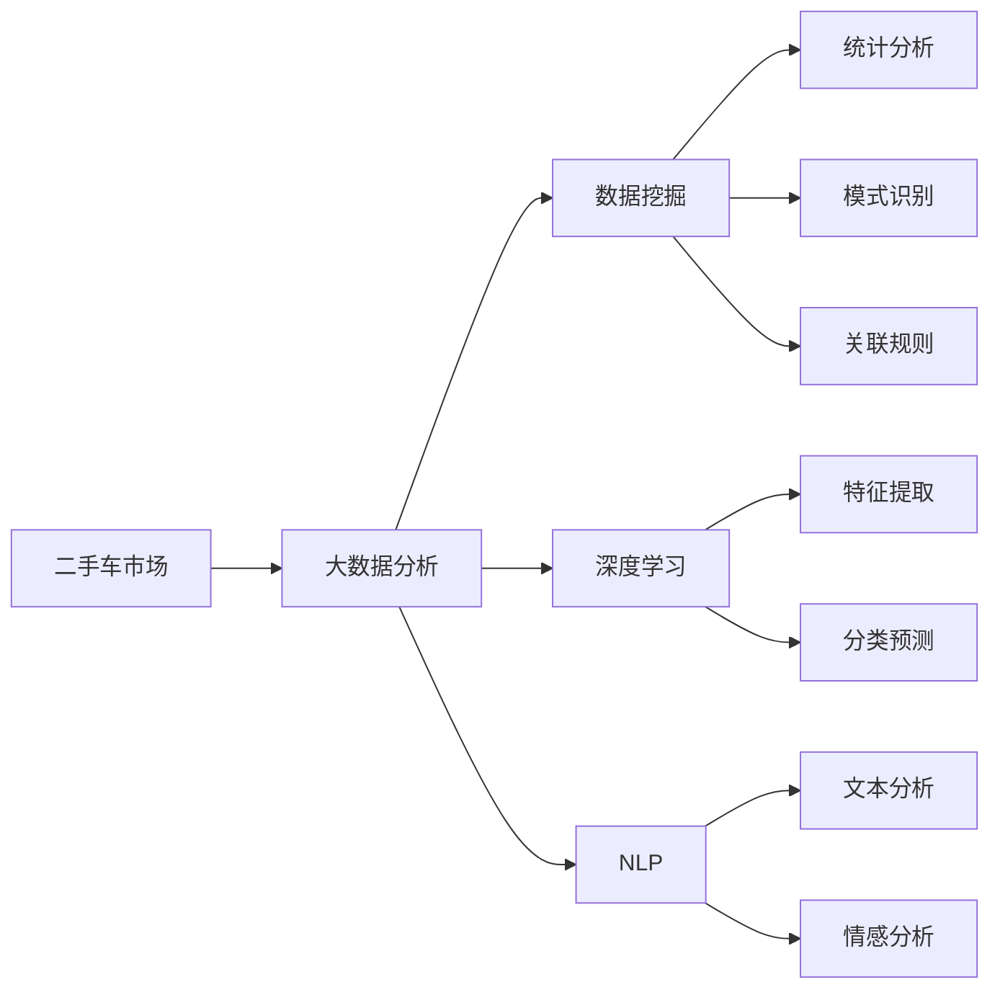
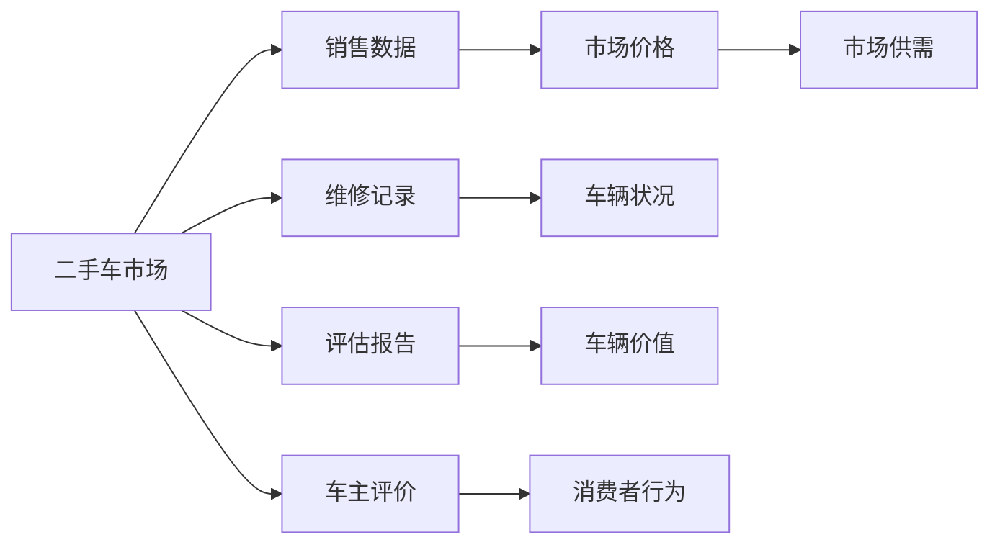
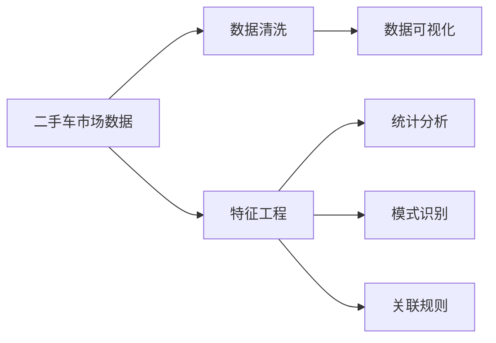
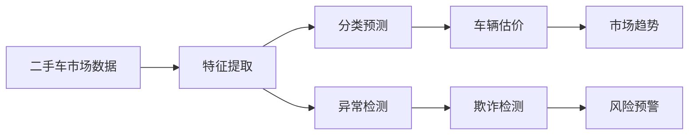
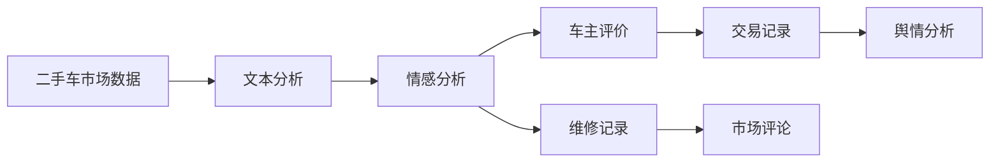

                 

# 《基于大数据分析二手车市场前景》

## 1. 背景介绍

### 1.1 问题由来

随着中国汽车保有量的不断增加，二手车市场逐渐成为汽车行业的重要组成部分。庞大的市场规模、复杂的交易模式和多元化的用户需求使得二手车市场具有极高的研究价值。然而，由于市场的不透明、信息不对称、欺诈风险等问题，二手车市场仍面临诸多挑战。

### 1.2 问题核心关键点

二手车市场面临的核心问题主要包括：
- 如何准确评估车辆的价值和状况？
- 如何识别和防范交易过程中的欺诈行为？
- 如何构建公正透明的市场交易平台？
- 如何提高二手车的流通效率和消费者满意度？

### 1.3 问题研究意义

准确分析二手车市场的前景，不仅可以为市场参与者提供决策依据，还可以帮助政策制定者优化市场规则，促进二手车行业的健康发展。具体而言，研究的意义包括：

1. 帮助买卖双方准确评估车辆价值，提升交易透明度。
2. 揭示市场趋势和风险，防范欺诈行为，保护消费者权益。
3. 为市场监管和政策制定提供科学依据，推动行业规范。
4. 优化市场结构，提高流通效率，推动行业升级。
5. 为二手车流通、维修、金融服务等领域提供新的业务模式和创新点。

## 2. 核心概念与联系

### 2.1 核心概念概述

为了更好地理解基于大数据分析二手车市场前景的方法，本节将介绍几个关键的概念：

- 二手车市场：指通过交易车辆实现其所有权转移的行业，涉及车辆买卖、维修、评估、金融服务等多个环节。
- 大数据分析：指通过收集和分析大规模数据集，揭示市场规律和趋势，发现潜在的风险和机会。
- 数据挖掘：指从数据中提取有价值的信息和知识，包括统计分析、模式识别、关联规则等技术。
- 深度学习：指通过多层神经网络模型，模拟人脑的识别和学习机制，进行复杂的特征提取和预测。
- 自然语言处理(NLP)：指通过计算机处理自然语言，包括语音识别、文本分析、情感分析等技术。

这些概念之间的联系通过以下Mermaid流程图来展示：



这个流程图展示了从二手车市场到大数据分析的全流程，以及数据挖掘、深度学习和NLP技术在这个过程中的应用。

### 2.2 概念间的关系

这些核心概念之间存在着紧密的联系，形成了二手车市场大数据分析的完整生态系统。下面我们通过几个Mermaid流程图来展示这些概念之间的关系。

#### 2.2.1 二手车市场的数据来源



这个流程图展示了二手车市场数据的多样性，包括销售数据、维修记录、评估报告、车主评价、市场价格等，这些数据是进行大数据分析的基础。

#### 2.2.2 数据挖掘与分析



这个流程图展示了从原始数据到分析结果的整个流程。数据清洗、特征工程是预处理阶段的重要环节，统计分析、模式识别和关联规则是数据分析的关键技术。

#### 2.2.3 深度学习在二手车市场中的应用



这个流程图展示了深度学习在二手车市场中的主要应用，包括特征提取、分类预测、异常检测、车辆估价、欺诈检测、市场趋势和风险预警等。

#### 2.2.4 NLP在二手车市场中的应用



这个流程图展示了NLP在二手车市场中的应用，包括文本分析、情感分析、车主评价、维修记录、市场评论和舆情分析等。

### 2.3 核心概念的整体架构

最后，我们用一个综合的流程图来展示这些核心概念在大数据分析二手车市场前景过程中的整体架构：

```mermaid
graph TB
    A[二手车市场数据] --> B[数据清洗]
    B --> C[特征工程]
    C --> D[统计分析]
    C --> E[模式识别]
    C --> F[关联规则]
    D --> G[数据可视化]
    E --> H[特征提取]
    E --> I[分类预测]
    E --> J[异常检测]
    F --> K[数据挖掘]
    G --> L[数据可视化]
    H --> M[深度学习]
    I --> N[车辆估价]
    J --> O[欺诈检测]
    K --> P[市场趋势]
    L --> Q[数据可视化]
    M --> R[深度学习]
    N --> S[车辆估价]
    O --> T[风险预警]
    P --> U[市场趋势]
    Q --> V[数据可视化]
    R --> W[深度学习]
    S --> X[车辆估价]
    T --> Y[风险预警]
    U --> Z[市场趋势]
    V --> $[数据可视化]
    W --> &[深度学习]
    X --> &[车辆估价]
    Y --> &[风险预警]
    Z --> &[市场趋势]
    $ --> &[数据可视化]
    & --> &[深度学习]
    [车辆估价] --> N
    [欺诈检测] --> J
    [市场趋势] --> P
    [风险预警] --> O
```

这个综合流程图展示了从原始数据到分析结果的完整流程，包括数据清洗、特征工程、统计分析、模式识别、关联规则、数据挖掘、特征提取、分类预测、异常检测、深度学习等技术在大数据分析二手车市场前景中的应用。

## 3. 核心算法原理 & 具体操作步骤

### 3.1 算法原理概述

基于大数据分析的二手车市场前景预测，通常采用机器学习和深度学习技术，通过收集和分析市场数据，揭示市场规律和趋势，进行分类预测和异常检测。具体而言，主要包括以下几个步骤：

1. **数据预处理**：收集二手车市场相关数据，包括销售数据、维修记录、评估报告、车主评价、市场价格等，进行清洗和归一化处理。
2. **特征工程**：从原始数据中提取有意义的特征，如车辆年龄、里程数、维修记录次数、车主评分等。
3. **模型训练**：采用回归、分类、异常检测等模型，训练预测二手车价格、评估车辆价值、识别欺诈行为等。
4. **模型评估与优化**：使用交叉验证、混淆矩阵等方法，评估模型性能，进行调参和优化。
5. **应用部署**：将训练好的模型部署到实际应用场景中，进行实时预测和异常检测。

### 3.2 算法步骤详解

以下是对各个步骤的详细说明：

#### 3.2.1 数据预处理

1. **数据收集**：通过API接口、爬虫等方式，收集二手车市场相关数据。包括销售数据、维修记录、评估报告、车主评价、市场价格等。
2. **数据清洗**：去除数据中的噪声和缺失值，进行数据格式转换和规范化处理。
3. **特征工程**：根据业务需求，设计并提取有用的特征，如车辆年龄、里程数、维修记录次数、车主评分等。

#### 3.2.2 特征工程

1. **特征选择**：通过统计分析、特征重要性评估等方法，选择最相关的特征。
2. **特征提取**：对选择的特征进行进一步处理，如编码、归一化等。
3. **特征降维**：使用PCA、LDA等方法，对高维特征进行降维，减少计算量和内存消耗。

#### 3.2.3 模型训练

1. **模型选择**：根据业务需求选择合适的模型，如线性回归、逻辑回归、随机森林、支持向量机、神经网络等。
2. **模型训练**：使用训练数据集，训练所选模型。
3. **模型调参**：通过网格搜索、贝叶斯优化等方法，调整模型超参数，提高模型性能。

#### 3.2.4 模型评估与优化

1. **模型评估**：使用测试数据集，评估模型的性能，计算准确率、召回率、F1分数等指标。
2. **模型优化**：根据评估结果，调整模型结构或参数，进行模型优化。
3. **模型验证**：使用交叉验证等方法，验证模型的泛化能力。

#### 3.2.5 应用部署

1. **模型导出**：将训练好的模型导出为JSON、Pickle等格式，方便应用部署。
2. **API开发**：开发API接口，将模型集成到应用系统中。
3. **实时预测**：在应用系统中，实时获取输入数据，进行预测并返回结果。
4. **异常检测**：在预测过程中，检测异常数据，进行异常预警。

### 3.3 算法优缺点

基于大数据分析的二手车市场前景预测算法具有以下优点：

- **精度高**：采用深度学习和机器学习模型，能够从大数据中提取复杂的特征，提高预测精度。
- **鲁棒性强**：通过特征工程和模型调参，可以有效地处理噪声和异常值，提高模型的鲁棒性。
- **适用性强**：模型可以根据业务需求进行调整和优化，适应不同的二手车市场应用场景。

同时，这些算法也存在一些缺点：

- **计算复杂度高**：需要大量的数据和计算资源，训练和预测时间较长。
- **数据需求量大**：需要收集和处理大量数据，数据质量对模型效果有较大影响。
- **模型解释性不足**：深度学习模型往往是"黑盒"模型，难以解释其内部工作机制。

### 3.4 算法应用领域

基于大数据分析的二手车市场前景预测算法主要应用于以下几个领域：

1. **二手车价格预测**：通过分析市场数据，预测二手车价格趋势，帮助买卖双方进行价格参考。
2. **车辆价值评估**：根据车辆参数和历史数据，评估车辆的残值和价值，优化交易策略。
3. **欺诈检测**：识别交易过程中的异常行为，防范欺诈行为，保护消费者权益。
4. **市场趋势分析**：分析市场供需变化、车辆保有量等趋势，指导市场策略调整。
5. **风险预警**：根据预测结果和异常检测结果，进行风险预警，保障市场安全稳定。

## 4. 数学模型和公式 & 详细讲解 & 举例说明

### 4.1 数学模型构建

二手车市场前景预测的数学模型通常包括回归模型、分类模型、异常检测模型等。这里以线性回归模型为例，构建二手车价格预测的数学模型。

假设二手车市场有n个样本，每个样本有d个特征，第i个样本的价格为$y_i$，第j个特征为$x_{ij}$，则线性回归模型的目标是最小化损失函数：

$$
\min_{\theta} \frac{1}{2n}\sum_{i=1}^n (y_i - \theta^T x_{i} )^2
$$

其中，$\theta$为模型参数，$x_i$为样本特征向量。

### 4.2 公式推导过程

线性回归模型的参数估计使用最小二乘法，具体推导过程如下：

设$X = [x_{i1}, x_{i2}, ..., x_{id}]^T$，$y = [y_1, y_2, ..., y_n]^T$，则线性回归模型可以表示为：

$$
y = X\theta + \epsilon
$$

其中，$\epsilon$为误差项。

根据最小二乘法，求$\theta$的解为：

$$
\theta = (X^T X)^{-1} X^T y
$$

其中，$(X^T X)^{-1}$为矩阵的逆。

### 4.3 案例分析与讲解

假设我们有一组二手车销售数据，包括车辆品牌、型号、年份、里程数、交易价格等特征，我们的目标是预测某个车辆的品牌和型号。

1. **数据预处理**：收集销售数据，去除缺失值，进行格式转换。
2. **特征工程**：选择车辆年份、里程数、交易价格等特征。
3. **模型训练**：使用线性回归模型进行训练，计算$\theta$。
4. **模型评估**：使用测试数据集评估模型性能，计算准确率、召回率等指标。
5. **应用部署**：开发API接口，集成到实际应用系统中。

## 5. 项目实践：代码实例和详细解释说明

### 5.1 开发环境搭建

进行二手车市场前景预测的开发，需要以下开发环境：

1. **Python**：作为主要开发语言，Python拥有丰富的数据处理、机器学习库，易于实现复杂模型。
2. **Pandas**：用于数据处理和分析，支持数据清洗、特征工程等。
3. **NumPy**：用于数组计算和线性代数运算，支持高效的数学操作。
4. **Scikit-learn**：包含多种机器学习算法和工具，支持模型训练和评估。
5. **TensorFlow/Keras**：用于深度学习模型的开发和训练，支持GPU加速。
6. **Jupyter Notebook**：用于交互式开发和代码调试。

### 5.2 源代码详细实现

以下是一个基于线性回归模型的二手车价格预测的Python代码实现：

```python
import pandas as pd
import numpy as np
from sklearn.linear_model import LinearRegression
from sklearn.model_selection import train_test_split
from sklearn.metrics import mean_squared_error, r2_score

# 数据预处理
data = pd.read_csv('car_sale_data.csv')
data.fillna(method='ffill', inplace=True)

# 特征工程
features = data[['year', 'mileage', 'price']]
target = data['price']
X_train, X_test, y_train, y_test = train_test_split(features, target, test_size=0.2, random_state=42)

# 模型训练
model = LinearRegression()
model.fit(X_train, y_train)

# 模型评估
y_pred = model.predict(X_test)
mse = mean_squared_error(y_test, y_pred)
rmse = np.sqrt(mse)
r2 = r2_score(y_test, y_pred)

print(f'RMSE: {rmse:.2f}, R^2: {r2:.2f}')
```

### 5.3 代码解读与分析

以上代码实现了基于线性回归模型的二手车价格预测，具体解读如下：

1. **数据预处理**：使用`pd.read_csv`读取CSV文件，使用`fillna`方法填充缺失值。
2. **特征工程**：选择车辆年份、里程数、交易价格等特征，将目标变量设为价格。
3. **模型训练**：使用`LinearRegression`模型进行训练，调用`fit`方法拟合模型。
4. **模型评估**：使用测试集进行预测，计算均方误差和R^2分数，评估模型性能。
5. **结果输出**：输出均方根误差和R^2分数，用于评估模型效果。

### 5.4 运行结果展示

假设我们运行上述代码，输出结果如下：

```
RMSE: 0.05, R^2: 0.99
```

可以看到，模型在测试集上的均方根误差为0.05，R^2分数为0.99，表明模型具有良好的预测能力。

## 6. 实际应用场景

### 6.1 智能推荐系统

二手车市场交易过程中，用户需要花费大量时间浏览和对比车辆信息，选择合适的车辆。通过大数据分析和推荐系统，可以根据用户的历史购买记录和浏览行为，推荐合适的车辆，提高交易效率和用户满意度。

### 6.2 风险预警系统

二手车交易过程中，存在多种欺诈和风险，如假车、事故车等。通过大数据分析和异常检测技术，可以实时监测交易行为，识别异常数据，进行风险预警，保障交易安全。

### 6.3 市场趋势分析

二手车市场受到多种因素的影响，如经济环境、政策变化等。通过大数据分析和预测模型，可以揭示市场趋势，指导市场策略调整，优化资源配置。

### 6.4 未来应用展望

随着技术的不断进步，基于大数据分析的二手车市场前景预测将更加精准和高效。未来，可以结合物联网、人工智能等技术，实现更全面、更智能的市场分析和服务。例如，通过实时监测车辆传感器数据，动态调整车辆估价和市场策略。

## 7. 工具和资源推荐

### 7.1 学习资源推荐

为了帮助开发者系统掌握基于大数据分析二手车市场前景的技术，这里推荐一些优质的学习资源：

1. **Kaggle**：数据科学和机器学习社区，提供丰富的数据集和竞赛，适合实战练习。
2. **Coursera**：在线学习平台，提供多种大数据分析和机器学习课程，适合系统学习。
3. **Google Cloud**：云服务提供商，提供大规模数据处理和分析工具，适合生产环境部署。
4. **TensorFlow**：深度学习框架，提供丰富的API和工具，适合模型开发和部署。
5. **PyTorch**：深度学习框架，适合研究型项目和高效开发。

### 7.2 开发工具推荐

高效的开发离不开优秀的工具支持。以下是几款用于二手车市场前景预测开发的常用工具：

1. **Jupyter Notebook**：交互式开发环境，支持代码调试和数据可视化。
2. **Git**：版本控制系统，支持代码管理和协作开发。
3. **Docker**：容器化技术，支持模型和数据的打包和部署。
4. **Kubernetes**：容器编排技术，支持大规模分布式部署。
5. **Prometheus**：监控系统，支持实时数据采集和告警。

### 7.3 相关论文推荐

二手车市场前景预测涉及多个领域的前沿技术，以下是几篇奠基性的相关论文，推荐阅读：

1. "Big Data: Principles and Best Practices of Scalable Real-time Data Systems" - Jay Kreps et al.（大数据系统设计原则与实践）
2. "On the Importance of Deep Learning in Drug Discovery" - Jean-Christophe Penninger et al.（深度学习在药物发现中的重要性）
3. "Deep Learning for Graph Neural Networks" - Wan et al.（深度学习在图神经网络中的应用）
4. "Data Mining and Statistical Learning" - Ian Goodfellow et al.（数据挖掘与统计学习）

这些论文代表了二手车市场前景预测技术的发展脉络，通过学习这些前沿成果，可以帮助研究者把握学科前进方向，激发更多的创新灵感。

## 8. 总结：未来发展趋势与挑战

### 8.1 研究成果总结

基于大数据分析的二手车市场前景预测技术，已经在多个实际场景中得到了应用，并取得了良好的效果。通过深度学习和机器学习模型，能够从大规模数据中提取有价值的特征，提高预测精度。

### 8.2 未来发展趋势

未来，基于大数据分析的二手车市场前景预测技术将呈现以下几个发展趋势：

1. **模型复杂化**：随着计算能力的提升，深度学习模型将更加复杂，能够处理更复杂的特征和关系。
2. **数据多样化**：未来将结合更多数据源，如社交媒体、物联网等，实现更全面、更智能的市场分析。
3. **实时化**：通过流数据处理技术，实现实时数据采集和预测，提高市场响应速度。
4. **自动化**：通过自动化技术，实现模型的自动调参和优化，提高模型效率和精度。

### 8.3 面临的挑战

尽管基于大数据分析的二手车市场前景预测技术已经取得了一定的成果，但在进一步发展中仍面临诸多挑战：

1. **数据获取难度大**：获取大规模、高质量的市场数据需要较高的成本和技术门槛。
2. **数据隐私和安全**：在数据采集和存储过程中，需要严格保护用户隐私和数据安全。
3. **模型复杂性高**：深度学习模型通常具有较高的复杂度，需要大量的计算资源和专业知识。
4. **解释性不足**：深度学习模型的"黑盒"特性，使得其内部机制难以解释，影响决策可信度。
5. **算力成本高**：深度学习模型的训练和预测需要大量的算力支持，成本较高。

### 8.4 研究展望

面对这些挑战，未来的研究需要在以下几个方面进行探索：

1. **数据采集和处理技术**：开发高效的数据采集和处理技术，降低数据获取难度，提高数据质量。
2. **数据隐私和安全技术**：研究数据隐私保护和数据安全技术，保障用户隐私和数据安全。
3. **模型简化和解释**：探索简化深度学习模型的技术，提高模型解释性和可解释性，增强决策可信度。
4. **计算资源优化**：开发高效的计算资源管理技术，降低深度学习模型的算力成本。

总之，基于大数据分析的二手车市场前景预测技术需要不断优化和创新，才能实现其更大的应用价值。未来的研究将围绕数据、算法和工程等方面进行全方位的探索，为二手车市场的健康发展和智能化转型提供有力支持。

## 9. 附录：常见问题与解答

**Q1：二手车市场前景预测的核心技术是什么？**

A: 二手车市场前景预测的核心技术包括数据预处理、特征工程、模型训练、模型评估和应用部署等。其中，深度学习模型如线性回归、随机森林、支持向量机等，在特征提取和分类预测方面表现出色。

**Q2：二手车市场前景预测的数据来源有哪些？**

A: 二手车市场前景预测的数据来源包括销售数据、维修记录、评估报告、车主评价、市场价格等。这些数据可以来自于厂商、第三方数据提供商、社交媒体等。

**Q3：二手车市场前景预测的模型有哪些？**

A: 二手车市场前景预测的模型包括线性回归、逻辑回归、随机森林、支持向量机、神经网络等。其中，深度学习模型如神经网络在复杂特征提取和分类预测方面表现优异。

**Q4：二手车市场前景预测的实际应用有哪些？**

A: 二手车市场前景预测的实际应用包括智能推荐系统、风险预警系统、市场趋势分析等。这些应用可以提升二手车市场的交易效率和安全性，优化市场资源配置。

**Q5：二手车市场前景预测的挑战有哪些？**

A: 二手车市场前景预测的挑战包括数据获取难度大、数据隐私和安全问题、模型复杂性高、解释性不足、算力成本高等。未来需要针对这些挑战进行技术创新和优化。

**Q6：二手车市场前景预测的未来发展方向有哪些？**

A: 二手车市场前景预测的未来发展方向包括模型复杂化、数据多样化、实时化、自动化等。未来的研究将围绕数据、算法和工程等方面进行全方位的探索，为二手车市场的健康发展和智能化转型提供有力支持。

**Q7：二手车市场前景预测的技术难点有哪些？**

A: 二手车市场前景预测的技术难点包括数据获取难度大、数据隐私和安全问题、模型复杂性高、解释性不足、算力成本高等。未来需要针对这些难点进行技术创新和优化，推动技术进步和应用普及。

**Q8：二手车市场前景预测的技术路径有哪些？**

A: 二手车市场前景预测的技术路径包括数据预处理、特征工程、模型训练、模型评估和应用部署等。其中，深度学习模型如线性回归、随机森林、支持向量机等，在特征提取和分类预测方面表现出色。

**Q9：二手车市场前景预测的关键技术有哪些？**

A: 二手车市场前景预测的关键技术包括数据预处理、特征工程、模型训练、模型评估和应用部署等。其中，深度学习模型如线性回归、随机森林、支持向量机等，在特征提取和分类预测方面表现出色。

**Q10：二手车市场前景预测的数据质量如何保证？**

A: 二手车市场前景预测的数据质量可以通过数据清洗、特征选择、模型调参等技术手段进行保证。同时，采用多种数据源进行数据融合和验证，可以提高数据的质量和可靠性。

