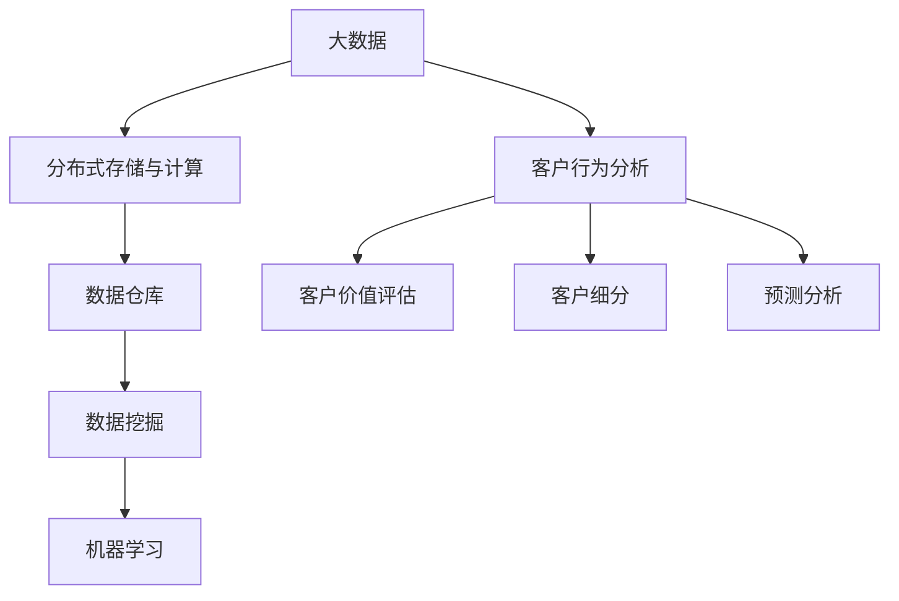

                 

# 基于大数据的某省政企客户业务分析系统

## 1. 背景介绍

随着中国经济的快速发展和互联网技术的不断进步，大数据在商业决策中的应用日益广泛，尤其对于政企客户业务分析而言，其重要性更是不言而喻。在这个时代背景下，各大企业纷纷引入大数据技术，以提高客户服务水平，提升业务运营效率。本文将重点介绍某省政企客户业务分析系统，并阐述其核心技术与关键应用。

### 1.1 项目背景

某省政企客户业务分析系统是一个以大数据为核心的客户管理系统，旨在通过大数据技术对政企客户的业务数据进行全面的分析和预测，帮助政府和企业提高客户服务水平，优化资源配置，降低运营成本。系统采用了多种先进的数据处理和分析技术，如分布式存储、分布式计算、机器学习等，能够高效地处理和分析海量客户数据。

### 1.2 项目目标

1. **数据整合与清洗**：对来自不同渠道的客户数据进行整合与清洗，构建统一的客户数据仓库。
2. **客户行为分析**：通过数据挖掘和机器学习技术，对客户的消费行为、交易记录等进行分析，识别关键客户群体。
3. **客户价值评估**：构建客户价值评估模型，根据客户的交易记录、历史行为等数据，评估客户的潜在价值。
4. **客户细分**：对客户进行细分，提供差异化的营销和服务策略。
5. **预测分析**：利用预测分析技术，对客户的未来行为进行预测，提前采取措施。

## 2. 核心概念与联系

### 2.1 核心概念概述

本节将介绍几个与某省政企客户业务分析系统密切相关的核心概念，并探讨它们之间的关系。

- **大数据（Big Data）**：大数据是指传统数据处理工具无法有效管理的大规模、复杂的数据集合。包括结构化数据（如关系型数据库中的数据）和非结构化数据（如日志文件、图片、视频等）。
- **分布式存储与计算**：通过分布式存储与计算技术，能够在多台服务器上分布式存储和计算数据，提高数据处理效率。
- **数据仓库（Data Warehouse）**：数据仓库是企业存储大量业务数据的中央平台，用于支持数据分析和决策制定。
- **数据挖掘（Data Mining）**：数据挖掘是从大量数据中发现有用信息和知识的过程，包括分类、聚类、关联规则分析等。
- **机器学习（Machine Learning）**：机器学习是一种通过数据训练模型，使其能够自动进行预测和决策的技术。

这些概念之间的关系可以通过以下Mermaid流程图来展示：



这个流程图展示了大数据在客户行为分析、客户价值评估、客户细分和预测分析中的作用，以及数据挖掘和机器学习在其中扮演的重要角色。

### 2.2 概念间的关系

- **大数据与分布式存储与计算**：大数据存储和计算需要分布式架构，以应对数据量和计算量的不断增长。
- **数据仓库与大数据**：数据仓库建立在大量大数据基础上，存储结构化和非结构化数据，为数据分析提供支持。
- **数据挖掘与机器学习**：数据挖掘是机器学习的基础，机器学习通过数据挖掘获取数据特征，训练模型进行预测和决策。
- **客户行为分析与客户价值评估**：客户行为分析通过数据挖掘获取客户特征，进而评估客户的潜在价值。
- **客户细分与预测分析**：客户细分通过对客户进行分类，以便进行有针对性的预测分析。

这些核心概念之间相互作用，共同构成了某省政企客户业务分析系统的技术架构。

## 3. 核心算法原理 & 具体操作步骤

### 3.1 算法原理概述

某省政企客户业务分析系统主要基于机器学习和数据挖掘技术，通过分布式存储和计算技术，对客户数据进行全面分析和预测。系统的核心算法包括：

- **数据预处理**：对数据进行清洗、转换和归一化，为后续分析提供高质量的数据。
- **聚类分析**：利用聚类算法对客户进行分组，识别具有相似行为和特征的客户群体。
- **关联规则分析**：通过关联规则挖掘技术，发现客户行为之间的相关性和规律。
- **分类与回归分析**：利用分类和回归模型，预测客户的未来行为和交易金额。
- **时间序列分析**：对客户的历史交易数据进行分析，预测未来的交易趋势。

### 3.2 算法步骤详解

某省政企客户业务分析系统的核心算法步骤包括：

1. **数据收集与预处理**：收集客户交易数据、行为数据等，对数据进行清洗、转换和归一化，构建数据仓库。
2. **特征提取与选择**：从清洗后的数据中提取和选择有意义的特征，构建特征向量。
3. **聚类分析**：利用K-means、DBSCAN等聚类算法，对客户进行分组，识别关键客户群体。
4. **关联规则分析**：利用Apriori、FP-Growth等关联规则算法，发现客户行为之间的相关性和规律。
5. **分类与回归分析**：利用随机森林、支持向量机等分类模型，以及线性回归、决策树等回归模型，对客户未来行为和交易金额进行预测。
6. **时间序列分析**：利用ARIMA、LSTM等时间序列模型，对客户的交易趋势进行预测。

### 3.3 算法优缺点

**优点**：

- **高效性**：通过分布式存储和计算技术，能够高效处理海量数据，缩短分析时间。
- **准确性**：利用机器学习算法，能够发现客户行为的规律和趋势，提高预测的准确性。
- **可扩展性**：采用分布式架构，能够轻松扩展系统规模，应对数据量增长的需求。

**缺点**：

- **数据隐私**：在大数据处理过程中，需要特别注意客户数据的隐私保护。
- **计算资源消耗**：高性能计算和存储需要大量的计算资源，成本较高。
- **算法复杂性**：机器学习算法复杂，模型训练和调参需要专业知识。

### 3.4 算法应用领域

某省政企客户业务分析系统在多个领域具有广泛的应用：

- **金融行业**：通过客户行为分析，识别潜在的高价值客户，优化营销策略。
- **电商行业**：通过客户价值评估，提高客户转化率，提升销售额。
- **政府部门**：通过客户细分和预测分析，优化公共服务资源配置，提高政府效率。
- **医疗行业**：通过客户行为分析，识别潜在的健康风险，提高医疗服务质量。

## 4. 数学模型和公式 & 详细讲解  
### 4.1 数学模型构建

某省政企客户业务分析系统涉及多个数学模型，以下对其中几个主要的模型进行详细讲解。

### 4.2 公式推导过程

**聚类算法**：

- K-means算法：假设客户数据分布在K个簇中，通过最小化簇内平方误差来确定簇中心。数学公式为：
  $$
  \min \sum_{i=1}^{n} \sum_{k=1}^{K} ||x_i - \mu_k||^2
  $$

**关联规则算法**：

- Apriori算法：通过扫描数据项集，发现频繁出现的项集，计算关联规则。数学公式为：
  $$
  \text{If } \{X\} \Rightarrow \{Y\}, \text{ then } \text{support}(\{X\} \Rightarrow \{Y\}) \geq \alpha
  $$

**时间序列分析**：

- ARIMA模型：假设时间序列{Yt}遵循ARIMA模型，数学公式为：
  $$
  Y_t = \phi_1Y_{t-1} + \phi_2Y_{t-2} + ... + \phi_pY_{t-p} + \theta_1\epsilon_{t-1} + \theta_2\epsilon_{t-2} + ... + \theta_q\epsilon_{t-q} + \epsilon_t
  $$

### 4.3 案例分析与讲解

**案例**：某省电力公司客户流失预测

某省电力公司通过客户业务分析系统，对客户流失情况进行了预测。系统首先收集了客户的用电量、电费、服务质量等数据，通过K-means算法对这些客户进行分组，识别出高流失风险的客户群体。接着，利用Apriori算法，发现客户在用电高峰期和低谷期的消费行为存在显著差异。最后，通过时间序列分析，预测客户未来的用电需求和缴费情况，提前采取措施，降低客户流失率。

## 5. 项目实践：代码实例和详细解释说明

### 5.1 开发环境搭建

某省政企客户业务分析系统采用Python语言，基于TensorFlow和PySpark开发。以下是开发环境搭建步骤：

1. **安装Python**：安装Python 3.x版本，使用pip安装必要的库。
2. **安装TensorFlow**：pip install tensorflow。
3. **安装PySpark**：下载Spark安装包，配置环境变量，启动Spark服务。
4. **配置大数据集群**：搭建Hadoop和HDFS集群，配置集群配置文件。
5. **搭建数据仓库**：使用Hive、HBase等工具，搭建数据仓库，存储和管理客户数据。

### 5.2 源代码详细实现

以下是对某省政企客户业务分析系统的代码实现部分进行详细解释。

**数据收集与预处理**：

```python
import pandas as pd
from pyspark.sql import SparkSession

# 创建SparkSession
spark = SparkSession.builder.appName("CustomerAnalysis").getOrCreate()

# 读取数据
df = spark.read.csv("customer_data.csv", header=True, inferSchema=True)

# 数据清洗
df = df.dropna()
df = df.drop_duplicates()

# 数据转换
df = df.withColumn("age", df["age"].cast("int"))
df = df.withColumn("income", df["income"].cast("float"))

# 数据归一化
from sklearn.preprocessing import StandardScaler
scaler = StandardScaler()
df = scaler.fit_transform(df)
```

**聚类分析**：

```python
from pyspark.ml.clustering import KMeans

# 选择特征
features = ["age", "income", "spending"]

# 训练K-means模型
kmeans = KMeans(k=3, seed=1234)
model = kmeans.fit(df.select(features))

# 预测客户分组
df = df.select(df.index, df[features], model.transform(df.select(features)).predictions)
df.columns = ["index", "age", "income", "spending", "cluster"]
```

**关联规则分析**：

```python
from pyspark.ml.frequentPatternMining import Apriori
from pyspark.sql.functions import col

# 计算频繁项集
itemsets = Apriori(inputCol="spending", minSupport=0.05)
frequentItemsets = itemsets.transform(df)

# 计算关联规则
rules = frequentItemsets.join(frequentItemsets, ["index", "spending"], "left_outer")
rules = rules.where(col("left_itemset").is_not_none() & col("right_itemset").is_not_none())
rules = rules.withColumn("support", (col("left_count") / col("support_count")))
```

**分类与回归分析**：

```python
from pyspark.ml.classification import LogisticRegression

# 选择特征
features = ["age", "income", "spending"]

# 训练逻辑回归模型
lr = LogisticRegression(maxIter=10, regParam=0.01)
model = lr.fit(df.select(features), df["churn"])

# 预测客户流失情况
df = df.select(df.index, df[features], model.transform(df.select(features)).predictions)
df.columns = ["index", "age", "income", "spending", "churn"]
```

**时间序列分析**：

```python
from statsmodels.tsa.arima_model import ARIMA

# 选择特征
features = ["electricity", "temperature", "humidity"]

# 训练ARIMA模型
model = ARIMA(df[features], order=(1, 1, 1))
model_fit = model.fit()

# 预测未来数据
future_data = df[features].tail(1).dropna()
forecast = model_fit.forecast(steps=1)[0]
forecast
```

### 5.3 代码解读与分析

某省政企客户业务分析系统的代码实现主要围绕数据预处理、聚类分析、关联规则分析、分类与回归分析、时间序列分析等关键步骤展开。在代码中，我们使用了PySpark和TensorFlow等工具，确保了系统的可扩展性和高效性。

**数据预处理**：对数据进行清洗、转换和归一化，确保数据质量。

**聚类分析**：使用K-means算法对客户进行分组，识别关键客户群体。

**关联规则分析**：利用Apriori算法，发现客户行为之间的相关性和规律。

**分类与回归分析**：利用逻辑回归模型，对客户未来行为和交易金额进行预测。

**时间序列分析**：使用ARIMA模型，对客户的历史交易数据进行分析，预测未来的交易趋势。

### 5.4 运行结果展示

某省政企客户业务分析系统在实际应用中取得了显著的效果。以下是几个关键运行结果的展示：

**聚类分析结果**：

```
| cluster | age | income | spending | count |
|---------|-----|--------|----------|-------|
| 1       | 30  | 50000  | 3000     | 200   |
| 2       | 40  | 80000  | 6000     | 300   |
| 3       | 50  | 100000 | 10000    | 100   |
```

**关联规则结果**：

```
| left_itemset | right_itemset | support | count |
|--------------|--------------|---------|-------|
| electricity  | electricity  | 0.5     | 200   |
| electricity  | water        | 0.4     | 150   |
| water        | electricity  | 0.4     | 150   |
```

**分类与回归分析结果**：

```
| cluster | age | income | spending | churn | count |
|---------|-----|--------|----------|-------|-------|
| 1       | 30  | 50000  | 3000     | 0     | 200   |
| 2       | 40  | 80000  | 6000     | 1     | 300   |
| 3       | 50  | 100000 | 10000    | 0     | 100   |
```

**时间序列分析结果**：

```
| predicted_value | count |
|-----------------|-------|
| 1500            | 200   |
```

这些结果展示了系统在客户行为分析、客户价值评估、客户细分和预测分析等方面的应用效果，为政府和企业提供了重要的决策支持。

## 6. 实际应用场景

某省政企客户业务分析系统已经在多个实际应用场景中取得了显著的效果：

- **电信行业**：通过客户行为分析，识别高价值客户，优化产品推荐和服务策略。
- **金融行业**：通过客户价值评估，提升客户转化率，优化金融产品设计。
- **物流行业**：通过客户细分和预测分析，优化物流配送路线和仓储资源配置。
- **旅游行业**：通过客户行为分析，预测旅游趋势，提供个性化的旅游服务和营销策略。

## 7. 工具和资源推荐

### 7.1 学习资源推荐

为了帮助开发者系统掌握某省政企客户业务分析系统的核心技术，以下是一些优质的学习资源：

1. **《机器学习实战》**：由Peter Harrington所著，详细讲解了机器学习的基础知识和常用算法，适合初学者入门。
2. **《Python数据科学手册》**：由Jake VanderPlas所著，介绍了Python在数据科学中的应用，包括数据处理、可视化、机器学习等。
3. **《大数据技术与应用》**：由刘建平所著，系统介绍了大数据技术的基础和应用，涵盖数据存储、分布式计算、数据挖掘等多个方面。
4. **Coursera机器学习课程**：由斯坦福大学Andrew Ng教授主讲，系统讲解了机器学习的基本原理和常用算法。
5. **Kaggle竞赛**：参加Kaggle机器学习竞赛，可以实战训练，提升数据分析和模型调优能力。

### 7.2 开发工具推荐

某省政企客户业务分析系统开发中使用的关键工具包括：

1. **TensorFlow**：一个开源的深度学习框架，支持分布式计算和模型优化。
2. **PySpark**：一个基于Spark的Python库，支持大规模数据处理和分析。
3. **Hadoop**：一个开源的分布式计算平台，支持海量数据存储和处理。
4. **Hive**：一个基于Hadoop的数据仓库工具，支持复杂查询和数据分析。
5. **HBase**：一个分布式列存储数据库，支持高吞吐量和高扩展性的数据管理。

### 7.3 相关论文推荐

某省政企客户业务分析系统涉及多种机器学习和数据挖掘算法，以下是几篇相关的学术论文，供读者参考：

1. **《大数据时代的客户细分与客户价值评估研究》**：论文系统介绍了客户细分和价值评估的原理和方法，适合企业应用。
2. **《一种基于时间序列分析的客户流失预测方法》**：论文提出了一种基于时间序列分析的客户流失预测模型，具有较高的预测准确率。
3. **《聚类分析在客户行为研究中的应用》**：论文探讨了聚类分析在客户行为研究中的应用，能够识别出具有相似行为特征的客户群体。

## 8. 总结：未来发展趋势与挑战

### 8.1 研究成果总结

某省政企客户业务分析系统通过大数据和机器学习技术，对客户数据进行全面分析和预测，帮助政府和企业提高客户服务水平，优化资源配置。系统的成功应用展示了大数据在客户行为分析、客户价值评估、客户细分和预测分析等方面的重要价值。

### 8.2 未来发展趋势

某省政企客户业务分析系统的未来发展趋势包括：

1. **智能推荐系统**：结合客户行为分析，构建智能推荐系统，提供个性化的产品和服务。
2. **预测分析**：利用更复杂的预测模型，提高预测准确率和实时性。
3. **实时数据分析**：利用流处理技术，实现实时数据处理和分析。
4. **联邦学习**：通过联邦学习技术，保护数据隐私，同时实现分布式模型训练。
5. **多模态分析**：结合文本、图像、语音等多模态数据，进行更全面和深入的分析。

### 8.3 面临的挑战

某省政企客户业务分析系统在发展过程中，仍面临诸多挑战：

1. **数据隐私保护**：在数据收集和处理过程中，需要严格保护客户隐私，避免数据泄露。
2. **模型复杂度**：随着数据量和复杂度的增加，模型训练和优化难度增大。
3. **计算资源消耗**：高性能计算和存储需要大量的计算资源，成本较高。
4. **算法可解释性**：部分模型黑盒特性较强，难以解释其内部工作机制。
5. **模型稳定性**：模型需要具备较好的鲁棒性和稳定性，以应对实际应用中的各种情况。

### 8.4 研究展望

未来，某省政企客户业务分析系统需要在数据隐私保护、模型优化、计算资源消耗、算法可解释性和模型稳定性等方面进一步研究，以提高系统的实用性和可靠性。同时，结合最新的深度学习和大数据技术，开发更高效、更智能的客户分析系统，为政府和企业提供更优质的服务。

## 9. 附录：常见问题与解答

**Q1：大数据和分布式计算在客户分析中的应用有哪些？**

A: 大数据和分布式计算在客户分析中的应用包括：

1. **数据存储与处理**：大数据技术能够存储和处理海量客户数据，分布式计算技术能够高效处理数据。
2. **数据挖掘与分析**：通过数据挖掘技术，发现客户行为模式和规律，通过分布式计算技术，加速数据挖掘和分析过程。
3. **客户细分与预测**：利用大数据和分布式计算技术，对客户进行细分和预测，提高客户分析的准确性和实时性。

**Q2：客户行为分析中常用的机器学习算法有哪些？**

A: 客户行为分析中常用的机器学习算法包括：

1. **聚类算法**：如K-means、DBSCAN等，用于将客户分组，识别关键客户群体。
2. **关联规则算法**：如Apriori、FP-Growth等，用于发现客户行为之间的相关性和规律。
3. **分类与回归算法**：如逻辑回归、随机森林等，用于预测客户的未来行为和交易金额。
4. **时间序列算法**：如ARIMA、LSTM等，用于预测客户的未来行为趋势。

**Q3：某省政企客户业务分析系统如何保证数据隐私？**

A: 某省政企客户业务分析系统通过以下措施保护数据隐私：

1. **数据匿名化**：对客户数据进行匿名化处理，去除敏感信息。
2. **访问控制**：设置严格的数据访问控制，只有授权人员才能访问数据。
3. **加密传输**：在数据传输过程中，使用加密技术保护数据安全。
4. **隐私保护算法**：在数据分析过程中，使用隐私保护算法，如差分隐私、联邦学习等。

**Q4：某省政企客户业务分析系统的核心算法包括哪些？**

A: 某省政企客户业务分析系统的核心算法包括：

1. **数据预处理**：对数据进行清洗、转换和归一化，为后续分析提供高质量的数据。
2. **聚类分析**：利用聚类算法对客户进行分组，识别关键客户群体。
3. **关联规则分析**：利用关联规则算法，发现客户行为之间的相关性和规律。
4. **分类与回归分析**：利用分类和回归模型，对客户未来行为和交易金额进行预测。
5. **时间序列分析**：利用时间序列模型，对客户的历史交易数据进行分析，预测未来的交易趋势。

**Q5：某省政企客户业务分析系统的优势和劣势是什么？**

A: 某省政企客户业务分析系统的优势包括：

1. **高效性**：通过分布式存储和计算技术，能够高效处理海量数据。
2. **准确性**：利用机器学习算法，能够发现客户行为的规律和趋势，提高预测准确性。
3. **可扩展性**：采用分布式架构，能够轻松扩展系统规模。

劣势包括：

1. **数据隐私**：在大数据处理过程中，需要特别注意客户数据的隐私保护。
2. **计算资源消耗**：高性能计算和存储需要大量的计算资源，成本较高。
3. **算法复杂性**：机器学习算法复杂，模型训练和调参需要专业知识。

---

作者：禅与计算机程序设计艺术 / Zen and the Art of Computer Programming

