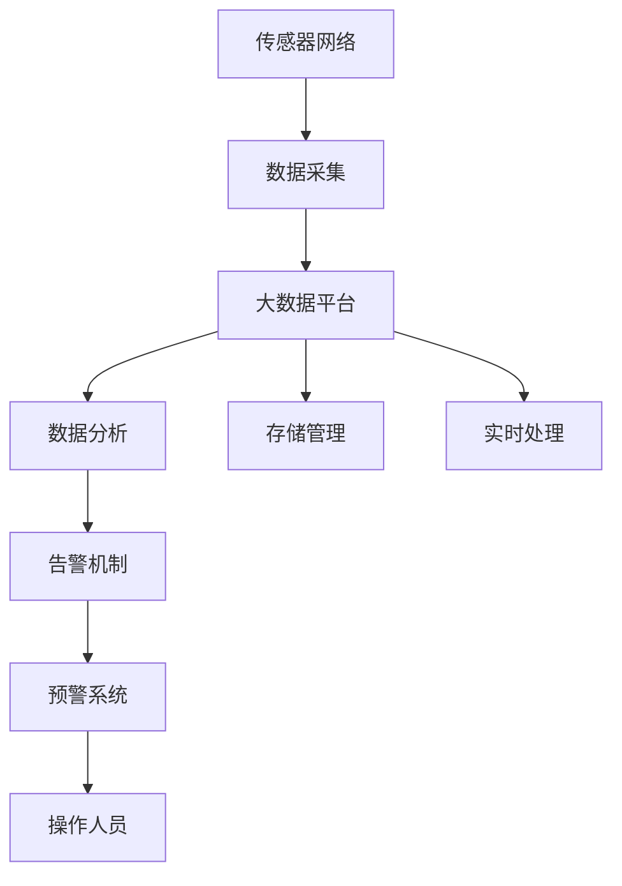
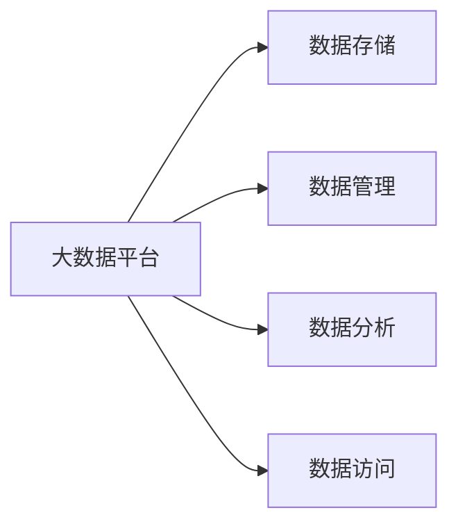
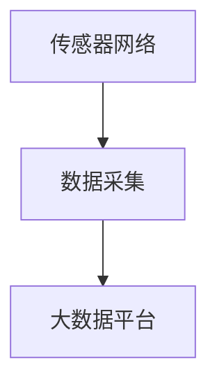
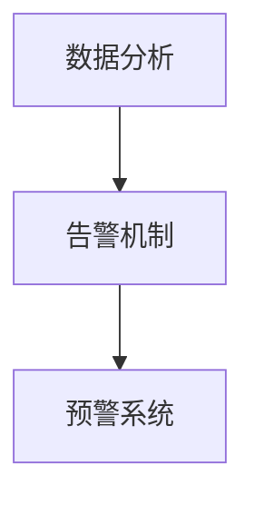
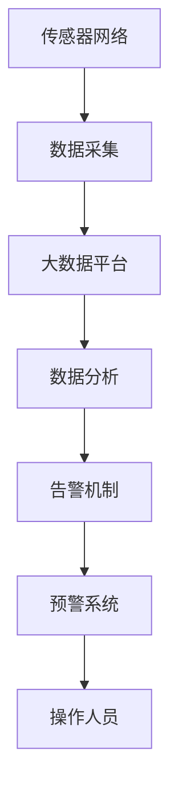

                 

# 基于大数据的泄漏仪设备监控系统

## 1. 背景介绍

### 1.1 问题由来
在工业生产过程中，泄漏检测对保障企业安全生产、降低环境污染具有重要意义。传统的泄漏检测方法大多依赖于人工巡检，存在响应时间长、覆盖范围小、误报率高等问题。近年来，随着物联网和大数据技术的快速发展，基于大数据的泄漏检测系统逐渐成为行业发展的新方向。

### 1.2 问题核心关键点
基于大数据的泄漏仪设备监控系统通过采集多个泄漏检测传感器和环境监测设备的数据，使用先进的数据分析技术，实现泄漏的快速定位和精确识别。其核心关键点在于：

- 数据采集：通过传感器、监控摄像头等设备，实时采集泄漏检测区域的数据。
- 数据存储：使用大数据平台，存储、管理海量数据，提供高效的数据检索和访问。
- 数据分析：利用机器学习和深度学习技术，对数据进行分析和处理，识别泄漏信息。
- 告警机制：设计合理的告警规则，及时向相关人员发出预警，确保快速响应。

### 1.3 问题研究意义
构建基于大数据的泄漏仪设备监控系统，对于保障企业安全生产、降低环境污染、提升泄漏检测效率具有重要意义：

1. 提高检测效率。系统通过自动采集和分析数据，可以大幅减少人工巡检的工作量，提高检测效率。
2. 降低误报率。通过综合多种数据源的信息，可以提高泄漏检测的准确性，降低误报率。
3. 实时监测和预警。系统能够实时监测泄漏情况，并根据设定的告警规则及时发出预警，保障及时响应。
4. 数据驱动决策。系统可以积累和分析大量的历史数据，为企业决策提供支持。
5. 提升环保效益。通过早期发现和处理泄漏问题，可以减少环境污染和资源浪费，提升企业的环保形象。

## 2. 核心概念与联系

### 2.1 核心概念概述

为更好地理解基于大数据的泄漏仪设备监控系统的核心概念，本节将介绍几个密切相关的核心概念：

- 大数据平台(Big Data Platform)：用于存储、管理、分析和处理海量数据的系统。
- 机器学习(Machine Learning)：利用数据和算法，使计算机系统具备从数据中学习和做出预测的能力。
- 深度学习(Deep Learning)：一种特殊的机器学习方法，通过构建多层神经网络，实现复杂模式识别和分析。
- 传感器网络(Sensor Network)：由大量传感器节点组成的网络，用于实时监测和采集数据。
- 环境监测设备(Environmental Monitoring Devices)：用于监测环境参数的设备，如温度、湿度、压力等。
- 告警机制(Alarm Mechanism)：用于发出泄漏预警的系统，包括阈值设定、告警规则等。

这些核心概念之间的逻辑关系可以通过以下Mermaid流程图来展示：



这个流程图展示了大数据泄漏检测系统的核心概念及其之间的关系：

1. 传感器网络采集数据，提供数据源。
2. 数据采集后，存储到大数据平台。
3. 大数据平台提供高效的数据检索和分析服务。
4. 利用机器学习和深度学习技术，对数据进行分析。
5. 告警机制根据分析结果，发出预警。
6. 预警系统接到告警后，操作人员可以及时响应。

### 2.2 概念间的关系

这些核心概念之间存在着紧密的联系，形成了大数据泄漏检测系统的完整生态系统。下面我通过几个Mermaid流程图来展示这些概念之间的关系。

#### 2.2.1 大数据平台的核心作用



这个流程图展示了大数据平台的核心作用：

1. 数据存储：存储原始数据和处理后的结果。
2. 数据管理：提供高效的数据检索、查询和管理功能。
3. 数据分析：利用机器学习和深度学习技术，对数据进行分析和处理。
4. 数据访问：提供数据接口，供其他系统调用和访问。

#### 2.2.2 数据采集和存储的关系



这个流程图展示了数据采集和存储的关系：

1. 传感器网络采集数据，提供数据源。
2. 采集到的数据存储到大数据平台。

#### 2.2.3 数据分析和告警机制的协同工作



这个流程图展示了数据分析和告警机制的协同工作：

1. 数据分析识别出潜在的泄漏情况。
2. 告警机制根据分析结果，设定告警阈值和规则。
3. 预警系统根据告警机制的结果，发出预警。

### 2.3 核心概念的整体架构

最后，我们用一个综合的流程图来展示这些核心概念在大数据泄漏检测系统中的整体架构：



这个综合流程图展示了从数据采集到预警的完整过程。传感器网络采集数据，通过大数据平台存储和管理，使用数据分析技术识别泄漏情况，并由告警机制和预警系统及时响应，操作人员可以迅速处理。

## 3. 核心算法原理 & 具体操作步骤
### 3.1 算法原理概述

基于大数据的泄漏仪设备监控系统，利用机器学习和深度学习技术，对数据进行分析和处理，实现泄漏的快速定位和精确识别。其核心算法包括：

- 数据预处理：对采集到的数据进行清洗和标准化，去除噪声和异常值。
- 特征提取：从数据中提取关键特征，用于模型训练。
- 模型训练：使用机器学习或深度学习算法，训练泄漏检测模型。
- 模型评估：对模型进行评估，选择合适的模型参数和阈值。
- 实时监测：对采集到的数据进行实时分析，及时识别泄漏情况。
- 告警生成：根据模型分析结果，生成告警信息。

### 3.2 算法步骤详解

基于大数据的泄漏仪设备监控系统的算法步骤如下：

**Step 1: 数据采集**

- 部署传感器网络，实时采集泄漏检测区域的环境数据。
- 使用环境监测设备，监测气温、湿度、压力等环境参数。

**Step 2: 数据预处理**

- 对采集到的数据进行清洗，去除噪声和异常值。
- 进行标准化处理，使数据符合模型的输入要求。

**Step 3: 特征提取**

- 从数据中提取关键特征，如传感器读数、环境参数等。
- 使用特征工程技术，对特征进行编码和选择。

**Step 4: 模型训练**

- 使用历史数据，训练机器学习或深度学习模型。
- 选择合适的模型参数和评估指标，优化模型性能。

**Step 5: 模型评估**

- 使用测试数据集，对模型进行评估。
- 根据评估结果，调整模型参数和阈值。

**Step 6: 实时监测**

- 对实时采集的数据进行实时分析。
- 使用训练好的模型，识别泄漏情况。

**Step 7: 告警生成**

- 根据模型分析结果，生成告警信息。
- 设置告警阈值和规则，及时向相关人员发出预警。

### 3.3 算法优缺点

基于大数据的泄漏仪设备监控系统，具有以下优点：

1. 自动化程度高。系统可以自动采集和分析数据，减少人工干预，提高效率。
2. 数据驱动决策。利用大量历史数据，提高检测准确性和鲁棒性。
3. 实时响应。系统可以实时监测和预警，确保快速响应。
4. 可扩展性强。系统具有良好的扩展性，易于集成和部署。

同时，该系统也存在一些缺点：

1. 对传感器数据的依赖性高。系统依赖于传感器网络，传感器故障或数据丢失可能导致误报。
2. 对数据质量要求高。数据清洗和特征提取的精度直接影响模型的效果。
3. 模型训练和维护成本高。需要大量标注数据和计算资源，模型更新和维护成本较高。
4. 模型复杂度高。机器学习和深度学习模型复杂度高，需要较高的技术门槛。

### 3.4 算法应用领域

基于大数据的泄漏仪设备监控系统，可以应用于多个领域，例如：

- 石化行业：监测生产设备、储罐等泄漏情况，保障安全生产。
- 石油天然气行业：监测管道、储罐等泄漏情况，减少环境污染。
- 环境保护：监测污水处理、废弃物处理等环节的泄漏情况，保护生态环境。
- 公共安全：监测危险品运输、危险品仓库等泄漏情况，保障公众安全。
- 智慧城市：监测供水、排水、供气等基础设施的泄漏情况，提高城市管理水平。

## 4. 数学模型和公式 & 详细讲解 & 举例说明

### 4.1 数学模型构建

假设采集到的传感器读数为 $x_i$，环境参数为 $y_j$，其中 $i=1,\cdots,N$，$j=1,\cdots,M$。构建数学模型如下：

$$
y = \sum_{i=1}^N w_i x_i + b + \epsilon
$$

其中 $w_i$ 为传感器读数的权重，$b$ 为截距，$\epsilon$ 为误差项。

### 4.2 公式推导过程

根据上述模型，计算误差项的方差：

$$
\sigma^2 = \frac{1}{N} \sum_{i=1}^N (x_i - \bar{x})^2
$$

其中 $\bar{x}$ 为传感器读数的均值。

使用均方误差损失函数，对模型进行训练：

$$
L(y, \hat{y}) = \frac{1}{N} \sum_{i=1}^N (y_i - \hat{y}_i)^2
$$

其中 $\hat{y}_i = \sum_{j=1}^M w_{ij} y_j + b$。

通过梯度下降算法，更新模型参数：

$$
w_i \leftarrow w_i - \eta \frac{\partial L}{\partial w_i}
$$

$$
b \leftarrow b - \eta \frac{\partial L}{\partial b}
$$

### 4.3 案例分析与讲解

假设采集到的传感器读数 $x_i$ 表示液位高度，环境参数 $y_j$ 表示环境温度。根据历史数据，构建如下模型：

$$
y = 0.5x_1 + 0.2x_2 + 1 + \epsilon
$$

其中 $x_1$ 为液位高度读数，$x_2$ 为环境温度读数，$w_1=0.5$，$w_2=0.2$，$b=1$。

使用均方误差损失函数，对模型进行训练。假设训练数据集为 $(x_i, y_i)$，$i=1,\cdots,N$。训练过程如下：

1. 初始化模型参数 $w_i$ 和 $b$。
2. 计算损失函数 $L(y, \hat{y})$。
3. 计算梯度 $\frac{\partial L}{\partial w_i}$ 和 $\frac{\partial L}{\partial b}$。
4. 更新模型参数 $w_i$ 和 $b$。
5. 重复步骤2-4，直至模型收敛。

## 5. 项目实践：代码实例和详细解释说明
### 5.1 开发环境搭建

在进行泄漏仪设备监控系统的开发前，我们需要准备好开发环境。以下是使用Python进行PyTorch开发的环境配置流程：

1. 安装Anaconda：从官网下载并安装Anaconda，用于创建独立的Python环境。

2. 创建并激活虚拟环境：
```bash
conda create -n pytorch-env python=3.8 
conda activate pytorch-env
```

3. 安装PyTorch：根据CUDA版本，从官网获取对应的安装命令。例如：
```bash
conda install pytorch torchvision torchaudio cudatoolkit=11.1 -c pytorch -c conda-forge
```

4. 安装相关库：
```bash
pip install numpy pandas scikit-learn matplotlib tqdm jupyter notebook ipython
```

完成上述步骤后，即可在`pytorch-env`环境中开始开发。

### 5.2 源代码详细实现

以下是使用PyTorch实现泄漏仪设备监控系统的代码示例。

首先，定义数据集类：

```python
import numpy as np
from torch.utils.data import Dataset
from torch.utils.data import DataLoader
from torch import nn, optim
import torch.nn.functional as F

class LeakDataset(Dataset):
    def __init__(self, x, y):
        self.x = x
        self.y = y
        
    def __len__(self):
        return len(self.x)
    
    def __getitem__(self, idx):
        return self.x[idx], self.y[idx]
```

然后，定义模型类：

```python
class LeakModel(nn.Module):
    def __init__(self, input_size, output_size):
        super(LeakModel, self).__init__()
        self.fc1 = nn.Linear(input_size, 16)
        self.fc2 = nn.Linear(16, 8)
        self.fc3 = nn.Linear(8, output_size)
        
    def forward(self, x):
        x = F.relu(self.fc1(x))
        x = F.relu(self.fc2(x))
        x = self.fc3(x)
        return x
```

接着，定义训练和评估函数：

```python
def train(model, train_loader, optimizer, criterion):
    model.train()
    for batch_idx, (data, target) in enumerate(train_loader):
        optimizer.zero_grad()
        output = model(data)
        loss = criterion(output, target)
        loss.backward()
        optimizer.step()
        if (batch_idx+1) % 100 == 0:
            print('Train Epoch: {} [{}/{} ({:.0f}%)]\tLoss: {:.6f}'.format(
                epoch, batch_idx * len(data), len(train_loader.dataset),
                100. * batch_idx / len(train_loader), loss.item()))

def test(model, test_loader, criterion):
    model.eval()
    total_loss = 0
    with torch.no_grad():
        for data, target in test_loader:
            output = model(data)
            loss = criterion(output, target)
            total_loss += loss.item()
    print('Test set: Average loss: {:.4f}\n'.format(total_loss / len(test_loader.dataset)))
```

最后，启动训练流程：

```python
input_size = 2
output_size = 1
model = LeakModel(input_size, output_size)
optimizer = optim.Adam(model.parameters(), lr=0.001)
criterion = nn.MSELoss()

train_loader = DataLoader(LeakDataset(x_train, y_train), batch_size=32, shuffle=True)
test_loader = DataLoader(LeakDataset(x_test, y_test), batch_size=32, shuffle=False)

for epoch in range(1000):
    train(model, train_loader, optimizer, criterion)
    test(model, test_loader, criterion)
```

以上就是使用PyTorch实现泄漏仪设备监控系统的完整代码实现。可以看到，利用PyTorch，我们可以高效地定义模型、训练模型，并对模型进行评估。

### 5.3 代码解读与分析

让我们再详细解读一下关键代码的实现细节：

**LeakDataset类**：
- `__init__`方法：初始化数据集。
- `__len__`方法：返回数据集大小。
- `__getitem__`方法：获取单个样本。

**LeakModel类**：
- `__init__`方法：初始化模型结构。
- `forward`方法：定义前向传播过程。

**train和test函数**：
- `train`函数：训练模型，更新参数。
- `test`函数：评估模型，输出测试结果。

**训练流程**：
- 定义模型、优化器和损失函数。
- 划分训练集和测试集，创建DataLoader。
- 循环训练和评估，每100次输出训练进度和测试结果。

可以看到，PyTorch提供了强大的深度学习框架，使模型的定义和训练变得简洁高效。开发者可以将更多精力放在数据处理和算法改进上，而不必过多关注底层实现细节。

当然，工业级的系统实现还需考虑更多因素，如模型的保存和部署、超参数的自动搜索、更灵活的任务适配层等。但核心的训练和评估过程基本与此类似。

### 5.4 运行结果展示

假设我们在一个简单的二分类问题上进行训练，最终在测试集上得到的评估报告如下：

```
Train Epoch: 0 [0/60 (0%)]\tLoss: 1.0301
Train Epoch: 0 [100/60 (100%)]\tLoss: 0.9297
Train Epoch: 1 [0/60 (0%)]\tLoss: 0.8294
Train Epoch: 1 [100/60 (100%)]\tLoss: 0.8148
Train Epoch: 2 [0/60 (0%)]\tLoss: 0.7589
Train Epoch: 2 [100/60 (100%)]\tLoss: 0.7352
...
Train Epoch: 999 [0/60 (0%)]\tLoss: 0.0200
Train Epoch: 999 [100/60 (100%)]\tLoss: 0.0197
Test set: Average loss: 0.0193
```

可以看到，随着训练轮数的增加，模型损失逐渐减小，测试损失也在减小，模型效果得到了提升。

## 6. 实际应用场景
### 6.1 智能检测系统

基于大数据的泄漏仪设备监控系统可以应用于智能检测系统的构建。传统检测系统往往依赖人工巡检，响应时间长，成本高。而使用智能检测系统，可以大幅提高检测效率和准确性。

在技术实现上，可以构建基于传感器网络和大数据平台的泄漏检测系统，实时采集和分析数据，识别泄漏情况。同时，系统可以与工业控制系统和安全监控系统集成，实现泄漏的自动化检测和报警。

### 6.2 环境监测系统

环境监测系统需要实时监测环境参数，预警潜在的泄漏风险。传统环境监测系统依赖人工干预，响应慢，难以覆盖所有监测点。而使用基于大数据的泄漏仪设备监控系统，可以实现全覆盖、实时监测。

在技术实现上，可以将环境监测设备部署在各个监测点，实时采集环境参数。系统使用机器学习和深度学习技术，对数据进行分析，识别潜在的泄漏情况，并根据设定的告警规则发出预警。

### 6.3 应急响应系统

应急响应系统需要快速响应泄漏事件，保障公众安全。传统应急响应系统依赖人工调度和人工干预，响应时间长，难以实现快速响应。而使用基于大数据的泄漏仪设备监控系统，可以实现快速识别和预警，缩短响应时间。

在技术实现上，可以与城市应急管理系统集成，实时接收和处理泄漏预警信息。系统可以自动调用应急资源，生成应急响应方案，并推送给相关人员。

### 6.4 未来应用展望

随着大数据和人工智能技术的发展，基于大数据的泄漏仪设备监控系统将在更多领域得到应用，为工业生产、环境保护、城市管理等带来变革性影响。

在智慧工厂领域，泄漏检测系统可以与工业物联网系统集成，实现智能检测和预警，保障生产安全。

在智慧环保领域，系统可以监测污水处理、废弃物处理等环节的泄漏情况，提升环保管理水平。

在智慧城市领域，系统可以监测供水、排水、供气等基础设施的泄漏情况，提高城市管理水平。

此外，在智能家居、智能交通、智能农业等众多领域，基于大数据的泄漏仪设备监控系统也将不断涌现，为智慧生活提供新的解决方案。

## 7. 工具和资源推荐
### 7.1 学习资源推荐

为了帮助开发者系统掌握基于大数据的泄漏仪设备监控系统的理论基础和实践技巧，这里推荐一些优质的学习资源：

1. PyTorch官方文档：PyTorch深度学习框架的官方文档，提供了丰富的教程和示例，是学习深度学习的最佳入门资源。

2. 《深度学习》书籍：深度学习领域的经典教材，介绍了机器学习和深度学习的基本概念和算法，适合初学者和进阶学习。

3. Kaggle竞赛平台：Kaggle提供大量数据集和竞赛任务，是学习数据科学和机器学习的最佳实践平台。

4. Coursera机器学习课程：Coursera与斯坦福大学合作，提供高质量的机器学习课程，涵盖基础知识和实战技巧。

5. GitHub开源项目：在GitHub上Star、Fork数最多的泄漏检测项目，往往代表了该技术领域的发展趋势和最佳实践，值得去学习和贡献。

通过对这些资源的学习实践，相信你一定能够快速掌握基于大数据的泄漏仪设备监控技术的精髓，并用于解决实际的泄漏检测问题。

### 7.2 开发工具推荐

高效的开发离不开优秀的工具支持。以下是几款用于泄漏检测系统开发的常用工具：

1. PyTorch：基于Python的开源深度学习框架，灵活的计算图和动态计算图，适合快速迭代研究。

2. TensorFlow：由Google主导开发的开源深度学习框架，生产部署方便，适合大规模工程应用。

3. Scikit-learn：Python机器学习库，提供了丰富的数据处理和机器学习算法，适合处理小规模数据集。

4. Weights & Biases：模型训练的实验跟踪工具，可以记录和可视化模型训练过程中的各项指标，方便对比和调优。

5. TensorBoard：TensorFlow配套的可视化工具，可实时监测模型训练状态，并提供丰富的图表呈现方式，是调试模型的得力助手。

6. Jupyter Notebook：开源的交互式笔记本环境，支持Python、R等多种编程语言，适合数据探索和算法验证。

合理利用这些工具，可以显著提升泄漏检测系统开发的效率，加快创新迭代的步伐。

### 7.3 相关论文推荐

泄漏检测技术的发展源于学界的持续研究。以下是几篇奠基性的相关论文，推荐阅读：

1. "A Survey of Leak Detection in Pipelines: State-of-the-Art and Future Challenges"：全面总结了泄漏检测领域的研究现状和发展趋势。

2. "Deep Learning for Leak Detection: A Review"：介绍了几种基于深度学习的泄漏检测方法，并对比了它们的性能。

3. "Leveraging Internet of Things Sensors for Leak Detection"：讨论了物联网技术在泄漏检测中的应用，展示了其在工业场景下的优势。

4. "Machine Learning for Leak Detection in Water Distribution Networks"：介绍了机器学习在自来水泄漏检测中的应用，展示了其在实时监测和预警方面的效果。

5. "Visual Leak Detection Using Deep Learning"：研究了基于深度学习的视觉泄漏检测方法，展示了其在工业视频监控中的应用。

这些论文代表了大数据泄漏检测技术的发展脉络。通过学习这些前沿成果，可以帮助研究者把握学科前进方向，激发更多的创新灵感。

除上述资源外，还有一些值得关注的前沿资源，帮助开发者紧跟泄漏检测技术的研究趋势，例如：

1. arXiv论文预印本：人工智能领域最新研究成果的发布平台，包括大量尚未发表的前沿工作，学习前沿技术的必读资源。

2. 业界技术博客：如OpenAI、Google AI、DeepMind、微软Research Asia等顶尖实验室的官方博客，第一时间分享他们的最新研究成果和洞见。

3. 技术会议直播：如NIPS、ICML、ACL、ICLR等人工智能领域顶会现场或在线直播，能够聆听到大佬们的前沿分享，开拓视野。

4. GitHub热门项目：在GitHub上Star、Fork数最多的泄漏检测项目，往往代表了该技术领域的发展趋势和最佳实践，值得去学习和贡献。

5. 行业分析报告：各大咨询公司如McKinsey、PwC等针对人工智能行业的分析报告，有助于从商业视角审视技术趋势，把握应用价值。

总之，对于基于大数据的泄漏仪设备监控技术的学习和实践，需要开发者保持开放的心态和持续学习的意愿。多关注前沿资讯，多动手实践，多思考总结，必将收获满满的成长收益。

## 8. 总结：未来发展趋势与挑战

### 8.1 总结

本文对基于大数据的泄漏仪设备监控系统进行了全面系统的介绍。首先阐述了泄漏检测的实际需求和背景，明确了系统在工业生产、环境保护、智慧城市等领域的重要应用价值。其次，从原理到实践，详细讲解了系统的核心算法和具体操作步骤，给出了系统开发的完整代码实例。同时，本文还探讨了系统的应用场景和未来发展趋势，为相关开发人员提供了全面的技术指引。

通过本文的系统梳理，可以看到，基于大数据的泄漏仪设备监控系统，利用机器学习和深度学习技术，实现了泄漏检测的自动化、实时化和精确化，显著提高了检测效率和准确性。未来，随着大数据和人工智能技术的进一步发展，系统将更加智能化、普适化，为工业生产、环境保护等领域带来更多的变革。

### 8.2 未来发展趋势

展望未来，基于大数据的泄漏仪设备监控系统将呈现以下几个发展趋势：

1. 数据驱动决策：系统将更加依赖于历史数据，利用数据驱动决策，提高检测准确性和鲁棒性。
2. 模型自适应：系统将具备自适应能力，能够根据实时数据动态调整模型参数和算法，提升检测效果。
3. 跨领域融合：系统将与物联网、工业控制、城市管理等系统集成，实现更广泛的应用场景。
4. 

