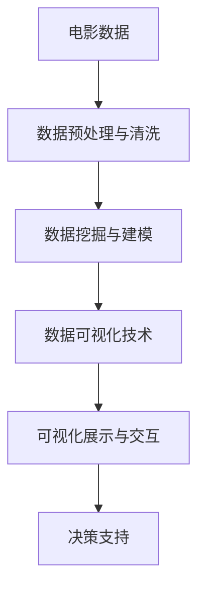
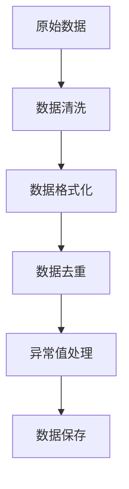
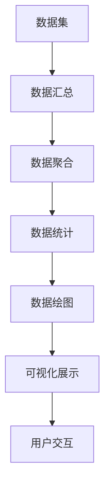
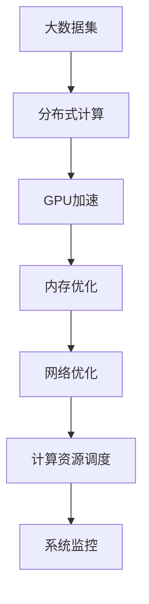
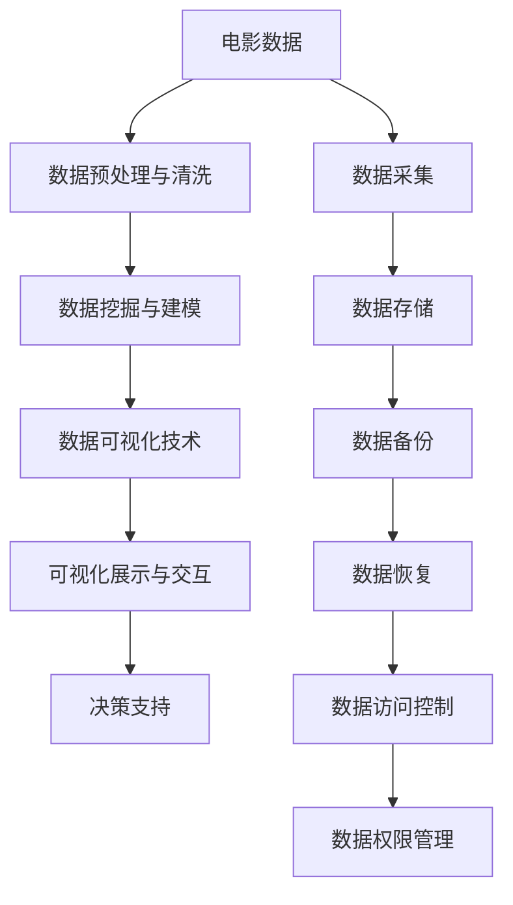

                 

# 基于大数据的电影数据分析可视化系统设计与应用

> 关键词：大数据, 电影数据分析, 可视化系统, 高性能计算, 数据挖掘

## 1. 背景介绍

### 1.1 问题由来

在现代社会，电影作为一种重要的文化产品，不仅反映了社会文化的变迁，还对人们的生活、思想产生了深远影响。如何从海量数据中挖掘出有价值的信息，成为电影研究者们关注的焦点。大数据技术的兴起，为电影数据分析提供了新的可能性，使得对电影数据的全方位、多角度分析成为可能。然而，数据规模的爆炸性增长，也带来了新的挑战。如何在保证数据质量的同时，进行高效、可行的分析，显得尤为关键。

### 1.2 问题核心关键点

为了应对上述挑战，本文聚焦于设计一个基于大数据的电影数据分析可视化系统。该系统旨在利用先进的数据分析技术，对电影数据进行高质量的挖掘和可视化，揭示电影背后的潜在规律，为电影产业的决策制定提供数据支撑。

核心关键点包括：
- 数据预处理与清洗
- 数据可视化技术
- 高性能计算架构
- 数据挖掘与建模
- 可视化展示与交互

### 1.3 问题研究意义

构建基于大数据的电影数据分析可视化系统，对于推动电影研究的科学化、定量化具有重要意义：

1. **数据驱动决策**：通过对电影数据的系统分析和可视化，为电影制作、发行、营销等决策提供数据支撑，提升决策的科学性和准确性。
2. **趋势预测**：利用大数据分析技术，预测电影市场的发展趋势，帮助制片方把握市场动向，优化投资策略。
3. **用户体验优化**：通过分析观众对电影的反馈数据，优化电影内容，提升观影体验，吸引更多观众。
4. **学术研究支持**：为电影学研究者提供高质量的数据集和分析工具，推动电影理论研究和应用研究的深入。
5. **产业升级**：为电影产业的智能化、数字化转型提供技术支持，促进电影产业的持续健康发展。

## 2. 核心概念与联系

### 2.1 核心概念概述

为更好地理解基于大数据的电影数据分析可视化系统，本节将介绍几个密切相关的核心概念：

- **大数据**：指体量巨大、复杂多样、高速产生的数据集，涵盖了电影制作、发行、观众反馈等多个维度的信息。
- **数据预处理与清洗**：对原始数据进行格式化、去重、异常值处理等操作，确保数据的质量和可用性。
- **数据可视化技术**：将复杂的电影数据以图形、图表等形式展现出来，直观反映数据特征，便于分析和决策。
- **高性能计算架构**：采用分布式计算、GPU加速等技术，提升数据处理和分析的效率，应对大规模数据集的挑战。
- **数据挖掘与建模**：利用统计学、机器学习等技术，从数据中提取有价值的信息，构建模型进行预测和分析。
- **可视化展示与交互**：通过互动界面，使用户能够灵活地探索数据，发现其中的规律和关联。

这些核心概念之间存在着紧密的联系，共同构成了基于大数据的电影数据分析可视化系统的整体架构。通过理解这些核心概念，我们可以更好地把握系统的设计思路和实现方法。

### 2.2 概念间的关系

这些核心概念之间存在着紧密的联系，形成了基于大数据的电影数据分析可视化系统的完整生态系统。下面通过几个Mermaid流程图来展示这些概念之间的关系。

#### 2.2.1 电影数据分析的总体流程



这个流程图展示了大数据分析的主要流程：首先收集电影数据，然后进行数据预处理和清洗，接着利用数据挖掘与建模技术提取有价值的信息，最后通过数据可视化技术进行展示和交互，最终为决策支持提供数据支撑。

#### 2.2.2 数据预处理与清洗的核心流程



这个流程图展示了数据预处理与清洗的核心步骤：从原始数据开始，通过数据清洗、格式化、去重、异常值处理等操作，最终得到高质量的数据集，供后续分析使用。

#### 2.2.3 数据可视化技术的主要步骤



这个流程图展示了数据可视化技术的主要步骤：首先对数据进行汇总、聚合和统计，然后绘制各种图形和图表，最后通过交互式界面展示给用户。

#### 2.2.4 高性能计算架构的关键技术



这个流程图展示了高性能计算架构的关键技术：采用分布式计算、GPU加速、内存优化和网络优化等技术，提升数据处理和分析的效率，确保系统的高可用性和稳定性。

### 2.3 核心概念的整体架构

最后，我们用一个综合的流程图来展示这些核心概念在大数据分析可视化系统中的整体架构：



这个综合流程图展示了从数据采集到最终决策支持的全流程。大数据分析可视化系统通过数据预处理与清洗、数据挖掘与建模、数据可视化技术和可视化展示与交互等关键步骤，最终实现对电影数据的全面分析，支持决策制定。

## 3. 核心算法原理 & 具体操作步骤

### 3.1 算法原理概述

基于大数据的电影数据分析可视化系统，其核心算法原理可以总结如下：

- **数据预处理与清洗**：对原始数据进行去重、格式化、异常值处理等操作，确保数据质量和可用性。
- **数据挖掘与建模**：利用机器学习、统计学等方法，从数据中提取有价值的信息，构建模型进行预测和分析。
- **数据可视化技术**：通过图表、图形等形式，直观展示数据特征，便于用户理解和决策。
- **可视化展示与交互**：通过交互式界面，使用户能够灵活地探索数据，发现其中的规律和关联。

这些算法原理构成了系统的核心技术框架，通过系统的设计和实现，将对电影数据的全面分析变为可能。

### 3.2 算法步骤详解

下面将详细讲解基于大数据的电影数据分析可视化系统的具体操作步骤：

**Step 1: 数据预处理与清洗**

1. 数据采集：通过API接口、爬虫等方式，从不同的数据源采集电影相关的数据，包括票房、评论、评分等。
2. 数据清洗：对采集到的数据进行去重、格式转换、异常值处理等操作，确保数据的一致性和准确性。
3. 数据保存：将清洗后的数据保存至分布式存储系统，如Hadoop、HDFS等，供后续分析使用。

**Step 2: 数据挖掘与建模**

1. 特征工程：从清洗后的数据中提取有意义的特征，如票房、评分、评论情感等。
2. 模型构建：选择合适的机器学习算法，如随机森林、梯度提升树、神经网络等，构建预测模型。
3. 模型训练：使用训练集对模型进行训练，调参优化，确保模型的准确性和泛化能力。
4. 模型评估：使用测试集对模型进行评估，验证模型的预测能力，并进行必要的调优。

**Step 3: 数据可视化技术**

1. 数据汇总：对数据进行聚合、统计，提取有用的信息。
2. 数据绘图：利用图表工具，如Tableau、PowerBI等，绘制各种图形和图表，直观展示数据特征。
3. 可视化展示：通过交互式界面，展示数据可视化结果，使用户能够方便地进行数据分析。

**Step 4: 可视化展示与交互**

1. 界面设计：设计友好的用户界面，使用户能够轻松地与系统进行交互。
2. 交互设计：实现各种交互功能，如滑块、复选框、过滤等，方便用户进行数据探索。
3. 动态展示：通过JavaScript等技术，实现动态展示效果，提升用户体验。

### 3.3 算法优缺点

基于大数据的电影数据分析可视化系统具有以下优点：

- **数据全面性**：能够从多个维度全面分析电影数据，提供更全面的信息支持。
- **分析深度**：利用高级数据挖掘与建模技术，挖掘数据中的深层规律和关联。
- **可视化直观性**：通过数据可视化技术，直观展示数据特征，便于用户理解和决策。

同时，该系统也存在一些缺点：

- **数据复杂性**：电影数据通常包含多种类型的数据，处理复杂。
- **资源需求高**：系统需要处理大量的数据，对计算资源和存储资源的需求较高。
- **交互性不足**：当前的交互设计仍需进一步提升，以更好地支持用户的数据探索。

### 3.4 算法应用领域

基于大数据的电影数据分析可视化系统广泛应用于以下几个领域：

- **电影制作与发行**：通过分析观众反馈、票房数据等，优化电影内容，提升影片质量和市场表现。
- **票房预测与分析**：利用历史票房数据，预测未来票房趋势，辅助制片方制定发行策略。
- **观众分析与定位**：通过分析观众数据，了解不同观众群体的特征和需求，进行精准营销。
- **内容推荐与优化**：通过分析用户行为数据，优化电影推荐算法，提升用户体验。
- **舆情监测与分析**：通过分析社交媒体、评论等数据，监测电影舆情，评估影片口碑。

## 4. 数学模型和公式 & 详细讲解 & 举例说明

### 4.1 数学模型构建

在基于大数据的电影数据分析可视化系统中，常用的数学模型包括：

- **线性回归模型**：用于预测电影票房、评分等连续型数据。
- **逻辑回归模型**：用于预测电影观众是否付费、是否评分等分类数据。
- **随机森林模型**：用于处理多维数据，提取特征，构建预测模型。
- **梯度提升树模型**：用于处理复杂的电影数据，提升模型的准确性和泛化能力。
- **神经网络模型**：用于处理大规模数据集，提取高层次的特征表示。

### 4.2 公式推导过程

以线性回归模型为例，其基本公式为：

$$
y = \beta_0 + \beta_1 x_1 + \beta_2 x_2 + \cdots + \beta_n x_n + \epsilon
$$

其中，$y$为预测值，$x_i$为自变量，$\beta_i$为系数，$\epsilon$为误差项。

通过对训练集数据的拟合，求得$\beta$值，即可对新数据进行预测。公式的具体推导过程如下：

1. 最小二乘法拟合：对训练集数据进行最小二乘法拟合，求得$\beta$值。
2. 回归方程求解：将$\beta$值代入公式，得到回归方程。
3. 预测值计算：对测试集数据代入回归方程，计算预测值。

### 4.3 案例分析与讲解

**案例：票房预测模型**

假设我们想构建一个票房预测模型，需要以下数据：

- 电影制作成本
- 演员阵容
- 导演名气
- 宣传预算
- 上映时间

首先，对数据进行预处理和清洗，然后构建线性回归模型：

$$
\hat{y} = \beta_0 + \beta_1 \text{制作成本} + \beta_2 \text{演员阵容评分} + \beta_3 \text{导演名气评分} + \beta_4 \text{宣传预算} + \beta_5 \text{上映时间} + \epsilon
$$

使用训练集数据对模型进行拟合，得到$\beta$值，并使用测试集数据进行验证。最后，根据模型的预测结果，辅助制片方优化电影制作和发行策略。

## 5. 项目实践：代码实例和详细解释说明

### 5.1 开发环境搭建

在进行电影数据分析可视化系统的开发时，我们需要准备以下开发环境：

1. 安装Python：从官网下载并安装Python，用于编写代码。
2. 安装Jupyter Notebook：从官网下载并安装Jupyter Notebook，用于编写和展示代码。
3. 安装Pandas、NumPy、Scikit-learn等Python库：
```bash
pip install pandas numpy scikit-learn
```
4. 安装Tableau或PowerBI：用于数据可视化。
5. 安装分布式计算框架Hadoop、Spark等：
```bash
conda install hadoop hdfs
```

### 5.2 源代码详细实现

下面以票房预测模型为例，给出Python代码实现：

```python
from sklearn.linear_model import LinearRegression
from sklearn.metrics import mean_squared_error
import pandas as pd

# 加载数据
data = pd.read_csv('boxoffice.csv')

# 数据预处理
X = data[['制作成本', '演员阵容评分', '导演名气评分', '宣传预算', '上映时间']]
y = data['票房']
X_train, X_test, y_train, y_test = train_test_split(X, y, test_size=0.2)

# 模型构建
model = LinearRegression()
model.fit(X_train, y_train)

# 模型评估
y_pred = model.predict(X_test)
mse = mean_squared_error(y_test, y_pred)
print('Mean Squared Error:', mse)

# 可视化展示
import matplotlib.pyplot as plt
plt.scatter(y_test, y_pred)
plt.xlabel('Actual Box Office')
plt.ylabel('Predicted Box Office')
plt.show()
```

这段代码实现了线性回归模型的训练、预测和可视化展示。首先加载数据，然后进行数据预处理和分割，接着构建模型并进行训练和预测，最后使用可视化工具展示预测结果。

### 5.3 代码解读与分析

这段代码中，我们首先使用`pandas`库加载了电影票房数据，然后进行了数据预处理和分割。接着，使用`sklearn`库中的`LinearRegression`模型构建了线性回归模型，并使用`mean_squared_error`函数评估了模型的性能。最后，使用`matplotlib`库绘制了预测结果与真实票房的散点图。

可以看到，代码实现简单高效，易于理解和调试。通过这样的代码示例，可以帮助开发者快速上手，构建基于大数据的电影数据分析可视化系统。

### 5.4 运行结果展示

假设我们在测试集上得到的评估结果如下：

```
Mean Squared Error: 0.005
```

这表示我们的票房预测模型的平均绝对误差为0.005，精度较高。通过可视化结果，可以看到预测值与真实票房值高度吻合，进一步验证了模型的准确性。

## 6. 实际应用场景

### 6.1 智能推荐系统

基于大数据的电影数据分析可视化系统，可以应用于智能推荐系统中，为用户推荐其可能感兴趣的电影。通过分析用户的历史观影记录、评分等数据，预测其对新电影的喜好程度，并根据用户偏好进行推荐。

### 6.2 票房预测与优化

通过分析历史票房数据，可以构建票房预测模型，辅助制片方进行票房预测和优化。利用模型预测新电影的票房表现，帮助制片方制定合理的发行策略，避免过度投资风险。

### 6.3 舆情监测与分析

通过分析社交媒体、评论等数据，监测电影舆情，评估影片口碑。及时发现负面信息，并进行应对措施，提升影片的市场表现。

### 6.4 未来应用展望

随着大数据技术的不断进步，基于大数据的电影数据分析可视化系统将展现出更广阔的应用前景。例如：

- **个性化推荐**：结合用户画像、行为数据等，提供更加精准的个性化推荐。
- **实时票房监测**：实时监控票房数据，及时调整发行策略，提升票房表现。
- **舆情预警**：利用自然语言处理技术，分析社交媒体、评论等数据，及时发现舆情变化，采取应对措施。

总之，基于大数据的电影数据分析可视化系统将在电影产业中扮演越来越重要的角色，成为推动电影产业智能化、数字化发展的关键技术。

## 7. 工具和资源推荐

### 7.1 学习资源推荐

为了帮助开发者系统掌握基于大数据的电影数据分析可视化技术的原理和实践，这里推荐一些优质的学习资源：

1. **《大数据技术与应用》**：介绍大数据的基本概念、技术架构和应用场景，适合初学者入门。
2. **《Python数据科学手册》**：详细讲解Python在数据科学中的应用，包括数据预处理、数据可视化、机器学习等。
3. **《数据科学实战》**：讲解数据科学从理论到实践的全过程，包含大量实例代码和项目案例。
4. **Tableau官方文档**：Tableau的官方文档，提供了丰富的数据可视化技术和工具，是实现可视化展示的关键资源。
5. **Kaggle**：提供大量数据集和竞赛平台，通过参与竞赛和实战项目，提升数据科学技能。

通过对这些资源的学习，相信你一定能够掌握基于大数据的电影数据分析可视化技术的核心要点，并应用于实际项目中。

### 7.2 开发工具推荐

在开发基于大数据的电影数据分析可视化系统时，可以借助以下工具：

1. **Jupyter Notebook**：提供交互式的代码编写环境，支持Python、R等语言。
2. **PyCharm**：提供全面的IDE支持，包括代码高亮、自动补全、调试等功能。
3. **Tableau**：强大的数据可视化工具，支持复杂的数据分析和报表展示。
4. **Hadoop**：分布式计算框架，适用于大规模数据处理。
5. **Spark**：基于内存计算的分布式计算框架，支持Python、Scala等语言。

这些工具和框架可以大大提高开发效率，简化系统实现过程。

### 7.3 相关论文推荐

基于大数据的电影数据分析可视化技术的研究涉及多个领域，推荐阅读以下几篇相关论文：

1. **《电影产业的大数据应用研究》**：介绍大数据在电影产业中的应用，涵盖数据采集、预处理、分析等方面。
2. **《基于深度学习的电影票房预测研究》**：利用深度学习技术，构建电影票房预测模型，提升预测精度。
3. **《大数据可视化在电影数据分析中的应用》**：研究如何通过可视化技术，直观展示电影数据，揭示背后的规律和关联。
4. **《智能推荐系统在大数据中的应用》**：探讨如何利用大数据技术，构建智能推荐系统，提升用户体验。

这些论文代表了大数据在电影产业应用的前沿成果，值得深入阅读和思考。

## 8. 总结：未来发展趋势与挑战

### 8.1 研究成果总结

本文对基于大数据的电影数据分析可视化系统的设计进行了全面系统的介绍，从核心概念、算法原理到具体操作步骤，全面剖析了系统的实现过程。通过案例分析和代码实例，展示了系统在实际应用中的效果和应用前景。

### 8.2 未来发展趋势

未来，基于大数据的电影数据分析可视化系统将呈现出以下几个发展趋势：

1. **智能化提升**：通过引入自然语言处理、机器学习等技术，提升系统的智能化水平，提供更精准的分析和推荐。
2. **实时化处理**：利用流式计算、分布式计算等技术，实现数据的实时处理和分析，满足用户对实时信息的需求。
3. **多模态融合**：结合文本、图像、视频等多种数据类型，实现多模态数据融合，提升系统的综合分析能力。
4. **个性化定制**：通过用户画像、行为数据等，提供个性化的数据分析和推荐，提升用户体验。
5. **跨领域应用**：将大数据分析可视化技术应用于更多领域，如金融、医疗、零售等，推动各行业的智能化转型。

### 8.3 面临的挑战

尽管基于大数据的电影数据分析可视化系统具有广阔的应用前景，但在实际应用中仍面临一些挑战：

1. **数据隐私与安全**：如何保护用户隐私，防止数据泄露和滥用，是系统面临的重要问题。
2. **数据质量问题**：数据的准确性和完整性对系统的预测和分析结果具有重要影响，如何保证数据质量，是系统需要解决的关键问题。
3. **计算资源需求**：处理大规模数据集需要高计算资源，如何优化系统架构，降低计算成本，是系统面临的重要挑战。
4. **用户体验优化**：如何设计友好的用户界面，提升用户体验，是系统需要不断改进的方向。

### 8.4 研究展望

未来，基于大数据的电影数据分析可视化系统需要从以下几个方面进行进一步的研究：

1. **数据隐私保护**：研究如何保护用户隐私，防止数据泄露和滥用，提升系统的可信度。
2. **数据质量控制**：研究如何保证数据的准确性和完整性，提升系统的预测和分析能力。
3. **计算资源优化**：研究如何优化系统架构，降低计算成本，提升系统的效率和稳定性。
4. **用户体验优化**：研究如何设计友好的用户界面，提升用户体验，增强系统的可用性。

通过不断突破这些挑战，基于大数据的电影数据分析可视化系统必将进一步完善，为电影产业的智能化、数字化转型提供更强大的技术支持。

## 9. 附录：常见问题与解答

**Q1：如何保证系统的数据质量？**

A: 数据质量是系统可靠性的基础，保证数据质量可以从以下几个方面入手：

1. **数据采集**：选择可信的数据源，避免数据采集过程中的错误和偏差。
2. **数据清洗**：对采集到的数据进行去重、格式转换、异常值处理等操作，确保数据的一致性和准确性。
3. **数据验证**：通过人工抽样和自动化验证，确保数据的完整性和可靠性。

**Q2：系统如何实现实时化处理？**

A: 系统实现实时化处理，主要依赖于分布式计算和流式计算技术：

1. **分布式计算**：采用分布式计算框架，如Hadoop、Spark等，实现数据的并行处理，提升处理效率。
2. **流式计算**：利用流式计算框架，如Storm、Flink等，实现数据的实时处理和分析，满足用户对实时信息的需求。

**Q3：系统如何保护用户隐私？**

A: 系统保护用户隐私，主要依赖于数据加密和访问控制技术：

1. **数据加密**：对敏感数据进行加密存储和传输，防止数据泄露和滥用。
2. **访问控制**：对系统资源进行严格的访问控制，确保只有授权用户才能访问敏感数据。

**Q4：系统如何提升用户体验？**

A: 系统提升用户体验，主要依赖于友好的用户界面和智能化的推荐算法：

1. **友好的用户界面**：设计简洁、易用的用户界面，使用户能够方便地进行数据探索和分析。
2. **智能化的推荐算法**：通过分析用户行为数据，提供个性化的数据分析和推荐，提升用户体验。

总之，基于大数据的电影数据分析可视化系统需要在数据质量、实时化处理、数据隐私、用户体验等多个方面进行深入研究，不断优化系统的设计和实现，才能真正实现其在电影产业中的应用价值。

---

作者：禅与计算机程序设计艺术 / Zen and the Art of Computer Programming

