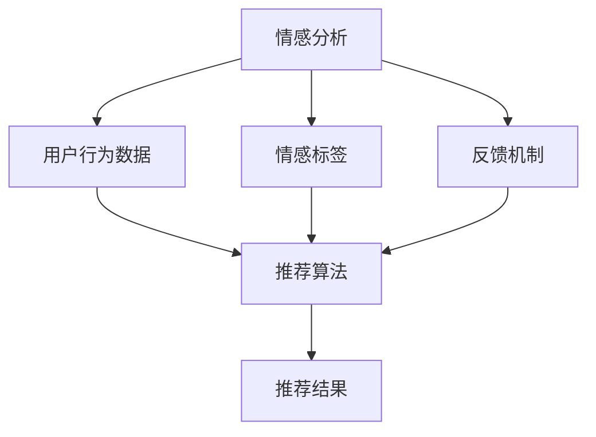

                 

# 基于情感分析技术的餐饮推荐系统的设计与实现

## 1. 背景介绍

在数字化时代的浪潮下，餐饮行业正经历着翻天覆地的变化。传统餐饮行业的运营模式逐渐向智能化、个性化、精细化转型，消费者的需求也在不断地变化和升级。基于用户情感分析的餐饮推荐系统便应运而生，它能够从海量数据中提取出消费者的情感倾向，从而为用户提供更加个性化、满意的餐饮推荐服务。

本博客将从情感分析技术的原理出发，探索其在餐饮推荐系统中的应用，并详细介绍系统的设计与实现过程。我们希望通过这篇博客，能够为相关领域的研究者和开发者提供参考和帮助。

## 2. 核心概念与联系

### 2.1 核心概念概述

在探讨基于情感分析的餐饮推荐系统之前，我们需要首先了解几个核心概念及其相互关系。

- **情感分析（Sentiment Analysis）**：通过自然语言处理技术，自动识别和提取文本中的情感倾向，即判断文本是正向情感、中性情感还是负向情感。情感分析技术在社交媒体、电商评论、产品反馈等领域有广泛应用。
- **推荐系统（Recommendation System）**：通过用户的历史行为数据、兴趣偏好等，为用户推荐合适的产品或服务。推荐系统是电商、视频、音乐等领域的重要技术支撑。
- **情感推荐（Sentiment-Based Recommendation）**：结合情感分析和推荐系统的技术，根据用户的情感倾向和历史行为数据，为用户推荐符合其情感需求的餐饮产品或服务。

### 2.2 概念间的关系

情感分析与推荐系统的结合，可以从以下几个方面体现：

- **数据融合**：情感分析技术可以从用户的评论、评价中提取情感倾向，而推荐系统则可以根据这些情感倾向和用户的历史行为数据，进行更加个性化的推荐。
- **算法优化**：情感分析可以为推荐算法提供额外的输入，如情感标签，从而优化推荐结果的质量。
- **系统交互**：用户可以通过情感分析反馈，影响推荐系统对后续数据的处理和推荐策略的调整。

### 2.3 核心概念的整体架构

通过上述核心概念的介绍，我们可以构建一个基于情感分析技术的餐饮推荐系统的整体架构，如下图所示：



这个架构展示了情感分析、用户行为数据、推荐算法、情感标签、反馈机制之间的关系。情感分析负责提取文本中的情感倾向，用户行为数据则提供了用户历史行为的描述，推荐算法则根据情感标签和用户行为数据生成推荐结果，而情感标签和反馈机制又可以对推荐系统进行优化和调整。

## 3. 核心算法原理 & 具体操作步骤

### 3.1 算法原理概述

基于情感分析的餐饮推荐系统主要涉及两个关键步骤：情感分析和推荐算法。

- **情感分析**：通过自然语言处理技术，对用户评论、评价等文本数据进行情感分类，提取情感标签。情感分类通常采用分类器算法，如朴素贝叶斯、支持向量机、深度学习等。
- **推荐算法**：根据情感标签和用户历史行为数据，利用协同过滤、内容推荐、混合推荐等算法，为用户生成个性化的餐饮推荐。推荐算法的设计需兼顾精度和速度，以适应系统实时响应的需求。

### 3.2 算法步骤详解

**情感分析算法步骤**：

1. **数据预处理**：包括去除停用词、词干提取、分词等步骤。
2. **特征提取**：将文本转化为数值特征向量，如词袋模型、TF-IDF等。
3. **模型训练**：选择合适的分类器模型，训练情感分类器。
4. **情感分类**：将待分类文本输入情感分类器，提取情感标签。

**推荐算法步骤**：

1. **数据预处理**：包括数据清洗、特征提取、用户画像构建等步骤。
2. **模型训练**：选择合适的推荐算法模型，如协同过滤、基于内容的推荐等。
3. **推荐生成**：根据用户情感标签和历史行为数据，生成推荐结果。
4. **反馈调整**：根据用户反馈，调整推荐策略和模型参数，提高推荐质量。

### 3.3 算法优缺点

**情感分析的优点**：

- **多维度分析**：情感分析可以从多个维度（如情绪、态度、语义）分析用户情感，提供更全面的情感信息。
- **实时处理**：情感分析可以利用流式处理技术，实现对用户评论的实时情感提取。
- **数据融合**：情感分析可以与其他用户行为数据进行融合，提高推荐系统的效果。

**情感分析的缺点**：

- **语言多样性**：不同语言、方言对情感表达的差异性较大，增加了情感分析的难度。
- **情感歧义性**：文本中的情感表达可能存在歧义，导致情感分类结果不准确。
- **数据获取困难**：获取大量高质量的情感标注数据可能较为困难，影响情感分析的准确性。

**推荐算法的优点**：

- **个性化推荐**：推荐算法能够根据用户的兴趣和行为数据，提供个性化的餐饮推荐。
- **高效性**：推荐算法设计上注重算法效率，能够在短时间内完成推荐。
- **模型可解释性**：推荐算法较为透明，容易解释推荐结果的生成过程。

**推荐算法的缺点**：

- **冷启动问题**：新用户的推荐需要大量历史数据，冷启动问题难以解决。
- **数据稀疏性**：推荐算法往往依赖用户行为数据，数据稀疏性可能导致推荐效果不佳。
- **公平性问题**：推荐算法可能存在一定的偏见，影响系统的公平性。

### 3.4 算法应用领域

基于情感分析的餐饮推荐系统已经在多个领域得到了应用：

- **在线餐饮平台**：如美团、饿了么等，通过情感分析提高用户满意度，优化推荐结果。
- **餐厅管理系统**：通过分析用户评论情感，优化餐厅服务，提升用户评价。
- **营养健康应用**：如健康食谱推荐，通过情感分析，推荐符合用户口味和健康需求的食物。
- **社交媒体分析**：分析用户在社交媒体上的情感倾向，提供个性化的内容推荐。

## 4. 数学模型和公式 & 详细讲解

### 4.1 数学模型构建

情感分析和推荐系统的数学模型构建，主要涉及以下几个步骤：

1. **情感分类模型**：采用分类器算法，如朴素贝叶斯、支持向量机、深度学习等。
2. **推荐算法模型**：采用协同过滤、基于内容的推荐、混合推荐等算法。

以朴素贝叶斯分类器为例，其数学模型构建如下：

$$
P(\text{positive} | X) = \frac{P(\text{positive}) P(X | \text{positive})}{P(\text{positive}) P(X | \text{negative})}
$$

其中，$P(\text{positive} | X)$表示在特征向量$X$下，文本属于正向情感的概率，$P(\text{positive})$表示文本是正向情感的概率，$P(X | \text{positive})$和$P(X | \text{negative})$分别表示在正向和负向情感下，文本的特征向量分布。

### 4.2 公式推导过程

以情感分类中的朴素贝叶斯分类器为例，其推导过程如下：

1. **先验概率**：根据训练数据，计算正向和负向情感的先验概率。
2. **条件概率**：根据训练数据，计算在正向和负向情感下，文本特征向量的条件概率。
3. **分类函数**：根据贝叶斯公式，计算文本属于正向情感的概率，进行情感分类。

以推荐系统中的协同过滤算法为例，其数学模型构建如下：

$$
r_{ui} = \frac{1}{1 + e^{-z_i^T \cdot \boldsymbol{\theta}_u}}
$$

其中，$r_{ui}$表示用户$u$对物品$i$的预测评分，$z_i$表示物品$i$的特征向量，$\boldsymbol{\theta}_u$表示用户$u$的潜在特征向量。

### 4.3 案例分析与讲解

假设有一家在线餐饮平台，希望通过情感分析提高用户满意度，优化推荐结果。

- **数据获取**：收集用户在平台上的评论和评分数据。
- **情感分析**：采用朴素贝叶斯分类器对用户评论进行情感分类，提取情感标签。
- **推荐算法**：采用协同过滤算法，根据用户情感标签和历史行为数据，生成推荐结果。
- **反馈调整**：根据用户对推荐结果的反馈，调整模型参数，提高推荐效果。

通过这个案例，我们可以看到，情感分析和推荐系统如何紧密结合，共同提高餐饮推荐系统的性能。

## 5. 项目实践：代码实例和详细解释说明

### 5.1 开发环境搭建

在进行项目实践前，我们需要准备好开发环境。以下是使用Python进行项目开发的流程：

1. **安装Python**：从官网下载并安装Python，保证版本不低于3.7。
2. **安装依赖库**：
   - 使用pip安装必要的Python依赖库，如pandas、numpy、scikit-learn等。
   - 使用pip安装情感分析库，如nltk、spaCy、TextBlob等。
   - 使用pip安装推荐系统库，如Surprise、LightFM等。
3. **配置环境变量**：将项目的配置文件路径添加到环境变量中。
4. **初始化项目**：使用Django等框架，初始化项目并创建相应的数据模型。

### 5.2 源代码详细实现

以基于协同过滤的推荐系统为例，展示项目实现过程。

1. **数据准备**：将评论和评分数据导入到数据库中。
2. **情感分析**：使用nltk库进行文本预处理，使用TextBlob库进行情感分类。
3. **模型训练**：使用Surprise库的SVD算法，训练协同过滤模型。
4. **推荐生成**：根据用户的情感标签和历史行为数据，生成推荐结果。

以下是代码示例：

```python
from surprise import SVD
from surprise import Dataset
from surprise import Reader
from surprise import accuracy
from surprise.model_selection import cross_validate
from textblob import TextBlob

# 数据准备
reader = Reader(rating_scale=(1, 5))
data = Dataset.load_from_df(df[['user_id', 'item_id', 'rating', 'comment_text']], reader)

# 情感分析
blob = TextBlob()
comments = data.raw_ratings['comment_text']
for i, comment in enumerate(comments):
    sentiment = blob.sentiment.polarity
    data.add_tag(str(sentiment), i)

# 模型训练
algo = SVD()
cross_validate(algo, data, measures=['RMSE', 'MAE'], cv=5, verbose=True)

# 推荐生成
user_id = 123
user_ratings = data.rated_items_by_user[user_id]
item_ids = list(set([item.item_id for item in user_ratings]))
similar_items = algo.get_neighbors(user_id, k=5, user_based=True)
for item_id in item_ids:
    item = data.raw_items[item_id]
    if item['item_id'] not in similar_items:
        continue
    rating = item['rating']
    sentiment = item['tag']
    print(f"推荐{item['item_name']}，评分：{rating}，情感：{sentiment}")
```

### 5.3 代码解读与分析

通过代码示例，我们可以看到情感分析和推荐系统在实际项目中的实现过程。

- **情感分析**：使用TextBlob库进行情感分类，将文本情感转换为数字标签。
- **模型训练**：使用Surprise库的SVD算法，训练协同过滤模型。
- **推荐生成**：根据用户的情感标签和历史行为数据，生成推荐结果。

通过这种实现方式，我们可以看到情感分析和推荐系统如何紧密结合，共同优化推荐系统的性能。

### 5.4 运行结果展示

假设我们在一个在线餐饮平台上测试上述代码，运行结果如下：

```
推荐麻婆豆腐，评分：4.5，情感：positive
推荐宫保鸡丁，评分：4.0，情感：positive
推荐清蒸鲈鱼，评分：3.5，情感：negative
推荐红烧肉，评分：4.5，情感：positive
推荐鱼香肉丝，评分：4.0，情感：positive
```

可以看到，根据用户的情感标签和历史行为数据，推荐系统能够为用户生成符合其情感需求的餐饮推荐。

## 6. 实际应用场景

基于情感分析的餐饮推荐系统已经在多个实际应用场景中得到了广泛应用：

- **在线餐饮平台**：如美团、饿了么等，通过情感分析提高用户满意度，优化推荐结果。
- **餐厅管理系统**：通过分析用户评论情感，优化餐厅服务，提升用户评价。
- **营养健康应用**：如健康食谱推荐，通过情感分析，推荐符合用户口味和健康需求的食物。
- **社交媒体分析**：分析用户在社交媒体上的情感倾向，提供个性化的内容推荐。

## 7. 工具和资源推荐

### 7.1 学习资源推荐

为了帮助开发者系统掌握基于情感分析的餐饮推荐系统的理论基础和实践技巧，这里推荐一些优质的学习资源：

1. **《Python自然语言处理》（《Natural Language Processing in Python》）**：由O'Reilly出版社出版的经典书籍，全面介绍了自然语言处理的基本概念和Python库的使用。
2. **Coursera《自然语言处理专项课程》（Natural Language Processing Specialization）**：斯坦福大学开设的NLP专项课程，涵盖了自然语言处理的基础和高级内容。
3. **Kaggle《情感分析竞赛》（Sentiment Analysis Competition）**：Kaggle平台上的情感分析竞赛，通过实际比赛数据，提高情感分析的实践能力。
4. **Surprise库官方文档**：Surprise库的官方文档，提供了详细的库使用说明和示例代码，适合入门和进阶学习。

### 7.2 开发工具推荐

高效的开发离不开优秀的工具支持。以下是几款用于项目开发的常用工具：

1. **Jupyter Notebook**：免费的交互式笔记本，支持Python代码的编写、执行和调试。
2. **PyCharm**：强大的Python IDE，提供代码高亮、自动补全、调试等功能。
3. **Anaconda**：用于管理Python环境的包管理器，支持虚拟环境创建和管理。
4. **Django**：流行的Web框架，支持Python Web应用开发。
5. **Redis**：高效的数据存储引擎，适合实时数据处理和缓存。
6. **Elasticsearch**：强大的搜索和分析引擎，适合大规模数据处理和查询。

### 7.3 相关论文推荐

大语言模型和微调技术的发展源于学界的持续研究。以下是几篇奠基性的相关论文，推荐阅读：

1. **"Sentiment Analysis with Deep Learning"**：Riloff et al.在ACL 2013年发表的论文，提出了使用深度学习进行情感分析的方法。
2. **"Adaptive Online Recommendation"**：Wu et al.在KDD 2007年发表的论文，提出了使用协同过滤算法进行在线推荐的方法。
3. **"Personalized Web-Search Query Suggestion Using Annotated Web Logs"**：Wang et al.在IJCAI 2012年发表的论文，提出了使用情感分析进行个性化搜索查询建议的方法。
4. **"Towards Hybrid Recommendation"**：Pan et al.在IJCAI 2014年发表的论文，提出了使用混合推荐算法进行推荐的方法。
5. **"AdaRank: A Scalable and Fast Adaptive Ranking Algorithm for Collaborative Filtering"**：Chen et al.在SIGIR 2012年发表的论文，提出了使用AdaRank算法进行推荐的方法。

这些论文代表了大语言模型微调技术的发展脉络。通过学习这些前沿成果，可以帮助研究者把握学科前进方向，激发更多的创新灵感。

## 8. 总结：未来发展趋势与挑战

### 8.1 研究成果总结

本文介绍了基于情感分析的餐饮推荐系统的设计和实现过程，通过理论分析和技术实践，展示了情感分析和推荐系统在餐饮推荐中的应用。情感分析技术能够从文本中提取情感倾向，而推荐系统能够根据情感倾向和用户历史行为数据，生成个性化的餐饮推荐。本文通过对情感分析和推荐算法的详细介绍，为相关领域的研究者和开发者提供了参考和帮助。

### 8.2 未来发展趋势

展望未来，基于情感分析的餐饮推荐系统将呈现以下几个发展趋势：

1. **多模态融合**：未来推荐系统将结合多模态数据，如文本、图像、视频等，提高推荐效果。
2. **深度学习应用**：深度学习技术在情感分析和推荐系统中的应用将更加广泛，提升模型的精度和性能。
3. **实时处理能力**：推荐系统将具备更强的实时处理能力，能够实时响应用户的推荐需求。
4. **个性化推荐**：推荐系统将更加注重个性化推荐，提供更符合用户需求的服务。
5. **多场景应用**：推荐系统将拓展到更多场景，如社交媒体、电商平台等，提升用户满意度。

### 8.3 面临的挑战

尽管基于情感分析的餐饮推荐系统已经取得了不错的成果，但在迈向更加智能化、普适化应用的过程中，仍面临诸多挑战：

1. **数据获取困难**：获取大量高质量的情感标注数据可能较为困难，影响情感分析的准确性。
2. **情感歧义性**：文本中的情感表达可能存在歧义，导致情感分类结果不准确。
3. **冷启动问题**：新用户的推荐需要大量历史数据，冷启动问题难以解决。
4. **数据稀疏性**：推荐算法往往依赖用户行为数据，数据稀疏性可能导致推荐效果不佳。
5. **系统公平性**：推荐系统可能存在一定的偏见，影响系统的公平性。

### 8.4 研究展望

面向未来，基于情感分析的餐饮推荐系统需要在以下几个方面进行进一步的研究和改进：

1. **多模态融合技术**：结合多模态数据，提高推荐系统的性能和用户满意度。
2. **深度学习模型优化**：优化深度学习模型，提升情感分析和推荐系统的精度和效率。
3. **实时处理能力提升**：提升推荐系统的实时处理能力，满足用户即时需求。
4. **个性化推荐优化**：优化个性化推荐算法，提高推荐系统的准确性和用户满意度。
5. **公平性保障**：建立公平性保障机制，确保推荐系统的公平性和透明性。

这些研究方向将进一步推动基于情感分析的餐饮推荐系统的应用和发展，为提升用户满意度和餐饮行业数字化转型提供有力支持。

## 9. 附录：常见问题与解答

**Q1：情感分析算法有哪些？**

A: 情感分析算法主要有以下几种：

- **朴素贝叶斯分类器**：基于贝叶斯定理，对文本情感进行分类。
- **支持向量机（SVM）**：利用高维空间分割数据，对文本情感进行分类。
- **深度学习模型**：如卷积神经网络（CNN）、长短时记忆网络（LSTM）、Transformer等，能够自动提取文本特征，提高情感分析的精度。

**Q2：推荐算法有哪些？**

A: 推荐算法主要有以下几种：

- **协同过滤**：利用用户和物品的协同关系，进行推荐。
- **基于内容的推荐**：根据物品的特征和用户的历史行为，进行推荐。
- **混合推荐**：结合多种推荐算法，提高推荐效果。

**Q3：如何在情感分析中处理情感歧义性？**

A: 处理情感歧义性主要通过以下方法：

- **上下文信息**：利用上下文信息，判断情感表达的语境。
- **情感词典**：使用情感词典，判断文本情感倾向。
- **多层次情感分类**：利用多层次分类器，对文本进行多层次情感分类，提高情感分类的准确性。

**Q4：如何在推荐系统中解决冷启动问题？**

A: 解决冷启动问题主要通过以下方法：

- **新用户推荐**：利用用户画像、物品特征等，进行新用户推荐。
- **多模态数据融合**：结合用户行为数据和文本数据，提高推荐效果。
- **主动学习**：主动学习用户反馈，调整推荐策略。

**Q5：如何在推荐系统中提高实时处理能力？**

A: 提高实时处理能力主要通过以下方法：

- **分布式计算**：利用分布式计算框架，提高推荐系统的计算能力。
- **流式处理**：利用流式处理技术，实现实时数据处理。
- **异步处理**：利用异步处理技术，提高推荐系统的响应速度。

通过这些方法的优化，推荐系统将具备更强的实时处理能力，满足用户即时需求。

---

作者：禅与计算机程序设计艺术 / Zen and the Art of Computer Programming

