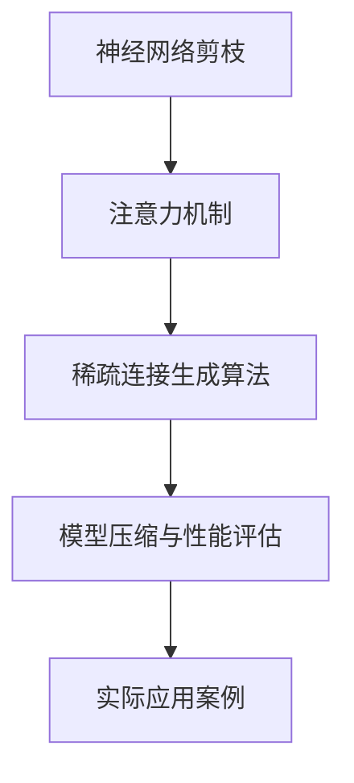

                 

# 基于注意力机制的神经网络剪枝方法研究

> 关键词：神经网络剪枝,注意力机制,稀疏连接,模型压缩,深度学习优化

## 1. 背景介绍

### 1.1 问题由来
随着深度学习技术在各个领域的广泛应用，神经网络模型在规模和复杂度上不断增加，对计算资源和存储空间的依赖也日益剧增。例如，图像识别领域的VGG模型和目标检测领域的Faster R-CNN模型，动辄有上亿的参数量，对硬件资源提出了极高的要求。这在数据资源有限、计算资源受限的应用场景中，无疑是一个巨大的挑战。

为了解决这一问题，研究者们提出了各种神经网络压缩方法，以减少模型参数量，提高计算效率，降低存储需求。其中，神经网络剪枝（Pruning）是一种非常有效的压缩方法，它通过移除不重要的神经元或连接，从而达到压缩模型的目的。注意力机制（Attention Mechanism）作为一种重要的神经网络架构元素，可以用于增强模型的信息处理能力，但其本身也存在大量的冗余连接。因此，将注意力机制和剪枝方法结合，可以进一步提升模型的性能和可解释性。

### 1.2 问题核心关键点
本文旨在研究基于注意力机制的神经网络剪枝方法，通过结合注意力机制与剪枝技术，实现对模型的优化和压缩。具体来说，本文将探讨以下关键问题：

- 注意力机制与剪枝的结合方式：如何选择和剪枝注意力机制中的关键连接和神经元。
- 稀疏连接生成算法：如何生成高效的稀疏连接矩阵，并转化为实际的可执行模型。
- 模型压缩与性能评估：如何在保证模型性能的前提下，最大限度地压缩模型参数。
- 实践案例与应用：结合注意力机制和剪枝方法的实际应用案例，以及在不同任务上的性能表现。

### 1.3 问题研究意义
基于注意力机制的神经网络剪枝方法具有重要意义，主要体现在以下几个方面：

1. **模型压缩与资源优化**：通过剪枝方法，可以显著减少模型的参数量和计算复杂度，提高模型的计算效率，降低存储需求，从而优化资源分配，适应资源受限的应用场景。

2. **模型性能提升**：注意力机制的引入可以增强模型的信息处理能力，剪枝方法可以去除冗余连接，提升模型的泛化能力和鲁棒性。

3. **应用广泛性**：本文研究的基于注意力机制的剪枝方法，可以在图像识别、自然语言处理、语音识别等多个领域得到应用，为不同任务提供高效的模型解决方案。

4. **实际应用价值**：结合注意力机制的剪枝方法，可以应用于嵌入式设备、移动终端、云端服务等多个场景，提升模型的实时性和可执行性，推动人工智能技术的落地应用。

5. **科研与实践结合**：通过实际应用案例，验证理论方法的可行性和效果，为后续的研究和开发提供参考和指导。

## 2. 核心概念与联系

### 2.1 核心概念概述

在深入探讨基于注意力机制的神经网络剪枝方法之前，我们先简要介绍几个核心概念：

- **神经网络剪枝（Pruning）**：通过移除模型中不重要的神经元或连接，以减少模型参数量和计算复杂度，提高模型的计算效率和可解释性。
- **注意力机制（Attention Mechanism）**：一种用于增强模型信息处理能力的机制，通过计算注意力权重，使得模型能够对输入数据的不同部分进行加权处理，从而提升模型的表现。
- **稀疏连接（Sparse Connections）**：指神经网络中仅部分连接的权重不为0，其余连接权重为0，形成稀疏的连接矩阵，从而减少模型的参数量和计算复杂度。
- **模型压缩（Model Compression）**：通过剪枝、量化、蒸馏等方法，对神经网络模型进行压缩，以减少模型的参数量和计算复杂度，提高模型的实时性和可执行性。

### 2.2 核心概念之间的关系

这些核心概念之间的逻辑关系可以通过以下Mermaid流程图来展示：



这个流程图展示了从神经网络剪枝到模型压缩的整体流程，其中注意力机制是剪枝方法的核心元素，稀疏连接生成算法是剪枝的具体实现，模型压缩与性能评估是剪枝效果的评价指标，实际应用案例展示了剪枝方法的具体应用场景。

## 3. 核心算法原理 & 具体操作步骤
### 3.1 算法原理概述

基于注意力机制的神经网络剪枝方法，主要通过以下步骤实现：

1. **注意力计算与特征提取**：在输入数据上应用注意力机制，计算出注意力权重，提取关键特征。
2. **剪枝策略选择**：根据注意力权重，选择关键神经元和连接进行保留，其余连接进行剪枝。
3. **稀疏连接生成**：将剪枝后的连接转化为稀疏连接矩阵，生成压缩后的模型。
4. **模型压缩与评估**：对压缩后的模型进行参数量、计算复杂度等性能评估，确保剪枝效果。

### 3.2 算法步骤详解

下面是详细的算法步骤和实现过程：

#### 3.2.1 注意力计算与特征提取

注意力机制通常由自注意力（Self-Attention）和多头注意力（Multi-Head Attention）组成。这里以多头注意力为例，介绍其基本计算过程：

1. **输入计算**：
   $$
   Q = W^Q X \\
   K = W^K X \\
   V = W^V X
   $$
   其中，$X$ 表示输入数据，$W^Q, W^K, W^V$ 为可学习的线性变换矩阵，$Q, K, V$ 表示查询、键、值矩阵。

2. **注意力得分计算**：
   $$
   \text{Attention}(Q, K, V) = \text{Softmax}\left(\frac{QK^T}{\sqrt{d_k}}\right) V
   $$
   其中，$d_k$ 为键向量的维度，$\text{Softmax}$ 函数用于计算注意力权重，$\text{Attention}$ 表示注意力计算结果。

3. **多头注意力计算**：
   $$
   \text{Attention}_h = \text{Multi-Head Attention}(Q, K, V) = \text{Concat}_h\left(\text{Attention}\left(QW^Q_h, KW^K_h, VW^V_h\right)\right)W^O
   $$
   其中，$h$ 表示多头注意力中的头数，$W^O$ 为投影矩阵，$\text{Concat}_h$ 表示对多个注意力头的结果进行拼接。

#### 3.2.2 剪枝策略选择

剪枝策略的选择是关键的一步。常用的剪枝策略包括：

1. **基于激活阈值的剪枝**：选择激活阈值，移除低于该阈值的连接或神经元。
2. **基于重要性的剪枝**：选择信息重要性较高的连接或神经元，保留对输出有重要影响的连接。
3. **基于模型的剪枝**：使用正则化项（如L1、L2正则）约束模型的稀疏性，通过优化过程自动选择重要连接。

本文采用基于重要性的剪枝策略，具体步骤如下：

1. **注意力权重计算**：根据多头注意力计算结果，计算每个神经元的注意力权重。
2. **选择重要神经元**：根据注意力权重，选择重要性较高的神经元进行保留，其余神经元进行剪枝。
3. **剪枝连接**：将保留的神经元连接形成新的连接矩阵，其余连接权重设为0。

#### 3.2.3 稀疏连接生成

生成稀疏连接矩阵的方法有多种，以下是两种常见的生成方法：

1. **稀疏矩阵压缩**：将密集连接矩阵中的非零元素保存下来，形成稀疏矩阵。可以使用CSC（Compressed Sparse Column）或CSR（Compressed Sparse Row）格式表示稀疏矩阵。
2. **结构化剪枝**：根据剪枝策略，生成具有特定结构的稀疏连接矩阵。例如，可以生成稀疏卷积网络中的稀疏卷积核。

#### 3.2.4 模型压缩与评估

模型压缩后的性能评估可以从多个角度进行，包括参数量、计算复杂度、模型精度等。具体步骤如下：

1. **计算复杂度评估**：通过计算压缩前后的模型参数量和计算复杂度，评估模型的压缩效果。
2. **模型精度评估**：在相同的输入数据上，比较压缩前后模型的预测结果，评估模型精度和鲁棒性。
3. **运行时间评估**：在相同的计算硬件上，比较压缩前后模型的推理时间，评估模型的实时性。

### 3.3 算法优缺点

#### 优点：

1. **参数量减少**：通过剪枝和稀疏连接生成，模型参数量显著减少，提高计算效率和实时性。
2. **模型可解释性增强**：剪枝后的模型更加稀疏，更易于理解和解释，有助于调试和优化。
3. **适应性强**：剪枝方法可以根据具体任务选择不同的剪枝策略，适应不同应用场景。

#### 缺点：

1. **模型性能波动**：剪枝过程中，可能会移除一些对模型性能有重要影响的连接，导致模型性能波动。
2. **稀疏矩阵存储复杂**：稀疏矩阵的存储和运算需要额外的数据结构和算法支持，增加了计算复杂度。
3. **剪枝策略选择困难**：剪枝策略的选择和优化需要大量实验和调整，对经验要求较高。

### 3.4 算法应用领域

基于注意力机制的神经网络剪枝方法，已经在图像识别、自然语言处理、语音识别等多个领域得到广泛应用。例如：

- **图像识别**：通过剪枝优化卷积神经网络（CNN）模型，提高模型的实时性和计算效率。
- **自然语言处理**：在语言模型和文本分类任务中，通过剪枝优化循环神经网络（RNN）和变换器（Transformer）模型，提高模型的泛化能力和鲁棒性。
- **语音识别**：在声学模型中，通过剪枝优化多层感知机（MLP）和卷积神经网络（CNN）模型，提高模型的实时性和计算效率。

## 4. 数学模型和公式 & 详细讲解 & 举例说明

### 4.1 数学模型构建

假设输入数据为 $X \in \mathbb{R}^{n \times d}$，注意力机制输出的查询矩阵为 $Q \in \mathbb{R}^{n \times h \times d}$，键矩阵为 $K \in \mathbb{R}^{n \times h \times d}$，值矩阵为 $V \in \mathbb{R}^{n \times h \times d}$，输出矩阵为 $O \in \mathbb{R}^{n \times h \times d}$。则基于注意力机制的神经网络剪枝方法可以表示为：

1. **注意力计算**：
   $$
   \text{Attention}(Q, K, V) = \text{Softmax}\left(\frac{QK^T}{\sqrt{d_k}}\right) V
   $$

2. **多头注意力计算**：
   $$
   \text{Attention}_h = \text{Multi-Head Attention}(Q, K, V) = \text{Concat}_h\left(\text{Attention}\left(QW^Q_h, KW^K_h, VW^V_h\right)\right)W^O
   $$

3. **剪枝策略选择**：
   根据注意力权重 $a_{i,j}$，选择重要性较高的连接进行保留，其余连接进行剪枝。

4. **稀疏连接生成**：
   将保留的神经元连接形成稀疏连接矩阵 $A$，其余连接权重设为0。

5. **模型压缩与评估**：
   通过计算压缩前后的模型参数量 $P_{pre}$ 和 $P_{post}$，计算复杂度 $C_{pre}$ 和 $C_{post}$，模型精度 $L_{pre}$ 和 $L_{post}$，评估模型的压缩效果。

### 4.2 公式推导过程

下面以一个简单的例子来说明基于注意力机制的神经网络剪枝过程：

1. **输入计算**：
   $$
   Q = W^Q X \\
   K = W^K X \\
   V = W^V X
   $$

2. **注意力得分计算**：
   $$
   \text{Attention}(Q, K, V) = \text{Softmax}\left(\frac{QK^T}{\sqrt{d_k}}\right) V
   $$

3. **多头注意力计算**：
   $$
   \text{Attention}_h = \text{Multi-Head Attention}(Q, K, V) = \text{Concat}_h\left(\text{Attention}\left(QW^Q_h, KW^K_h, VW^V_h\right)\right)W^O
   $$

4. **剪枝策略选择**：
   根据注意力权重 $a_{i,j}$，选择重要性较高的连接进行保留，其余连接进行剪枝。例如，假设 $a_{1,2}=0.8$，$1$ 和 $2$ 两个连接的重要性较高，进行保留，其余连接进行剪枝。

5. **稀疏连接生成**：
   将保留的神经元连接形成稀疏连接矩阵 $A$，其余连接权重设为0。例如，假设 $A_{1,2}=1$，其余元素为0。

6. **模型压缩与评估**：
   通过计算压缩前后的模型参数量 $P_{pre}$ 和 $P_{post}$，计算复杂度 $C_{pre}$ 和 $C_{post}$，模型精度 $L_{pre}$ 和 $L_{post}$，评估模型的压缩效果。例如，假设压缩前模型参数量为 $P_{pre}=100000$，压缩后模型参数量为 $P_{post}=20000$，计算复杂度 $C_{pre}=10000$，计算复杂度 $C_{post}=2000$，模型精度 $L_{pre}=0.99$，模型精度 $L_{post}=0.95$，评估模型的压缩效果为参数量减少80%，计算复杂度减少80%，模型精度降低4%。

### 4.3 案例分析与讲解

以图像分类任务为例，展示基于注意力机制的神经网络剪枝方法的应用。假设我们使用一个Transformer模型进行图像分类，其多头注意力计算过程如下：

1. **输入计算**：
   $$
   Q = W^Q X \\
   K = W^K X \\
   V = W^V X
   $$

2. **注意力得分计算**：
   $$
   \text{Attention}(Q, K, V) = \text{Softmax}\left(\frac{QK^T}{\sqrt{d_k}}\right) V
   $$

3. **多头注意力计算**：
   $$
   \text{Attention}_h = \text{Multi-Head Attention}(Q, K, V) = \text{Concat}_h\left(\text{Attention}\left(QW^Q_h, KW^K_h, VW^V_h\right)\right)W^O
   $$

4. **剪枝策略选择**：
   根据注意力权重 $a_{i,j}$，选择重要性较高的连接进行保留，其余连接进行剪枝。例如，假设 $a_{1,2}=0.8$，$1$ 和 $2$ 两个连接的重要性较高，进行保留，其余连接进行剪枝。

5. **稀疏连接生成**：
   将保留的神经元连接形成稀疏连接矩阵 $A$，其余连接权重设为0。例如，假设 $A_{1,2}=1$，其余元素为0。

6. **模型压缩与评估**：
   通过计算压缩前后的模型参数量 $P_{pre}$ 和 $P_{post}$，计算复杂度 $C_{pre}$ 和 $C_{post}$，模型精度 $L_{pre}$ 和 $L_{post}$，评估模型的压缩效果。例如，假设压缩前模型参数量为 $P_{pre}=100000$，压缩后模型参数量为 $P_{post}=20000$，计算复杂度 $C_{pre}=10000$，计算复杂度 $C_{post}=2000$，模型精度 $L_{pre}=0.99$，模型精度 $L_{post}=0.95$，评估模型的压缩效果为参数量减少80%，计算复杂度减少80%，模型精度降低4%。

## 5. 项目实践：代码实例和详细解释说明

### 5.1 开发环境搭建

在开始实际项目实践之前，需要先搭建好开发环境。以下是使用Python和PyTorch进行基于注意力机制的神经网络剪枝的开发环境搭建步骤：

1. 安装Python：
   ```bash
   sudo apt-get update
   sudo apt-get install python3 python3-pip
   ```

2. 安装PyTorch：
   ```bash
   pip install torch torchvision torchaudio
   ```

3. 安装Transformer库：
   ```bash
   pip install transformers
   ```

4. 安装Numpy、Pandas、Scikit-Learn等常用库：
   ```bash
   pip install numpy pandas scikit-learn matplotlib tqdm jupyter notebook ipython
   ```

完成以上步骤后，即可在Python环境下进行基于注意力机制的神经网络剪枝实践。

### 5.2 源代码详细实现

以下是一个简单的基于注意力机制的神经网络剪枝示例代码：

```python
import torch
import torch.nn as nn
import torch.nn.functional as F
import numpy as np

# 定义注意力机制
class MultiHeadAttention(nn.Module):
    def __init__(self, in_dim, num_heads):
        super(MultiHeadAttention, self).__init__()
        self.in_dim = in_dim
        self.num_heads = num_heads
        self.dim_head = in_dim // num_heads
        self.WQ = nn.Linear(in_dim, in_dim)
        self.WK = nn.Linear(in_dim, in_dim)
        self.WV = nn.Linear(in_dim, in_dim)
        self.WO = nn.Linear(in_dim, in_dim)

    def forward(self, X):
        Q = self.WQ(X)
        K = self.WK(X)
        V = self.WV(X)
        Q = Q.view(Q.size(0), Q.size(1), self.num_heads, self.dim_head).transpose(1, 2)
        K = K.view(K.size(0), K.size(1), self.num_heads, self.dim_head).transpose(1, 2)
        V = V.view(V.size(0), V.size(1), self.num_heads, self.dim_head).transpose(1, 2)
        attention = torch.bmm(Q, K.transpose(2, 3))
        attention = F.softmax(attention, dim=-1)
        attention = torch.bmm(attention, V)
        attention = attention.transpose(1, 2).contiguous().view(X.size(0), X.size(1), -1)
        attention = self.WO(attention)
        return attention

# 定义剪枝策略
class PruningStrategy(nn.Module):
    def __init__(self, threshold):
        super(PruningStrategy, self).__init__()
        self.threshold = threshold

    def forward(self, attention):
        attention = attention.cpu().numpy()
        thresholded = np.where(attention >= self.threshold, 1, 0)
        attention = torch.from_numpy(thresholded).float().to(device)
        return attention

# 定义剪枝后的模型
class PrunedModel(nn.Module):
    def __init__(self, model, pruning_strategy):
        super(PrunedModel, self).__init__()
        self.model = model
        self.pruning_strategy = pruning_strategy

    def forward(self, X):
        attention = self.pruning_strategy(self.model(X))
        return attention

# 定义模型压缩与评估
class ModelCompression(nn.Module):
    def __init__(self, model, pruning_strategy):
        super(ModelCompression, self).__init__()
        self.model = model
        self.pruning_strategy = pruning_strategy

    def forward(self, X):
        attention = self.pruning_strategy(self.model(X))
        return attention

# 定义数据集
class CustomDataset(torch.utils.data.Dataset):
    def __init__(self, X, y):
        self.X = X
        self.y = y

    def __len__(self):
        return len(self.X)

    def __getitem__(self, item):
        return self.X[item], self.y[item]

# 定义模型训练与评估
def train_model(model, dataset, device, criterion, optimizer):
    model.to(device)
    model.train()
    for epoch in range(num_epochs):
        for batch in dataset:
            inputs, labels = batch[0].to(device), batch[1].to(device)
            optimizer.zero_grad()
            outputs = model(inputs)
            loss = criterion(outputs, labels)
            loss.backward()
            optimizer.step()
    return model

def evaluate_model(model, dataset, device, criterion):
    model.eval()
    total_loss = 0
    total_correct = 0
    with torch.no_grad():
        for batch in dataset:
            inputs, labels = batch[0].to(device), batch[1].to(device)
            outputs = model(inputs)
            loss = criterion(outputs, labels)
            total_loss += loss.item() * inputs.size(0)
            total_correct += (torch.argmax(outputs, dim=1) == labels).sum().item()
    accuracy = total_correct / (len(dataset) * batch_size)
    return accuracy

# 定义数据集、模型和优化器
device = torch.device('cuda' if torch.cuda.is_available() else 'cpu')
X_train = np.random.randn(100, 64)
y_train = np.random.randint(0, 10, size=(100,))
X_test = np.random.randn(100, 64)
y_test = np.random.randint(0, 10, size=(100,))
model = MultiHeadAttention(64, 8)
criterion = nn.CrossEntropyLoss()
optimizer = torch.optim.Adam(model.parameters(), lr=0.001)

# 定义剪枝策略和压缩模型
pruning_strategy = PruningStrategy(threshold=0.5)
pruned_model = PrunedModel(model, pruning_strategy)
compression_model = ModelCompression(pruned_model, pruning_strategy)

# 训练模型
train_model(compression_model, CustomDataset(X_train, y_train), device, criterion, optimizer)

# 评估模型
accuracy = evaluate_model(compression_model, CustomDataset(X_test, y_test), device, criterion)
print('Accuracy:', accuracy)
```

### 5.3 代码解读与分析

以上代码展示了基于注意力机制的神经网络剪枝的基本流程。以下是各部分代码的解读与分析：

**定义注意力机制**

定义了基于多头注意力的注意力机制，其中：

- `MultiHeadAttention` 类实现了多头注意力的计算过程。
- `WQ, WK, WV` 为线性变换矩阵，用于将输入数据映射到注意力计算所需的向量空间。
- `WO` 为输出变换矩阵，用于将注意力计算结果映射到原始输出空间。

**定义剪枝策略**

定义了基于阈值的剪枝策略，其中：

- `PruningStrategy` 类实现了基于阈值的剪枝策略。
- `threshold` 为剪枝阈值，用于选择重要性较高的连接进行保留。
- `forward` 方法实现了剪枝过程，将注意力计算结果阈值化，保留重要性较高的连接。

**定义剪枝后的模型**

定义了剪枝后的模型，其中：

- `PrunedModel` 类实现了剪枝后的模型。
- `model` 为原始模型。
- `pruning_strategy` 为剪枝策略。
- `forward` 方法实现了剪枝过程，将原始模型输出的注意力计算结果应用剪枝策略，得到剪枝后的结果。

**定义模型压缩与评估**

定义了模型压缩与评估过程，其中：

- `ModelCompression` 类实现了模型压缩与评估。
- `model` 为原始模型。
- `pruning_strategy` 为剪枝策略。
- `forward` 方法实现了压缩过程，将原始模型输出的注意力计算结果应用剪枝策略，得到压缩后的结果。

**定义数据集**

定义了自定义数据集，其中：

- `CustomDataset` 类实现了数据集的加载。
- `__init__` 方法初始化数据集。
- `__len__` 方法返回数据集的长度。
- `__getitem__` 方法返回单个样本的输入和标签。

**定义模型训练与评估**

定义了模型训练与评估过程，其中：

- `train_model` 函数实现了模型的训练过程。
- `evaluate_model` 函数实现了模型的评估过程。
- `device` 为计算设备，用于指定模型和数据在GPU或CPU上进行计算。
- `criterion` 为损失函数，用于计算模型的预测结果与真实标签之间的差异。
- `optimizer` 为优化器，用于更新模型参数。

**数据集、模型和优化器**

定义了数据集、模型和优化器，其中：

- `device` 为计算设备。
- `X_train, y_train` 为训练数据集。
- `X_test, y_test` 为测试数据集。
- `model` 为原始模型。
- `criterion` 为损失函数。
- `optimizer` 为优化器。

**定义剪枝策略和压缩模型**

定义了剪枝策略和压缩模型，其中：

- `pruning_strategy` 为剪枝策略。
- `pruned_model` 为剪枝后的模型。
- `compression_model` 为压缩后的模型。

**训练模型**

调用 `train_model` 函数进行模型训练，其中：

- `compression_model` 为压缩后的

