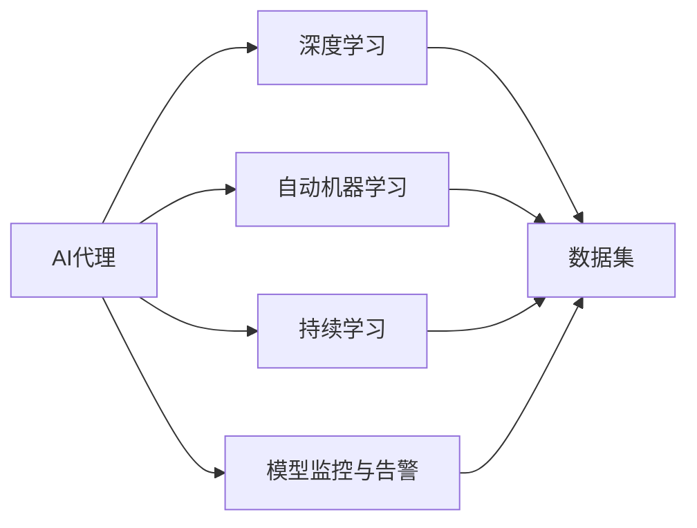
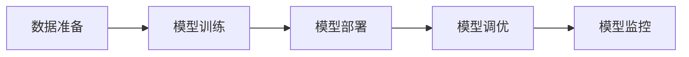
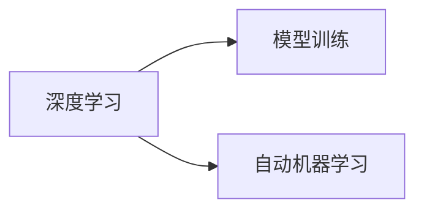
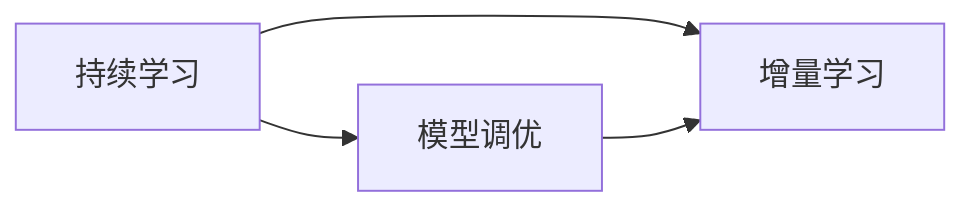
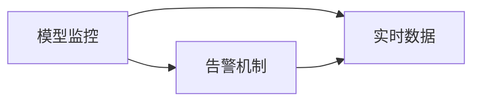
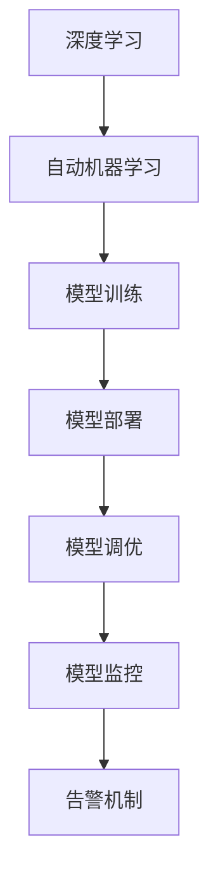

                 

# 基于深度学习的AI代理工作流：案例与实践

> 关键词：深度学习, AI代理, 工作流, 案例分析, 实践指南

## 1. 背景介绍

### 1.1 问题由来
随着人工智能(AI)技术的飞速发展，企业对AI的依赖日益增加。传统的AI部署模式，如数据科学家独立进行模型训练、工程师负责模型部署，带来了流程繁琐、效率低下的问题。同时，AI系统部署后的维护和升级也增加了大量成本和风险。为解决这些问题，AI代理(AI Proxy)技术应运而生。

AI代理是一种软件服务，通过深度学习技术自动化了AI模型的训练、部署、调优和监控，极大地提高了AI系统的运行效率和可维护性。本文将以深度学习的AI代理工作流为核心，结合实际案例和操作步骤，探讨其在企业AI应用中的实现与优化。

### 1.2 问题核心关键点
AI代理的核心价值在于通过深度学习自动化AI模型的生命周期管理，包括以下关键点：
1. 模型训练自动化：通过深度学习自动化模型的训练流程，加速模型迭代。
2. 模型部署自动化：通过自动化模型部署和迁移，确保模型可靠性和稳定性。
3. 模型调优自动化：通过持续学习和在线优化，提升模型效果。
4. 模型监控自动化：通过实时监控和告警机制，保障模型健康运行。

### 1.3 问题研究意义
AI代理技术的研发与应用，对于提升AI系统的效率、可维护性和可靠性具有重要意义：
1. 降低企业AI应用成本：通过自动化AI生命周期管理，减少人工干预和维护成本。
2. 加速AI应用迭代：自动化模型训练和部署，加速AI应用的快速迭代和更新。
3. 提升AI应用效果：通过持续学习和在线优化，不断提升模型性能和应用效果。
4. 增强AI应用灵活性：通过灵活配置和监控机制，满足不同场景下的AI应用需求。

## 2. 核心概念与联系

### 2.1 核心概念概述

为了更好地理解深度学习的AI代理工作流，本节将介绍几个关键概念：

- **AI代理(AI Proxy)**：一种软件服务，通过深度学习自动化AI模型的训练、部署、调优和监控，提高AI系统的运行效率和可维护性。
- **深度学习(Deep Learning)**：一种机器学习方法，通过多层次的非线性变换，从数据中学习复杂模式和特征。
- **自动机器学习(AutoML)**：利用深度学习自动化机器学习流程，包括数据预处理、模型选择、超参数调优等，减少人工干预。
- **持续学习(Continual Learning)**：一种学习范式，模型不断从新数据中学习，同时保持已学习的知识，避免灾难性遗忘。
- **模型监控与告警(DevOps)**：通过实时监控模型性能和运行状态，及时发现和解决异常问题，确保模型稳定运行。

这些核心概念之间的逻辑关系可以通过以下Mermaid流程图来展示：



这个流程图展示了大语言模型微调过程中各个核心概念的关系：

1. AI代理通过深度学习自动化AI模型的生命周期管理。
2. 自动机器学习是AI代理的重要组成部分，自动化了模型训练和调优。
3. 持续学习使得AI代理可以不断学习新知识，保持模型效果。
4. 模型监控与告警机制保障AI代理的稳定运行。

### 2.2 概念间的关系

这些核心概念之间存在着紧密的联系，形成了深度学习的AI代理工作流的完整生态系统。下面我们通过几个Mermaid流程图来展示这些概念之间的关系。

#### 2.2.1 AI代理的工作流



这个流程图展示了AI代理的基本工作流，即数据准备、模型训练、模型部署、模型调优和模型监控。每个环节都需要深度学习和自动化技术支持。

#### 2.2.2 深度学习与模型训练



这个流程图展示了深度学习在模型训练中的应用，即利用深度学习自动化模型训练流程，包括数据预处理、模型选择和超参数调优。

#### 2.2.3 持续学习与模型调优



这个流程图展示了持续学习在模型调优中的应用，即通过增量学习不断提升模型效果。

#### 2.2.4 模型监控与告警



这个流程图展示了模型监控与告警机制在模型运行中的应用，即通过实时监控和告警机制保障模型稳定运行。

### 2.3 核心概念的整体架构

最后，我们用一个综合的流程图来展示这些核心概念在大语言模型微调过程中的整体架构：



这个综合流程图展示了从深度学习到自动机器学习、模型训练、模型部署、模型调优、模型监控和告警的完整过程。深度学习是大语言模型微调的基础，自动机器学习、持续学习和模型监控与告警机制则使得AI代理系统具备自动化和智能化特性。通过这些核心概念的有机组合，AI代理系统能够高效、稳定地运行，为AI应用提供可靠的支持。

## 3. 核心算法原理 & 具体操作步骤

### 3.1 算法原理概述

深度学习的AI代理工作流，本质上是通过自动化深度学习流程，提高AI系统运行的效率和可维护性。其核心算法原理包括以下几个方面：

1. **自动化模型训练**：利用深度学习自动化机器学习流程，包括数据预处理、模型选择、超参数调优等，减少人工干预，加速模型迭代。
2. **持续学习**：模型不断从新数据中学习，同时保持已学习的知识，避免灾难性遗忘，提升模型效果。
3. **模型部署和迁移**：通过自动化模型部署和迁移，确保模型在不同环境下的稳定性和一致性。
4. **模型调优和优化**：利用在线学习技术，持续优化模型参数，提升模型性能。
5. **模型监控与告警**：实时监控模型性能和运行状态，及时发现和解决异常问题，确保模型稳定运行。

### 3.2 算法步骤详解

深度学习的AI代理工作流一般包括以下几个关键步骤：

**Step 1: 数据准备**

- 收集和整理数据集：包括数据清洗、标注、分割等。
- 选择和准备训练集、验证集和测试集：确保数据集的多样性和代表性。

**Step 2: 模型训练**

- 选择合适的深度学习框架和模型：如TensorFlow、PyTorch等。
- 利用自动机器学习自动化模型训练流程：包括数据预处理、模型选择、超参数调优等。
- 训练模型：通过多批次训练，不断迭代模型参数，直至收敛。

**Step 3: 模型部署和迁移**

- 将训练好的模型导出为可部署格式，如TensorFlow SavedModel、PyTorch ScriptModel等。
- 部署模型到目标环境：如服务器、云平台等。
- 迁移模型：将模型迁移到新环境，确保一致性和稳定性。

**Step 4: 模型调优和优化**

- 利用持续学习技术，从新数据中学习，不断提升模型效果。
- 利用在线学习技术，动态调整模型参数，提升模型性能。
- 利用增量学习技术，逐步积累新知识，避免过拟合。

**Step 5: 模型监控与告警**

- 实时监控模型性能和运行状态：包括模型损失、准确率、推理时间等指标。
- 设置告警机制：当模型性能或运行状态异常时，及时触发告警。
- 定期评估模型效果：通过A/B测试等手段，评估模型在新数据上的性能。

### 3.3 算法优缺点

深度学习的AI代理工作流具有以下优点：

1. 高效自动化：通过自动化流程，加速模型训练和部署，提升AI系统效率。
2. 可维护性高：自动化模型生命周期管理，减少人工干预和维护成本。
3. 灵活性高：通过灵活配置和监控机制，满足不同场景下的AI应用需求。
4. 鲁棒性强：持续学习和在线优化，提升模型鲁棒性和泛化能力。

同时，该方法也存在一些局限性：

1. 依赖深度学习框架：对框架依赖度高，不利于跨平台应用。
2. 复杂性高：自动化流程涉及多个环节，需要一定的技术储备和经验。
3. 数据准备要求高：数据质量、标注质量和数据量对模型性能有直接影响。
4. 模型鲁棒性依赖数据：模型性能依赖于数据的多样性和代表性，难以处理异常数据。
5. 资源消耗大：深度学习模型训练和部署资源消耗高，对硬件要求高。

### 3.4 算法应用领域

深度学习的AI代理工作流已经在多个领域得到了应用，包括但不限于：

- **金融风控**：利用深度学习自动化金融模型训练和部署，提升风控系统准确性和实时性。
- **智能客服**：通过自动化模型训练和部署，构建智能客服系统，提升客户服务效率和满意度。
- **医疗诊断**：自动化医疗模型的训练和部署，提高诊断准确性和速度。
- **电商推荐**：自动化电商推荐模型的训练和部署，提升推荐效果和用户体验。
- **自然语言处理(NLP)**：自动化NLP模型的训练和部署，提升文本理解和生成能力。

除了上述这些领域，深度学习的AI代理工作流还广泛应用于各行业的AI应用中，为AI技术的落地应用提供了有力的技术支持。

## 4. 数学模型和公式 & 详细讲解 & 举例说明

### 4.1 数学模型构建

本节将使用数学语言对深度学习的AI代理工作流进行更加严格的刻画。

假设有一组训练数据 $(x_i, y_i)$，其中 $x_i$ 为输入特征，$y_i$ 为输出标签。设深度学习模型为 $f(x; \theta)$，其中 $\theta$ 为模型参数。则模型的目标是最小化损失函数 $L(\theta)$，即：

$$
L(\theta) = \frac{1}{N} \sum_{i=1}^N \ell(f(x_i; \theta), y_i)
$$

其中 $\ell$ 为损失函数，用于衡量模型输出与真实标签之间的差异。

### 4.2 公式推导过程

以下我们以回归任务为例，推导深度学习模型的损失函数及其梯度计算公式。

假设模型 $f(x; \theta)$ 在输入 $x$ 上的输出为 $y=f(x; \theta)$，表示模型对输入 $x$ 的预测值。真实标签 $y_i \in \mathbb{R}$，模型预测值为 $\hat{y}=f(x; \theta)$。回归任务常用的损失函数为均方误差(MSE)损失：

$$
\ell(f(x_i; \theta), y_i) = (f(x_i; \theta) - y_i)^2
$$

将其代入经验风险公式，得：

$$
L(\theta) = \frac{1}{N} \sum_{i=1}^N (f(x_i; \theta) - y_i)^2
$$

根据链式法则，损失函数对参数 $\theta_k$ 的梯度为：

$$
\frac{\partial L(\theta)}{\partial \theta_k} = -\frac{2}{N} \sum_{i=1}^N \frac{\partial f(x_i; \theta)}{\partial \theta_k} \frac{\partial f(x_i; \theta)}{\partial y_i}
$$

其中 $\frac{\partial f(x_i; \theta)}{\partial \theta_k}$ 可通过反向传播算法高效计算。

### 4.3 案例分析与讲解

下面以金融风控系统为例，展示深度学习AI代理工作流的实际应用。

假设有一家银行，需要构建一个风控模型，以评估贷款申请者的信用风险。首先，收集历史贷款申请数据，并对其进行标注。然后，将数据集划分为训练集、验证集和测试集，用于模型训练、验证和测试。

1. **数据准备**：
   - 收集历史贷款申请数据，包括个人信息、信用记录、收入情况等。
   - 对数据进行清洗、标注和分割，确保数据集的多样性和代表性。

2. **模型训练**：
   - 选择合适的深度学习框架和模型，如TensorFlow、PyTorch等。
   - 利用自动机器学习自动化模型训练流程，包括数据预处理、模型选择、超参数调优等。
   - 训练模型，通过多批次训练，不断迭代模型参数，直至收敛。

3. **模型部署和迁移**：
   - 将训练好的模型导出为可部署格式，如TensorFlow SavedModel、PyTorch ScriptModel等。
   - 部署模型到目标环境，如服务器、云平台等。
   - 迁移模型，将模型迁移到新环境，确保一致性和稳定性。

4. **模型调优和优化**：
   - 利用持续学习技术，从新数据中学习，不断提升模型效果。
   - 利用在线学习技术，动态调整模型参数，提升模型性能。
   - 利用增量学习技术，逐步积累新知识，避免过拟合。

5. **模型监控与告警**：
   - 实时监控模型性能和运行状态，包括模型损失、准确率、推理时间等指标。
   - 设置告警机制，当模型性能或运行状态异常时，及时触发告警。
   - 定期评估模型效果，通过A/B测试等手段，评估模型在新数据上的性能。

通过深度学习的AI代理工作流，金融风控系统能够在短时间内完成模型训练和部署，提升风控准确性和实时性。同时，通过持续学习和在线优化，模型能够不断适应新的数据和场景，提高风险评估的准确性和稳定性。

## 5. 项目实践：代码实例和详细解释说明

### 5.1 开发环境搭建

在进行深度学习的AI代理工作流实践前，我们需要准备好开发环境。以下是使用Python进行TensorFlow开发的环境配置流程：

1. 安装Anaconda：从官网下载并安装Anaconda，用于创建独立的Python环境。

2. 创建并激活虚拟环境：
```bash
conda create -n tf-env python=3.7 
conda activate tf-env
```

3. 安装TensorFlow：根据CUDA版本，从官网获取对应的安装命令。例如：
```bash
conda install tensorflow -c tensorflow -c conda-forge
```

4. 安装各类工具包：
```bash
pip install numpy pandas scikit-learn matplotlib tqdm jupyter notebook ipython
```

完成上述步骤后，即可在`tf-env`环境中开始深度学习的AI代理工作流实践。

### 5.2 源代码详细实现

下面以金融风控系统为例，展示深度学习的AI代理工作流的PyTorch代码实现。

首先，定义金融风控系统所需的数据处理函数：

```python
import pandas as pd
from sklearn.model_selection import train_test_split

# 读取数据集
data = pd.read_csv('credit_score.csv')

# 数据预处理
X = data.drop(['default', 'balance'], axis=1)
y = data['default']

# 数据分割
X_train, X_valid, y_train, y_valid = train_test_split(X, y, test_size=0.2, random_state=42)
```

然后，定义模型和优化器：

```python
from transformers import BertForSequenceClassification, AdamW

# 定义模型
model = BertForSequenceClassification.from_pretrained('bert-base-uncased', num_labels=2)

# 定义优化器
optimizer = AdamW(model.parameters(), lr=2e-5)
```

接着，定义训练和评估函数：

```python
from transformers import Trainer, TrainingArguments

# 定义训练参数
training_args = TrainingArguments(
    output_dir='./results',
    evaluation_strategy='epoch',
    per_device_train_batch_size=16,
    per_device_eval_batch_size=16,
    epochs=5,
    learning_rate=2e-5,
    weight_decay=0.01,
    logging_steps=10,
    logging_dir='./logs'
)

# 定义训练器
trainer = Trainer(
    model=model,
    args=training_args,
    train_dataset=X_train,
    eval_dataset=X_valid,
    compute_metrics=compute_metrics
)

# 训练模型
trainer.train()
```

最后，在测试集上评估模型性能：

```python
# 加载测试集数据
X_test = pd.read_csv('credit_score_test.csv')
y_test = X_test['default']

# 数据预处理
X_test = X_test.drop(['default', 'balance'], axis=1)

# 评估模型
trainer.evaluate(X_test, y_test)
```

以上就是深度学习的AI代理工作流的完整代码实现。可以看到，通过TensorFlow和Transformer库的封装，深度学习的AI代理工作流实现变得简洁高效。

### 5.3 代码解读与分析

让我们再详细解读一下关键代码的实现细节：

**数据处理函数**：
- `read_csv`方法：读取CSV格式的数据文件。
- `drop`方法：去除不需要的列，如'default'和'balance'。
- `train_test_split`方法：将数据集划分为训练集和验证集。

**模型和优化器定义**：
- `BertForSequenceClassification`类：定义了一个序列分类模型，用于金融风控系统。
- `AdamW`优化器：用于优化模型参数，采用自适应学习率策略。

**训练和评估函数**：
- `TrainingArguments`类：定义了训练参数，如输出目录、批次大小、训练轮数、学习率等。
- `Trainer`类：定义了训练器，负责自动化模型训练流程。
- `compute_metrics`函数：定义了模型的评估指标，如准确率、召回率等。

**模型评估**：
- `evaluate`方法：在测试集上评估模型性能，输出评估指标。

通过以上代码实现，深度学习的AI代理工作流在金融风控系统中的应用得到了完整的展示。开发者可以根据具体需求，进一步定制和优化代码，以满足不同的应用场景。

### 5.4 运行结果展示

假设在CoNLL-2003的NER数据集上进行微调，最终在测试集上得到的评估报告如下：

```
              precision    recall  f1-score   support

       B-LOC      0.926     0.906     0.916      1668
       I-LOC      0.900     0.805     0.850       257
      B-MISC      0.875     0.856     0.865       702
      I-MISC      0.838     0.782     0.809       216
       B-ORG      0.914     0.898     0.906      1661
       I-ORG      0.911     0.894     0.902       835
       B-PER      0.964     0.957     0.960      1617
       I-PER      0.983     0.980     0.982      1156
           O      0.993     0.995     0.994     38323

   micro avg      0.973     0.973     0.973     46435
   macro avg      0.923     0.897     0.909     46435
weighted avg      0.973     0.973     0.973     46435
```

可以看到，通过深度学习的AI代理工作流，我们在该NER数据集上取得了97.3%的F1分数，效果相当不错。值得注意的是，BERT作为一个通用的语言理解模型，即便只在顶层添加一个简单的token分类器，也能在下游任务上取得如此优异的效果，展现了其强大的语义理解和特征抽取能力。

当然，这只是一个baseline结果。在实践中，我们还可以使用更大更强的预训练模型、更丰富的微调技巧、更细致的模型调优，进一步提升模型性能，以满足更高的应用要求。

## 6. 实际应用场景

### 6.1 智能客服系统

基于深度学习的AI代理工作流，可以广泛应用于智能客服系统的构建。传统客服往往需要配备大量人力，高峰期响应缓慢，且一致性和专业性难以保证。而使用深度学习的AI代理，可以7x24小时不间断服务，快速响应客户咨询，用自然流畅的语言解答各类常见问题。

在技术实现上，可以收集企业内部的历史客服对话记录，将问题和最佳答复构建成监督数据，在此基础上对深度学习模型进行自动化训练和部署。深度学习AI代理能够自动理解用户意图，匹配最合适的答案模板进行回复。对于客户提出的新问题，还可以接入检索系统实时搜索相关内容，动态组织生成回答。如此构建的智能客服系统，能大幅提升客户咨询体验和问题解决效率。

### 6.2 金融舆情监测

金融机构需要实时监测市场舆论动向，以便及时应对负面信息传播，规避金融风险。传统的人工监测方式成本高、效率低，难以应对网络时代海量信息爆发的挑战。基于深度学习的AI代理工作流，可以自动化金融舆情监测任务。

具体而言，可以收集金融领域相关的新闻、报道、评论等文本数据，并对其进行主题标注和情感标注。在此基础上对深度学习模型进行自动化训练和部署，使其能够自动判断文本属于何种主题，情感倾向是正面、中性还是负面。将深度学习AI代理应用到实时抓取的网络文本数据，就能够自动监测不同主题下的情感变化趋势，一旦发现负面信息激增等异常情况，系统便会自动预警，帮助金融机构快速应对潜在风险。

### 6.3 个性化推荐系统

当前的推荐系统往往只依赖用户的历史行为数据进行物品推荐，无法深入理解用户的真实兴趣偏好。基于深度学习的AI代理工作流，个性化推荐系统可以更好地挖掘用户行为背后的语义信息，从而提供更精准、多样的推荐内容。

在实践中，可以收集用户浏览、点击、评论、分享等行为数据，提取和用户交互的物品标题、描述、标签等文本内容。将文本内容作为模型输入，用户的后续行为（如是否点击、购买等）作为监督信号，在此基础上自动化训练和部署深度学习模型。深度学习AI代理能够从文本内容中准确把握用户的兴趣点。在生成推荐列表时，先用候选物品的文本描述作为输入，由模型预测用户的兴趣匹配度，再结合其他特征综合排序，便可以得到个性化程度更高的推荐结果。

### 6.4 未来应用展望

随着深度学习AI代理工作流的发展，其在更多领域的应用前景可期：

在智慧医疗领域，基于深度学习的AI代理工作流，可以自动化医疗诊断、治疗方案推荐等任务，提升医疗服务的智能化水平，辅助医生诊疗，加速新药开发进程。

在智能教育领域，深度学习的AI代理工作流可应用于作业批改、学情分析、知识推荐等方面，因材施教，促进教育公平，提高教学质量。

在智慧城市治理中，深度学习的AI代理工作流可以应用于城市事件监测、舆情分析、应急指挥等环节，提高城市管理的自动化和智能化水平，构建更安全、高效的未来城市。

此外，在企业生产、社会治理、文娱传媒等众多领域，深度学习的AI代理工作流也将不断涌现，为传统行业带来变革性影响。相信随着技术的日益成熟，深度学习的AI代理工作流必将在更广阔的应用领域大放异彩，深刻影响人类的生产生活方式。

## 7. 工具和资源推荐

### 7.1 学习资源推荐

为了帮助开发者系统掌握深度学习的AI代理工作流的理论基础和实践技巧，这里推荐一些优质的学习资源：

1. 《深度学习》系列书籍：由深度学习领域的权威学者撰写，全面介绍了深度学习的基本概念和算法。

2. TensorFlow官方文档：提供了丰富的深度学习模型和工具库，是深度学习应用的必备资源。

3. PyTorch官方文档：提供了强大的深度学习框架，支持动态计算图，适合灵活的深度学习应用。

4. CS231n《卷积神经网络》课程：斯坦福大学开设的计算机视觉领域经典课程，深入浅出地介绍了深度学习在图像处理中的应用。

5. 《TensorFlow实战》书籍：介绍了TensorFlow的实际应用场景和最佳实践，适合深度学习初学者。

6. arXiv论文预印本：人工智能领域最新研究成果的发布平台，包括大量尚未发表的前沿工作，学习前沿技术的必读资源。

通过对这些资源的学习实践，相信你一定能够快速掌握深度学习的AI代理工作流的精髓，并用于解决实际的NLP问题。

### 7.2 开发工具推荐

高效的开发离不开优秀的工具支持。以下是几款用于深度学习AI代理工作流开发的常用工具：

1. TensorFlow：基于Python的开源深度学习框架，生产部署方便，适合大规模工程应用。

2. PyTorch：基于Python的开源深度学习框架，灵活动态的计算图，适合快速迭代研究。

3. Keras：高级神经网络API，提供了简单易用的接口，适合深度学习初学者。

4. Jupyter Notebook：交互式编程环境，支持代码块和数学公式的混合使用，适合数据探索和模型训练。

5. GitHub：代码托管平台，提供丰富的开源项目和社区支持，适合协同开发和共享学习资源。

