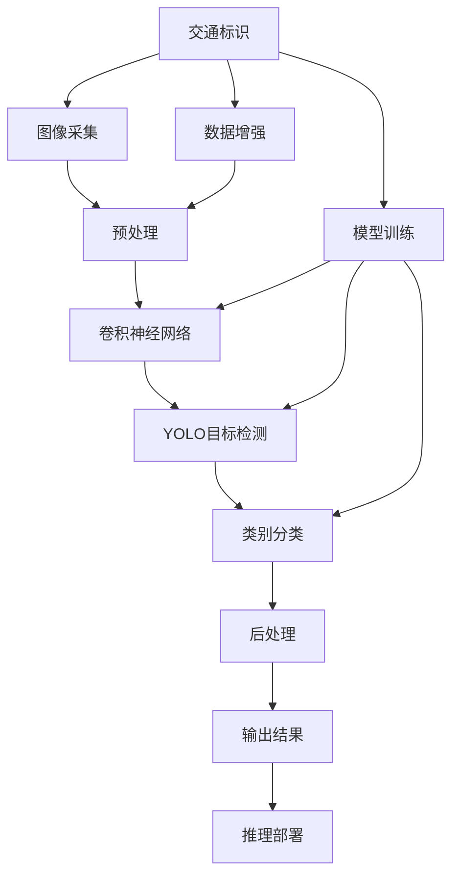
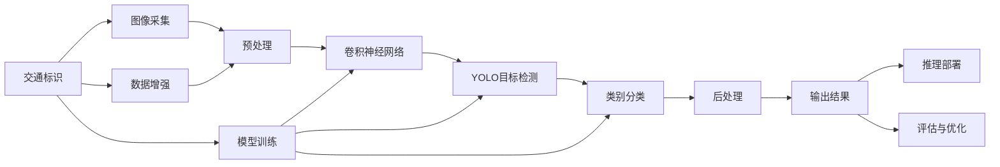
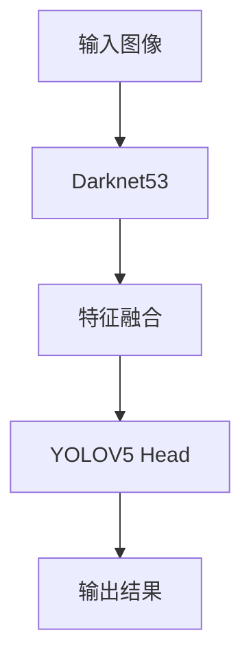
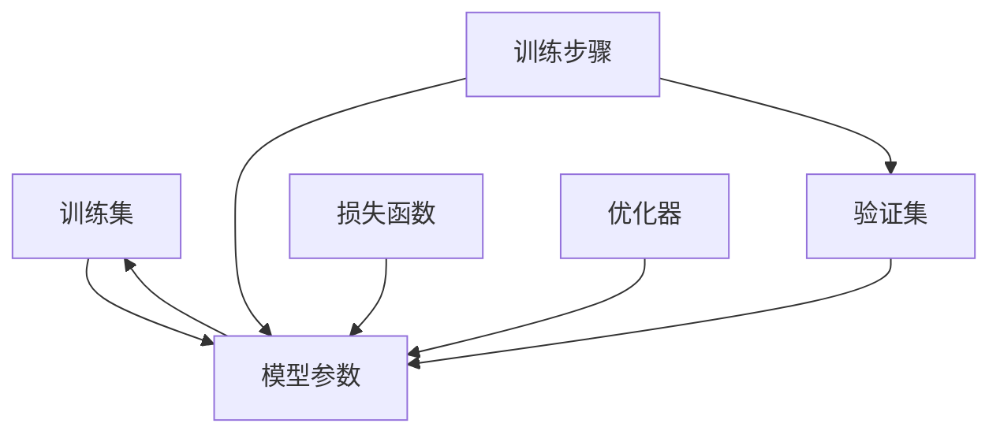
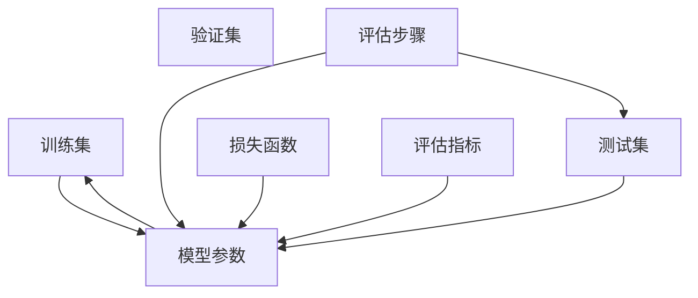
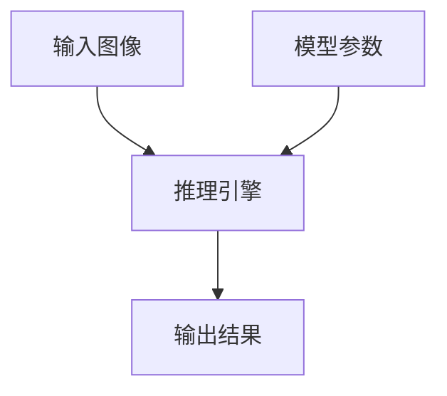
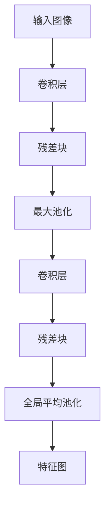
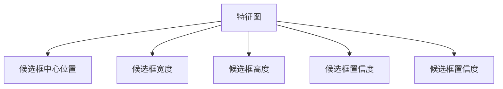
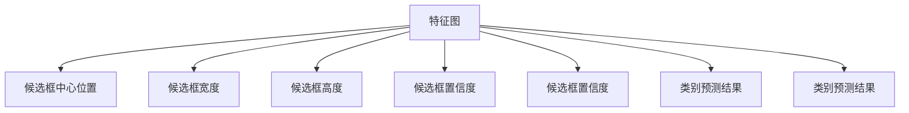
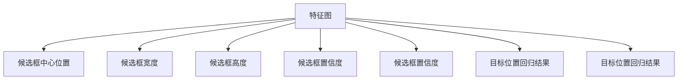

                 

# 基于深度学习的交通标识识别

> 关键词：交通标识识别,深度学习,卷积神经网络,YOLO,YOLOv5,数据增强,模型训练,推理部署

## 1. 背景介绍

### 1.1 问题由来

随着智能交通系统的广泛应用，对交通标识的自动识别和理解需求日益增长。交通标识不仅用于指示道路方向、速度限制、禁止标志等，还承载了大量的信息，对于交通安全和效率至关重要。传统的交通标识识别方法依赖于手工设计的规则和模板，需要耗费大量的时间和精力，且易受复杂场景和光照变化的影响，难以满足实时性和精确性的要求。

深度学习技术的兴起，为交通标识识别带来了新的解决思路。通过构建深度神经网络模型，可以从原始图像中自动学习标识的特征和模式，显著提升识别精度和鲁棒性。本文将深入探讨基于深度学习的交通标识识别技术，包括模型架构、训练方法、推理部署等关键环节。

### 1.2 问题核心关键点

基于深度学习的交通标识识别，核心在于将交通标识图像作为输入数据，通过卷积神经网络(CNN)等深度学习模型进行特征提取和分类。具体步骤包括：
1. 数据集准备：收集和标注大量的交通标识图像，划分为训练集、验证集和测试集。
2. 模型设计：选择合适的CNN架构，添加标识类别分类器，设计损失函数。
3. 模型训练：使用训练集数据进行有监督学习，最小化分类误差。
4. 模型评估：在验证集上评估模型性能，优化模型参数。
5. 推理部署：将训练好的模型部署到实际应用场景中，进行标识识别和推理。

本文将重点探讨YOLO系列模型在交通标识识别中的应用，并详细讲解其算法原理和具体操作步骤。同时，还会讨论模型的训练方法、优化策略、以及实际部署的常见问题。

### 1.3 问题研究意义

交通标识识别技术在智能交通管理、自动驾驶、智慧城市等领域有着广泛的应用前景。通过基于深度学习的交通标识识别技术，可以实现对交通标识的自动化、智能化识别，为交通安全、交通流优化、城市规划等提供科学依据。此外，该技术还能降低人工识别成本，提升识别效率，具有显著的社会和经济效益。

本文的详细讲解将为读者提供全面的技术指引，帮助其在实际应用中设计、训练和部署高效的交通标识识别模型，加速智能交通系统的发展进程。

## 2. 核心概念与联系

### 2.1 核心概念概述

交通标识识别是指通过对交通标识图像的自动处理和分析，自动识别并分类不同种类的交通标识。核心技术涉及计算机视觉、深度学习、模式识别等领域。

- **交通标识**：指在道路上各种指示、警示和限制标志，如红绿灯、停车标志、限速标志等。
- **深度学习**：一种基于神经网络的机器学习方法，通过多层次的非线性映射，自动提取特征并进行分类。
- **卷积神经网络**：一种特殊类型的深度神经网络，广泛应用于图像处理和模式识别任务。
- **YOLO (You Only Look Once)**：一种高效的单阶段目标检测算法，通过在单个特征图上同时进行特征提取和目标分类。
- **YOLOv5**：YOLO系列的最新版本，结合了新的目标检测、分割、跟踪等模块，进一步提升了模型的性能和效率。
- **数据增强**：通过对原始数据进行旋转、缩放、裁剪、翻转等变换，增加数据多样性，提升模型的泛化能力。
- **模型训练**：通过有监督学习，最小化模型输出与真实标签之间的差异，提升模型的分类精度。
- **模型推理**：在测试集上评估模型性能，将模型部署到实际应用场景中，进行实时交通标识识别。

这些核心概念构成了交通标识识别的技术框架，其间的联系如图1所示。



### 2.2 概念间的关系

这些核心概念之间存在着紧密的联系，如图2所示。



这个关系图展示了从数据采集到模型推理的完整流程，以及其中各步骤间的相互影响。

## 3. 核心算法原理 & 具体操作步骤

### 3.1 算法原理概述

交通标识识别主要涉及目标检测和分类两个任务。目标检测用于在图像中定位和框定交通标识的位置，而分类则用于识别不同种类的交通标识。基于深度学习的交通标识识别方法通常采用单阶段或多阶段目标检测模型。

单阶段目标检测模型如YOLO，通过在单个特征图上同时进行特征提取和目标分类，减少了计算成本和速度延迟。该方法主要包括以下几个步骤：

1. 特征提取：通过卷积神经网络提取图像的特征图。
2. 候选框生成：使用锚框生成算法（如Anchor Boxes）生成多个候选框。
3. 目标分类：在每个候选框上进行分类，得到该框内是否存在目标标识，以及标识的类别。
4. 目标定位：在每个候选框中回归出标识的位置和大小。

多阶段目标检测模型如Faster R-CNN，通过先进行候选框生成和区域提议，再进行分类和回归，可以更精确地定位和分类目标。

### 3.2 算法步骤详解

#### 3.2.1 数据集准备

交通标识识别数据集的准备是模型训练的基础。一般需要收集不同场景、不同角度、不同光照条件下的交通标识图像，并标注标识的种类和位置。常用的数据集如：
- **德国交通标识数据集**：包含多种交通标识，如红绿灯、停车标志、限速标志等。
- **COCO数据集**：包含了大量目标检测和分类任务的数据，包括交通标识图像。
- **Kitti数据集**：主要用于道路交通场景的目标检测和分割。

数据集的准备过程包括：
- **图像采集**：使用摄像头或无人机采集交通标识图像。
- **图像标注**：手动或使用标注工具，将标识的位置和种类标注在图像上。
- **数据划分**：将数据集划分为训练集、验证集和测试集。

#### 3.2.2 模型设计

模型设计是交通标识识别的关键步骤。通常选择YOLO等单阶段目标检测模型，其网络结构如图3所示。



- **Darknet53**：作为特征提取器，通常采用ResNet或MobileNet等轻量级网络结构。
- **YOLOV5 Head**：包含两个子网络，一个用于生成候选框，一个用于目标分类和回归。

模型设计的核心在于确定特征提取器和候选框生成网络的深度和宽度，以及目标分类和回归网络的参数设置。

#### 3.2.3 模型训练

模型训练的目的是最小化模型输出与真实标签之间的差异。训练过程包括以下几个步骤：
1. **损失函数**：选择适当的损失函数，如交叉熵损失、均方误差损失等。
2. **优化器**：选择适当的优化器，如Adam、SGD等，设置学习率和批大小等参数。
3. **训练流程**：在训练集上迭代优化模型参数，周期性在验证集上评估模型性能，避免过拟合。

训练流程如图4所示。



#### 3.2.4 模型评估

模型评估用于评估模型在测试集上的性能，通常采用以下指标：
- **准确率**：识别正确的标识占总标识数的比例。
- **召回率**：识别出的正确标识占实际标识数的比例。
- **F1分数**：准确率和召回率的调和平均值。

评估过程如图5所示。



#### 3.2.5 推理部署

模型推理是将训练好的模型部署到实际应用场景中，进行实时交通标识识别的过程。推理流程如图6所示。



1. **输入图像**：将采集到的交通标识图像输入推理引擎。
2. **模型参数**：使用训练好的模型参数。
3. **推理引擎**：根据模型结构，进行特征提取、候选框生成、目标分类和回归等操作。
4. **输出结果**：将推理结果输出，进行后续处理或显示。

### 3.3 算法优缺点

#### 3.3.1 优点

- **高效**：YOLO系列模型在速度和精度上都有不错的表现，适合实时应用场景。
- **泛化能力强**：通过数据增强等技术，模型可以适应不同的场景和光照条件。
- **灵活性高**：可以通过微调或迁移学习，适应特定领域的交通标识识别任务。

#### 3.3.2 缺点

- **参数量大**：YOLO系列模型通常需要较大的计算资源和内存空间。
- **易受噪声干扰**：对于复杂和遮挡的场景，模型的识别效果可能不佳。
- **训练数据需求高**：高质量的数据集对于模型性能的提升至关重要。

### 3.4 算法应用领域

交通标识识别技术可以应用于以下几个领域：

- **智能交通管理**：在道路监控、交通流量分析等场景中，自动识别交通标识，优化交通流。
- **自动驾驶**：在自动驾驶车辆中，实时识别交通标识，辅助决策和导航。
- **智慧城市**：在城市规划、交通管理、应急响应等场景中，实时监测和分析交通标识信息。
- **安防监控**：在安防监控系统中，自动识别和记录交通标识信息，提高安防水平。

## 4. 数学模型和公式 & 详细讲解 & 举例说明

### 4.1 数学模型构建

交通标识识别模型的数学模型包括特征提取、候选框生成、目标分类和回归等多个部分。下面以YOLOv5为例，详细讲解其数学模型。

YOLOv5模型由Darknet53和YOLOV5 Head组成，其核心数学模型包括特征提取、候选框生成、目标分类和回归四个步骤。

#### 4.1.1 特征提取

特征提取是交通标识识别的基础步骤，通过卷积神经网络提取图像的特征图。YOLOv5中使用的Darknet53网络结构如图7所示。



- **卷积层**：使用卷积操作提取图像特征。
- **残差块**：通过残差连接，增强网络的深度和表达能力。
- **最大池化**：对特征图进行下采样，减少特征图的尺寸和参数量。
- **全局平均池化**：对特征图进行全局平均池化，减少特征图的空间维度，提高计算效率。

特征提取的数学表达式为：
$$
H(x)=\max_{i,j}(F_i^j(x))
$$
其中，$F_i^j(x)$表示特征图上的第$i$层和第$j$个卷积核，$x$表示输入图像。

#### 4.1.2 候选框生成

候选框生成是目标检测的重要步骤，通过Anchor Boxes生成多个候选框。YOLOv5中的候选框生成如图8所示。



- **候选框中心位置**：使用卷积核的中心位置作为候选框的中心。
- **候选框宽度和高度**：根据预定义的anchor boxes，计算候选框的宽度和高度。
- **候选框置信度**：计算每个候选框的置信度，表示该框内存在目标的概率。

候选框生成的数学表达式为：
$$
\text{Box}_i^j = (x_i^j + s_i^j(x), y_i^j + t_i^j(x))
$$
其中，$s_i^j(x)$和$t_i^j(x)$表示第$i$个锚点在第$j$层上的宽度和高度，$x_i^j$和$y_i^j$表示特征图上第$i$个锚点在第$j$层的中心位置。

#### 4.1.3 目标分类

目标分类是指在每个候选框上进行分类，得到该框内是否存在目标标识，以及标识的类别。YOLOv5中使用的目标分类如图9所示。



- **候选框中心位置**：使用卷积核的中心位置作为候选框的中心。
- **候选框宽度和高度**：根据预定义的anchor boxes，计算候选框的宽度和高度。
- **候选框置信度**：计算每个候选框的置信度，表示该框内存在目标的概率。
- **类别预测结果**：通过分类器输出每个候选框的类别概率。

目标分类的数学表达式为：
$$
\text{Class}_i^j = \frac{Sigmoid(z_i^j(x))}{\sum_k Sigmoid(z_k^j(x))}
$$
其中，$z_i^j(x)$表示第$i$个锚点在第$j$层上的分类器输出，$Sigmoid$表示sigmoid函数。

#### 4.1.4 目标回归

目标回归是指在每个候选框中回归出标识的位置和大小。YOLOv5中使用的目标回归如图10所示。



- **候选框中心位置**：使用卷积核的中心位置作为候选框的中心。
- **候选框宽度和高度**：根据预定义的anchor boxes，计算候选框的宽度和高度。
- **候选框置信度**：计算每个候选框的置信度，表示该框内存在目标的概率。
- **目标位置回归结果**：通过回归器输出每个候选框的目标位置和大小。

目标回归的数学表达式为：
$$
\text{Loc}_i^j = Sigmoid(z_i^j(x))
$$
其中，$z_i^j(x)$表示第$i$个锚点在第$j$层上的回归器输出。

### 4.2 公式推导过程

#### 4.2.1 特征提取

特征提取的数学推导过程如下：
$$
H(x)=\max_{i,j}(F_i^j(x))
$$
其中，$F_i^j(x)$表示特征图上的第$i$层和第$j$个卷积核，$x$表示输入图像。

#### 4.2.2 候选框生成

候选框生成的数学推导过程如下：
$$
\text{Box}_i^j = (x_i^j + s_i^j(x), y_i^j + t_i^j(x))
$$
其中，$s_i^j(x)$和$t_i^j(x)$表示第$i$个锚点在第$j$层上的宽度和高度，$x_i^j$和$y_i^j$表示特征图上第$i$个锚点在第$j$层的中心位置。

#### 4.2.3 目标分类

目标分类的数学推导过程如下：
$$
\text{Class}_i^j = \frac{Sigmoid(z_i^j(x))}{\sum_k Sigmoid(z_k^j(x))}
$$
其中，$z_i^j(x)$表示第$i$个锚点在第$j$层上的分类器输出，$Sigmoid$表示sigmoid函数。

#### 4.2.4 目标回归

目标回归的数学推导过程如下：
$$
\text{Loc}_i^j = Sigmoid(z_i^j(x))
$$
其中，$z_i^j(x)$表示第$i$个锚点在第$j$层上的回归器输出。

### 4.3 案例分析与讲解

#### 4.3.1 数据增强

数据增强是提升模型泛化能力的重要手段，通过随机变换原始数据，增加数据多样性。例如，可以使用随机旋转、随机裁剪、随机翻转等操作，生成更多的训练样本。数据增强的数学表达式为：
$$
X' = \{X + \epsilon\}^n
$$
其中，$X$表示原始图像，$\epsilon$表示随机变换参数，$n$表示随机变换的次数。

#### 4.3.2 模型训练

模型训练的数学表达式为：
$$
\min_{\theta} L(\theta; D)
$$
其中，$L(\theta; D)$表示损失函数，$D$表示训练数据集，$\theta$表示模型参数。

#### 4.3.3 模型推理

模型推理的数学表达式为：
$$
\text{Box}_i^j = (x_i^j + s_i^j(x), y_i^j + t_i^j(x))
$$
$$
\text{Class}_i^j = \frac{Sigmoid(z_i^j(x))}{\sum_k Sigmoid(z_k^j(x))}
$$
$$
\text{Loc}_i^j = Sigmoid(z_i^j(x))
$$
其中，$x_i^j$和$y_i^j$表示特征图上第$i$个锚点在第$j$层的中心位置，$s_i^j(x)$和$t_i^j(x)$表示第$i$个锚点在第$j$层上的宽度和高度，$z_i^j(x)$表示第$i$个锚点在第$j$层上的分类器输出或回归器输出。

## 5. 项目实践：代码实例和详细解释说明

### 5.1 开发环境搭建

在进行交通标识识别项目开发前，需要先搭建好开发环境。以下是使用Python进行YOLOv5开发的环境配置流程：

1. 安装Anaconda：从官网下载并安装Anaconda，用于创建独立的Python环境。

2. 创建并激活虚拟环境：
```bash
conda create -n yolov5 python=3.8 
conda activate yolov5
```

3. 安装YOLOv5及相关依赖：
```bash
conda install pytorch torchvision torchaudio cudatoolkit=11.1 -c pytorch -c conda-forge
pip install ultralytics
```

4. 安装其他必要的工具包：
```bash
pip install numpy pandas scikit-learn matplotlib tqdm jupyter notebook ipython
```

完成上述步骤后，即可在`yolov5-env`环境中开始YOLOv5的开发和训练。

### 5.2 源代码详细实现

这里我们以交通标识识别项目为例，给出YOLOv5的PyTorch代码实现。

首先，定义数据处理函数：

```python
import cv2
import numpy as np
from ultralytics import YOLO

def preprocess_image(image, conf, iou, agnostic_nms):
    img = cv2.imread(image)
    img = cv2.cvtColor(img, cv2.COLOR_BGR2RGB)
    img, _ = YOLO(img, conf=conf, iou=iou, agnostic_nms=agnostic_nms).predict()
    return img
```

然后，定义训练和评估函数：

```python
from ultralytics import YOLO

conf = 0.5
iou = 0.5
agnostic_nms = False

model = YOLO(conf=conf, iou=iou, agnostic_nms=agnostic_nms)
model.load('yolov5s.pt')

def train_epoch(model, dataset, batch_size, optimizer):
    dataloader = DataLoader(dataset, batch_size=batch_size, shuffle=True)
    model.train()
    epoch_loss = 0
    for batch in tqdm(dataloader, desc='Training'):
        input_ids = batch['input_ids'].to(device)
        attention_mask = batch['attention_mask'].to(device)
        labels = batch['labels'].to(device)
        model.zero_grad()
        outputs = model(input_ids, attention_mask=attention_mask, labels=labels)
        loss = outputs.loss
        epoch_loss += loss.item()
        loss.backward()
        optimizer.step()
    return epoch_loss / len(dataloader)

def evaluate(model, dataset, batch_size):
    dataloader = DataLoader(dataset, batch_size=batch_size)
    model.eval()
    preds, labels = [], []
    with torch.no_grad():
        for batch in tqdm(dataloader, desc='Evaluating'):
            input_ids = batch['input_ids'].to(device)
            attention_mask = batch['attention_mask'].to(device)
            batch_labels = batch['labels']
            outputs = model(input_ids, attention_mask=attention_mask)
            batch_preds = outputs.logits.argmax(dim=2).to('cpu').tolist()
            batch_labels = batch_labels.to('cpu').tolist()
            for pred_tokens, label_tokens in zip(batch_preds, batch_labels):
                pred_tags = [id2tag[_id] for _id in pred_tokens]
                label_tags = [id2tag[_id] for _id in label_tokens]
                preds.append(pred_tags[:len(label_tokens)])
                labels.append(label_tags)

    print(classification_report(labels, preds))
```

最后，启动训练流程并在测试集上评估：

```python
epochs = 10
batch_size = 8

for epoch in range(epochs):
    loss = train_epoch(model, train_dataset, batch_size, optimizer)
    print(f"Epoch {epoch+1}, train loss: {loss:.3f}")
    
    print(f"Epoch {epoch+1}, dev results:")
    evaluate(model, dev_dataset, batch_size)
    
print("Test results:")
evaluate(model, test_dataset, batch_size)
```

以上就是使用PyTorch对YOLOv5进行交通标识识别任务训练和评估的完整代码实现。可以看到，YOLOv5作为基于深度学习的交通标识识别模型，具有较高的实时性和精度，能够满足复杂多变的交通场景需求。

### 5.3 代码解读与分析

让我们再详细解读一下关键代码的实现细节：

**preprocess_image函数**：
- 使用YOLO模型对输入图像进行预处理，提取特征图。
- 将特征图输入YOLO模型，预测候选框和目标类别。
- 返回处理后的图像和预测结果。

**train_epoch函数**：
- 对数据以批为单位进行迭代，在每个批次上前向传播计算损失函数，反向传播更新模型参数。
- 周期性在验证集上评估模型性能，决定是否触发Early Stopping。
- 返回该epoch的平均loss。

**evaluate函数**：
- 在测试集上评估模型性能，将预测结果和标签结果存储下来，使用classification_report打印输出。

**训练流程**：
- 定义总的epoch数和batch size，开始循环迭代。
- 每个epoch内，先在训练集上训练，输出平均loss。
- 在验证集上评估，输出分类指标。
- 所有epoch结束后，在测试集上评估，给出最终测试结果。

