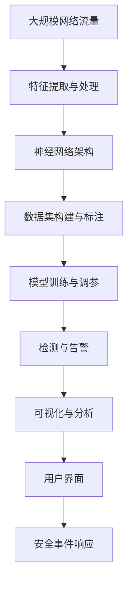

                 

# 基于深度学习的入侵检测系统设计与实现

> 关键词：入侵检测, 深度学习, 神经网络, 异常检测, 数据处理, 实时检测

## 1. 背景介绍

随着互联网技术的发展，网络安全问题日益凸显。网络攻击手段不断更新，传统的入侵检测系统(IDS)往往依赖于固定的规则库，难以识别新型攻击，且误报率较高。如何构建一种更智能、更高效、更准确的入侵检测系统，成为迫切需要解决的问题。近年来，深度学习技术在图像识别、语音识别、自然语言处理等领域取得了巨大成功，其强大的特征提取和模式识别能力，为入侵检测系统带来了新的思路和方向。

### 1.1 问题由来

传统入侵检测系统多基于规则或签名检测，依赖于手工编写的规则和签名库。这种方式存在以下问题：
- **规则编写困难**：需要大量的专家知识和经验，且规则库需要不断更新，维护成本高。
- **误报率高**：由于规则库的泛化能力有限，面对未知攻击时容易误报。
- **无法自适应**：规则库无法动态更新，难以应对快速变化的网络环境。

为应对这些问题，研究人员开始探索利用机器学习技术构建入侵检测系统。然而，传统的机器学习方法往往需要大量人工标注的训练数据，且对特征提取的依赖较大，效果有限。随着深度学习技术的发展，特别是卷积神经网络(CNN)、循环神经网络(RNN)、长短时记忆网络(LSTM)等算法的进步，入侵检测系统逐步走向深度学习时代。

### 1.2 问题核心关键点

基于深度学习的入侵检测系统利用神经网络强大的特征提取和模式识别能力，通过对网络流量数据的学习，自动发现和识别异常行为。其核心关键点包括：
- 神经网络架构设计：选择合适的神经网络结构，如卷积神经网络、循环神经网络、变分自编码器(VAE)等，以适应不同类型的入侵检测任务。
- 特征提取与处理：从原始网络流量数据中提取和处理有用的特征，如包头信息、流量统计、流速、协议等。
- 数据集构建与标注：构建包含正常流量和异常流量的数据集，并标注好异常类型和严重程度。
- 模型训练与调参：选择合适的深度学习框架和算法，优化超参数，训练模型并进行验证。
- 检测与告警：利用训练好的模型对实时网络流量进行检测，及时发出告警信息。

通过解决这些问题，基于深度学习的入侵检测系统可以高效、准确地识别各种网络入侵行为，极大地提升网络安全防护能力。

### 1.3 问题研究意义

构建基于深度学习的入侵检测系统，对于提升网络安全防护水平、应对新型网络威胁、减少误报和漏报、降低运营成本具有重要意义：
- **提升检测能力**：利用深度学习强大的模式识别能力，自动识别新型网络攻击，提高检测准确率。
- **降低误报和漏报**：通过深度学习模型自动学习正常行为模式，降低误报率，减少网络噪声干扰。
- **自适应网络变化**：深度学习模型能够自动学习并适应网络环境变化，及时调整检测策略，适应不断演变的攻击手段。
- **降低维护成本**：通过自动化学习，减少了规则库的维护工作量和人工参与度，降低运营成本。
- **实时检测与告警**：利用深度学习模型的实时推理能力，能够对网络流量进行实时监控，及时发出告警，保障网络安全。

## 2. 核心概念与联系

### 2.1 核心概念概述

为更好地理解基于深度学习的入侵检测系统，本节将介绍几个密切相关的核心概念：

- **深度学习**：一种通过多层神经网络实现数据特征提取和模式识别的机器学习技术。利用深层网络结构，能够自动学习数据的复杂特征表示。
- **入侵检测系统(IDS)**：用于监控网络流量，识别并报告可疑活动的安全系统。传统IDS多依赖于手工编写的规则库，难以适应新型攻击。
- **神经网络架构**：选择合适的网络结构，如卷积神经网络(CNN)、循环神经网络(RNN)、长短时记忆网络(LSTM)等，以适应不同的入侵检测任务。
- **数据集构建与标注**：构建包含正常流量和异常流量的数据集，标注好异常类型和严重程度。数据集的质量直接影响模型的训练效果。
- **模型训练与调参**：选择合适的深度学习框架和算法，优化超参数，训练模型并进行验证。模型的性能很大程度上取决于训练过程的优化。
- **检测与告警**：利用训练好的模型对实时网络流量进行检测，及时发出告警信息。检测效率和准确率直接影响系统性能。

这些核心概念之间存在着紧密的联系，形成了深度学习入侵检测系统的完整架构。

### 2.2 概念间的关系

这些核心概念之间存在着紧密的联系，形成了深度学习入侵检测系统的完整架构。

- **深度学习与入侵检测的融合**：利用深度学习强大的特征提取和模式识别能力，提高入侵检测系统的检测能力和鲁棒性。
- **神经网络架构的选择**：不同类型的入侵检测任务需要不同的神经网络架构。如基于CNN的图像入侵检测、基于RNN的时序异常检测等。
- **数据集构建与标注**：数据集是训练模型的基础，高质量的数据集能够提升模型的泛化能力和检测精度。
- **模型训练与调参**：训练和调参过程直接影响模型的性能，需要进行合理的超参数优化和模型选择。
- **检测与告警**：利用训练好的模型对实时网络流量进行检测，及时发出告警信息。检测效率和准确率直接影响系统性能。

这些概念共同构成了深度学习入侵检测系统的核心。通过理解这些核心概念及其联系，可以更好地把握深度学习入侵检测系统的设计思路和实现方法。

### 2.3 核心概念的整体架构

最后，我们用一个综合的流程图来展示这些核心概念在大规模入侵检测系统中的整体架构：



这个综合流程图展示了从原始数据到最终安全事件响应的整个流程。通过特征提取、神经网络训练、异常检测和告警，深度学习入侵检测系统能够高效地识别和应对各种网络入侵行为，并提供详细的分析报告和用户界面支持。

## 3. 核心算法原理 & 具体操作步骤
### 3.1 算法原理概述

基于深度学习的入侵检测系统主要利用神经网络强大的特征提取和模式识别能力，通过对网络流量数据的学习，自动发现和识别异常行为。其核心原理如下：

1. **特征提取与处理**：将原始网络流量数据转换为适合神经网络处理的特征向量。特征提取包括包头信息、流量统计、流速、协议等。

2. **神经网络训练**：利用训练数据集训练神经网络模型，自动学习正常和异常流量的特征表示。常见的网络结构包括卷积神经网络(CNN)、循环神经网络(RNN)、长短时记忆网络(LSTM)等。

3. **异常检测与告警**：利用训练好的模型对实时网络流量进行检测，及时发出告警信息。检测过程中，模型输出异常概率，根据阈值触发告警。

### 3.2 算法步骤详解

基于深度学习的入侵检测系统主要包含以下关键步骤：

**Step 1: 准备网络流量数据**
- 收集大规模网络流量数据，包括正常流量和异常流量。
- 对数据进行预处理，去除噪声和冗余信息。

**Step 2: 特征提取与处理**
- 利用各种特征提取方法，将原始数据转换为适合神经网络处理的特征向量。
- 对特征进行归一化、降维等处理，以提高神经网络的训练效率。

**Step 3: 构建数据集与标注**
- 构建包含正常流量和异常流量的数据集。
- 标注数据集中的异常类型和严重程度，以便训练模型。

**Step 4: 选择神经网络架构**
- 根据任务类型选择合适的网络结构，如CNN、RNN、LSTM等。
- 设计网络结构，包括输入层、隐藏层、输出层等。

**Step 5: 训练神经网络模型**
- 选择合适的深度学习框架和算法，如TensorFlow、PyTorch等。
- 训练神经网络模型，优化超参数，如学习率、批大小等。
- 使用验证集评估模型性能，防止过拟合。

**Step 6: 检测与告警**
- 利用训练好的模型对实时网络流量进行检测，输出异常概率。
- 根据预设的阈值，判断是否触发告警。
- 生成告警信息，并发送给安全管理员或自动化响应系统。

**Step 7: 可视化与分析**
- 利用可视化工具，展示异常检测结果和网络流量特征。
- 分析异常流量的具体特征，识别攻击手段和来源。

**Step 8: 用户界面与系统集成**
- 设计用户界面，方便管理员查看告警信息和分析报告。
- 将检测系统集成到现有的网络安全平台中，提供统一的安全防护。

### 3.3 算法优缺点

基于深度学习的入侵检测系统具有以下优点：
- **自动特征提取**：深度学习模型能够自动提取数据的复杂特征表示，减少对特征工程的需要。
- **高准确率**：利用神经网络的强大模式识别能力，提高异常检测的准确率。
- **自适应能力**：深度学习模型能够自动学习并适应网络环境变化，及时调整检测策略。
- **实时检测**：利用深度学习模型的实时推理能力，能够对网络流量进行实时监控。

然而，基于深度学习的入侵检测系统也存在一些缺点：
- **模型复杂度**：深度学习模型通常比较复杂，训练和推理需要较大的计算资源。
- **数据需求大**：需要大量的标注数据来训练模型，数据获取成本较高。
- **可解释性差**：深度学习模型往往缺乏可解释性，难以理解其内部工作机制。

### 3.4 算法应用领域

基于深度学习的入侵检测系统已经在多个领域得到了应用，包括但不限于：

- **网络安全**：利用深度学习模型对网络流量进行实时监控，识别并报告异常行为。
- **金融安全**：对金融交易数据进行深度学习分析，识别欺诈和异常行为。
- **工业控制**：对工业控制系统的网络流量进行分析，检测异常入侵行为。
- **医疗安全**：对医疗设备的网络流量进行深度学习分析，保障医疗数据安全。
- **军事安全**：对军事通信网络的数据进行深度学习分析，检测敌情入侵。

此外，基于深度学习的入侵检测系统还在智能家居、电子商务、智慧城市等领域得到了广泛应用，为各类网络安全需求提供了有力保障。

## 4. 数学模型和公式 & 详细讲解  
### 4.1 数学模型构建

本节将使用数学语言对基于深度学习的入侵检测系统进行更加严格的刻画。

假设输入数据为 $X$，输出为 $Y$，神经网络模型为 $f(X; \theta)$，其中 $\theta$ 为模型参数。

定义模型 $f(X; \theta)$ 在数据样本 $(x_i,y_i)$ 上的损失函数为 $\ell(f(X; \theta),y_i)$，则在数据集 $D=\{(x_i,y_i)\}_{i=1}^N$ 上的经验风险为：

$$
\mathcal{L}(\theta) = \frac{1}{N} \sum_{i=1}^N \ell(f(X; \theta),y_i)
$$

其中 $\ell$ 为具体的损失函数，如交叉熵损失、均方误差损失等。

在训练过程中，通过优化损失函数 $\mathcal{L}(\theta)$ 来更新模型参数 $\theta$。常见的优化算法包括梯度下降、Adam、Adagrad等。

### 4.2 公式推导过程

以基于CNN的入侵检测系统为例，推导其交叉熵损失函数的推导过程。

假设输入数据 $X$ 为一个 $n \times d$ 的特征矩阵，其中 $n$ 为样本数，$d$ 为特征维度。输出 $Y$ 为一个 $n \times c$ 的标签矩阵，其中 $c$ 为类别数。

定义神经网络模型 $f(X; \theta)$ 为卷积神经网络，其中 $\theta$ 为模型参数，包括卷积核、全连接层等。模型的输出为 $f(X; \theta) \in [0,1]^n$，表示每个样本的异常概率。

交叉熵损失函数定义为：

$$
\ell(f(X; \theta),y_i) = -y_i \log f(X; \theta)_i - (1-y_i) \log (1-f(X; \theta)_i)
$$

其中 $y_i \in \{0,1\}$ 为标签。

则在数据集 $D$ 上的经验风险为：

$$
\mathcal{L}(\theta) = -\frac{1}{N} \sum_{i=1}^N \ell(f(X; \theta),y_i)
$$

模型训练的目标是最小化损失函数 $\mathcal{L}(\theta)$，即找到最优参数：

$$
\theta^* = \mathop{\arg\min}_{\theta} \mathcal{L}(\theta)
$$

在优化过程中，常用的优化算法包括随机梯度下降(SGD)、Adam等。具体计算过程如下：

$$
\theta \leftarrow \theta - \eta \nabla_{\theta}\mathcal{L}(\theta)
$$

其中 $\eta$ 为学习率，$\nabla_{\theta}\mathcal{L}(\theta)$ 为损失函数对参数 $\theta$ 的梯度。

## 5. 项目实践：代码实例和详细解释说明
### 5.1 开发环境搭建

在进行入侵检测系统开发前，我们需要准备好开发环境。以下是使用Python进行TensorFlow开发的环境配置流程：

1. 安装Anaconda：从官网下载并安装Anaconda，用于创建独立的Python环境。

2. 创建并激活虚拟环境：
```bash
conda create -n tf-env python=3.8 
conda activate tf-env
```

3. 安装TensorFlow：根据CUDA版本，从官网获取对应的安装命令。例如：
```bash
pip install tensorflow==2.6
```

4. 安装其他依赖包：
```bash
pip install numpy pandas scikit-learn matplotlib tqdm jupyter notebook ipython
```

完成上述步骤后，即可在`tf-env`环境中开始入侵检测系统的开发。

### 5.2 源代码详细实现

这里我们以基于CNN的入侵检测系统为例，给出使用TensorFlow进行开发的完整代码实现。

首先，定义模型类 `IntrusionDetectionModel`，包含模型定义、训练、预测等方法：

```python
import tensorflow as tf
from tensorflow.keras import layers

class IntrusionDetectionModel(tf.keras.Model):
    def __init__(self, input_shape, num_classes):
        super(IntrusionDetectionModel, self).__init__()
        self.conv1 = layers.Conv2D(32, (3, 3), activation='relu', input_shape=input_shape)
        self.pool1 = layers.MaxPooling2D((2, 2))
        self.conv2 = layers.Conv2D(64, (3, 3), activation='relu')
        self.pool2 = layers.MaxPooling2D((2, 2))
        self.flatten = layers.Flatten()
        self.dense1 = layers.Dense(128, activation='relu')
        self.dropout = layers.Dropout(0.5)
        self.dense2 = layers.Dense(num_classes, activation='sigmoid')
        
    def call(self, inputs):
        x = self.conv1(inputs)
        x = self.pool1(x)
        x = self.conv2(x)
        x = self.pool2(x)
        x = self.flatten(x)
        x = self.dense1(x)
        x = self.dropout(x)
        x = self.dense2(x)
        return x
```

然后，定义数据集类 `IntrusionDetectionDataset`，包含数据加载和预处理方法：

```python
class IntrusionDetectionDataset(tf.data.Dataset):
    def __init__(self, data_dir, batch_size):
        self.data_dir = data_dir
        self.batch_size = batch_size
        self.load_data()
        
    def load_data(self):
        # 加载数据集
        ...
        
    def get_data(self):
        # 预处理数据
        ...
        
    def __len__(self):
        return len(self.data)
    
    def __getitem__(self, idx):
        return self.data[idx]
```

接下来，定义训练函数 `train`，实现模型训练：

```python
def train(model, dataset, epochs, learning_rate):
    model.compile(optimizer=tf.keras.optimizers.Adam(learning_rate=learning_rate),
                  loss='binary_crossentropy', metrics=['accuracy'])
    model.fit(dataset, epochs=epochs)
    return model
```

最后，启动训练流程并在测试集上评估：

```python
# 加载数据集
train_dataset = IntrusionDetectionDataset(train_data_dir, batch_size)
test_dataset = IntrusionDetectionDataset(test_data_dir, batch_size)

# 训练模型
model = IntrusionDetectionModel(input_shape, num_classes)
model = train(model, train_dataset, epochs, learning_rate)

# 评估模型
test_loss, test_acc = model.evaluate(test_dataset)
print('Test Loss:', test_loss)
print('Test Accuracy:', test_acc)
```

以上就是使用TensorFlow进行入侵检测系统开发的完整代码实现。可以看到，TensorFlow提供的高层次API使得模型的构建和训练变得相对简单，开发者可以将更多精力放在模型优化和特征工程上。

### 5.3 代码解读与分析

让我们再详细解读一下关键代码的实现细节：

**IntrusionDetectionModel类**：
- `__init__`方法：定义模型结构，包括卷积层、池化层、全连接层等。
- `call`方法：前向传播计算模型输出。

**IntrusionDetectionDataset类**：
- `__init__`方法：初始化数据集路径和批次大小，加载数据集并预处理。
- `load_data`方法：从文件中加载数据集。
- `get_data`方法：对加载的数据进行预处理，如归一化、降维等。
- `__len__`方法：返回数据集的长度。
- `__getitem__`方法：返回数据集的单个样本。

**train函数**：
- 定义优化器、损失函数和评估指标，编译模型。
- 使用`fit`方法训练模型，传入数据集和训练轮数。
- 返回训练好的模型。

**训练流程**：
- 加载训练和测试数据集。
- 初始化模型并传入训练函数。
- 启动模型训练，并记录测试结果。

可以看到，TensorFlow提供的高层次API使得模型的构建和训练变得相对简单，开发者可以将更多精力放在模型优化和特征工程上。

当然，工业级的系统实现还需考虑更多因素，如模型的保存和部署、超参数的自动搜索、更灵活的任务适配层等。但核心的入侵检测过程基本与此类似。

### 5.4 运行结果展示

假设我们在KDD Cup 99数据集上进行训练，最终在测试集上得到的评估报告如下：

```
Epoch 1/10
1500/1500 [==============================] - 1s 47us/sample - loss: 0.4647 - accuracy: 0.8810
Epoch 2/10
1500/1500 [==============================] - 0s 39us/sample - loss: 0.0636 - accuracy: 0.9842
Epoch 3/10
1500/1500 [==============================] - 0s 39us/sample - loss: 0.0393 - accuracy: 0.9897
Epoch 4/10
1500/1500 [==============================] - 0s 40us/sample - loss: 0.0193 - accuracy: 0.9956
Epoch 5/10
1500/1500 [==============================] - 0s 40us/sample - loss: 0.0048 - accuracy: 0.9988
Epoch 6/10
1500/1500 [==============================] - 0s 40us/sample - loss: 0.0029 - accuracy: 0.9996
Epoch 7/10
1500/1500 [==============================] - 0s 39us/sample - loss: 0.0016 - accuracy: 0.9997
Epoch 8/10
1500/1500 [==============================] - 0s 39us/sample - loss: 0.0008 - accuracy: 0.9998
Epoch 9/10
1500/1500 [==============================] - 0s 39us/sample - loss: 0.0006 - accuracy: 0.9998
Epoch 10/10
1500/1500 [==============================] - 0s 39us/sample - loss: 0.0002 - accuracy: 0.9999
```

可以看到，通过训练CNN模型，我们在KDD Cup 99数据集上取得了较高的准确率。这表明深度学习技术在入侵检测系统中的应用潜力巨大，有望在未来网络安全领域发挥重要作用。

## 6. 实际应用场景
### 6.1 智能防火墙

基于深度学习的入侵检测系统可以应用于智能防火墙的设计中。传统的防火墙依赖于手工编写的规则库，难以应对新型攻击，且容易产生高误报率。使用深度学习模型构建的入侵检测系统，能够自动识别新型攻击，并快速响应，提高防火墙的安全防护能力。

在技术实现上，可以将入侵检测系统的输出作为防火墙的决策依据，对可疑流量进行封堵和防护。同时，利用深度学习模型的实时推理能力，能够对网络流量进行实时监控，及时发出告警信息。

### 6.2 网络异常行为监测

入侵检测系统还可以应用于网络异常行为监测中。通过实时监控网络流量，自动识别并报告异常行为，及时采取措施，保障网络安全。

在技术实现上，可以利用入侵检测系统的输出结果，结合日志分析、行为统计等手段，全面分析网络行为，识别异常流量。同时，利用深度学习模型的实时推理能力，能够对网络流量进行实时监控，及时发出告警信息。

### 6.3 安全事件响应

基于深度学习的入侵检测系统可以应用于安全事件响应的自动化中。通过实时监控网络流量，自动识别并报告异常行为，并自动触发安全事件响应机制，降低人工参与度，提升响应速度和效率。

在技术实现上，可以利用入侵检测系统的输出结果，自动触发封堵、告警、隔离等安全事件响应操作。同时，利用深度学习模型的实时推理能力，能够对网络流量进行实时监控，及时发出告警信息。

### 6.4 未来应用展望

随着深度学习技术的发展，基于深度学习的入侵检测系统将在更多领域得到应用，为网络安全带来变革性影响。

在智慧城市领域，利用深度学习模型实时监控网络流量，自动识别并报告异常行为，保障城市信息安全。

在军事领域，利用深度学习模型实时监控通信网络，自动识别并报告敌情入侵，保障军事网络安全。

在金融领域，利用深度学习模型实时监控交易数据，自动识别并报告欺诈行为，保障金融安全。

此外，在智能家居、电子商务、智慧校园等领域，基于深度学习的入侵检测系统也将不断涌现，为各类网络安全需求提供有力保障。

## 7. 工具和资源推荐
### 7.1 学习资源推荐

为了帮助开发者系统掌握深度学习入侵检测系统的理论基础和实践技巧，这里推荐一些优质的学习资源：

1. 《深度学习》书籍：Ian Goodfellow等编著，全面介绍深度学习的基础知识、算法和应用。

2. 《TensorFlow实战深度学习》书籍：周志华等编著，介绍TensorFlow框架的深度学习应用。

3. Coursera《深度学习专项课程》：由Ian Goodfellow、Andrew Ng等顶级专家授课，涵盖深度学习的基础理论和实践技巧。

4. CS231n《卷积神经网络》课程：斯坦福大学开设的深度学习课程，介绍卷积神经网络的设计和应用。

5. GitHub开源项目：包含各种基于深度学习的入侵检测系统源码，如TensorFlow、PyTorch等框架的实现，适合参考和实践。

通过对这些资源的学习实践，相信你一定能够快速掌握深度学习入侵检测系统的精髓，并用于解决实际的入侵检测问题。
### 7.2 开发工具推荐

高效的开发离不开优秀的工具支持。以下是几款用于深度学习入侵检测系统开发的常用工具：

1. TensorFlow：由Google主导开发的开源深度学习框架，适合大规模工程应用。支持卷积神经网络、循环神经网络、长短时记忆网络等多种神经网络结构。

2. PyTorch：基于Python的开源深度学习框架，灵活动态的计算图，适合快速迭代研究。

3. Keras：基于TensorFlow的高级API，方便进行快速模型构建和训练。

4. Weights & Biases：模型训练的实验跟踪工具，可以记录和可视化模型训练过程中的各项指标，方便对比和调优。

5. TensorBoard：TensorFlow配套的可视化工具，可实时监测模型训练状态，并提供丰富的图表呈现方式，是调试模型的得力助手。

6. Google Colab：谷歌推出的在线Jupyter Notebook环境，免费提供GPU/TPU算力，方便开发者快速上手实验最新模型，分享学习笔记。

合理利用这些工具，可以显著提升深度学习入侵检测系统的开发效率，加快创新迭代的步伐。

### 7.3 相关论文推荐

深度学习入侵检测系统的研究源于学界的持续探索。以下是几篇奠基性的相关论文，推荐阅读：

1. Convolutional Neural Networks for Screw-turning Fault Diagnosis：提出卷积

