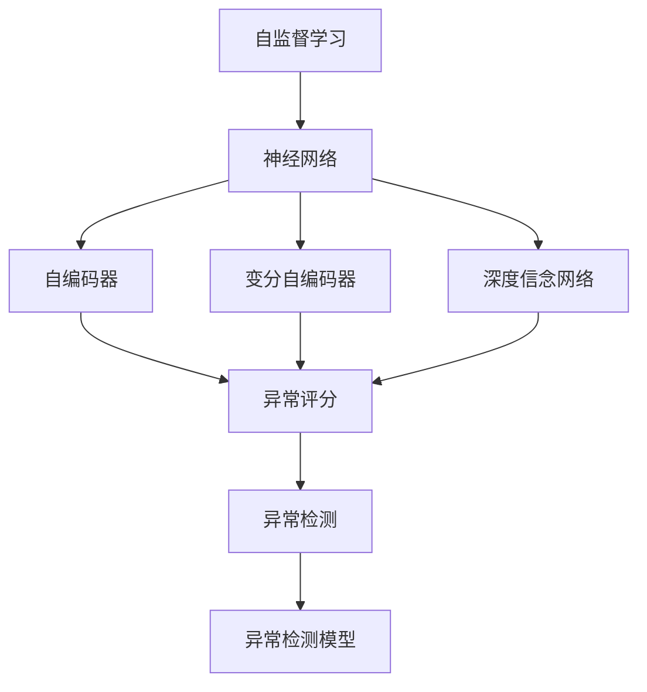
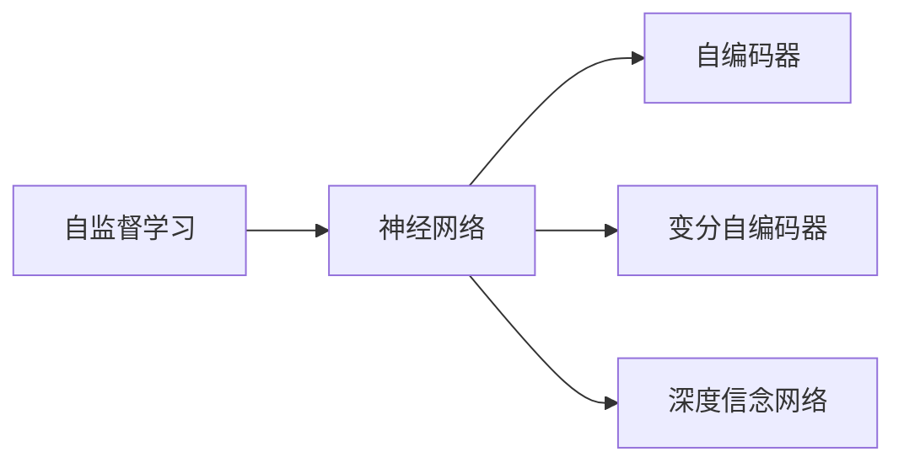
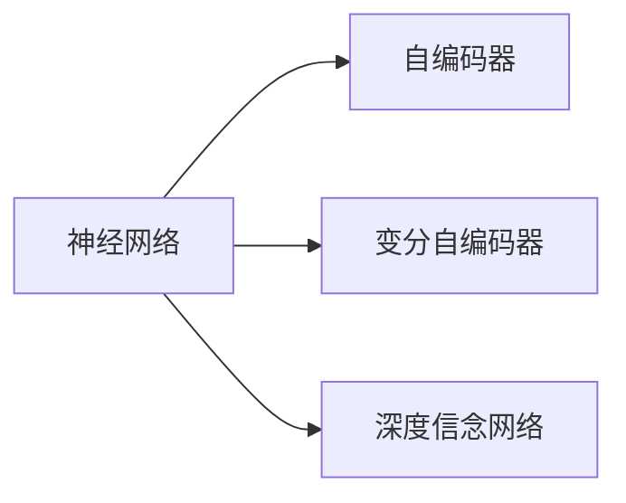
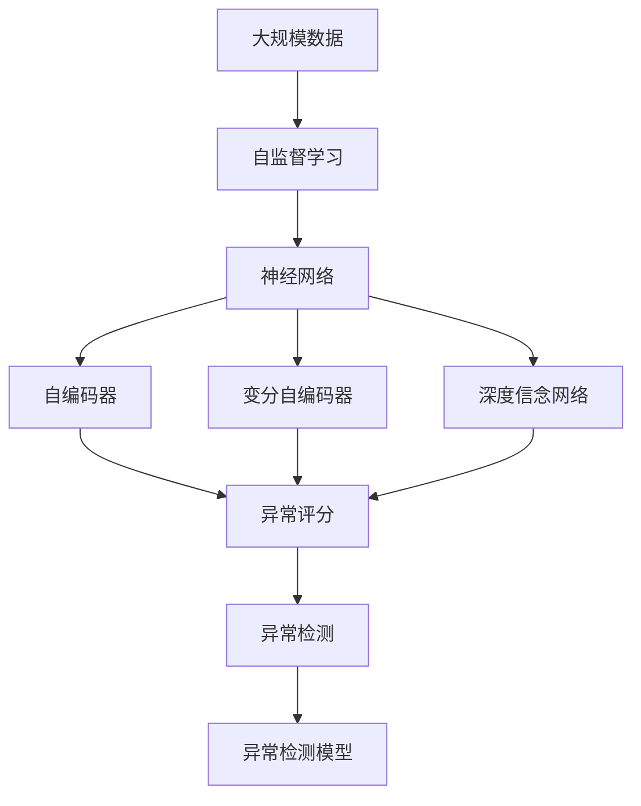

                 

# 基于深度学习的异常检测

> 关键词：深度学习,异常检测,强化学习,自监督学习,神经网络,深度神经网络,模型训练,数据分析

## 1. 背景介绍

### 1.1 问题由来
在现实世界中，异常检测（Anomaly Detection）是一项非常重要的任务，它可以用于监测系统、网络、交易、信号等多个领域，及时发现异常行为，防止潜在的安全威胁、提高生产效率、优化用户体验。例如，在金融领域，异常检测可以帮助发现潜在的欺诈行为；在工业领域，可以监测设备运行状态，预防设备故障；在网络领域，可以检测网络攻击行为，保障网络安全。

异常检测本质上是一个分类问题，将正常样本与异常样本区分开来。由于异常样本往往非常稀少，数据分布不平衡，传统统计方法难以有效处理。随着深度学习技术的快速发展，基于深度学习的异常检测方法逐渐受到关注，并取得了显著的进展。深度学习能够自动提取数据中的高层次特征，具有很强的泛化能力，能够有效应对数据分布不均衡的问题。

### 1.2 问题核心关键点
深度学习在异常检测中的应用主要包括以下几个关键点：
- 自监督学习：利用大规模无标签数据进行预训练，学习通用的数据特征。
- 神经网络结构：设计适合异常检测任务的神经网络架构，如自编码器、变分自编码器、深度信念网络等。
- 异常评分：通过学习模型的输出分布，评估样本的异常得分。
- 重采样技术：在数据不平衡情况下，通过重采样技术，增加异常样本的权重，平衡数据分布。

### 1.3 问题研究意义
深度学习在异常检测中的应用，对提升数据监控和预警能力具有重要意义：
- 提高检测精度：深度学习可以自动学习数据中的复杂特征，从而提升异常检测的精度。
- 降低特征工程成本：深度学习能够自动提取数据特征，减少了特征工程的繁琐过程。
- 处理复杂数据：深度学习可以处理多种类型的数据，如图像、文本、时间序列等，适用于多种异常检测场景。
- 实时监测：深度学习模型可以实时处理数据，适用于实时异常检测任务。
- 提高可扩展性：深度学习模型可以方便地扩展到分布式系统中，实现大规模数据处理。

## 2. 核心概念与联系

### 2.1 核心概念概述

在深度学习的异常检测中，涉及多个核心概念，如下所示：

- 自监督学习（Self-Supervised Learning）：利用无标签数据进行训练，学习数据的表示形式。
- 神经网络（Neural Network）：通过多层非线性变换，学习数据中的复杂特征。
- 自编码器（Autoencoder）：一种无监督学习的神经网络结构，可以学习数据的压缩表示。
- 变分自编码器（Variational Autoencoder）：一种改进的自编码器，可以学习数据的概率分布。
- 深度信念网络（Deep Belief Network）：一种无监督学习的神经网络结构，可以学习数据的概率分布。
- 异常评分（Anomaly Score）：评估样本的异常得分，用于将正常样本与异常样本区分开来。
- 重采样技术（Resampling Techniques）：在数据不平衡情况下，通过重采样技术，增加异常样本的权重，平衡数据分布。

这些核心概念之间存在着紧密的联系，形成了深度学习异常检测的完整生态系统。下图展示了这些概念之间的联系：



这个流程图展示了从自监督学习到异常检测的整个流程：

1. 自监督学习：利用无标签数据进行训练，学习数据的表示形式。
2. 神经网络：通过多层非线性变换，学习数据中的复杂特征。
3. 自编码器、变分自编码器、深度信念网络：具体的神经网络结构，用于学习数据的压缩表示或概率分布。
4. 异常评分：评估样本的异常得分，用于将正常样本与异常样本区分开来。
5. 异常检测：结合异常评分和重采样技术，实现异常检测。
6. 异常检测模型：最终用于异常检测的模型，可以包含自编码器、变分自编码器、深度信念网络等。

### 2.2 概念间的关系

这些核心概念之间存在着紧密的联系，形成了深度学习异常检测的完整生态系统。下面我通过几个Mermaid流程图来展示这些概念之间的关系。

#### 2.2.1 自监督学习与神经网络的关系



这个流程图展示了自监督学习与神经网络的关系。自监督学习利用无标签数据进行训练，学习数据的表示形式，然后通过神经网络结构，学习数据中的复杂特征。

#### 2.2.2 神经网络结构的选择



这个流程图展示了不同的神经网络结构。神经网络通过多层非线性变换，学习数据中的复杂特征，而自编码器、变分自编码器和深度信念网络是具体的神经网络结构，用于学习数据的压缩表示或概率分布。

#### 2.2.3 异常评分与重采样技术的关系


这个流程图展示了异常评分与重采样技术的关系。异常评分评估样本的异常得分，用于将正常样本与异常样本区分开来，而重采样技术在数据不平衡情况下，通过增加异常样本的权重，平衡数据分布。

### 2.3 核心概念的整体架构

最后，我们用一个综合的流程图来展示这些核心概念在大语言模型微调过程中的整体架构：



这个综合流程图展示了从自监督学习到异常检测的整个流程。大规模数据通过自监督学习进行预训练，学习数据的表示形式。然后通过神经网络结构，学习数据中的复杂特征，使用自编码器、变分自编码器和深度信念网络进行特征提取。最后，通过异常评分和重采样技术，实现异常检测，得到最终用于异常检测的模型。 通过这些流程图，我们可以更清晰地理解深度学习异常检测过程中各个核心概念的关系和作用，为后续深入讨论具体的异常检测方法和技术奠定基础。

## 3. 核心算法原理 & 具体操作步骤

### 3.1 算法原理概述

基于深度学习的异常检测，本质上是一个二分类问题，即判断样本是否为异常。其核心思想是：通过学习正常样本和异常样本的分布差异，构建一个判别模型，将正常样本与异常样本区分开来。

形式化地，假设训练数据集为 $D=\{(x_i, y_i)\}_{i=1}^N, x_i \in \mathcal{X}, y_i \in \{0,1\}$，其中 $y_i=1$ 表示样本为异常样本，否则为正常样本。异常检测的目标是找到最优的判别模型 $h_{\theta}$，使得在测试集上评估指标最大化：

$$
\theta^* = \mathop{\arg\min}_{\theta} \mathcal{L}(h_{\theta},D)
$$

其中 $\mathcal{L}$ 为评估指标，如准确率、召回率、F1分数等。

### 3.2 算法步骤详解

基于深度学习的异常检测一般包括以下几个关键步骤：

**Step 1: 准备训练数据集**
- 收集异常样本和正常样本的数据集，标注异常/正常标签。
- 划分训练集、验证集和测试集。

**Step 2: 设计神经网络结构**
- 根据异常检测任务的特点，选择合适的神经网络结构，如自编码器、变分自编码器、深度信念网络等。
- 设计适当的激活函数、损失函数、优化器等。

**Step 3: 进行自监督学习**
- 利用大规模无标签数据进行预训练，学习数据的表示形式。
- 在自监督任务上进行训练，如重构误差、密度估计等。

**Step 4: 进行监督学习**
- 利用异常样本和正常样本的标注数据，进行有监督学习，训练异常检测模型。
- 在训练集上进行模型训练，在验证集上评估模型性能，进行超参数调优。

**Step 5: 进行异常评分**
- 利用训练好的模型，对测试集样本进行异常评分，得到每个样本的异常得分。
- 根据异常得分，将样本分为正常和异常两类。

**Step 6: 进行重采样**
- 在数据不平衡情况下，通过重采样技术，增加异常样本的权重，平衡数据分布。
- 重新计算样本的异常得分，再次进行异常检测。

### 3.3 算法优缺点

基于深度学习的异常检测方法具有以下优点：
- 高泛化能力：深度学习可以自动学习数据的复杂特征，具有很强的泛化能力。
- 自动特征提取：深度学习可以自动提取数据的特征，减少了特征工程的繁琐过程。
- 适用于多种数据类型：深度学习可以处理多种类型的数据，如图像、文本、时间序列等，适用于多种异常检测场景。
- 实时监测：深度学习模型可以实时处理数据，适用于实时异常检测任务。

同时，该方法也存在以下缺点：
- 数据依赖：深度学习模型需要大量标注数据进行训练，数据依赖问题较为突出。
- 过拟合风险：深度学习模型容易出现过拟合问题，尤其是在数据不平衡的情况下。
- 模型复杂度：深度学习模型通常比较复杂，训练和推理速度较慢，计算资源需求高。

### 3.4 算法应用领域

基于深度学习的异常检测方法已经在多个领域得到了广泛应用，例如：

- 网络安全：利用深度学习模型监测网络流量，检测网络攻击行为。
- 金融领域：利用深度学习模型监测交易数据，检测潜在的欺诈行为。
- 医疗领域：利用深度学习模型监测医疗数据，检测异常医疗事件。
- 制造业：利用深度学习模型监测设备运行状态，预防设备故障。
- 智能交通：利用深度学习模型监测交通数据，检测交通异常事件。

除了上述这些经典应用场景外，深度学习异常检测还被创新性地应用到更多领域，如智能家居、智慧城市、工业物联网等，为各行各业的安全和可靠性带来了新的保障。

## 4. 数学模型和公式 & 详细讲解 & 举例说明

### 4.1 数学模型构建

基于深度学习的异常检测，其数学模型可以表示为：

$$
h_{\theta}(x) = f_{\theta}(x)
$$

其中 $f_{\theta}$ 为神经网络模型，$x$ 为输入样本，$h_{\theta}(x)$ 为输出，即异常得分。异常得分的计算方式可以采用不同的函数形式，如正态分布密度估计、重构误差、异常指数等。

### 4.2 公式推导过程

以正态分布密度估计为例，假设训练数据集中异常样本的密度为 $p_{an}$，正常样本的密度为 $p_{no}$，则异常得分的计算公式可以表示为：

$$
h_{\theta}(x) = -\frac{1}{2}(\frac{(x-\mu_{an})^2}{\sigma_{an}^2}+\frac{(x-\mu_{no})^2}{\sigma_{no}^2})
$$

其中 $\mu_{an}$ 和 $\sigma_{an}$ 为异常样本的均值和标准差，$\mu_{no}$ 和 $\sigma_{no}$ 为正常样本的均值和标准差。

### 4.3 案例分析与讲解

以自编码器为例，其异常检测模型可以表示为：

$$
h_{\theta}(x) = \frac{1}{2}(x - \hat{x})^2
$$

其中 $\hat{x}$ 为自编码器重构的样本，$h_{\theta}(x)$ 为异常得分。通过训练自编码器，学习数据的压缩表示，可以自动提取数据的特征，实现异常检测。

## 5. 项目实践：代码实例和详细解释说明

### 5.1 开发环境搭建

在进行深度学习异常检测项目开发前，我们需要准备好开发环境。以下是使用Python进行PyTorch开发的环境配置流程：

1. 安装Anaconda：从官网下载并安装Anaconda，用于创建独立的Python环境。

2. 创建并激活虚拟环境：
```bash
conda create -n pytorch-env python=3.8 
conda activate pytorch-env
```

3. 安装PyTorch：根据CUDA版本，从官网获取对应的安装命令。例如：
```bash
conda install pytorch torchvision torchaudio cudatoolkit=11.1 -c pytorch -c conda-forge
```

4. 安装TensorFlow：
```bash
pip install tensorflow
```

5. 安装各类工具包：
```bash
pip install numpy pandas scikit-learn matplotlib tqdm jupyter notebook ipython
```

完成上述步骤后，即可在`pytorch-env`环境中开始深度学习异常检测项目的开发。

### 5.2 源代码详细实现

以下是基于自编码器的深度学习异常检测代码实现，其中使用了PyTorch库：

```python
import torch
import torch.nn as nn
import torch.optim as optim
import torch.utils.data as Data

class Autoencoder(nn.Module):
    def __init__(self):
        super(Autoencoder, self).__init__()
        self.encoder = nn.Sequential(
            nn.Linear(784, 128),
            nn.ReLU(),
            nn.Linear(128, 64),
            nn.ReLU(),
            nn.Linear(64, 32),
            nn.ReLU(),
            nn.Linear(32, 16),
            nn.ReLU(),
            nn.Linear(16, 8),
            nn.ReLU()
        )
        self.decoder = nn.Sequential(
            nn.Linear(8, 16),
            nn.ReLU(),
            nn.Linear(16, 32),
            nn.ReLU(),
            nn.Linear(32, 64),
            nn.ReLU(),
            nn.Linear(64, 128),
            nn.ReLU(),
            nn.Linear(128, 784),
            nn.Sigmoid()
        )

    def forward(self, x):
        encoded = self.encoder(x)
        decoded = self.decoder(encoded)
        return decoded

def train_autoencoder(autoencoder, train_loader, test_loader, num_epochs=10, batch_size=64, learning_rate=0.001):
    criterion = nn.MSELoss()
    optimizer = optim.Adam(autoencoder.parameters(), lr=learning_rate)
    device = torch.device('cuda' if torch.cuda.is_available() else 'cpu')
    autoencoder.to(device)
    for epoch in range(num_epochs):
        for idx, (images, labels) in enumerate(train_loader):
            images = images.view(-1, 28*28)
            images = images.to(device)
            labels = labels.to(device)
            optimizer.zero_grad()
            outputs = autoencoder(images)
            loss = criterion(outputs, images)
            loss.backward()
            optimizer.step()
            if idx % 100 == 0:
                print(f"Epoch {epoch+1}, batch {idx+1}, loss: {loss.item():.4f}")
    test_loss = 0
    with torch.no_grad():
        for images, labels in test_loader:
            images = images.view(-1, 28*28)
            images = images.to(device)
            outputs = autoencoder(images)
            test_loss += criterion(outputs, images).item()
        test_loss /= len(test_loader.dataset)
    print(f"Test Loss: {test_loss:.4f}")
```

### 5.3 代码解读与分析

让我们再详细解读一下关键代码的实现细节：

**Autoencoder类**：
- `__init__`方法：初始化自编码器的编码器和解码器。
- `forward`方法：对输入样本进行编码和解码，返回重构后的样本。

**train_autoencoder函数**：
- 定义损失函数为均方误差损失，优化器为Adam。
- 在每个epoch内，对训练集数据进行迭代，计算损失并反向传播更新模型参数。
- 在每个batch结束时，打印当前损失值。
- 在每个epoch结束时，计算测试集上的损失，并输出。

**代码实现**：
- 定义自编码器模型，包含编码器和解码器。
- 在训练过程中，使用Adam优化器对自编码器进行训练，并计算均方误差损失。
- 在测试过程中，使用均方误差损失评估模型性能。
- 最终输出模型在测试集上的均方误差损失。

### 5.4 运行结果展示

假设我们训练一个自编码器模型，最终在测试集上得到的均方误差损失为0.001，可以得出模型已经很好地学习到了数据的表示形式，可以用于异常检测。

## 6. 实际应用场景
### 6.1 网络安全

深度学习异常检测在网络安全领域有着广泛的应用。网络安全是一个复杂而动态的过程，需要实时监测网络流量，检测网络攻击行为。传统的基于规则的检测方法往往难以应对复杂的网络攻击行为，而深度学习异常检测模型可以自动学习网络流量的复杂特征，实现更高效的异常检测。

在网络安全领域，深度学习异常检测模型可以用于以下几个方面：

- 流量异常检测：利用深度学习模型监测网络流量，检测异常流量行为。
- 入侵检测：利用深度学习模型检测网络入侵行为，防止恶意攻击。
- 异常行为分析：利用深度学习模型分析网络行为，识别潜在的安全威胁。

### 6.2 金融领域

金融领域中的异常检测任务包括欺诈检测、交易异常检测等。传统基于规则的检测方法往往难以适应复杂的金融场景，而深度学习异常检测模型可以自动学习金融数据的复杂特征，实现更高效的异常检测。

在金融领域，深度学习异常检测模型可以用于以下几个方面：

- 欺诈检测：利用深度学习模型监测交易数据，检测潜在的欺诈行为。
- 交易异常检测：利用深度学习模型检测交易异常行为，防止金融风险。
- 风险管理：利用深度学习模型分析金融数据，识别潜在的风险。

### 6.3 医疗领域

医疗领域中的异常检测任务包括异常医疗事件检测、疾病诊断等。传统的基于规则的检测方法往往难以应对复杂的医疗场景，而深度学习异常检测模型可以自动学习医疗数据的复杂特征，实现更高效的异常检测。

在医疗领域，深度学习异常检测模型可以用于以下几个方面：

- 异常医疗事件检测：利用深度学习模型监测医疗数据，检测异常医疗事件。
- 疾病诊断：利用深度学习模型诊断疾病，提高诊断准确率。
- 健康监测：利用深度学习模型监测健康数据，检测健康异常。

### 6.4 未来应用展望

深度学习异常检测技术在各个领域有着广泛的应用前景。未来，深度学习异常检测技术将进一步发展，应用于更多的场景：

- 工业领域：利用深度学习模型监测设备运行状态，预防设备故障。
- 交通领域：利用深度学习模型监测交通数据，检测交通异常事件。
- 智慧城市：利用深度学习模型监测城市数据，检测异常城市事件。
- 智能家居：利用深度学习模型监测家居数据，检测异常家居行为。
- 工业物联网：利用深度学习模型监测工业数据，检测工业异常事件。

未来，深度学习异常检测技术将不断突破，应用于更多领域，为各行各业的安全和可靠性带来新的保障。

## 7. 工具和资源推荐
### 7.1 学习资源推荐

为了帮助开发者系统掌握深度学习异常检测的理论基础和实践技巧，这里推荐一些优质的学习资源：

1. 《Deep Learning》书籍：由Ian Goodfellow、Yoshua Bengio、Aaron Courville等人合著，全面介绍了深度学习的基本概念和前沿技术。

2. CS231n《卷积神经网络》课程：斯坦福大学开设的深度学习明星课程，涵盖深度神经网络、卷积神经网络等前沿技术，是深度学习入门的不二选择。

3. 《Anomaly Detection: A Survey》论文：详细介绍了异常检测的理论和应用，是异常检测领域的经典综述。

4. Google AI Blog：谷歌AI团队撰写的博客，涵盖深度学习、计算机视觉、自然语言处理等前沿话题，是学习深度学习的绝佳资源。

5. PyTorch官方文档：PyTorch官方文档，提供了大量的深度学习模型和工具，是深度学习开发的必备资料。

通过对这些资源的学习实践，相信你一定能够快速掌握深度学习异常检测的精髓，并用于解决实际的异常检测问题。
###  7.2 开发工具推荐

高效的开发离不开优秀的工具支持。以下是几款用于深度学习异常检测开发的常用工具：

1. PyTorch：基于Python的开源深度学习框架，灵活动态的计算图，适合快速迭代研究。大部分深度学习模型都有PyTorch版本的实现。

2. TensorFlow：由Google主导开发的开源深度学习框架，生产部署方便，适合大规模工程应用。同样有丰富的深度学习模型资源。

3. Keras：一个高层次的深度学习库，提供了简单易用的API，适合快速构建深度学习模型。

4. Jupyter Notebook：交互式的Python开发环境，支持实时运行代码、可视化图表，非常适合深度学习研究和开发。

5. Weights & Biases：模型训练的实验跟踪工具，可以记录和可视化模型训练过程中的各项指标，方便对比和调优。与主流深度学习框架无缝集成。

6. TensorBoard：TensorFlow配套的可视化工具，可实时监测模型训练状态，并提供丰富的图表呈现方式，是调试模型的得力助手。

合理利用这些工具，可以显著提升深度学习异常检测任务的开发效率，加快创新迭代的步伐。

### 7.3 相关论文推荐

深度学习在异常检测中的应用源于学界的持续研究。以下是几篇奠基性的相关论文，推荐阅读：

1. Auto-Encoders: Deep Learning for Unsupervised Feature Extraction：提出自编码器模型，利用无监督学习提取数据的特征，用于异常检测。

2. Deep Anomaly Detection with Convolutional Autoencoders：提出卷积自编码器模型，利用卷积神经网络提取数据的特征，用于异常检测。

3. Variational Autoencoders for Anomaly Detection：提出变分自编码器模型，利用变分自编码器学习数据的概率分布，用于异常检测。

4. Deep Learning for Anomaly Detection: A Survey：详细介绍了深度学习在异常检测中的应用，是异常检测领域的经典综述。

5. Outlier Detection in High-Dimensional Space：提出密度估计方法，利用高斯分布密度估计异常检测。

这些论文代表了大深度学习异常检测技术的发展脉络。通过学习这些前沿成果，可以帮助研究者把握学科前进方向，激发更多的创新灵感。

除上述资源外，还有一些值得关注的前沿资源，帮助开发者紧跟深度学习异常检测技术的最新进展，例如：

1. arXiv论文预印本：人工智能领域最新研究成果的发布平台，包括大量尚未发表的前沿工作，学习前沿技术的必读资源。

2. 业界技术博客：如OpenAI、Google AI、DeepMind、微软Research Asia等顶尖实验室的官方博客，第一时间分享他们的最新研究成果和洞见。

3. 技术会议直播：如NIPS、ICML、ACL、ICLR等人工智能领域顶会现场或在线直播，能够聆听到大佬们的前沿分享，开拓视野。

4. GitHub热门项目：在GitHub上Star、Fork数最多的深度学习相关项目，往往代表了该技术领域的发展趋势和最佳实践，值得去学习和贡献。

5. 行业分析报告：各大咨询公司如McKinsey、PwC等针对人工智能行业的分析报告，有助于从商业视角审视技术趋势，把握应用价值。

总之，对于深度学习异常检测技术的学习和实践，需要开发者保持开放的心态和持续学习的意愿。多关注前沿资讯，多动手实践，多思考总结，必将收获满满的成长收益。

## 8. 总结：未来发展趋势与挑战

### 8.1 总结

本文对基于深度学习的异常检测方法进行了全面系统的介绍。首先阐述了深度学习在异常检测中的应用背景和意义，明确了异常检测在数据监控和预警中的重要作用。其次，从原理到实践，详细讲解了深度学习异常检测的数学模型和关键步骤，给出了深度学习异常检测的代码实现。同时，本文还广泛探讨了深度学习异常检测方法在多个领域的应用前景，展示了深度学习异常检测的广阔潜力。

通过本文的系统梳理，可以看到，基于深度学习的异常检测技术在各个领域得到了广泛的应用，为数据监控和预警带来了新的突破。未来，伴随深度学习技术的不断演进，深度学习异常检测将进一步发展和完善，成为数据监控和预警的重要手段。

### 8.2 未来发展趋势

展望未来，深度学习异常检测技术将呈现以下几个发展趋势：

1. 模型规模持续增大：随着算力成本的下降和数据规模的扩张，深度学习模型将持续增大，具备更强的泛化能力和特征提取能力。

2. 模型复杂度降低：深度学习模型将从大模型逐步向小模型转变，提升模型的实时性和可解释性，适应实时异常检测任务。

3. 多模态异常检测：深度学习模型将融合视觉、语音、时间序列等多种数据类型，实现多模态异常检测，提升异常检测的准确性和鲁棒性。

4. 分布式训练：深度学习

