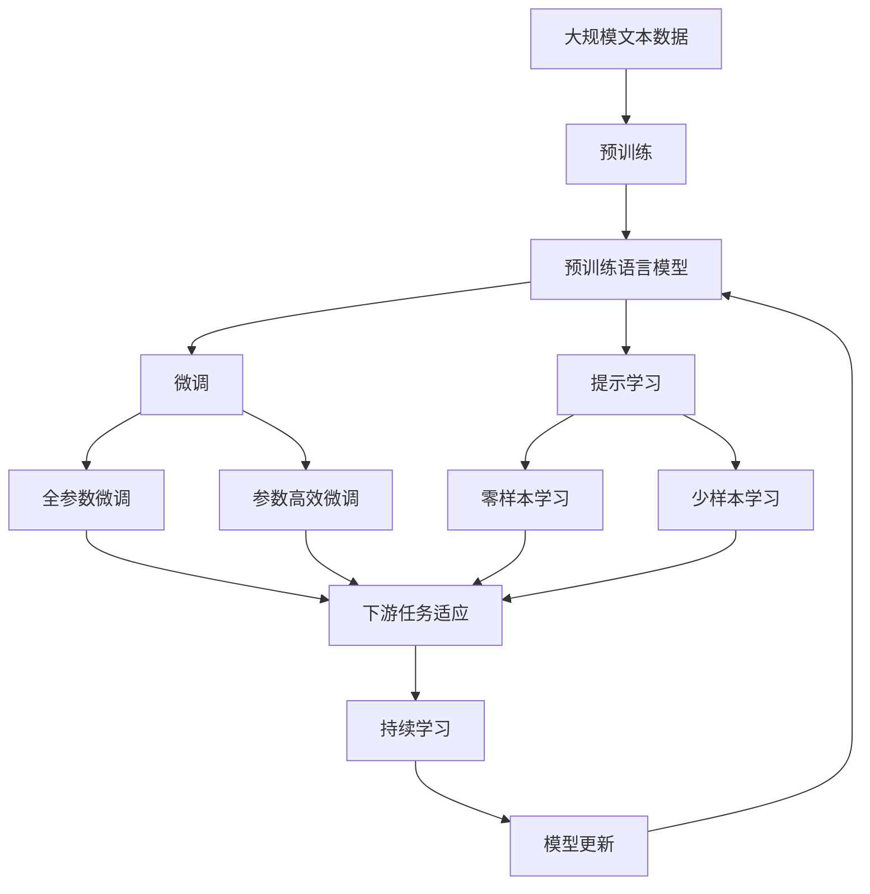

                 

# 基于深度学习的情感分类

情感分类是自然语言处理(NLP)领域的重要任务之一，旨在自动识别文本的情感倾向，如正面、负面或中性。这一技术在商业智能、舆情分析、用户评价分析等多个应用场景中有着广泛的应用前景。本文将详细阐述基于深度学习的情感分类原理与实践，涵盖核心概念、算法原理、操作步骤、案例分析等内容，并结合实际项目实践给出完整的代码实现与结果展示，最后展望未来发展趋势与挑战。

## 1. 背景介绍

### 1.1 问题由来
情感分类是NLP领域的重要研究方向，其核心目标是理解人类文本的情感色彩，并将文本归为正面、负面或中性类别。传统的基于规则和词典的方法，如VADER情感分析器，虽然效果较好，但在处理复杂情感表达、多义词语等方面仍显不足。近年来，随着深度学习技术的发展，基于神经网络的情感分类方法逐渐成为主流，具有精度高、鲁棒性强等优势。

### 1.2 问题核心关键点
基于深度学习的情感分类方法，主要依赖于大规模预训练模型（如BERT、GPT等），通过自监督或监督学习任务训练模型，最终在情感分类任务上微调以获得最佳性能。其核心关键点包括：
- 大规模预训练模型：通过在大规模无标签文本数据上进行预训练，学习通用的语言表示。
- 情感分类微调：使用下游情感分类任务的数据集，对预训练模型进行有监督训练，以获得情感分类能力。
- 数据增强与对抗训练：通过数据增强和对抗训练等技术，提高模型的泛化能力和鲁棒性。

### 1.3 问题研究意义
情感分类技术的应用，可以提升商业智能决策的准确性、优化用户服务质量、监控舆情动态等，对企业和社会都具有重要意义。它不仅能识别文本的情感倾向，还能对情感强度进行量化，更细粒度地分析情感变化。

## 2. 核心概念与联系

### 2.1 核心概念概述

- **深度学习**：利用神经网络进行模型训练，通过层次化的特征表示学习，从而提升模型的表达能力和泛化能力。
- **情感分类**：将文本分为正面、负面或中性类别的任务，旨在理解人类文本的情感色彩。
- **预训练模型**：在大规模无标签文本数据上进行自监督学习，学习通用的语言表示。
- **微调**：在预训练模型的基础上，使用下游任务的少量标注数据进行有监督训练，以获得任务特定的性能。
- **数据增强**：通过数据变换等手段，丰富训练数据，提高模型的泛化能力。
- **对抗训练**：通过引入对抗样本，提升模型的鲁棒性和泛化能力。

这些核心概念之间存在紧密联系，共同构成了基于深度学习的情感分类框架。预训练模型通过在大规模数据上进行学习，获得了通用的语言表示能力，而微调则通过特定的下游任务数据，将模型的能力进一步细化和优化。数据增强和对抗训练等技术则进一步提升了模型的泛化能力和鲁棒性。

### 2.2 概念间的关系

以下是一个综合性的Mermaid流程图，展示这些核心概念在大语言模型微调过程中的整体架构：



这个流程图展示了从预训练到微调，再到持续学习的完整过程。预训练模型通过在大规模数据上进行学习，获得了通用的语言表示能力。微调则通过特定的下游任务数据，将模型的能力进一步细化和优化。提示学习可以实现零样本和少样本学习，进一步扩展了微调方法的应用场景。

## 3. 核心算法原理 & 具体操作步骤

### 3.1 算法原理概述

基于深度学习的情感分类，主要通过以下步骤实现：

1. **预训练**：在大规模无标签文本数据上，通过自监督学习任务训练通用语言模型。
2. **微调**：在预训练模型的基础上，使用下游情感分类任务的数据集进行有监督训练，以获得情感分类能力。
3. **数据增强**：通过数据变换等手段，丰富训练数据，提高模型的泛化能力。
4. **对抗训练**：通过引入对抗样本，提升模型的鲁棒性和泛化能力。

### 3.2 算法步骤详解

以下是基于深度学习的情感分类算法的详细步骤：

1. **准备数据集**：
   - 收集情感分类任务的数据集，包括正面、负面和中性情感的文本。
   - 将文本数据进行预处理，如分词、去除停用词等。
   - 将文本和情感标签构建为TensorFlow或PyTorch的Dataset格式。

2. **选择预训练模型**：
   - 选择适合情感分类的预训练模型，如BERT、GPT等。
   - 使用模型的基础版本，如BERT-base，不需要额外训练。

3. **微调模型**：
   - 对预训练模型进行微调，使用情感分类任务的损失函数进行训练。
   - 设置合适的学习率、批大小等超参数。
   - 使用Adam或SGD等优化器，进行梯度下降更新。

4. **数据增强**：
   - 对训练数据进行增强，如回译、同义词替换等。
   - 使用数据增强技术，丰富训练数据的多样性。

5. **对抗训练**：
   - 引入对抗样本，提升模型的鲁棒性。
   - 使用生成对抗网络等技术，生成对抗样本。
   - 在训练过程中，使用对抗样本进行训练。

6. **评估模型**：
   - 使用测试集对模型进行评估，计算准确率、召回率、F1分数等指标。
   - 根据评估结果，调整超参数和训练策略。

7. **持续学习**：
   - 定期更新模型，以适应新的数据分布。
   - 使用增量学习、在线学习等技术，实时更新模型。

### 3.3 算法优缺点

基于深度学习的情感分类方法有以下优点：
- 精度高：深度学习方法能够自动学习复杂的特征表示，从而提高分类精度。
- 泛化能力强：深度学习方法能够自动学习泛化能力，适用于不同领域的情感分类任务。
- 可扩展性强：深度学习方法能够适应大规模数据，适用于处理大规模情感分类任务。

同时，基于深度学习的情感分类方法也存在一些缺点：
- 数据依赖性高：深度学习方法依赖于大规模标注数据，标注成本高。
- 计算资源消耗大：深度学习方法需要大量的计算资源，训练时间长。
- 模型复杂度高：深度学习方法模型结构复杂，难以解释和调试。

### 3.4 算法应用领域

基于深度学习的情感分类方法，已经在多个领域得到了广泛应用，例如：

- 社交媒体情感分析：通过分析用户评论和反馈，了解公众对产品或事件的情感倾向。
- 用户评价分析：通过分析用户对商品、服务的评价，了解用户满意度。
- 舆情监控：通过分析新闻、论坛等公共媒体的情感，监控社会舆情动态。
- 情感营销：通过分析消费者对品牌的情感倾向，优化市场营销策略。
- 情感医疗：通过分析患者的情感状态，提高医疗服务质量。

## 4. 数学模型和公式 & 详细讲解 & 举例说明

### 4.1 数学模型构建

基于深度学习的情感分类，可以形式化地表示为以下数学模型：

- **输入**：文本序列 $X=\{x_1, x_2, \ldots, x_n\}$，其中 $x_i$ 为文本的 $i$ 个词。
- **输出**：情感类别 $Y=\{y_1, y_2, \ldots, y_n\}$，其中 $y_i$ 为文本的情感类别。
- **模型**：预训练语言模型 $M_\theta(X)$，其中 $\theta$ 为模型参数。

模型的目标是最小化损失函数 $\mathcal{L}$，使得模型在情感分类任务上表现最佳。常用的损失函数包括交叉熵损失函数、平方误差损失函数等。

### 4.2 公式推导过程

以BERT模型为例，情感分类的目标函数可以表示为：

$$
\mathcal{L}(\theta) = \frac{1}{N} \sum_{i=1}^N \mathcal{L}(y_i, M_\theta(X))
$$

其中，$N$ 为样本数，$y_i$ 为文本的情感类别，$M_\theta(X)$ 为模型在文本 $X$ 上的输出。对于情感分类任务，$y_i$ 为0（负面）、1（正面）或2（中性）。

常用的交叉熵损失函数为：

$$
\mathcal{L}(y_i, M_\theta(X)) = -y_i \log M_\theta(x_i) - (1-y_i) \log(1-M_\theta(x_i))
$$

其中，$M_\theta(x_i)$ 为模型在词 $x_i$ 上的输出概率。

### 4.3 案例分析与讲解

以IMDB电影评论情感分类为例，我们分析以下代码片段：

```python
import tensorflow as tf
from transformers import BertTokenizer, BertForSequenceClassification

tokenizer = BertTokenizer.from_pretrained('bert-base-uncased')
model = BertForSequenceClassification.from_pretrained('bert-base-uncased', num_labels=2)

input_ids = tokenizer(text, return_tensors='tf').input_ids
attention_mask = tokenizer(text, return_tensors='tf').attention_mask

with tf.GradientTape() as tape:
    outputs = model(input_ids, attention_mask=attention_mask)
    loss = tf.keras.losses.sparse_categorical_crossentropy(labels=labels, logits=outputs.logits)
    loss = tf.reduce_mean(loss)

loss_value = loss.numpy()
```

在这个代码片段中，我们首先使用BertTokenizer对文本进行分词，得到输入张量 `input_ids` 和 `attention_mask`。然后，使用BertForSequenceClassification模型对输入进行分类，并计算损失函数。

## 5. 项目实践：代码实例和详细解释说明

### 5.1 开发环境搭建

要使用TensorFlow进行情感分类模型的开发，需要进行以下步骤：

1. 安装TensorFlow：

   ```
   pip install tensorflow
   ```

2. 安装Bert模型和Tokenizer：

   ```
   pip install transformers
   ```

3. 准备数据集：

   - 收集情感分类数据集，如IMDB电影评论数据集。
   - 将数据集划分为训练集、验证集和测试集。
   - 对文本进行预处理，如分词、去除停用词等。

### 5.2 源代码详细实现

以下是基于BERT模型的情感分类代码实现：

```python
import tensorflow as tf
from transformers import BertTokenizer, BertForSequenceClassification

# 加载预训练模型和分词器
tokenizer = BertTokenizer.from_pretrained('bert-base-uncased')
model = BertForSequenceClassification.from_pretrained('bert-base-uncased', num_labels=2)

# 准备训练数据
train_dataset = ...
val_dataset = ...
test_dataset = ...

# 定义模型
input_ids = tokenizer(text, return_tensors='tf').input_ids
attention_mask = tokenizer(text, return_tensors='tf').attention_mask

with tf.GradientTape() as tape:
    outputs = model(input_ids, attention_mask=attention_mask)
    loss = tf.keras.losses.sparse_categorical_crossentropy(labels=labels, logits=outputs.logits)
    loss = tf.reduce_mean(loss)

# 训练模型
for epoch in range(num_epochs):
    model.compile(optimizer=tf.keras.optimizers.Adam(learning_rate=2e-5), loss='binary_crossentropy', metrics=['accuracy'])
    model.fit(train_dataset, epochs=num_epochs, validation_data=val_dataset)

# 评估模型
model.evaluate(test_dataset)
```

### 5.3 代码解读与分析

这个代码片段展示了情感分类模型的基本实现流程。首先，我们使用BertTokenizer对文本进行分词，并得到输入张量 `input_ids` 和 `attention_mask`。然后，使用BertForSequenceClassification模型对输入进行分类，并计算损失函数。最后，使用TensorFlow的训练函数对模型进行训练和评估。

## 6. 实际应用场景

基于深度学习的情感分类方法，已经在多个实际应用场景中得到广泛应用：

### 6.1 社交媒体情感分析

通过分析社交媒体上的用户评论和反馈，了解公众对产品或事件的情感倾向，帮助企业优化产品和服务，提升用户体验。

### 6.2 用户评价分析

通过分析用户对商品、服务的评价，了解用户满意度，优化产品和服务质量，提升用户忠诚度。

### 6.3 舆情监控

通过分析新闻、论坛等公共媒体的情感，监控社会舆情动态，及时应对负面舆情，保障公共安全。

### 6.4 情感医疗

通过分析患者的情感状态，提高医疗服务质量，改善患者心理状态，促进患者康复。

### 6.5 情感营销

通过分析消费者对品牌的情感倾向，优化市场营销策略，提升品牌知名度和用户满意度。

## 7. 工具和资源推荐

### 7.1 学习资源推荐

- TensorFlow官方文档：详细的TensorFlow教程和API文档，帮助开发者快速上手。
- Transformers官方文档：Bert等预训练模型的详细使用指南和样例代码。
- PyTorch官方文档：与TensorFlow类似，提供深度学习框架的教程和API文档。

### 7.2 开发工具推荐

- Jupyter Notebook：Python编程环境，提供丰富的数据可视化和交互式编程功能。
- TensorBoard：TensorFlow的可视化工具，帮助开发者监控模型训练和推理过程。
- Weights & Biases：模型训练的实验跟踪工具，记录模型训练过程中的各项指标。

### 7.3 相关论文推荐

- Attention is All You Need：Transformer论文，奠定了深度学习模型发展的基础。
- BERT: Pre-training of Deep Bidirectional Transformers for Language Understanding：BERT论文，提出了预训练语言模型的重要方法。
- Deep Learning for Sentiment Analysis: A Survey：情感分类的综述论文，介绍了情感分类的各种方法和技术。

## 8. 总结：未来发展趋势与挑战

### 8.1 总结

本文详细阐述了基于深度学习的情感分类原理与实践，包括核心概念、算法原理、操作步骤等内容。通过系统的理论讲解和代码实现，帮助读者理解情感分类的基本流程和实现细节。同时，通过实际应用场景和工具资源推荐，提供了情感分类技术的实际应用方法和资源支持。

### 8.2 未来发展趋势

未来，基于深度学习的情感分类技术将呈现以下发展趋势：

- **模型规模增大**：预训练模型规模将不断增大，提升模型的表达能力和泛化能力。
- **模型结构简化**：未来模型结构将更简单、更高效，降低计算资源消耗。
- **数据增强技术进步**：数据增强技术将更加丰富、有效，提升模型的泛化能力。
- **对抗训练技术提升**：对抗训练技术将进一步发展，提升模型的鲁棒性。
- **模型融合技术**：多种模型的融合技术将得到应用，提升模型的性能和鲁棒性。

### 8.3 面临的挑战

尽管基于深度学习的情感分类技术已经取得了一定的进展，但在实际应用中也面临一些挑战：

- **数据依赖性高**：情感分类依赖于大规模标注数据，标注成本高。
- **计算资源消耗大**：情感分类需要大量的计算资源，训练时间长。
- **模型复杂度高**：情感分类模型结构复杂，难以解释和调试。

### 8.4 研究展望

未来，基于深度学习的情感分类技术需要在以下几个方面进行探索和改进：

- **无监督学习**：探索无监督学习技术，降低对标注数据的依赖。
- **模型解释性**：研究模型的可解释性，提高模型的透明度和可调试性。
- **跨领域应用**：将情感分类技术应用于更多领域，提升技术的应用范围和价值。
- **多模态融合**：探索多模态融合技术，提升情感分类模型的性能和鲁棒性。

总之，基于深度学习的情感分类技术在实际应用中具有广阔的前景，未来需要不断探索和改进，才能更好地服务于社会和经济。

## 9. 附录：常见问题与解答

### Q1: 情感分类模型如何选择？

A: 选择情感分类模型时，需要考虑数据集的大小和复杂度。对于小规模数据集，可以选择简单的模型，如BERT-base；对于大规模数据集，可以选择更大更强的模型，如BERT-large。同时，需要考虑模型的复杂度和计算资源消耗。

### Q2: 如何缓解情感分类模型过拟合？

A: 缓解情感分类模型过拟合，可以通过以下方法：
- 数据增强：使用数据增强技术，如回译、同义词替换等。
- 正则化：使用L2正则、Dropout等技术。
- 对抗训练：使用对抗样本训练模型。

### Q3: 情感分类模型如何应用于实际场景？

A: 情感分类模型应用于实际场景，需要进行以下步骤：
- 收集情感分类数据集。
- 对数据集进行预处理和标注。
- 训练情感分类模型。
- 使用模型进行情感分类预测。
- 对预测结果进行分析和应用。

通过以上步骤，可以将情感分类模型应用于情感分析、用户评价分析、舆情监控等多个实际场景中。

