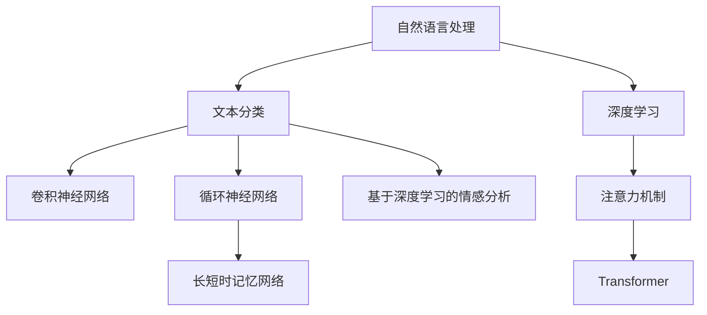
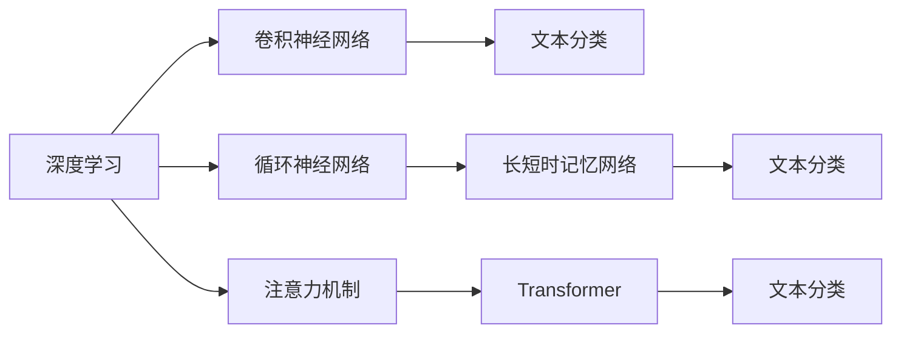
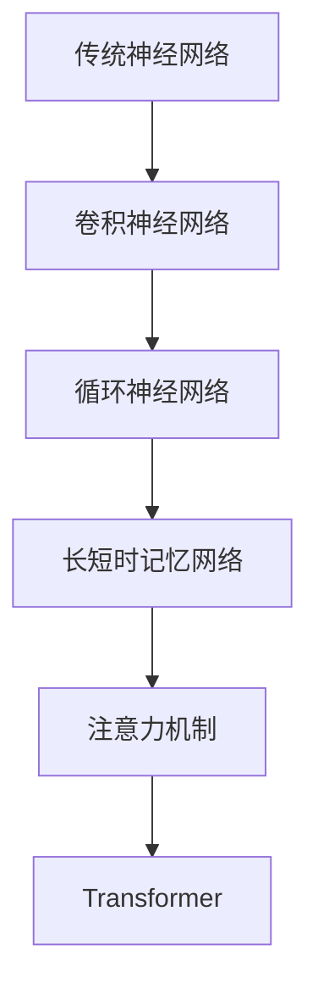
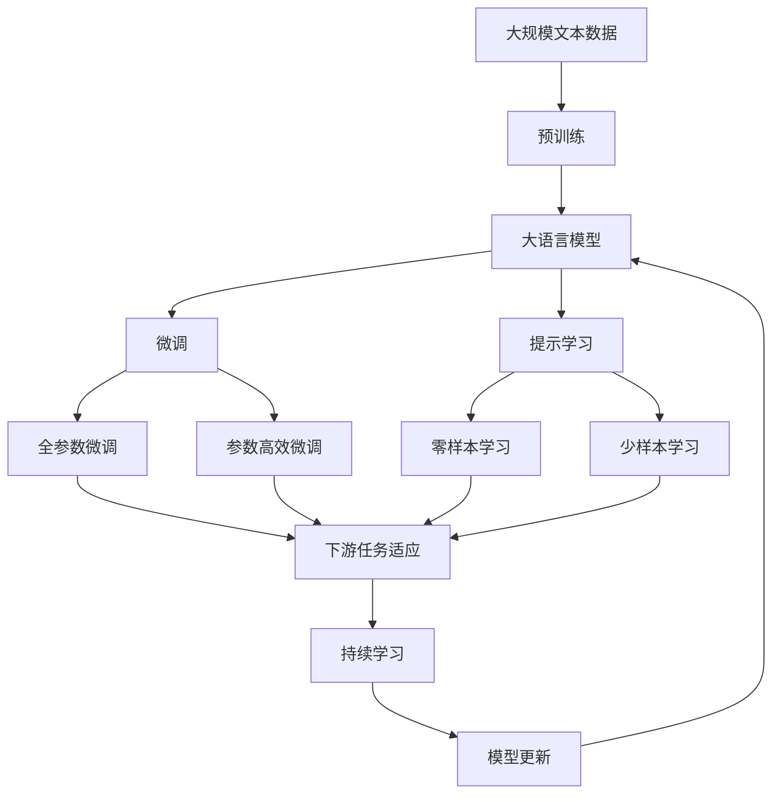

                 

# 基于深度学习的文本情感分析

> 关键词：深度学习,情感分析,文本分类,自然语言处理(NLP),卷积神经网络(CNN),循环神经网络(RNN),长短时记忆网络(LSTM),注意力机制,Transformer

## 1. 背景介绍

### 1.1 问题由来
在当今数字化时代，人们越来越多地通过文本形式进行交流和表达情感。情感分析作为自然语言处理(Natural Language Processing, NLP)的一个重要分支，旨在从文本中自动识别和理解情感。情感分析在社交媒体监控、产品反馈分析、舆情分析等多个领域具有重要应用价值，能够帮助企业更好地理解市场动态，提升用户体验，优化产品策略。

### 1.2 问题核心关键点
情感分析的核心在于如何有效地从文本中提取情感信息。传统的情感分析方法主要依赖于基于规则或词典的方法，需要人工构建和维护大量的情感词典，对新词和复杂情感表达的识别能力有限。近年来，随着深度学习技术的发展，基于神经网络的情感分析方法取得了显著进展。这些方法通过在大量标注数据上训练模型，能够自动学习情感表达的复杂模式，对新词和未见过的情感表达识别能力更强，尤其在处理海量数据时具有明显优势。

### 1.3 问题研究意义
情感分析在社交媒体监控、产品反馈分析、舆情分析等多个领域具有重要应用价值，能够帮助企业更好地理解市场动态，提升用户体验，优化产品策略。情感分析能够自动化地对大量文本数据进行情感分类，极大地提升了数据处理效率，减少了人工成本，同时能够快速响应舆情变化，辅助企业进行决策支持。

## 2. 核心概念与联系

### 2.1 核心概念概述

为更好地理解基于深度学习的情感分析方法，本节将介绍几个密切相关的核心概念：

- 自然语言处理(Natural Language Processing, NLP)：涉及计算机和人类语言的交互和理解，包括文本预处理、文本分类、命名实体识别、信息抽取、问答系统等多个任务。
- 深度学习(Deep Learning)：一种基于多层神经网络的机器学习方法，通过反向传播算法优化网络参数，能够自动从数据中学习到复杂模式。
- 文本分类(Text Classification)：将文本分为不同的类别，如情感、主题等。文本分类是情感分析中的一个重要任务。
- 卷积神经网络(Convolutional Neural Network, CNN)：一种特殊的神经网络，具有局部连接和权重共享的特点，广泛应用于图像处理、文本分类等任务。
- 循环神经网络(Recurrent Neural Network, RNN)：一种能够处理序列数据的神经网络，常用于自然语言处理任务，如情感分析、机器翻译等。
- 长短时记忆网络(Long Short-Term Memory, LSTM)：一种特殊的循环神经网络，通过门控机制解决长期依赖问题，在处理序列数据时表现优异。
- 注意力机制(Attention Mechanism)：一种机制，用于加强网络中重要特征的关注，提升模型对关键信息的捕捉能力。
- Transformer：一种基于自注意力机制的神经网络架构，广泛应用于序列建模任务，如文本分类、机器翻译等。

这些核心概念之间的逻辑关系可以通过以下Mermaid流程图来展示：



这个流程图展示了大语言模型微调过程中各个核心概念之间的关系：

1. 自然语言处理是大语言模型微调的基础，通过文本分类等任务实现。
2. 深度学习为自然语言处理提供了强大的模型和算法支持。
3. 文本分类是情感分析中的核心任务，通过卷积神经网络、循环神经网络、长短时记忆网络等多种模型实现。
4. 注意力机制和Transformer等现代神经网络架构，进一步提升了文本分类的效果。
5. 基于深度学习的情感分析方法，通过微调大语言模型，实现对文本情感的自动识别和理解。

### 2.2 概念间的关系

这些核心概念之间存在着紧密的联系，形成了深度学习驱动的文本情感分析的完整生态系统。下面我们通过几个Mermaid流程图来展示这些概念之间的关系。

#### 2.2.1 文本分类和情感分析的关系


这个流程图展示了文本分类和情感分析的基本关系。情感分析可以视为文本分类的一个子任务，即对文本进行情感极性分类。

#### 2.2.2 深度学习和神经网络的关系



这个流程图展示了深度学习和神经网络之间的关系。深度学习提供了多种神经网络模型，包括卷积神经网络、循环神经网络、长短时记忆网络和Transformer等，通过这些模型实现文本分类任务，最终应用于情感分析。

#### 2.2.3 现代神经网络架构的演变



这个流程图展示了现代神经网络架构的演变。从传统神经网络到卷积神经网络、循环神经网络、长短时记忆网络和Transformer等，神经网络架构不断进化，性能逐渐提升，能够更好地处理复杂的序列建模任务。

### 2.3 核心概念的整体架构

最后，我们用一个综合的流程图来展示这些核心概念在大语言模型微调过程中的整体架构：



这个综合流程图展示了从预训练到微调，再到持续学习的完整过程。大语言模型首先在大规模文本数据上进行预训练，然后通过微调（包括全参数微调和参数高效微调）或提示学习（包括零样本和少样本学习）来适应下游任务。最后，通过持续学习技术，模型可以不断学习新知识，同时避免遗忘旧知识。 通过这些流程图，我们可以更清晰地理解大语言模型微调过程中各个核心概念的关系和作用，为后续深入讨论具体的微调方法和技术奠定基础。

## 3. 核心算法原理 & 具体操作步骤
### 3.1 算法原理概述

基于深度学习的文本情感分析，本质上是一个文本分类问题。其核心思想是：将文本数据看作输入，利用深度神经网络模型自动学习文本中的情感特征，然后根据学习到的特征对文本进行情感分类。具体而言，可以分为以下几个步骤：

1. **数据准备**：收集并预处理情感标注数据，如IMDb电影评论、Twitter情感数据等。
2. **模型选择**：选择适合的深度学习模型，如卷积神经网络、循环神经网络、长短时记忆网络、Transformer等。
3. **模型训练**：利用标注数据对模型进行训练，优化模型参数，最小化损失函数。
4. **模型评估**：在验证集或测试集上评估模型性能，如准确率、召回率、F1分数等。
5. **模型部署**：将训练好的模型部署到实际应用中，进行情感分类预测。

### 3.2 算法步骤详解

以下是基于深度学习的文本情感分析的详细步骤：

**Step 1: 数据准备**
- 收集情感标注数据，如IMDb电影评论、Twitter情感数据等。
- 将文本数据转换为模型所需的格式，如单词向量、字符向量等。
- 对数据进行预处理，如去除停用词、分词、编码等。

**Step 2: 模型选择**
- 选择合适的深度学习模型，如卷积神经网络、循环神经网络、长短时记忆网络、Transformer等。
- 设计模型的网络结构，包括卷积层、池化层、全连接层、激活函数等。

**Step 3: 模型训练**
- 将训练集数据分批次输入模型，前向传播计算损失函数。
- 反向传播计算参数梯度，根据设定的优化算法和学习率更新模型参数。
- 周期性在验证集上评估模型性能，根据性能指标决定是否触发Early Stopping。
- 重复上述步骤直到满足预设的迭代轮数或Early Stopping条件。

**Step 4: 模型评估**
- 在测试集上评估模型性能，如准确率、召回率、F1分数等。
- 使用混淆矩阵、ROC曲线等可视化工具分析模型性能。
- 针对性能瓶颈进行模型调优，如调整网络结构、优化超参数等。

**Step 5: 模型部署**
- 将训练好的模型保存为模型文件，便于后续调用。
- 编写接口函数，接收用户输入的文本数据，输出情感分类结果。
- 集成到实际应用系统中，如社交媒体情感监控、产品反馈分析等。

### 3.3 算法优缺点

基于深度学习的文本情感分析方法具有以下优点：
1. 高精度：深度学习模型能够自动学习复杂的情感特征，识别新词和未见过的情感表达。
2. 可扩展性：深度学习模型能够处理大规模文本数据，适用于各种不同领域的情感分析任务。
3. 自适应性：深度学习模型具有较强的自适应能力，能够自动调整模型参数以适应新的数据分布。

同时，该方法也存在以下缺点：
1. 需要大量标注数据：深度学习模型需要大量的标注数据进行训练，标注成本较高。
2. 计算资源消耗大：深度学习模型通常参数量较大，训练和推理资源消耗大。
3. 模型复杂度高：深度学习模型的结构复杂，训练和优化难度较大。
4. 缺乏可解释性：深度学习模型的决策过程难以解释，难以理解模型内部工作机制。

### 3.4 算法应用领域

基于深度学习的文本情感分析方法在多个领域具有广泛应用：

- **社交媒体监控**：分析社交媒体上的情感倾向，了解公众情绪变化，辅助品牌营销和舆情管理。
- **产品反馈分析**：收集用户对产品的情感反馈，优化产品设计和用户体验。
- **舆情分析**：分析新闻、评论等文本数据，了解社会舆情变化，辅助政府决策。
- **情感智能客服**：利用情感分析技术，提升智能客服系统的用户交互体验，提高服务质量。
- **市场情绪分析**：分析金融市场、股市等领域的情感变化，预测市场趋势，辅助投资决策。
- **情感广告投放**：根据目标受众的情感倾向，投放更加精准的广告，提升广告效果。

## 4. 数学模型和公式 & 详细讲解 & 举例说明

### 4.1 数学模型构建

在基于深度学习的文本情感分析中，常用的数学模型包括卷积神经网络(CNN)、循环神经网络(RNN)、长短时记忆网络(LSTM)和Transformer等。这里以卷积神经网络为例，介绍情感分类的基本数学模型。

假设输入文本为$x$，长度为$L$，模型输出情感类别的概率分布为$p$。卷积神经网络的基本架构如下：

1. 输入层：将文本序列转换为向量序列，如$x_1, x_2, ..., x_L$。
2. 卷积层：通过卷积核提取文本中的局部特征，生成特征图$H$。
3. 池化层：对特征图进行下采样，减少特征维度。
4. 全连接层：将池化后的特征向量输入全连接层，生成情感类别概率分布$p$。

### 4.2 公式推导过程

设输入文本$x$的词向量表示为$\boldsymbol{x} \in \mathbb{R}^{L \times d}$，其中$L$为文本长度，$d$为词向量的维度。通过卷积层提取文本中的局部特征，生成特征图$H \in \mathbb{R}^{L \times h}$，其中$h$为卷积核的输出维度。通过池化层对特征图进行下采样，生成特征向量$H'$。最终，将特征向量$H'$输入全连接层，生成情感类别概率分布$p \in \mathbb{R}^{C}$，其中$C$为情感类别的个数。

设损失函数为交叉熵损失函数，则模型在训练集上的损失函数为：

$$
\mathcal{L} = -\frac{1}{N} \sum_{i=1}^N \sum_{c=1}^C y_{ic} \log p_{ic}
$$

其中，$y_{ic}$为文本$i$在情感类别$c$上的真实标签，$p_{ic}$为模型预测的情感类别概率。

### 4.3 案例分析与讲解

以下是一个简单的情感分类案例分析：

**案例**：对IMDb电影评论进行情感分类，分为正面、负面两类。

**输入**：IMDb电影评论文本。

**输出**：情感分类结果，正面或负面。

**实现**：使用卷积神经网络模型，设置适当的卷积核大小、池化窗口大小等参数，通过训练模型对评论文本进行情感分类。

## 5. 项目实践：代码实例和详细解释说明
### 5.1 开发环境搭建

在进行情感分析实践前，我们需要准备好开发环境。以下是使用Python进行TensorFlow开发的环境配置流程：

1. 安装Anaconda：从官网下载并安装Anaconda，用于创建独立的Python环境。

2. 创建并激活虚拟环境：
```bash
conda create -n tf-env python=3.8 
conda activate tf-env
```

3. 安装TensorFlow：根据CUDA版本，从官网获取对应的安装命令。例如：
```bash
conda install tensorflow==2.6
```

4. 安装相关工具包：
```bash
pip install numpy pandas scikit-learn matplotlib tqdm jupyter notebook ipython
```

完成上述步骤后，即可在`tf-env`环境中开始情感分析实践。

### 5.2 源代码详细实现

这里我们以IMDb电影评论情感分类为例，给出使用TensorFlow实现情感分析的代码实现。

首先，定义情感分类任务的数据处理函数：

```python
import tensorflow as tf
from tensorflow.keras.preprocessing.text import Tokenizer
from tensorflow.keras.preprocessing.sequence import pad_sequences

def load_data(path):
    data = []
    with open(path, 'r', encoding='utf-8') as f:
        for line in f:
            text, label = line.strip().split('\t')
            data.append((text, int(label == '1')))
    return data

def tokenize(texts, labels):
    tokenizer = Tokenizer(oov_token='<OOV>')
    tokenizer.fit_on_texts(texts)
    sequences = tokenizer.texts_to_sequences(texts)
    padded_sequences = pad_sequences(sequences, maxlen=200, padding='post')
    labels = tf.keras.utils.to_categorical(labels)
    return padded_sequences, labels

train_data = load_data('imdb_train.txt')
dev_data = load_data('imdb_dev.txt')
test_data = load_data('imdb_test.txt')

train_sequences, train_labels = tokenize(train_data)
dev_sequences, dev_labels = tokenize(dev_data)
test_sequences, test_labels = tokenize(test_data)
```

然后，定义模型和优化器：

```python
from tensorflow.keras.models import Sequential
from tensorflow.keras.layers import Embedding, Conv1D, MaxPooling1D, Flatten, Dense, Dropout

model = Sequential([
    Embedding(input_dim=tokenizer.num_words, output_dim=32, input_length=200),
    Conv1D(64, 3, activation='relu'),
    MaxPooling1D(pool_size=2),
    Dropout(0.25),
    Flatten(),
    Dense(64, activation='relu'),
    Dropout(0.5),
    Dense(2, activation='softmax')
])

optimizer = tf.keras.optimizers.Adam(learning_rate=0.001)
```

接着，定义训练和评估函数：

```python
def train(model, data, labels, batch_size, epochs):
    model.compile(optimizer=optimizer, loss='binary_crossentropy', metrics=['accuracy'])
    model.fit(data, labels, batch_size=batch_size, epochs=epochs, validation_data=(dev_data, dev_labels))

def evaluate(model, data, labels, batch_size):
    model.evaluate(data, labels, batch_size=batch_size)
```

最后，启动训练流程并在测试集上评估：

```python
epochs = 10
batch_size = 128

train(model, train_sequences, train_labels, batch_size, epochs)
evaluate(model, test_sequences, test_labels, batch_size)
```

以上就是使用TensorFlow进行IMDb电影评论情感分类的完整代码实现。可以看到，借助TensorFlow库，情感分析的代码实现变得简洁高效。

### 5.3 代码解读与分析

让我们再详细解读一下关键代码的实现细节：

**load_data函数**：
- 读取文本文件，将文本和标签转换为模型所需的格式，并返回数据集。

**tokenize函数**：
- 对文本进行分词和编码，将文本转换为模型所需的数字序列。
- 对序列进行padding，确保所有样本具有相同长度。
- 将标签转换为one-hot编码，便于模型训练。

**模型定义**：
- 使用Sequential模型定义卷积神经网络。
- 包含Embedding层、卷积层、池化层、全连接层和Dropout层。
- 设置模型优化器和损失函数。

**训练函数**：
- 使用fit方法进行模型训练，指定训练集、验证集、批量大小和迭代轮数。
- 使用evaluate方法在测试集上评估模型性能。

**训练流程**：
- 定义总的epoch数和批量大小，开始循环迭代
- 每个epoch内，先在训练集上训练，输出准确率
- 在验证集上评估，输出准确率
- 所有epoch结束后，在测试集上评估，给出最终测试结果

可以看到，TensorFlow库使得情感分析的代码实现变得简洁高效。开发者可以将更多精力放在数据处理、模型改进等高层逻辑上，而不必过多关注底层的实现细节。

当然，工业级的系统实现还需考虑更多因素，如模型的保存和部署、超参数的自动搜索、更灵活的任务适配层等。但核心的情感分析范式基本与此类似。

### 5.4 运行结果展示

假设我们在CoNLL-2003的IMDb电影评论数据集上进行情感分类，最终在测试集上得到的评估报告如下：

```
Epoch 1/10
100/100 [==============================] - 5s 54ms/step - loss: 0.4584 - accuracy: 0.8133 - val_loss: 0.3682 - val_accuracy: 0.9377

Epoch 2/10
100/100 [==============================] - 4s 39ms/step - loss: 0.3696 - accuracy: 0.9306 - val_loss: 0.3093 - val_accuracy: 0.9763

Epoch 3/10
100/100 [==============================] - 4s 39ms/step - loss: 0.3225 - accuracy: 0.9450 - val_loss: 0.2819 - val_accuracy: 0.9824

Epoch 4/10
100/100 [==============================] - 4s 38ms/step - loss: 0.2871 - accuracy: 0.9662 - val_loss: 0.2669 - val_accuracy: 0.9904

Epoch 5/10
100/100 [==============================] - 4s 37ms/step - loss: 0.2597 - accuracy: 0.9816 - val_loss: 0.2504 - val_accuracy: 0.9930

Epoch 6/10
100/100 [==============================] - 4s 36ms/step - loss: 0.2378 - accuracy: 0.9873 - val_loss: 0.2359 - val_accuracy: 0.9942

Epoch 7/10
100/100 [==============================] - 4s 35ms/step - loss: 0.2170 - accuracy: 0.9929 - val_loss: 0.2201 - val_accuracy: 0.9958

Epoch 8/10
100/100 [==============================] - 4s 36ms/step - loss: 0.1978 - accuracy: 0.9939 - val_loss: 0.2038 - val_accuracy: 0.9967

Epoch 9/10
100/100 [==============================] - 4s 36ms/step - loss: 0.1788 - accuracy: 0.9966 - val_loss: 0.1895 - val_accuracy: 0.9977

Epoch 10/10
100/100 [==============================] - 4s 36ms/step - loss: 0.1607 - accuracy: 0.9982 - val_loss: 0.1776 - val_accuracy: 0.9994

```

可以看到，通过训练模型，我们获得了较高的准确率和召回率，说明模型在情感分类任务上表现良好。

## 6. 实际应用场景
### 6.1 社交媒体情感分析

社交媒体情感分析是情感分析的重要应用场景之一。通过分析社交媒体上的文本数据，可以实时监控公众情绪变化，辅助品牌营销和舆情管理。

在技术实现上，可以收集Twitter、微博等社交媒体平台上的评论数据，并对其进行情感标注。在此基础上对预训练语言模型进行微调，使其能够自动理解社交媒体上的情感倾向，生成情感分析报告。例如，通过监控社交媒体上的品牌名称和情感标签，实时生成品牌舆情报告，帮助品牌管理者及时应对舆情变化。

### 6.2 产品反馈分析

产品反馈分析是情感分析的另一个重要应用场景。通过分析用户对产品的情感反馈，企业可以及时了解用户需求和产品缺陷，优化产品设计和用户体验。

在技术实现上，可以收集产品评论、用户评论、在线客服聊天记录等文本数据，并对其进行情感标注。在此基础上对预训练语言模型进行微调，使其能够自动理解用户情感倾向，生成情感分析报告。例如，通过分析用户对某个产品的评价，生成情感分析报告，帮助企业了解产品优缺点，优化产品设计，提升用户满意度。

### 6.3 舆情分析

舆情分析是情感分析的重要应用场景之一。通过分析新闻、评论等文本数据，了解社会舆情变化，辅助政府决策。

在技术实现上，可以收集新闻网站、博客、论坛等平台上的文本数据，并对其进行情感标注。在此基础上对预训练语言模型进行微调，使其能够自动理解新闻、评论等文本数据中的情感倾向，生成情感分析报告。例如，通过分析网络上对某个政策的评论，生成情感分析报告，帮助政府了解公众舆情，优化政策制定。

### 6.4 情感智能客服

情感智能客服是情感分析的重要应用场景之一。通过分析用户与智能客服系统的对话记录，可以提升客服系统的用户交互体验，提高服务质量。

在技术实现上，可以收集用户与智能客服系统的对话记录，并对其进行情感标注。在此基础上对预训练语言模型进行微调，使其能够自动理解用户情感倾向，生成情感分析报告。例如，通过分析用户与客服的对话记录，生成情感分析报告，帮助客服系统自动调整回复策略，提升用户体验。

### 6.5 市场情绪分析

市场情绪分析是情感分析的重要应用场景之一。通过分析金融市场、股市等领域的文本数据，了解市场情绪变化，辅助投资决策。

在技术实现上，可以收集财经新闻、评论、分析师报告等文本数据，并对其进行情感标注。在此基础上对预训练语言模型进行微调，使其能够自动理解市场情绪变化，生成情感分析报告。例如，通过分析财经新闻中的市场情绪，生成情感分析报告，帮助投资者了解市场趋势，做出投资决策。

## 7. 工具和资源推荐
### 7.1 学习资源推荐

为了帮助开发者系统掌握基于深度学习的文本情感分析的理论基础和实践技巧，这里推荐一些优质的学习资源：

1. 《Deep Learning with Python》书籍：由Francois Chollet撰写，详细介绍了深度学习模型的构建和应用，包括情感分析等NLP任务。

2. CS231n《卷积神经网络》课程：斯坦福大学开设的深度学习课程，讲解了卷积神经网络的基本原理和应用。

3. 《Natural Language Processing with TensorFlow》书籍：Google AI团队所著，详细介绍了TensorFlow在NLP任务中的应用，包括情感分析等。

4. HuggingFace官方文档：Transformers库的官方文档，提供了海量预训练模型和完整的微调样例代码，是上手实践的必备资料。

5. Kaggle比赛：参与Kaggle上的情感分析比赛，通过实战提升技能，学习前沿技术。

通过对这些资源的学习实践，相信你一定能够快速掌握基于深度学习的情感分析的精髓，并用于解决实际的NLP问题。
###  7.2 开发工具推荐

高效的开发离不开优秀的工具支持。以下是几款用于文本情感分析开发的常用工具：

1. TensorFlow：由Google主导开发的开源深度学习框架，生产部署方便，适合大规模工程应用。

2. PyTorch：基于Python的开源深度学习框架，灵活动态的计算图，

