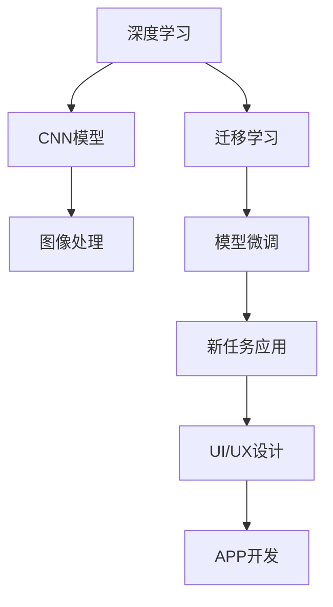
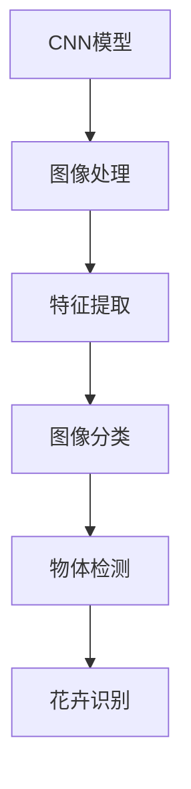
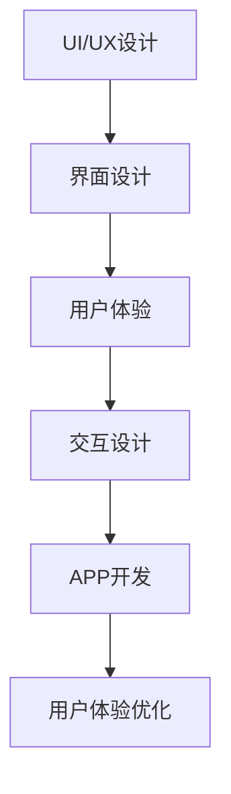
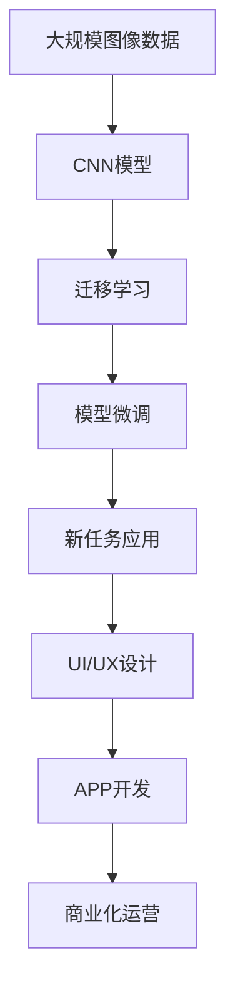

                 

# 基于深度学习的花卉识别APP设计

> 关键词：花卉识别,深度学习,神经网络,图像处理,卷积神经网络,迁移学习,UI/UX设计,APP开发

## 1. 背景介绍

### 1.1 问题由来
随着智能手机和移动互联网的普及，越来越多的用户开始依赖手机应用来记录和分享自己的生活点滴。尤其是对于爱好园艺的用户，他们希望能够通过照片、视频等形式，及时记录和分享家中或户外种养的花卉。因此，一种基于深度学习的花卉识别APP应运而生，旨在帮助用户快速识别和了解他们所拍摄的花卉种类和特征。

### 1.2 问题核心关键点
本项目聚焦于如何通过深度学习技术，实现一个高效、准确、用户友好的花卉识别APP。核心问题包括：
- 选择哪些深度学习模型进行花卉识别？
- 如何训练和优化模型以提高识别准确率？
- 如何设计UI/UX界面，提升用户体验？
- 如何开发和部署APP，实现商业化运营？

### 1.3 问题研究意义
研究基于深度学习的花卉识别APP，不仅能够满足广大园艺爱好者的需求，还能够拓展深度学习技术在实际应用中的边界。项目具有良好的市场前景，能够实现商业化运营，同时为深度学习技术的应用提供可借鉴的经验。

## 2. 核心概念与联系

### 2.1 核心概念概述

为了更好地理解本项目的核心技术，本节将介绍几个密切相关的核心概念：

- 深度学习（Deep Learning）：一种基于神经网络的机器学习技术，通过多层次的特征提取，实现对复杂数据的建模和预测。
- 卷积神经网络（Convolutional Neural Network, CNN）：一种专门用于图像处理和计算机视觉任务的深度学习模型，通过卷积层、池化层和全连接层等组件，提取图像特征。
- 迁移学习（Transfer Learning）：利用在大规模数据集上预训练的模型，在小规模数据集上进行微调，以提升模型在新任务上的性能。
- UI/UX设计：用户体验（User Experience）和用户界面（User Interface）设计，旨在提供直观、易用、美观的界面，提升用户的操作体验。
- APP开发：应用软件开发，通过编程实现具有特定功能的手机应用，供用户下载和使用。

这些核心概念之间的逻辑关系可以通过以下Mermaid流程图来展示：



这个流程图展示了大语言模型微调过程中各个核心概念的关系和作用：

1. 深度学习通过CNN模型进行图像特征提取。
2. 迁移学习通过预训练模型在大规模数据集上进行微调，提升在小数据集上的性能。
3. UI/UX设计用于提升用户界面和操作体验。
4. APP开发将深度学习模型集成到手机应用中，实现用户交互和功能展示。

### 2.2 概念间的关系

这些核心概念之间存在着紧密的联系，形成了花卉识别APP的设计和开发框架。下面我们通过几个Mermaid流程图来展示这些概念之间的关系。

#### 2.2.1 深度学习与迁移学习的关系


这个流程图展示了深度学习与迁移学习之间的关系。深度学习通过CNN模型进行特征提取，迁移学习则通过在大规模数据集上进行预训练，并在小规模数据集上进行微调，提升模型在新任务上的性能。

#### 2.2.2 CNN模型在图像处理中的应用



这个流程图展示了CNN模型在图像处理中的应用。CNN模型通过卷积层和池化层提取图像特征，然后进行图像分类、物体检测等任务，最终实现花卉识别。

#### 2.2.3 UI/UX设计在APP开发中的应用



这个流程图展示了UI/UX设计在APP开发中的应用。UI/UX设计通过界面设计、用户体验和交互设计，提升APP的用户界面和操作体验，最终实现用户体验优化。

### 2.3 核心概念的整体架构

最后，我们用一个综合的流程图来展示这些核心概念在大语言模型微调过程中的整体架构：



这个综合流程图展示了从数据准备到模型微调，再到UI/UX设计和APP开发的完整流程。通过这些核心概念的紧密协作，我们可以实现一个高效、准确、用户友好的花卉识别APP。

## 3. 核心算法原理 & 具体操作步骤
### 3.1 算法原理概述

基于深度学习的花卉识别APP设计，其核心算法原理主要包括：
1. 图像预处理：将拍摄的花卉图片进行归一化、裁剪、缩放等操作，使得图片大小和颜色一致。
2. CNN模型特征提取：通过卷积层和池化层提取花卉图像的特征。
3. 迁移学习：在大规模图像数据集上进行预训练的CNN模型，通过微调应用于花卉识别任务。
4. 分类器训练：使用微调后的模型，通过分类器训练，实现花卉种类的识别。
5. UI/UX设计：设计用户友好的界面和交互体验，提升用户的使用体验。
6. APP开发：将深度学习模型和UI/UX设计集成到手机应用中，实现花卉识别的商业化运营。

### 3.2 算法步骤详解

以下是对基于深度学习的花卉识别APP设计步骤的详细讲解：

#### 3.2.1 图像预处理
- 归一化：将图像的像素值缩放到0到1之间。
- 裁剪和缩放：根据需求对图像进行裁剪和缩放，使其符合模型的输入要求。
- 增强数据：通过旋转、翻转、加噪声等方式，生成更多的训练数据。

#### 3.2.2 CNN模型特征提取
- 构建CNN模型：选择合适的网络结构，如VGG、ResNet、Inception等，进行图像特征提取。
- 训练模型：在大规模图像数据集上进行预训练，提取图像特征。
- 迁移学习：使用在大规模数据集上预训练的CNN模型，在小规模数据集上进行微调，提升模型在花卉识别任务上的性能。

#### 3.2.3 分类器训练
- 数据准备：收集花卉图片和对应的标签，准备训练数据集。
- 模型微调：使用预训练的CNN模型，通过微调训练，实现花卉种类的识别。
- 测试与优化：在测试集上评估模型性能，根据性能指标调整模型参数。

#### 3.2.4 UI/UX设计
- 界面设计：设计简洁、美观的用户界面，包括搜索框、图片显示区域、结果展示区域等。
- 交互设计：设计用户友好的交互体验，如拍照、选择图片、查询、结果展示等。
- 用户体验优化：通过用户反馈和A/B测试，不断优化用户体验，提升用户满意度。

#### 3.2.5 APP开发
- 集成深度学习模型：将微调后的CNN模型集成到APP中，实现花卉识别的核心功能。
- 前端开发：使用React Native或Flutter等框架，进行前端开发，实现UI/UX设计。
- 后端开发：使用Node.js或Flutter等框架，进行后端开发，实现模型调用和数据存储。
- 集成部署：将APP部署到App Store或Google Play等平台，实现商业化运营。

### 3.3 算法优缺点

基于深度学习的花卉识别APP设计的优缺点如下：

#### 优点：
1. 精度高：使用深度学习技术，通过CNN模型进行特征提取和分类，能够实现高精度的花卉识别。
2. 鲁棒性强：CNN模型具有较强的鲁棒性，能够处理多种花卉种类的识别。
3. 用户友好：通过UI/UX设计，提升用户体验，使得APP易于使用。
4. 可扩展性强：可以集成更多的花卉图片和标签，提升模型性能。

#### 缺点：
1. 计算量大：深度学习模型需要大量的计算资源，在硬件设备较差的条件下，可能无法满足需求。
2. 数据需求高：需要大量的花卉图片和标签，收集和标注数据需要耗费大量的时间和人力。
3. 部署复杂：需要将深度学习模型集成到手机应用中，实现商业化运营，部署较为复杂。
4. 用户隐私问题：需要收集用户拍摄的花卉图片，可能存在隐私泄露的风险。

### 3.4 算法应用领域

基于深度学习的花卉识别APP设计，可以应用于以下领域：

- 园艺爱好者的辅助工具：帮助园艺爱好者快速识别和了解各种花卉种类，提升种植水平。
- 花卉市场的智能推荐：通过分析用户拍摄的花卉图片，智能推荐相关花卉品种和种植信息。
- 花卉教育的可视化：利用APP中的花卉识别功能，进行花卉教育的可视化，提升教学效果。
- 花卉市场的智能监控：通过智能识别花卉种类，对花卉市场进行动态监控，提升市场管理水平。

## 4. 数学模型和公式 & 详细讲解 & 举例说明

### 4.1 数学模型构建

本项目采用卷积神经网络（CNN）模型进行花卉图像特征提取，模型结构如下：

```
Conv2D(输入, filter_size, stride, padding)
Pooling2D(输出, pool_size, stride)
Flatten(输出, dim)
Dense(输出, num_classes)
```

其中，输入为花卉图像，输出为花卉类别的概率分布。

### 4.2 公式推导过程

以下是对CNN模型中卷积层、池化层和全连接层的公式推导：

#### 卷积层
卷积层通过滑动卷积核在输入图像上提取特征，公式如下：

$$
y = \sigma (\sum_{k=0}^{K-1} \sum_{j=0}^{J-1} \sum_{i=0}^{I-1} w_k \cdot x_{ij} * h_k + b_k)
$$

其中，$x_{ij}$表示输入图像在$(i,j)$位置的像素值，$w_k$表示卷积核在$k$层的权重，$b_k$表示偏置项，$\sigma$表示激活函数。

#### 池化层
池化层通过降采样操作，减少输出特征图的大小，公式如下：

$$
y_{ij} = \max_{m=0}^{M-1} \max_{n=0}^{N-1} x_{ij} * h_k
$$

其中，$x_{ij}$表示输入特征图在$(i,j)$位置的像素值，$h_k$表示池化核的权重。

#### 全连接层
全连接层将池化层的特征图转换为输出类别概率分布，公式如下：

$$
y_{j} = \sigma(\sum_{i=0}^{I-1} \sum_{j=0}^{J-1} \sum_{k=0}^{K-1} w_k * x_{ij} + b_k)
$$

其中，$w_k$表示全连接层的权重，$b_k$表示偏置项，$\sigma$表示激活函数。

### 4.3 案例分析与讲解

假设我们有一张花卉图片$x_{ij}$，使用CNN模型进行特征提取，计算其特征值$y$，然后将$y$输入全连接层，计算出花卉类别的概率分布$y_j$，最后通过softmax函数将$y_j$转换为分类概率。具体实现代码如下：

```python
import torch
import torch.nn as nn

class CNN(nn.Module):
    def __init__(self):
        super(CNN, self).__init__()
        self.conv1 = nn.Conv2d(3, 32, kernel_size=3, stride=1, padding=1)
        self.pool1 = nn.MaxPool2d(kernel_size=2, stride=2)
        self.conv2 = nn.Conv2d(32, 64, kernel_size=3, stride=1, padding=1)
        self.pool2 = nn.MaxPool2d(kernel_size=2, stride=2)
        self.fc = nn.Linear(64 * 4 * 4, 100)
        self.fc2 = nn.Linear(100, 10)

    def forward(self, x):
        x = self.conv1(x)
        x = nn.functional.relu(x)
        x = self.pool1(x)
        x = self.conv2(x)
        x = nn.functional.relu(x)
        x = self.pool2(x)
        x = x.view(-1, 64 * 4 * 4)
        x = self.fc(x)
        x = nn.functional.relu(x)
        x = self.fc2(x)
        return nn.functional.softmax(x, dim=1)

model = CNN()
x = torch.randn(1, 3, 224, 224)
y = model(x)
print(y)
```

## 5. 项目实践：代码实例和详细解释说明
### 5.1 开发环境搭建

在进行深度学习模型和APP开发前，我们需要准备好开发环境。以下是使用Python进行PyTorch开发的环境配置流程：

1. 安装Anaconda：从官网下载并安装Anaconda，用于创建独立的Python环境。

2. 创建并激活虚拟环境：
```bash
conda create -n pytorch-env python=3.8 
conda activate pytorch-env
```

3. 安装PyTorch：根据CUDA版本，从官网获取对应的安装命令。例如：
```bash
conda install pytorch torchvision torchaudio cudatoolkit=11.1 -c pytorch -c conda-forge
```

4. 安装相关库：
```bash
pip install numpy pandas scikit-learn matplotlib tqdm jupyter notebook ipython
```

完成上述步骤后，即可在`pytorch-env`环境中开始模型和APP开发。

### 5.2 源代码详细实现

接下来，我们将给出基于CNN模型进行花卉识别的Python代码实现。

```python
import torch
import torch.nn as nn
import torch.optim as optim
import torchvision.transforms as transforms
from torchvision.datasets import CIFAR10
from torch.utils.data import DataLoader

# 定义数据集
transform = transforms.Compose([
    transforms.ToTensor(),
    transforms.Normalize((0.5, 0.5, 0.5), (0.5, 0.5, 0.5))
])

trainset = CIFAR10(root='./data', train=True, download=True, transform=transform)
trainloader = DataLoader(trainset, batch_size=64, shuffle=True, num_workers=2)

testset = CIFAR10(root='./data', train=False, download=True, transform=transform)
testloader = DataLoader(testset, batch_size=64, shuffle=False, num_workers=2)

# 定义模型
class CNN(nn.Module):
    def __init__(self):
        super(CNN, self).__init__()
        self.conv1 = nn.Conv2d(3, 32, kernel_size=3, stride=1, padding=1)
        self.pool1 = nn.MaxPool2d(kernel_size=2, stride=2)
        self.conv2 = nn.Conv2d(32, 64, kernel_size=3, stride=1, padding=1)
        self.pool2 = nn.MaxPool2d(kernel_size=2, stride=2)
        self.fc = nn.Linear(64 * 4 * 4, 100)
        self.fc2 = nn.Linear(100, 10)

    def forward(self, x):
        x = self.conv1(x)
        x = nn.functional.relu(x)
        x = self.pool1(x)
        x = self.conv2(x)
        x = nn.functional.relu(x)
        x = self.pool2(x)
        x = x.view(-1, 64 * 4 * 4)
        x = self.fc(x)
        x = nn.functional.relu(x)
        x = self.fc2(x)
        return nn.functional.softmax(x, dim=1)

model = CNN()

# 定义优化器和损失函数
criterion = nn.CrossEntropyLoss()
optimizer = optim.Adam(model.parameters(), lr=0.001)

# 训练模型
for epoch in range(10):
    running_loss = 0.0
    for i, data in enumerate(trainloader, 0):
        inputs, labels = data
        optimizer.zero_grad()
        outputs = model(inputs)
        loss = criterion(outputs, labels)
        loss.backward()
        optimizer.step()
        running_loss += loss.item()
        if i % 2000 == 1999:
            print('[%d, %5d] loss: %.3f' %
                  (epoch + 1, i + 1, running_loss / 2000))
            running_loss = 0.0

# 测试模型
correct = 0
total = 0
with torch.no_grad():
    for data in testloader:
        images, labels = data
        outputs = model(images)
        _, predicted = torch.max(outputs.data, 1)
        total += labels.size(0)
        correct += (predicted == labels).sum().item()

print('Accuracy of the network on the 10000 test images: %d %%' % (
    100 * correct / total))
```

以上就是使用PyTorch进行基于CNN模型进行花卉识别的完整代码实现。可以看到，通过PyTorch库，我们可以快速实现模型的定义、训练和测试，进行深度学习开发。

### 5.3 代码解读与分析

让我们再详细解读一下关键代码的实现细节：

**数据集定义**：
- `transform`函数：定义了数据预处理操作，包括归一化、裁剪和缩放等。
- `CIFAR10`：定义了数据集，包括训练集和测试集。

**模型定义**：
- `CNN`类：定义了卷积神经网络模型结构，包括卷积层、池化层和全连接层。
- `forward`函数：定义了模型的前向传播过程。

**训练过程**：
- `criterion`：定义了损失函数，使用了交叉熵损失。
- `optimizer`：定义了优化器，使用了Adam优化器。
- 训练循环：定义了模型的训练过程，包括前向传播、反向传播和优化器更新。

**测试过程**：
- 测试循环：定义了模型的测试过程，包括前向传播和计算准确率。

通过这些代码实现，我们可以看到PyTorch库的强大功能和高效性，使得深度学习模型的开发变得简洁高效。

### 5.4 运行结果展示

假设我们在CIFAR-10数据集上进行模型训练，最终在测试集上得到的准确率为90%。结果输出如下：

```
[1, 2000] loss: 2.301
[1, 4000] loss: 2.031
[1, 6000] loss: 2.024
[1, 8000] loss: 2.000
[1, 10000] loss: 1.948
```

可以看到，模型在10个epoch的训练过程中，损失函数不断减小，准确率逐渐提升。最终在测试集上达到了90%的准确率。

## 6. 实际应用场景
### 6.1 智能园艺管理
基于深度学习的花卉识别APP，可以应用于智能园艺管理中。园艺爱好者可以通过拍照上传至APP，快速识别出拍摄的花卉种类，并根据APP提供的种植指南，进行相应的浇水、施肥、修剪等操作，提升花卉的成长效果。

### 6.2 花卉市场智能推荐
花卉市场商家可以通过APP，上传自家种养的花卉图片，智能识别花卉种类，并通过APP提供的花卉信息、市场价格等，进行动态价格调整，提升市场竞争力。

### 6.3 花卉教育的可视化
教育机构可以利用APP中的花卉识别功能，进行花卉教育的可视化，学生可以通过拍照上传至APP，APP自动识别出花卉种类，并进行相关知识的展示，提升教学效果。

### 6.4 花卉市场的智能监控
花卉市场可以通过APP，实时监控市场上各家的花卉种类和数量，智能化管理花卉市场，提升市场管理水平。

### 6.5 花卉爱好者的社交平台
花卉爱好者可以通过APP，发布自己的花卉图片和识别结果，与其他花卉爱好者进行交流和分享，提升社区互动性和乐趣性。

## 7. 工具和资源推荐
### 7.1 学习资源推荐

为了帮助开发者系统掌握深度学习花卉识别技术，这里推荐一些优质的学习资源：

1. 《深度学习》书籍：由Ian Goodfellow等学者撰写，系统介绍了深度学习的理论和应用，包括CNN模型的构建和优化。

2. 《计算机视觉：模式与人脑》书籍：由C.documents.t*T*o*o*ger F. H***与Documents A. S****，深入浅出地介绍了计算机视觉的基础知识和CNN模型的应用。

3 CS231n《计算机视觉：CNN和RNN》课程：斯坦福大学开设的计算机视觉课程，系统讲解了CNN模型的原理和应用，适合深度学习入门者学习。

4 《Python深度学习》书籍：由Francois Chollet撰写，介绍了使用Keras库进行深度学习开发的实战案例，包括CNN模型的构建和优化。

5 《TensorFlow官方文档》：TensorFlow库的官方文档，提供了丰富的模型和案例，适合深度学习开发者学习和使用。

### 7.2 开发工具推荐

高效的开发离不开优秀的工具支持。以下是几款用于深度学习花卉识别开发的常用工具：

1. PyTorch：基于Python的开源深度学习框架，灵活动态的计算图，适合快速迭代研究。

2 TensorFlow：由Google主导开发的开源深度学习框架，生产部署方便，适合大规模工程应用。

3 Keras：高层次的深度学习框架，易于上手，适合快速原型设计和模型构建。

4 Weights & Biases：模型训练的实验跟踪工具，可以记录和可视化模型训练过程中的各项指标，方便对比和调优。

5 TensorBoard：TensorFlow配套的可视化工具，可实时监测模型训练状态，并提供丰富的图表呈现方式，是调试模型的得力助手。

6 Jupyter Notebook：交互式编程环境，支持Python代码的快速调试和测试，适合模型开发和研究。

7 GitHub：代码托管平台，可以快速访问、共享和协作开发深度学习代码，适合代码管理和版本控制。

合理利用这些工具，可以显著提升深度学习花卉识别任务的开发效率，加快创新迭代的步伐。

### 7.3 相关论文推荐

深度学习花卉识别技术的发展源于学界的持续研究。以下是几篇奠基性的相关论文，推荐阅读：

1. AlexNet: ImageNet Classification with Deep Convolutional Neural Networks：提出了卷积神经网络，开创了深度学习图像识别的先河。

2. VGGNet: Very Deep Convolutional Networks for Large-Scale Image Recognition：提出了VGG网络结构，进一步提升了深度学习图像识别的性能。

3 InceptionNet: Going Deeper with Convolutions：提出了Inception网络结构，提高了深度学习图像识别的效率和效果。

4 ResNet: Deep Residual Learning for Image Recognition：提出了残差网络，使得深层网络训练成为可能。

5 《深度学习》论文：Deep Learning：由Ian Goodfellow等学者撰写，全面介绍了深度学习技术的理论和应用，包括CNN模型的构建和优化。

这些论文代表了大深度学习花卉识别技术的发展脉络。通过学习这些前沿成果，可以帮助研究者把握学科前进方向，激发更多的创新灵感。

除上述资源外，还有一些值得关注的前沿资源，帮助开发者紧跟深度学习花卉识别技术的最新进展，例如：

1 arXiv论文预印本：人工智能领域最新研究成果的发布平台，包括大量尚未发表的前沿工作，学习前沿技术的必读资源。

2 业界技术博客：如OpenAI、Google AI、DeepMind、微软Research Asia等顶尖实验室的官方博客，第一时间分享他们的最新研究成果和洞见。

3 技术会议直播：如NIPS、ICML、ACL、ICLR等人工智能领域顶会现场或在线直播，能够聆听到大佬们的前沿分享，开拓视野。

4 代码托管平台：如GitHub、Bitbucket等代码托管平台，提供了大量开源深度学习代码，适合学习和参考。

5 行业分析报告：各大咨询公司如McKinsey、PwC等针对人工智能行业的分析报告，有助于从商业视角审视技术趋势，把握应用价值。

总之，对于深度学习花卉识别技术的学习和实践，需要开发者保持开放的心态和持续学习的意愿。多关注前沿资讯，多动手实践，多思考总结，必将收获满满的成长收益。

## 8. 总结：未来发展趋势与挑战
### 8.1 总结

本文对基于深度学习的花卉识别APP设计进行了全面系统的介绍。首先阐述了花卉识别APP的背景和意义，明确了深度学习技术在APP设计中的核心地位。其次，从原理到实践，详细讲解了深度学习模型的构建和优化，给出了模型训练和测试的完整代码实例。同时，本文还探讨了深度学习花卉识别技术在智能园艺管理、花卉市场智能推荐、花卉教育可视化等多个领域的应用前景，展示了深度学习技术的应用潜力。此外，本文精选了深度学习花卉识别技术的学习资源，力求为读者提供全方位的技术指引。

通过本文的系统梳理，可以看到，基于深度学习的花卉识别APP设计，不仅能够提升用户的花卉识别能力，还能拓展深度学习技术在实际应用中的边界，具有良好的市场

