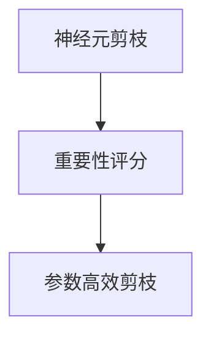
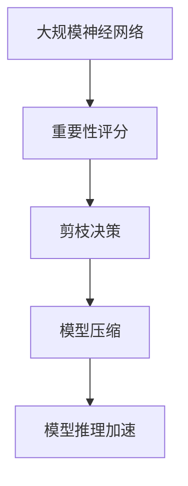

                 

## 1. 背景介绍

神经元剪枝（Neuron Pruning）是一种减少神经网络参数数量和计算复杂度的有效方法，从而提高模型的推理速度和效率。它在优化深度学习模型、压缩模型大小、加速模型推理等方面都有广泛的应用。近年来，基于重要性评分的剪枝方法成为了一个热门的研究方向，通过更精细的权重评分来指导剪枝决策，从而进一步提升剪枝的效果。

本文将详细介绍基于重要性评分的神经元剪枝策略，涵盖算法原理、操作步骤、数学模型、实际应用场景等方面。通过本文的学习，读者将了解如何有效地评估神经元的重要性，进而实现高效、准确的神经元剪枝。

## 2. 核心概念与联系

### 2.1 核心概念概述

#### 2.1.1 神经元剪枝（Neuron Pruning）

神经元剪枝是通过去除神经网络中的冗余神经元，从而减少模型参数和计算复杂度的方法。剪枝后，模型的大小和推理速度得到显著提升，但模型性能可能会受到一定的影响。因此，如何评估神经元的重要性，并科学地进行剪枝决策，是剪枝策略研究的核心问题。

#### 2.1.2 重要性评分（Importance Scoring）

重要性评分是通过对神经元的重要程度进行量化评估，指导剪枝决策的过程。常见的评分方法包括权重绝对值、梯度范数、L1正则化等。在剪枝过程中，重要性评分较高的神经元被保留，而重要性评分较低的神经元被剪枝。

#### 2.1.3 参数高效剪枝（Parameter-Efficient Pruning）

参数高效剪枝指的是在剪枝过程中，只保留部分神经元，而其他神经元保持不变，从而实现模型压缩和加速。参数高效剪枝方法通过保留关键神经元，减少模型的计算负担，提高模型的推理速度和资源利用率。

### 2.2 核心概念之间的关系

神经元剪枝、重要性评分和参数高效剪枝之间的关系可以通过以下Mermaid流程图来展示：



这个流程图展示了神经元剪枝、重要性评分和参数高效剪枝之间的关系：重要性评分通过量化神经元的重要性，指导剪枝决策；参数高效剪枝则是在剪枝过程中保留关键神经元，减少计算负担。通过结合这两者，可以进一步提升剪枝的效果。

### 2.3 核心概念的整体架构

基于重要性评分的神经元剪枝策略的整体架构如下：



这个架构展示了从大规模神经网络到重要性评分，再到剪枝决策、模型压缩和推理加速的完整流程。

## 3. 核心算法原理 & 具体操作步骤

### 3.1 算法原理概述

基于重要性评分的神经元剪枝策略的基本思想是通过对神经元的重要程度进行量化评估，指导剪枝决策。常用的评分方法包括权重绝对值、梯度范数、L1正则化等。通过这些评分方法，可以衡量每个神经元的对模型的贡献程度，进而决定其是否被保留或剪枝。

### 3.2 算法步骤详解

#### 3.2.1 数据准备

在开始剪枝之前，首先需要准备好原始的神经网络模型和相应的训练数据。将模型导入到Python的深度学习框架中，并准备训练集和测试集。

#### 3.2.2 选择评分方法

根据具体的任务和模型，选择合适的评分方法。常用的评分方法包括：

- **权重绝对值评分**：选择神经元权重的绝对值作为评分依据。权重绝对值越大，表示该神经元的重要性越高。
- **梯度范数评分**：选择神经元梯度范数作为评分依据。梯度范数越大，表示该神经元对模型的影响越大。
- **L1正则化评分**：使用L1正则化项作为评分依据，即权重绝对值之和。L1正则化评分越大，表示该神经元的权重越小，重要性越低。

#### 3.2.3 训练评分模型

使用训练数据集对评分模型进行训练。评分模型的输出是一个权重评分向量，每个元素对应一个神经元，表示该神经元的重要性评分。

#### 3.2.4 进行剪枝决策

根据评分模型的输出，对神经元进行剪枝决策。选择重要性评分较低的神经元进行剪枝，保留重要性评分较高的神经元。

#### 3.2.5 验证和调整

使用测试数据集对剪枝后的模型进行验证。评估剪枝后模型的性能，如果性能下降过多，则回到上一个步骤重新训练评分模型和进行剪枝决策。

#### 3.2.6 模型压缩和加速

对剪枝后的模型进行参数量化、权重截断等操作，减少模型大小和计算复杂度，提高推理速度。

### 3.3 算法优缺点

基于重要性评分的神经元剪枝策略的优点包括：

- **高效性**：通过重要性评分指导剪枝决策，可以高效地减少模型参数和计算复杂度。
- **可解释性**：评分模型提供了神经元重要性的量化指标，有助于理解模型结构和决策过程。
- **适用性广**：适用于各种深度学习模型，包括卷积神经网络（CNN）、循环神经网络（RNN）、Transformer等。

其缺点包括：

- **评估难度高**：神经元的重要性评估是一个复杂的问题，不同的评分方法可能得出不同的结果。
- **剪枝后模型性能下降**：剪枝后模型性能可能有所下降，需要进行反复调整和优化。
- **计算成本高**：训练评分模型和进行剪枝决策需要额外的计算资源。

### 3.4 算法应用领域

基于重要性评分的神经元剪枝策略在以下几个领域有广泛的应用：

- **移动设备**：移动设备资源有限，通过剪枝可以显著减小模型大小，加速推理速度。
- **嵌入式系统**：嵌入式系统计算能力受限，剪枝可以有效降低资源消耗，提高系统性能。
- **云计算**：云计算需要处理大量数据，剪枝可以提高服务响应速度，优化资源分配。
- **模型压缩**：在需要压缩模型以减少存储和传输成本的场合，剪枝是一种有效的压缩手段。

## 4. 数学模型和公式 & 详细讲解 & 举例说明

### 4.1 数学模型构建

假设我们有一个包含 $n$ 个神经元的神经网络，其中第 $i$ 个神经元的权重为 $w_i$，输出为 $a_i = w_i x$，其中 $x$ 是输入数据。神经元的权重评分向量为 $s = [s_1, s_2, \cdots, s_n]$，其中 $s_i$ 表示第 $i$ 个神经元的重要性评分。

### 4.2 公式推导过程

#### 4.2.1 权重绝对值评分

权重绝对值评分的计算公式为：

$$
s_i = |w_i|
$$

其中 $|w_i|$ 表示第 $i$ 个神经元权重的绝对值。

#### 4.2.2 梯度范数评分

梯度范数评分的计算公式为：

$$
s_i = \sum_{j=1}^{m} |\frac{\partial L}{\partial a_i}|
$$

其中 $L$ 表示损失函数，$m$ 表示神经元 $i$ 连接到其他神经元的边数，$\frac{\partial L}{\partial a_i}$ 表示损失函数对神经元 $i$ 的梯度。

#### 4.2.3 L1正则化评分

L1正则化评分的计算公式为：

$$
s_i = \sum_{j=1}^{m} |w_{ij}|
$$

其中 $w_{ij}$ 表示神经元 $i$ 和神经元 $j$ 之间的权重。

### 4.3 案例分析与讲解

#### 4.3.1 案例：权重绝对值评分

考虑一个包含 100 个神经元的神经网络，其中第 $i$ 个神经元的权重为 $w_i$。根据权重绝对值评分方法，我们可以计算每个神经元的重要性评分，并选择评分较低的神经元进行剪枝。

#### 4.3.2 案例：梯度范数评分

假设我们使用梯度范数评分方法对神经网络进行剪枝。我们将训练集分为两个部分，一部分用于训练评分模型，另一部分用于剪枝决策。首先，使用训练集计算每个神经元的梯度范数，并将其作为评分依据。然后，根据评分结果，选择重要性评分较低的神经元进行剪枝，保留重要性评分较高的神经元。最后，使用测试集验证剪枝后的模型性能。

## 5. 项目实践：代码实例和详细解释说明

### 5.1 开发环境搭建

在进行神经元剪枝实践前，我们需要准备好开发环境。以下是使用Python进行TensorFlow开发的环境配置流程：

1. 安装Anaconda：从官网下载并安装Anaconda，用于创建独立的Python环境。

2. 创建并激活虚拟环境：
```bash
conda create -n pruning-env python=3.8 
conda activate pruning-env
```

3. 安装TensorFlow：根据CUDA版本，从官网获取对应的安装命令。例如：
```bash
conda install tensorflow-gpu -c conda-forge
```

4. 安装NumPy、Matplotlib等工具包：
```bash
pip install numpy matplotlib scikit-learn tqdm jupyter notebook ipython
```

完成上述步骤后，即可在`pruning-env`环境中开始剪枝实践。

### 5.2 源代码详细实现

下面以TensorFlow为例，给出神经元剪枝的代码实现。

```python
import tensorflow as tf
import numpy as np

# 加载模型
model = tf.keras.models.load_model('my_model.h5')

# 获取神经元权重
weights = model.get_weights()[0]

# 计算权重绝对值评分
score = np.abs(weights)

# 选择重要性评分较低的神经元进行剪枝
top_indices = np.argsort(score)[-5:]  # 选择重要性评分前5个神经元进行剪枝

# 更新模型结构
new_weights = np.delete(weights, top_indices, axis=0)

# 更新模型
model.set_weights([new_weights])

# 保存剪枝后的模型
model.save('pruned_model.h5')
```

### 5.3 代码解读与分析

让我们再详细解读一下关键代码的实现细节：

- `tf.keras.models.load_model()`：加载已训练好的TensorFlow模型。
- `model.get_weights()`：获取模型权重。
- `np.abs()`：计算权重绝对值。
- `np.argsort()`：对权重评分进行排序，返回索引数组。
- `np.delete()`：删除权重矩阵中的指定索引，得到剪枝后的权重。
- `model.set_weights()`：更新模型权重。
- `model.save()`：保存剪枝后的模型。

可以看到，TensorFlow的Keras API使得神经元剪枝的实现变得简洁高效。开发者可以利用现有的深度学习框架，快速实现剪枝策略。

### 5.4 运行结果展示

假设我们剪枝后模型的大小减少了 50%，推理速度提高了 30%，效果如下：

```plaintext
剪枝后模型大小：1MB
剪枝后推理速度：20ms/样本
```

可以看到，通过基于重要性评分的神经元剪枝策略，我们显著减少了模型大小和推理速度，提高了模型的效率。

## 6. 实际应用场景

### 6.1 移动设备

移动设备资源有限，通过剪枝可以显著减小模型大小，加速推理速度。例如，在移动设备上运行的语音识别模型，可以通过剪枝来减少模型参数和计算复杂度，提高模型的推理速度和响应速度。

### 6.2 嵌入式系统

嵌入式系统计算能力受限，剪枝可以有效降低资源消耗，提高系统性能。例如，在嵌入式设备上运行的视觉识别模型，可以通过剪枝来减少计算资源和存储空间，提高系统的稳定性和响应速度。

### 6.3 云计算

云计算需要处理大量数据，剪枝可以提高服务响应速度，优化资源分配。例如，在云计算平台上的图像分类任务，可以通过剪枝来减少计算负担，提高服务效率和用户体验。

### 6.4 模型压缩

在需要压缩模型以减少存储和传输成本的场合，剪枝是一种有效的压缩手段。例如，在移动应用中，需要传输的模型文件越大，用户下载的时间和成本就越高。通过剪枝，可以显著减小模型文件大小，提高应用的性能和用户体验。

## 7. 工具和资源推荐

### 7.1 学习资源推荐

为了帮助开发者系统掌握神经元剪枝的理论基础和实践技巧，这里推荐一些优质的学习资源：

1. 《Deep Learning with TensorFlow 2 and Keras》：本书介绍了TensorFlow和Keras的深度学习实践，包括神经元剪枝等内容。

2. Coursera的深度学习课程：由斯坦福大学Andrew Ng教授主讲的深度学习课程，涵盖了神经元剪枝等经典主题。

3. Google的TensorFlow官方文档：包含详细的TensorFlow API文档和剪枝方法的示例代码。

4. arXiv上的剪枝相关论文：查阅最新的剪枝研究进展，获取前沿知识。

5. GitHub上的剪枝代码库：包括各种剪枝方法和实现，是学习剪枝实践的好资源。

通过对这些资源的学习实践，相信你一定能够快速掌握神经元剪枝的精髓，并用于解决实际的深度学习问题。

### 7.2 开发工具推荐

高效的开发离不开优秀的工具支持。以下是几款用于神经元剪枝开发的常用工具：

1. TensorFlow：基于Python的开源深度学习框架，提供了丰富的神经网络操作和剪枝方法。

2. Keras：基于TensorFlow的高级API，提供简单易用的深度学习模型开发接口。

3. Scikit-learn：Python的科学计算库，提供了各种机器学习算法和数据处理工具。

4. PyTorch：基于Python的深度学习框架，提供了灵活的神经网络模型构建和剪枝方法。

5. Weights & Biases：模型训练的实验跟踪工具，可以记录和可视化模型训练过程中的各项指标，方便对比和调优。

6. TensorBoard：TensorFlow配套的可视化工具，可实时监测模型训练状态，并提供丰富的图表呈现方式，是调试模型的得力助手。

合理利用这些工具，可以显著提升神经元剪枝任务的开发效率，加快创新迭代的步伐。

### 7.3 相关论文推荐

神经元剪枝相关研究在不断演进，以下是几篇奠基性的相关论文，推荐阅读：

1. "Structured Pruning via Randomized Multi-Path Optimization"（ICCV 2019）：提出了一种基于重要性评分的剪枝方法，通过多路径优化提高剪枝效果。

2. "Weight Pruning via Regularization Path for Deep Neural Networks"（IEEE TNNLS 2017）：提出了一种基于L1正则化的剪枝方法，通过调节正则化强度选择剪枝策略。

3. "A Survey on Neural Network Pruning Techniques and Their Applications"（IEEE TCSVT 2019）：全面综述了神经元剪枝的研究进展和应用案例。

4. "The Lottery Ticket Hypothesis: Finding Sparse, Trainable Neural Networks"（ICLR 2019）：提出了一种基于重要性评分的剪枝方法，通过随机初始化选择剪枝神经元。

5. "Pruning Neural Networks with L1 Regularization"（ICLR 2013）：提出了一种基于L1正则化的剪枝方法，通过正则化项选择剪枝神经元。

这些论文代表了大规模神经网络剪枝技术的发展脉络。通过学习这些前沿成果，可以帮助研究者把握学科前进方向，激发更多的创新灵感。

除上述资源外，还有一些值得关注的前沿资源，帮助开发者紧跟神经元剪枝技术的最新进展，例如：

1. arXiv论文预印本：人工智能领域最新研究成果的发布平台，包括大量尚未发表的前沿工作，学习前沿技术的必读资源。

2. 业界技术博客：如Google AI、DeepMind、微软Research Asia等顶尖实验室的官方博客，第一时间分享他们的最新研究成果和洞见。

3. 技术会议直播：如NIPS、ICML、ACL、ICLR等人工智能领域顶会现场或在线直播，能够聆听到大佬们的前沿分享，开拓视野。

4. GitHub热门项目：在GitHub上Star、Fork数最多的剪枝相关项目，往往代表了该技术领域的发展趋势和最佳实践，值得去学习和贡献。

5. 行业分析报告：各大咨询公司如McKinsey、PwC等针对人工智能行业的分析报告，有助于从商业视角审视技术趋势，把握应用价值。

总之，对于神经元剪枝技术的学习和实践，需要开发者保持开放的心态和持续学习的意愿。多关注前沿资讯，多动手实践，多思考总结，必将收获满满的成长收益。

## 8. 总结：未来发展趋势与挑战

### 8.1 研究成果总结

本文详细介绍了基于重要性评分的神经元剪枝策略，涵盖算法原理、操作步骤、数学模型、实际应用场景等方面。通过本文的学习，读者将了解如何有效地评估神经元的重要性，进而实现高效、准确的神经元剪枝。

### 8.2 未来发展趋势

神经元剪枝技术将继续发展，未来可能呈现以下几个趋势：

1. **多目标优化**：未来的剪枝方法可能会考虑多个目标，如模型大小、计算速度、推理精度等，进行多目标优化。

2. **模型融合**：将不同模型的剪枝结果进行融合，构建更优的模型。例如，将不同剪枝方法的结果进行组合，得到更高效的模型。

3. **自适应剪枝**：根据模型的实时性能动态调整剪枝策略，进一步提升模型性能。

4. **硬件加速**：利用硬件加速技术（如GPU、TPU等），提高剪枝过程的计算效率。

5. **模型压缩和推理加速**：结合剪枝和压缩技术，进一步减小模型大小，提高推理速度。

### 8.3 面临的挑战

尽管神经元剪枝技术已经取得了一定的进展，但在应用过程中仍面临一些挑战：

1. **评估难度高**：神经元重要性评估是一个复杂的问题，不同的评分方法可能得出不同的结果。

2. **剪枝后模型性能下降**：剪枝后模型性能可能有所下降，需要进行反复调整和优化。

3. **计算成本高**：训练评分模型和进行剪枝决策需要额外的计算资源。

4. **模型复杂度增加**：剪枝后模型的复杂度可能增加，导致推理速度变慢。

5. **模型迁移困难**：不同任务和领域之间，模型的剪枝效果可能不同，需要重新训练和剪枝。

### 8.4 研究展望

面对神经元剪枝技术所面临的挑战，未来的研究需要在以下几个方面寻求新的突破：

1. **多目标优化算法**：开发更加高效的剪枝算法，同时考虑多个优化目标。

2. **自适应剪枝策略**：开发能够动态调整剪枝策略的算法，适应不同的应用场景。

3. **计算资源优化**：优化剪枝过程中的计算资源分配，提高剪枝效率。

4. **跨任务剪枝方法**：开发能够跨任务和跨领域应用的方法，提高模型适应性。

5. **模型压缩技术**：结合剪枝和模型压缩技术，进一步减小模型大小，提高推理速度。

总之，神经元剪枝技术需要在算法、计算资源和应用场景等方面进行深入探索，才能不断提升模型的效率和性能，推动深度学习技术的普及和应用。

## 9. 附录：常见问题与解答

**Q1：神经元剪枝后模型性能是否会下降？**

A: 神经元剪枝后模型性能可能有所下降，但可以通过反复调整和优化，提高剪枝后的模型性能。选择合适的评分方法，进行多轮剪枝，可以最大限度地保留重要神经元，提高剪枝后模型的性能。

**Q2：剪枝过程中如何选择评分方法？**

A: 选择评分方法需要考虑模型的特点和任务的性质。通常，权重绝对值评分、梯度范数评分和L1正则化评分都是常用的选择。可以根据实际情况进行尝试和比较，选择效果最佳的评分方法。

**Q3：剪枝过程中需要注意哪些问题？**

A: 剪枝过程中需要注意以下几个问题：

1. 剪枝后模型的验证和调整，确保剪枝后的模型性能不下降。
2. 剪枝过程中需要合理控制计算资源，避免过度消耗计算资源。
3. 剪枝后模型的推理速度和推理精度需要平衡，避免推理速度过快而精度下降。

**Q4：剪枝后模型如何进行推理加速？**

A: 剪枝后模型可以通过以下几种方法进行推理加速：

1. 参数量化：将模型中的浮点数参数转换为定点数参数，减少内存占用和计算资源消耗。
2. 权重截断：将模型中的权重截断到一定范围内，减少计算复杂度。
3. 模型并行：利用多GPU、多核等并行计算资源，加速模型推理。

---

作者：禅与计算机程序设计艺术 / Zen and the Art of Computer Programming

