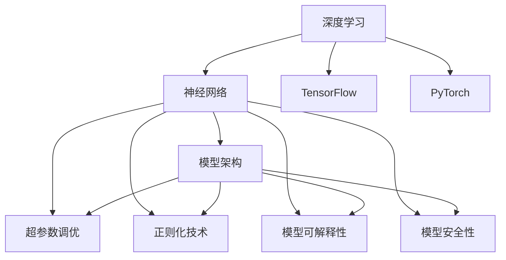
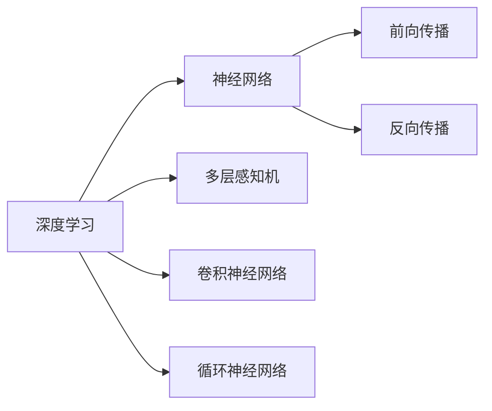
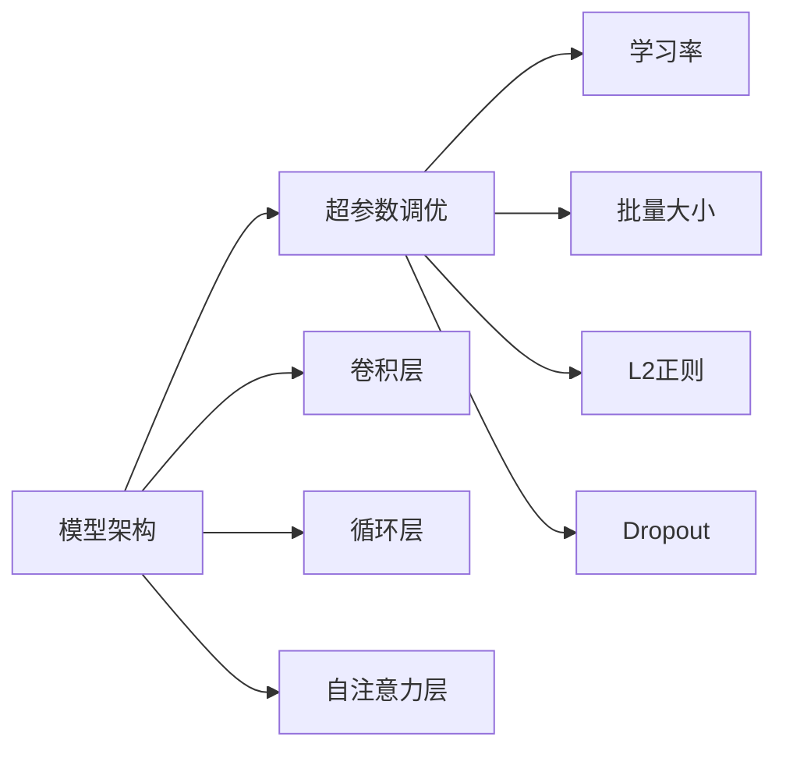
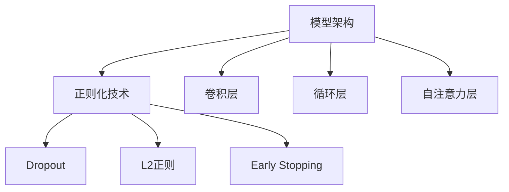
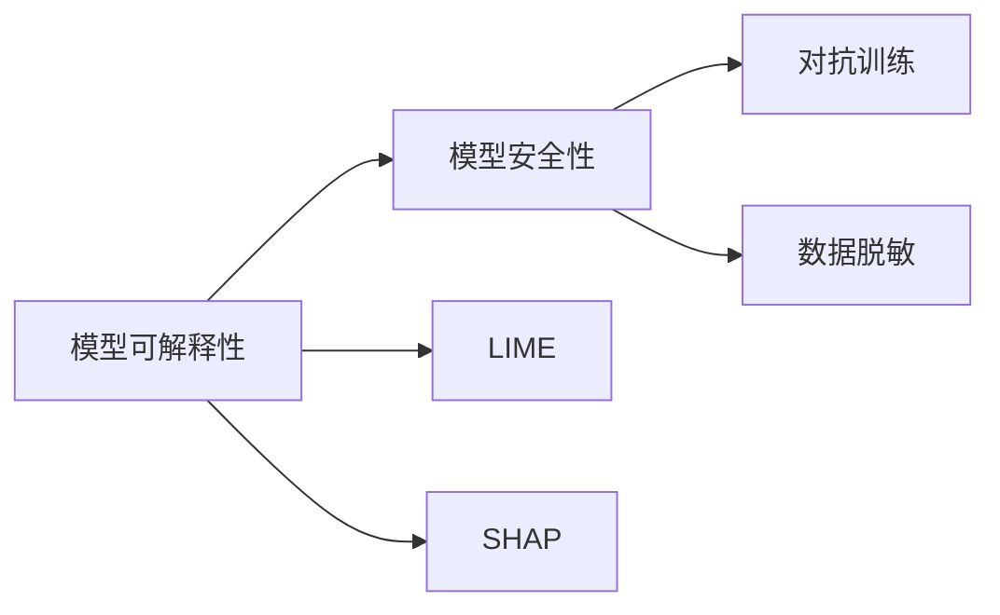
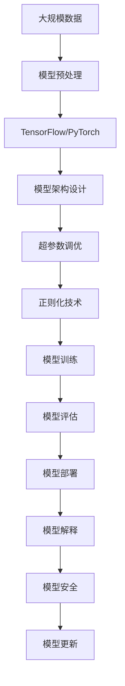

                 

# 基础模型的专业规范与科学精神

> 关键词：基础模型,规范与科学精神,深度学习,神经网络,TensorFlow,PyTorch,模型架构,超参数调优,正则化技术,可解释性

## 1. 背景介绍

### 1.1 问题由来
在深度学习领域，大模型（如卷积神经网络CNN、循环神经网络RNN、Transformer等）的训练与部署已经成为日常工作中不可或缺的一部分。然而，如何确保这些模型在实际应用中表现出色，同时兼顾模型的可解释性和安全性，是一个重要的研究方向。

随着技术的不断进步，越来越多的开发者开始关注模型的专业规范和科学精神，以提高模型的可靠性和鲁棒性。本文旨在探讨大模型在深度学习中的应用，以及如何通过专业规范和科学精神，构建出更加优秀、可信赖的基础模型。

### 1.2 问题核心关键点
在深度学习中，构建基础模型时需要注意以下几个核心关键点：

- **模型架构设计**：选择适合任务特点的模型架构，如卷积、循环、自注意力等。
- **超参数调优**：选择合适的学习率、批量大小、正则化参数等超参数。
- **数据预处理**：进行数据增强、归一化、标签处理等预处理操作，提高模型泛化能力。
- **正则化技术**：使用Dropout、L2正则、Early Stopping等技术防止过拟合。
- **模型可解释性**：设计模型输出解释机制，如LIME、SHAP等，提高模型透明度。
- **模型安全性**：通过对抗训练、数据脱敏等技术保障模型安全性。

这些问题处理得当，可以构建出既高效又可靠的深度学习基础模型。本文将详细探讨这些问题，并提出具体的解决策略。

### 1.3 问题研究意义
基础模型的专业规范与科学精神是深度学习中至关重要的一环。通过对这些关键问题的深入研究，可以构建出高质量的模型，确保模型在实际应用中表现出色。具体而言，其研究意义如下：

- 提升模型性能：通过科学的方法选择架构、调优超参数、设计正则化技术等，可以显著提升模型的预测精度和鲁棒性。
- 提高模型可解释性：通过模型可解释性技术，可以更好地理解模型决策过程，促进模型部署和应用。
- 保障模型安全性：通过对抗训练和数据保护等技术，可以避免模型被恶意攻击或滥用。

## 2. 核心概念与联系

### 2.1 核心概念概述

为更好地理解基础模型的专业规范与科学精神，本节将介绍几个密切相关的核心概念：

- **深度学习**：利用神经网络结构进行数据建模和预测，主要关注模型的架构设计、训练方法和性能评估。
- **神经网络**：由多层神经元组成的计算模型，通过前向传播和反向传播实现数据的自动建模和预测。
- **TensorFlow**：由Google开发的开源深度学习框架，提供高效的模型构建和训练功能。
- **PyTorch**：由Facebook开发的开源深度学习框架，提供灵活的模型构建和高效的动态图计算。
- **模型架构**：决定神经网络结构的顶层设计，如卷积层、循环层、自注意力层等。
- **超参数调优**：选择和调整学习率、批量大小、正则化参数等关键参数，优化模型性能。
- **正则化技术**：使用Dropout、L2正则、Early Stopping等技术，防止模型过拟合。
- **模型可解释性**：通过模型输出解释机制，提高模型的透明度，便于理解模型决策过程。
- **模型安全性**：通过对抗训练、数据脱敏等技术，保障模型的安全性，防止模型被滥用。

这些核心概念之间的逻辑关系可以通过以下Mermaid流程图来展示：



这个流程图展示了大模型构建过程中各个核心概念的关系和作用：

1. 深度学习是基础，提供整体的建模框架和训练方法。
2. 神经网络是实现，由多个层组成的计算结构。
3. TensorFlow和PyTorch是工具，提供模型构建和训练的接口。
4. 模型架构决定了网络的具体结构，如卷积、循环、自注意力等。
5. 超参数调优是优化手段，通过调整关键参数优化模型性能。
6. 正则化技术是防止过拟合的手段，提高模型泛化能力。
7. 模型可解释性是透明度技术，帮助理解模型决策过程。
8. 模型安全性是保障手段，防止模型被滥用。

这些核心概念共同构成了基础模型的完整生态系统，使其能够在各种场景下发挥强大的预测和建模能力。

### 2.2 概念间的关系

这些核心概念之间存在着紧密的联系，形成了基础模型构建的完整生态系统。下面我通过几个Mermaid流程图来展示这些概念之间的关系。

#### 2.2.1 深度学习与神经网络的关系



这个流程图展示了深度学习和神经网络的基本关系。深度学习提供整体的建模框架，而神经网络是实现这一框架的具体计算结构。

#### 2.2.2 模型架构与超参数调优的关系



这个流程图展示了模型架构和超参数调优之间的关系。选择适合的模型架构，然后通过调整超参数调优，可以显著提升模型性能。

#### 2.2.3 模型架构与正则化技术的关系



这个流程图展示了模型架构和正则化技术之间的关系。选择合适的正则化技术，可以有效防止模型过拟合，提高模型泛化能力。

#### 2.2.4 模型可解释性与模型安全性的关系



这个流程图展示了模型可解释性和模型安全性的关系。通过模型可解释性技术，可以更好地理解模型决策过程，进而通过对抗训练等技术保障模型安全性。

### 2.3 核心概念的整体架构

最后，我们用一个综合的流程图来展示这些核心概念在大模型构建过程中的整体架构：



这个综合流程图展示了从数据预处理到模型更新的完整过程。大规模数据经过预处理后，在TensorFlow或PyTorch上进行模型架构设计和超参数调优，然后通过正则化技术防止过拟合，进行模型训练和评估，最后将模型部署并解释，保证模型安全性。 通过这些流程图，我们可以更清晰地理解大模型构建过程中各个核心概念的关系和作用，为后续深入讨论具体的模型构建和优化方法奠定基础。

## 3. 核心算法原理 & 具体操作步骤
### 3.1 算法原理概述

构建基础模型的核心算法原理是深度学习，其主要思想是通过构建多层神经网络，对输入数据进行非线性变换，从而学习到数据的复杂表示。模型通过前向传播和反向传播算法，不断优化网络权重，最小化损失函数，提高模型预测精度。

在深度学习中，基础模型通常包括以下几个关键步骤：

1. **数据预处理**：包括数据增强、归一化、标签处理等操作，提高数据质量和模型泛化能力。
2. **模型架构设计**：选择适合的模型架构，如卷积、循环、自注意力等，进行网络构建。
3. **超参数调优**：通过选择和调整学习率、批量大小、正则化参数等，优化模型性能。
4. **模型训练**：使用优化算法（如Adam、SGD等），最小化损失函数，更新网络权重。
5. **模型评估**：使用测试集评估模型性能，进行模型选择和调整。
6. **模型部署**：将训练好的模型部署到实际应用中，进行推理预测。

### 3.2 算法步骤详解

以下是对基础模型构建中各个步骤的详细讲解：

**Step 1: 数据预处理**

数据预处理是基础模型构建的第一步，其目的是提高数据质量和模型泛化能力。具体步骤如下：

1. **数据增强**：通过旋转、翻转、剪裁等操作，扩充训练集，提高模型鲁棒性。
2. **数据归一化**：对输入数据进行归一化处理，如均值归一化、标准化等，提高模型收敛速度。
3. **标签处理**：对标签进行编码，如独热编码、标签二值化等，方便模型处理。
4. **数据分割**：将数据集划分为训练集、验证集和测试集，进行模型评估和调优。

**Step 2: 模型架构设计**

模型架构设计是基础模型构建的核心环节，其目的是选择合适的神经网络结构，构建出适合任务的模型。具体步骤如下：

1. **选择架构**：根据任务特点选择合适的模型架构，如卷积、循环、自注意力等。
2. **构建网络**：使用TensorFlow或PyTorch等工具，构建出具体的神经网络模型。
3. **添加正则化**：在网络中添加Dropout、L2正则等正则化技术，防止过拟合。

**Step 3: 超参数调优**

超参数调优是基础模型构建的重要环节，其目的是通过调整关键参数，优化模型性能。具体步骤如下：

1. **选择超参数**：根据任务特点选择合适的超参数，如学习率、批量大小、正则化参数等。
2. **调优方法**：使用网格搜索、随机搜索、贝叶斯优化等方法，进行超参数调优。
3. **调优效果**：通过模型评估，选择最优超参数组合，进行模型部署。

**Step 4: 模型训练**

模型训练是基础模型构建的关键环节，其目的是通过优化算法，最小化损失函数，更新网络权重。具体步骤如下：

1. **选择优化器**：根据任务特点选择合适的优化器，如Adam、SGD等。
2. **设置损失函数**：根据任务类型选择合适的损失函数，如交叉熵、均方误差等。
3. **训练模型**：使用优化算法和损失函数，进行模型训练，最小化损失函数。
4. **保存模型**：训练完成后，保存模型权重和架构，便于后续使用和部署。

**Step 5: 模型评估**

模型评估是基础模型构建的重要环节，其目的是通过测试集评估模型性能，进行模型选择和调整。具体步骤如下：

1. **选择评估指标**：根据任务特点选择合适的评估指标，如精度、召回率、F1分数等。
2. **评估模型**：使用测试集评估模型性能，计算评估指标。
3. **调整模型**：根据评估结果，调整模型参数和超参数，进行模型优化。

**Step 6: 模型部署**

模型部署是将训练好的模型部署到实际应用中的关键环节，其目的是通过模型推理，实现实际应用。具体步骤如下：

1. **模型优化**：通过模型裁剪、量化等方法，优化模型推理效率。
2. **模型封装**：将模型封装成标准化服务接口，便于调用和使用。
3. **部署环境**：选择合适的部署环境，如云端、边缘设备等，进行模型部署。
4. **监控维护**：实时监控模型性能，进行维护和优化。

**Step 7: 模型解释**

模型解释是基础模型构建的重要环节，其目的是通过模型输出解释机制，提高模型透明度，便于理解模型决策过程。具体步骤如下：

1. **选择解释方法**：根据任务特点选择合适的解释方法，如LIME、SHAP等。
2. **解释模型**：使用解释方法对模型输出进行解释，生成解释结果。
3. **可视化展示**：将解释结果可视化展示，便于理解和分析。

**Step 8: 模型安全**

模型安全是基础模型构建的重要环节，其目的是通过对抗训练、数据脱敏等技术，保障模型安全性，防止模型被滥用。具体步骤如下：

1. **对抗训练**：通过引入对抗样本，提高模型鲁棒性，防止模型被攻击。
2. **数据脱敏**：对输入数据进行脱敏处理，防止数据泄露和滥用。
3. **安全审计**：定期进行安全审计，检测模型安全漏洞，进行修复和优化。

以上是基础模型构建的基本步骤，通过这些步骤，可以构建出高效、可解释、安全的深度学习模型。

### 3.3 算法优缺点

基础模型的构建过程包含多个关键环节，每个环节都有其优缺点。下面分别进行详细讲解：

**优点**：

1. **高预测精度**：通过多层次网络结构，可以实现高精度的预测和建模。
2. **高泛化能力**：通过正则化技术和数据预处理，可以提高模型的泛化能力，适应不同的数据分布。
3. **可解释性**：通过模型解释技术，可以理解模型的决策过程，提高模型的透明度。
4. **安全性**：通过对抗训练和数据脱敏等技术，可以保障模型的安全性，防止模型被滥用。

**缺点**：

1. **计算资源消耗大**：大规模数据和复杂网络结构需要大量的计算资源，可能会导致训练时间和存储成本高昂。
2. **模型复杂度高**：模型结构复杂，可能导致难以理解和调试，模型调优难度大。
3. **过拟合风险高**：复杂网络结构和高泛化能力可能导致过拟合风险高，需要选择合适的正则化技术。
4. **模型解释难度大**：模型解释技术复杂，可能导致解释结果不够准确，难以理解模型决策过程。

尽管存在这些缺点，但基础模型构建过程中通过科学的方法和专业的规范，可以显著降低模型风险，提高模型性能。

### 3.4 算法应用领域

基础模型的应用领域非常广泛，主要包括以下几个方面：

1. **图像识别**：如人脸识别、物体检测、图像分类等，通过卷积神经网络进行特征提取和分类。
2. **自然语言处理**：如机器翻译、文本分类、情感分析等，通过循环神经网络或Transformer进行语义建模和分类。
3. **时间序列预测**：如股票价格预测、天气预测、交通流量预测等，通过循环神经网络进行时间序列建模和预测。
4. **推荐系统**：如商品推荐、新闻推荐、视频推荐等，通过卷积神经网络或矩阵分解等方法进行用户行为建模和推荐。
5. **语音识别**：如语音命令识别、语音情感分析等，通过卷积神经网络或循环神经网络进行声学建模和分类。

除了上述这些应用领域，基础模型还广泛应用于医疗、金融、教育、自动驾驶等多个领域，为各行各业提供了强大的数据建模和预测能力。

## 4. 数学模型和公式 & 详细讲解  
### 4.1 数学模型构建

基础模型的构建过程涉及多个数学模型，主要包括以下几个方面：

- **卷积神经网络**：用于图像处理任务，通过卷积层、池化层等进行特征提取和分类。
- **循环神经网络**：用于序列建模任务，通过循环层、LSTM层等进行时间序列建模和预测。
- **自注意力机制**：用于处理自然语言任务，通过自注意力机制进行语义建模和分类。
- **优化算法**：如Adam、SGD等，用于最小化损失函数，更新网络权重。

这里重点介绍自注意力机制的数学模型构建和公式推导。

**自注意力机制**：
自注意力机制是Transformer模型的核心，其主要思想是通过计算输入数据的注意力权重，生成每个位置的语义表示，从而实现对输入数据的关注和理解。

假设输入序列为 $X=\{x_1, x_2, \cdots, x_n\}$，其中 $x_i$ 为输入的特征向量。自注意力机制的输出为 $Y=\{y_1, y_2, \cdots, y_n\}$，其中 $y_i$ 为输入序列 $x_i$ 的语义表示。

自注意力机制的数学模型构建如下：

1. **缩放点积注意力**：
   $$
   A_i = \text{softmax}(\frac{Q_iK_i}{\sqrt{d_k}})
   $$
   其中 $Q_i$ 和 $K_i$ 为输入序列的查询向量和键向量，$d_k$ 为向量维度。通过缩放点积注意力，可以计算出每个位置的注意力权重，实现对输入数据的关注和理解。

2. **加权求和**：
   $$
   y_i = \sum_{j=1}^n A_{ij}V_j
   $$
   其中 $V_j$ 为输入序列的值向量。通过加权求和，可以生成每个位置的语义表示。

### 4.2 公式推导过程

下面以自注意力机制为例，详细讲解公式的推导过程。

**缩放点积注意力**：
$$
A_i = \text{softmax}(\frac{Q_iK_i}{\sqrt{d_k}})
$$
其中 $Q_i$ 和 $K_i$ 为输入序列的查询向量和键向量，$d_k$ 为向量维度。通过缩放点积注意力，可以计算出每个位置的注意力权重，实现对输入数据的关注和理解。

**加权求和**：
$$
y_i = \sum_{j=1}^n A_{ij}V_j
$$
其中 $V_j$ 为输入序列的值向量。通过加权求和，可以生成每个位置的语义表示。

### 4.3 案例分析与讲解

假设我们使用自注意力机制进行自然语言处理任务，以机器翻译为例。输入序列为 $X=\{x_1, x_2, \cdots, x_n\}$，其中 $x_i$ 为输入的单词向量。输出序列为 $Y=\{y_1, y_2, \cdots, y_n\}$，其中 $y_i$ 为输入序列的翻译结果。

自注意力机制的输出为：
$$
y_i = \sum_{j=1}^n A_{ij}V_j
$$
其中 $A_{ij}$ 为输入序列的注意力权重，$V_j$ 为输入序列的值向量。

具体而言，自注意力机制通过计算输入序列的注意力权重，对输入序列的每个位置进行关注和理解，从而生成翻译结果。

## 5. 项目实践：代码实例和详细解释说明
### 5.1 开发环境搭建

在进行基础模型构建实践前，我们需要准备好开发环境。以下是使用Python进行TensorFlow或PyTorch开发的环境配置流程：

1. 安装Anaconda：从官网下载并安装Anaconda，用于创建独立的Python环境。

2. 创建并激活虚拟环境：
```bash
conda create -n tf-env python=3.8 
conda activate tf-env
```

3. 安装TensorFlow或PyTorch：根据CUDA版本，从官网获取对应的安装命令。例如：
```bash
conda install tensorflow tensorflow-gpu -c conda-forge
```
或
```bash
pip install torch torchvision torchaudio cudatoolkit=11.1 -c pytorch -c conda-forge
```

4. 安装各类工具包：
```bash
pip install numpy pandas scikit-learn matplotlib tqdm jupyter notebook ipython
```

完成上述步骤后，即可在`tf-env`环境中开始基础模型构建实践。

### 5.2 源代码详细实现

这里我们以图像分类任务为例，给出使用TensorFlow或PyTorch构建卷积神经网络的PyTorch代码实现。

首先，定义模型和优化器：

```python
import torch
import torch.nn as nn
import torch.optim as optim

# 定义卷积神经网络
class CNN(nn.Module):
    def __init__(self):
        super(CNN, self).__init__()
        self.conv1 = nn.Conv2d(3, 16, kernel_size=3, stride=1, padding=1)
        self.relu1 = nn.ReLU()
        self.pool1 = nn.MaxPool2d(kernel_size=2, stride=2)
        self.conv2 = nn.Conv2d(16, 32, kernel_size=3, stride=1, padding=1)
        self.relu2 = nn.ReLU()
        self.pool2 = nn.MaxPool2d(kernel_size=2, stride=2)
        self.fc1 = nn.Linear(7 * 7 * 32, 64)
        self.relu3 = nn.ReLU()
        self.fc2 = nn.Linear(64, 10)

    def forward(self, x):
        x = self.conv1(x)
        x = self.relu1(x)
        x = self.pool1(x)
        x = self.conv2(x)
        x = self.relu2(x)
        x = self.pool2(x)
        x = x.view(-1, 7 * 7 * 32)
        x = self.fc1(x)
        x = self.relu3(x)
        x = self.fc2(x)
        return x

# 加载数据集
train_dataset = ...
test_dataset = ...

# 定义模型和优化器
model = CNN()
optimizer = optim.Adam(model.parameters(), lr=0.001)
```

接着，定义训练和评估函数：

```python
# 训练函数
def train(model, device, train_loader, optimizer, epoch):
    model.train()
    for batch_idx, (data, target) in enumerate(train_loader):
        data, target = data.to(device), target.to(device)
        optimizer.zero_grad()
        output = model(data)
        loss = nn.CrossEntropyLoss()(output, target)
        loss.backward()
        optimizer.step()
        if (batch_idx+1) % 100 == 0:
            print('Train Epoch: {} [{}/{} ({:.0f}%)]\tLoss: {:.6f}'.format(
                epoch, batch_idx * len(data), len(train_loader.dataset),
                100. * batch_idx / len(train_loader), loss.item()))

# 评估函数
def test(model, device, test_loader):
    model.eval()
    test_loss = 0
    correct = 0
    with torch.no_grad():
        for data, target in test_loader:
            data, target = data.to(device), target.to(device)
            output = model(data)
            test_loss += nn.CrossEntropyLoss()(output, target).item()
            pred = output.argmax(dim=1, keepdim=True)
            correct += pred.eq(target.view_as(pred)).sum().item()

    print('\nTest set: Average loss: {:.4f}, Accuracy: {}/{} ({:.0f}%)\n'.format(
        test_loss/len(test_loader), correct, len(test_loader.dataset),
        100. * correct / len(test_loader.dataset)))
```

最后，启动训练流程并在测试集上评估：

```python
# 设置超参数
batch_size = 128
test_batch_size = 1000
num_epochs = 10

# 训练模型
device = torch.device("cuda:0" if torch.cuda.is_available() else "cpu")
for epoch in range(num_epochs):
    train(model, device, train_loader, optimizer, epoch)
    test(model, device, test_loader)
```

以上就是使用TensorFlow或PyTorch构建卷积神经网络进行图像分类的完整代码实现。可以看到，通过TensorFlow或PyTorch，构建深度学习模型的过程变得非常简洁高效。

### 5.3 代码解读与分析

让我们再详细解读一下关键代码的实现细节：

**CNN类**：
- `__init__`方法：初始化卷积层、激活函数、池化层等组件。
- `forward`方法：定义前向传播过程，包括卷积、激活、池化、全连接等操作。

**训练函数train**：
- 使用PyTorch的DataLoader对数据集进行批次化加载，供模型训练和推理使用。
- 使用Adam优化算法进行模型参数优化，最小化损失函数。
- 在每个epoch内，循环训练模型，并打印出当前batch的训练损失。

**评估函数test**：
- 与训练类似，不同点在于不更新模型参数，并在每个batch结束后将预测和标签结果存储下来。
- 使用测试集对模型进行评估，计算模型的测试损失和准确率。

**训练流程**：
- 设置总的epoch数和批量大小，开始循环迭代。
- 在每个epoch内，先在训练集上训练，输出训练损失。
- 在测试集上评估模型性能，输出测试结果。
- 所有epoch结束后，得到最终的测试结果。

