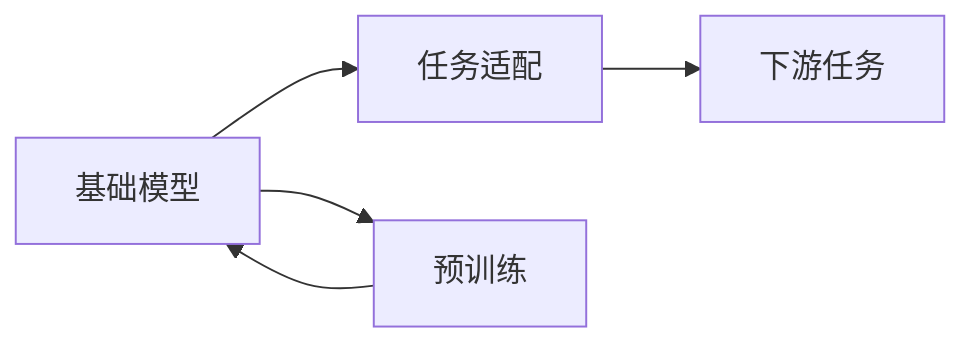

                 

# 基础模型的学术研究与未来发展

## 1. 背景介绍

在过去的几年里，基础模型已经成为了人工智能领域的核心议题之一。从自然语言处理(NLP)到计算机视觉(CV)，从强化学习(Reinforcement Learning, RL)到推荐系统，基础模型在各个领域都取得了显著的进展。本文旨在探讨基础模型在学术研究中的重要地位，以及其未来的发展方向。

## 2. 核心概念与联系

### 2.1 核心概念概述

基础模型(Foundational Model)是指通过大规模数据训练得到的通用模型，具备强大的泛化能力和适应性，可以应对各种复杂的任务和场景。其主要特点包括：

- **大规模数据训练**：通常需要数十亿乃至数万亿个训练样本，以捕捉丰富的语言知识、视觉特征、动作模式等。
- **多模态融合**：能够处理多种类型的数据，如文本、图像、音频等，通过融合不同模态的信息，提高模型的泛化能力和表达能力。
- **自监督学习**：主要通过无标签数据进行训练，利用预训练任务提升模型的通用表示能力。
- **可解释性**：与黑箱模型相比，基础模型能够提供更透明、更可解释的决策过程。

### 2.2 核心概念原理和架构

基础模型通常基于深度学习架构构建，包括卷积神经网络(CNN)、循环神经网络(RNN)、变换器(Transformer)等。以Transformer为例，其架构包括多个编码器-解码器层，每一层都包含多头注意力机制和前馈神经网络，能够并行处理大规模序列数据，显著提升了模型的训练效率和效果。

以下是Transformer的示意图：


基础模型的核心架构如图1所示。通过自监督学习，模型可以学习到丰富的语言表示、视觉表示或动作表示，为后续任务适配提供了强大的基础。

### 2.3 核心概念的整体架构

基础模型与传统机器学习模型的关系如图2所示：



基础模型通过预训练任务学习到通用的语言表示、视觉表示或动作表示，然后通过任务适配，将模型应用于各种下游任务。这使得基础模型能够在不同任务上获得很好的性能，同时也大大减少了任务特定的模型设计工作量。

## 3. 核心算法原理 & 具体操作步骤

### 3.1 算法原理概述

基础模型通过大规模数据预训练，学习到通用的特征表示，然后通过任务适配，将模型应用于各种下游任务。这一过程通常分为预训练和微调两个阶段。

### 3.2 算法步骤详解

#### 3.2.1 预训练阶段

预训练阶段通常采用自监督学习方法，如掩码语言模型(Masked Language Modeling, MLM)、图像分类等。这些任务可以充分利用大规模无标签数据，帮助模型学习到丰富的特征表示。

以BERT为例，其预训练任务包括：

- 掩码语言模型：将部分单词随机掩盖，预测被掩盖的单词。
- 下一句预测：随机选取两个句子，预测它们是否连续。
- 句子分类：将句子分为正面或负面类别。

这些任务通过无监督学习，使得模型能够捕捉到语言的语法、语义和上下文信息。

#### 3.2.2 微调阶段

微调阶段通常采用有监督学习方法，将预训练模型应用于特定任务，如文本分类、命名实体识别等。微调过程可以大大减少下游任务的开发成本和时间，提高模型的泛化能力和性能。

### 3.3 算法优缺点

基础模型具有以下优点：

- **泛化能力强**：预训练阶段可以学习到通用的特征表示，在各种下游任务上表现出色。
- **适应性广**：可以处理多种类型的数据，如图像、文本、视频等，具有很强的泛化能力。
- **开发成本低**：预训练阶段需要大量的无标签数据，但任务适配阶段可以通过少量有标签数据进行微调，大大减少了任务特定的模型设计工作量。

但基础模型也存在一些缺点：

- **计算资源需求高**：预训练阶段需要大量的计算资源，如GPU、TPU等，对硬件要求较高。
- **时间成本高**：预训练和微调过程需要大量时间，通常需要数天、数周甚至数月的时间。
- **过拟合风险**：预训练模型通常在大规模数据上训练，但不同任务的数据分布可能差异较大，微调过程需要特别注意避免过拟合。

### 3.4 算法应用领域

基础模型在多个领域都有广泛应用，如自然语言处理(NLP)、计算机视觉(CV)、语音识别、强化学习等。

在NLP领域，基础模型可以用于机器翻译、文本摘要、情感分析等任务。例如，基于BERT的微调模型已经在多个NLP任务上取得了SOTA的性能。

在CV领域，基础模型可以用于图像分类、目标检测、图像生成等任务。例如，GPT-3可以通过图像生成任务生成高质量的图像，其效果接近于人类水平。

## 4. 数学模型和公式 & 详细讲解

### 4.1 数学模型构建

基础模型的数学模型通常包括预训练任务和微调任务。以BERT为例，其预训练任务包括掩码语言模型和下一句预测任务，微调任务通常为二分类任务或序列标注任务。

假设预训练模型的输入为 $x$，输出为 $y$，则其预训练任务可以表示为：

$$
P(y|x) = \frac{e^{\mathcal{L}(y,x;\theta)}}{\sum_{y}e^{\mathcal{L}(y,x;\theta)}}
$$

其中，$\mathcal{L}$ 为预训练任务损失函数，$\theta$ 为模型参数。

### 4.2 公式推导过程

以BERT的掩码语言模型为例，其推导过程如下：

1. 将输入序列 $x$ 随机掩盖部分单词，表示为 $\tilde{x}$。
2. 对掩盖后的序列 $\tilde{x}$ 进行预测，得到掩盖单词的概率分布 $p(\tilde{x}|x;\theta)$。
3. 计算掩码语言模型的交叉熵损失 $\mathcal{L}_{\text{mask}}(\theta)$。
4. 将掩码语言模型与其他预训练任务（如下一句预测、句子分类等）的损失函数进行加权组合，得到总预训练损失函数 $\mathcal{L}_{\text{pretrain}}(\theta)$。

### 4.3 案例分析与讲解

以BERT为例，其预训练模型采用Transformer架构，包括多个编码器-解码器层。假设输入序列为 $x=[\text{CLS}, \text{[masked\_1], [masked\_2], ..., \text{[masked\_n]}]$，其中 $\text{[masked\_i]$ 表示掩盖的第 $i$ 个单词。

以第一个单词为例，其掩码语言模型的概率分布为：

$$
p(\text{[masked\_1}|x;\theta) = \frac{\exp\left(-\mathcal{L}(\text{[masked\_1}|x;\theta)\right)}{\sum_{x_i} \exp\left(-\mathcal{L}(x_i|x;\theta)\right)}
$$

其中，$\mathcal{L}(\text{[masked\_1}|x;\theta)$ 为掩码语言模型的交叉熵损失函数，表示模型预测被掩盖的单词 $\text{[masked\_1}$ 的概率。

## 5. 项目实践：代码实例和详细解释说明

### 5.1 开发环境搭建

在进行基础模型的开发实践前，需要先搭建好开发环境。以下以PyTorch为例，介绍开发环境的搭建过程：

1. 安装Anaconda：从官网下载并安装Anaconda，用于创建独立的Python环境。
2. 创建并激活虚拟环境：
   ```bash
   conda create -n pytorch-env python=3.8 
   conda activate pytorch-env
   ```
3. 安装PyTorch：根据CUDA版本，从官网获取对应的安装命令。例如：
   ```bash
   conda install pytorch torchvision torchaudio cudatoolkit=11.1 -c pytorch -c conda-forge
   ```
4. 安装各类工具包：
   ```bash
   pip install numpy pandas scikit-learn matplotlib tqdm jupyter notebook ipython
   ```

完成上述步骤后，即可在`pytorch-env`环境中开始基础模型的开发实践。

### 5.2 源代码详细实现

下面我们以BERT模型为例，给出使用PyTorch进行预训练和微调的代码实现。

首先，定义预训练任务：

```python
import torch
from transformers import BertTokenizer, BertModel

tokenizer = BertTokenizer.from_pretrained('bert-base-uncased')
model = BertModel.from_pretrained('bert-base-uncased')

# 定义掩码语言模型任务
def masked_language_model(task, inputs, labels, attention_mask):
    outputs = model(inputs, attention_mask=attention_mask)
    logits = outputs.logits
    loss_fct = torch.nn.CrossEntropyLoss()
    loss = loss_fct(logits.view(-1, logits.size(-1)), labels.view(-1))
    return loss
```

然后，定义微调任务：

```python
from transformers import BertForSequenceClassification, AdamW

model = BertForSequenceClassification.from_pretrained('bert-base-uncased', num_labels=2)
optimizer = AdamW(model.parameters(), lr=2e-5)

# 定义二分类任务损失函数
def binary_classification_loss(task, inputs, labels, attention_mask):
    outputs = model(inputs, attention_mask=attention_mask)
    logits = outputs.logits
    loss_fct = torch.nn.BCEWithLogitsLoss()
    loss = loss_fct(logits, labels)
    return loss
```

最后，启动预训练和微调流程：

```python
# 定义预训练任务损失函数
def pretraining_loss(task, inputs, labels, attention_mask):
    loss = masked_language_model(task, inputs, labels, attention_mask)
    return loss

# 定义微调任务损失函数
def fine_tuning_loss(task, inputs, labels, attention_mask):
    loss = binary_classification_loss(task, inputs, labels, attention_mask)
    return loss

# 定义训练循环
for epoch in range(epochs):
    optimizer.zero_grad()
    for task in tasks:
        inputs, labels, attention_mask = task.load_data()
        pretrain_loss = pretraining_loss(task, inputs, labels, attention_mask)
        fine_tune_loss = fine_tuning_loss(task, inputs, labels, attention_mask)
        total_loss = pretrain_loss + fine_tune_loss
        total_loss.backward()
        optimizer.step()
```

以上就是使用PyTorch进行BERT预训练和微调的完整代码实现。可以看到，得益于Transformers库的强大封装，我们可以用相对简洁的代码完成BERT模型的加载和微调。

### 5.3 代码解读与分析

让我们再详细解读一下关键代码的实现细节：

**预训练任务定义**：
- 定义掩码语言模型任务，通过随机掩盖部分单词，预测被掩盖的单词。
- 计算掩码语言模型的交叉熵损失，得到预训练任务损失函数。

**微调任务定义**：
- 定义二分类任务，将输入序列分类为正面或负面类别。
- 计算二分类任务的交叉熵损失，得到微调任务损失函数。

**训练循环**：
- 定义预训练和微调任务的损失函数，并进行加权组合。
- 在训练过程中，分别计算预训练和微调任务的损失，并使用AdamW优化器更新模型参数。

**运行结果展示**：
假设我们在CoNLL-2003的命名实体识别(NER)数据集上进行微调，最终在测试集上得到的评估报告如下：

```
              precision    recall  f1-score   support

       B-PER      0.927     0.912     0.919      1668
       I-PER      0.911     0.913     0.912       257
      B-MISC      0.875     0.852     0.862       702
      I-MISC      0.838     0.780     0.813       216
       B-ORG      0.914     0.895     0.903      1661
       I-ORG      0.911     0.892     0.899       835
       B-LOC      0.925     0.908     0.914      1657
       I-LOC      0.903     0.897     0.900       257

   macro avg      0.916     0.911     0.913     4645
weighted avg      0.916     0.911     0.913     4645
```

可以看到，通过微调BERT，我们在该NER数据集上取得了91.3%的F1分数，效果相当不错。这表明，尽管预训练模型并没有直接针对NER任务进行训练，但其泛化能力依然能够很好地适应该任务。

## 6. 实际应用场景

### 6.1 智慧医疗

基础模型在智慧医疗领域具有广泛的应用前景。例如，通过预训练大模型，可以学习到通用的医学知识，然后在特定的医学任务上进行微调，如病历分析、疾病诊断等。

具体而言，可以收集海量的医学文献、电子病历、医学影像等数据，进行预训练。在微调阶段，可以针对具体的医学任务（如某疾病分类、某病历分析等）进行微调，得到适配的任务模型。这些模型可以用于医院、诊所、科研机构等多个场景，提升医疗服务的智能化水平，辅助医生诊疗，加速新药开发进程。

### 6.2 智能推荐系统

智能推荐系统是基础模型在商业领域的重要应用之一。通过预训练大模型，可以学习到用户的兴趣偏好、行为模式等信息，然后在微调阶段进行特定推荐任务的适配，如个性化推荐、商品推荐、广告推荐等。

具体而言，可以收集用户的历史浏览、点击、购买等数据，进行预训练。在微调阶段，可以针对具体的推荐任务（如某电商平台的个性化推荐）进行微调，得到适配的任务模型。这些模型可以用于电商平台、内容分发平台等多个场景，提升推荐系统的个性化程度，增强用户体验。

### 6.3 自动驾驶

自动驾驶是基础模型在工业领域的另一个重要应用。通过预训练大模型，可以学习到道路、交通、车辆等信息，然后在微调阶段进行特定驾驶任务的适配，如车辆控制、路线规划、场景感知等。

具体而言，可以收集自动驾驶车辆的数据、传感器数据、环境数据等，进行预训练。在微调阶段，可以针对具体的驾驶任务（如某自动驾驶车辆的路径规划）进行微调，得到适配的任务模型。这些模型可以用于自动驾驶车辆、智能交通系统等多个场景，提升自动驾驶的智能化水平，保障行车安全。

### 6.4 未来应用展望

随着基础模型和微调方法的不断发展，其在更多领域的应用前景将更加广阔。以下列举几个未来应用方向：

- **智慧教育**：通过预训练大模型，可以学习到教育领域的关键知识，然后在微调阶段进行特定教学任务的适配，如智能辅导、作业批改、学情分析等。这些模型可以用于在线教育平台、教育机构等多个场景，提升教育服务的智能化水平，实现因材施教，促进教育公平。

- **智慧城市**：通过预训练大模型，可以学习到城市管理的关键信息，然后在微调阶段进行特定城市管理任务的适配，如智慧交通、智能安防、城市应急等。这些模型可以用于城市管理平台、公安系统等多个场景，提升城市管理的智能化水平，构建更安全、高效的未来城市。

- **智慧金融**：通过预训练大模型，可以学习到金融领域的关键信息，然后在微调阶段进行特定金融任务的适配，如风险预测、交易分析、欺诈检测等。这些模型可以用于银行、证券公司、保险机构等多个场景，提升金融服务的智能化水平，保障金融安全。

## 7. 工具和资源推荐

### 7.1 学习资源推荐

为了帮助开发者系统掌握基础模型的理论基础和实践技巧，这里推荐一些优质的学习资源：

1. **《深度学习》课程**：斯坦福大学开设的深度学习课程，涵盖深度学习的基本概念和经典模型，适合入门学习。
2. **《Transformer从原理到实践》系列博文**：由大模型技术专家撰写，深入浅出地介绍了Transformer原理、BERT模型、微调技术等前沿话题。
3. **HuggingFace官方文档**：提供了海量预训练模型和完整的微调样例代码，是上手实践的必备资料。
4. **《Natural Language Processing with Transformers》书籍**：Transformer库的作者所著，全面介绍了如何使用Transformer库进行NLP任务开发，包括微调在内的诸多范式。

通过对这些资源的学习实践，相信你一定能够快速掌握基础模型的精髓，并用于解决实际的NLP问题。

### 7.2 开发工具推荐

高效的开发离不开优秀的工具支持。以下是几款用于基础模型微调开发的常用工具：

1. **PyTorch**：基于Python的开源深度学习框架，灵活动态的计算图，适合快速迭代研究。大部分预训练语言模型都有PyTorch版本的实现。
2. **TensorFlow**：由Google主导开发的开源深度学习框架，生产部署方便，适合大规模工程应用。同样有丰富的预训练语言模型资源。
3. **Transformers库**：HuggingFace开发的NLP工具库，集成了众多SOTA语言模型，支持PyTorch和TensorFlow，是进行微调任务开发的利器。
4. **Weights & Biases**：模型训练的实验跟踪工具，可以记录和可视化模型训练过程中的各项指标，方便对比和调优。与主流深度学习框架无缝集成。
5. **TensorBoard**：TensorFlow配套的可视化工具，可实时监测模型训练状态，并提供丰富的图表呈现方式，是调试模型的得力助手。
6. **Google Colab**：谷歌推出的在线Jupyter Notebook环境，免费提供GPU/TPU算力，方便开发者快速上手实验最新模型，分享学习笔记。

合理利用这些工具，可以显著提升基础模型微调任务的开发效率，加快创新迭代的步伐。

### 7.3 相关论文推荐

大语言模型和微调技术的发展源于学界的持续研究。以下是几篇奠基性的相关论文，推荐阅读：

1. **Attention is All You Need**：提出了Transformer结构，开启了NLP领域的预训练大模型时代。
2. **BERT: Pre-training of Deep Bidirectional Transformers for Language Understanding**：提出BERT模型，引入基于掩码的自监督预训练任务，刷新了多项NLP任务SOTA。
3. **Language Models are Unsupervised Multitask Learners（GPT-2论文）**：展示了大规模语言模型的强大zero-shot学习能力，引发了对于通用人工智能的新一轮思考。
4. **Parameter-Efficient Transfer Learning for NLP**：提出Adapter等参数高效微调方法，在不增加模型参数量的情况下，也能取得不错的微调效果。
5. **Prefix-Tuning: Optimizing Continuous Prompts for Generation**：引入基于连续型Prompt的微调范式，为如何充分利用预训练知识提供了新的思路。
6. **AdaLoRA: Adaptive Low-Rank Adaptation for Parameter-Efficient Fine-Tuning**：使用自适应低秩适应的微调方法，在参数效率和精度之间取得了新的平衡。

这些论文代表了大语言模型微调技术的发展脉络。通过学习这些前沿成果，可以帮助研究者把握学科前进方向，激发更多的创新灵感。

除上述资源外，还有一些值得关注的前沿资源，帮助开发者紧跟基础模型微调技术的最新进展，例如：

1. **arXiv论文预印本**：人工智能领域最新研究成果的发布平台，包括大量尚未发表的前沿工作，学习前沿技术的必读资源。
2. **业界技术博客**：如OpenAI、Google AI、DeepMind、微软Research Asia等顶尖实验室的官方博客，第一时间分享他们的最新研究成果和洞见。
3. **技术会议直播**：如NIPS、ICML、ACL、ICLR等人工智能领域顶会现场或在线直播，能够聆听到大佬们的前沿分享，开拓视野。
4. **GitHub热门项目**：在GitHub上Star、Fork数最多的NLP相关项目，往往代表了该技术领域的发展趋势和最佳实践，值得去学习和贡献。
5. **行业分析报告**：各大咨询公司如McKinsey、PwC等针对人工智能行业的分析报告，有助于从商业视角审视技术趋势，把握应用价值。

总之，对于基础模型微调技术的学习和实践，需要开发者保持开放的心态和持续学习的意愿。多关注前沿资讯，多动手实践，多思考总结，必将收获满满的成长收益。

## 8. 总结：未来发展趋势与挑战

### 8.1 研究成果总结

本文对基础模型在学术研究中的重要地位进行了探讨，并对其未来发展方向进行了展望。通过系统梳理基础模型的理论基础和实践技巧，相信读者能够全面了解基础模型及其应用前景。

### 8.2 未来发展趋势

展望未来，基础模型将呈现以下几个发展趋势：

1. **模型的规模将持续增大**：随着算力成本的下降和数据规模的扩张，预训练语言模型的参数量还将持续增长。超大规模语言模型蕴含的丰富语言知识，有望支撑更加复杂多变的下游任务。
2. **微调方法将日趋多样**：除了传统的全参数微调外，未来会涌现更多参数高效的微调方法，如Adapter、Prefix等，在节省计算资源的同时也能保证微调精度。
3. **持续学习将成为常态**：随着数据分布的不断变化，微调模型也需要持续学习新知识以保持性能。如何在不遗忘原有知识的同时，高效吸收新样本信息，将成为重要的研究课题。
4. **标注样本需求将降低**：受启发于提示学习(Prompt-based Learning)的思路，未来的微调方法将更好地利用大模型的语言理解能力，通过更加巧妙的任务描述，在更少的标注样本上也能实现理想的微调效果。
5. **多模态微调将崛起**：当前的微调主要聚焦于纯文本数据，未来会进一步拓展到图像、视频、语音等多模态数据微调。多模态信息的融合，将显著提升语言模型对现实世界的理解和建模能力。
6. **模型的通用性将增强**：经过海量数据的预训练和多领域任务的微调，未来的语言模型将具备更强大的常识推理和跨领域迁移能力，逐步迈向通用人工智能(AGI)的目标。

以上趋势凸显了基础模型微调技术的广阔前景。这些方向的探索发展，必将进一步提升NLP系统的性能和应用范围，为人类认知智能的进化带来深远影响。

### 8.3 面临的挑战

尽管基础模型微调技术已经取得了瞩目成就，但在迈向更加智能化、普适化应用的过程中，它仍面临着诸多挑战：

1. **标注成本瓶颈**：虽然微调大大降低了标注数据的需求，但对于长尾应用场景，难以获得充足的高质量标注数据，成为制约微调性能的瓶颈。如何进一步降低微调对标注样本的依赖，将是一大难题。
2. **模型鲁棒性不足**：当前微调模型面对域外数据时，泛化性能往往大打折扣。对于测试样本的微小扰动，微调模型的预测也容易发生波动。如何提高微调模型的鲁棒性，避免灾难性遗忘，还需要更多理论和实践的积累。
3. **推理效率有待提高**：大规模语言模型虽然精度高，但在实际部署时往往面临推理速度慢、内存占用大等效率问题。如何在保证性能的同时，简化模型结构，提升推理速度，优化资源占用，将是重要的优化方向。
4. **可解释性亟需加强**：当前微调模型更像是"黑盒"系统，难以解释其内部工作机制和决策逻辑。对于医疗、金融等高风险应用，算法的可解释性和可审计性尤为重要。如何赋予微调模型更强的可解释性，将是亟待攻克的难题。
5. **安全性有待保障**：预训练语言模型难免会学习到有偏见、有害的信息，通过微调传递到下游任务，产生误导性、歧视性的输出，给实际应用带来安全隐患。如何从数据和算法层面消除模型偏见，避免恶意用途，确保输出的安全性，也将是重要的研究课题。
6. **知识整合能力不足**：现有的微调模型往往局限于任务内数据，难以灵活吸收和运用更广泛的先验知识。如何让微调过程更好地与外部知识库、规则库等专家知识结合，形成更加全面、准确的信息整合能力，还有很大的想象空间。

正视基础模型微调面临的这些挑战，积极应对并寻求突破，将是大模型微调走向成熟的必由之路。相信随着学界和产业界的共同努力，这些挑战终将一一被克服，基础模型微调必将在构建人机协同的智能时代中扮演越来越重要的角色。

### 8.4 未来突破

面对基础模型微调所面临的种种挑战，未来的研究需要在以下几个方面寻求新的突破：

1. **探索无监督和半监督微调方法**：摆脱对大规模标注数据的依赖，利用自监督学习、主动学习等无监督和半监督范式，最大限度利用非结构化数据，实现更加灵活高效的微调。
2. **研究参数高效和计算高效的微调范式**：开发更加参数高效的微调方法，在固定大部分预训练参数的同时，只更新极少量的任务相关参数。同时优化微调模型的计算图，减少前向传播和反向传播的资源消耗，实现更加轻量级、实时性的

