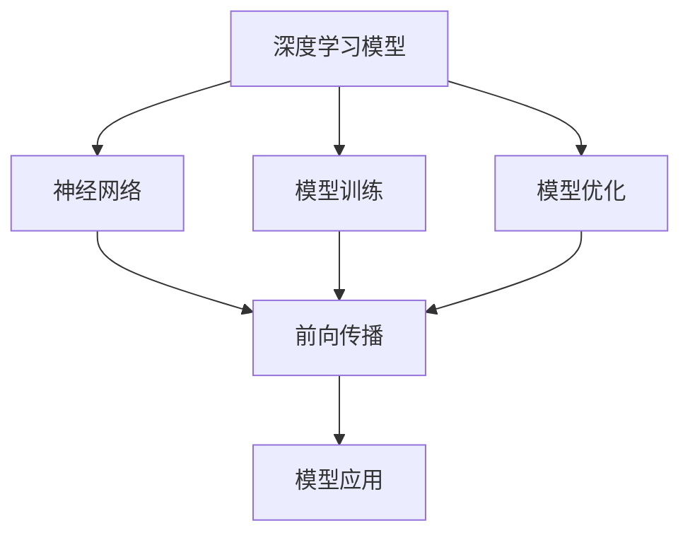
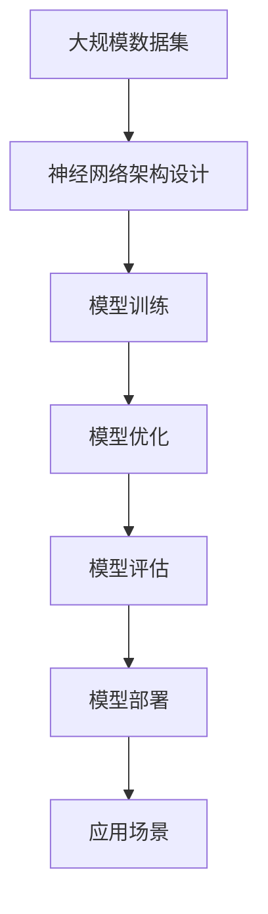

                 

# 基础模型的技术生态系统

> 关键词：基础模型,深度学习模型,神经网络,模型训练,模型优化,模型应用

## 1. 背景介绍

### 1.1 问题由来
在过去的几十年中，深度学习模型已经成为了人工智能领域的主流技术。特别是随着神经网络的发展，我们逐渐发现：模型训练和优化的效率和效果往往受到基础模型的影响。基础模型的好坏直接决定了后续训练过程的性能和可靠性。

然而，现有的基础模型已经无法满足日益复杂和多样化的需求，例如需要在大规模数据上快速进行训练，以及在实际应用中具备更强的泛化能力。因此，对基础模型的研究和应用成为了一个重要的研究方向。

### 1.2 问题核心关键点
基础模型研究的核心在于探索和设计更加高效、灵活、可扩展的神经网络架构，使其能够更好地适应各种不同的应用场景，并且在保证性能的同时，减少对资源的消耗。

具体来说，基础模型需要满足以下几个关键点：

1. **高效性**：基础模型应该具备高效的计算能力和存储能力，能够在较短的时间内完成模型训练和推理。
2. **泛化能力**：基础模型应该具备良好的泛化能力，能够在各种不同的数据集上进行有效的迁移学习，提高模型的适应性。
3. **可扩展性**：基础模型应该具备良好的可扩展性，能够在不同类型的任务上灵活应用，并且可以随着数据量的增加进行自适应调整。
4. **可解释性**：基础模型应该具备良好的可解释性，使得模型决策过程透明，便于理解和调试。
5. **鲁棒性**：基础模型应该具备良好的鲁棒性，能够在面对噪声、缺失数据等情况时依然保持良好的性能。

### 1.3 问题研究意义
研究基础模型对人工智能技术的发展具有重要的意义：

1. **提升性能**：通过设计更加高效的基础模型，可以显著提升模型训练和推理的速度，使得在实际应用中能够快速响应用户需求。
2. **降低成本**：基础模型的优化可以降低模型训练和推理的成本，从而减少企业运营成本。
3. **促进创新**：基础模型的研究可以推动新的深度学习技术的发展，使得人工智能技术在更多领域得到应用。
4. **提高可靠性**：通过基础模型的设计，可以提高模型的可靠性，避免出现模型性能波动的情况。
5. **增强可解释性**：基础模型的设计可以增强模型的可解释性，使得模型更加透明，便于用户理解和使用。

## 2. 核心概念与联系

### 2.1 核心概念概述

为了更好地理解基础模型的技术生态系统，我们将介绍几个核心概念及其相互之间的关系：

1. **深度学习模型**：基于神经网络结构的机器学习模型，通过多层次的非线性映射实现复杂的特征学习。
2. **神经网络**：由多个神经元组成的计算图，通过前向传播和反向传播进行训练和推理。
3. **模型训练**：使用标注数据对模型进行训练，使得模型能够学习到正确的特征表示。
4. **模型优化**：通过各种优化算法，如梯度下降、Adam等，对模型参数进行调整，使得模型性能达到最优。
5. **模型应用**：将训练好的模型应用于实际场景中，如图像识别、自然语言处理等。

### 2.2 概念间的关系

这些核心概念之间的关系可以通过以下Mermaid流程图来展示：



这个流程图展示了深度学习模型与神经网络、模型训练、模型优化和模型应用之间的联系：

1. 深度学习模型由神经网络组成，通过前向传播和反向传播进行训练和推理。
2. 模型训练和模型优化是深度学习模型的重要组成部分，通过使用标注数据和优化算法，提高模型的性能。
3. 模型应用是深度学习模型的最终目标，通过将训练好的模型应用于实际场景，实现各种不同的功能。

### 2.3 核心概念的整体架构

最后，我们用一个综合的流程图来展示这些核心概念之间的整体架构：



这个综合流程图展示了从数据集到应用场景的完整过程：

1. 从大规模数据集中提取数据，并进行预处理。
2. 设计适合的神经网络架构，用于特征学习和表示。
3. 使用标注数据进行模型训练，优化模型参数。
4. 对训练好的模型进行评估，确保其性能满足要求。
5. 将训练好的模型部署到实际应用场景中，实现各种功能。

## 3. 核心算法原理 & 具体操作步骤
### 3.1 算法原理概述

基础模型的训练和优化过程通常包括以下几个步骤：

1. **神经网络架构设计**：选择合适的神经网络架构，用于特征学习和表示。常见的神经网络架构包括卷积神经网络（CNN）、循环神经网络（RNN）和变换器（Transformer）等。
2. **模型训练**：使用标注数据对模型进行训练，通过前向传播和反向传播进行参数更新。
3. **模型优化**：使用各种优化算法，如梯度下降、Adam等，对模型参数进行调整，提高模型性能。
4. **模型评估**：使用测试集对训练好的模型进行评估，确保其性能满足要求。
5. **模型部署**：将训练好的模型部署到实际应用场景中，实现各种功能。

### 3.2 算法步骤详解

以下是基础模型训练和优化的一般流程：

1. **神经网络架构设计**
   - 选择适当的神经网络架构，如卷积神经网络（CNN）、循环神经网络（RNN）和变换器（Transformer）等。
   - 设计网络的层数、每层的神经元数、激活函数等超参数，以优化模型的性能。

2. **模型训练**
   - 准备标注数据集，通常包括训练集、验证集和测试集。
   - 使用前向传播计算模型输出，并计算损失函数。
   - 使用反向传播计算梯度，并使用优化算法（如梯度下降、Adam等）更新模型参数。
   - 在每个epoch结束时，使用验证集对模型进行评估，并根据评估结果调整超参数。

3. **模型优化**
   - 使用各种优化算法（如梯度下降、Adam等）对模型参数进行调整，提高模型性能。
   - 使用正则化技术（如L2正则、Dropout等）避免过拟合。
   - 使用early stopping等策略防止过拟合。

4. **模型评估**
   - 使用测试集对训练好的模型进行评估，计算各种评估指标（如准确率、召回率、F1分数等）。
   - 根据评估结果，确定是否继续训练或调整超参数。

5. **模型部署**
   - 将训练好的模型部署到实际应用场景中，实现各种功能。
   - 对部署后的模型进行监控和维护，确保其稳定性和可靠性。

### 3.3 算法优缺点

基础模型的训练和优化过程具有以下优点：

1. **高效性**：使用深度学习模型可以快速完成特征学习，提高模型训练和推理的速度。
2. **泛化能力**：深度学习模型具有较强的泛化能力，能够在不同的数据集上进行有效的迁移学习，提高模型的适应性。
3. **可扩展性**：深度学习模型可以根据任务需求进行灵活调整，具有较好的可扩展性。
4. **鲁棒性**：深度学习模型具有较强的鲁棒性，能够在面对噪声、缺失数据等情况时依然保持良好的性能。

同时，基础模型的训练和优化过程也存在一些缺点：

1. **数据需求**：深度学习模型需要大量的标注数据进行训练，数据获取成本较高。
2. **计算资源**：深度学习模型需要大量的计算资源进行训练和推理，对硬件要求较高。
3. **可解释性**：深度学习模型通常是"黑盒"模型，难以解释其内部工作机制。
4. **过拟合风险**：深度学习模型在训练过程中容易发生过拟合，特别是在数据量不足的情况下。

### 3.4 算法应用领域

基础模型在许多领域中都有广泛的应用，包括：

1. **计算机视觉**：如图像识别、物体检测、人脸识别等。
2. **自然语言处理**：如文本分类、情感分析、机器翻译等。
3. **语音识别**：如语音转文本、语音合成等。
4. **推荐系统**：如商品推荐、内容推荐等。
5. **游戏AI**：如游戏智能体、游戏策略优化等。
6. **医疗影像**：如医学影像分类、疾病诊断等。
7. **金融风控**：如信用评分、欺诈检测等。

## 4. 数学模型和公式 & 详细讲解  
### 4.1 数学模型构建

基础模型的训练和优化过程通常使用以下数学模型：

- **神经网络模型**：神经网络模型通常由输入层、隐藏层和输出层组成。输入层接受输入数据，隐藏层进行特征学习，输出层输出预测结果。

- **损失函数**：损失函数用于衡量模型预测结果与真实标签之间的差异，常用的损失函数包括均方误差（MSE）、交叉熵（Cross-Entropy）等。

- **优化算法**：优化算法用于调整模型参数，常用的优化算法包括梯度下降（Gradient Descent）、Adam、SGD等。

### 4.2 公式推导过程

以下是深度学习模型的常见公式推导过程：

1. **前向传播**
   - 对于神经网络模型，前向传播的过程如下：
     \[
     h_l = g(\mathbf{W}_l \mathbf{x}_l + \mathbf{b}_l)
     \]
     \[
     \mathbf{y} = \mathbf{W}_k \mathbf{h}_{l-1} + \mathbf{b}_k
     \]
     其中，\(\mathbf{x}_l\)为输入层，\(\mathbf{h}_l\)为隐藏层，\(\mathbf{y}\)为输出层，\(\mathbf{W}_l\)和\(\mathbf{b}_l\)为权重和偏置，\(g\)为激活函数。

2. **损失函数**
   - 常用的损失函数包括均方误差（MSE）和交叉熵（Cross-Entropy）。
     \[
     \mathcal{L} = \frac{1}{n} \sum_{i=1}^{n} (\mathbf{y}_i - \hat{\mathbf{y}}_i)^2
     \]
     \[
     \mathcal{L} = -\frac{1}{n} \sum_{i=1}^{n} \mathbf{y}_i \log \hat{\mathbf{y}}_i
     \]
     其中，\(\mathbf{y}_i\)为真实标签，\(\hat{\mathbf{y}}_i\)为模型预测结果。

3. **反向传播**
   - 反向传播的过程如下：
     \[
     \frac{\partial \mathcal{L}}{\partial \mathbf{W}_k} = \frac{\partial \mathcal{L}}{\partial \mathbf{h}_{l-1}} \frac{\partial \mathbf{h}_{l-1}}{\partial \mathbf{W}_k}
     \]
     \[
     \frac{\partial \mathcal{L}}{\partial \mathbf{b}_k} = \frac{\partial \mathcal{L}}{\partial \mathbf{h}_{l-1}}
     \]
     其中，\(\frac{\partial \mathcal{L}}{\partial \mathbf{h}_{l-1}}\)为损失函数对隐藏层的梯度，\(\frac{\partial \mathbf{h}_{l-1}}{\partial \mathbf{W}_k}\)和\(\frac{\partial \mathbf{h}_{l-1}}{\partial \mathbf{b}_k}\)为梯度计算过程中的中间变量。

### 4.3 案例分析与讲解

以卷积神经网络（CNN）为例，其前向传播和反向传播过程如下：

1. **前向传播**
   - 对于卷积神经网络，前向传播的过程如下：
     \[
     \mathbf{z} = \mathbf{X} * \mathbf{W} + \mathbf{b}
     \]
     \[
     \mathbf{A} = \sigma(\mathbf{z})
     \]
     其中，\(\mathbf{X}\)为输入图像，\(\mathbf{W}\)为卷积核，\(\mathbf{b}\)为偏置，\(\sigma\)为激活函数。

2. **损失函数**
   - 常用的损失函数包括交叉熵（Cross-Entropy）。
     \[
     \mathcal{L} = -\frac{1}{n} \sum_{i=1}^{n} \mathbf{y}_i \log \mathbf{A}_i
     \]
     其中，\(\mathbf{y}_i\)为真实标签，\(\mathbf{A}_i\)为模型预测结果。

3. **反向传播**
   - 反向传播的过程如下：
     \[
     \frac{\partial \mathcal{L}}{\partial \mathbf{W}} = \frac{\partial \mathcal{L}}{\partial \mathbf{A}} \frac{\partial \mathbf{A}}{\partial \mathbf{z}} \frac{\partial \mathbf{z}}{\partial \mathbf{W}}
     \]
     \[
     \frac{\partial \mathcal{L}}{\partial \mathbf{b}} = \frac{\partial \mathcal{L}}{\partial \mathbf{A}}
     \]
     其中，\(\frac{\partial \mathcal{L}}{\partial \mathbf{A}}\)为损失函数对激活层的梯度，\(\frac{\partial \mathbf{A}}{\partial \mathbf{z}}\)和\(\frac{\partial \mathbf{z}}{\partial \mathbf{W}}\)为梯度计算过程中的中间变量。

## 5. 项目实践：代码实例和详细解释说明
### 5.1 开发环境搭建

在进行基础模型开发之前，我们需要准备好开发环境。以下是使用Python进行TensorFlow开发的环境配置流程：

1. 安装Anaconda：从官网下载并安装Anaconda，用于创建独立的Python环境。

2. 创建并激活虚拟环境：
```bash
conda create -n tf-env python=3.7 
conda activate tf-env
```

3. 安装TensorFlow：根据CUDA版本，从官网获取对应的安装命令。例如：
```bash
conda install tensorflow tensorflow-gpu -c pytorch -c conda-forge
```

4. 安装TensorBoard：
```bash
pip install tensorboard
```

5. 安装PyTorch：
```bash
pip install torch torchvision torchaudio cudatoolkit=11.1 -c pytorch -c conda-forge
```

6. 安装各类工具包：
```bash
pip install numpy pandas scikit-learn matplotlib tqdm jupyter notebook ipython
```

完成上述步骤后，即可在`tf-env`环境中开始基础模型的开发。

### 5.2 源代码详细实现

这里我们以卷积神经网络（CNN）为例，给出使用TensorFlow进行图像分类任务的代码实现。

首先，定义CNN模型的结构：

```python
import tensorflow as tf
from tensorflow.keras import layers

class CNNModel(tf.keras.Model):
    def __init__(self):
        super(CNNModel, self).__init__()
        self.conv1 = layers.Conv2D(32, 3, activation='relu')
        self.pool1 = layers.MaxPooling2D()
        self.conv2 = layers.Conv2D(64, 3, activation='relu')
        self.pool2 = layers.MaxPooling2D()
        self.flatten = layers.Flatten()
        self.fc1 = layers.Dense(128, activation='relu')
        self.fc2 = layers.Dense(10, activation='softmax')

    def call(self, inputs):
        x = self.conv1(inputs)
        x = self.pool1(x)
        x = self.conv2(x)
        x = self.pool2(x)
        x = self.flatten(x)
        x = self.fc1(x)
        return self.fc2(x)
```

然后，定义模型训练和评估函数：

```python
from tensorflow.keras import datasets, layers, models
import numpy as np

# 加载数据集
(train_images, train_labels), (test_images, test_labels) = datasets.cifar10.load_data()

# 数据预处理
train_images = train_images / 255.0
test_images = test_images / 255.0

# 定义类别标签
class_names = ['airplane', 'automobile', 'bird', 'cat', 'deer', 'dog', 'frog', 'horse', 'ship', 'truck']

# 定义模型
model = CNNModel()

# 定义优化器和损失函数
optimizer = tf.keras.optimizers.Adam()
loss_fn = tf.keras.losses.SparseCategoricalCrossentropy(from_logits=True)

# 定义训练函数
@tf.function
def train_step(images, labels):
    with tf.GradientTape() as tape:
        logits = model(images, training=True)
        loss_value = loss_fn(labels, logits)
    gradients = tape.gradient(loss_value, model.trainable_variables)
    optimizer.apply_gradients(zip(gradients, model.trainable_variables))

# 定义评估函数
@tf.function
def evaluate_step(images, labels):
    logits = model(images, training=False)
    loss_value = loss_fn(labels, logits)
    predictions = tf.argmax(logits, axis=1)
    return loss_value, predictions

# 训练模型
epochs = 10
batch_size = 64

for epoch in range(epochs):
    for i in range(0, len(train_images), batch_size):
        batch_images = train_images[i:i+batch_size]
        batch_labels = train_labels[i:i+batch_size]
        train_step(batch_images, batch_labels)

    # 在验证集上评估模型
    loss, predictions = evaluate_step(test_images, test_labels)
    print(f'Epoch {epoch+1}, Loss: {loss.numpy():.4f}')

# 在测试集上评估模型
loss, predictions = evaluate_step(test_images, test_labels)
print(f'Test Loss: {loss.numpy():.4f}, Accuracy: {np.mean(predictions == test_labels):.4f}')
```

以上代码实现了卷积神经网络（CNN）的图像分类任务，包括模型的定义、训练和评估。

### 5.3 代码解读与分析

下面我们详细解读一下关键代码的实现细节：

**CNNModel类**：
- `__init__`方法：初始化卷积层、池化层、全连接层等组件。
- `call`方法：定义模型的前向传播过程。

**数据预处理**：
- 使用`tf.keras.datasets.cifar10.load_data()`加载CIFAR-10数据集，并对其进行归一化处理，使得像素值在0到1之间。
- 使用`tf.keras.utils.to_categorical()`将标签进行独热编码。

**模型定义**：
- 使用`tf.keras.Model`定义卷积神经网络模型，包含卷积层、池化层和全连接层。
- 使用`tf.keras.layers`定义模型的具体组件，如`Conv2D`、`MaxPooling2D`和`Flatten`等。

**优化器和损失函数**：
- 使用`tf.keras.optimizers.Adam()`定义优化器。
- 使用`tf.keras.losses.SparseCategoricalCrossentropy()`定义损失函数。

**训练函数`train_step`**：
- 在训练过程中，使用`tf.GradientTape`计算梯度，并使用`optimizer.apply_gradients()`更新模型参数。
- 使用`tf.keras.losses.SparseCategoricalCrossentropy()`计算损失函数。

**评估函数`evaluate_step`**：
- 在评估过程中，使用`tf.keras.losses.SparseCategoricalCrossentropy()`计算损失函数。
- 使用`tf.argmax()`计算预测结果，并使用`np.mean()`计算准确率。

**训练和评估流程**：
- 定义训练和评估函数，并在每个epoch结束后在验证集上评估模型。
- 在测试集上评估模型，并输出最终的准确率和损失值。

## 6. 实际应用场景

### 6.1 智能交通系统

基础模型在智能交通系统中有着广泛的应用。例如，通过使用深度学习模型，可以实时监测交通流量，预测交通拥堵情况，优化交通信号控制，提高道路通行效率。

在技术实现上，可以收集城市道路的实时监控数据，包括车辆位置、车速、方向等信息，将这些数据作为训练集，使用深度学习模型进行训练和推理。通过实时分析交通数据，可以预测交通流量变化趋势，优化信号灯控制策略，减少交通拥堵，提高城市运行效率。

### 6.2 医疗影像分析

基础模型在医疗影像分析中也有着广泛的应用。例如，通过使用深度学习模型，可以自动识别医学影像中的病变区域，辅助医生进行诊断和治疗。

在技术实现上，可以收集大量的医学影像数据，包括X光片、CT、MRI等，并将这些数据进行标注，使用深度学习模型进行训练和推理。通过自动分析和识别医学影像中的病变区域，可以提高医生的诊断效率，减少误诊率，为患者提供更好的医疗服务。

### 6.3 智能推荐系统

基础模型在智能推荐系统中也有着广泛的应用。例如，通过使用深度学习模型，可以分析用户的浏览记录、购买记录等行为数据，为用户推荐个性化的商品或内容。

在技术实现上，可以收集用户的行为数据，包括浏览时间、点击次数、购买记录等，并将这些数据作为训练集，使用深度学习模型进行训练和推理。通过分析用户行为数据，可以推荐用户可能感兴趣的商品或内容，提高用户满意度和平台转化率。

## 7. 工具和资源推荐

### 7.1 学习资源推荐

为了帮助开发者系统掌握基础模型的理论和实践知识，这里推荐一些优质的学习资源：

1. 《深度学习》书籍：由Yoshua Bengio、Ian Goodfellow和Aaron Courville编写，全面介绍了深度学习的基本概念和算法。
2. 《TensorFlow官方文档》：TensorFlow官方提供的详细文档，涵盖各种深度学习模型的实现和应用。
3. 《PyTorch官方文档》：PyTorch官方提供的详细文档，涵盖各种深度学习模型的实现和应用。
4. 《机器学习实战》书籍：由Peter Harrington编写，提供了许多深度学习模型的实战案例，适合初学者入门。
5. 《深度学习框架实践》课程：由清华大学开设的深度学习框架实战课程，涵盖TensorFlow和PyTorch的实践技巧。

通过对这些资源的学习实践，相信你一定能够快速掌握基础模型的精髓，并用于解决实际的NLP问题。

### 7.2 开发工具推荐

高效的开发离不开优秀的工具支持。以下是几款用于深度学习模型开发的工具：

1. TensorFlow：由Google主导开发的开源深度学习框架，生产部署方便，适合大规模工程应用。
2. PyTorch：基于Python的开源深度学习框架，灵活动态的计算图，适合快速迭代研究。
3. Keras：高层次的神经网络API，易于上手，适合初学者使用。
4. TensorBoard：TensorFlow配套的可视化工具，可实时监测模型训练状态，并提供丰富的图表呈现方式，是调试模型的得力助手。
5. Jupyter Notebook：开源的交互式笔记本，支持多种编程语言，适合数据科学和机器学习研究。

合理利用这些工具，可以显著提升深度学习模型的开发效率，加快创新迭代的步伐。

### 7.3 相关论文推荐

深度学习模型和优化技术的发展源于学界的持续研究。以下是几篇奠基性的相关论文，推荐阅读：

1. AlexNet：ImageNet 2012冠军模型，提出了卷积神经网络（CNN）架构，奠定了深度学习在计算机视觉领域的基础。
2. VGGNet：由Oxford大学提出的卷积神经网络架构，通过大量的卷积层和池化层，提升了模型性能。
3. ResNet：提出了残差连接（Residual Connection）技术，解决了深度神经网络训练中的梯度消失问题，使得模型更深。
4. InceptionNet：提出了Inception模块，通过不同大小的卷积核和池化核，提升了模型性能。
5. Adam：提出了自适应矩估计（Adaptive Moment Estimation）技术，优化了梯度下降算法，提高了模型训练速度。

这些论文代表了大模型微调技术的发展脉络。通过学习这些前沿成果，可以帮助研究者把握学科前进方向，激发更多的创新灵感。

除上述资源外，还有一些值得关注的前沿资源，帮助开发者紧跟深度学习模型微调技术的最新进展，例如：

1. arXiv论文预印本：人工智能领域最新研究成果的发布平台，包括大量尚未发表的前沿工作，学习前沿技术的必读资源。
2. 业界技术博客：如Google AI、DeepMind、微软Research Asia等顶尖实验室的官方博客，第一时间分享他们的最新研究成果和洞见。
3. 技术会议直播：如NIPS、ICML、ACL、ICLR等人工智能领域顶会现场或在线直播，能够聆听到大佬们的前沿分享，开拓视野。
4. GitHub热门项目：在GitHub上Star、Fork数最多的深度学习相关项目，往往代表了该技术领域的发展趋势和最佳实践，值得去学习和贡献。
5. 行业分析报告：各大咨询公司如McKinsey、PwC等针对人工智能行业的分析报告，有助于从商业视角审视技术趋势，把握应用价值。

