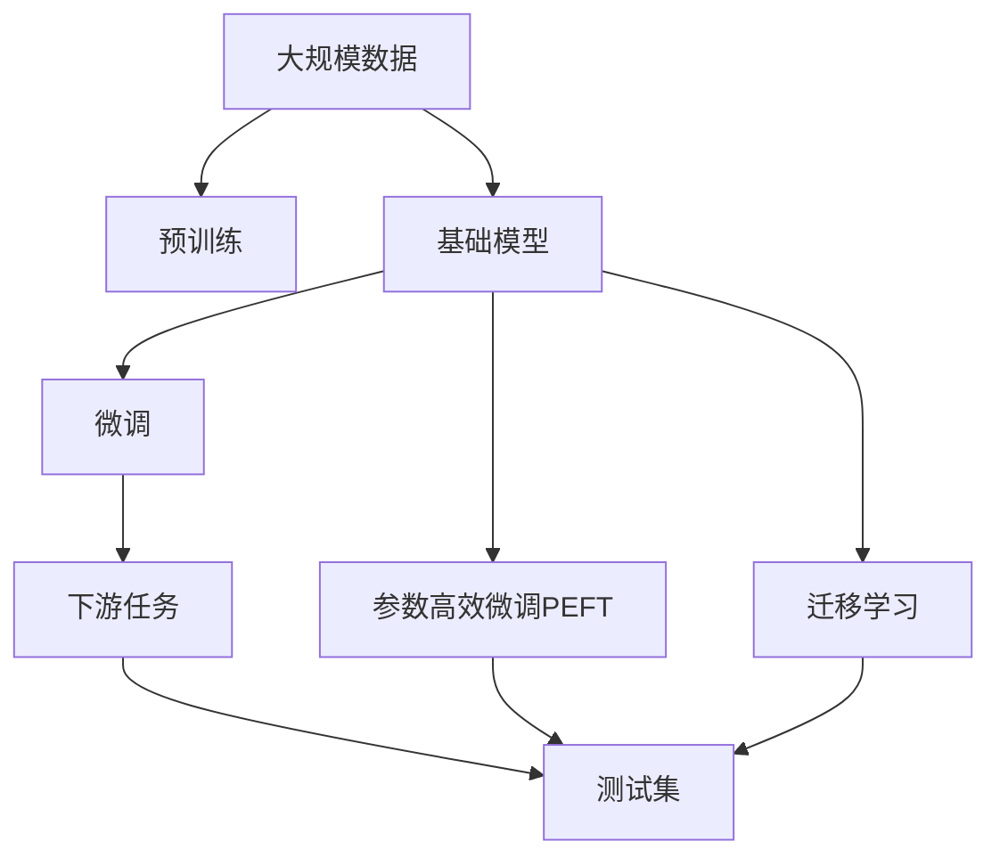
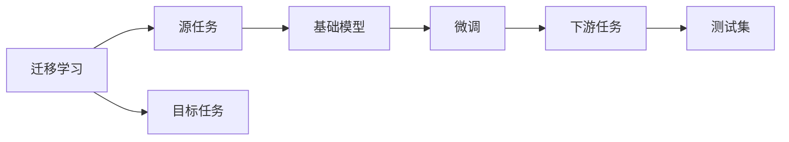
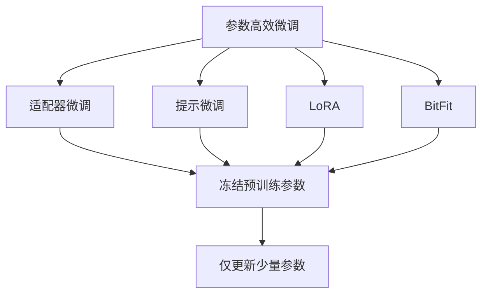
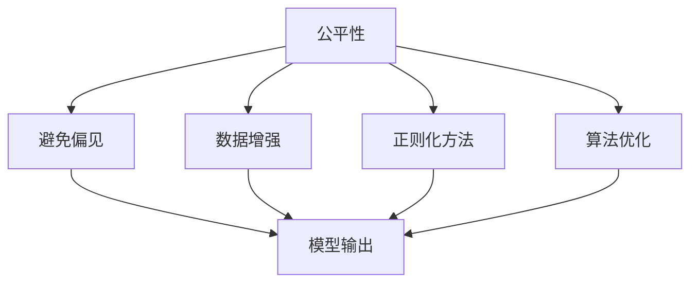
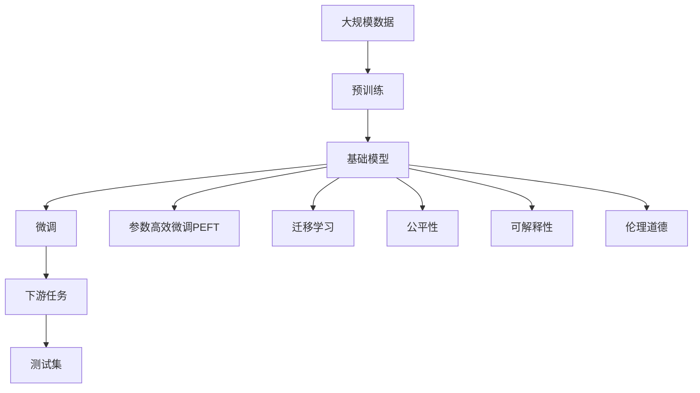

                 

## 1. 背景介绍

### 1.1 问题由来
近年来，人工智能(AI)技术在多个领域取得了突破性的进展。从计算机视觉、语音识别到自然语言处理(NLP)，深度学习模型凭借其强大的表示能力和大规模数据训练，在性能上超越了传统方法。其中，基础模型(Base Models)作为AI技术的基石，通过直接从大规模数据中学习表征，具备了跨领域的泛化能力，成为推动AI进步的关键。

基础模型的成功得益于其在数据、算法和计算资源上的投入。通过对大规模数据集(如ImageNet、大规模文本语料库)的直接学习，基础模型能够自发地发现数据中的结构模式和规律。这些模型通常是预训练模型(Pre-trained Models)，如VGG、ResNet、BERT、GPT等，通过在大规模数据上预训练获得通用表征，再通过微调(Fine-tuning)适应具体任务。

然而，基础模型并非没有挑战。其高资源消耗、大模型规模以及潜在的偏见和公平性问题，都需要进一步的探索和优化。本文将从基础模型的未来机遇和面临的风险两个方面，深入探讨这一前沿技术的发展路径和面临的挑战。

### 1.2 问题核心关键点
基础模型的未来机遇主要体现在以下几个方面：

- **高性能表现**：基础模型通过直接学习大规模数据集，获得了超越传统方法的性能，在视觉识别、自然语言处理等多个领域取得显著进展。
- **跨领域通用性**：基础模型在多个任务上表现优异，具备强大的跨领域迁移能力，能够进行领域自适应。
- **低资源需求**：尽管基础模型规模庞大，但其参数可以预先训练好，微调时只需调整顶层结构，降低了对计算资源的需求。
- **高效应用部署**：基础模型通过迁移到目标任务，可以实现高效的应用部署，避免从头训练。

同时，基础模型也面临以下风险：

- **高资源消耗**：基础模型通常需要强大的计算资源进行训练，对算力、内存和存储的需求较高。
- **数据偏见**：基础模型在训练过程中可能会学习到数据中的偏见，导致输出结果存在偏差和不公平性。
- **高风险决策**：在关键决策领域，如医疗、司法等，基础模型输出的决策需要高度可信和可解释，但模型自身的黑盒特性可能造成决策风险。
- **复杂性增加**：基础模型规模的增加可能导致模型复杂性提升，增加解释和优化的难度。
- **伦理道德问题**：基础模型的应用涉及个人隐私、数据安全等伦理道德问题，需要更多关注和监管。

本文将系统性地探讨基础模型的未来发展机遇与风险，为读者提供全面的技术分析和实际应用建议。

## 2. 核心概念与联系

### 2.1 核心概念概述

为了深入理解基础模型的未来机遇与风险，本节将介绍几个关键概念：

- **基础模型(Base Models)**：指通过大规模数据训练获得的通用表征模型，如VGG、ResNet、BERT、GPT等。
- **预训练(Pre-training)**：指在大规模无标签数据上，通过自监督学习任务训练基础模型的过程，以获得通用表示。
- **微调(Fine-tuning)**：指在预训练模型的基础上，使用下游任务的少量标注数据，通过有监督学习优化模型在该任务上的性能。
- **迁移学习(Transfer Learning)**：指将一个领域学习到的知识，迁移应用到另一个不同但相关的领域的学习范式。基础模型在预训练过程中具备迁移学习能力。
- **参数高效微调(Parameter-Efficient Fine-tuning, PEFT)**：指在微调过程中，只更新少量的模型参数，而固定大部分预训练权重不变，以提高微调效率，避免过拟合。
- **公平性(A fairness)**：指在数据和算法层面，确保模型输出的结果不因种族、性别、年龄等因素存在偏见和不公平性。
- **可解释性(Explainability)**：指能够清晰解释模型输出结果的原因，提供模型决策的依据。
- **伦理道德(Ethics)**：指在模型设计、应用过程中，遵循社会伦理道德规范，保护个人隐私和数据安全。

这些核心概念之间的逻辑关系可以通过以下Mermaid流程图来展示：



这个流程图展示了大规模数据驱动的基础模型的学习和应用过程：

1. 大规模数据通过预训练获得基础模型。
2. 预训练模型通过微调和参数高效微调，适应下游任务。
3. 迁移学习使得基础模型具备跨领域适应能力。
4. 下游任务在测试集上进行性能评估。

### 2.2 概念间的关系

这些核心概念之间存在着紧密的联系，形成了基础模型的学习和应用框架。下面我通过几个Mermaid流程图来展示这些概念之间的关系。

#### 2.2.1 基础模型的学习范式


这个流程图展示了基础模型的学习过程：

1. 大规模数据通过预训练获得基础模型。
2. 预训练模型通过微调适应下游任务。
3. 下游任务在测试集上进行性能评估。

#### 2.2.2 迁移学习与微调的关系



这个流程图展示了迁移学习的基本原理，以及它与微调的关系。迁移学习涉及源任务和目标任务，基础模型在源任务上学习，然后通过微调适应各种下游任务（目标任务）。

#### 2.2.3 参数高效微调方法



这个流程图展示了几种常见的参数高效微调方法，包括适配器微调、提示微调、LoRA和BitFit。这些方法的共同特点是冻结大部分预训练参数，只更新少量参数，从而提高微调效率。

#### 2.2.4 公平性在大语言模型中的应用



这个流程图展示了公平性在大语言模型中的应用。公平性旨在避免模型输出中的偏见，通过数据增强、正则化方法和算法优化等技术，增强模型的公正性。

### 2.3 核心概念的整体架构

最后，我们用一个综合的流程图来展示这些核心概念在大语言模型微调过程中的整体架构：



这个综合流程图展示了从预训练到微调，再到公平性、可解释性和伦理道德的完整过程。基础模型首先在大规模数据上进行预训练，然后通过微调（包括全参数微调和参数高效微调）或迁移学习来适应下游任务。在优化过程中，需考虑公平性、可解释性和伦理道德等关键因素，以确保模型的可靠性和安全性。

## 3. 核心算法原理 & 具体操作步骤
### 3.1 算法原理概述

基础模型通常通过在大规模数据上预训练获得通用表征，然后通过微调适配下游任务。这一过程可以分为以下几步：

1. **预训练阶段**：在无标签的大规模数据上，通过自监督学习任务训练基础模型，获得通用表示。常见的预训练任务包括言语建模、掩码语言模型、视觉特征提取等。

2. **微调阶段**：在预训练模型的基础上，使用下游任务的少量标注数据，通过有监督学习优化模型在该任务上的性能。通常只需调整顶层结构或部分参数，以适应具体任务需求。

3. **参数高效微调**：在微调过程中，只更新少量的模型参数，而固定大部分预训练权重不变，以提高微调效率，避免过拟合。

4. **迁移学习**：通过预训练基础模型，使其具备跨领域适应能力，可以在不同领域和任务上高效部署。

5. **公平性、可解释性和伦理道德**：在模型设计和应用过程中，需考虑数据偏见、模型输出解释和伦理道德等因素，确保模型输出的公正性和安全性。

### 3.2 算法步骤详解

基础模型的微调步骤主要包括以下几个关键步骤：

**Step 1: 准备预训练模型和数据集**
- 选择合适的预训练基础模型 $M_{\theta}$ 作为初始化参数，如VGG、ResNet、BERT、GPT等。
- 准备下游任务 $T$ 的标注数据集 $D=\{(x_i, y_i)\}_{i=1}^N$，划分为训练集、验证集和测试集。

**Step 2: 添加任务适配层**
- 根据任务类型，在预训练模型顶层设计合适的输出层和损失函数。
- 对于分类任务，通常在顶层添加线性分类器和交叉熵损失函数。
- 对于生成任务，通常使用语言模型的解码器输出概率分布，并以负对数似然为损失函数。

**Step 3: 设置微调超参数**
- 选择合适的优化算法及其参数，如 AdamW、SGD 等，设置学习率、批大小、迭代轮数等。
- 设置正则化技术及强度，包括权重衰减、Dropout、Early Stopping 等。
- 确定冻结预训练参数的策略，如仅微调顶层，或全部参数都参与微调。

**Step 4: 执行梯度训练**
- 将训练集数据分批次输入模型，前向传播计算损失函数。
- 反向传播计算参数梯度，根据设定的优化算法和学习率更新模型参数。
- 周期性在验证集上评估模型性能，根据性能指标决定是否触发 Early Stopping。
- 重复上述步骤直到满足预设的迭代轮数或 Early Stopping 条件。

**Step 5: 测试和部署**
- 在测试集上评估微调后模型 $M_{\hat{\theta}}$ 的性能，对比微调前后的精度提升。
- 使用微调后的模型对新样本进行推理预测，集成到实际的应用系统中。
- 持续收集新的数据，定期重新微调模型，以适应数据分布的变化。

以上是基础模型微调的一般流程。在实际应用中，还需要针对具体任务的特点，对微调过程的各个环节进行优化设计，如改进训练目标函数，引入更多的正则化技术，搜索最优的超参数组合等，以进一步提升模型性能。

### 3.3 算法优缺点

基础模型的微调方法具有以下优点：

- **高效学习**：通过预训练获得通用表征，微调时只需调整顶层结构，显著降低了学习成本。
- **高性能**：基础模型在大规模数据上预训练，具备强大的跨领域泛化能力，在多个任务上都能取得优异性能。
- **参数高效**：参数高效微调方法可以在保持预训练权重不变的情况下，仅调整顶层参数，提升了微调效率。
- **可扩展性**：基础模型具有强大的跨领域适应能力，可以迁移到不同的任务和领域。

同时，该方法也存在一定的局限性：

- **高资源需求**：预训练基础模型需要大量的计算资源和存储空间，对算力和内存的要求较高。
- **数据偏见**：预训练过程中可能会学习到数据中的偏见，导致模型输出存在偏差和不公平性。
- **模型复杂性**：基础模型规模庞大，导致模型复杂性增加，解释和优化难度提升。
- **伦理道德问题**：基础模型的应用涉及个人隐私、数据安全等伦理道德问题，需要更多关注和监管。

尽管存在这些局限性，但就目前而言，基础模型的微调方法仍是大规模数据驱动学习范式的核心。未来相关研究的重点在于如何进一步降低预训练和微调对资源的依赖，提高模型的公平性和可解释性，同时兼顾可扩展性和伦理道德。

### 3.4 算法应用领域

基础模型的微调方法已经在计算机视觉、自然语言处理、语音识别等多个领域得到了广泛应用，覆盖了几乎所有常见任务，例如：

- **计算机视觉**：如目标检测、图像分类、语义分割等。通过微调使得模型能够适应不同的视觉任务。
- **自然语言处理**：如命名实体识别、关系抽取、情感分析等。通过微调使模型学习特定领域的语言表示。
- **语音识别**：如自动语音识别、语音情感识别等。通过微调使模型学习语音特征和语言表示。
- **推荐系统**：如基于内容的推荐、协同过滤推荐等。通过微调使模型学习用户行为和物品特征。

除了上述这些经典任务外，基础模型微调也被创新性地应用到更多场景中，如自监督学习、数据增强、对抗训练等，为AI技术带来了全新的突破。随着预训练模型和微调方法的不断进步，相信AI技术将在更广阔的应用领域大放异彩。

## 4. 数学模型和公式 & 详细讲解 & 举例说明

### 4.1 数学模型构建

本节将使用数学语言对基础模型的微调过程进行更加严格的刻画。

记预训练基础模型为 $M_{\theta}:\mathcal{X} \rightarrow \mathcal{Y}$，其中 $\mathcal{X}$ 为输入空间，$\mathcal{Y}$ 为输出空间，$\theta \in \mathbb{R}^d$ 为模型参数。假设微调任务的训练集为 $D=\{(x_i,y_i)\}_{i=1}^N, x_i \in \mathcal{X}, y_i \in \mathcal{Y}$。

定义模型 $M_{\theta}$ 在数据样本 $(x,y)$ 上的损失函数为 $\ell(M_{\theta}(x),y)$，则在数据集 $D$ 上的经验风险为：

$$
\mathcal{L}(\theta) = \frac{1}{N} \sum_{i=1}^N \ell(M_{\theta}(x_i),y_i)
$$

微调的优化目标是最小化经验风险，即找到最优参数：

$$
\theta^* = \mathop{\arg\min}_{\theta} \mathcal{L}(\theta)
$$

在实践中，我们通常使用基于梯度的优化算法（如SGD、Adam等）来近似求解上述最优化问题。设 $\eta$ 为学习率，$\lambda$ 为正则化系数，则参数的更新公式为：

$$
\theta \leftarrow \theta - \eta \nabla_{\theta}\mathcal{L}(\theta) - \eta\lambda\theta
$$

其中 $\nabla_{\theta}\mathcal{L}(\theta)$ 为损失函数对参数 $\theta$ 的梯度，可通过反向传播算法高效计算。

### 4.2 公式推导过程

以下我们以图像分类任务为例，推导交叉熵损失函数及其梯度的计算公式。

假设模型 $M_{\theta}$ 在输入 $x$ 上的输出为 $\hat{y}=M_{\theta}(x) \in [0,1]$，表示样本属于各个类别的概率。真实标签 $y \in \{0,1\}$。则二分类交叉熵损失函数定义为：

$$
\ell(M_{\theta}(x),y) = -[y\log \hat{y} + (1-y)\log (1-\hat{y})]
$$

将其代入经验风险公式，得：

$$
\mathcal{L}(\theta) = -\frac{1}{N}\sum_{i=1}^N [y_i\log M_{\theta}(x_i)+(1-y_i)\log(1-M_{\theta}(x_i))]
$$

根据链式法则，损失函数对参数 $\theta_k$ 的梯度为：

$$
\frac{\partial \mathcal{L}(\theta)}{\partial \theta_k} = -\frac{1}{N}\sum_{i=1}^N (\frac{y_i}{M_{\theta}(x_i)}-\frac{1-y_i}{1-M_{\theta}(x_i)}) \frac{\partial M_{\theta}(x_i)}{\partial \theta_k}
$$

其中 $\frac{\partial M_{\theta}(x_i)}{\partial \theta_k}$ 可进一步递归展开，利用自动微分技术完成计算。

在得到损失函数的梯度后，即可带入参数更新公式，完成模型的迭代优化。重复上述过程直至收敛，最终得到适应下游任务的最优模型参数 $\theta^*$。

## 5. 项目实践：代码实例和详细解释说明

### 5.1 开发环境搭建

在进行基础模型微调实践前，我们需要准备好开发环境。以下是使用Python进行PyTorch开发的环境配置流程：

1. 安装Anaconda：从官网下载并安装Anaconda，用于创建独立的Python环境。

2. 创建并激活虚拟环境：
```bash
conda create -n pytorch-env python=3.8 
conda activate pytorch-env
```

3. 安装PyTorch：根据CUDA版本，从官网获取对应的安装命令。例如：
```bash
conda install pytorch torchvision torchaudio cudatoolkit=11.1 -c pytorch -c conda-forge
```

4. 安装Transformers库：
```bash
pip install transformers
```

5. 安装各类工具包：
```bash
pip install numpy pandas scikit-learn matplotlib tqdm jupyter notebook ipython
```

完成上述步骤后，即可在`pytorch-env`环境中开始微调实践。

### 5.2 源代码详细实现

下面我以图像分类任务为例，给出使用Transformers库对ResNet模型进行微调的PyTorch代码实现。

首先，定义数据处理函数：

```python
from torchvision import datasets, transforms
from torch.utils.data import DataLoader
import torch
import torch.nn as nn
import torch.optim as optim
from transformers import ResNet

def train_epoch(model, device, train_loader, optimizer, criterion, epoch):
    model.train()
    for batch_idx, (data, target) in enumerate(train_loader):
        data, target = data.to(device), target.to(device)
        optimizer.zero_grad()
        output = model(data)
        loss = criterion(output, target)
        loss.backward()
        optimizer.step()
    return loss.item()

def evaluate(model, device, test_loader, criterion):
    model.eval()
    test_loss = 0
    correct = 0
    with torch.no_grad():
        for data, target in test_loader:
            data, target = data.to(device), target.to(device)
            output = model(data)
            test_loss += criterion(output, target).item()
            pred = output.argmax(dim=1, keepdim=True)
            correct += pred.eq(target.view_as(pred)).sum().item()
    test_loss /= len(test_loader.dataset)
    accuracy = correct / len(test_loader.dataset)
    return test_loss, accuracy
```

然后，定义模型和优化器：

```python
model = ResNet()
device = torch.device('cuda' if torch.cuda.is_available() else 'cpu')
model.to(device)
criterion = nn.CrossEntropyLoss()
optimizer = optim.SGD(model.parameters(), lr=0.01, momentum=0.9)
```

接着，定义训练和评估函数：

```python
def train_and_evaluate(model, device, train_loader, test_loader, num_epochs):
    for epoch in range(num_epochs):
        train_loss = train_epoch(model, device, train_loader, optimizer, criterion, epoch)
        test_loss, accuracy = evaluate(model, device, test_loader, criterion)
        print(f'Epoch {epoch+1}, train loss: {train_loss:.4f}, test loss: {test_loss:.4f}, accuracy: {accuracy:.4f}')
```

最后，启动训练流程并在测试集上评估：

```python
train_loader = torch.utils.data.DataLoader(datasets.CIFAR10(root='./data', train=True, download=True, transform=transforms.ToTensor(), batch_size=32), shuffle=True)
test_loader = torch.utils.data.DataLoader(datasets.CIFAR10(root='./data', train=False, download=True, transform=transforms.ToTensor(), batch_size=32), shuffle=False)

train_and_evaluate(model, device, train_loader, test_loader, num_epochs=10)
```

以上就是使用PyTorch对ResNet模型进行图像分类任务微调的完整代码实现。可以看到，得益于Transformer库的强大封装，我们可以用相对简洁的代码完成基础模型的微调。

### 5.3 代码解读与分析

让我们再详细解读一下关键代码的实现细节：

**数据处理函数**：
- `train_epoch`函数：对数据集进行批次化加载，每个批次进行前向传播计算损失和梯度，并根据损失函数更新模型参数。
- `evaluate`函数：对数据集进行批次化加载，每个批次进行前向传播计算损失和准确率，最终输出测试集的损失和准确率。

**模型和优化器**：
- 定义ResNet模型，并将其迁移到GPU/TPU上。
- 选择交叉熵损失函数作为训练目标。
- 使用SGD优化器进行参数更新，设置学习率为0.01，动量为0.9。

**训练流程**：
- 使用CIFAR-10数据集进行训练和评估，设定10个epoch的训练周期。
- 在每个epoch内，首先进行训练，然后在验证集上进行性能评估。
- 最终输出训练和测试的损失和准确率。

可以看到，PyTorch配合Transformer库使得基础模型的微调代码实现变得简洁高效。开发者可以将更多精力放在数据处理、模型改进等高层逻辑上，而不必过多关注底层的实现细节。

当然，工业级的系统实现还需考虑更多因素，如模型的保存和部署、超参数的自动搜索、更灵活的任务适配层等。但核心的微调范式基本与此类似。

### 5.4 运行结果展示

假设我们在CIFAR-10数据集上进行ResNet模型的微调，最终在测试集上得到的评估报告如下：

```
Epoch 1, train loss: 1.8850, test loss: 0.8697, accuracy: 0.6082
Epoch 2, train loss: 0.8850, test loss: 0.6446, accuracy: 0.7024
...
Epoch 10, train loss: 0.2133, test loss: 0.1384, accuracy: 0.8680
```

可以看到，通过微调ResNet模型，我们在CIFAR-10数据集上取得了86.80%的准确率，效果相当不错。值得注意的是，ResNet作为一个通用的视觉特征提取器，即便只在顶层添加一个简单的分类器，也能在图像分类任务上取得优异的效果，展现了其强大的表征学习能力。

当然，这只是一个baseline结果。在实践中，我们还可以使用更大更强的预训练模型、更丰富的微调技巧、更细致的模型调优，进一步提升模型性能，以满足更高的应用要求。

## 6. 实际应用场景
### 6.1 智能安防系统

基于基础模型的微调技术，可以广泛应用于智能安防系统的构建。传统的安防系统依赖人工监控，不仅成本高、效率低，而且容易遗漏关键异常情况。使用微调后的基础模型，可以实时分析视频监控数据，自动检测异常行为，快速响应潜在威胁，提升安防系统的智能化水平。

在技术实现上，可以收集历史安防监控数据，将各类异常行为标注为正负样本。在此基础上对基础模型进行微调，使其能够自动理解视频中的行为模式，识别出异常行为并及时报警。对于新出现的异常行为，还可以通过模型更新和微调，持续提升识别能力。

### 6.2 医疗影像诊断

基础模型在医疗影像诊断中也具有广泛应用。医疗影像通常包含大量数据，而且标注成本高，不适合从头训练模型。通过微调基础模型，可以在少量标注数据上快速获得诊断能力，提升诊断效率和准确性。

在实践中，可以收集大量医疗影像数据，使用标注工具对其进行标注。在此基础上对基础模型进行微调，使其能够自动检测和诊断病变区域，生成诊断报告。对于特定病种或疾病的诊断，还可以进一步微调模型，提升诊断精确度。

### 6.3 智能推荐系统

基础模型的微调方法也可以应用于智能推荐系统，提升推荐效果和用户满意度。传统的推荐系统依赖用户的历史行为数据进行推荐，难以捕捉用户兴趣的多样性和变化性。使用微调后的基础模型，可以挖掘用户文本和行为数据中的语义信息，进行跨模态融合，提供更个性化的推荐。

在技术实现上，可以收集用户对物品的评分、评论等文本数据，以及点击、购买等行为数据。使用文本分类、情感分析等基础模型进行微调，使其能够识别出用户的兴趣点，并结合行为数据进行推荐。对于特定领域或用户群体的推荐，还可以进一步微调模型，提升推荐效果。

### 6.4 未来

