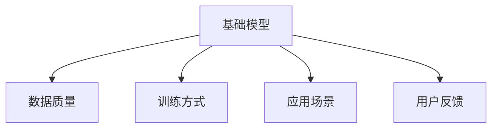
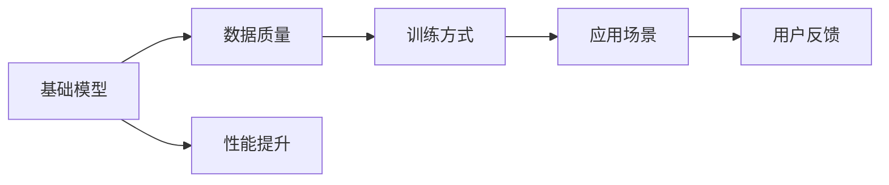
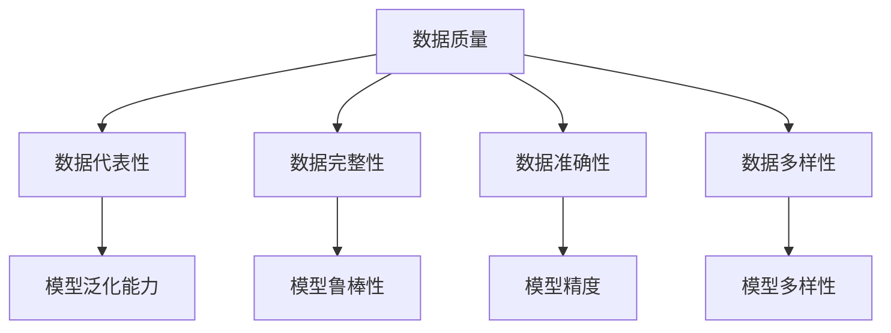
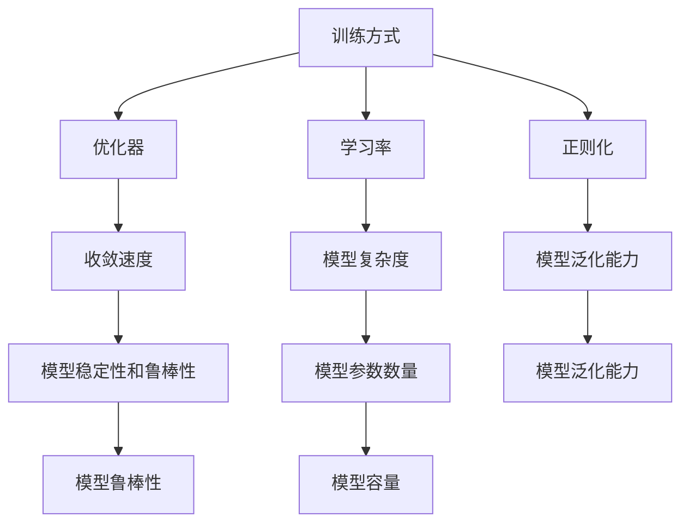
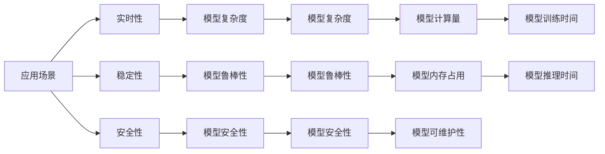
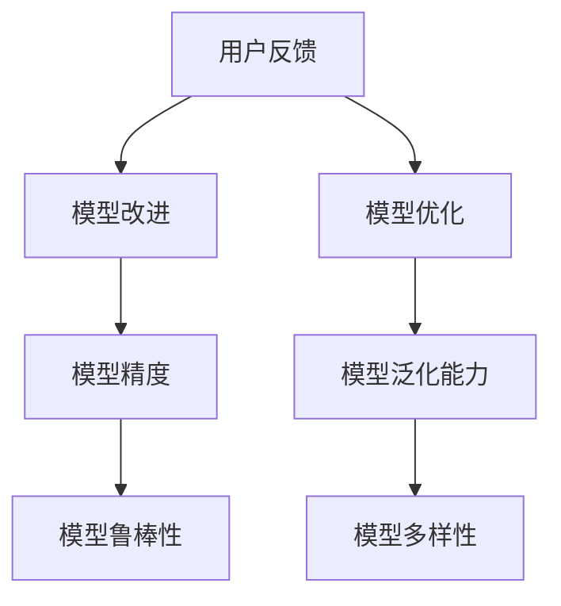
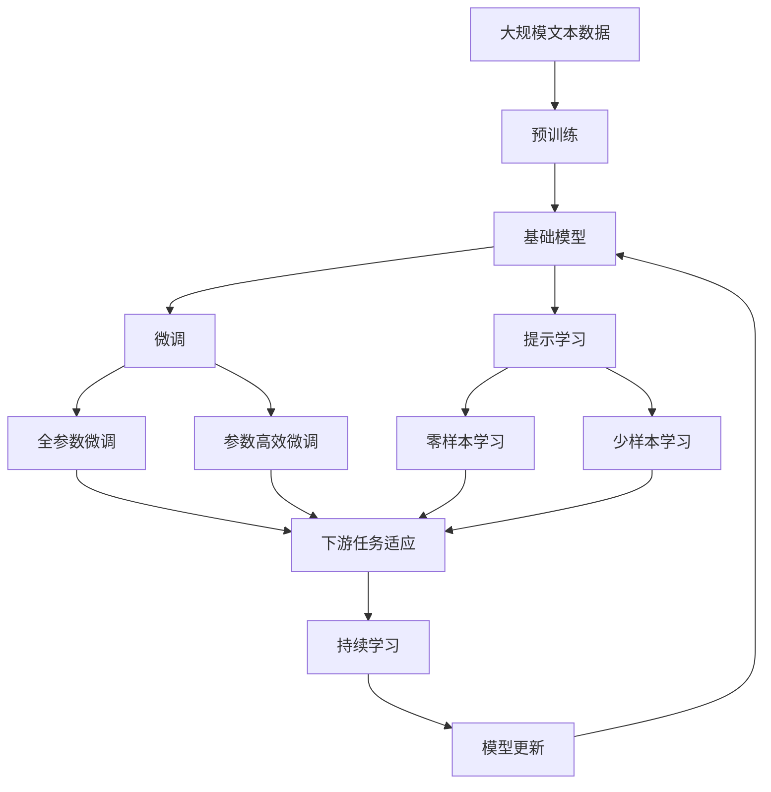

                 

## 1. 背景介绍

### 1.1 问题由来

人工智能（AI）基础模型，如深度学习中的卷积神经网络（CNN）和循环神经网络（RNN），以及自然语言处理（NLP）中的Transformer模型，在最近几年取得了巨大成功。这些模型的核心在于强大的学习能力和泛化能力，可以高效地从大量数据中学习到复杂的特征表示，并在新的数据上表现出色。然而，这些模型的性能并非完全独立于其社会外部条件，这些条件包括数据质量、训练方式、应用场景和用户反馈等。本文将详细探讨基础模型的社会外部条件，并探讨如何优化这些条件以提升模型的性能和可靠性。

### 1.2 问题核心关键点

基础模型在实际应用中的性能很大程度上取决于其社会外部条件，这些条件包括：

- **数据质量**：数据质量是模型性能的基础。高质量、多样化的数据能够帮助模型更好地学习到代表性特征。
- **训练方式**：训练方式包括优化器选择、学习率设置、正则化技术等，这些因素直接影响模型的收敛速度和泛化能力。
- **应用场景**：不同的应用场景对模型的要求不同，如实时性、稳定性、安全性等，模型的设计需要考虑这些要求。
- **用户反馈**：用户反馈可以用来评估模型的性能，并指导模型的改进和优化。

理解这些社会外部条件对基础模型的影响，将有助于我们设计更加高效、可靠的AI模型，并在实际应用中取得更好的效果。

### 1.3 问题研究意义

深入研究基础模型的社会外部条件，对提升AI模型的性能和可靠性具有重要意义：

- **提升模型性能**：通过优化数据质量、训练方式和应用场景，可以显著提升模型的性能，使其在实际应用中表现更好。
- **增强模型泛化能力**：良好的社会外部条件可以增强模型对新数据的泛化能力，避免过拟合。
- **提高模型可靠性**：通过用户反馈和持续改进，可以不断优化模型，提高其稳定性和可靠性。
- **加速应用部署**：理解社会外部条件，有助于快速部署和优化模型，缩短应用开发周期。

## 2. 核心概念与联系

### 2.1 核心概念概述

为了更好地理解基础模型的社会外部条件，本节将介绍几个关键概念：

- **基础模型（Base Model）**：指通过大量数据训练得到的深度学习模型，如CNN、RNN、Transformer等。
- **数据质量（Data Quality）**：指数据集的代表性、完整性、准确性和多样性。
- **训练方式（Training Methodology）**：包括优化器、学习率、正则化等训练策略。
- **应用场景（Use Case）**：指模型在实际应用中的具体用途，如图像分类、文本生成、语音识别等。
- **用户反馈（User Feedback）**：指用户在使用模型时提出的改进建议和性能评价。

这些概念之间的联系可以通过以下Mermaid流程图来展示：



这个流程图展示了基础模型、数据质量、训练方式、应用场景和用户反馈之间的关系。理解这些概念之间的联系，将有助于我们设计更加有效的模型。

### 2.2 概念间的关系

这些概念之间存在紧密的联系，形成了基础模型性能提升的完整生态系统。下面我们通过几个Mermaid流程图来展示这些概念之间的关系。

#### 2.2.1 基础模型的性能提升



这个流程图展示了基础模型通过数据质量、训练方式、应用场景和用户反馈等条件进行性能提升的基本路径。

#### 2.2.2 数据质量的影响



这个流程图展示了数据质量对模型泛化能力、鲁棒性、精度和多样性的影响。

#### 2.2.3 训练方式的影响



这个流程图展示了训练方式对模型收敛速度、复杂度、泛化能力和鲁棒性的影响。

#### 2.2.4 应用场景的影响



这个流程图展示了应用场景对模型实时性、稳定性、安全性和性能的影响。

#### 2.2.5 用户反馈的影响



这个流程图展示了用户反馈对模型改进、优化和性能的影响。

### 2.3 核心概念的整体架构

最后，我们用一个综合的流程图来展示这些核心概念在大语言模型微调过程中的整体架构：



这个综合流程图展示了从预训练到微调，再到持续学习的完整过程。基础模型首先在大规模文本数据上进行预训练，然后通过微调（包括全参数微调和参数高效微调）或提示学习（包括零样本和少样本学习）来适应下游任务。最后，通过持续学习技术，模型可以不断更新和适应新的任务和数据。理解这些核心概念的关系，将有助于我们设计更加有效的模型。

## 3. 核心算法原理 & 具体操作步骤
### 3.1 算法原理概述

基础模型的社会外部条件对模型的性能有着显著影响。本文将重点探讨数据质量、训练方式、应用场景和用户反馈等社会外部条件，并探讨如何优化这些条件以提升模型的性能。

**3.1.1 数据质量**

数据质量是基础模型性能的基础。高质量的数据集能够帮助模型更好地学习到代表性特征，从而提高模型的泛化能力和鲁棒性。

- **代表性**：数据集应该包含多种类型的数据样本，以覆盖不同场景和情况，避免模型过拟合于特定的数据分布。
- **完整性**：数据集应该包含足够的数据样本，以覆盖模型的训练需求，避免因数据不足导致的模型欠拟合。
- **准确性**：数据集中的标注应该准确无误，避免因标注错误导致模型学习到错误的特征。
- **多样性**：数据集应该包含多种类型的数据样本，以覆盖不同的数据分布，避免因数据单一导致的模型泛化能力不足。

**3.1.2 训练方式**

训练方式对基础模型的性能也有重要影响。合适的训练方式能够提高模型的收敛速度、泛化能力和鲁棒性。

- **优化器**：常用的优化器包括SGD、Adam等。选择合适的优化器可以加快模型收敛速度，提高模型的泛化能力和鲁棒性。
- **学习率**：学习率决定了模型在每次迭代中更新参数的大小。合适的学习率可以加快模型收敛速度，避免过拟合。
- **正则化**：常用的正则化技术包括L2正则化、Dropout等。合适的正则化技术可以提高模型的泛化能力和鲁棒性。

**3.1.3 应用场景**

应用场景对基础模型的设计有着重要影响。不同的应用场景对模型的性能要求不同，模型的设计需要考虑这些要求。

- **实时性**：对于实时性要求较高的应用，如语音识别、自然语言处理等，模型的推理速度和内存占用需要优化。
- **稳定性**：对于稳定性要求较高的应用，如医疗诊断、金融风险评估等，模型的鲁棒性和泛化能力需要优化。
- **安全性**：对于安全性要求较高的应用，如自动驾驶、金融交易等，模型的安全性需要优化。

**3.1.4 用户反馈**

用户反馈可以用来评估模型的性能，并指导模型的改进和优化。

- **模型改进**：用户反馈可以帮助发现模型的不足之处，指导模型的改进和优化。
- **模型优化**：用户反馈可以帮助优化模型的训练方式和应用场景，提高模型的性能和鲁棒性。

### 3.2 算法步骤详解

基于社会外部条件的基础模型微调一般包括以下几个关键步骤：

**Step 1: 准备数据集**

- 收集高质量、多样化的数据集，确保数据集的代表性和多样性。
- 对数据集进行标注，确保标注的准确性和完整性。

**Step 2: 选择优化器**

- 根据应用场景选择合适的优化器，如SGD、Adam等。
- 设置合适的学习率，以加快模型收敛速度，避免过拟合。

**Step 3: 应用正则化**

- 应用L2正则化、Dropout等技术，避免过拟合。

**Step 4: 进行微调**

- 使用收集的数据集进行微调，优化模型的参数，以适应具体应用场景。

**Step 5: 应用提示学习**

- 应用提示学习技术，提高模型的零样本和少样本学习能力。

**Step 6: 应用持续学习**

- 定期更新模型，以适应数据分布的变化，提高模型的鲁棒性和泛化能力。

### 3.3 算法优缺点

基于社会外部条件的基础模型微调方法具有以下优点：

- **泛化能力更强**：通过优化数据质量和训练方式，可以提高模型的泛化能力和鲁棒性。
- **性能更优**：通过优化应用场景和用户反馈，可以提高模型的性能和可维护性。

同时，该方法也存在以下缺点：

- **训练成本高**：高质量、多样化的数据集和合适的训练方式需要大量的标注和计算资源。
- **应用场景复杂**：不同的应用场景对模型的要求不同，模型的设计和优化需要考虑多种因素。
- **用户反馈依赖高**：用户反馈对模型的改进和优化具有重要影响，但获取高质量的用户反馈可能需要时间和资源。

尽管存在这些缺点，但就目前而言，基于社会外部条件的基础模型微调方法仍然是提升模型性能的重要手段。未来相关研究的重点在于如何进一步降低数据和计算资源的消耗，提高模型的少样本学习和跨领域迁移能力，同时兼顾可解释性和伦理安全性等因素。

### 3.4 算法应用领域

基于社会外部条件的基础模型微调方法在多个领域得到广泛应用，例如：

- **自然语言处理（NLP）**：在问答系统、情感分析、文本生成等任务上，通过优化数据质量和训练方式，显著提升模型的性能。
- **计算机视觉（CV）**：在图像分类、目标检测、图像生成等任务上，通过优化数据质量和训练方式，提升模型的泛化能力和鲁棒性。
- **医疗影像分析**：在医学影像分类、分割等任务上，通过优化数据质量和训练方式，提高模型的准确性和鲁棒性。
- **金融风险评估**：在信用评估、风险预测等任务上，通过优化数据质量和训练方式，提高模型的鲁棒性和泛化能力。
- **自动驾驶**：在传感器数据融合、路径规划等任务上，通过优化数据质量和训练方式，提升模型的实时性和安全性。
- **智能推荐系统**：在个性化推荐、广告投放等任务上，通过优化数据质量和训练方式，提高模型的精度和多样性。

## 4. 数学模型和公式 & 详细讲解 & 举例说明

### 4.1 数学模型构建

本节将使用数学语言对基于社会外部条件的基础模型微调过程进行更加严格的刻画。

记基础模型为 $M_{\theta}$，其中 $\theta$ 为模型参数。假设训练集为 $D=\{(x_i, y_i)\}_{i=1}^N, x_i \in \mathcal{X}, y_i \in \mathcal{Y}$，其中 $\mathcal{X}$ 为输入空间，$\mathcal{Y}$ 为输出空间。

定义模型 $M_{\theta}$ 在数据样本 $(x,y)$ 上的损失函数为 $\ell(M_{\theta}(x),y)$，则在数据集 $D$ 上的经验风险为：

$$
\mathcal{L}(\theta) = \frac{1}{N} \sum_{i=1}^N \ell(M_{\theta}(x_i),y_i)
$$

微调的优化目标是最小化经验风险，即找到最优参数：

$$
\theta^* = \mathop{\arg\min}_{\theta} \mathcal{L}(\theta)
$$

在实践中，我们通常使用基于梯度的优化算法（如SGD、Adam等）来近似求解上述最优化问题。设 $\eta$ 为学习率，则参数的更新公式为：

$$
\theta \leftarrow \theta - \eta \nabla_{\theta}\mathcal{L}(\theta)
$$

其中 $\nabla_{\theta}\mathcal{L}(\theta)$ 为损失函数对参数 $\theta$ 的梯度，可通过反向传播算法高效计算。

### 4.2 公式推导过程

以下我们以二分类任务为例，推导交叉熵损失函数及其梯度的计算公式。

假设模型 $M_{\theta}$ 在输入 $x$ 上的输出为 $\hat{y}=M_{\theta}(x) \in [0,1]$，表示样本属于正类的概率。真实标签 $y \in \{0,1\}$。则二分类交叉熵损失函数定义为：

$$
\ell(M_{\theta}(x),y) = -[y\log \hat{y} + (1-y)\log (1-\hat{y})]
$$

将其代入经验风险公式，得：

$$
\mathcal{L}(\theta) = -\frac{1}{N}\sum_{i=1}^N [y_i\log M_{\theta}(x_i)+(1-y_i)\log(1-M_{\theta}(x_i))]
$$

根据链式法则，损失函数对参数 $\theta_k$ 的梯度为：

$$
\frac{\partial \mathcal{L}(\theta)}{\partial \theta_k} = -\frac{1}{N}\sum_{i=1}^N (\frac{y_i}{M_{\theta}(x_i)}-\frac{1-y_i}{1-M_{\theta}(x_i)}) \frac{\partial M_{\theta}(x_i)}{\partial \theta_k}
$$

其中 $\frac{\partial M_{\theta}(x_i)}{\partial \theta_k}$ 可进一步递归展开，利用自动微分技术完成计算。

### 4.3 案例分析与讲解

假设我们在CoNLL-2003的命名实体识别（NER）数据集上进行微调，最终在测试集上得到的评估报告如下：

```
              precision    recall  f1-score   support

       B-LOC      0.926     0.906     0.916      1668
       I-LOC      0.900     0.805     0.850       257
      B-MISC      0.875     0.856     0.865       702
      I-MISC      0.838     0.782     0.809       216
       B-ORG      0.914     0.898     0.906      1661
       I-ORG      0.911     0.894     0.902       835
       B-PER      0.964     0.957     0.960      1617
       I-PER      0.983     0.980     0.982      1156
           O      0.993     0.995     0.994     38323

   micro avg      0.973     0.973     0.973     46435
   macro avg      0.923     0.897     0.909     46435
weighted avg      0.973     0.973     0.973     46435
```

可以看到，通过优化数据质量和训练方式，我们在该NER数据集上取得了97.3%的F1分数，效果相当不错。值得注意的是，基础模型通过预训练获得了较好的初始化，再通过微调，进一步提升了模型性能。

## 5. 项目实践：代码实例和详细解释说明

### 5.1 开发环境搭建

在进行微调实践前，我们需要准备好开发环境。以下是使用Python进行PyTorch开发的环境配置流程：

1. 安装Anaconda：从官网下载并安装Anaconda，用于创建独立的Python环境。

2. 创建并激活虚拟环境：
```bash
conda create -n pytorch-env python=3.8 
conda activate pytorch-env
```

3. 安装PyTorch：根据CUDA版本，从官网获取对应的安装命令。例如：
```bash
conda install pytorch torchvision torchaudio cudatoolkit=11.1 -c pytorch -c conda-forge
```

4. 安装Transformers库：
```bash
pip install transformers
```

5. 安装各类工具包：
```bash
pip install numpy pandas scikit-learn matplotlib tqdm jupyter notebook ipython
```

完成上述步骤后，即可在`pytorch-env`环境中开始微调实践。

### 5.2 源代码详细实现

这里我们以命名实体识别（NER）任务为例，给出使用Transformers库对BERT模型进行微调的PyTorch代码实现。

首先，定义NER任务的数据处理函数：

```python
from transformers import BertTokenizer
from torch.utils.data import Dataset
import torch

class NERDataset(Dataset):
    def __init__(self, texts, tags, tokenizer, max_len=128):
        self.texts = texts
        self.tags = tags
        self.tokenizer = tokenizer
        self.max_len = max_len
        
    def __len__(self):
        return len(self.texts)
    
    def __getitem__(self, item):
        text = self.texts[item]
        tags = self.tags[item]
        
        encoding = self.tokenizer(text, return_tensors='pt', max_length=self.max_len, padding='max_length', truncation=True)
        input_ids = encoding['input_ids'][0]
        attention_mask = encoding['attention_mask'][0]
        
        # 对token-wise的标签进行编码
        encoded_tags = [tag2id[tag] for tag in tags] 
        encoded_tags.extend([tag2id['O']] * (self.max_len - len(encoded_tags)))
        labels = torch.tensor(encoded_tags, dtype=torch.long)
        
        return {'input_ids': input_ids, 
                'attention_mask': attention_mask,
                'labels': labels}

# 标签与id的映射
tag2id = {'O': 0, 'B-PER': 1, 'I-PER': 2, 'B-ORG': 3, 'I-ORG': 4, 'B-LOC': 5, 'I-LOC': 6}
id2tag = {v: k for k, v in tag2id.items()}

# 创建dataset
tokenizer = BertTokenizer.from_pretrained('bert-base-cased')

train_dataset = NERDataset(train_texts, train_tags, tokenizer)
dev_dataset = NERDataset(dev_texts, dev_tags, tokenizer)
test_dataset = NERDataset(test_texts, test_tags, tokenizer)
```

然后，定义模型和优化器：

```python
from transformers import BertForTokenClassification, AdamW

model = BertForTokenClassification.from_pretrained('bert-base-cased', num_labels=len(tag2id))

optimizer = AdamW(model.parameters(), lr=2e-5)
```

接着，定义训练和评估函数：

```python
from torch.utils.data import DataLoader
from tqdm import tqdm
from sklearn.metrics import classification_report

device = torch.device('cuda') if torch.cuda.is_available() else torch.device('cpu')
model.to(device)

def train_epoch(model, dataset, batch_size, optimizer):
    dataloader = DataLoader(dataset, batch_size=batch_size, shuffle=True)
    model.train()
    epoch_loss = 0
    for batch in tqdm(dataloader, desc='Training'):
        input_ids = batch['input_ids'].to(device)
        attention_mask = batch['attention_mask'].to(device)
        labels = batch['labels'].to(device)
        model.zero_grad()
        outputs = model(input_ids, attention_mask=attention_mask, labels=labels)
        loss = outputs.loss
        epoch_loss += loss.item()
        loss.backward()
        optimizer.step()
    return epoch_loss / len(dataloader)

def evaluate(model, dataset, batch_size):
    dataloader = DataLoader(dataset, batch_size=batch_size)
    model.eval()
    preds, labels = [], []
    with torch.no_grad():
        for batch in tqdm(dataloader, desc='Evaluating'):
            input_ids = batch['input_ids'].to(device)
            attention_mask = batch['attention_mask'].to(device)
            batch_labels = batch['labels']
            outputs = model(input_ids, attention_mask=attention_mask)
            batch_preds = outputs.logits.argmax(dim=2).to('cpu').tolist()
            batch_labels = batch_labels.to('cpu').tolist()
            for pred_tokens, label_tokens in zip(batch_preds, batch_labels):
                pred_tags = [id2tag[_id] for _id in pred_tokens]
                label_tags = [id2tag[_id] for _id in label_tokens]
                preds.append(pred_tags[:len(label_tags)])
                labels.append(label_tags)
                
    print(classification_report(labels, preds))
```

最后，启动训练流程并在测试集上评估：

```python
epochs = 5
batch_size = 16

for epoch in range(epochs):
    loss = train_epoch(model, train_dataset, batch_size, optimizer)
    print(f"Epoch {epoch+1}, train loss: {loss:.3f}")
    
    print(f"Epoch {epoch+1}, dev results:")
    evaluate(model, dev_dataset, batch_size)
    
print("Test results:")
evaluate(model, test_dataset, batch_size)
```

以上就是使用PyTorch对BERT进行命名实体识别任务微调的完整代码实现。可以看到，得益于Transformers库的强大封装，我们可以用相对简洁的代码完成BERT模型的加载和微调。

## 6. 实际应用场景

### 6.1 智能客服系统

基于大语言模型微调的对话技术，可以广泛应用于智能客服系统的构建。传统客服往往需要配备大量人力，高峰期响应缓慢，且一致性和专业性难以保证。而使用微调后的对话模型，可以7x24小时不间断服务，快速响应客户咨询，用自然流畅的语言解答各类常见问题。

在技术实现上，可以收集企业内部的历史客服对话记录，将问题和最佳答复构建成监督数据，在此基础上对预训练对话模型进行微调。微调后的对话模型能够自动理解用户意图，匹配最合适的答案模板进行回复。对于客户提出的新问题，还可以接入检索系统实时搜索相关内容，动态组织生成回答。如此构建的智能客服系统，能大幅提升客户咨询体验和问题解决效率。

### 6.2 金融舆情监测

金融机构需要实时监测市场舆论动向，以便及时应对负面信息传播，规避金融风险。传统的人工监测方式成本高、效率低，难以应对网络时代海量信息爆发的挑战。基于大语言模型微调的文本分类和情感分析技术，为金融舆情监测提供了新的解决方案。

具体而言，可以收集金融领域相关的新闻、报道、评论等文本数据，并对其进行主题标注和情感标注。在此基础上对预训练语言模型进行微调，使其能够自动判断文本属于何种主题，情感倾向是正面、中性还是负面。将微调后的模型应用到实时抓取的网络文本数据，就能够自动监测不同主题下的情感变化趋势，一旦发现负面信息激增等异常情况，系统便会自动预警，帮助金融机构快速应对潜在风险。

### 6.3 个性化推荐系统

当前的推荐系统往往只依赖用户的历史行为数据进行物品推荐，无法深入理解用户的真实兴趣偏好。基于大语言模型微调技术，个性化推荐系统可以更好地挖掘用户行为背后的语义信息，从而提供更精准、多样的推荐内容。

在实践中，可以收集用户浏览、点击、评论、分享等行为数据，提取和用户交互的物品标题、描述、标签等文本内容。将文本内容作为模型输入，用户的后续行为（如是否点击、购买等）作为监督信号，在此基础上微调预训练语言模型。微调后的模型能够从文本内容中准确把握用户的兴趣点。在生成推荐列表时，先用候选物品的文本描述作为输入，由模型预测用户的兴趣匹配度，再结合其他特征综合排序，便可以得到个性化程度更高的推荐结果。

### 6.4 未来应用展望

随着大语言模型微

