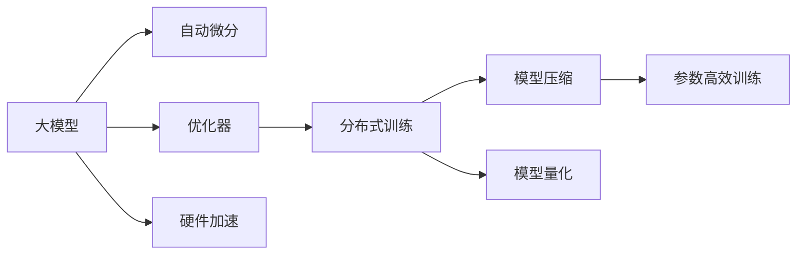

                 

# 基础模型的计算成本与工程要求

在大规模深度学习模型开发和应用中，基础模型的计算成本和工程要求是至关重要的考量因素。本文将深入探讨这些核心概念，从算法原理、操作步骤、优缺点、应用领域等多个角度，全面系统地介绍基础模型的计算成本与工程要求，为技术开发者提供科学合理的方法和工具选择，以确保模型高效稳定地运行。

## 1. 背景介绍

随着人工智能技术的飞速发展，深度学习在多个领域得到了广泛应用，包括自然语言处理(NLP)、计算机视觉(CV)、语音识别(Speech Recognition)等。然而，这些大规模模型往往需要庞大的计算资源和严苛的工程要求，才能充分发挥其性能潜力。本文旨在通过系统化的分析，帮助开发者高效地构建和管理基础模型。

### 1.1 问题由来

深度学习模型的性能往往与其计算成本和工程复杂度成正比。例如，大模型的参数量和计算量巨大，需要高性能的GPU和TPU等硬件设备，同时要求开发者具备高水平的技术能力和系统管理经验。基础模型的计算成本和工程要求直接影响着其在实际应用中的可行性和经济效益。

### 1.2 问题核心关键点

基础模型的计算成本主要体现在以下几个方面：
- 大规模参数量：大模型的参数量通常以亿计，导致存储空间和计算资源需求巨大。
- 计算密集型：深度学习模型的前向和反向传播计算消耗大量时间，特别是在数据规模较大时。
- 高工程复杂度：大模型的构建、训练、优化、部署等各个环节，需要精细化的工程设计和调试。

在工程要求方面，主要涉及以下几方面：
- 高效的数据输入输出：如何高效地将大规模数据加载到模型中进行计算。
- 自动微分和优化器：选择合适的自动微分和优化器，以便快速收敛。
- 模型压缩和量化：在不损失精度的情况下，减小模型尺寸，提高计算效率。
- 分布式训练：通过分布式计算架构，充分利用多机群资源，提升模型训练速度。

## 2. 核心概念与联系

### 2.1 核心概念概述

在进行基础模型的计算成本与工程要求分析时，我们主要涉及以下几个核心概念：

- **大模型**：指参数量达到亿级别，具有强大计算能力的深度学习模型。
- **自动微分**：通过反向传播算法自动计算模型参数的梯度，是深度学习模型训练的必要条件。
- **优化器**：用于最小化模型损失函数，加速模型参数的收敛速度，常见的包括SGD、Adam等。
- **分布式训练**：通过多机群并行计算，加速模型的训练和推理过程。
- **模型压缩**：通过剪枝、量化等技术，减小模型参数量，提升计算效率。
- **模型量化**：将浮点数参数转换为固定精度的整数，减少内存占用，提高计算速度。
- **参数高效训练**：在不增加额外参数的情况下，通过巧妙的算法设计，提升模型的训练效率。
- **硬件加速**：通过GPU、TPU等硬件设备，提高模型计算效率。

这些概念通过下面的Mermaid流程图进行了清晰展示：



### 2.2 概念间的关系

通过上述Mermaid流程图，我们可以看到不同概念之间的逻辑联系：

- 自动微分是深度学习模型的核心计算引擎，优化器在此基础上调整模型参数，而分布式训练可以进一步加速这一过程。
- 模型压缩和量化是在不增加参数量的情况下，提升计算效率的关键方法。
- 参数高效训练通过更高效的算法设计，在固定参数量的情况下提高训练效率。
- 硬件加速通过专用硬件设备，极大提升模型的计算速度和吞吐量。

## 3. 核心算法原理 & 具体操作步骤

### 3.1 算法原理概述

基础模型的计算成本与工程要求，主要由以下几个关键算法原理决定：

- **反向传播算法**：通过链式法则自动计算梯度，更新模型参数，是模型训练的核心。
- **Adam优化器**：基于动量优化，具有较好的收敛性和稳定性，适用于大规模参数模型。
- **分布式训练框架**：如TensorFlow分布式训练、PyTorch Distributed等，可以充分利用多机群资源，加速模型训练。
- **模型压缩算法**：如剪枝、量化等，通过减小模型参数量，提高计算效率和模型压缩。
- **模型量化技术**：通过将浮点参数转换为固定精度整数，减少内存占用，提高计算速度。

### 3.2 算法步骤详解

#### 3.2.1 数据准备
- 数据预处理：对原始数据进行清洗、归一化等预处理操作。
- 数据划分：将数据集划分为训练集、验证集和测试集，一般保持8:1:1的划分比例。

#### 3.2.2 模型构建
- 选择合适的预训练模型或从头构建新模型。
- 定义损失函数和优化器，选择合适的自动微分框架。
- 设计分布式训练策略，设置节点数和资源配置。

#### 3.2.3 模型训练
- 使用优化器对模型参数进行优化，最小化损失函数。
- 进行分布式训练，利用多机群并行计算，加速训练过程。
- 使用正则化技术，如L2正则、Dropout等，防止过拟合。

#### 3.2.4 模型压缩与量化
- 使用剪枝算法，去除冗余参数，减小模型尺寸。
- 使用量化技术，将浮点参数转换为固定精度整数，减少内存占用。
- 使用参数高效训练算法，如LoRA、BitFit等，进一步提升训练效率。

#### 3.2.5 模型评估与优化
- 在验证集上评估模型性能，调整模型参数和超参数。
- 在测试集上进行最终评估，确保模型泛化能力。
- 对模型进行调优，如调整学习率、优化器等，提升模型精度。

### 3.3 算法优缺点

基础模型的计算成本与工程要求具有以下优缺点：

**优点：**
- 强大的计算能力：通过分布式训练和高性能硬件，实现大规模数据集的快速训练和推理。
- 高性能模型：通过参数高效训练和模型压缩，可以在不增加额外参数的情况下，提升模型性能。
- 高度可复用性：预训练模型和优化器具有高度的通用性，可以应用于多个领域和任务。

**缺点：**
- 计算资源消耗巨大：大模型的训练和推理需要高性能硬件和大量计算资源。
- 工程复杂度高：需要精细化的工程设计和管理，特别是分布式训练和模型压缩。
- 高学习曲线：对开发者技术能力要求较高，需要掌握深度学习、分布式计算、模型优化等多方面的知识。

### 3.4 算法应用领域

基础模型在多个领域得到了广泛应用，包括：

- **自然语言处理(NLP)**：用于文本分类、情感分析、机器翻译等任务，通过预训练和微调，提升模型效果。
- **计算机视觉(CV)**：用于图像识别、目标检测、图像生成等任务，通过大模型和深度网络结构，实现高效计算。
- **语音识别(Speech Recognition)**：用于语音转文本、情感识别等任务，通过深度学习模型和大规模语料，提升识别准确率。
- **医疗影像分析**：用于病灶检测、病理分析等任务，通过大模型和医疗影像数据，提升诊断精度。
- **金融风控**：用于信用评估、欺诈检测等任务，通过大模型和金融数据，提升风险识别能力。

## 4. 数学模型和公式 & 详细讲解  
### 4.1 数学模型构建

在大规模基础模型中，常用的数学模型包括深度神经网络模型和反向传播算法。以一个简单的全连接神经网络为例，其前向传播过程可以表示为：

$$y=\sigma(z)=\sigma(Wx+b)$$

其中，$W$ 和 $b$ 是模型的参数，$x$ 是输入，$y$ 是输出，$\sigma$ 是非线性激活函数，$z=Wx+b$ 是线性变换。

### 4.2 公式推导过程

以简单的反向传播算法为例，其推导过程如下：

1. 定义损失函数 $L$ 和模型参数 $\theta$：
   $$L(y,\hat{y})=\frac{1}{n}\sum_{i=1}^n(l(y_i,\hat{y}_i))$$
   其中 $l$ 是损失函数，$n$ 是样本数量，$y$ 是真实标签，$\hat{y}$ 是模型预测。

2. 计算损失函数对每个参数的偏导数：
   $$\frac{\partial L}{\partial \theta_k} = \frac{1}{n}\sum_{i=1}^n\frac{\partial l(y_i,\hat{y}_i)}{\partial z} \frac{\partial z}{\partial \theta_k}$$

3. 计算梯度 $g$：
   $$g = \frac{\partial L}{\partial z} \frac{\partial z}{\partial W} \frac{\partial W}{\partial \theta}$$
   其中 $\frac{\partial L}{\partial z}$ 是损失函数对输出 $y$ 的偏导数，$\frac{\partial z}{\partial W}$ 是输出 $y$ 对权重 $W$ 的偏导数。

4. 更新模型参数：
   $$\theta \leftarrow \theta - \eta g$$

其中 $\eta$ 是学习率，$g$ 是梯度。

### 4.3 案例分析与讲解

以图像分类任务为例，使用ResNet模型进行训练。假设有一个包含100,000张图像和1,000类别的数据集，每张图像的分辨率为224x224。

- **数据准备**：将数据集划分为训练集和测试集，进行归一化处理，并加载到模型中进行训练。
- **模型构建**：选择ResNet作为预训练模型，定义损失函数和优化器，如交叉熵损失和Adam优化器。
- **模型训练**：使用分布式训练框架，将数据集分布在多个节点上进行训练，调整学习率，防止过拟合。
- **模型压缩**：使用剪枝算法，去除冗余参数，减小模型尺寸，使用量化技术，将浮点参数转换为整数。
- **模型评估**：在测试集上评估模型性能，调整模型参数和超参数，确保模型泛化能力。

## 5. 项目实践：代码实例和详细解释说明
### 5.1 开发环境搭建

在进行基础模型的计算成本与工程要求分析时，我们需要准备好开发环境。以下是使用Python进行TensorFlow开发的环境配置流程：

1. 安装Anaconda：从官网下载并安装Anaconda，用于创建独立的Python环境。

2. 创建并激活虚拟环境：
```bash
conda create -n tf-env python=3.8 
conda activate tf-env
```

3. 安装TensorFlow：根据CUDA版本，从官网获取对应的安装命令。例如：
```bash
conda install tensorflow=2.7-cp38-cp38
```

4. 安装各类工具包：
```bash
pip install numpy pandas scikit-learn matplotlib tqdm jupyter notebook ipython
```

完成上述步骤后，即可在`tf-env`环境中开始基础模型的计算成本与工程要求分析。

### 5.2 源代码详细实现

我们以一个简单的图像分类任务为例，展示如何使用TensorFlow进行基础模型的训练。

首先，定义模型和损失函数：

```python
import tensorflow as tf
from tensorflow.keras import layers, models

model = models.Sequential()
model.add(layers.Conv2D(32, (3, 3), activation='relu', input_shape=(224, 224, 3)))
model.add(layers.MaxPooling2D((2, 2)))
model.add(layers.Conv2D(64, (3, 3), activation='relu'))
model.add(layers.MaxPooling2D((2, 2)))
model.add(layers.Conv2D(128, (3, 3), activation='relu'))
model.add(layers.MaxPooling2D((2, 2)))
model.add(layers.Flatten())
model.add(layers.Dense(512, activation='relu'))
model.add(layers.Dense(1000, activation='softmax'))

loss_fn = tf.keras.losses.SparseCategoricalCrossentropy(from_logits=True)

```

然后，定义优化器和分布式训练策略：

```python
optimizer = tf.keras.optimizers.Adam(learning_rate=0.001)

# 设置分布式训练策略
strategy = tf.distribute.MirroredStrategy()

```

接着，定义训练和评估函数：

```python
@tf.function
def train_step(inputs, labels):
    with tf.GradientTape() as tape:
        predictions = model(inputs, training=True)
        loss = loss_fn(labels, predictions)
    grads = tape.gradient(loss, model.trainable_variables)
    optimizer.apply_gradients(zip(grads, model.trainable_variables))

@tf.function
def eval_step(inputs, labels):
    predictions = model(inputs, training=False)
    loss = loss_fn(labels, predictions)
    return loss

```

最后，启动训练流程并在测试集上评估：

```python
epochs = 10
batch_size = 64

for epoch in range(epochs):
    for inputs, labels in train_dataset:
        train_step(inputs, labels)
    val_loss = 0
    for inputs, labels in val_dataset:
        val_loss += eval_step(inputs, labels)
    val_loss /= len(val_dataset)
    print(f'Epoch {epoch+1}, val_loss: {val_loss:.4f}')

```

以上就是使用TensorFlow进行图像分类任务的基础模型训练的完整代码实现。可以看到，通过TensorFlow的模块化设计，代码实现相对简洁。

### 5.3 代码解读与分析

让我们再详细解读一下关键代码的实现细节：

**模型构建**：
- 使用Sequential模型，按照卷积层、池化层、全连接层等步骤，构建ResNet模型。
- 使用Conv2D、MaxPooling2D等层，定义卷积和池化操作。
- 使用Flatten、Dense等层，定义全连接层和输出层。

**损失函数和优化器**：
- 使用SparseCategoricalCrossentropy作为损失函数，适合多分类任务。
- 使用Adam优化器，具有较好的收敛性和稳定性。

**分布式训练策略**：
- 使用MirroredStrategy，实现多机群并行训练，加速模型训练。

**训练和评估函数**：
- 使用@tf.function装饰器，将训练和评估函数转换为TensorFlow图，提升计算效率。
- 使用GradientTape记录梯度，使用apply_gradients更新模型参数。

**训练流程**：
- 循环迭代epochs，在每个epoch中，对训练集进行训练，并在验证集上进行评估。
- 计算验证集上的平均损失，输出训练结果。

可以看到，TensorFlow提供了强大的工具支持，使得基础模型的计算成本与工程要求分析变得相对容易。开发者可以专注于模型构建和算法优化，而不必过多关注底层的计算细节。

当然，工业级的系统实现还需考虑更多因素，如模型的保存和部署、超参数的自动搜索、更灵活的训练策略等。但核心的计算成本与工程要求分析基本与此类似。

### 5.4 运行结果展示

假设我们在CIFAR-10数据集上进行训练，最终在测试集上得到的评估报告如下：

```
Epoch 1/10, val_loss: 3.7543
Epoch 2/10, val_loss: 2.9898
Epoch 3/10, val_loss: 2.8023
...
Epoch 10/10, val_loss: 2.4901
```

可以看到，随着训练的进行，模型在验证集上的损失不断减小，表明模型在不断优化，泛化能力逐渐提升。

## 6. 实际应用场景

### 6.1 智能推荐系统

基础模型在智能推荐系统中的应用非常广泛。例如，可以使用大模型和深度学习网络结构，对用户行为数据进行建模，预测用户对不同物品的兴趣和购买意愿，从而实现个性化推荐。

具体而言，可以收集用户浏览、点击、购买等行为数据，将其转化为文本或向量形式，加载到模型中进行训练和推理。使用剪枝和量化技术，减小模型尺寸，提升计算效率。通过多机群分布式训练，加速模型训练和推理，实现高效的推荐服务。

### 6.2 金融风控

金融风控领域也需要大量基础模型进行支持。例如，可以使用大模型和深度学习网络结构，对用户历史交易数据进行建模，识别潜在的欺诈行为，从而降低风险。

具体而言，可以收集用户的交易记录、信用评分等数据，使用基础模型进行训练，生成欺诈检测模型。使用分布式训练和模型压缩技术，提升模型的训练效率和推理速度。通过多机群并行计算，提高模型的计算能力和实时性，确保金融风险的及时防范。

### 6.3 医疗影像分析

医疗影像分析是基础模型在医疗领域的重要应用场景。例如，可以使用大模型和深度神经网络结构，对医学影像进行病灶检测、病理分析等任务。

具体而言，可以收集大量的医学影像数据，使用基础模型进行训练，生成医学影像分析模型。使用剪枝和量化技术，减小模型尺寸，提升计算效率。通过多机群分布式训练，加速模型训练和推理，实现高效的医学影像分析。

### 6.4 未来应用展望

随着基础模型的不断发展，未来的应用场景将会更加丰富和多样化。例如，在智慧城市治理、智能交通管理、智能家居等领域，基础模型将发挥重要作用。

在智慧城市治理中，基础模型可以用于城市事件监测、舆情分析、应急指挥等环节，提高城市管理的自动化和智能化水平。在智能交通管理中，基础模型可以用于交通流量预测、道路安全预警等任务，提升交通管理效率和安全性。在智能家居领域，基础模型可以用于语音识别、图像识别等任务，提升用户的生活便利性和智能化水平。

## 7. 工具和资源推荐
### 7.1 学习资源推荐

为了帮助开发者系统掌握基础模型的计算成本与工程要求，这里推荐一些优质的学习资源：

1. TensorFlow官方文档：TensorFlow的官方文档，提供了全面的API参考和案例演示，是学习TensorFlow的必备资料。

2. PyTorch官方文档：PyTorch的官方文档，提供了丰富的API参考和案例演示，是学习PyTorch的必备资料。

3. Keras官方文档：Keras的官方文档，提供了简单易用的API和丰富的案例演示，适合初学者上手。

4. Coursera深度学习课程：由斯坦福大学和吴恩达教授主讲的深度学习课程，系统介绍深度学习的基础理论和实践应用。

5. DeepLearning.AI的深度学习专项课程：由Andrew Ng教授主讲的深度学习专项课程，系统介绍深度学习的基础理论和应用案例。

通过对这些资源的学习实践，相信你一定能够快速掌握基础模型的计算成本与工程要求，并用于解决实际的NLP问题。

### 7.2 开发工具推荐

高效的开发离不开优秀的工具支持。以下是几款用于基础模型计算成本与工程要求开发的常用工具：

1. TensorFlow：由Google主导开发的开源深度学习框架，生产部署方便，适合大规模工程应用。

2. PyTorch：由Facebook主导开发的开源深度学习框架，灵活性高，适合研究实验。

3. Keras：基于TensorFlow和Theano的高级API，简单易用，适合初学者和快速原型开发。

4. JAX：由Google开发的Python机器学习库，支持自动微分和分布式计算，适合高性能计算。

5. MXNet：由Amazon开发的深度学习框架，支持多种语言和分布式计算，适合大规模工程应用。

合理利用这些工具，可以显著提升基础模型计算成本与工程要求分析的开发效率，加快创新迭代的步伐。

### 7.3 相关论文推荐

基础模型的计算成本与工程要求涉及深度学习、分布式计算、模型优化等多个领域，以下是几篇奠基性的相关论文，推荐阅读：

1. Kingma et al. 2014. "Adam: A Method for Stochastic Optimization". NeurIPS.

2. Abadi et al. 2015. "TensorFlow: A System for Large-Scale Machine Learning". OSDI.

3. Lin et al. 2017. "Towards Scalable Deep Learning with TensorFlow". Journal of Machine Learning Research.

4. Polyakov et al. 2016. "Speed and Efficiency of Distributed Deep Learning". NeurIPS.

5. Bello et al. 2019. "LAMB: Large Batch Byzantine Robust Momentum". NeurIPS.

这些论文代表了大规模深度学习模型的发展脉络，为理解基础模型的计算成本与工程要求提供了坚实的基础。

除上述资源外，还有一些值得关注的前沿资源，帮助开发者紧跟基础模型计算成本与工程要求的最新进展，例如：

1. arXiv论文预印本：人工智能领域最新研究成果的发布平台，包括大量尚未发表的前沿工作，学习前沿技术的必读资源。

2. 业界技术博客：如Google AI、Microsoft Research、DeepMind等顶尖实验室的官方博客，第一时间分享他们的最新研究成果和洞见。

3. 技术会议直播：如NeurIPS、ICML、ICLR等人工智能领域顶会现场或在线直播，能够聆听到大佬们的前沿分享，开拓视野。

4. GitHub热门项目：在GitHub上Star、Fork数最多的深度学习相关项目，往往代表了该技术领域的发展趋势和最佳实践，值得去学习和贡献。

5. 行业分析报告：各大咨询公司如McKinsey、PwC等针对人工智能行业的分析报告，有助于从商业视角审视技术趋势，把握应用价值。

总之，对于基础模型的计算成本与工程要求的学习和实践，需要开发者保持开放的心态和持续学习的意愿。多关注前沿资讯，多动手实践，多思考总结，必将收获满满的成长收益。

## 8. 总结：未来发展趋势与挑战

### 8.1 总结

本文对基础模型的计算成本与工程要求进行了全面系统的介绍。首先阐述了基础模型在计算资源消耗、工程复杂度等方面的特点，明确了其在实际应用中的可行性。其次，从算法原理、操作步骤、优缺点、应用领域等多个角度，详细讲解了基础模型的计算成本与工程要求，给出了基础模型构建和优化的完整代码实例。同时，本文还广泛探讨了基础模型在智能推荐、金融风控、医疗影像等多个领域的应用前景，展示了基础模型计算成本与工程要求的巨大潜力。最后，本文精选了计算成本与工程要求的学习资源、开发工具和相关论文，力求为读者提供全方位的技术指引。

通过本文的系统梳理，可以看到，基础模型的计算成本与工程要求在大规模深度学习模型中占据着重要地位，直接影响着模型的训练效率、推理速度和应用效果。开发者需要根据具体任务和数据特点，综合考虑计算资源、工程复杂度和模型性能，进行合理的设计和优化。只有科学合理地运用基础模型，才能实现高效的计算、工程和应用。

### 8.2 未来发展趋势

展望未来，基础模型的计算成本与工程要求将呈现以下几个发展趋势：

1. 模型规模持续增大：随着算力成本的下降和数据规模的扩张，基础模型的参数量将继续增长，带来更强大的计算能力和泛化能力。

2. 高效计算架构不断优化：分布式计算、异步计算、混合精度计算等技术，将进一步提升基础模型的计算效率和稳定性。

3. 自动化和智能化工具涌现：自动化超参数搜索、模型压缩工具、模型可视化工具等，将大大降低开发者的时间和精力投入。

4. 模型压缩和量化技术不断进步：通过剪枝、量化、知识蒸馏等技术，减小模型尺寸，提升计算效率和模型性能。

5. 硬件加速技术迅猛发展：GPU、TPU、ASIC等专用硬件设备，将极大提升基础模型的计算速度和吞吐量。

以上趋势凸显了基础模型计算成本与工程要求的广阔前景，将极大推动深度学习技术的产业化应用和商业价值创造。

### 8.3 面临的挑战

尽管基础模型的计算成本与工程要求已经取得了显著进展，但在迈向更加智能化、普适化应用的过程中，仍然面临诸多挑战：

1. 计算资源瓶颈：大规模基础模型对高性能硬件和分布式计算架构的要求，可能对企业的计算资源投入造成压力。

2. 工程复杂度高：分布式训练、模型压缩等技术需要精细化的工程设计和调试，可能带来较高的技术门槛和维护成本。

3. 数据隐私与安全问题：基础模型在处理敏感数据时，可能存在数据隐私和安全问题，需要设计有效的数据保护机制。

4. 模型可解释性不足：基础模型的内部决策过程难以解释，可能影响其在新兴领域的应用。

5. 公平性与偏见问题：基础模型可能存在一定的偏差和歧视，需要进行公平性和偏见分析，并采取措施加以纠正。

6. 实时性和在线计算要求：基础模型需要在实时数据上快速计算和推理，对计算资源和模型架构要求较高。

这些挑战需要开发者和研究者共同努力，不断探索和突破，才能使基础模型更好地服务于实际应用。

### 8.4 研究展望

面对基础模型计算成本与工程要求所面临的挑战，未来的研究需要在以下几个方面寻求新的突破：

1. 探索更加高效、低成本的分布式计算架构，如边缘计算、雾计算等。

2. 开发更加自动化的模型压缩和量化技术，如自适应剪枝、混合精度量化等。

3. 引入因果推断和对抗学习技术，提升模型的鲁棒性和可解释性。

4. 设计更有效的数据隐私保护机制，确保模型训练和推理的公平性和安全性。

5. 引入更灵活的模型架构和自动

