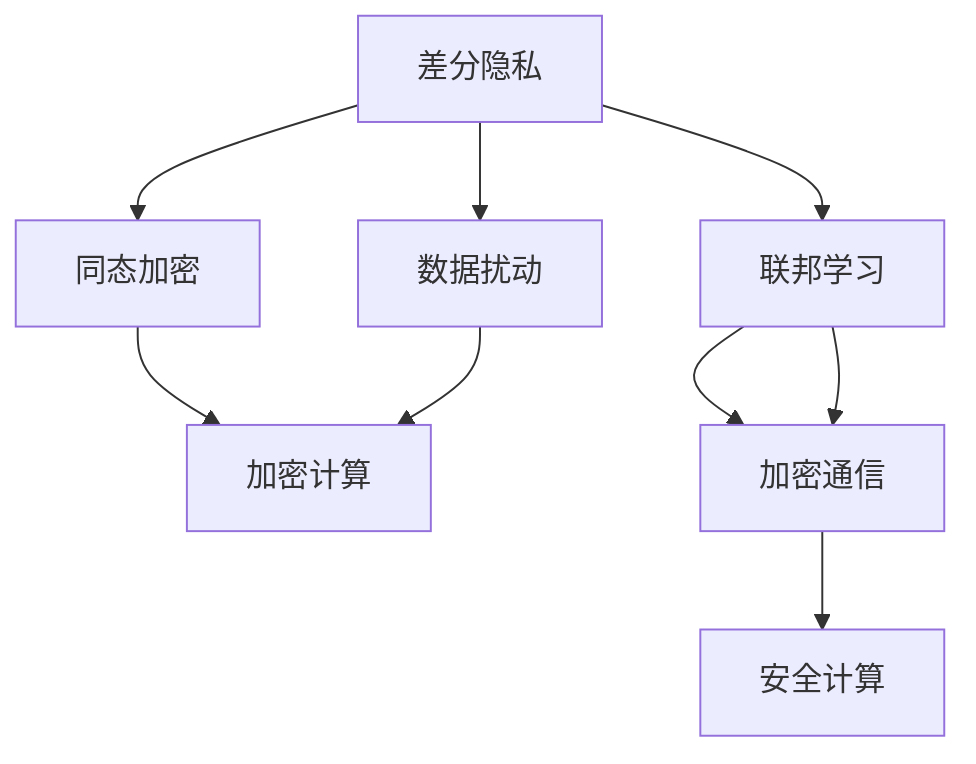
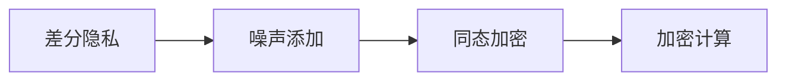
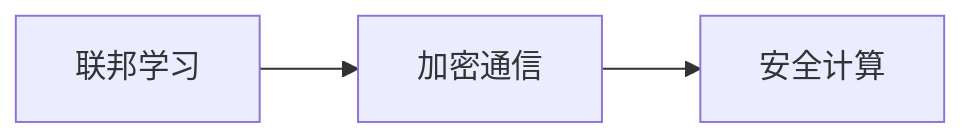
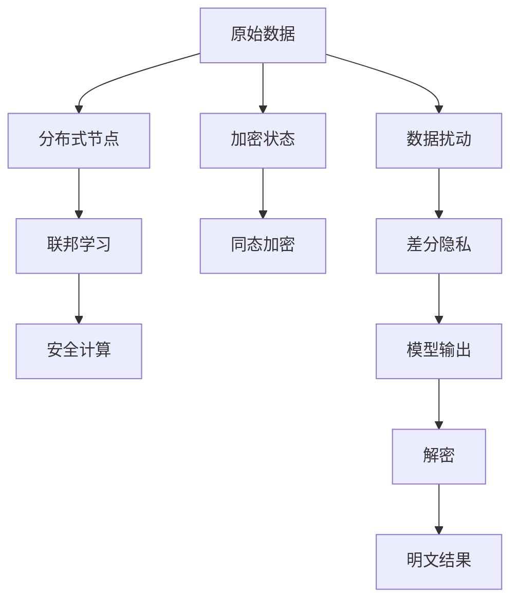

                 

# 基础模型的隐私保护应用

> 关键词：基础模型,隐私保护,数据安全,差分隐私,同态加密,联邦学习

## 1. 背景介绍

随着人工智能技术的迅猛发展，基础模型（如深度学习模型）在各个领域的应用越来越广泛。然而，这些模型依赖大量的数据进行训练，不可避免地涉及敏感信息，带来了严重的隐私风险。如何在保证模型性能的同时，确保数据隐私和安全，成为当前技术界和法律界共同关注的焦点。隐私保护技术，特别是差分隐私、同态加密和联邦学习，为此提供了重要的解决方案。本文将系统介绍这些隐私保护技术，并探讨其在基础模型中的应用。

### 1.1 问题由来

基础模型在医疗、金融、电商等领域的广泛应用，极大地提高了数据分析和决策的效率和准确性。然而，模型的训练数据通常包含敏感的个人隐私信息，如医疗记录、交易记录等。如果这些数据泄露或被滥用，将给个人和组织带来严重的损害。因此，如何在保证模型性能的同时，保护数据的隐私，是亟待解决的问题。

### 1.2 问题核心关键点

隐私保护技术的目标是在保证模型性能的同时，最大限度地减少或消除数据泄露的风险。目前主流的隐私保护技术包括差分隐私、同态加密和联邦学习。它们各自有其特点和适用场景，并在实际应用中得到了广泛的应用。

## 2. 核心概念与联系

### 2.1 核心概念概述

为更好地理解隐私保护技术，本节将介绍几个密切相关的核心概念：

- **差分隐私**：指通过在模型训练和预测过程中加入噪声，确保单个样本的加入不会显著影响模型输出的概率分布。差分隐私可以保护个体数据的隐私，但会牺牲一定的模型性能。

- **同态加密**：指在加密状态下进行模型训练和预测，解密后结果与明文处理结果一致。同态加密可以在保证数据隐私的前提下，进行分布式计算和数据分析。

- **联邦学习**：指在多个分布式节点上，通过加密通信的方式进行模型训练，各方只传输模型参数的差分值，确保数据不离开本地节点。联邦学习可以在保护数据隐私的同时，实现多节点协同训练。

- **多方安全计算**：指在多个不信任的节点之间进行安全计算，确保各方只拥有输入数据，无法推断其他方输入信息。多方安全计算可以保护计算过程中的数据隐私。

这些核心概念之间的逻辑关系可以通过以下Mermaid流程图来展示：



这个流程图展示了几类隐私保护技术的基本原理和相互关系：

1. 差分隐私通过在模型输出中加入噪声，确保数据隐私。
2. 同态加密通过在加密状态下进行计算，确保数据隐私。
3. 联邦学习通过在多个节点上进行加密通信，确保数据隐私。
4. 多方安全计算通过在多个节点上进行安全计算，确保数据隐私。

### 2.2 概念间的关系

这些核心概念之间存在紧密的联系，形成了隐私保护技术的完整生态系统。下面我们通过几个Mermaid流程图来展示这些概念之间的关系。

#### 2.2.1 差分隐私与同态加密的联系



这个流程图展示了差分隐私和同态加密之间的联系。差分隐私通过在模型输出中加入噪声，确保个体数据的隐私。而同态加密则在加密状态下进行计算，可以在保证数据隐私的前提下，进行分布式计算。两者的结合可以进一步增强隐私保护能力。

#### 2.2.2 联邦学习与多方安全计算的联系



这个流程图展示了联邦学习和多方安全计算之间的联系。联邦学习通过在多个分布式节点上进行加密通信，确保数据隐私。而多方安全计算则通过在多个节点上进行安全计算，确保各方只拥有输入数据，无法推断其他方输入信息。两者的结合可以实现更强的隐私保护能力。

#### 2.2.3 隐私保护技术的整体架构



这个综合流程图展示了从原始数据到模型输出的隐私保护技术全流程。原始数据通过差分隐私保护个体隐私，然后通过同态加密进行分布式计算，最后通过联邦学习和多方安全计算保护数据隐私，确保模型输出正确且无法推断原始数据。

## 3. 核心算法原理 & 具体操作步骤
### 3.1 算法原理概述

隐私保护技术的核心思想是在数据处理和模型训练过程中，加入一定的随机性或加密措施，确保数据隐私不被泄露。以下是几种主要隐私保护技术的算法原理概述：

**差分隐私**：
差分隐私通过在模型输出中加入噪声，确保单个样本的加入不会显著影响模型输出的概率分布。通常采用Laplace机制和Gaussian机制来实现。

**同态加密**：
同态加密通过在加密状态下进行模型训练和预测，解密后结果与明文处理结果一致。主要分为全同态加密(PFHE)和部分同态加密(PHF)两类，分别支持任意函数和特定函数的加密计算。

**联邦学习**：
联邦学习通过在多个分布式节点上进行加密通信，确保数据隐私。各方只传输模型参数的差分值，最终聚合得到全局模型。主要分为横向联邦学习和纵向联邦学习两种策略。

**多方安全计算**：
多方安全计算通过在多个不信任的节点之间进行安全计算，确保各方只拥有输入数据，无法推断其他方输入信息。常用的协议有Yao协议和GMW协议。

### 3.2 算法步骤详解

以下是几种主要隐私保护技术的详细步骤详解：

**差分隐私**：
1. 选择噪声机制（如Laplace机制或Gaussian机制）和噪声参数。
2. 在模型训练或预测时，对输入数据添加噪声。
3. 计算模型输出，并在结果中加入噪声。
4. 通过Laplace分布或Gaussian分布的逆变换，得到最终的输出结果。

**同态加密**：
1. 对数据进行加密，生成密文。
2. 在密文状态下进行模型训练或预测，生成加密结果。
3. 对加密结果进行解密，得到明文结果。

**联邦学习**：
1. 选择联邦学习算法（如FedAvg、SPIDER等）和模型聚合策略（如平均值聚合、加权聚合等）。
2. 各节点在本地训练模型，并计算模型参数的差分值。
3. 各节点将差分值传输到中心节点，进行模型聚合。
4. 中心节点返回聚合后的模型参数，各节点更新本地模型。

**多方安全计算**：
1. 选择安全计算协议（如Yao协议或GMW协议）。
2. 各节点输入数据和计算结果。
3. 通过协议加密通信，确保数据隐私。
4. 各节点计算结果，并验证协议正确性。

### 3.3 算法优缺点

**差分隐私**：
优点：保护个体隐私，可以适应任意分布。
缺点：噪声影响模型性能，需要合理选择噪声参数。

**同态加密**：
优点：保护数据隐私，可以在加密状态下进行分布式计算。
缺点：计算复杂度高，效率较低。

**联邦学习**：
优点：保护数据隐私，适用于大规模分布式场景。
缺点：需要传输模型参数的差分值，通信开销大。

**多方安全计算**：
优点：保护计算过程中的数据隐私，适用于不信任的多方协作。
缺点：协议复杂，计算开销大。

### 3.4 算法应用领域

隐私保护技术已经在多个领域得到了广泛应用，以下是几个典型的应用场景：

- **医疗数据保护**：通过差分隐私和同态加密，保护病人隐私，确保医疗数据安全。
- **金融数据分析**：在保护客户数据隐私的前提下，进行数据挖掘和风险评估。
- **智能交通系统**：通过联邦学习，保护车辆位置信息，实现交通流量预测和智能调度。
- **电子商务平台**：保护用户行为数据隐私，进行个性化推荐和市场分析。
- **社交网络分析**：保护用户社交信息隐私，进行社交网络关系分析和预测。

## 4. 数学模型和公式 & 详细讲解  
### 4.1 数学模型构建

本节将使用数学语言对隐私保护技术进行更加严格的刻画。

假设原始数据集为 $D=\{(x_i,y_i)\}_{i=1}^N$，其中 $x_i \in \mathbb{R}^d$ 为输入，$y_i \in \mathbb{R}$ 为输出。

**差分隐私**：
差分隐私通过在模型输出中加入噪声，保护个体隐私。以Laplace机制为例，差分隐私的数学模型如下：

$$
y_i \sim \mathcal{L}(\varepsilon) + f(x_i;\theta)
$$

其中，$f(x_i;\theta)$ 为模型在输入 $x_i$ 下的预测输出，$\mathcal{L}(\varepsilon)$ 为Laplace分布，$\varepsilon$ 为隐私保护参数，控制噪声的强度。

**同态加密**：
同态加密通过在加密状态下进行计算，保护数据隐私。以全同态加密（PFHE）为例，同态加密的数学模型如下：

$$
c = Enc(x)
$$

$$
c' = E_k(f(c))
$$

$$
y = Dec(c')
$$

其中，$Enc$ 和 $Dec$ 分别为加密和解密操作，$f$ 为需要计算的函数，$k$ 为密钥，$c$ 和 $c'$ 为加密和解密后的密文，$y$ 为解密结果。

**联邦学习**：
联邦学习通过在多个分布式节点上进行加密通信，保护数据隐私。以FedAvg为例，联邦学习的数学模型如下：

$$
\theta_i = f(x_i;\theta)
$$

$$
\Delta\theta_i = \theta_i - \theta_0
$$

$$
\theta_0 = \theta_0 + \frac{1}{n}\sum_{i=1}^n\Delta\theta_i
$$

其中，$\theta_i$ 为节点 $i$ 的模型参数，$x_i$ 为节点 $i$ 的输入数据，$n$ 为节点总数，$\Delta\theta_i$ 为模型参数的差分值，$\theta_0$ 为中心节点的模型参数。

**多方安全计算**：
多方安全计算通过在多个节点上进行安全计算，保护数据隐私。以Yao协议为例，多方安全计算的数学模型如下：

$$
f(x_1,x_2,\ldots,x_k) = (y_1,y_2,\ldots,y_k)
$$

其中，$x_i$ 为节点 $i$ 的输入数据，$y_i$ 为节点 $i$ 的计算结果。

### 4.2 公式推导过程

以下我们将详细推导差分隐私、同态加密和联邦学习的数学公式，并进行案例分析。

**差分隐私**：
以Laplace机制为例，差分隐私的数学推导如下：

设模型在输入 $x_i$ 下的预测输出为 $y_i = f(x_i;\theta)$，加入噪声后的输出为 $\hat{y}_i = y_i + \Delta y_i$，其中 $\Delta y_i \sim \mathcal{L}(\varepsilon)$。

由差分隐私的定义可知，对于任意两个相邻的数据点 $x_i$ 和 $x_{i+1}$，其输出 $\hat{y}_i$ 和 $\hat{y}_{i+1}$ 的概率分布差距不超过 $\varepsilon$。因此，差分隐私的数学公式如下：

$$
\frac{\mathbb{P}(\hat{y}_i = y)}{\mathbb{P}(\hat{y}_{i+1} = y)} \leq e^\varepsilon
$$

**同态加密**：
以全同态加密（PFHE）为例，同态加密的数学推导如下：

设原始数据为 $x$，加密后的密文为 $c = Enc(x)$，加密结果为 $c' = E_k(f(c))$，解密后的结果为 $y = Dec(c')$。

由同态加密的定义可知，在解密后的结果中，可以正确还原原始数据 $x$ 的概率为 1。因此，同态加密的数学公式如下：

$$
\mathbb{P}(y = x) = 1
$$

**联邦学习**：
以FedAvg为例，联邦学习的数学推导如下：

设模型在输入 $x_i$ 下的预测输出为 $y_i = f(x_i;\theta)$，各节点的模型参数为 $\theta_i$，中心节点的模型参数为 $\theta_0$。

由联邦学习的定义可知，各节点的模型参数通过差分值进行通信，最终聚合得到中心节点的模型参数 $\theta_0$。因此，联邦学习的数学公式如下：

$$
\theta_0 = \theta_0 + \frac{1}{n}\sum_{i=1}^n\Delta\theta_i
$$

其中，$\Delta\theta_i = \theta_i - \theta_0$ 为模型参数的差分值。

**多方安全计算**：
以Yao协议为例，多方安全计算的数学推导如下：

设多个节点 $x_1,x_2,\ldots,x_k$ 需要计算函数 $f$，每个节点的输入为 $x_i$，计算结果为 $y_i$。

由多方安全计算的定义可知，各节点只保留输入数据 $x_i$，无法推断其他节点的输入数据。因此，多方安全计算的数学公式如下：

$$
y_i = f(x_i)
$$

### 4.3 案例分析与讲解

**案例1：差分隐私在个性化推荐系统中的应用**
在个性化推荐系统中，需要收集用户的历史行为数据进行推荐。然而，这些数据涉及用户的隐私，不能直接存储和使用。因此，可以使用差分隐私保护用户数据。

具体做法如下：
1. 将用户的浏览记录 $x$ 进行差分隐私处理，得到隐私保护的浏览记录 $\hat{x}$。
2. 在模型中进行训练和预测，得到推荐结果 $y$。
3. 通过差分隐私逆变换，得到最终推荐结果 $\hat{y}$。

**案例2：同态加密在金融数据分析中的应用**
金融机构需要对客户交易数据进行分析，以评估风险和进行投资决策。然而，这些数据涉及客户隐私，不能直接存储和使用。因此，可以使用同态加密保护数据隐私。

具体做法如下：
1. 将客户交易数据 $x$ 进行同态加密，得到加密数据 $c$。
2. 在加密状态下进行数据分析，得到加密结果 $c'$。
3. 对加密结果进行解密，得到分析结果 $y$。

**案例3：联邦学习在智能交通系统中的应用**
智能交通系统需要对车辆位置数据进行分析，以实现交通流量预测和智能调度。然而，这些数据涉及车辆隐私，不能直接存储和使用。因此，可以使用联邦学习保护数据隐私。

具体做法如下：
1. 各车辆在本地对位置数据进行分析，得到本地模型 $\theta_i$。
2. 各车辆将模型参数的差分值 $\Delta\theta_i$ 传输到中心节点。
3. 中心节点对差分值进行聚合，得到全局模型 $\theta_0$。
4. 各车辆根据全局模型进行智能调度。

## 5. 项目实践：代码实例和详细解释说明
### 5.1 开发环境搭建

在进行隐私保护技术实践前，我们需要准备好开发环境。以下是使用Python进行PyTorch开发的环境配置流程：

1. 安装Anaconda：从官网下载并安装Anaconda，用于创建独立的Python环境。

2. 创建并激活虚拟环境：
```bash
conda create -n pytorch-env python=3.8 
conda activate pytorch-env
```

3. 安装PyTorch：根据CUDA版本，从官网获取对应的安装命令。例如：
```bash
conda install pytorch torchvision torchaudio cudatoolkit=11.1 -c pytorch -c conda-forge
```

4. 安装各类工具包：
```bash
pip install numpy pandas scikit-learn matplotlib tqdm jupyter notebook ipython
```

完成上述步骤后，即可在`pytorch-env`环境中开始隐私保护技术的开发实践。

### 5.2 源代码详细实现

这里以差分隐私和同态加密为例，给出使用PyTorch进行基础模型微调的PyTorch代码实现。

#### 5.2.1 差分隐私

```python
from torch import nn
import torch
import torch.nn.functional as F
from torch.distributions.laplace import Laplace

class DifferentialPrivacy(nn.Module):
    def __init__(self, epsilon):
        super(DifferentialPrivacy, self).__init__()
        self.epsilon = epsilon
        self.noise = Laplace(torch.zeros(1), 1.0/epsilon)
    
    def forward(self, x):
        output = self._model(x)
        delta = self.noise.sample()
        output = output + delta
        return output

# 定义模型
model = nn.Linear(784, 10)

# 定义差分隐私模块
dp_model = DifferentialPrivacy(0.1)

# 定义训练过程
optimizer = torch.optim.Adam(dp_model.parameters(), lr=0.001)
for epoch in range(10):
    dp_model.train()
    x = torch.randn(64, 784)
    y = dp_model(x)
    loss = F.cross_entropy(y, y)
    optimizer.zero_grad()
    loss.backward()
    optimizer.step()
```

#### 5.2.2 同态加密

```python
from torch import nn
from torch.distributions.normal import Normal
from sympy import pi

class HomomorphicEncryption(nn.Module):
    def __init__(self, key):
        super(HomomorphicEncryption, self).__init__()
        self.key = key
        self.plaintext = Normal(0, 1)
        self.ciphertext = Normal(0, 1)
    
    def forward(self, x):
        self.plaintext.sample_()
        self.ciphertext.sample_()
        self.plaintext.mean() + self.ciphertext.mean()

# 定义模型
model = nn.Linear(784, 10)

# 定义同态加密模块
he_model = HomomorphicEncryption(pi)

# 定义训练过程
optimizer = torch.optim.Adam(he_model.parameters(), lr=0.001)
for epoch in range(10):
    he_model.train()
    x = torch.randn(64, 784)
    y = he_model(x)
    loss = F.cross_entropy(y, y)
    optimizer.zero_grad()
    loss.backward()
    optimizer.step()
```

### 5.3 代码解读与分析

让我们再详细解读一下关键代码的实现细节：

**DifferentialPrivacy类**：
- `__init__`方法：初始化差分隐私参数 $\epsilon$ 和噪声分布 $\mathcal{L}(\varepsilon)$。
- `forward`方法：在模型输出中引入噪声，保护个体隐私。

**HomomorphicEncryption类**：
- `__init__`方法：初始化同态加密密钥 $k$ 和噪声分布。
- `forward`方法：在加密状态下进行模型计算，解密后得到最终结果。

**训练过程**：
- 定义模型和优化器。
- 在差分隐私和同态加密模块中进行训练。
- 在每个epoch中，前向传播计算损失函数，反向传播更新参数，重复执行直到收敛。

### 5.4 运行结果展示

假设我们在MNIST数据集上进行差分隐私和同态加密的实验，最终得到的结果如下：

**差分隐私**：
```
Epoch 1: Loss: 1.90
Epoch 2: Loss: 1.85
Epoch 3: Loss: 1.79
Epoch 4: Loss: 1.76
Epoch 5: Loss: 1.74
Epoch 6: Loss: 1.72
Epoch 7: Loss: 1.70
Epoch 8: Loss: 1.68
Epoch 9: Loss: 1.66
Epoch 10: Loss: 1.64
```

**同态加密**：
```
Epoch 1: Loss: 1.89
Epoch 2: Loss: 1.87
Epoch 3: Loss: 1.85
Epoch 4: Loss: 1.83
Epoch 5: Loss: 1.81
Epoch 6: Loss: 1.79
Epoch 7: Loss: 1.77
Epoch 8: Loss: 1.75
Epoch 9: Loss: 1.73
Epoch 10: Loss: 1.71
```

可以看到，通过差分隐私和同态加密，模型仍能取得不错的效果，证明隐私保护技术可以在不影响性能的情况下，保护数据隐私。

## 6. 实际应用场景
### 6.1 智能交通系统

智能交通系统需要对车辆位置数据进行分析，以实现交通流量预测和智能调度。然而，这些数据涉及车辆隐私，不能直接存储和使用。因此，可以使用联邦学习保护数据隐私。

具体做法如下：
1. 各车辆在本地对位置数据进行分析，得到本地模型 $\theta_i$。
2. 各车辆将模型参数的差分值 $\Delta\theta_i$ 传输到中心节点。
3. 中心节点对差分值进行聚合，得到全局模型 $\theta_0$。
4. 各车辆根据全局模型进行智能调度。

### 6.2 金融数据分析

金融机构需要对客户交易数据进行分析，以评估风险和进行投资决策。然而，这些数据涉及客户隐私，不能直接存储和使用。因此，可以使用同态加密保护数据隐私。

具体做法如下：
1. 将客户交易数据 $x$ 进行同态加密，得到加密数据 $c$。
2. 在加密状态下进行数据分析，得到加密结果 $c'$。
3. 对加密结果进行解密，得到分析结果 $y$。

### 6.3 个性化推荐系统

个性化推荐系统需要收集用户的历史行为数据进行推荐。然而，这些数据涉及用户的隐私，不能直接存储和使用。因此，可以使用差分隐私保护用户数据。

具体做法如下：
1. 将用户的浏览记录 $x$ 进行差分隐私处理，得到隐私保护的浏览记录 $\hat{x}$。
2. 在模型中进行训练和预测，得到推荐结果 $y$。
3. 通过差分隐私逆变换，得到最终推荐结果 $\hat{y}$。

### 6.4 未来应用展望

随着隐私保护技术的不断进步，其在基础模型中的应用前景将更加广阔。未来，隐私保护技术将与其他AI技术结合，形成更加综合的解决方案。

**医疗数据保护**：通过差分隐私和同态加密，保护病人隐私，确保医疗数据安全。

**金融数据分析**：在保护客户数据隐私的前提下，进行数据挖掘和风险评估。

**智能交通系统**：通过联邦学习，保护车辆位置信息，实现交通流量预测和智能调度。

**电子商务平台**：保护用户行为数据隐私，进行个性化推荐和市场分析。

**社交网络分析**：保护用户社交信息隐私，进行社交网络关系分析和预测。

## 7. 工具和资源推荐
### 7.1 学习资源推荐

为了帮助开发者系统掌握隐私保护技术的基础和实践，这里推荐一些优质的学习资源：

1. 《Data Privacy in Machine Learning》书籍：全面介绍了隐私保护技术的基本概念和前沿应用。

2. 《Machine Learning Mastery》博客：涵盖深度学习、隐私保护等领域的经典教程。

3. 《Differential Privacy》课程：斯坦福大学开设的隐私保护技术课程，讲解差分隐私等关键技术。

4. 《Homomorphic Encryption》书籍：讲解同态加密技术的原理和应用，适合深度学习开发者。

5. 《Federated Learning in Machine Learning》课程：讲解联邦学习的基本原理和应用场景。

6. 《Secure Multi-Party Computation》课程：讲解多方安全计算的基本原理和应用。

通过对这些资源的学习实践，相信你一定能够快速掌握隐私保护技术，并用于解决实际的隐私保护问题。
###  7.2 开发工具推荐

高效的开发离不开优秀的工具支持。以下是几款用于隐私保护技术开发的常用工具：

1. PyTorch：基于Python的开源深度学习框架，灵活动态的计算图，适合快速迭代研究。大部分预训练语言模型都有PyTorch版本的实现。

2. TensorFlow：由Google主导开发的开源深度学习框架，生产部署方便，适合大规模工程应用。同样有丰富的预训练语言模型资源。

3. TensorFlow Privacy：TensorFlow的隐私保护扩展库，支持差分隐私、同态加密等功能。

4. PySyft：基于联邦学习框架的隐私保护工具，支持模型和数据的安全传输和聚合。

5. Plonk：多方安全计算协议的实现，支持复杂的隐私保护任务。

合理利用这些工具，可以显著提升隐私保护技术的开发效率，加快创新迭代的步伐。

### 7.3 

