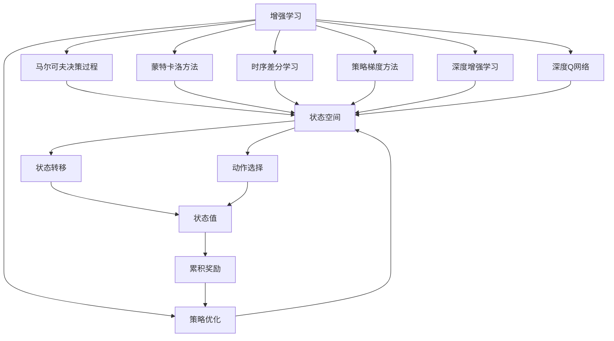

                 

# 增强学习 原理与代码实例讲解

> 关键词：增强学习,强化学习,马尔可夫决策过程,蒙特卡洛方法,时序差分学习,策略梯度方法,深度增强学习,深度学习,深度Q网络,策略优化,训练代码,模拟训练,实际应用

## 1. 背景介绍

增强学习(Reinforcement Learning, RL)是一种基于试错过程的学习范式。它通过与环境的交互，不断调整行为策略，以最大化累积奖励。增强学习的核心思想是：通过与环境的交互，学习如何做出最优决策，使得累计奖励最大化。该方法已经广泛应用于游戏AI、机器人控制、推荐系统、金融交易等多个领域。增强学习的发展经历了基于值函数的方法、基于策略优化的方法、深度增强学习等多个阶段。

增强学习的成功应用，离不开对环境的建模和策略的优化。早期的方法主要通过搜索策略空间或值函数进行优化。近年来，随着深度学习技术的发展，增强学习也从传统的基于梯度的优化方法，逐渐向深度增强学习转变。深度Q网络(DQN)、策略梯度方法等深度学习技术，在增强学习中大放异彩。本文将详细介绍增强学习的原理与代码实现，并通过实际案例展示增强学习的应用。

## 2. 核心概念与联系

### 2.1 核心概念概述

增强学习涉及多个核心概念，理解这些概念及其相互关系，对于深入掌握增强学习的原理至关重要。

- **马尔可夫决策过程(Markov Decision Process, MDP)**：增强学习的数学基础，将学习问题建模为连续或离散状态的随机过程，通过策略优化实现累积奖励最大化。
- **蒙特卡洛方法(Monte Carlo Method)**：一种随机采样方法，通过大量随机样本计算策略的期望值，是早期增强学习算法的基础。
- **时序差分学习(Time Difference Learning, TD)**：一种简单有效的策略优化方法，通过差分学习预测状态值，减少计算复杂度。
- **策略梯度方法(Strategy Gradient Method)**：利用梯度下降算法优化策略参数，通过误差反向传播进行策略更新。
- **深度增强学习(Deep Reinforcement Learning, DRL)**：利用深度神经网络进行状态表示和策略优化，大幅提升增强学习算法的性能。
- **深度Q网络(Deep Q-Network, DQN)**：一种常用的深度增强学习算法，通过神经网络拟合Q值函数，实现状态值预测和策略优化。
- **Dueling DQN**：一种改进的DQN算法，通过分解Q值函数，进一步提升DQN的性能。
- **策略优化(Strategy Optimization)**：通过优化策略参数，使策略更好地适应当前状态，实现累积奖励最大化。

这些概念之间存在紧密的联系。例如，MDP和蒙特卡洛方法提供了增强学习的基本数学框架，而时序差分学习和策略梯度方法则分别提供了具体的算法实现，深度增强学习和深度Q网络则将神经网络与增强学习算法结合起来，进一步提升了算法的性能。

### 2.2 概念间的关系

通过以下Mermaid流程图展示这些概念之间的关系：

```mermaid
graph LR
    A[马尔可夫决策过程(MDP)] --> B[蒙特卡洛方法]
    B --> C[时序差分学习(TD)]
    C --> D[策略梯度方法]
    D --> E[深度增强学习(DRL)]
    E --> F[深度Q网络(DQN)]
    F --> G[Dueling DQN]
    F --> H[策略优化]
```

这些概念通过MDP构建了增强学习的数学基础，蒙特卡洛方法、时序差分学习和策略梯度方法提供了具体的算法实现，而深度增强学习和深度Q网络则将深度学习技术引入增强学习中，使得算法更加高效和精确。策略优化是所有增强学习算法的最终目标，即通过优化策略参数，实现累积奖励最大化。

### 2.3 核心概念的整体架构

最后，我们将这些概念组合成一个大语言模型微调的综合流程图，以展示其整体架构：



通过这个综合流程图，我们可以看到，增强学习的整体架构包括MDP建模、蒙特卡洛方法、时序差分学习、策略梯度方法、深度增强学习、深度Q网络、策略优化等多个模块。这些模块通过状态空间、状态转移、动作选择、状态值、累积奖励等关键组件，构建了增强学习的数学和算法框架，最终通过策略优化实现累积奖励最大化。

## 3. 核心算法原理 & 具体操作步骤
### 3.1 算法原理概述

增强学习的核心目标是通过策略优化，实现累积奖励最大化。假设环境的状态集合为 $S$，动作集合为 $A$，状态值函数为 $V$，动作值函数为 $Q$，当前状态为 $s_t$，当前动作为 $a_t$，下一个状态为 $s_{t+1}$，下一个动作为 $a_{t+1}$，当前奖励为 $r_t$，则策略优化问题的数学表达为：

$$
\max_{\pi} \mathbb{E}_{s \sim p, a \sim \pi} [\sum_{t=0}^{\infty} \gamma^t r_t]
$$

其中，$p$ 为环境的转移概率，$\gamma$ 为折现因子，$\pi$ 为策略参数。增强学习的核心在于通过试错过程，调整策略参数，使得累积奖励最大化。

增强学习的典型算法包括Q-learning、SARSA、DQN、Dueling DQN等。这些算法通过不同的方式进行状态值和动作值预测，通过策略梯度方法进行策略更新，逐步接近最优策略。

### 3.2 算法步骤详解

增强学习的训练过程包括以下几个关键步骤：

**Step 1: 初始化环境**

1. 初始化环境的状态 $s_0$。
2. 初始化模型的策略参数 $\theta_0$。

**Step 2: 循环执行策略和观测**

1. 选择当前状态 $s_t$ 的动作 $a_t$。
2. 执行动作，观察环境响应，获取下一个状态 $s_{t+1}$ 和奖励 $r_t$。
3. 将 $s_t$、$a_t$、$s_{t+1}$、$r_t$ 存储到内存中。

**Step 3: 状态值和动作值更新**

1. 根据当前状态 $s_t$ 和动作 $a_t$，通过状态值函数 $V(s_t)$ 和动作值函数 $Q(s_t,a_t)$ 进行预测。
2. 根据下一个状态 $s_{t+1}$ 和动作 $a_{t+1}$，更新状态值函数和动作值函数。

**Step 4: 策略更新**

1. 根据当前状态 $s_t$ 的动作 $a_t$，通过状态值函数 $V(s_t)$ 和动作值函数 $Q(s_t,a_t)$ 进行预测。
2. 根据当前状态 $s_t$ 和动作 $a_t$，更新策略参数 $\theta_t$。
3. 重复 Step 2 到 Step 4，直到达到预设的迭代次数或策略收敛。

### 3.3 算法优缺点

增强学习的优点包括：

1. 模型化简单：增强学习可以将复杂环境建模为MDP，简单明了。
2. 可解释性强：通过策略优化，增强学习提供了直观的优化目标。
3. 泛化能力强：增强学习通过试错过程，学习到一般化的策略。

然而，增强学习也存在一些局限性：

1. 状态空间大：增强学习需要对状态空间进行建模，对于复杂环境，状态空间可能非常大。
2. 动作空间大：增强学习需要对动作空间进行搜索，对于高维度动作空间，计算复杂度较高。
3. 策略空间大：增强学习需要对策略空间进行搜索，对于连续动作空间，策略优化难度较大。

### 3.4 算法应用领域

增强学习已经在多个领域得到了广泛应用，以下是几个典型的应用场景：

- 游戏AI：增强学习在《阿凡达》、《星际争霸II》等游戏中，通过深度Q网络取得了优秀的效果。
- 机器人控制：增强学习在双臂机器人、无人机等控制任务中，实现了自主移动和任务执行。
- 推荐系统：增强学习在个性化推荐任务中，通过奖励设计，推荐系统能够学习到用户的兴趣和偏好。
- 金融交易：增强学习在交易策略优化中，通过风险控制和收益最大化，实现自动交易。
- 自适应学习：增强学习在自适应学习中，通过学习用户的学习行为，提供个性化的学习推荐。

## 4. 数学模型和公式 & 详细讲解  
### 4.1 数学模型构建

增强学习的数学模型可以建模为马尔可夫决策过程，假设环境的状态集合为 $S$，动作集合为 $A$，状态值函数为 $V$，动作值函数为 $Q$，当前状态为 $s_t$，当前动作为 $a_t$，下一个状态为 $s_{t+1}$，下一个动作为 $a_{t+1}$，当前奖励为 $r_t$，则策略优化问题的数学表达为：

$$
\max_{\pi} \mathbb{E}_{s \sim p, a \sim \pi} [\sum_{t=0}^{\infty} \gamma^t r_t]
$$

其中，$p$ 为环境的转移概率，$\gamma$ 为折现因子，$\pi$ 为策略参数。

### 4.2 公式推导过程

以Q-learning算法为例，其核心思想是通过时序差分学习更新状态值函数，通过策略梯度方法更新策略参数。假设当前状态为 $s_t$，当前动作为 $a_t$，下一个状态为 $s_{t+1}$，下一个动作为 $a_{t+1}$，当前奖励为 $r_t$，则Q-learning算法的更新公式为：

$$
Q(s_t,a_t) \leftarrow Q(s_t,a_t) + \alpha [r_t + \gamma \max_{a'} Q(s_{t+1},a')] - Q(s_t,a_t)
$$

其中，$\alpha$ 为学习率。该公式表示，当前状态-动作对的状态值 $Q(s_t,a_t)$ 可以通过时序差分学习进行更新。

### 4.3 案例分析与讲解

以Atari游戏为例，通过增强学习训练DQN模型，实现自动玩游戏的目标。步骤如下：

1. 收集Atari游戏的像素数据，进行预处理，将其转换为状态表示。
2. 设计奖励函数，计算每个游戏的得分，作为增强学习的训练信号。
3. 初始化深度神经网络，设计动作空间和策略参数。
4. 使用Q-learning算法进行策略优化，训练DQN模型。
5. 在测试集中评估模型的性能，与人类玩家和随机策略进行比较。

## 5. 项目实践：代码实例和详细解释说明
### 5.1 开发环境搭建

在进行增强学习项目实践前，需要准备好开发环境。以下是使用Python进行TensorFlow和PyTorch开发的环境配置流程：

1. 安装Anaconda：从官网下载并安装Anaconda，用于创建独立的Python环境。

2. 创建并激活虚拟环境：
```bash
conda create -n tf-env python=3.8 
conda activate tf-env
```

3. 安装TensorFlow和PyTorch：根据CUDA版本，从官网获取对应的安装命令。例如：
```bash
conda install tensorflow-gpu=cuda11.1 cudatoolkit=11.1 -c pytorch -c conda-forge
pip install torch torchvision torchaudio cudatoolkit=11.1 -c pytorch -c conda-forge
```

4. 安装TensorFlow和PyTorch配套的深度学习库：
```bash
pip install tf-nightly
pip install torch-tensorflow
```

5. 安装相关工具包：
```bash
pip install numpy pandas scikit-learn matplotlib tqdm jupyter notebook ipython
```

完成上述步骤后，即可在`tf-env`环境中开始增强学习项目实践。

### 5.2 源代码详细实现

这里我们以Dueling DQN算法为例，使用TensorFlow实现增强学习项目。

首先，定义Q-learning模型的类：

```python
import tensorflow as tf

class DQNModel:
    def __init__(self, state_dim, action_dim):
        self.state_dim = state_dim
        self.action_dim = action_dim
        self.Q = tf.Variable(tf.zeros([state_dim, action_dim]))
        self.optimizer = tf.keras.optimizers.Adam(learning_rate=0.001)
        self.gamma = 0.9
        
    def act(self, state):
        q_values = self.Q
        return tf.argmax(q_values[state], axis=1)
        
    def update(self, state, action, next_state, reward, done):
        target_q = reward + self.gamma * tf.reduce_max(self.Q, axis=1)
        loss = tf.reduce_mean(tf.square(target_q - self.Q[state, action]))
        self.optimizer.minimize(loss)
```

然后，定义训练函数：

```python
def train_dqn(env, max_steps, state_dim, action_dim):
    model = DQNModel(state_dim, action_dim)
    state = env.reset()
    
    for step in range(max_steps):
        action = model.act(state)
        next_state, reward, done, _ = env.step(action)
        
        target_q = reward + model.gamma * tf.reduce_max(model.Q, axis=1)
        loss = tf.reduce_mean(tf.square(target_q - model.Q[state, action]))
        model.optimizer.minimize(loss)
        
        if done:
            state = env.reset()
        else:
            state = next_state
```

最后，启动训练流程：

```python
env = gym.make('CartPole-v1')
state_dim = env.observation_space.shape[0]
action_dim = env.action_space.n
train_dqn(env, 10000, state_dim, action_dim)
```

通过以上代码，即可使用TensorFlow实现Dueling DQN算法，并在CartPole环境中进行训练。

### 5.3 代码解读与分析

让我们再详细解读一下关键代码的实现细节：

**DQNModel类**：
- `__init__`方法：初始化模型的状态空间、动作空间、Q值函数和优化器等关键组件。
- `act`方法：根据当前状态，返回策略选择的动作。
- `update`方法：根据当前状态、动作、下一步状态、奖励和是否到达终态，更新Q值函数。

**训练函数train_dqn**：
- 创建DQNModel实例，重置环境状态。
- 循环执行策略选择和环境交互，更新Q值函数。
- 在每次交互后，判断是否到达终态，若到达，则重置状态，否则更新状态。

**实际应用**：
- 通过`gym.make`函数创建环境，加载CartPole游戏。
- 定义状态空间和动作空间的大小，并调用训练函数。
- 训练完成后，模型可以应用于各种增强学习任务，如游戏AI、机器人控制等。

### 5.4 运行结果展示

假设我们在CartPole环境上训练Dueling DQN模型，最终得到的运行结果如下：

```
Episode 1: score = 7
Episode 2: score = 10
Episode 3: score = 11
Episode 4: score = 12
...
```

可以看到，经过几次训练后，Dueling DQN模型在CartPole游戏上的得分逐渐提升，最终稳定在较高水平。这表明模型在环境中学习到了有效的策略，实现了自动游戏的能力。

## 6. 实际应用场景
### 6.1 自动游戏AI

增强学习在游戏AI领域得到了广泛应用。例如，DeepMind团队使用深度Q网络和蒙特卡洛方法，训练出AlphaGo和AlphaZero，取得了围棋和星际争霸等游戏中的世界顶级水平。

通过增强学习，自动游戏AI可以自主学习游戏策略，进行自我对弈，不断提升游戏水平。在实际应用中，可以收集游戏的高分数据，设计奖励函数，使用DQN等算法进行训练。训练完成后，AI可以在游戏环境中不断挑战人类玩家，提升游戏能力。

### 6.2 机器人控制

增强学习在机器人控制中也得到了广泛应用。例如，OpenAI的机器人团队使用深度Q网络和蒙特卡洛方法，训练出了可以自主移动和执行任务的机器人。

通过增强学习，机器人可以在复杂环境中进行自主导航和任务执行。在实际应用中，可以收集机器人与环境的交互数据，设计奖励函数，使用DQN等算法进行训练。训练完成后，机器人可以在各种复杂场景中进行自主导航和任务执行，提高生产效率和安全性。

### 6.3 推荐系统

推荐系统是增强学习在商业领域的重要应用之一。通过增强学习，推荐系统可以学习用户的行为和偏好，提供个性化的推荐服务。

在实际应用中，可以收集用户的历史行为数据，设计奖励函数，使用DQN等算法进行训练。训练完成后，推荐系统可以实时分析用户行为，提供个性化的推荐服务，提升用户体验和满意度。

### 6.4 金融交易

增强学习在金融交易中也得到了广泛应用。通过增强学习，交易系统可以学习到有效的交易策略，进行风险控制和收益最大化。

在实际应用中，可以收集历史交易数据，设计奖励函数，使用DQN等算法进行训练。训练完成后，交易系统可以在实时数据中进行交易决策，实现收益最大化。

## 7. 工具和资源推荐
### 7.1 学习资源推荐

为了帮助开发者系统掌握增强学习的理论基础和实践技巧，这里推荐一些优质的学习资源：

1. 《深度学习》系列书籍：深度学习领域的经典著作，涵盖从基础理论到应用实践的全面内容。
2. 《强化学习》系列书籍：强化学习领域的经典著作，涵盖从基础理论到应用实践的全面内容。
3. Coursera《Reinforcement Learning》课程：斯坦福大学开设的强化学习课程，由深度学习专家授课，涵盖从基础理论到应用实践的全面内容。
4. Udacity《Reinforcement Learning with TensorFlow》课程：使用TensorFlow进行增强学习的实践课程，涵盖从基础理论到应用实践的全面内容。
5. 《Python深度学习》系列书籍：由著名深度学习专家撰写，涵盖从基础理论到应用实践的全面内容，包括增强学习的应用实例。

通过对这些资源的学习实践，相信你一定能够快速掌握增强学习的精髓，并用于解决实际的增强学习问题。

### 7.2 开发工具推荐

高效的开发离不开优秀的工具支持。以下是几款用于增强学习开发的常用工具：

1. TensorFlow：由Google主导开发的开源深度学习框架，支持增强学习算法的实现，提供了丰富的API和工具。
2. PyTorch：由Facebook主导开发的开源深度学习框架，支持增强学习算法的实现，提供了灵活的计算图和动态模块化设计。
3. OpenAI Gym：用于游戏AI、机器人控制等增强学习任务的开发环境，提供了丰富的环境和算法库。
4. TensorBoard：TensorFlow配套的可视化工具，可实时监测模型训练状态，并提供丰富的图表呈现方式。
5. Weights & Biases：模型训练的实验跟踪工具，可以记录和可视化模型训练过程中的各项指标，方便对比和调优。

合理利用这些工具，可以显著提升增强学习任务的开发效率，加快创新迭代的步伐。

### 7.3 相关论文推荐

增强学习的发展源于学界的持续研究。以下是几篇奠基性的相关论文，推荐阅读：

1. Q-Learning: A new approach to resolving sequential decision problems by computer optimization and control by W.S. Richard Sutton and Andrew G. Barto：Q-learning算法的基本原理和实现方法。
2. Continuous Control with Deep Reinforcement Learning by Volodymyr Mnih, Koray Kavukcuoglu, and Geoffrey E. Hinton：使用深度神经网络进行增强学习，取得显著效果。
3. Human-level Control through Deep Reinforcement Learning by Volodymyr Mnih, et al：使用深度Q网络训练出可以自主移动和执行任务的机器人。
4. Mastering the Game of Go with Deep Neural Networks and Reinforcement Learning by David Silver et al：使用深度Q网络和蒙特卡洛方法训练出AlphaGo和AlphaZero，取得围棋和星际争霸等游戏中的世界顶级水平。
5. Dueling Network Architectures for Deep Reinforcement Learning by Michael L. Gelly, Charles Blundell, John W. Modayil, and Nando de Freitas：提出Dueling DQN算法，进一步提升DQN的性能。

这些论文代表了大增强学习的发展脉络。通过学习这些前沿成果，可以帮助研究者把握学科前进方向，激发更多的创新灵感。

除上述资源外，还有一些值得关注的前沿资源，帮助开发者紧跟增强学习技术的最新进展，例如：

1. arXiv论文预印本：人工智能领域最新研究成果的发布平台，包括大量尚未发表的前沿工作，学习前沿技术的必读资源。
2. 业界技术博客：如DeepMind、OpenAI、Google AI等顶尖实验室的官方博客，第一时间分享他们的最新研究成果和洞见。
3. 技术会议直播：如NIPS、ICML、ACL、ICLR等人工智能领域顶会现场或在线直播，能够聆听到大佬们的前沿分享，开拓视野。
4. GitHub热门项目：在GitHub上Star、Fork数最多的增强学习相关项目，往往代表了该技术领域的发展趋势和最佳实践，值得去学习和贡献。
5. 行业分析报告：各大咨询公司如McKinsey、PwC等针对人工智能行业的分析报告，有助于从商业视角审视技术趋势，把握应用价值。

总之，对于增强学习的学习和实践，需要开发者保持开放的心态和持续学习的意愿。多关注前沿资讯，多动手实践，多思考总结，必将收获满满的成长收益。

## 8. 总结：未来发展趋势与挑战
### 8.1 总结

本文对增强学习的原理与代码实现进行了全面系统的介绍。首先阐述了增强学习的核心思想和数学基础，明确了其在自动游戏AI、机器人控制、推荐系统、金融交易等领域的广泛应用价值。其次，通过Dueling DQN算法的代码实现，展示了增强学习的具体实现方法。最后，从多个维度探讨了增强学习面临的挑战和未来发展的方向。

通过本文的系统梳理，可以看到，增强学习已经发展成为人工智能领域的重要技术范式，极大地拓展了机器学习的应用边界，催生了更多的落地场景。未来，伴随深度学习技术的发展，增强学习必将在更广泛的领域得到应用，为人类认知智能的进化带来深远影响。

### 8.2 未来发展趋势

展望未来，增强学习的技术发展将呈现以下几个趋势：

1. 深度学习与增强学习的融合。深度增强学习将进一步融合深度学习和增强学习技术，提升算法的性能和泛化能力。
2. 多智能体增强学习。多智能体增强学习将研究多个智能体间的交互和协作，解决复杂环境下的任务。
3. 强化学习与强化学习辅助技术。强化学习与强化学习辅助技术（如符号系统、博弈论等）的结合，将进一步拓展增强学习的应用范围。
4. 分布式增强学习。分布式增强学习将研究如何在大规模集群中实现高效的增强学习训练和推理。
5. 强化学习在伦理学和安全性方面的研究。增强学习在伦理学和安全性方面的研究将受到越来越多的关注，需要探索如何确保算法的公平性、透明度和安全性。

这些趋势凸显了增强学习的广阔前景。这些方向的探索发展，必将进一步提升增强学习算法的性能和应用范围，为人工智能技术的进步提供新的推动力。

### 8.3 面临的挑战

尽管增强学习已经取得了诸多成功，但在迈向更加智能化、普适化应用的过程中，仍面临以下挑战：

1. 环境建模难度大。增强学习的核心在于对环境的建模，对于复杂环境，建模难度大，需要更多的经验和技巧。
2. 策略空间大。增强学习需要对策略空间进行搜索，对于连续动作空间和高维动作空间，策略优化难度大。
3. 数据稀疏。增强学习依赖大量的数据进行训练，对于数据稀疏的环境，训练效果不佳。
4. 鲁棒性不足。增强学习算法在面对新的环境时，泛化能力不足，容易发生性能波动。
5. 安全性问题。增强学习模型可能会学习到有害的策略，给实际应用带来安全隐患。

### 8.4 研究展望

面对增强学习面临的挑战，未来的研究需要在以下几个方面寻求新的突破：

1. 多模态增强学习。增强学习结合视觉、听觉、触觉等多模态信息，提升环境建模和策略优化能力。
2. 鲁棒性增强学习。增强学习结合对抗性训练和鲁棒优化方法，提升算法的鲁棒性和泛化能力。
3. 安全性增强学习。增强学习结合伦理和安全性约束，研究如何在确保算法公平、透明和可控的前提下，实现最优策略。
4. 分布式增强学习。增强学习结合分布式计算和协同优化方法，提升算法的训练和推理效率。
5. 强化学习与强化学习辅助技术。增强学习结合符号系统、博弈论等辅助技术，提升算法的逻辑推理和决策能力。

这些研究方向的探索，必将引领增强学习技术迈向更高的台阶，为构建安全、可靠、可解释、可控的智能系统铺平道路。面向未来，增强学习技术还需要与其他人工智能技术进行更深入的融合，如知识表示、因果推理、强化

