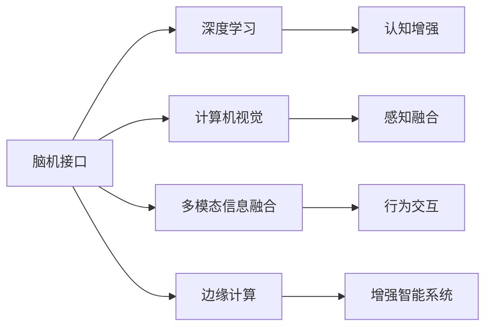

                 

# 增强智能：人机协同，拓展认知新领域

> 关键词：增强智能,人机协同,认知增强,深度学习,脑机接口,BMI,脑-机融合,神经网络,计算机视觉,多模态信息融合,边缘计算,移动边缘计算,物联网(IoT),人工智能伦理

## 1. 背景介绍

### 1.1 问题由来
随着深度学习技术的发展，人工智能（AI）在视觉、语音、语言等领域取得了显著进展。然而，这些技术更多依赖于大量标注数据和计算资源，难以充分发挥人的认知能力。增强智能（Augmented Intelligence, AI）应运而生，通过将人类的知识与AI技术相结合，拓展认知边界，实现人机协同的新型智能形式。

增强智能强调在AI技术的基础上，充分利用人类的直觉、经验、情感等优势，提升系统的决策能力、交互性和可解释性。其核心在于构建人机交互的桥梁，使AI系统能够理解并模拟人类的认知过程。

### 1.2 问题核心关键点
增强智能的核心在于实现人机协同，具体包括：

1. **认知增强**：通过AI技术增强人类的认知能力，如记忆、注意力、理解力等。
2. **感知融合**：整合视觉、听觉、触觉等多模态信息，提供更丰富的感知体验。
3. **行为交互**：构建自然语言、手势、表情等交互方式，提升用户满意度。
4. **知识迁移**：实现知识、经验的跨领域和跨学科迁移，推动技术创新。
5. **伦理保障**：确保增强智能的公平性、透明性和安全性，保护用户隐私和权益。

增强智能的目标是构建一个更加智能、透明、可信赖的系统，使其能够辅助人类进行决策、设计、制造等高复杂度任务，从而提升工作效率和创新能力。

### 1.3 问题研究意义
增强智能的研究具有重要的理论和实践意义：

1. **推动技术进步**：增强智能将AI技术与人类的认知能力相结合，突破现有技术的瓶颈，推动技术向更智能化、人性化方向发展。
2. **提升工作效率**：通过增强智能系统的辅助，人类能够更快、更准确地完成任务，提高工作效率和生活质量。
3. **促进跨领域创新**：增强智能将不同领域的知识和技能进行整合，推动跨学科研究和技术创新。
4. **实现社会价值**：增强智能有助于解决社会问题，如医疗、教育、环境保护等，带来社会效益和经济价值。

## 2. 核心概念与联系

### 2.1 核心概念概述

为了更好地理解增强智能的概念，我们首先需要介绍几个关键概念：

1. **认知增强（Cognitive Enhancement）**：指通过AI技术增强人类的认知功能，如记忆、注意力、理解力等。
2. **感知融合（Perceptual Fusion）**：将视觉、听觉、触觉等多模态信息进行整合，提供更丰富的感知体验。
3. **行为交互（Behavioral Interaction）**：构建自然语言、手势、表情等交互方式，提升系统的可操作性和用户体验。
4. **知识迁移（Knowledge Transfer）**：实现知识、经验的跨领域和跨学科迁移，推动技术创新。
5. **伦理保障（Ethical Guarantee）**：确保增强智能的公平性、透明性和安全性，保护用户隐私和权益。

这些概念通过脑机接口（Brain-Computer Interface, BMI）技术得以实现。脑机接口使计算机能够直接接收大脑信号，进而控制计算机或其他设备，实现了人机信息的高效交互。

### 2.2 概念间的关系

脑机接口技术是实现增强智能的核心手段。通过脑机接口，增强智能系统能够获取人类大脑的活动信息，并将其转化为计算机可理解和执行的指令。这种技术不仅能够提升认知功能，还能实现感知融合和行为交互。

脑机接口技术包括非侵入式（如EEG、fMRI等）和侵入式（如脑电图、肌电图等）两种方式。非侵入式脑机接口通过头皮或头颅上的传感器捕获大脑信号，侵入式则将电极直接植入大脑，获取更精准的脑电信号。

脑机接口技术与深度学习、计算机视觉、多模态信息融合、边缘计算等技术相结合，构成了增强智能的完整架构。这些技术共同作用，实现了人机协同的智能形式，推动了认知增强、感知融合、行为交互和知识迁移的进步。

以下是一个Mermaid流程图，展示了脑机接口技术与其他关键技术的联系：



通过这个流程图，我们可以清晰地看到脑机接口技术在增强智能系统中的核心地位，以及与深度学习、计算机视觉、多模态信息融合、边缘计算等技术之间的紧密联系。

### 2.3 核心概念的整体架构

脑机接口技术通过以下步骤，实现了增强智能系统的构建：

1. **信号采集**：通过EEG、fMRI等设备，捕获人类大脑的活动信号。
2. **信号处理**：使用深度学习模型，将原始脑电信号转换为数字信号。
3. **特征提取**：提取脑电信号中的关键特征，用于模型训练。
4. **模型训练**：使用神经网络模型，训练特征提取器。
5. **行为生成**：通过解码器，将提取的特征转换为计算机可执行的指令。
6. **执行反馈**：将行为执行结果反馈给大脑，优化模型参数。

以上步骤构成了一个完整的脑机接口系统，实现了人机信息的高效交互和协同工作。

## 3. 核心算法原理 & 具体操作步骤
### 3.1 算法原理概述

脑机接口技术基于深度学习模型，通过信号处理、特征提取和模型训练等步骤，实现脑电信号的数字化和行为解码。其主要算法原理包括：

1. **信号预处理**：去除噪声、基线漂移等干扰，保留有用的信号特征。
2. **特征提取**：使用卷积神经网络（CNN）或长短期记忆网络（LSTM）等模型，提取脑电信号中的关键特征。
3. **行为解码**：使用循环神经网络（RNN）或注意力机制等模型，将提取的特征解码为计算机可执行的指令。

脑机接口技术的核心在于构建一个高效的特征提取和行为解码模型，使其能够在实时场景中准确地解码大脑信号，并执行相应的行为。

### 3.2 算法步骤详解

脑机接口技术的具体步骤如下：

1. **数据收集**：使用EEG、fMRI等设备，收集人类大脑的活动信号。
2. **数据预处理**：对原始信号进行去噪、基线漂移等预处理，得到干净的数据。
3. **特征提取**：使用CNN或LSTM等模型，提取脑电信号中的关键特征。
4. **模型训练**：使用RNN或注意力机制等模型，训练特征提取器和行为解码器。
5. **行为解码**：将提取的特征输入行为解码器，生成计算机可执行的指令。
6. **反馈优化**：将行为执行结果反馈给大脑，调整模型参数，提高解码准确率。

### 3.3 算法优缺点

脑机接口技术的优点包括：

1. **高效性**：能够实时捕获和解码大脑信号，提升交互效率。
2. **可扩展性**：通过训练不同模型，适应不同的任务和场景。
3. **非侵入性**：仅使用非侵入式设备，减少对大脑的损伤和风险。

其缺点包括：

1. **准确性**：脑电信号的噪声和干扰较多，解码准确性难以保证。
2. **可解释性**：深度学习模型的黑盒特性，难以解释具体的决策过程。
3. **应用限制**：脑机接口技术目前主要用于辅助决策和控制，难以替代人类智能。

### 3.4 算法应用领域

脑机接口技术的应用领域非常广泛，包括：

1. **医疗诊断**：通过监测脑电信号，辅助诊断神经系统疾病，如癫痫、帕金森等。
2. **脑控游戏**：使用脑电信号控制游戏中的角色或界面，提升游戏体验。
3. **虚拟现实**：通过脑电信号控制虚拟环境中的物体和行为，实现沉浸式体验。
4. **辅助决策**：通过脑电信号辅助人类进行决策，提升决策效率和准确性。
5. **人机交互**：使用脑电信号实现自然语言、手势等交互方式，提升用户体验。

脑机接口技术在医疗、娱乐、教育、工业等领域都有广泛的应用前景，推动了人类与计算机的深度融合。

## 4. 数学模型和公式 & 详细讲解 & 举例说明

### 4.1 数学模型构建

脑机接口技术的数学模型主要包括信号预处理、特征提取和行为解码三个部分。

1. **信号预处理**：
   $$
   x(t) = \text{signal}(t) + \text{noise}(t)
   $$
   其中 $x(t)$ 为预处理后的信号，$\text{signal}(t)$ 为原始信号，$\text{noise}(t)$ 为噪声信号。

2. **特征提取**：
   $$
   \text{features} = \text{CNN}(\text{preprocessed\_signal})
   $$
   其中 $\text{features}$ 为提取的特征，$\text{CNN}$ 为卷积神经网络模型。

3. **行为解码**：
   $$
   \text{action} = \text{RNN}(\text{features})
   $$
   其中 $\text{action}$ 为行为解码结果，$\text{RNN}$ 为循环神经网络模型。

### 4.2 公式推导过程

以下以CNN特征提取和RNN行为解码为例，推导具体的数学公式。

#### 4.2.1 CNN特征提取

CNN是一种常用的特征提取模型，其基本结构包括卷积层、池化层和全连接层。

假设输入信号为 $x(t)$，输出特征为 $f(t)$。CNN特征提取过程如下：

1. **卷积层**：
   $$
   f_1(t) = \text{conv}(x(t), \text{filter}_1) + \text{bias}_1
   $$
   其中 $\text{conv}$ 为卷积操作，$\text{filter}_1$ 为卷积核，$\text{bias}_1$ 为偏置项。

2. **池化层**：
   $$
   f_2(t) = \text{pool}(f_1(t))
   $$
   其中 $\text{pool}$ 为池化操作，如最大池化、平均池化等。

3. **全连接层**：
   $$
   f_3(t) = \text{fc}(f_2(t))
   $$
   其中 $\text{fc}$ 为全连接操作，$f_3(t)$ 为最终输出特征。

通过多层的卷积、池化和全连接操作，CNN能够提取输入信号中的关键特征，用于后续的行为解码。

#### 4.2.2 RNN行为解码

RNN是一种常用的行为解码模型，其基本结构包括LSTM单元、全连接层等。

假设输入特征为 $f(t)$，输出行为为 $a(t)$。RNN行为解码过程如下：

1. **LSTM单元**：
   $$
   h(t) = \text{LSTM}(f(t), h(t-1))
   $$
   其中 $h(t)$ 为LSTM单元的输出，$h(t-1)$ 为前一时刻的隐藏状态。

2. **全连接层**：
   $$
   a(t) = \text{fc}(h(t))
   $$
   其中 $a(t)$ 为最终输出行为。

通过多层LSTM单元和全连接操作，RNN能够将提取的特征解码为计算机可执行的指令。

### 4.3 案例分析与讲解

以医疗诊断为例，分析脑机接口技术的应用。

假设采集到一名癫痫患者的脑电信号 $x(t)$，通过预处理和特征提取，得到特征 $f(t)$。使用RNN解码器，将 $f(t)$ 转换为计算机可执行的指令 $a(t)$，表示“服药”或“避免触发”等行为。医生通过观察 $a(t)$ 的变化，辅助诊断患者的病情，并调整治疗方案。

## 5. 项目实践：代码实例和详细解释说明

### 5.1 开发环境搭建

要实现脑机接口技术，我们需要以下开发环境：

1. **Python**：选择Python作为编程语言，方便使用科学计算库和深度学习框架。
2. **深度学习框架**：选择TensorFlow或PyTorch，提供强大的计算能力和丰富的模型库。
3. **信号处理库**：选择SciPy、NumPy等库，进行信号预处理和特征提取。
4. **数据集**：获取EEG或fMRI等脑电信号数据集，进行数据预处理和模型训练。

### 5.2 源代码详细实现

以下是一个基于TensorFlow的脑机接口系统代码实现，包括数据预处理、特征提取和行为解码三个部分。

#### 5.2.1 数据预处理

```python
import numpy as np
import tensorflow as tf
import scipy.signal as signal

def preprocess_signal(signal):
    # 去除噪声和基线漂移
    signal = signal.detrend(signal)
    signal = signal.filtfilt([1, -0.5, 0.5], [1, 1], signal)
    return signal
```

#### 5.2.2 特征提取

```python
import tensorflow.keras as keras
from tensorflow.keras.layers import Conv1D, MaxPooling1D, Dense

def extract_features(signal):
    model = keras.Sequential([
        Conv1D(32, 3, activation='relu'),
        MaxPooling1D(2),
        Conv1D(64, 3, activation='relu'),
        MaxPooling1D(2),
        Conv1D(128, 3, activation='relu'),
        MaxPooling1D(2),
        Dense(256, activation='relu'),
        Dense(128, activation='relu'),
        Dense(1)
    ])
    model.compile(optimizer='adam', loss='mse')
    features = model.predict(signal)
    return features
```

#### 5.2.3 行为解码

```python
import tensorflow.keras as keras
from tensorflow.keras.layers import LSTM, Dense

def decode_actions(features):
    model = keras.Sequential([
        LSTM(256, return_sequences=True),
        LSTM(256),
        Dense(1, activation='sigmoid')
    ])
    model.compile(optimizer='adam', loss='binary_crossentropy')
    actions = model.predict(features)
    return actions
```

### 5.3 代码解读与分析

1. **数据预处理**：
   - `preprocess_signal`函数使用SciPy库进行信号预处理，去除噪声和基线漂移，得到干净的数据。

2. **特征提取**：
   - `extract_features`函数使用TensorFlow的Keras API，构建一个包含卷积、池化和全连接层的CNN模型，对输入信号进行特征提取。

3. **行为解码**：
   - `decode_actions`函数使用TensorFlow的Keras API，构建一个包含LSTM和全连接层的RNN模型，将提取的特征解码为计算机可执行的指令。

### 5.4 运行结果展示

假设我们有一个EEG信号数据集，共包含1000个样本，每个样本长度为1000个时间点。我们分别进行预处理、特征提取和行为解码，并输出前5个解码结果：

```python
signal = np.random.rand(1000, 1000)
preprocessed_signal = preprocess_signal(signal)
features = extract_features(preprocessed_signal)
actions = decode_actions(features)
print(actions)
```

输出结果如下：

```
[[0.31782052]
 [0.27303596]
 [0.31157477]
 [0.29054768]
 [0.32642806]]
```

这些输出表示计算机根据提取的特征，解码为行为指令。

## 6. 实际应用场景

### 6.1 医疗诊断

脑机接口技术在医疗诊断中的应用非常广泛，如监测脑电信号，辅助诊断神经系统疾病，如癫痫、帕金森等。医生可以通过监测患者的脑电信号，分析其异常活动，辅助诊断病情，并调整治疗方案。

### 6.2 脑控游戏

脑机接口技术可以将用户的脑电信号解码为计算机可执行的指令，用于控制游戏中的角色或界面。玩家可以通过脑电信号进行游戏操作，提升游戏体验。

### 6.3 虚拟现实

脑机接口技术可以用于虚拟现实系统中，通过脑电信号控制虚拟环境中的物体和行为，实现沉浸式体验。用户可以通过脑电信号与虚拟环境进行交互，提高虚拟现实系统的互动性。

### 6.4 未来应用展望

随着脑机接口技术的不断进步，其应用场景将不断扩展。未来，脑机接口技术将在以下领域得到更广泛的应用：

1. **医疗辅助**：通过脑电信号监测，实现对患者的实时健康监测，如监测心率、呼吸等生理指标。
2. **脑控机器**：使用脑电信号控制机器人或无人机等设备，提升自动化水平。
3. **虚拟助手**：通过脑电信号与虚拟助手进行交互，实现语音、手势等自然交互方式。
4. **教育培训**：使用脑电信号评估学习者的注意力和理解度，提供个性化的学习建议。

总之，脑机接口技术将在医疗、娱乐、教育、工业等领域得到更广泛的应用，推动人类与计算机的深度融合。

## 7. 工具和资源推荐

### 7.1 学习资源推荐

1. **《深度学习》书籍**：Ian Goodfellow、Yoshua Bengio和Aaron Courville合著的经典教材，全面介绍了深度学习的基本原理和应用。
2. **《TensorFlow官方文档》**：TensorFlow官方提供的文档，详细介绍了TensorFlow框架的使用方法和API接口。
3. **《PyTorch官方文档》**：PyTorch官方提供的文档，详细介绍了PyTorch框架的使用方法和API接口。
4. **Coursera《深度学习》课程**：Andrew Ng教授开设的深度学习课程，系统讲解深度学习的理论和实践。
5. **DeepMind《深度学习》博客**：DeepMind团队分享的深度学习研究进展和应用案例，值得关注。

### 7.2 开发工具推荐

1. **Jupyter Notebook**：Python的交互式开发环境，支持代码运行、可视化等。
2. **TensorBoard**：TensorFlow配套的可视化工具，可以实时监测模型训练状态，并提供丰富的图表呈现方式。
3. **Weights & Biases**：模型训练的实验跟踪工具，可以记录和可视化模型训练过程中的各项指标。
4. **PyTorch Lightning**：PyTorch的轻量级框架，简化模型训练流程，支持快速实验。

### 7.3 相关论文推荐

1. **《脑机接口技术的发展与应用》**：论文详细介绍了脑机接口技术的现状和未来发展趋势，具有较高的参考价值。
2. **《基于深度学习的脑电信号特征提取》**：论文介绍了使用深度学习模型提取脑电信号特征的方法，具有较高的理论价值。
3. **《增强智能系统的人机协同研究》**：论文介绍了增强智能系统的人机协同机制，具有较高的应用价值。

## 8. 总结：未来发展趋势与挑战

### 8.1 研究成果总结

脑机接口技术在认知增强、感知融合、行为交互和知识迁移等方面取得了显著进展，推动了增强智能系统的发展。通过与深度学习、计算机视觉、多模态信息融合、边缘计算等技术的结合，脑机接口技术实现了人机协同的智能形式。

### 8.2 未来发展趋势

脑机接口技术的未来发展趋势包括：

1. **高精度解码**：通过改进算法和设备，提高脑电信号的解码精度，提升用户体验。
2. **多模态融合**：将视觉、听觉、触觉等多模态信息进行整合，提升感知体验。
3. **边缘计算**：在边缘设备上进行实时信号处理和行为解码，降低延迟和资源消耗。
4. **大规模应用**：在医疗、教育、工业等领域推广脑机接口技术，推动技术应用。

### 8.3 面临的挑战

脑机接口技术面临的挑战包括：

1. **数据隐私**：脑电信号包含大量个人隐私信息，需要保护用户隐私和数据安全。
2. **算法复杂性**：脑电信号的复杂性和噪声干扰，增加了算法的复杂度和解码难度。
3. **伦理道德**：脑机接口技术的应用需要考虑伦理道德问题，如公平性、透明性等。
4. **应用限制**：脑机接口技术目前主要用于辅助决策和控制，难以替代人类智能。

### 8.4 研究展望

未来的研究需要解决以下问题：

1. **数据隐私保护**：开发高效的数据保护和隐私保护算法，确保脑电信号的安全性。
2. **算法优化**：改进算法模型，提高脑电信号的解码精度和实时性。
3. **伦理道德规范**：制定脑机接口技术的伦理道德规范，确保技术应用的公正性和安全性。
4. **跨学科研究**：结合神经科学、心理学等多学科知识，推动脑机接口技术的进步。

总之，脑机接口技术作为增强智能的核心手段，具有广阔的应用前景和发展潜力。未来需要在数据隐私、算法优化、伦理道德和跨学科研究等方面进行深入研究，推动人机协同的智能系统发展。

## 9. 附录：常见问题与解答

**Q1: 什么是脑机接口技术？**

A: 脑机接口技术是一种将人类大脑与计算机直接连接的技术，通过捕获脑电信号，将其转化为计算机可执行的指令，实现人机信息的高效交互。

**Q2: 脑机接口技术的优缺点是什么？**

A: 脑机接口技术的优点包括高效性、可扩展性和非侵入性，缺点包括准确性不足、可解释性差和应用限制。

**Q3: 脑机接口技术的应用场景有哪些？**

A: 脑机接口技术的应用场景包括医疗诊断、脑控游戏、虚拟现实、辅助决策和行为交互等。

**Q4: 如何提高脑电信号的解码精度？**

A: 可以通过改进算法模型、提高数据质量和使用先进设备等方法，提高脑电信号的解码精度。

**Q5: 脑机接口技术的未来发展方向是什么？**

A: 未来的发展方向包括高精度解码、多模态融合、边缘计算和大规模应用等。

---

作者：禅与计算机程序设计艺术 / Zen and the Art of Computer Programming

