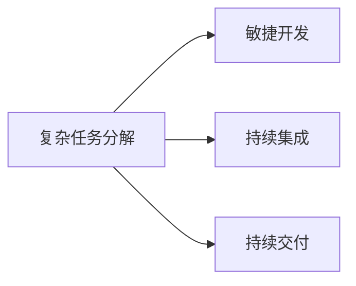

                 

# 复杂任务分解为较小步骤

## 1. 背景介绍

在软件开发中，面对复杂任务时，常常会出现需求复杂、设计困难、实现周期长、问题调试难等挑战。在如此复杂情况下，如何高效、有序地进行任务分解，将复杂任务分解为较小且易于管理的小任务，是项目成功的关键。本节将讨论复杂任务分解的必要性及常见问题，并展示其对项目成功的重要性。

## 2. 核心概念与联系

### 2.1 核心概念概述

在软件开发中，复杂任务分解（Decomposition of Complex Tasks）是将一个大的、复杂的任务分解为多个小的、可独立管理的部分的过程。每个部分独立于其他部分，并且可以单独测试和部署。这样不仅可以降低任务难度，而且可以更容易地进行任务管理和调试，从而提高开发效率和项目成功率。

### 2.2 核心概念间的联系

复杂任务分解与软件工程中的敏捷开发、持续集成（CI）和持续交付（CD）等概念紧密相连。敏捷开发强调小步快跑、快速迭代，而持续集成和持续交付则是保证每次迭代的质量和稳定性。这些理念和方法都可以通过复杂任务分解来实现。

下图展示了复杂任务分解与其他核心概念的联系：



## 3. 核心算法原理 & 具体操作步骤

### 3.1 算法原理概述

复杂任务分解的算法原理基于模块化和可复用性的思想。模块化是将一个复杂系统划分为多个模块，每个模块独立实现，模块之间通过接口进行通信。可复用性是指相同的模块可以被不同场景复用，从而提高开发效率。复杂任务分解就是将一个大任务分解为多个独立的、可复用的模块，每个模块完成一个相对简单的子任务。

### 3.2 算法步骤详解

1. **定义任务目标**：明确项目或任务的最终目标和关键需求。
2. **列出任务功能**：将任务细分为多个功能，每个功能可以独立完成。
3. **分解任务模块**：将功能进一步分解为更小的模块，每个模块负责一个特定的功能或子任务。
4. **设计接口和数据流**：确定模块之间的接口和数据流，确保模块可以相互通信。
5. **实施和测试**：实现每个模块并单独测试，确保模块的功能正确。
6. **整合和调试**：将模块整合到整个系统中，并进行整体测试和调试。

### 3.3 算法优缺点

**优点**：
1. **降低难度**：将复杂任务分解为多个小任务，降低了任务的复杂性。
2. **易于管理**：每个小任务独立管理，可以单独测试和部署。
3. **提高效率**：模块独立实现，可以并行开发，提高开发效率。

**缺点**：
1. **分解成本**：分解任务需要额外的时间和资源。
2. **接口设计复杂**：模块之间接口设计复杂，需要额外精力。

### 3.4 算法应用领域

复杂任务分解可以应用于各种软件开发项目中，如Web开发、移动应用开发、系统集成、大数据处理等。例如，在Web开发中，可以将一个复杂的电子商务网站分解为商品管理、用户管理、订单管理等多个模块，每个模块独立开发和测试，最终整合为整个系统。

## 4. 数学模型和公式 & 详细讲解

### 4.1 数学模型构建

在数学模型中，可以将复杂任务看作一个大的函数，将任务分解为多个子任务看作对大函数的分解。

设复杂任务为 $F(x)$，其中 $x$ 为输入变量。将 $F(x)$ 分解为 $n$ 个子任务，每个子任务为 $G_i(x)$，$i=1,2,\dots,n$。最终的任务结果为 $F(x) = G_1(x) + G_2(x) + \dots + G_n(x)$。

### 4.2 公式推导过程

我们可以将 $F(x)$ 分解为 $G_i(x)$ 的加和形式。以一个简单的函数为例：

$$
F(x) = x^2 + 2x + 1
$$

可以分解为两个子任务：

$$
G_1(x) = x^2
$$
$$
G_2(x) = 2x + 1
$$

最终结果为：

$$
F(x) = G_1(x) + G_2(x) = x^2 + 2x + 1
$$

这个例子展示了如何将复杂函数分解为多个简单的子任务。

### 4.3 案例分析与讲解

以一个复杂的Web应用为例，该应用包含用户注册、登录、商品搜索、购物车等功能。可以将这些功能分解为多个子任务：

- 用户注册：负责用户账户创建和管理。
- 登录：负责用户身份验证和会话管理。
- 商品搜索：负责商品信息的检索和显示。
- 购物车：负责商品信息的展示和结算。

每个子任务独立实现，最终整合为整个Web应用。这样不仅降低了开发难度，而且可以独立测试和部署，提高了开发效率和系统稳定性。

## 5. 项目实践：代码实例和详细解释说明

### 5.1 开发环境搭建

为了展示复杂任务分解的实际操作过程，我们需要一个开发环境。这里我们选择Python语言，并使用Flask框架搭建一个简单的Web应用。

1. 安装Python和Flask：
```
pip install flask
```

2. 创建Flask应用：
```python
from flask import Flask

app = Flask(__name__)

@app.route('/')
def index():
    return "Hello, World!"

if __name__ == '__main__':
    app.run(debug=True)
```

### 5.2 源代码详细实现

接下来，我们将上述简单的Flask应用分解为多个子任务。假设我们将应用分解为两个部分：注册功能和登录功能。

1. 注册功能：
```python
@app.route('/register', methods=['GET', 'POST'])
def register():
    if request.method == 'POST':
        username = request.form.get('username')
        password = request.form.get('password')
        # 注册逻辑
        return '注册成功'
    else:
        return '''
            <form method="POST">
                <input type="text" name="username"><br>
                <input type="password" name="password"><br>
                <input type="submit" value="注册">
            </form>
        '''
```

2. 登录功能：
```python
@app.route('/login', methods=['GET', 'POST'])
def login():
    if request.method == 'POST':
        username = request.form.get('username')
        password = request.form.get('password')
        # 登录逻辑
        return '登录成功'
    else:
        return '''
            <form method="POST">
                <input type="text" name="username"><br>
                <input type="password" name="password"><br>
                <input type="submit" value="登录">
            </form>
        '''
```

### 5.3 代码解读与分析

在上述代码中，我们首先将Flask应用分解为注册和登录两个子任务。每个子任务包含HTTP请求处理、表单数据获取和逻辑处理。这些模块独立实现，可以单独测试和调试。

在注册功能中，我们首先获取表单数据，然后调用注册逻辑函数进行注册。注册成功后返回注册成功页面。

在登录功能中，我们首先获取表单数据，然后调用登录逻辑函数进行登录。登录成功后返回登录成功页面。

### 5.4 运行结果展示

启动Flask应用后，可以通过访问 `http://localhost:5000/register` 和 `http://localhost:5000/login` 页面来测试注册和登录功能。这些功能可以独立测试和调试，保证了整个应用的稳定性和可靠性。

## 6. 实际应用场景

### 6.1 项目管理

在项目管理中，复杂任务分解可以用于项目计划和进度管理。例如，一个软件项目的开发任务可以分解为需求分析、设计、编码、测试、部署等多个子任务。每个子任务独立进行，可以单独跟踪进度和评估成果。

### 6.2 系统集成

在系统集成中，复杂任务分解可以用于系统的模块化设计。例如，一个复杂的系统可以分解为多个模块，每个模块独立实现，模块之间通过接口通信。这样不仅可以提高系统模块化程度，还可以提高系统的可扩展性和可维护性。

### 6.3 大数据处理

在大数据处理中，复杂任务分解可以用于数据预处理、特征工程、模型训练和评估等多个环节。每个环节独立实现，可以并行处理，提高数据处理效率。

## 7. 工具和资源推荐

### 7.1 学习资源推荐

1. 《软件工程：原理与方法》（原书第7版）：详细介绍了软件工程的基本原理和实践方法，包括需求分析、设计、实现、测试、维护等各个环节。
2. 《敏捷软件开发：原则、模式与实践》：介绍了敏捷开发的基本原则和实践方法，包括小步快跑、快速迭代、持续集成和持续交付等。
3. 《Clean Code：A Handbook of Agile Software Craftsmanship》：介绍了编写高质量代码的实践方法，包括代码结构、命名规范、代码重构等。

### 7.2 开发工具推荐

1. Jira：项目管理工具，支持任务分解、进度跟踪和协作管理等功能。
2. GitHub：代码托管和协作工具，支持版本控制、代码审查和项目管理等功能。
3. Jenkins：持续集成工具，支持自动化构建、测试和部署等功能。

### 7.3 相关论文推荐

1. Kaner, J., Klein, E. A., & Potts, H. (2002). "Software Development Requirements". Addison-Wesley.
2. Davenport, T. J., Beihler, M., & Potts, H. (2017). "Software Engineering: An Agile Introduction". Addison-Wesley.
3. Abrahams, R., & Siegel, M. (2017). "Clean Code". Addison-Wesley.

## 8. 总结：未来发展趋势与挑战

### 8.1 研究成果总结

复杂任务分解作为软件工程的基础方法之一，已经广泛应用于各种软件开发项目中。通过将复杂任务分解为多个小任务，不仅可以降低开发难度，而且可以独立测试和调试，提高开发效率和系统稳定性。

### 8.2 未来发展趋势

未来的软件工程将更加注重敏捷开发和持续交付，复杂任务分解将继续发挥重要作用。自动化工具和人工智能技术的发展也将进一步推动复杂任务分解的应用和优化。

### 8.3 面临的挑战

尽管复杂任务分解在软件开发中发挥了重要作用，但仍面临一些挑战。例如，如何合理分解任务、如何设计接口、如何协调多个子任务等。

### 8.4 研究展望

未来的研究将更多关注自动化和智能化方法的应用，例如使用机器学习进行任务分解优化、使用自然语言处理进行需求分析等。这些技术的应用将进一步提高软件开发的效率和质量。

## 9. 附录：常见问题与解答

**Q1: 如何将复杂任务分解为较小的任务？**

A: 首先明确任务目标，列出任务功能，然后按照模块化和可复用的原则进行分解。每个子任务独立实现，可以单独测试和部署。

**Q2: 如何确保分解任务的接口设计合理？**

A: 接口设计应考虑到任务之间的依赖关系，尽可能使用标准接口，确保模块之间的通信顺畅。

**Q3: 如何提高复杂任务分解的效率？**

A: 使用自动化工具和人工智能技术进行任务分解和优化，例如使用机器学习进行任务分解优化、使用自然语言处理进行需求分析等。

**Q4: 如何应对任务分解中的风险？**

A: 风险应对措施应包括任务优先级排序、风险评估和风险管理等，确保任务分解符合项目需求和进度要求。

**Q5: 如何评估复杂任务分解的效果？**

A: 通过项目管理工具和测试工具对任务分解的效果进行评估，确保任务分解符合项目进度和质量要求。

---

作者：禅与计算机程序设计艺术 / Zen and the Art of Computer Programming

