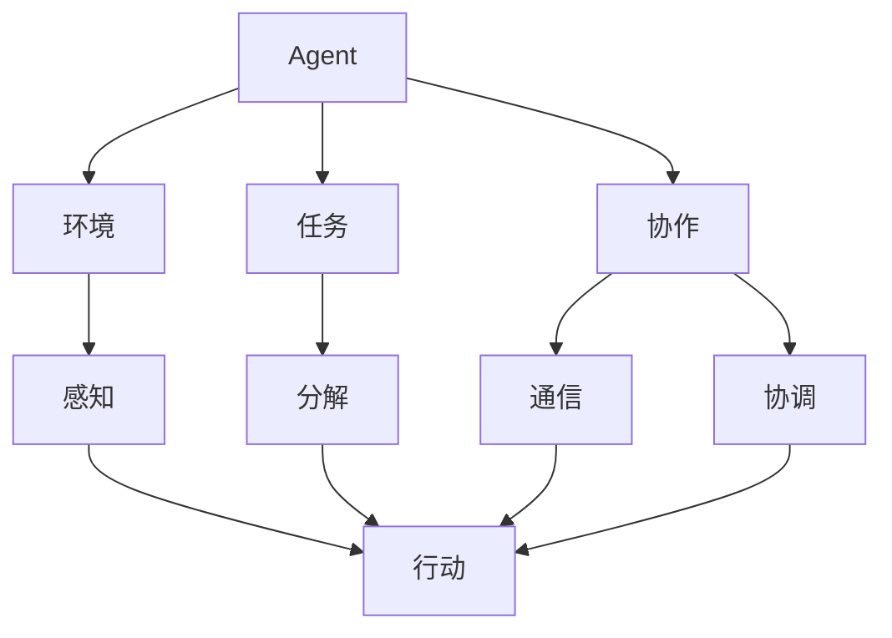
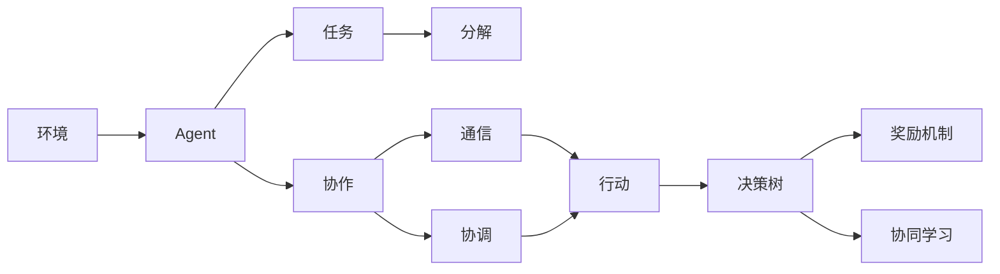
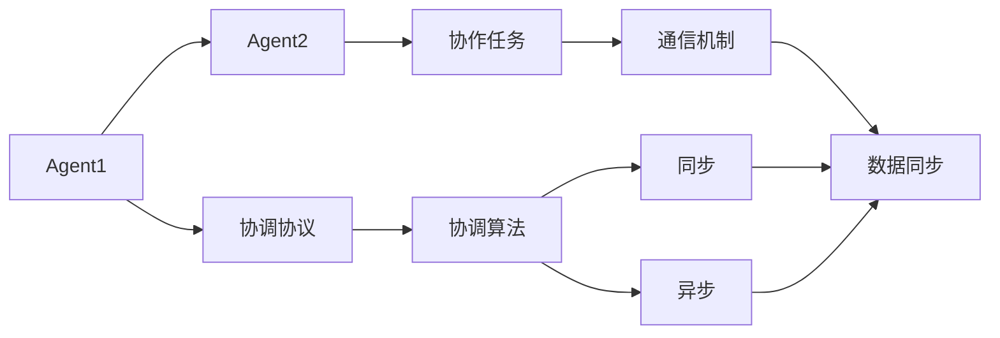
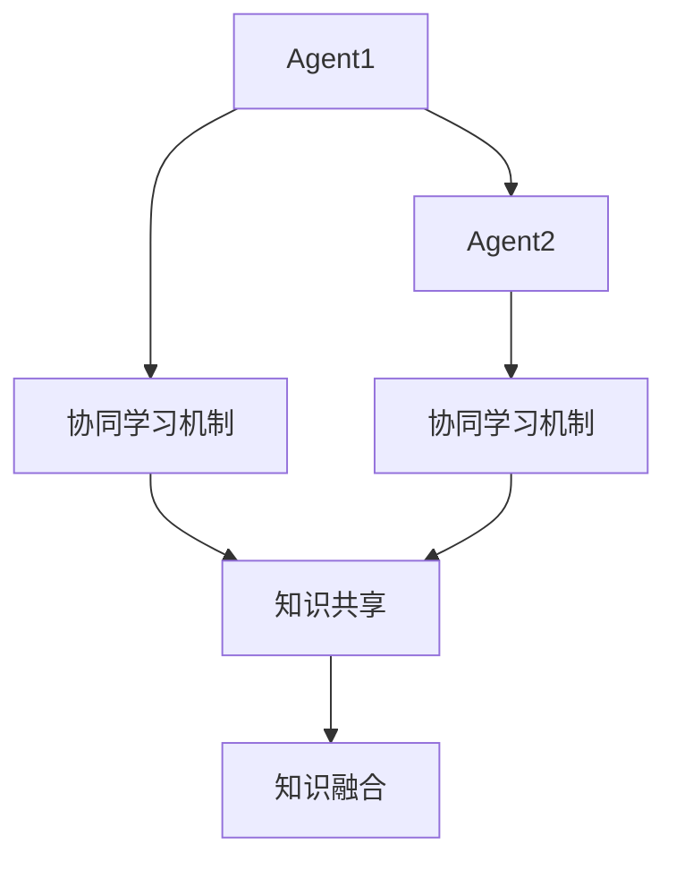
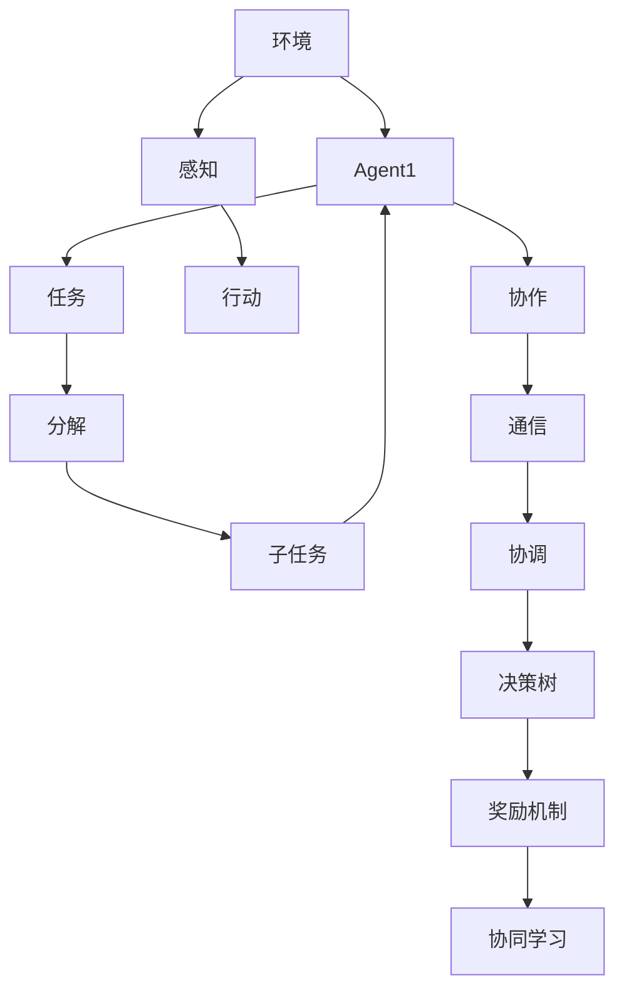

                 

# 多Agent系统：多Agent系统的概念，其中多个Agent可以同步或异步地交互，以执行更复杂的任务

> 关键词：多Agent系统, 异步交互, 同步交互, 分布式系统, 协作任务, 协同学习

## 1. 背景介绍

### 1.1 问题由来
在现代社会中，复杂任务往往需要多方协作才能完成。例如，制造业中的生产流程、社交媒体上的用户互动、互联网金融中的交易行为等。多Agent系统(Multi-Agent System, MAS)作为模拟复杂系统协作行为的强有力工具，已经被广泛应用于多个领域，包括但不限于计算机科学、经济学、社会学等。

### 1.2 问题核心关键点
多Agent系统是一种分布式智能系统，由多个自治Agent组成，这些Agent通过协同工作，可以解决单Agent无法完成或效率较低的复杂任务。MAS的核心问题包括：

1. **协调机制**：多个Agent如何协作以达成共同目标。
2. **通信协议**：Agent之间的信息交换方式。
3. **任务分解**：将复杂任务分解为多个子任务，每个Agent负责一部分。
4. **决策制定**：Agent如何做出决策，以及在动态变化的环境中如何调整策略。
5. **异常处理**：当系统出现故障或异常情况时，如何保证系统继续运行。

### 1.3 问题研究意义
多Agent系统的研究对于理解复杂系统的协作行为、优化资源配置、提高系统效率具有重要意义。在制造业、金融、交通、医疗等众多领域中，MAS的引入可以显著提升系统的响应速度、准确性和灵活性。

## 2. 核心概念与联系

### 2.1 核心概念概述

为更好地理解多Agent系统及其核心概念，本节将介绍几个密切相关的核心概念：

- **Agent**：具有一定自主性和学习能力的实体，能够感知环境、采取行动。
- **环境**：Agent所处的物理或虚拟空间，Agent在此环境中与其它Agent或环境互动。
- **任务**：Agent需要完成的目标或子目标。
- **协作**：多个Agent通过通信和协调合作完成一个共同目标。
- **决策树**：Agent根据环境信息，通过一系列的决策选择达成任务目标的过程。
- **奖励机制**：Agent完成任务后获得的反馈或奖励，用于激励Agent执行特定行为。
- **协同学习**：Agent之间通过共享知识和经验，共同提升系统整体性能的过程。

这些核心概念之间的逻辑关系可以通过以下Mermaid流程图来展示：



这个流程图展示了大系统环境中的Agent与其任务、环境、通信、协调等核心概念的关系：

1. Agent通过感知环境信息，根据当前任务进行决策。
2. 任务被分解成多个子任务，Agent协作完成。
3. Agent之间通过通信和协调合作达成共同目标。
4. 每个Agent根据决策树选择行动。
5. 通过奖励机制，Agent被激励执行特定行为。
6. 协同学习提升系统整体性能。

### 2.2 概念间的关系

这些核心概念之间存在着紧密的联系，形成了多Agent系统的完整生态系统。下面我通过几个Mermaid流程图来展示这些概念之间的关系。

#### 2.2.1 多Agent系统的学习范式



这个流程图展示了多Agent系统的基本学习范式，涉及Agent、任务、协作、通信、协调、行动、决策树、奖励机制和协同学习等概念。

#### 2.2.2 分布式系统的协调机制



这个流程图展示了Agent之间通过通信机制，利用同步或异步的协调算法，协作完成共同任务的过程。

#### 2.2.3 协同学习的交互模式



这个流程图展示了Agent之间通过知识共享和融合，协同学习提升系统整体性能的过程。

### 2.3 核心概念的整体架构

最后，我们用一个综合的流程图来展示这些核心概念在大系统中的整体架构：



这个综合流程图展示了Agent在大系统环境中的整体架构。Agent通过感知环境信息，选择行动，协作完成任务。系统通过通信和协调，保证任务分解和协同学习，最终通过奖励机制提升系统整体性能。

## 3. 核心算法原理 & 具体操作步骤
### 3.1 算法原理概述

多Agent系统通过多个Agent之间的协作和通信，共同完成任务。这种系统设计的核心思想是分布式决策，即每个Agent根据自身感知到的环境信息，做出独立决策，并通过通信和协调，达成系统整体的优化目标。

多Agent系统的关键算法包括：

- **分布式决策算法**：用于Agent之间进行决策协调的算法，如协作搜索、协同进化等。
- **通信协议**：用于Agent之间传递信息的协议，如共享语义网、信誉机制等。
- **分布式优化算法**：用于优化系统整体性能的算法，如分布式粒子群算法、分布式遗传算法等。
- **协同学习算法**：用于Agent之间共享知识，提升整体性能的算法，如协同进化、知识共享等。

### 3.2 算法步骤详解

基于多Agent系统的协同学习，其核心步骤包括：

1. **Agent定义**：根据具体任务需求，设计多个自治Agent。
2. **环境建模**：定义Agent所处的环境模型，如物理空间、虚拟空间等。
3. **任务分解**：将复杂任务分解为多个子任务，每个Agent负责一部分。
4. **通信协议设计**：选择合适的通信协议，定义Agent之间传递信息的格式和方式。
5. **协调机制设计**：设计Agent之间的协调算法，确保每个Agent都能按照预定的方式协作。
6. **决策制定**：根据任务需求，设计Agent的决策树或决策规则。
7. **协同学习**：通过知识共享和融合，提高Agent的协同能力。
8. **奖励机制设计**：设计Agent完成任务后获得的奖励机制，激励Agent执行特定行为。
9. **系统测试与评估**：在实际环境下测试多Agent系统，评估其性能和鲁棒性。

### 3.3 算法优缺点

多Agent系统的协同学习具有以下优点：

1. **灵活性高**：Agent可以根据环境变化，自主调整策略和行为。
2. **鲁棒性好**：系统可以在某个Agent故障时，继续执行其他Agent的任务。
3. **协同效率高**：多个Agent协作，通常比单Agent完成任务的效率更高。
4. **适应性强**：系统能够适应不同的环境和任务。

但同时，多Agent系统也存在一些缺点：

1. **协调困难**：多个Agent之间的协调需要复杂的管理和控制，容易出现问题。
2. **通信开销大**：Agent之间的通信需要消耗一定的资源和时间，可能影响系统效率。
3. **决策复杂**：Agent需要独立做出决策，增加系统复杂性。
4. **可解释性差**：系统中的协同行为和决策过程往往难以解释和理解。

### 3.4 算法应用领域

多Agent系统的协同学习已经广泛应用于以下领域：

- **工业控制**：多Agent系统在制造业中的机器人协作、自动化生产线上得到了广泛应用。
- **交通运输**：交通系统中，多Agent系统用于管理交通流量、避免交通拥堵。
- **金融市场**：金融市场中的高频交易、风险管理、市场预测等应用，常常涉及多个Agent的协同。
- **医疗健康**：多Agent系统用于医疗资源调度、病人管理、健康监测等任务。
- **社交网络**：社交网络中的信息传播、内容推荐、用户互动等，都可以通过多Agent系统实现。

## 4. 数学模型和公式 & 详细讲解 & 举例说明

### 4.1 数学模型构建

假设一个包含$N$个Agent的多Agent系统，每个Agent$A_i$（$i=1,...,N$）的决策集为$\mathcal{A}$，行动集为$\mathcal{A}_i$。环境$E$由环境状态$s \in \mathcal{S}$和环境奖励$r \in \mathcal{R}$构成。多Agent系统的目标是通过Agent的协同学习，最大化总奖励$R = \sum_{i=1}^N R_i$。

多Agent系统的数学模型可以表示为：

$$
\max_{\mathcal{A}} \sum_{i=1}^N \sum_{s \in \mathcal{S}} \sum_{r \in \mathcal{R}} P(s,r|A_i,\mathcal{A}) \times R_i(s,r)
$$

其中$P(s,r|A_i,\mathcal{A})$为环境在Agent$A_i$采取行动$\mathcal{A}$下的状态转移概率。

### 4.2 公式推导过程

我们以一个简单的协同学习模型为例，来推导多Agent系统的数学模型。

假设系统中有两个Agent$A_1$和$A_2$，每个Agent的目标是最大化自己的奖励。Agent$A_1$的目标是最大化奖励$R_1$，Agent$A_2$的目标是最大化奖励$R_2$。环境状态$s$和奖励$r$是连续的，Agent的决策和行动是离散的。

假设每个Agent在每个时间步都可以独立做出决策。在时间步$t$，Agent$A_i$选择行动$a_{it}$，环境状态从$s_t$转移到$s_{t+1}$，并获得奖励$r_{it}$。假设每个Agent的决策$A_i$都是独立的，系统的总奖励为$R = R_1 + R_2$。

Agent的决策树可以表示为：

$$
\max_{a_{it}} R_{it} = \max_{a_{it}} \{r_{it} + \gamma \max_{a_{it+1}} R_{it+1}\}
$$

其中$\gamma$为折扣因子，$R_{it+1}$为下一步的总奖励。

Agent$A_i$在时间步$t$的决策可以表示为：

$$
a_{it} = \arg\max_{a_{it}} \{r_{it} + \gamma \max_{a_{it+1}} R_{it+1}\}
$$

系统的总奖励可以通过递归求解上述方程得到：

$$
R_t = \sum_{i=1}^N R_{it}
$$

通过求解上述方程，我们可以找到最优的决策策略，从而最大化系统的总奖励。

### 4.3 案例分析与讲解

我们以一个分布式粒子群算法(Distributed Particle Swarm Optimization, DPSO)为例，展示多Agent系统的协同学习过程。

DPSO算法是一个基于粒子群优化的多Agent系统，其中每个Agent都是一个粒子，通过协同搜索全局最优解。算法步骤如下：

1. 初始化多个粒子，每个粒子的位置和速度随机生成。
2. 每个粒子根据自身位置和速度，以及全局最优位置，更新其速度和位置。
3. 通过通信协议，每个粒子将自身的速度和位置信息传递给其他粒子。
4. 通过协调算法，每个粒子根据收到的信息，调整其速度和位置。
5. 重复上述步骤，直到达到预设的迭代次数或收敛条件。

在DPSO算法中，每个粒子的速度和位置都是独立的，但通过通信协议和协调算法，所有粒子协同搜索全局最优解。这个过程可以看作是多个Agent之间的协同学习。

## 5. 项目实践：代码实例和详细解释说明
### 5.1 开发环境搭建

在进行多Agent系统开发前，我们需要准备好开发环境。以下是使用Python进行PyTorch开发的环境配置流程：

1. 安装Anaconda：从官网下载并安装Anaconda，用于创建独立的Python环境。

2. 创建并激活虚拟环境：
```bash
conda create -n pytorch-env python=3.8 
conda activate pytorch-env
```

3. 安装PyTorch：根据CUDA版本，从官网获取对应的安装命令。例如：
```bash
conda install pytorch torchvision torchaudio cudatoolkit=11.1 -c pytorch -c conda-forge
```

4. 安装Sympy：
```bash
pip install sympy
```

5. 安装PySyft：
```bash
pip install syft
```

6. 安装PySyft环境：
```bash
conda install syft==0.6.0
```

完成上述步骤后，即可在`pytorch-env`环境中开始多Agent系统的开发。

### 5.2 源代码详细实现

下面以一个简单的多Agent系统为例，展示如何使用PySyft实现Agent之间的协同学习。

首先，定义Agent和环境的类：

```python
from syft import perturbations
from syft.agents.python import PythonAgent
from syft.metrics import ClassificationMetric

class Environment:
    def __init__(self, num_agents):
        self.agents = [PythonAgent() for _ in range(num_agents)]
    
    def step(self):
        for agent in self.agents:
            agent.step()

class Agent:
    def __init__(self, env):
        self.env = env
        self.metrics = ClassificationMetric()
    
    def step(self):
        # 执行Agent的行动
        pass
```

然后，实现Agent的协同学习算法：

```python
class DistributedLearning:
    def __init__(self, num_agents):
        self.num_agents = num_agents
        self.metrics = []
    
    def train(self, env, num_epochs):
        for epoch in range(num_epochs):
            for agent in env.agents:
                self.metrics.append(agent.metrics)
            # 协同学习
            for i in range(self.num_agents):
                for j in range(self.num_agents):
                    if i != j:
                        self.sync_weights(agent=i, peer=agent=j)
            # 记录训练结果
            print("Epoch {}: {}".format(epoch, self.metrics))
    
    def sync_weights(self, agent, peer):
        # 同步Agent之间的权重
        pass
```

最后，在训练过程中，每个Agent独立进行训练，并通过协同学习算法同步权重：

```python
env = Environment(num_agents=2)
distributed_learning = DistributedLearning(num_agents=2)
distributed_learning.train(env, num_epochs=10)
```

这个简单的代码示例展示了如何使用PySyft实现多Agent系统的协同学习。通过定义环境、Agent和协同学习算法，可以构建一个简单的多Agent系统。

### 5.3 代码解读与分析

让我们再详细解读一下关键代码的实现细节：

**Environment类**：
- `__init__`方法：初始化多个Agent，并为每个Agent分配一个唯一的标识符。
- `step`方法：执行所有Agent的一步行动，通常涉及状态更新和奖励反馈。

**Agent类**：
- `__init__`方法：初始化Agent的权重和指标。
- `step`方法：定义Agent的行动，通常涉及模型的训练和优化。

**DistributedLearning类**：
- `__init__`方法：初始化协同学习算法的参数。
- `train`方法：在每个epoch中，记录每个Agent的性能指标，并通过`sync_weights`方法同步权重。

**sync_weights方法**：
- 实现Agent之间权重的同步，通常涉及梯度更新和权重更新。

这个简单的代码示例展示了多Agent系统在协同学习过程中的基本流程。在实际应用中，还需要根据具体任务的需求，进一步优化Agent的行动、协调算法和同步策略。

## 6. 实际应用场景
### 6.1 工业控制

多Agent系统在工业控制中的应用非常广泛。例如，在制造业中，多Agent系统可以用于管理机器人、自动化生产线和物流系统。通过协同工作，机器人可以高效地完成复杂的装配任务，生产线可以实现自动化调度，物流系统可以优化货物配送路径。

### 6.2 交通运输

在交通运输领域，多Agent系统可以用于管理交通流量、优化路线和减少交通拥堵。例如，在智能交通系统中，每个车辆都可以看作一个Agent，通过协同工作，系统可以实现交通流量预测、实时调度和事故应急处理。

### 6.3 金融市场

金融市场中的高频交易、风险管理、市场预测等任务，常常涉及多个Agent的协同。通过多Agent系统的协同学习，系统可以实时监控市场动态，快速做出投资决策，优化资产配置。

### 6.4 医疗健康

多Agent系统在医疗健康领域也有广泛应用。例如，在医疗资源调度、病人管理和健康监测中，多Agent系统可以实现高效的资源分配和任务协同，提升医疗服务的质量和效率。

### 6.5 社交网络

社交网络中的信息传播、内容推荐和用户互动，都可以通过多Agent系统实现。例如，在社交推荐系统中，每个用户可以视为一个Agent，通过协同学习，系统可以推荐符合用户兴趣的内容，提升用户体验。

## 7. 工具和资源推荐
### 7.1 学习资源推荐

为了帮助开发者系统掌握多Agent系统的理论基础和实践技巧，这里推荐一些优质的学习资源：

1. 《多Agent系统》系列书籍：介绍了多Agent系统的基本概念、算法和应用，是学习多Agent系统的入门教材。
2. 《分布式算法》课程：斯坦福大学开设的分布式系统课程，涉及多Agent系统的分布式算法和协同学习。
3. 《智能体系统》论文：IEEE Transactions on Systems, Man, and Cybernetics杂志的智能体系统专题，收录了多Agent系统领域的最新研究成果。
4. 《Syft官方文档》：PySyft的官方文档，提供了丰富的多Agent系统实现示例和详细解释。

通过对这些资源的学习实践，相信你一定能够快速掌握多Agent系统的精髓，并用于解决实际的协同任务。

### 7.2 开发工具推荐

高效的开发离不开优秀的工具支持。以下是几款用于多Agent系统开发的工具：

1. PySyft：用于分布式机器学习和多方安全计算的Python库，支持多Agent系统的分布式协同学习。
2. TensorFlow：由Google主导开发的开源深度学习框架，支持多Agent系统的分布式训练和优化。
3. PyTorch：基于Python的开源深度学习框架，灵活动态的计算图，适合快速迭代研究。
4. MPI：消息传递接口，支持多Agent系统的分布式计算和通信。
5. MPIx：MPI扩展库，支持多Agent系统的复杂通信和协调。

合理利用这些工具，可以显著提升多Agent系统开发和协同学习的效率，加快创新迭代的步伐。

### 7.3 相关论文推荐

多Agent系统的研究始于20世纪70年代，经历了多个发展阶段，形成了丰富的理论和方法。以下是几篇奠基性的相关论文，推荐阅读：

1. "A Survey of Multi-Agent Systems"（多Agent系统综述）：Joanna P. Lucia等，2020年发表在IEEE Transactions on Systems, Man, and Cybernetics, Part C: Applications and Reviews杂志。
2. "Distributed Learning in Neural Networks: A Review of Approaches"（神经网络中的分布式学习综述）：Bharathkumar Bhadrachalam等，2019年发表在IEEE Transactions on Neural Networks and Learning Systems杂志。
3. "Advances in Distributed Artificial Intelligence"（分布式人工智能进展）：Michel De Roeck等，2018年发表在IEEE Transactions on Systems, Man, and Cybernetics, Part C: Applications and Reviews杂志。
4. "Distributed Systems: Concepts and Design"（分布式系统：概念与设计）：George Coulouris等，2017年出版。
5. "Multi-Agent Systems: Introduction and Motivation"（多Agent系统：介绍和动机）：Jack Woerner等，2016年发表在Journal of Multi-Agent Systems杂志。

这些论文代表了大系统多Agent协同学习的最新进展，通过学习这些前沿成果，可以帮助研究者把握学科前进方向，激发更多的创新灵感。

除上述资源外，还有一些值得关注的前沿资源，帮助开发者紧跟多Agent系统的最新进展，例如：

1. arXiv论文预印本：人工智能领域最新研究成果的发布平台，包括大量尚未发表的前沿工作，学习前沿技术的必读资源。
2. 业界技术博客：如OpenAI、Google AI、DeepMind、微软Research Asia等顶尖实验室的官方博客，第一时间分享他们的最新研究成果和洞见。
3. 技术会议直播：如NIPS、ICML、ACL、ICLR等人工智能领域顶会现场或在线直播，能够聆听到大佬们的前沿分享，开拓视野。
4. GitHub热门项目：在GitHub上Star、Fork数最多的多Agent系统相关项目，往往代表了该技术领域的发展趋势和最佳实践，值得去学习和贡献。
5. 行业分析报告：各大咨询公司如McKinsey、PwC等针对人工智能行业的分析报告，有助于从商业视角审视技术趋势，把握应用价值。

总之，对于多Agent系统学习资源的选择，需要开发者根据自身需求，选择最适合的学习路径和实践工具，方能得到理想的体验和效果。

## 8. 总结：未来发展趋势与挑战

### 8.1 总结

本文对多Agent系统的概念、核心算法和应用进行了全面系统的介绍。首先阐述了多Agent系统的基本概念和研究背景，明确了多Agent系统在协同任务中的重要作用。其次，从原理到实践，详细讲解了多Agent系统的协同学习过程，给出了多Agent系统开发的全代码示例。同时，本文还探讨了多Agent系统在各个领域的应用前景，展示了协同学习的巨大潜力。

通过本文的系统梳理，可以看到，多Agent系统的协同学习技术正在成为分布式系统协作行为的重要范式，极大地拓展了系统的应用范围，提高了系统的响应速度和灵活性。未来，伴随分布式计算和人工智能技术的不断进步，多Agent系统的协同学习将走向更高的台阶，为构建更加智能、高效的系统铺平道路。

### 8.2 未来发展趋势

展望未来，多Agent系统的协同学习技术将呈现以下几个发展趋势：

1. **自适应协同学习**：Agent可以自主学习并调整策略，适应不断变化的环境。
2. **分布式优化算法**：开发更加高效和灵活的分布式优化算法，优化系统的整体性能。
3. **知识表示与推理**：引入符号化的先验知识，增强系统对复杂问题的推理能力。
4. **异步通信与协调**：通过异步通信和协调算法，提高系统效率和可扩展性。
5. **多方安全计算**：在保持数据隐私和安全的前提下，实现多方协同学习。
6. **跨模态协同**：将视觉、语音、文本等多种模态数据融合，实现跨模态协同学习。

这些趋势凸显了多Agent系统的协同学习技术的广阔前景。这些方向的探索发展，必将进一步提升系统的协作能力和整体性能，为智能系统的应用带来新的突破。

### 8.3 面临的挑战

尽管多Agent系统的协同学习技术已经取得了不小的进展，但在迈向更加智能化、普适化应用的过程中，它仍面临诸多挑战：

1. **协调复杂性**：多个Agent之间的协调需要复杂的算法和管理，容易出现问题。
2. **通信开销大**：Agent之间的通信需要消耗大量的资源和时间，可能影响系统效率。
3. **决策复杂性**：Agent需要独立做出决策，增加系统复杂性。
4. **可解释性差**：系统中的协同行为和决策过程往往难以解释和理解。
5. **数据隐私与安全**：在多方协同学习中，如何保护数据隐私和安全，也是一个重要的问题。

这些挑战需要研究者继续深入探索，开发更加高效、可靠、安全的协同学习算法，确保系统的协同行为透明、可解释、可信。

### 8.4 研究展望

面对多Agent系统的协同学习所面临的挑战，未来的研究需要在以下几个方面寻求新的突破：

1. **分布式协同学习算法**：开发更加高效和灵活的分布式协同学习算法，提高系统的协作效率和整体性能。
2. **异步通信与协调**：通过异步通信和协调算法，减少Agent之间的通信开销，提高系统的可扩展性和灵活性。
3. **知识表示与推理**：引入符号化的先验知识，增强系统对复杂问题的推理能力，提高系统的智能水平。
4. **多方安全计算**：开发多方安全计算算法，在保持数据隐私和安全的前提下，实现多方协同学习

