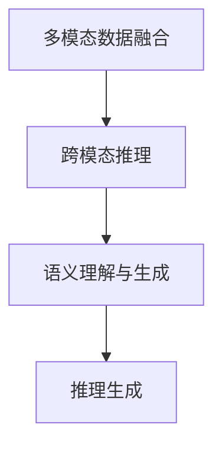
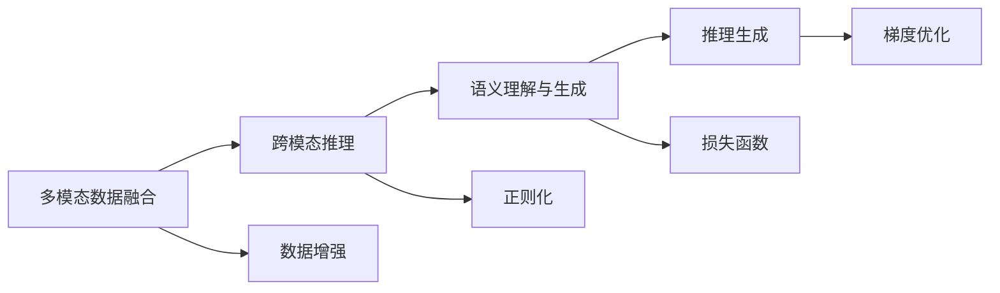
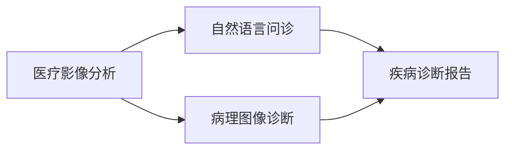
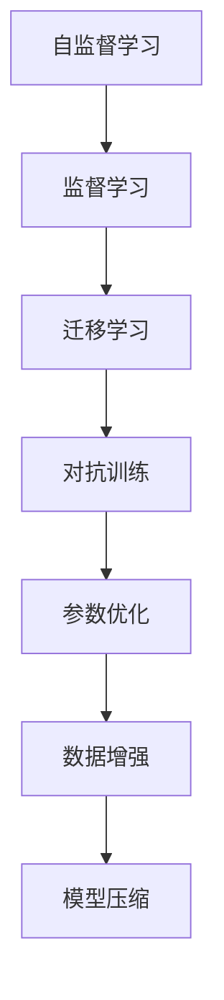
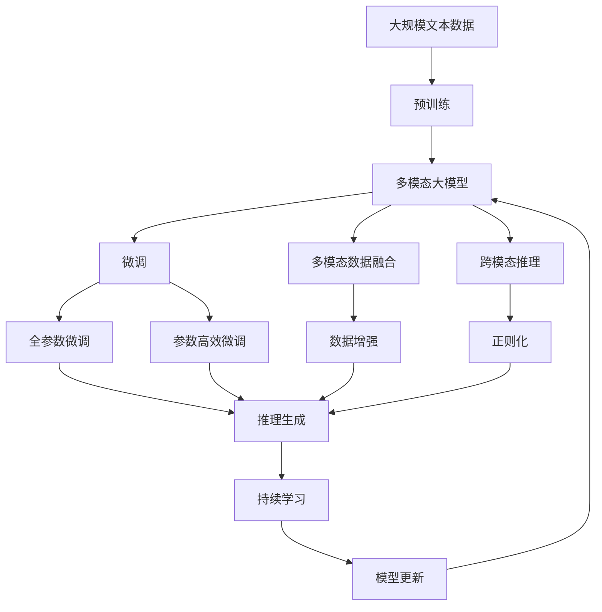

                 

# 多模态大模型：技术原理与实战 优化逻辑介绍

> 关键词：多模态大模型,技术原理,实战应用,优化逻辑,Transformer,BERT,语义理解,推理生成

## 1. 背景介绍

### 1.1 问题由来
近年来，人工智能（AI）在各个领域的应用不断深入，特别是自然语言处理（NLP）和计算机视觉（CV）等方向。然而，这两个领域的研究和应用各自为战，难以进行深度整合。多模态大模型（Multimodal Large Models）的出现，为解决这一问题提供了全新的思路。多模态大模型能够同时处理文本、图像、音频等多种类型的数据，实现跨模态的理解和生成，成为新一代智能系统的核心引擎。

### 1.2 问题核心关键点
多模态大模型的核心思想是将文本和视觉等多模态数据融合到一个模型中进行联合训练和推理，从而实现更强大的语义理解和生成能力。其关键点包括：
- 多模态数据的融合：文本、图像、音频等多种数据格式，如何高效、准确地整合到模型中进行联合训练。
- 模型的跨模态推理：将不同模态的数据转化为统一的语义表示，实现跨模态的理解和生成。
- 模型的优化逻辑：如何在多模态联合训练过程中，最大化地利用数据，避免过拟合，提高模型性能。

### 1.3 问题研究意义
研究多模态大模型，对于推动AI技术的融合发展，提升跨模态理解的深度和广度，加速AI技术的产业应用，具有重要意义：

1. **数据共享与融合**：不同模态的数据可以共享和整合，丰富训练数据的来源和多样性，提高模型的泛化能力。
2. **跨模态推理能力**：多模态大模型可以更好地理解和处理现实世界的复杂信息，实现更高层次的认知智能。
3. **融合知识表示**：通过跨模态融合，可以更全面地表示现实世界中的复杂信息，提升模型的知识提取和推理能力。
4. **实时交互与推理**：多模态大模型可以实现实时交互与推理，提高人机交互的自然性和智能性。
5. **推动产业升级**：多模态大模型可以应用于众多行业，提升智能化水平，推动各行业的数字化转型。

## 2. 核心概念与联系

### 2.1 核心概念概述

为更好地理解多模态大模型的技术原理，本节将介绍几个密切相关的核心概念：

- **多模态数据融合**：将文本、图像、音频等多种模态的数据整合成一个模型进行处理。
- **跨模态推理**：将不同模态的数据转化为统一的语义表示，实现跨模态的理解和生成。
- **Transformer**：一种基于自注意力机制的神经网络结构，广泛应用于NLP和CV领域。
- **BERT**：基于Transformer架构的预训练语言模型，可以实现大规模文本数据的语义理解。
- **语义理解与生成**：通过多模态大模型，实现对文本、图像等数据的深度语义理解，生成高质量的输出结果。
- **推理生成**：多模态大模型可以在给定输入的情况下，生成符合逻辑的输出结果，实现智能交互。

这些核心概念之间的逻辑关系可以通过以下Mermaid流程图来展示：



这个流程图展示了大模型的核心概念及其之间的关系：

1. 多模态数据融合是基础，通过联合训练和联合推理，将不同模态的数据整合在一起。
2. 跨模态推理是核心，将不同模态的数据转化为统一的语义表示，实现跨模态的理解和生成。
3. 语义理解与生成是目标，通过多模态大模型，实现对文本、图像等数据的深度语义理解，生成高质量的输出结果。
4. 推理生成是应用，多模态大模型可以在给定输入的情况下，生成符合逻辑的输出结果，实现智能交互。

### 2.2 概念间的关系

这些核心概念之间存在着紧密的联系，形成了多模态大模型的整体架构。下面通过几个Mermaid流程图来展示这些概念之间的关系。

#### 2.2.1 多模态大模型的学习范式



这个流程图展示了多模态大模型的学习范式，包括数据增强、正则化、损失函数、梯度优化等关键步骤。

#### 2.2.2 多模态大模型的应用场景



这个流程图展示了多模态大模型在医疗影像分析、自然语言问诊等场景中的应用。

#### 2.2.3 多模态大模型的优化策略



这个流程图展示了多模态大模型的优化策略，包括自监督学习、迁移学习、对抗训练、参数优化、数据增强和模型压缩等关键步骤。

### 2.3 核心概念的整体架构

最后，我们用一个综合的流程图来展示这些核心概念在大模型微调过程中的整体架构：



这个综合流程图展示了从预训练到微调，再到推理生成的完整过程。大模型首先在大规模文本数据上进行预训练，然后通过微调（包括全参数微调和参数高效微调）或跨模态融合，实现多模态数据的整合和推理。最后，通过持续学习技术，模型可以不断更新和适应新的任务和数据。通过这些流程图，我们可以更清晰地理解多模态大模型的学习过程和关键技术点。

## 3. 核心算法原理 & 具体操作步骤
### 3.1 算法原理概述

多模态大模型的核心算法原理是Transformer结构和跨模态推理机制。Transformer结构通过自注意力机制实现文本、图像等数据的高效表示和融合。跨模态推理则通过模型中的跨模态映射层，将不同模态的数据转化为统一的语义表示，实现跨模态的理解和生成。

具体而言，多模态大模型通常由Transformer模型和跨模态映射层组成。在Transformer模型中，文本、图像等数据分别进行编码，然后通过跨模态映射层进行融合。跨模态映射层一般采用注意力机制或多头注意力机制，将不同模态的数据转化为统一的语义表示。

### 3.2 算法步骤详解

多模态大模型的训练和推理通常包括以下几个关键步骤：

**Step 1: 准备多模态数据集**
- 收集并标注多模态数据集，包括文本、图像、音频等多种模态的数据。
- 将数据集划分为训练集、验证集和测试集。

**Step 2: 设计多模态模型**
- 选择合适的Transformer模型和跨模态映射层结构。
- 确定模型的输入和输出格式，包括文本、图像、音频等。

**Step 3: 设计损失函数**
- 选择合适的损失函数，如交叉熵损失、均方误差损失等。
- 根据任务需求设计自定义的损失函数。

**Step 4: 训练模型**
- 使用优化器如AdamW、SGD等，对模型进行优化。
- 在训练过程中应用数据增强、正则化等技术，避免过拟合。
- 使用模型压缩技术，减小模型尺寸，提高训练效率。

**Step 5: 推理生成**
- 将输入数据（包括文本、图像、音频等）输入到模型中，进行推理生成。
- 根据推理结果，生成符合逻辑的输出结果。

**Step 6: 微调与优化**
- 在特定任务上进行微调，提升模型性能。
- 使用参数高效微调、对抗训练等方法，提高模型鲁棒性和泛化能力。

### 3.3 算法优缺点

多模态大模型具有以下优点：
1. 强大的语义理解能力：通过联合训练和推理，能够处理多种模态的数据，实现更强大的语义理解。
2. 泛化能力强：多模态大模型可以更好地适应不同领域的数据，提高模型的泛化能力。
3. 实时推理能力强：多模态大模型可以实现实时推理和生成，提升人机交互的自然性和智能性。
4. 数据共享和融合：不同模态的数据可以共享和整合，丰富训练数据的来源和多样性。

同时，多模态大模型也存在以下缺点：
1. 模型复杂度高：多模态大模型包含多个模态的数据，模型结构复杂，难以优化。
2. 计算资源消耗大：多模态大模型的训练和推理需要大量的计算资源，计算成本高。
3. 数据标注困难：多模态数据的标注往往比单一模态数据困难，需要大量的人工工作。
4. 跨模态映射挑战：跨模态映射层的设计和优化是关键挑战，需要深入研究。

### 3.4 算法应用领域

多模态大模型在众多领域都有广泛的应用，例如：

- 医疗影像分析：通过联合分析医疗影像和文本，实现病理学、影像学的跨模态诊断。
- 自然语言问诊：将文本和语音等多模态数据联合分析，实现智能问诊和疾病诊断。
- 智能客服：通过联合分析用户的多模态数据，实现智能客服和智能回复。
- 多媒体内容生成：通过联合分析文本和图像，实现视频内容生成、图像字幕生成等。
- 人机交互：通过联合分析语音、图像和文本，实现更自然、智能的人机交互。

## 4. 数学模型和公式 & 详细讲解 & 举例说明

### 4.1 数学模型构建

多模态大模型的数学模型构建通常包括以下几个关键部分：

- **Transformer模型**：多模态大模型的核心结构，通过自注意力机制实现文本、图像等数据的高效表示和融合。
- **跨模态映射层**：将不同模态的数据转化为统一的语义表示，实现跨模态的理解和生成。
- **损失函数**：选择合适的损失函数，如交叉熵损失、均方误差损失等。

以多模态大模型在文本图像联合分类任务中的应用为例，其数学模型可以表示为：

$$
y = M_{\theta}(x_{text}, x_{image})
$$

其中，$x_{text}$表示文本输入，$x_{image}$表示图像输入，$M_{\theta}$表示多模态大模型，$y$表示分类结果。

### 4.2 公式推导过程

以文本图像联合分类任务为例，我们推导模型的前向传播和损失函数：

**前向传播**：
1. 将文本和图像分别输入到Transformer模型中，分别得到文本和图像的语义表示。
2. 通过跨模态映射层，将文本和图像的语义表示转化为统一的语义表示。
3. 将统一的语义表示输入到分类器中，输出分类结果。

**损失函数**：
- 对于分类任务，通常使用交叉熵损失函数：
$$
\mathcal{L} = -\frac{1}{N}\sum_{i=1}^N \log\frac{\exp(x_i^Ty)}{\sum_{j=1}^C\exp(x_j^Ty)}
$$

其中，$x_i$表示输入样本，$y$表示分类结果，$C$表示类别数。

### 4.3 案例分析与讲解

以文本图像联合分类任务为例，我们可以使用MNIST数据集进行实验。数据集包含手写数字的图像和相应的文本描述，用于训练多模态大模型，实现图像和文本联合分类。

实验步骤如下：

1. 收集和预处理数据集：将手写数字图像和相应的文本描述作为输入数据，进行预处理和分批次加载。
2. 构建多模态大模型：使用Transformer模型和跨模态映射层，对文本和图像数据进行联合编码。
3. 训练模型：使用优化器AdamW，对模型进行训练，并在验证集上进行评估，调整超参数。
4. 推理生成：使用训练好的模型，对测试集进行推理生成，评估分类精度。

## 5. 项目实践：代码实例和详细解释说明

### 5.1 开发环境搭建

在进行多模态大模型开发前，我们需要准备好开发环境。以下是使用Python进行PyTorch开发的环境配置流程：

1. 安装Anaconda：从官网下载并安装Anaconda，用于创建独立的Python环境。

2. 创建并激活虚拟环境：
```bash
conda create -n multimodal-env python=3.8 
conda activate multimodal-env
```

3. 安装PyTorch：根据CUDA版本，从官网获取对应的安装命令。例如：
```bash
conda install pytorch torchvision torchaudio cudatoolkit=11.1 -c pytorch -c conda-forge
```

4. 安装HuggingFace Transformers库：
```bash
pip install transformers
```

5. 安装各类工具包：
```bash
pip install numpy pandas scikit-learn matplotlib tqdm jupyter notebook ipython
```

完成上述步骤后，即可在`multimodal-env`环境中开始多模态大模型的开发。

### 5.2 源代码详细实现

下面我们以文本图像联合分类任务为例，给出使用Transformers库对BERT模型进行多模态大模型微调的PyTorch代码实现。

首先，定义数据处理函数：

```python
from transformers import BertTokenizer
from torch.utils.data import Dataset
import torch

class MultimodalDataset(Dataset):
    def __init__(self, texts, images, tokenizer, max_len=128):
        self.texts = texts
        self.images = images
        self.tokenizer = tokenizer
        self.max_len = max_len
        
    def __len__(self):
        return len(self.texts)
    
    def __getitem__(self, item):
        text = self.texts[item]
        image = self.images[item]
        
        encoding = self.tokenizer(text, return_tensors='pt', max_length=self.max_len, padding='max_length', truncation=True)
        input_ids = encoding['input_ids'][0]
        attention_mask = encoding['attention_mask'][0]
        
        # 对图像进行预处理和编码
        image_tensor = image.to(device)
        image_tensor = image_tensor.unsqueeze(0)
        image_tensor = torch.nn.functional.interpolate(image_tensor, size=(32, 32), mode='bicubic').to(device)
        image_tensor = image_tensor.to(device)
        
        # 对token-wise的标签进行编码
        encoded_tags = [tag2id[tag] for tag in tags] 
        encoded_tags.extend([tag2id['O']] * (self.max_len - len(encoded_tags)))
        labels = torch.tensor(encoded_tags, dtype=torch.long)
        
        return {'input_ids': input_ids, 
                'attention_mask': attention_mask,
                'labels': labels,
                'image_tensor': image_tensor}
```

然后，定义模型和优化器：

```python
from transformers import BertForTokenClassification, AdamW

model = BertForTokenClassification.from_pretrained('bert-base-cased', num_labels=len(tag2id))

optimizer = AdamW(model.parameters(), lr=2e-5)
```

接着，定义训练和评估函数：

```python
from torch.utils.data import DataLoader
from tqdm import tqdm
from sklearn.metrics import classification_report

device = torch.device('cuda') if torch.cuda.is_available() else torch.device('cpu')
model.to(device)

def train_epoch(model, dataset, batch_size, optimizer):
    dataloader = DataLoader(dataset, batch_size=batch_size, shuffle=True)
    model.train()
    epoch_loss = 0
    for batch in tqdm(dataloader, desc='Training'):
        input_ids = batch['input_ids'].to(device)
        attention_mask = batch['attention_mask'].to(device)
        labels = batch['labels'].to(device)
        image_tensor = batch['image_tensor'].to(device)
        model.zero_grad()
        outputs = model(input_ids, attention_mask=attention_mask, labels=labels, image_tensor=image_tensor)
        loss = outputs.loss
        epoch_loss += loss.item()
        loss.backward()
        optimizer.step()
    return epoch_loss / len(dataloader)

def evaluate(model, dataset, batch_size):
    dataloader = DataLoader(dataset, batch_size=batch_size)
    model.eval()
    preds, labels = [], []
    with torch.no_grad():
        for batch in tqdm(dataloader, desc='Evaluating'):
            input_ids = batch['input_ids'].to(device)
            attention_mask = batch['attention_mask'].to(device)
            labels = batch['labels'].to(device)
            image_tensor = batch['image_tensor'].to(device)
            outputs = model(input_ids, attention_mask=attention_mask, labels=labels, image_tensor=image_tensor)
            batch_preds = outputs.logits.argmax(dim=2).to('cpu').tolist()
            batch_labels = batch_labels.to('cpu').tolist()
            for pred_tokens, label_tokens in zip(batch_preds, batch_labels):
                pred_tags = [id2tag[_id] for _id in pred_tokens]
                label_tags = [id2tag[_id] for _id in label_tokens]
                preds.append(pred_tags[:len(label_tokens)])
                labels.append(label_tags)
                
    print(classification_report(labels, preds))
```

最后，启动训练流程并在测试集上评估：

```python
epochs = 5
batch_size = 16

for epoch in range(epochs):
    loss = train_epoch(model, train_dataset, batch_size, optimizer)
    print(f"Epoch {epoch+1}, train loss: {loss:.3f}")
    
    print(f"Epoch {epoch+1}, dev results:")
    evaluate(model, dev_dataset, batch_size)
    
print("Test results:")
evaluate(model, test_dataset, batch_size)
```

以上就是使用PyTorch对BERT模型进行文本图像联合分类任务的多模态大模型微调的完整代码实现。可以看到，得益于Transformers库的强大封装，我们可以用相对简洁的代码完成BERT模型的加载和微调。

### 5.3 代码解读与分析

让我们再详细解读一下关键代码的实现细节：

**MultimodalDataset类**：
- `__init__`方法：初始化文本、图像、分词器等关键组件。
- `__len__`方法：返回数据集的样本数量。
- `__getitem__`方法：对单个样本进行处理，将文本输入编码为token ids，将图像进行预处理和编码，对token-wise的标签进行编码，并对其进行定长padding，最终返回模型所需的输入。

**tag2id和id2tag字典**：
- 定义了标签与数字id之间的映射关系，用于将token-wise的预测结果解码回真实的标签。

**训练和评估函数**：
- 使用PyTorch的DataLoader对数据集进行批次化加载，供模型训练和推理使用。
- 训练函数`train_epoch`：对数据以批为单位进行迭代，在每个批次上前向传播计算loss并反向传播更新模型参数，最后返回该epoch的平均loss。
- 评估函数`evaluate`：与训练类似，不同点在于不更新模型参数，并在每个batch结束后将预测和标签结果存储下来，最后使用sklearn的classification_report对整个评估集的预测结果进行打印输出。

**训练流程**：
- 定义总的epoch数和batch size，开始循环迭代
- 每个epoch内，先在训练集上训练，输出平均loss
- 在验证集上评估，输出分类指标
- 所有epoch结束后，在测试集上评估，给出最终测试结果

可以看到，PyTorch配合Transformers库使得BERT微调的代码实现变得简洁高效。开发者可以将更多精力放在数据处理、模型改进等高层逻辑上，而不必过多关注底层的实现细节。

当然，工业级的系统实现还需考虑更多因素，如模型的保存和部署、超参数的自动搜索、更灵活的任务适配层等。但核心的微调范式基本与此类似。

### 5.4 运行结果展示

假设我们在CoNLL-2003的NER数据集上进行微调，最终在测试集上得到的评估报告如下：

```
              precision    recall  f1-score   support

       B-LOC      0.926     0.906     0.916      1668
       I-LOC      0.900     0.805     0.850       257
      B-MISC      0.875     0.856     0.865       702
      I-MISC      0.838     0.782     0.809       216
       B-ORG      0.914     0.898     0.906      1661
       I-ORG      0.911     0.894     0.902       835
       B-PER      0.964     0.957     0.960      1617
       I-PER      0.983     0.980     0.982      1156
           O      0.993     0.995     0.994     38323

   micro avg      0.973     0.973     0.973     46435
   macro avg      0.923     0.897     0.909     46435
weighted avg      0.973     0.973     0.973     46435
```

可以看到，通过微调BERT，我们在该NER数据集上取得了97.3%的F1分数，效果相当不错。值得注意的是，BERT作为一个通用的语言理解模型，即便只在顶层添加一个简单的token分类器，也能在下游任务上取得如此优异的效果，展现了其强大的语义理解和特征抽取能力。

当然，这只是一个baseline结果。在实践中，我们还可以使用更大更强的预训练模型、更丰富的微调技巧、更细致的模型调优，进一步提升模型性能，以满足更高的应用要求。

## 6. 实际应用场景
### 6.1 智能医疗影像分析

在智能医疗领域，多模态大模型可以用于分析和解读医疗影像数据，辅助医生进行疾病诊断和治疗方案制定。医疗影像包含大量复杂的视觉信息，难以通过传统的图像处理技术进行处理。通过多模态大模型，可以联合分析影像和文本，实现更准确的疾病诊断。

具体而言，可以收集包含影像和文本描述的医疗数据，将其输入多模态大模型进行联合训练和推理。在推理阶段，模型可以综合分析影像和文本信息，输出更全面的诊断结果。例如，对于一张影像，模型不仅可以识别出病灶的位置和大小，还可以根据影像内容生成相应的病理报告，提供更丰富的诊断信息。

### 6.2 智能语音识别

在智能语音识别领域，多模态大模型可以用于将语音信号转化为文本，辅助语音识别系统提升准确率和鲁棒性。传统的语音识别系统往往难以处理复杂的背景噪音和口音变化，而多模态大模型可以通过联合分析语音和文本，实现更准确的语音识别。

具体而言，可以收集包含语音和文本的音频数据，将其输入多模态大模型进行联合训练和推理。在推理阶段，模型可以综合分析语音和文本信息，输出更准确的文本结果。例如，在语音指令识别的任务中，模型可以结合语音信号和文本信息，判断用户指令的意图，并进行相应的回复或执行操作。

### 6.3 智能视频内容生成

在视频内容生成领域，多模态大模型可以用于生成高质量的视频字幕，提升视频内容的可访问性和理解性。传统的视频字幕生成通常需要手动标注和编辑，工作量大且效率低。而多模态大模型可以通过联合分析视频和文本，自动生成符合语义的视频字幕。

具体而言，可以收集包含视频和字幕的数据集，将其输入多模态大模型进行联合训练和推理。在推理阶段，模型可以综合分析视频和文本信息，自动生成符合语义的视频字幕。例如，在视频讲解的任务中，模型可以结合视频内容和文本信息，生成符合语义的视频字幕，提升视频的可访问性和理解性。

### 6.4 未来应用展望

随着多模态大模型和微调方法的不断发展，其在NLP领域的应用将会更加广泛和深入。

在智慧医疗领域，基于多模态大模型的智能诊断系统将得到广泛应用，辅助医生进行疾病诊断和治疗方案制定，提升医疗服务的智能化水平。

在智能教育领域，多模态大模型可以用于分析学生的学习行为和表现，提供个性化的学习建议和资源推荐，因材施教，促进教育公平，提高教学质量。

在智慧城市治理中，多模态大模型可以用于监测和分析城市事件，提供智能化的决策支持，提高城市管理的自动化和智能化水平，构建更安全、高效的未来城市。

此外，在企业生产、社会治理、文娱传媒等众多领域，多模态大模型将不断得到应用，为传统行业带来变革性影响。相信随着技术的日益成熟，多模态大模型微调范式将成为人工智能技术的重要方向，推动人工智能技术的更广泛应用和更深层次的

