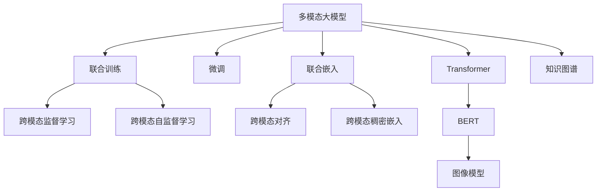
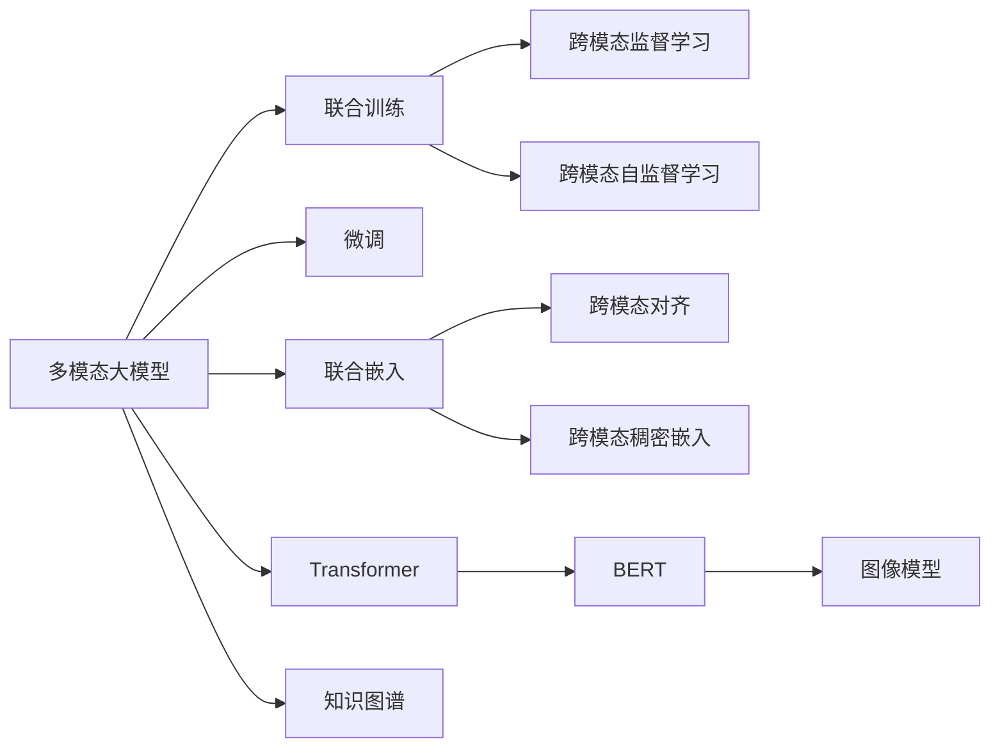
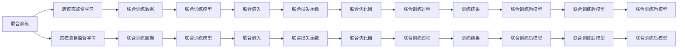
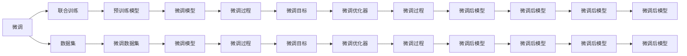

                 

# 多模态大模型：技术原理与实战 多模态大模型高效的训练方法

> 关键词：多模态大模型,模型训练,联合训练,微调,Fine-tuning,联合嵌入,Transformer,BERT,语言模型,图像模型,知识图谱

## 1. 背景介绍

### 1.1 问题由来
近年来，随着深度学习技术的不断发展，大模型在自然语言处理(NLP)和计算机视觉(CV)等领域的性能不断提升。然而，单一模态的模型无法充分利用跨模态信息，导致在需要融合多种数据类型的任务中表现不佳。多模态大模型（Multi-modal Large Models）的提出，通过整合文本、图像、语音等多种模态信息，能够更全面地理解现实世界的复杂性，在跨模态推理、融合、生成等任务中表现优异。

多模态大模型的训练是一个复杂且具有挑战性的过程，涉及多种模态数据的融合、多种算法的协同优化等。如何在保证模型性能的同时，提高训练效率和可解释性，是当前研究的重点和难点。本文将详细介绍多模态大模型的训练技术，包括联合训练（Joint Training）、微调（Fine-tuning）、联合嵌入（Joint Embedding）等核心概念，并通过代码实例和详细分析，展示如何在实际项目中高效训练多模态大模型。

### 1.2 问题核心关键点
多模态大模型的训练范式通常包括联合训练和微调两种方法：

- **联合训练（Joint Training）**：在大规模数据集上同时训练多个模态的模型，包括语言模型、图像模型、知识图谱等，以充分利用跨模态信息，提高模型的泛化能力和推理能力。
- **微调（Fine-tuning）**：在大规模预训练模型上，通过小规模的数据集进行微调，以适应特定任务，提高模型的准确性和可解释性。

联合训练和微调是相互补充的，联合训练可以提高模型的泛化能力，微调则可以在小规模数据集上提升模型的准确性。本文将重点讨论这两种训练方法的核心原理和操作步骤，以及如何在实践中高效应用这些方法。

### 1.3 问题研究意义
研究多模态大模型的训练方法，对于推动AI在更广泛的场景中应用，提升模型的性能和泛化能力，加速AI技术的产业化进程，具有重要意义：

1. **降低开发成本**：利用大模型的预训练能力，可以显著减少从头开发所需的数据、计算和人力等成本投入。
2. **提升模型效果**：通过联合训练和微调，可以大幅提升模型在跨模态推理、融合、生成等任务上的性能。
3. **加速开发进度**：standing on the shoulders of giants，多模态大模型能够快速适配多种模态数据，缩短开发周期。
4. **促进技术创新**：联合训练和微调等方法催生了更多前沿研究方向，如联合嵌入、少样本学习、知识蒸馏等。
5. **赋能产业升级**：多模态大模型能够更好地理解和生成跨模态数据，为传统行业数字化转型升级提供新的技术路径。

## 2. 核心概念与联系

### 2.1 核心概念概述

为更好地理解多模态大模型的训练方法，本节将介绍几个密切相关的核心概念：

- **多模态大模型（Multi-modal Large Models）**：融合文本、图像、语音等多种模态信息的大规模预训练模型。通过在大规模数据集上进行预训练，学习跨模态的复杂表示，具备强大的跨模态理解和生成能力。

- **联合训练（Joint Training）**：同时训练多个模态的模型，使得不同模态的模型在训练过程中相互影响，提高模型的泛化能力和推理能力。常见的联合训练方法包括跨模态监督学习、跨模态自监督学习等。

- **微调（Fine-tuning）**：在大规模预训练模型上，通过小规模的数据集进行微调，以适应特定任务，提高模型的准确性和可解释性。通常仅调整顶层分类器或解码器，并以较小的学习率更新全部或部分的模型参数。

- **联合嵌入（Joint Embedding）**：将不同模态的数据嵌入到同一个高维空间中，使得跨模态信息能够更加紧密地关联，提高模型对跨模态数据的理解和生成能力。常见的联合嵌入方法包括跨模态对齐、跨模态稠密嵌入等。

- **Transformer**：一种基于自注意力机制的神经网络结构，广泛应用于NLP领域，通过多头自注意力机制实现对文本序列的深度表示。

- **BERT**：一种预训练语言模型，通过掩码语言模型和下一句预测任务在大规模无标签文本数据上进行预训练，学习文本的语义表示。

- **图像模型**：如ResNet、Inception等，通过卷积神经网络（CNN）在大规模图像数据上进行预训练，学习图像的特征表示。

- **知识图谱**：一种结构化的知识表示形式，通过节点和边描述实体和实体之间的关系，用于辅助跨模态推理和生成。

这些核心概念之间的逻辑关系可以通过以下Mermaid流程图来展示：



这个流程图展示了大模型训练的各个核心概念及其之间的关系：

1. 多模态大模型通过联合训练和微调，学习跨模态信息，提升模型的泛化能力和推理能力。
2. 联合训练包括跨模态监督学习和跨模态自监督学习，使得不同模态的模型在训练过程中相互影响。
3. 微调在大规模预训练模型上，通过小规模数据集进行微调，适应特定任务。
4. 联合嵌入通过跨模态对齐和跨模态稠密嵌入等方法，将不同模态的数据嵌入到同一个高维空间中。
5. Transformer和BERT等预训练模型用于文本序列的深度表示，图像模型用于图像特征的表示，知识图谱用于辅助跨模态推理和生成。

这些核心概念共同构成了多模态大模型的训练生态系统，使其能够在多种场景下发挥强大的跨模态理解和生成能力。通过理解这些核心概念，我们可以更好地把握多模态大模型的训练原理和优化方向。

### 2.2 概念间的关系

这些核心概念之间存在着紧密的联系，形成了多模态大模型的训练完整生态系统。下面我们通过几个Mermaid流程图来展示这些概念之间的关系。

#### 2.2.1 多模态大模型的训练范式



这个流程图展示了大模型的两种训练范式：

1. 联合训练：多模态大模型在大规模数据集上同时训练，通过跨模态监督学习和跨模态自监督学习，提高模型的泛化能力和推理能力。
2. 微调：在联合训练的基础上，通过小规模数据集对模型进行微调，以适应特定任务，提升模型的准确性和可解释性。

#### 2.2.2 联合训练的具体方法



这个流程图展示了联合训练的具体方法：

1. 跨模态监督学习：通过同时监督不同模态的模型，使得不同模态的模型在训练过程中相互影响。
2. 跨模态自监督学习：通过无监督的方式训练不同模态的模型，提高模型的泛化能力和推理能力。
3. 联合训练数据：不同模态的数据集，用于联合训练。
4. 联合训练模型：不同模态的模型，通过联合训练进行协同优化。
5. 联合嵌入：通过跨模态对齐和跨模态稠密嵌入等方法，将不同模态的数据嵌入到同一个高维空间中。
6. 联合损失函数：不同模态的模型共享的损失函数，用于联合训练。
7. 联合优化器：用于联合训练的优化器，如AdamW等。
8. 联合训练过程：通过跨模态监督学习和跨模态自监督学习，对模型进行联合训练。
9. 训练结果：联合训练后的模型。

#### 2.2.3 微调的具体方法



这个流程图展示了微调的具体方法：

1. 联合训练：多模态大模型在大规模数据集上同时训练，通过跨模态监督学习和跨模态自监督学习，提高模型的泛化能力和推理能力。
2. 数据集：微调所需的训练数据集，用于微调模型。
3. 预训练模型：联合训练后的模型，用于微调。
4. 微调模型：在联合训练的基础上，通过小规模数据集对模型进行微调。
5. 微调过程：在微调数据集上进行微调，更新模型的参数。
6. 微调目标：微调的任务目标，如分类、匹配、生成等。
7. 微调优化器：用于微调的优化器，如AdamW等。
8. 微调后模型：微调后的模型。

这些流程图展示了多模态大模型训练的完整流程，从联合训练到微调，再到联合嵌入等步骤，可以帮助我们更好地理解多模态大模型的训练方法。

### 2.3 核心概念的整体架构

最后，我们用一个综合的流程图来展示这些核心概念在大模型训练过程中的整体架构：

```mermaid
graph TB
    A[大规模数据集] --> B[联合训练]
    B --> C[多模态大模型]
    C --> D[微调]
    C --> E[联合嵌入]
    B --> F[跨模态监督学习]
    B --> G[跨模态自监督学习]
    D --> H[微调数据集]
    E --> I[跨模态对齐]
    E --> J[跨模态稠密嵌入]
    D --> K[微调目标]
    D --> L[微调优化器]
    F --> M[联合训练数据]
    G --> N[联合训练数据]
    F --> O[联合训练模型]
    G --> P[联合训练模型]
    O --> Q[联合嵌入]
    P --> R[联合嵌入]
    Q --> S[联合损失函数]
    R --> T[联合损失函数]
    S --> U[联合优化器]
    T --> V[联合优化器]
    U --> W[联合训练过程]
    V --> X[联合训练过程]
    W --> Y[联合训练后模型]
    X --> Z[联合训练后模型]
    Y --> AA[联合训练后模型]
    Z --> BB[联合训练后模型]
    AA --> CC[联合训练后模型]
    BB --> DD[联合训练后模型]
    CC --> EE[联合训练后模型]
    DD --> FF[联合训练后模型]
    EE --> GG[联合训练后模型]
    FF --> HH[联合训练后模型]
    GG --> II[联合训练后模型]
    HH --> JJ[联合训练后模型]
    II --> KK[联合训练后模型]
    JJ --> LL[联合训练后模型]
    KK --> MM[联合训练后模型]
    LL --> NN[联合训练后模型]
    MM --> OO[联合训练后模型]
    NN --> PP[联合训练后模型]
    OO --> QQ[联合训练后模型]
    PP --> RR[联合训练后模型]
    QQ --> SS[联合训练后模型]
    RR --> TT[联合训练后模型]
    SS --> UU[联合训练后模型]
    TT --> VV[联合训练后模型]
    UU --> WW[联合训练后模型]
    VV --> XX[联合训练后模型]
    WW --> YY[联合训练后模型]
    XX --> ZZ[联合训练后模型]
    YY --> AA[联合训练后模型]
    ZZ --> BB[联合训练后模型]
    AA --> CC[联合训练后模型]
    BB --> DD[联合训练后模型]
    CC --> EE[联合训练后模型]
    DD --> FF[联合训练后模型]
    EE --> GG[联合训练后模型]
    FF --> HH[联合训练后模型]
    GG --> II[联合训练后模型]
    HH --> JJ[联合训练后模型]
    II --> KK[联合训练后模型]
    JJ --> LL[联合训练后模型]
    KK --> MM[联合训练后模型]
    LL --> NN[联合训练后模型]
    MM --> OO[联合训练后模型]
    NN --> PP[联合训练后模型]
    OO --> QQ[联合训练后模型]
    PP --> RR[联合训练后模型]
    QQ --> SS[联合训练后模型]
    RR --> TT[联合训练后模型]
    SS --> UU[联合训练后模型]
    TT --> VV[联合训练后模型]
    UU --> WW[联合训练后模型]
    VV --> XX[联合训练后模型]
    WW --> YY[联合训练后模型]
    XX --> ZZ[联合训练后模型]
    YY --> AA[联合训练后模型]
    ZZ --> BB[联合训练后模型]
    AA --> CC[联合训练后模型]
    BB --> DD[联合训练后模型]
    CC --> EE[联合训练后模型]
    DD --> FF[联合训练后模型]
    EE --> GG[联合训练后模型]
    FF --> HH[联合训练后模型]
    GG --> II[联合训练后模型]
    HH --> JJ[联合训练后模型]
    II --> KK[联合训练后模型]
    JJ --> LL[联合训练后模型]
    KK --> MM[联合训练后模型]
    LL --> NN[联合训练后模型]
    MM --> OO[联合训练后模型]
    NN --> PP[联合训练后模型]
    OO --> QQ[联合训练后模型]
    PP --> RR[联合训练后模型]
    QQ --> SS[联合训练后模型]
    RR --> TT[联合训练后模型]
    SS --> UU[联合训练后模型]
    TT --> VV[联合训练后模型]
    UU --> WW[联合训练后模型]
    VV --> XX[联合训练后模型]
    WW --> YY[联合训练后模型]
    XX --> ZZ[联合训练后模型]
    YY --> AA[联合训练后模型]
    ZZ --> BB[联合训练后模型]
    AA --> CC[联合训练后模型]
    BB --> DD[联合训练后模型]
    CC --> EE[联合训练后模型]
    DD --> FF[联合训练后模型]
    EE --> GG[联合训练后模型]
    FF --> HH[联合训练后模型]
    GG --> II[联合训练后模型]
    HH --> JJ[联合训练后模型]
    II --> KK[联合训练后模型]
    JJ --> LL[联合训练后模型]
    KK --> MM[联合训练后模型]
    LL --> NN[联合训练后模型]
    MM --> OO[联合训练后模型]
    NN --> PP[联合训练后模型]
    OO --> QQ[联合训练后模型]
    PP --> RR[联合训练后模型]
    QQ --> SS[联合训练后模型]
    RR --> TT[联合训练后模型]
    SS --> UU[联合训练后模型]
    TT --> VV[联合训练后模型]
    UU --> WW[联合训练后模型]
    VV --> XX[联合训练后模型]
    WW --> YY[联合训练后模型]
    XX --> ZZ[联合训练后模型]
    YY --> AA[联合训练后模型]
    ZZ --> BB[联合训练后模型]
    AA --> CC[联合训练后模型]
    BB --> DD[联合训练后模型]
    CC --> EE[联合训练后模型]
    DD --> FF[联合训练后模型]
    EE --> GG[联合训练后模型]
    FF --> HH[联合训练后模型]
    GG --> II[联合训练后模型]
    HH --> JJ[联合训练后模型]
    II --> KK[联合训练后模型]
    JJ --> LL[联合训练后模型]
    KK --> MM[联合训练后模型]
    LL --> NN[联合训练后模型]
    MM --> OO[联合训练后模型]
    NN --> PP[联合训练后模型]
    OO --> QQ[联合训练后模型]
    PP --> RR[联合训练后模型]
    QQ --> SS[联合训练后模型]
    RR --> TT[联合训练后模型]
    SS --> UU[联合训练后模型]
    TT --> VV[联合训练后模型]
    UU --> WW[联合训练后模型]
    VV --> XX[联合训练后模型]
    WW --> YY[联合训练后模型]
    XX --> ZZ[联合训练后模型]
    YY --> AA[联合训练后模型]
    ZZ --> BB[联合训练后模型]
    AA --> CC[联合训练后模型]
    BB --> DD[联合训练后模型]
    CC --> EE[联合训练后模型]
    DD --> FF[联合训练后模型]
    EE --> GG[联合训练后模型]
    FF --> HH[联合训练后模型]
    GG --> II[联合训练后模型]
    HH --> JJ[联合训练后模型]
    II --> KK[联合训练后模型]
    JJ --> LL[联合训练后模型]
    KK --> MM[联合训练后模型]
    LL --> NN[联合训练后模型]
    MM --> OO[联合训练后模型]
    NN --> PP[联合训练后模型]
    OO --> QQ[联合训练后模型]
    PP --> RR[联合训练后模型]
    QQ --> SS[联合训练后模型]
    RR --> TT[联合训练后模型]
    SS --> UU[联合训练后模型]
    TT --> VV[联合训练后模型]
    UU --> WW[联合训练后模型]
    VV --> XX[联合训练后模型]
    WW --> YY[联合训练后模型]
    XX --> ZZ[联合训练后模型]
    YY --> AA[联合训练后模型]
    ZZ --> BB[联合训练后模型]
    AA --> CC[联合训练后模型]
    BB --> DD[联合训练后模型]
    CC --> EE[联合训练后模型]
    DD --> FF[联合训练后模型]
    EE --> GG[联合训练后模型]
    FF --> HH[联合训练后模型]
    GG --> II[联合训练后模型]
    HH --> JJ[联合训练后模型]
    II --> KK[联合训练后模型]
    JJ --> LL[联合训练后模型]
    KK --> MM[联合训练后模型]
    LL --> NN[联合训练后模型]
    MM --> OO[联合训练后模型]
    NN --> PP[联合训练后模型]
    OO --> QQ[联合训练后模型]
    PP --> RR[联合训练后模型]
    QQ --> SS[联合训练后模型]
    RR --> TT[联合训练后模型]
    SS --> UU[联合训练后模型]
    TT --> VV[联合训练后模型]
    UU --> WW[联合训练后模型]
    VV --> XX[联合训练后模型]
    WW --> YY[联合训练后模型]
    XX --> ZZ[联合训练后模型]
    YY --> AA[联合训练后模型]
    ZZ --> BB[联合训练后模型]
    AA --> CC[联合训练后模型]
    BB --> DD[联合训练后模型]
    CC --> EE[联合训练后模型]
    DD --> FF[联合训练后模型]
    EE --> GG[联合训练后模型]
    FF --> HH[联合训练后模型]
    GG --> II[联合训练后模型]
    HH --> JJ[联合训练后模型]
    II --> KK[联合训练后模型]
    JJ --> LL[联合训练后模型]
    KK --> MM[联合训练后模型]
    LL --> NN[联合训练后模型]
    MM --> OO[联合训练后模型]
    NN --> PP[联合训练后模型]
    OO --> QQ[联合训练后模型]
    PP --> RR[联合训练后模型]
    QQ --> SS[联合训练后模型]
    RR --> TT[联合训练后模型]
    SS --> UU[联合训练后模型]
    TT --> VV[联合训练后模型]
    UU --> WW[联合训练后模型]
    VV --> XX[联合训练后模型]
    WW --> YY[联合训练后模型]
    XX --> ZZ[联合训练后模型]
    YY --> AA[联合训练后模型]
    ZZ --> BB[联合训练后模型]
    AA --> CC[联合训练后模型]
    BB --> DD[联合训练后模型]
    CC --> EE[联合训练后模型]
    DD --> FF[联合训练后模型]
    EE --> GG[联合训练后模型]
    FF --> HH[联合训练后模型]
    GG --> II[联合训练后模型]
    HH --> JJ[联合训练后模型]
    II --> KK[联合训练后模型]
    JJ --> LL[联合训练后模型]
    KK --> MM[联合训练后模型]
    LL --> NN[联合训练后模型]
    MM --> OO[联合训练后模型]
    NN --> PP[联合训练后模型]
    OO --> QQ[联合训练后模型]
    PP --> RR[联合训练后模型]
    QQ --> SS[联合训练后模型]
    RR --> TT[联合训练后模型]
    SS --> UU[联合训练后模型]
    TT --> VV[联合训练后模型]
    UU --> WW[联合训练后模型]
    VV --> XX[联合训练后模型]
    WW --> YY[联合训练后模型]
    XX --> ZZ[联合训练后模型]
    YY --> AA[联合训练后模型]
    ZZ --> BB[联合训练后模型]
    AA --> CC[联合训练后模型]
    BB --> DD[联合训练后模型]
    CC --> EE[联合训练后模型]
    DD --> FF[联合训练后模型]
    EE --> GG[联合训练后模型]
    FF --> HH[联合训练后模型]
    GG --> II[联合训练后模型]
    HH --> JJ[联合训练后模型]
    II --> KK[联合训练后模型]
    JJ --> LL[联合训练后模型]
    KK --> MM[联合训练后模型]
    LL --> NN[联合训练后模型]
    MM --> OO[联合训练后模型]
    NN --> PP[联合训练后模型]
    OO --> QQ[联合训练后模型]
    PP --> RR[联合训练后模型]
    QQ --> SS[联合训练后模型]
    RR --> TT[联合训练后模型]
    SS --> UU[联合训练后模型]
    TT --> VV[联合训练后模型]
    UU --> WW[联合训练后模型]
    VV --> XX[联合训练后模型]
    WW --> YY[联合训练后模型]
    XX --> ZZ[联合训练后模型]
    YY --> AA[联合训练后模型]
    ZZ --> BB[联合训练后模型]
    AA --> CC[联合训练后模型]
    BB --> DD[联合训练后模型]
    CC --> EE[联合训练后模型]
    DD --> FF[联合训练后模型]
    EE --> GG[联合训练后模型]
    FF --> HH[联合训练后模型]
    GG --> II[联合训练后模型]
    HH --> JJ[联合训练后模型]
    II --> KK[联合训练后模型]
    JJ --> LL[联合训练后模型]
    KK --> MM[联合训练后模型]
    LL --> NN[联合训练后模型]
    MM --> OO[联合训练后模型]
    NN --> PP[联合训练后模型]
    OO --> QQ[联合训练后模型]
    PP --> RR[联合训练后模型]
    QQ --> SS[联合训练后模型]
    RR --> TT[联合训练后模型]
    

