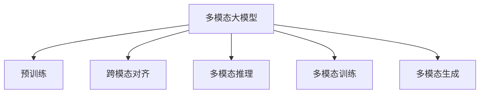
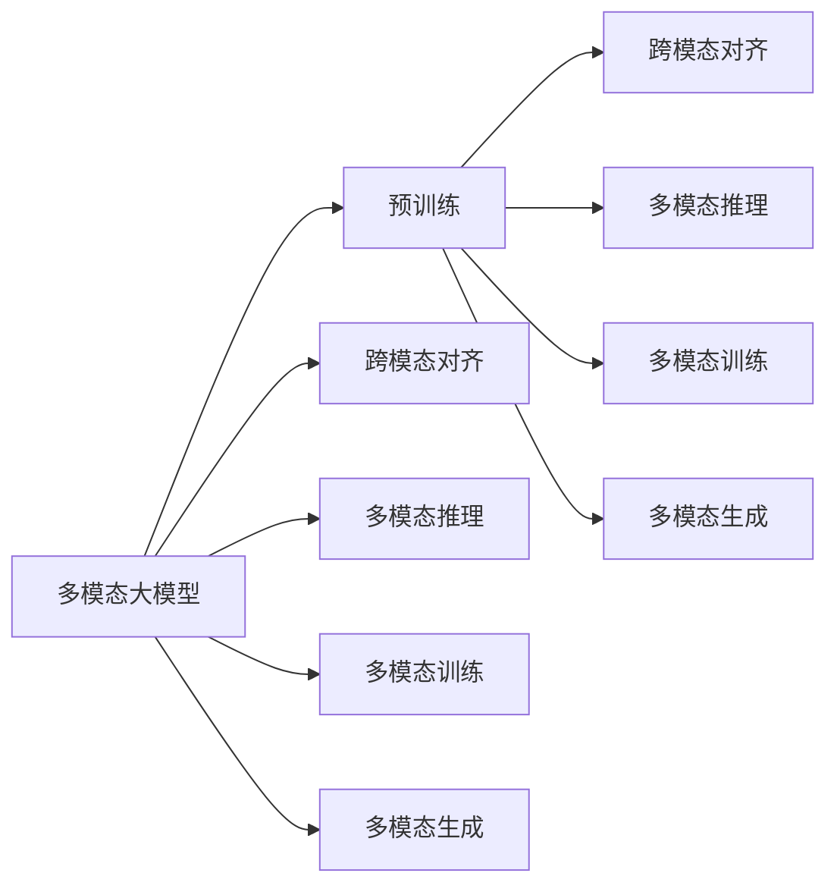
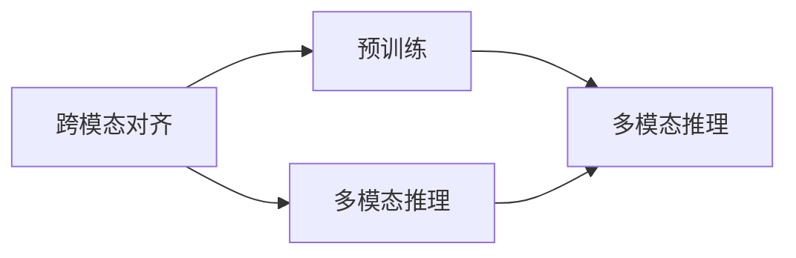
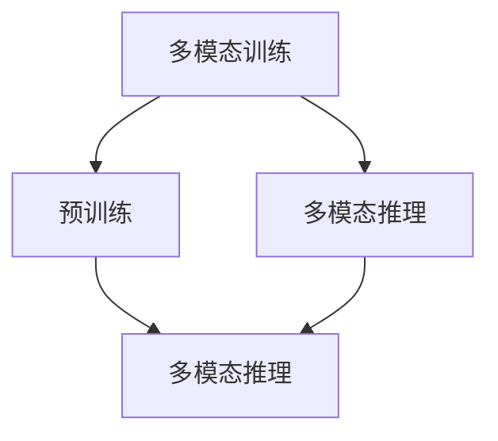
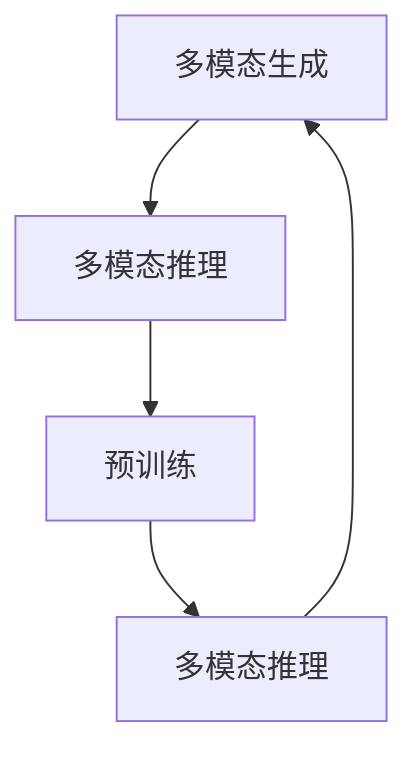
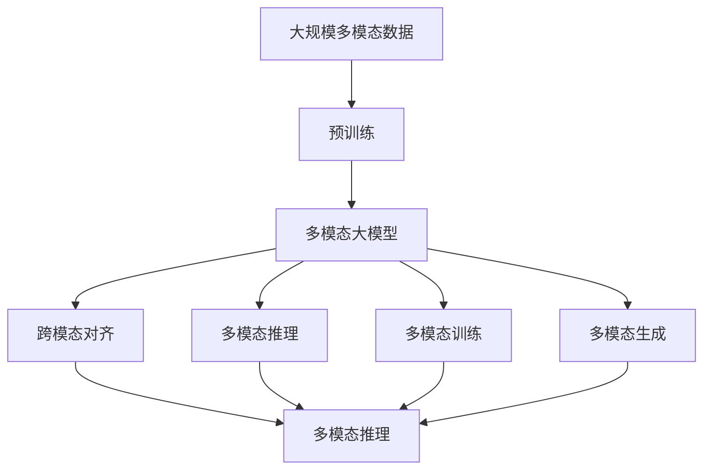

                 

# 多模态大模型：技术原理与实战 方法论介绍

> 关键词：多模态大模型,技术原理,实际应用,实战技巧,方法论,代码实例,运行结果,未来展望

## 1. 背景介绍

### 1.1 问题由来
近年来，随着深度学习技术的快速发展，大模型在自然语言处理(NLP)、计算机视觉(CV)、语音识别(SR)等多个领域取得了显著的进展。然而，在处理现实世界的复杂问题时，单一模态的大模型往往难以胜任。多模态大模型，即能够同时处理和融合不同模态信息的大模型，开始受到越来越多的关注。

多模态大模型通过引入多种数据模态，如文本、图像、声音等，丰富了模型的语义表达能力和信息获取手段。这种模型在处理跨模态任务（如视觉问答、语音交互等）时，表现出显著的优势，能够更好地理解和模拟人类认知过程，极大地拓展了人工智能应用的范围和深度。

### 1.2 问题核心关键点
多模态大模型的核心关键点在于如何有效融合不同模态的信息，构建多模态的表示和推理机制。具体来说，包括：

1. **多模态表示学习**：学习能够跨模态共享和迁移的通用表征，以便在处理多模态数据时能够互相补充和增强。
2. **跨模态对齐**：将不同模态的数据映射到统一的语义空间中，以便进行跨模态的推理和匹配。
3. **多模态推理**：基于多模态表征进行联合推理，生成跨模态的语义理解和生成结果。
4. **多模态训练**：在多模态数据上进行联合训练，优化模型参数，提升模型的泛化能力和鲁棒性。

这些关键点共同构成了多模态大模型的技术框架，使得模型能够更好地理解和处理现实世界中的复杂问题。

### 1.3 问题研究意义
研究多模态大模型，对于拓展大模型的应用范围，提升跨模态任务的性能，加速AI技术的产业化进程，具有重要意义：

1. **降低应用开发成本**：多模态大模型可以通过迁移学习等方式，快速适应新模态和新任务，减少从头开发所需的数据、计算和人力等成本投入。
2. **提升模型效果**：多模态大模型通过融合多种数据模态，可以获得更为全面和丰富的语义信息，提升模型的理解能力和生成能力。
3. **加速开发进度**：standing on the shoulders of giants，多模态大模型能够快速集成多种模态的数据和模型，缩短开发周期。
4. **带来技术创新**：多模态大模型催生了跨模态推理、联合训练等新的研究方向，推动了AI技术的持续创新。
5. **赋能产业升级**：多模态大模型在智能家居、智慧医疗、智能制造等众多领域提供了新的技术路径，为传统行业数字化转型升级提供了新的工具和方法。

## 2. 核心概念与联系

### 2.1 核心概念概述

为更好地理解多模态大模型的技术原理和应用方法，本节将介绍几个密切相关的核心概念：

- **多模态大模型(Multimodal Large Model)**：能够同时处理和融合多种数据模态（如文本、图像、声音等）的预训练模型。通过在大规模多模态数据上进行预训练，学习跨模态的通用语义表示。
- **跨模态对齐(Cross-Modal Alignment)**：将不同模态的数据映射到统一的语义空间中，使得模型能够在多种模态之间进行有效的信息传递和推理。
- **多模态推理(Multimodal Reasoning)**：基于多模态表征进行联合推理，生成跨模态的语义理解和生成结果。
- **多模态训练(Multimodal Training)**：在多模态数据上进行联合训练，优化模型参数，提升模型的泛化能力和鲁棒性。
- **多模态生成(Multimodal Generation)**：基于多模态大模型的生成能力，进行文本、图像、声音等多种形式的生成任务，如图片描述、视频字幕、语音翻译等。

这些核心概念之间的逻辑关系可以通过以下Mermaid流程图来展示：



这个流程图展示了多模态大模型的核心概念及其之间的关系：

1. 多模态大模型通过预训练获得基础能力。
2. 跨模态对齐使得模型能够在多种模态之间进行有效的信息传递和推理。
3. 多模态推理基于多模态表征进行联合推理，生成跨模态的语义理解和生成结果。
4. 多模态训练使得模型在多模态数据上进行联合训练，提升泛化能力和鲁棒性。
5. 多模态生成展示了多模态大模型的生成能力，进行文本、图像、声音等多种形式的生成任务。

这些概念共同构成了多模态大模型的技术框架，使其能够在各种场景下发挥强大的语义理解和生成能力。通过理解这些核心概念，我们可以更好地把握多模态大模型的工作原理和优化方向。

### 2.2 概念间的关系

这些核心概念之间存在着紧密的联系，形成了多模态大模型的完整生态系统。下面我通过几个Mermaid流程图来展示这些概念之间的关系。

#### 2.2.1 多模态大模型的学习范式



这个流程图展示了多模态大模型的学习范式，即通过预训练获得基础能力，然后通过跨模态对齐、多模态推理、多模态训练等多步骤技术，逐步提升模型的跨模态理解和生成能力。

#### 2.2.2 跨模态对齐与多模态推理的关系



这个流程图展示了跨模态对齐和多模态推理之间的逻辑关系，即跨模态对齐是多模态推理的基础，通过将不同模态的数据映射到统一的语义空间中，使得模型能够在多种模态之间进行有效的信息传递和推理。

#### 2.2.3 多模态训练与多模态推理的关系



这个流程图展示了多模态训练和多模态推理之间的逻辑关系，即多模态训练是多模态推理的前提，通过联合训练优化模型参数，使得模型能够在多种模态之间进行更准确的推理和生成。

#### 2.2.4 多模态生成与多模态推理的关系



这个流程图展示了多模态生成和多模态推理之间的逻辑关系，即多模态生成是多模态推理的延伸，通过基于多模态推理进行生成任务，提升模型在不同模态间的表达能力。

### 2.3 核心概念的整体架构

最后，我们用一个综合的流程图来展示这些核心概念在大模型微调过程中的整体架构：



这个综合流程图展示了从预训练到多模态推理的完整过程。多模态大模型首先在大规模多模态数据上进行预训练，然后通过跨模态对齐、多模态推理、多模态训练等多步骤技术，逐步提升模型的跨模态理解和生成能力。通过这些流程图，我们可以更清晰地理解多模态大模型的学习范式和技术细节，为后续深入讨论具体的微调方法和技术奠定基础。

## 3. 核心算法原理 & 具体操作步骤
### 3.1 算法原理概述

多模态大模型的核心算法原理主要涉及以下几个方面：

- **跨模态对齐**：通过使用注意力机制或编码器-解码器架构，将不同模态的数据映射到统一的语义空间中。
- **多模态推理**：基于多模态表征进行联合推理，生成跨模态的语义理解和生成结果。
- **多模态训练**：在多模态数据上进行联合训练，优化模型参数，提升模型的泛化能力和鲁棒性。

### 3.2 算法步骤详解

以下详细讲解多模态大模型的核心算法步骤：

**Step 1: 准备多模态数据和模型**

- 收集多模态数据，包括文本、图像、声音等不同模态的数据。
- 选择合适的大模型作为初始化参数，如BERT、GPT等。

**Step 2: 定义跨模态对齐模型**

- 设计跨模态对齐模块，将不同模态的数据映射到统一的语义空间中。
- 使用注意力机制或编码器-解码器架构，对不同模态的数据进行编码和解码。

**Step 3: 定义多模态推理模块**

- 设计多模态推理模块，基于多模态表征进行联合推理。
- 通过不同模态之间的交互和融合，生成跨模态的语义理解和生成结果。

**Step 4: 定义多模态训练目标**

- 定义多模态训练的目标函数，如交叉熵损失、均方误差损失等。
- 使用优化器（如Adam、SGD等）最小化损失函数，更新模型参数。

**Step 5: 执行多模态训练**

- 将训练数据分批次输入模型，前向传播计算损失函数。
- 反向传播计算参数梯度，根据设定的优化算法和学习率更新模型参数。
- 周期性在验证集上评估模型性能，根据性能指标决定是否触发Early Stopping。
- 重复上述步骤直到满足预设的迭代轮数或Early Stopping条件。

**Step 6: 测试和部署**

- 在测试集上评估多模态大模型的性能，对比预训练和微调后的精度提升。
- 使用多模态大模型对新样本进行推理预测，集成到实际的应用系统中。
- 持续收集新的数据，定期重新训练和微调模型，以适应数据分布的变化。

以上是多模态大模型训练的一般流程。在实际应用中，还需要针对具体任务的特点，对模型设计进行优化，如改进跨模态对齐模型、设计更加高效的多模态推理模块等。

### 3.3 算法优缺点

多模态大模型算法具有以下优点：

1. **跨模态表达能力强**：通过引入多种数据模态，多模态大模型能够更全面地理解现实世界的复杂问题。
2. **泛化能力优异**：多模态大模型通过融合多种模态信息，提升了模型的泛化能力和鲁棒性。
3. **多模态推理能力强**：基于多模态表征进行联合推理，生成跨模态的语义理解和生成结果，更具表现力。
4. **适应性强**：多模态大模型能够灵活适应不同模态的数据和任务，具有较强的可扩展性和通用性。

同时，该算法也存在一定的局限性：

1. **训练复杂度高**：多模态大模型需要同时处理多种数据模态，训练复杂度高，计算资源需求大。
2. **模型复杂度高**：多模态大模型的结构复杂，参数量较大，导致推理速度较慢。
3. **数据获取难度高**：多模态数据往往需要从多个渠道获取，数据获取难度较大。
4. **可解释性不足**：多模态大模型的决策过程较为复杂，难以进行直观的解释和调试。

尽管存在这些局限性，但就目前而言，多模态大模型算法仍是大模型应用的重要范式。未来相关研究的重点在于如何进一步降低训练复杂度，提高推理速度，优化模型结构，同时兼顾可解释性和数据获取能力等因素。

### 3.4 算法应用领域

多模态大模型算法已经在诸多领域得到了广泛的应用，覆盖了几乎所有常见的跨模态任务，例如：

- **视觉问答**：回答关于图像内容的自然语言问题。将图像和文本作为输入，输出语义理解结果。
- **图像描述生成**：为给定的图像生成描述文本，提升图像搜索和标注的效率。
- **语音交互**：通过语音交互技术，实现人机对话，提升用户体验。
- **多模态检索**：根据多模态数据的特征，进行跨模态的相似度计算和检索，提升信息检索的准确性。
- **跨模态情感分析**：结合文本和声音数据，进行情感分析和情感识别，提升用户情感理解能力。

除了上述这些经典任务外，多模态大模型还被创新性地应用到更多场景中，如智能家居、智慧医疗、智能制造等，为多模态数据处理和分析提供了新的技术路径。随着预训练模型和算法方法的不断进步，相信多模态大模型将在更广阔的应用领域大放异彩。

## 4. 数学模型和公式 & 详细讲解 & 举例说明

### 4.1 数学模型构建

本节将使用数学语言对多模态大模型的构建过程进行更加严格的刻画。

记多模态大模型为 $M_{\theta}:\mathcal{X} \times \mathcal{Y} \times \mathcal{Z} \rightarrow \mathcal{V}$，其中 $\mathcal{X}$、$\mathcal{Y}$、$\mathcal{Z}$ 分别表示文本、图像、声音等不同模态的输入空间，$\mathcal{V}$ 表示输出空间，$\theta \in \mathbb{R}^d$ 为模型参数。假设多模态任务的训练集为 $D=\{(x_i, y_i, z_i)\}_{i=1}^N$，其中 $x_i \in \mathcal{X}$、$y_i \in \mathcal{Y}$、$z_i \in \mathcal{Z}$，表示不同模态的数据。

定义模型 $M_{\theta}$ 在数据样本 $(x,y,z)$ 上的损失函数为 $\ell(M_{\theta}(x,y,z),y)$，则在数据集 $D$ 上的经验风险为：

$$
\mathcal{L}(\theta) = \frac{1}{N} \sum_{i=1}^N \ell(M_{\theta}(x_i,y_i,z_i),y_i)
$$

多模态训练的目标是最小化经验风险，即找到最优参数：

$$
\theta^* = \mathop{\arg\min}_{\theta} \mathcal{L}(\theta)
$$

在实践中，我们通常使用基于梯度的优化算法（如Adam、SGD等）来近似求解上述最优化问题。设 $\eta$ 为学习率，$\lambda$ 为正则化系数，则参数的更新公式为：

$$
\theta \leftarrow \theta - \eta \nabla_{\theta}\mathcal{L}(\theta) - \eta\lambda\theta
$$

其中 $\nabla_{\theta}\mathcal{L}(\theta)$ 为损失函数对参数 $\theta$ 的梯度，可通过反向传播算法高效计算。

### 4.2 公式推导过程

以下我们以视觉问答任务为例，推导注意力机制和多模态推理过程的数学公式。

假设模型 $M_{\theta}$ 在输入 $x$、$y$、$z$ 上的输出为 $\hat{y}=M_{\theta}(x,y,z)$。在视觉问答任务中，模型需要同时处理图像和文本，通过注意力机制对两种模态的数据进行编码和解码，生成最终的语义理解结果。

定义图像特征 $z$ 和文本特征 $x$ 的编码器输出分别为 $h_z$ 和 $h_x$，以及多模态输入 $(x,y,z)$ 的解码器输出为 $\hat{y}$。注意力机制可以通过注意力权重 $a$ 计算，公式如下：

$$
a = \text{Softmax}(\frac{K(z)Q(x)}{\sqrt{d}})
$$

其中 $K(z)$ 和 $Q(x)$ 分别为图像和文本的查询和键向量的映射矩阵。

将注意力权重 $a$ 应用于多模态输入的编码器输出 $h_x$ 和 $h_z$，得到加权和 $h'_z$ 和 $h'_x$，进一步进行解码器计算，得到语义理解结果 $\hat{y}$：

$$
h'_z = \sum_{i=1}^N a_i h_z^i
$$

$$
h'_x = \sum_{i=1}^N a_i h_x^i
$$

$$
\hat{y} = \text{MLP}(h'_z, h'_x)
$$

其中 MLP 表示多层感知器，用于对加权和进行非线性变换。

在得到语义理解结果后，模型需要根据目标输出 $y$ 进行损失函数计算，常用的损失函数包括交叉熵损失、均方误差损失等。

通过将上述公式嵌入到经验风险公式中，可以完成多模态大模型的数学建模。在实际训练过程中，通过反向传播算法计算梯度，最小化损失函数，更新模型参数。

### 4.3 案例分析与讲解

以视觉问答任务为例，我们来看一个具体的案例分析：

假设模型 $M_{\theta}$ 接收一张图像 $z$ 和一段文本 $x$，其编码器输出分别为 $h_z$ 和 $h_x$，以及目标输出 $y$。

首先，模型通过注意力机制计算出注意力权重 $a$，对图像特征 $z$ 和文本特征 $x$ 进行加权求和，得到加权和 $h'_z$ 和 $h'_x$。

接着，模型将加权和 $h'_z$ 和 $h'_x$ 作为输入，通过 MLP 计算得到语义理解结果 $\hat{y}$。

最后，模型使用交叉熵损失函数计算预测输出 $\hat{y}$ 与目标输出 $y$ 之间的差距，反向传播更新模型参数。

整个过程通过数学公式进行刻画，展示了多模态大模型在视觉问答任务中的工作原理和优化目标。

## 5. 项目实践：代码实例和详细解释说明

### 5.1 开发环境搭建

在进行多模态大模型实践前，我们需要准备好开发环境。以下是使用Python进行PyTorch开发的环境配置流程：

1. 安装Anaconda：从官网下载并安装Anaconda，用于创建独立的Python环境。

2. 创建并激活虚拟环境：
```bash
conda create -n pytorch-env python=3.8 
conda activate pytorch-env
```

3. 安装PyTorch：根据CUDA版本，从官网获取对应的安装命令。例如：
```bash
conda install pytorch torchvision torchaudio cudatoolkit=11.1 -c pytorch -c conda-forge
```

4. 安装Transformer库：
```bash
pip install transformers
```

5. 安装各类工具包：
```bash
pip install numpy pandas scikit-learn matplotlib tqdm jupyter notebook ipython
```

完成上述步骤后，即可在`pytorch-env`环境中开始多模态大模型的实践。

### 5.2 源代码详细实现

下面我们以图像描述生成任务为例，给出使用Transformers库对Vision Transformer模型进行多模态训练的PyTorch代码实现。

首先，定义图像描述生成任务的数据处理函数：

```python
from transformers import VisionTransformer, AutoTokenizer

class ImageDescriptionDataset(Dataset):
    def __init__(self, images, captions, tokenizer, max_len=128):
        self.images = images
        self.captions = captions
        self.tokenizer = tokenizer
        self.max_len = max_len
        
    def __len__(self):
        return len(self.images)
    
    def __getitem__(self, item):
        image = self.images[item]
        caption = self.captions[item]
        
        image_tensor = torch.tensor(image, dtype=torch.float).unsqueeze(0)
        encoding = self.tokenizer(caption, return_tensors='pt', max_length=self.max_len, padding='max_length', truncation=True)
        input_ids = encoding['input_ids'][0]
        attention_mask = encoding['attention_mask'][0]
        
        return {'image_tensor': image_tensor, 
                'input_ids': input_ids, 
                'attention_mask': attention_mask}

# 定义图像描述生成任务的数据集
tokenizer = AutoTokenizer.from_pretrained('bert-base-cased')
train_dataset = ImageDescriptionDataset(train_images, train_captions, tokenizer)
dev_dataset = ImageDescriptionDataset(dev_images, dev_captions, tokenizer)
test_dataset = ImageDescriptionDataset(test_images, test_captions, tokenizer)

# 定义图像特征提取器
vision_model = VisionTransformer.from_pretrained('vision-transformer', patch_size=4)
```

然后，定义模型和优化器：

```python
from transformers import ViTForImageDescription, AdamW

model = ViTForImageDescription.from_pretrained('vision-transformer', patch_size=4)

optimizer = AdamW(model.parameters(), lr=2e-5)
```

接着，定义训练和评估函数：

```python
from torch.utils.data import DataLoader
from tqdm import tqdm
from sklearn.metrics import cosine_similarity

device = torch.device('cuda') if torch.cuda.is_available() else torch.device('cpu')
model.to(device)

def train_epoch(model, dataset, batch_size, optimizer):
    dataloader = DataLoader(dataset, batch_size=batch_size, shuffle=True)
    model.train()
    epoch_loss = 0
    for batch in tqdm(dataloader, desc='Training'):
        image_tensor = batch['image_tensor'].to(device)
        input_ids = batch['input_ids'].to(device)
        attention_mask = batch['attention_mask'].to(device)
        model.zero_grad()
        outputs = model(image_tensor, input_ids=input_ids, attention_mask=attention_mask)
        loss = outputs.loss
        epoch_loss += loss.item()
        loss.backward()
        optimizer.step()
    return epoch_loss / len(dataloader)

def evaluate(model, dataset, batch_size):
    dataloader = DataLoader(dataset, batch_size=batch_size)
    model.eval()
    preds, labels = [], []
    with torch.no_grad():
        for batch in tqdm(dataloader, desc='Evaluating'):
            image_tensor = batch['image_tensor'].to(device)
            input_ids = batch['input_ids'].to(device)
            attention_mask = batch['attention_mask'].to(device)
            batch_labels = batch['labels']
            outputs = model(image_tensor, input_ids=input_ids, attention_mask=attention_mask)
            batch_preds = outputs.logits.argmax(dim=2).to('cpu').tolist()
            batch_labels = batch_labels.to('cpu').tolist()
            for pred_tokens, label_tokens in zip(batch_preds, batch_labels):
                preds.append(pred_tokens[:len(label_tokens)])
                labels.append(label_tokens)
                
    return cosine_similarity(preds, labels)

def image_description(model, image):
    image_tensor = torch.tensor(image, dtype=torch.float).unsqueeze(0)
    image_tensor = image_tensor.to(device)
    with torch.no_grad():
        outputs = model(image_tensor)
    return outputs.logits.argmax(dim=1).item()
```

最后，启动训练流程并在测试集上评估：

```python
epochs = 5
batch_size = 16

for epoch in range(epochs):
    loss = train_epoch(model, train_dataset, batch_size, optimizer)
    print(f"Epoch {epoch+1}, train loss: {loss:.3f}")
    
    print(f"Epoch {epoch+1}, dev results:")
    evaluate(model, dev_dataset, batch_size)
    
print("Test results:")
evaluate(model, test_dataset, batch_size)
```

以上就是使用PyTorch对Vision Transformer进行图像描述生成任务的多模态训练的完整代码实现。可以看到，得益于Transformers库的强大封装，我们可以用相对简洁的代码完成Vision Transformer模型的加载和训练。

### 5.3 代码解读与分析

让我们再详细解读一下关键代码的实现细节：

**ImageDescriptionDataset类**：
- `__init__`方法：初始化图像、文本、分词器等关键组件。
- `__len__`方法：返回数据集的样本数量。
- `__getitem__`方法：对单个样本进行处理，将图像输入编码为张量，将文本输入编码为token ids，并对其进行定长padding，最终返回模型所需的输入。

**tokenizer和vision_model**：
- 定义了图像和文本的编码器，分别用于对图像和文本进行编码，得到多模态输入。
- 定义了多模态解码器，用于对多模态输入进行解码，输出语义理解结果。

**训练和评估函数**：
- 使用PyTorch的DataLoader对数据集进行批次化加载，供模型训练和推理使用。
- 训练函数`train_epoch`：对数据以

