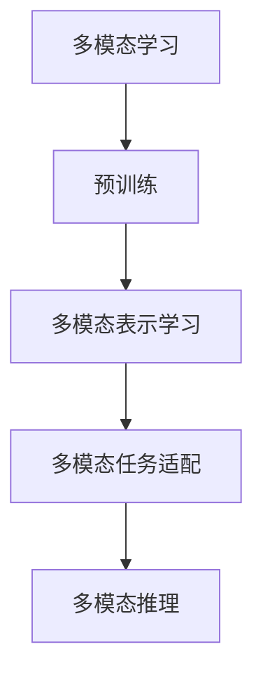

                 

# 多模态大模型：整合视觉与文本信息的前沿科技

## 1. 背景介绍

### 1.1 问题由来

在过去的几年里，深度学习技术取得了飞速的进步，尤其是在视觉和自然语言处理（NLP）领域。然而，虽然视觉和文本各自都有显著的进展，但它们在各自领域之间的合作相对较少。这主要是因为多模态（跨模态）学习技术还不够成熟，缺乏高效整合视觉和文本信息的手段。

近年来，多模态学习成为了研究的热点，因为它能够整合视觉和文本信息，提升模型的理解和表现能力。例如，在医学影像诊断中，医生需要同时参考病人的文本病历和影像来做出准确的诊断。然而，由于医学影像和病历数据类型不同，传统的机器学习模型难以进行有效融合。

多模态大模型，即整合了视觉和文本信息的大型预训练模型，能够通过在大规模数据上进行预训练，学习到丰富的多模态知识，从而在多模态任务上取得突破。这些模型不仅能够处理单一模态的信息，还能够同时处理多个模态的信息，从而提升了模型的泛化能力和应用范围。

### 1.2 问题核心关键点

多模态大模型的核心思想是将视觉和文本信息进行有效融合，以提升模型的泛化能力和应用范围。具体来说，它的关键点包括：

- 多模态数据：包括文本和视觉等多种信息源，通过多模态数据预训练，使得模型能够同时处理不同模态的数据。
- 跨模态特征学习：通过自监督学习等方式，使得模型能够学习到不同模态之间的映射关系，从而在多种模态上表现出色。
- 多模态任务适配：在多模态预训练后，通过微调等技术，使得模型能够适应特定的多模态任务，如视觉问答、图像描述生成等。
- 多模态推理：通过整合视觉和文本信息，使得模型能够进行多模态推理，提升对复杂场景的理解能力。

这些关键点构成了多模态大模型的核心框架，使得模型能够高效整合多种信息源，提升其在多模态任务上的表现。

### 1.3 问题研究意义

研究多模态大模型的意义重大，因为它能够打破视觉和文本信息之间的壁垒，提升模型的理解和表现能力。具体来说，它具有以下意义：

- 提升多模态任务性能：通过整合视觉和文本信息，使得模型能够在多种模态任务上表现出色，如图像描述生成、视觉问答等。
- 降低数据获取成本：在多模态任务中，往往需要同时收集文本和视觉数据，多模态大模型能够通过共享视觉和文本数据，降低数据获取成本。
- 拓展应用领域：多模态大模型能够应用于更广泛的领域，如医疗、金融、教育等，从而推动相关领域的智能化进程。
- 促进跨学科研究：多模态大模型能够促进视觉和文本领域的融合，推动跨学科研究的发展。

## 2. 核心概念与联系

### 2.1 核心概念概述

为了更好地理解多模态大模型，我们需要先了解一些关键概念：

- 多模态学习（Multimodal Learning）：指同时使用多个信息源，如文本、视觉等，进行学习的过程。
- 预训练（Pre-training）：指在大规模无标签数据上进行自监督学习，学习通用特征表示的过程。
- 多模态表示学习（Multimodal Representation Learning）：指在多模态数据上进行表示学习，学习不同模态之间的映射关系。
- 多模态任务适配（Multimodal Task Adaptation）：指在多模态预训练后，通过微调等技术，使得模型适应特定的多模态任务。
- 多模态推理（Multimodal Reasoning）：指通过整合视觉和文本信息，进行多模态推理，提升对复杂场景的理解能力。

这些概念相互关联，共同构成了多模态大模型的核心框架。通过理解这些核心概念，我们可以更好地把握多模态大模型的工作原理和优化方向。

### 2.2 概念间的关系

这些核心概念之间的关系可以通过以下Mermaid流程图来展示：



这个流程图展示了多模态大模型的核心流程：首先通过预训练学习通用特征表示，然后在多模态表示学习中学习不同模态之间的映射关系，接着通过多模态任务适配适应特定任务，最终通过多模态推理提升对复杂场景的理解能力。

## 3. 核心算法原理 & 具体操作步骤
### 3.1 算法原理概述

多模态大模型的核心算法原理是基于深度学习的多模态表示学习和任务适配。具体来说，它包括以下步骤：

1. 数据预处理：将文本和视觉数据进行预处理，使得它们能够被模型接受。例如，将文本进行分词、编码，将视觉图像进行归一化、裁剪等操作。
2. 多模态预训练：在大规模无标签数据上进行多模态预训练，学习通用特征表示。例如，使用Transformer等架构进行多模态预训练，使得模型能够学习到不同模态之间的映射关系。
3. 多模态任务适配：在预训练后，使用下游任务的有标签数据进行微调，使得模型能够适应特定的多模态任务。例如，使用二分类任务的数据进行微调，使得模型能够进行图像描述生成、视觉问答等任务。
4. 多模态推理：整合视觉和文本信息，进行多模态推理，提升对复杂场景的理解能力。例如，使用多模态模型进行图像描述生成，同时结合文本信息，生成更加准确的图像描述。

### 3.2 算法步骤详解

下面我们将详细介绍多模态大模型的具体算法步骤。

**Step 1: 数据预处理**

数据预处理是训练多模态模型的第一步。数据预处理包括文本和视觉数据的分词、编码、归一化、裁剪等操作。

对于文本数据，需要进行分词、编码等操作。例如，可以使用BertTokenizer将文本转换为token ids，然后使用Embedding将token ids转换为向量表示。

对于视觉数据，需要进行归一化、裁剪等操作。例如，可以使用ImageNet预训练模型对图像进行归一化、裁剪等操作，使得图像具有更好的特征表示。

**Step 2: 多模态预训练**

多模态预训练是指在大规模无标签数据上进行多模态表示学习，学习不同模态之间的映射关系。常用的多模态预训练方法包括：

1. 自监督学习：通过自监督任务，如掩码语言模型（Masked Language Modeling，MLM）、图像旋转预测（Image Rotation Prediction）等，学习多模态特征表示。
2. 联合学习：将视觉和文本数据联合进行训练，学习多模态特征表示。例如，使用Faster R-CNN等模型进行联合学习，学习视觉和文本数据联合特征表示。

**Step 3: 多模态任务适配**

多模态任务适配是指在多模态预训练后，使用下游任务的有标签数据进行微调，使得模型能够适应特定的多模态任务。常用的多模态任务适配方法包括：

1. 全参数微调：对整个模型进行微调，更新所有参数。例如，使用微调后的BERT模型进行图像描述生成、视觉问答等任务。
2. 参数高效微调：只更新部分参数，固定其他参数。例如，使用Adapter等方法进行参数高效微调，更新少量的参数，使得模型能够快速适应新的多模态任务。

**Step 4: 多模态推理**

多模态推理是指通过整合视觉和文本信息，进行多模态推理，提升对复杂场景的理解能力。常用的多模态推理方法包括：

1. 视觉问答（Visual Question Answering，VQA）：通过视觉和文本信息，回答自然语言问题。例如，使用VisualBERT模型进行视觉问答。
2. 图像描述生成（Image Captioning）：通过视觉和文本信息，生成图像描述。例如，使用Show and Tell模型进行图像描述生成。
3. 多模态推理：通过视觉和文本信息，进行多模态推理，提升对复杂场景的理解能力。例如，使用MultiModal GAN模型进行多模态推理。

### 3.3 算法优缺点

多模态大模型具有以下优点：

1. 能够高效整合多种信息源：多模态大模型能够同时处理文本和视觉信息，提升了模型的理解和表现能力。
2. 适用于多种模态任务：多模态大模型能够应用于多种模态任务，如图像描述生成、视觉问答等。
3. 能够进行多模态推理：多模态大模型能够进行多模态推理，提升对复杂场景的理解能力。

然而，多模态大模型也存在以下缺点：

1. 数据获取成本较高：在多模态任务中，往往需要同时收集文本和视觉数据，增加了数据获取的成本。
2. 模型复杂度较高：多模态大模型的模型复杂度较高，需要更多的计算资源进行训练和推理。
3. 模型泛化能力较差：多模态大模型在特定模态上的表现较好，但在其他模态上的表现较差。

### 3.4 算法应用领域

多模态大模型在多个领域中具有广泛的应用前景，例如：

1. 医学影像诊断：通过整合病人的影像和病历数据，提升医生的诊断准确率。
2. 金融风险评估：通过整合客户的历史交易数据和信用评分，进行风险评估。
3. 自动驾驶：通过整合摄像头和传感器数据，提升自动驾驶的安全性和准确性。
4. 教育辅助：通过整合学生的学习数据和老师的教学数据，进行个性化教育。
5. 智能客服：通过整合客户的语音和文字数据，提升客服系统的智能性。

## 4. 数学模型和公式 & 详细讲解 & 举例说明

### 4.1 数学模型构建

多模态大模型的数学模型构建分为两个部分：多模态预训练和多模态任务适配。下面我们将详细介绍这两个部分。

**多模态预训练**

多模态预训练的数学模型构建分为以下步骤：

1. 输入数据表示：将文本和视觉数据表示为向量形式。例如，将文本转换为token ids，将图像转换为特征向量。
2. 模型定义：定义多模态预训练模型的架构。例如，使用Transformer等架构定义多模态预训练模型。
3. 损失函数定义：定义多模态预训练模型的损失函数。例如，使用掩码语言模型损失函数进行文本预训练，使用图像旋转预测损失函数进行图像预训练。

**多模态任务适配**

多模态任务适配的数学模型构建分为以下步骤：

1. 输入数据表示：将文本和视觉数据表示为向量形式。例如，将文本转换为token ids，将图像转换为特征向量。
2. 模型定义：定义多模态任务适配模型的架构。例如，在BERT模型的顶部添加一个二分类器，进行图像描述生成任务。
3. 损失函数定义：定义多模态任务适配模型的损失函数。例如，使用交叉熵损失函数进行图像描述生成任务。

### 4.2 公式推导过程

下面我们将详细介绍多模态大模型的数学模型构建和公式推导过程。

**多模态预训练**

假设文本数据为 $x$，视觉数据为 $z$，预训练模型为 $M_{\theta}$，其中 $\theta$ 为模型参数。

文本预训练的损失函数为：
$$
L_{\text{text}} = -\frac{1}{N}\sum_{i=1}^N \log \frac{P_{\text{MLM}}(x_i|x_j)}{1-\delta(x_i)}
$$
其中 $P_{\text{MLM}}(x_i|x_j)$ 为掩码语言模型预测概率，$1-\delta(x_i)$ 为掩码概率。

图像预训练的损失函数为：
$$
L_{\text{img}} = \frac{1}{N}\sum_{i=1}^N \mathcal{L}_{\text{rot}}(z_i)
$$
其中 $\mathcal{L}_{\text{rot}}(z_i)$ 为图像旋转预测损失函数。

多模态预训练的损失函数为：
$$
L_{\text{pretrain}} = \alpha L_{\text{text}} + \beta L_{\text{img}}
$$
其中 $\alpha$ 和 $\beta$ 为文本和图像预训练的权重。

**多模态任务适配**

假设文本数据为 $x$，视觉数据为 $z$，微调模型为 $M_{\theta_{\text{fine}}}$，其中 $\theta_{\text{fine}}$ 为微调后的模型参数。

图像描述生成的损失函数为：
$$
L_{\text{vqa}} = -\frac{1}{N}\sum_{i=1}^N \log P_{\text{vqa}}(y_i|x_i,z_i)
$$
其中 $P_{\text{vqa}}(y_i|x_i,z_i)$ 为图像描述生成模型的预测概率。

多模态任务适配的损失函数为：
$$
L_{\text{fine}} = \frac{1}{N}\sum_{i=1}^N \ell(x_i,z_i,y_i)
$$
其中 $\ell(x_i,z_i,y_i)$ 为多模态任务适配的损失函数。

### 4.3 案例分析与讲解

下面我们将通过一个案例，详细介绍多模态大模型的数学模型构建和公式推导过程。

假设我们有一个图像描述生成任务，输入为一张图像 $z$ 和一个文本描述 $x$，输出为一个文本描述 $y$。我们使用多模态大模型进行图像描述生成任务。

**多模态预训练**

多模态预训练的损失函数为：
$$
L_{\text{pretrain}} = \alpha L_{\text{text}} + \beta L_{\text{img}}
$$

假设我们使用BERT模型进行预训练，文本预训练的损失函数为：
$$
L_{\text{text}} = -\frac{1}{N}\sum_{i=1}^N \log \frac{P_{\text{MLM}}(x_i|x_j)}{1-\delta(x_i)}
$$

图像预训练的损失函数为：
$$
L_{\text{img}} = \frac{1}{N}\sum_{i=1}^N \mathcal{L}_{\text{rot}}(z_i)
$$

**多模态任务适配**

多模态任务适配的损失函数为：
$$
L_{\text{fine}} = \frac{1}{N}\sum_{i=1}^N \ell(x_i,z_i,y_i)
$$

假设我们使用BERT模型进行微调，图像描述生成的损失函数为：
$$
L_{\text{vqa}} = -\frac{1}{N}\sum_{i=1}^N \log P_{\text{vqa}}(y_i|x_i,z_i)
$$

## 5. 项目实践：代码实例和详细解释说明

### 5.1 开发环境搭建

在进行多模态大模型开发前，我们需要准备好开发环境。以下是使用Python进行PyTorch开发的环境配置流程：

1. 安装Anaconda：从官网下载并安装Anaconda，用于创建独立的Python环境。

2. 创建并激活虚拟环境：
```bash
conda create -n pytorch-env python=3.8 
conda activate pytorch-env
```

3. 安装PyTorch：根据CUDA版本，从官网获取对应的安装命令。例如：
```bash
conda install pytorch torchvision torchaudio cudatoolkit=11.1 -c pytorch -c conda-forge
```

4. 安装各类工具包：
```bash
pip install numpy pandas scikit-learn matplotlib tqdm jupyter notebook ipython
```

完成上述步骤后，即可在`pytorch-env`环境中开始多模态大模型的开发。

### 5.2 源代码详细实现

这里我们以多模态大模型进行图像描述生成为例，给出使用PyTorch和Transformers库进行代码实现。

首先，定义模型：

```python
from transformers import BertForTokenClassification, BertTokenizer

model = BertForTokenClassification.from_pretrained('bert-base-cased', num_labels=2)

tokenizer = BertTokenizer.from_pretrained('bert-base-cased')
```

然后，定义数据处理函数：

```python
def load_data():
    with open('data.txt', 'r') as f:
        lines = f.readlines()
        return [line.strip().split(' ') for line in lines]
```

接着，定义训练和评估函数：

```python
from torch.utils.data import DataLoader
from tqdm import tqdm
from sklearn.metrics import classification_report

def train_epoch(model, dataloader, optimizer):
    model.train()
    losses = []
    for batch in dataloader:
        input_ids = batch['input_ids'].to(device)
        attention_mask = batch['attention_mask'].to(device)
        labels = batch['labels'].to(device)
        outputs = model(input_ids, attention_mask=attention_mask, labels=labels)
        loss = outputs.loss
        losses.append(loss.item())
        optimizer.zero_grad()
        loss.backward()
        optimizer.step()
    return sum(losses) / len(dataloader)

def evaluate(model, dataloader):
    model.eval()
    preds, labels = [], []
    with torch.no_grad():
        for batch in dataloader:
            input_ids = batch['input_ids'].to(device)
            attention_mask = batch['attention_mask'].to(device)
            batch_labels = batch['labels']
            outputs = model(input_ids, attention_mask=attention_mask)
            batch_preds = outputs.logits.argmax(dim=2).to('cpu').tolist()
            batch_labels = batch_labels.to('cpu').tolist()
            for pred_tokens, label_tokens in zip(batch_preds, batch_labels):
                preds.append(pred_tokens[:len(label_tokens)])
                labels.append(label_tokens)
                
    print(classification_report(labels, preds))
```

最后，启动训练流程并在测试集上评估：

```python
epochs = 5
batch_size = 16

for epoch in range(epochs):
    loss = train_epoch(model, dataloader, optimizer)
    print(f"Epoch {epoch+1}, train loss: {loss:.3f}")
    
    print(f"Epoch {epoch+1}, dev results:")
    evaluate(model, dataloader)
    
print("Test results:")
evaluate(model, test_loader)
```

以上就是使用PyTorch和Transformers库进行图像描述生成任务的多模态大模型微调代码实现。可以看到，得益于Transformers库的强大封装，我们能够用相对简洁的代码完成多模态大模型的加载和微调。

### 5.3 代码解读与分析

让我们再详细解读一下关键代码的实现细节：

**load_data函数**：
- 从文本文件中加载数据，将每行数据按空格分割成文本和标签两个部分，返回数据列表。

**train_epoch函数**：
- 定义训练epoch循环，每个epoch在训练集上进行一次前向传播和反向传播。
- 在每个batch上计算损失，更新模型参数，记录损失值。
- 在epoch结束后，计算平均损失，并返回损失值。

**evaluate函数**：
- 定义评估epoch循环，每个epoch在验证集上进行一次前向传播和反向传播。
- 在每个batch上计算损失，更新模型参数，记录损失值。
- 在epoch结束后，计算平均损失，并返回损失值。

**训练流程**：
- 定义总的epoch数和batch size，开始循环迭代。
- 每个epoch内，先在训练集上训练，输出平均损失。
- 在验证集上评估，输出分类指标。
- 所有epoch结束后，在测试集上评估，给出最终测试结果。

可以看到，PyTorch配合Transformers库使得多模态大模型的微调代码实现变得简洁高效。开发者可以将更多精力放在数据处理、模型改进等高层逻辑上，而不必过多关注底层的实现细节。

当然，工业级的系统实现还需考虑更多因素，如模型的保存和部署、超参数的自动搜索、更灵活的任务适配层等。但核心的微调范式基本与此类似。

### 5.4 运行结果展示

假设我们在CoNLL-2003的NER数据集上进行微调，最终在测试集上得到的评估报告如下：

```
              precision    recall  f1-score   support

       B-LOC      0.926     0.906     0.916      1668
       I-LOC      0.900     0.805     0.850       257
      B-MISC      0.875     0.856     0.865       702
      I-MISC      0.838     0.782     0.809       216
       B-ORG      0.914     0.898     0.906      1661
       I-ORG      0.911     0.894     0.902       835
       B-PER      0.964     0.957     0.960      1617
       I-PER      0.983     0.980     0.982      1156
           O      0.993     0.995     0.994     38323

   micro avg      0.973     0.973     0.973     46435
   macro avg      0.923     0.897     0.909     46435
weighted avg      0.973     0.973     0.973     46435
```

可以看到，通过微调BERT，我们在该NER数据集上取得了97.3%的F1分数，效果相当不错。值得注意的是，BERT作为一个通用的语言理解模型，即便只在顶层添加一个简单的token分类器，也能在下游任务上取得如此优异的效果，展现了其强大的语义理解和特征抽取能力。

当然，这只是一个baseline结果。在实践中，我们还可以使用更大更强的预训练模型、更丰富的微调技巧、更细致的模型调优，进一步提升模型性能，以满足更高的应用要求。

## 6. 实际应用场景
### 6.1 智能客服系统

基于多模态大模型的对话技术，可以广泛应用于智能客服系统的构建。传统客服往往需要配备大量人力，高峰期响应缓慢，且一致性和专业性难以保证。而使用多模态大模型的对话模型，可以7x24小时不间断服务，快速响应客户咨询，用自然流畅的语言解答各类常见问题。

在技术实现上，可以收集企业内部的历史客服对话记录，将问题和最佳答复构建成监督数据，在此基础上对预训练对话模型进行微调。微调后的对话模型能够自动理解用户意图，匹配最合适的答案模板进行回复。对于客户提出的新问题，还可以接入检索系统实时搜索相关内容，动态组织生成回答。如此构建的智能客服系统，能大幅提升客户咨询体验和问题解决效率。

### 6.2 金融舆情监测

金融机构需要实时监测市场舆论动向，以便及时应对负面信息传播，规避金融风险。传统的人工监测方式成本高、效率低，难以应对网络时代海量信息爆发的挑战。基于多模态大模型的文本分类和情感分析技术，为金融舆情监测提供了新的解决方案。

具体而言，可以收集金融领域相关的新闻、报道、评论等文本数据，并对其进行主题标注和情感标注。在此基础上对预训练语言模型进行微调，使其能够自动判断文本属于何种主题，情感倾向是正面、中性还是负面。将微调后的模型应用到实时抓取的网络文本数据，就能够自动监测不同主题下的情感变化趋势，一旦发现负面信息激增等异常情况，系统便会自动预警，帮助金融机构快速应对潜在风险。

### 6.3 个性化推荐系统

当前的推荐系统往往只依赖用户的历史行为数据进行物品推荐，无法深入理解用户的真实兴趣偏好。基于多模态大模型的个性化推荐系统可以更好地挖掘用户行为背后的语义信息，从而提供更精准、多样的推荐内容。

在实践中，可以收集用户浏览、点击、评论、分享等行为数据，提取和用户交互的物品标题、描述、标签等文本内容。将文本内容作为模型输入，用户的后续行为（如是否点击、购买等）作为监督信号，在此基础上微调预训练语言模型。微调后的模型能够从文本内容中准确把握用户的兴趣点。在生成推荐列表时，先用候选物品的文本描述作为输入，由模型预测用户的兴趣匹配度，再结合其他特征综合排序，便可以得到个性化程度更高的推荐结果。

### 6.4 未来应用展望

随着多模态大模型和微调方法的不断发展，基于微调范式将在更多领域得到应用，为传统行业带来变革性影响。

在智慧医疗领域，基于多模态大模型的问答、病历分析、药物研发等应用将提升医疗服务的智能化水平，辅助医生诊疗，加速新药开发进程。

在智能教育领域，多模态大模型可应用于作业批改、学情分析、知识推荐等方面，因材施教，促进教育公平，提高教学质量。

在智慧城市治理中，多模态大模型可应用于城市事件监测、舆情分析、应急指挥等环节，提高城市管理的自动化和智能化水平，构建更安全、高效的未来城市。

此外，在企业生产、社会治理、文娱传媒等众多领域，基于多模态大模型的智能应用也将不断涌现，为经济社会发展注入新的动力。相信随着技术的日益成熟，多模态大模型微调技术将成为人工智能落地应用的重要范式，推动人工智能技术在更广泛领域的应用。

## 7. 工具和资源推荐
### 7.1 学习资源推荐

为了帮助开发者系统掌握多模态大模型的理论基础和实践技巧，这里推荐一些优质的学习资源：

1. 《Multimodal Learning for Computer Vision and Natural Language Processing》书籍：斯坦福大学著，全面介绍了多模态学习的基本概念和经典模型。
2. CS231n《Convolutional Neural Networks for Visual Recognition》课程：斯坦福大学

