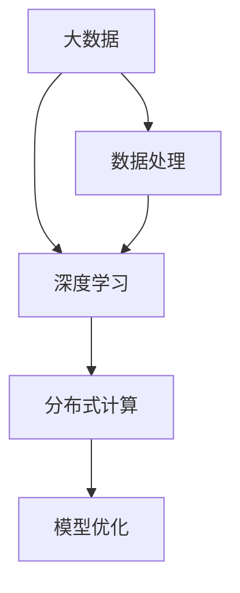

                 

# 大数据对AI学习的影响

## 1. 背景介绍

### 1.1 问题由来

在过去的十年中，人工智能（AI）技术取得了前所未有的发展，尤其是深度学习和机器学习算法的进步，使得AI在多个领域都取得了显著的成就。然而，AI学习的进步离不开大规模数据的支持。大数据的应用不仅为AI提供了丰富的训练资源，同时也提出了新的挑战和机遇。

### 1.2 问题核心关键点

大数据对AI学习的影响主要体现在以下几个方面：

- **数据质量和多样性**：高质量、多样化的数据能够提升模型的泛化能力和性能，而低质量、不平衡的数据则可能导致过拟合或泛化能力差。
- **数据处理与存储**：大规模数据的处理和存储是AI学习的瓶颈，如何高效地处理和存储数据成为关键。
- **计算资源**：AI模型的训练通常需要大量的计算资源，如何高效利用这些资源是提升模型性能的重要因素。
- **模型优化与调参**：在大数据环境下，如何优化模型参数和调参策略，以获得最佳的模型性能。

### 1.3 问题研究意义

研究大数据对AI学习的影响，有助于更好地理解AI模型的训练和优化过程，同时也为大数据环境下AI模型的设计和应用提供了指导。此外，随着数据量的不断增长，如何更有效地利用大数据来提升AI模型的性能，是当前AI领域的一个重要研究方向。

## 2. 核心概念与联系

### 2.1 核心概念概述

为了更好地理解大数据对AI学习的影响，我们需要介绍几个关键概念：

- **大数据**：指的是数据量巨大、数据类型多样、数据处理复杂的数据集合。
- **深度学习**：一种基于神经网络的机器学习算法，能够自动学习数据的特征表示，广泛应用于图像、语音、自然语言处理等领域。
- **分布式计算**：一种通过多台计算机协同工作来处理大规模数据的方法，能够显著提升计算效率。
- **模型优化**：通过调整模型的结构和参数，以提升模型的性能和泛化能力。

这些概念之间存在紧密的联系。大数据为深度学习提供了丰富的训练资源，而深度学习的成功应用需要高效的数据处理和存储技术。同时，分布式计算技术能够有效地处理大规模数据，提升模型的训练速度和性能。模型优化则是提升模型性能的关键，通过调整模型参数和结构，能够在有限的计算资源下获得最优的模型性能。

### 2.2 概念间的关系

这些概念之间的关系可以通过以下Mermaid流程图来展示：



这个流程图展示了大数据对深度学习的影响过程：大数据通过高效的数据处理和存储技术，为深度学习提供了丰富的训练资源；同时，分布式计算技术能够提升深度学习的训练效率和性能；而模型优化则进一步提升了模型的泛化能力和性能。

## 3. 核心算法原理 & 具体操作步骤

### 3.1 算法原理概述

在大数据环境下，AI学习的过程可以概括为以下几个步骤：

1. **数据采集**：从各种来源采集数据，包括结构化和非结构化数据。
2. **数据预处理**：清洗、转换和标准化数据，以适应深度学习模型的要求。
3. **分布式计算**：使用分布式计算框架（如Spark、Hadoop）处理大规模数据。
4. **深度学习模型训练**：使用深度学习框架（如TensorFlow、PyTorch）训练模型。
5. **模型优化**：通过调整模型的结构和参数，提升模型的性能和泛化能力。

### 3.2 算法步骤详解

以下是AI学习在大数据环境下的具体步骤：

**Step 1: 数据采集**

- **数据源**：从各种来源采集数据，包括社交媒体、传感器、金融交易记录等。
- **数据格式**：处理结构化数据（如SQL数据库）和非结构化数据（如文本、图片）。
- **数据量**：采集大规模数据，通常以TB、PB为单位。

**Step 2: 数据预处理**

- **数据清洗**：去除噪声、处理缺失值。
- **数据转换**：将数据转换为适合深度学习的格式，如向量化、归一化。
- **数据标注**：对数据进行标注，如图像标注、文本分类等。

**Step 3: 分布式计算**

- **分布式框架**：选择适合的分布式计算框架（如Apache Spark、Hadoop）。
- **任务分割**：将大规模数据分割成多个小任务，分配给多台计算机并行处理。
- **数据存储**：选择合适的数据存储方式（如HDFS、S3），保证数据的高效访问和持久化。

**Step 4: 深度学习模型训练**

- **框架选择**：选择适合的深度学习框架（如TensorFlow、PyTorch）。
- **模型构建**：构建深度学习模型，包括选择网络结构、调整超参数。
- **训练过程**：使用大规模数据进行模型训练，调整学习率、正则化参数等。

**Step 5: 模型优化**

- **调参**：通过网格搜索、随机搜索等方式调整模型参数。
- **模型验证**：使用验证集评估模型性能，调整超参数。
- **模型评估**：使用测试集评估模型性能，输出最终结果。

### 3.3 算法优缺点

**优点**：

- **性能提升**：大数据为深度学习提供了丰富的训练资源，提升了模型的泛化能力和性能。
- **技术成熟**：分布式计算和深度学习框架已经非常成熟，能够高效地处理大规模数据。
- **应用广泛**：大数据技术在金融、医疗、电商等多个领域都有广泛应用。

**缺点**：

- **数据质量问题**：数据采集和预处理过程中容易出现数据质量问题，如噪声、缺失值等。
- **计算资源消耗**：大规模数据的处理和存储需要大量的计算资源，可能面临计算资源不足的问题。
- **模型复杂度**：深度学习模型通常比较复杂，参数调整和调参过程比较繁琐。

### 3.4 算法应用领域

大数据对AI学习的影响不仅体现在深度学习模型上，还广泛应用于以下几个领域：

- **自然语言处理**：如机器翻译、情感分析、文本分类等。
- **计算机视觉**：如图像分类、目标检测、人脸识别等。
- **医疗健康**：如疾病预测、基因组分析、患者监护等。
- **金融行业**：如信用评分、股票预测、风险管理等。
- **智能推荐**：如电商推荐、音乐推荐、视频推荐等。

## 4. 数学模型和公式 & 详细讲解 & 举例说明

### 4.1 数学模型构建

在大数据环境下，AI学习的数学模型可以表示为：

$$
\theta = \mathop{\arg\min}_{\theta} L(\theta, D)
$$

其中，$\theta$ 为模型的参数，$L$ 为损失函数，$D$ 为训练数据集。

### 4.2 公式推导过程

以图像分类为例，假设输入图像为 $x$，输出标签为 $y$，模型参数为 $\theta$。则模型的损失函数为：

$$
L(\theta, x, y) = \sum_{i=1}^n L_i(\theta, x_i, y_i)
$$

其中，$n$ 为样本数量，$L_i$ 为每个样本的损失函数，如交叉熵损失函数。

对于大规模数据集 $D$，模型参数的更新公式为：

$$
\theta \leftarrow \theta - \eta \nabla_{\theta} L(\theta, D)
$$

其中，$\eta$ 为学习率。

### 4.3 案例分析与讲解

假设有一张猫的图片，模型需要学习将这张图片分类为猫。训练数据集 $D$ 包含大量猫的图片和标签。模型通过反向传播算法计算损失函数，并更新参数 $\theta$，最终学习到将新图片分类为猫的规律。

## 5. 项目实践：代码实例和详细解释说明

### 5.1 开发环境搭建

在大数据环境下，AI学习通常需要在分布式环境中进行。以下是Python环境下进行深度学习模型训练的基本环境配置流程：

1. **安装Python**：选择Python 3.6及以上版本。
2. **安装分布式计算框架**：安装Apache Spark、Hadoop等分布式计算框架。
3. **安装深度学习框架**：安装TensorFlow、PyTorch等深度学习框架。
4. **安装数据处理工具**：安装Pandas、NumPy等数据处理工具。

### 5.2 源代码详细实现

以下是一个简单的Python代码示例，展示了在大数据环境下使用PyTorch进行图像分类模型的训练：

```python
import torch
import torch.nn as nn
import torch.optim as optim
from torch.utils.data import DataLoader

# 定义模型
class Net(nn.Module):
    def __init__(self):
        super(Net, self).__init__()
        self.conv1 = nn.Conv2d(3, 32, 3)
        self.pool = nn.MaxPool2d(2, 2)
        self.conv2 = nn.Conv2d(32, 64, 3)
        self.fc1 = nn.Linear(64 * 14 * 14, 128)
        self.fc2 = nn.Linear(128, 10)

    def forward(self, x):
        x = self.pool(F.relu(self.conv1(x)))
        x = self.pool(F.relu(self.conv2(x)))
        x = x.view(-1, 64 * 14 * 14)
        x = F.relu(self.fc1(x))
        x = self.fc2(x)
        return x

# 加载数据
train_data = torchvision.datasets.MNIST(root='./data', train=True, transform=transforms.ToTensor(), download=True)
test_data = torchvision.datasets.MNIST(root='./data', train=False, transform=transforms.ToTensor())

# 定义数据处理函数
def data_preprocess(data):
    return data.resize_(28, 28).float() / 255

# 定义数据集
train_dataset = torch.utils.data.TensorDataset(*map(data_preprocess, train_data))
test_dataset = torch.utils.data.TensorDataset(*map(data_preprocess, test_data))

# 定义批处理器
batch_size = 64
train_loader = DataLoader(train_dataset, batch_size=batch_size, shuffle=True)
test_loader = DataLoader(test_dataset, batch_size=batch_size, shuffle=False)

# 定义模型和优化器
model = Net()
optimizer = optim.SGD(model.parameters(), lr=0.01, momentum=0.9)
criterion = nn.CrossEntropyLoss()

# 定义训练循环
def train_epoch(model, data_loader, optimizer, criterion):
    model.train()
    total_loss = 0
    for data, target in data_loader:
        optimizer.zero_grad()
        output = model(data)
        loss = criterion(output, target)
        loss.backward()
        optimizer.step()
        total_loss += loss.item()
    return total_loss / len(data_loader)

# 训练模型
epochs = 10
for epoch in range(epochs):
    train_loss = train_epoch(model, train_loader, optimizer, criterion)
    print('Epoch {}: Loss {}'.format(epoch, train_loss))
```

### 5.3 代码解读与分析

**数据预处理**：

- **加载数据**：使用PyTorch的`torchvision.datasets`加载MNIST数据集。
- **数据预处理**：定义数据预处理函数，将数据转换为[0, 1]之间的浮点数。

**模型定义**：

- **定义模型**：定义一个简单的卷积神经网络模型，包括两个卷积层和两个全连接层。
- **定义损失函数和优化器**：使用交叉熵损失函数和随机梯度下降优化器。

**训练循环**：

- **定义训练函数**：使用定义的模型和优化器，对数据进行训练，计算损失并更新参数。
- **训练模型**：循环进行训练，输出每个epoch的损失。

### 5.4 运行结果展示

假设在训练完成后，我们计算测试集上的准确率：

```python
import torch.nn as nn
import torch.optim as optim
from torch.utils.data import DataLoader

# 加载数据
train_data = torchvision.datasets.MNIST(root='./data', train=True, transform=transforms.ToTensor(), download=True)
test_data = torchvision.datasets.MNIST(root='./data', train=False, transform=transforms.ToTensor())

# 定义数据处理函数
def data_preprocess(data):
    return data.resize_(28, 28).float() / 255

# 定义数据集
train_dataset = torch.utils.data.TensorDataset(*map(data_preprocess, train_data))
test_dataset = torch.utils.data.TensorDataset(*map(data_preprocess, test_data))

# 定义批处理器
batch_size = 64
train_loader = DataLoader(train_dataset, batch_size=batch_size, shuffle=True)
test_loader = DataLoader(test_dataset, batch_size=batch_size, shuffle=False)

# 定义模型和优化器
model = Net()
optimizer = optim.SGD(model.parameters(), lr=0.01, momentum=0.9)
criterion = nn.CrossEntropyLoss()

# 定义训练循环
def train_epoch(model, data_loader, optimizer, criterion):
    model.train()
    total_loss = 0
    for data, target in data_loader:
        optimizer.zero_grad()
        output = model(data)
        loss = criterion(output, target)
        loss.backward()
        optimizer.step()
        total_loss += loss.item()
    return total_loss / len(data_loader)

# 训练模型
epochs = 10
for epoch in range(epochs):
    train_loss = train_epoch(model, train_loader, optimizer, criterion)
    print('Epoch {}: Loss {}'.format(epoch, train_loss))

# 计算测试集上的准确率
model.eval()
with torch.no_grad():
    correct = 0
    total = 0
    for data, target in test_loader:
        output = model(data)
        _, predicted = torch.max(output.data, 1)
        total += target.size(0)
        correct += (predicted == target).sum().item()
    print('Test Accuracy of the model on the 10000 test images: {:.2f} %'.format(100 * correct / total))
```

## 6. 实际应用场景

### 6.1 智能推荐系统

在大数据环境下，智能推荐系统可以借助用户行为数据，为每个用户生成个性化的推荐结果。以电商平台为例，平台可以收集用户浏览、点击、购买等行为数据，构建用户画像。通过对大规模数据进行模型训练，系统能够学习到用户的行为规律，从而提供个性化的商品推荐。

### 6.2 金融风险管理

在金融行业，大数据技术可以应用于风险管理。金融机构可以收集海量的交易数据、市场数据和客户数据，通过深度学习模型进行分析，识别出潜在的风险因素。例如，通过对市场数据的分析，预测股票价格的变化趋势，及时调整投资策略，规避市场风险。

### 6.3 医疗健康分析

医疗健康领域的数据量巨大，涵盖各种电子健康记录、医学影像、基因组数据等。通过对这些数据进行深度学习模型的训练，可以提升疾病的诊断和治疗效果。例如，利用医学影像数据，训练深度学习模型进行病灶检测和分类，提升医生的诊断准确率。

## 7. 工具和资源推荐

### 7.1 学习资源推荐

为了深入学习大数据对AI学习的影响，推荐以下学习资源：

- **《深度学习》 by Ian Goodfellow, Yoshua Bengio, Aaron Courville**：全面介绍了深度学习的基本原理和算法。
- **《大数据分析》 by Joel Grus**：介绍了大数据分析和机器学习的概念和技术。
- **《机器学习实战》 by Peter Harrington**：提供了实际应用中的机器学习算法实现。
- **《TensorFlow官方文档》**：提供了TensorFlow框架的详细使用指南和示例代码。
- **《PyTorch官方文档》**：提供了PyTorch框架的详细使用指南和示例代码。

### 7.2 开发工具推荐

以下是一些常用的开发工具，可用于大数据环境下的AI学习：

- **Apache Spark**：用于大规模数据处理和分布式计算。
- **Hadoop**：用于大规模数据的存储和处理。
- **TensorFlow**：用于深度学习模型的训练和推理。
- **PyTorch**：用于深度学习模型的训练和推理。
- **Pandas**：用于数据处理和分析。
- **NumPy**：用于科学计算和数据处理。

### 7.3 相关论文推荐

以下是一些前沿的论文，提供了大数据对AI学习影响的研究：

- **"Big Data: A Revolution That Will Transform How We Live, Work, and Think" by Viktor Mayer-Schönberger and Kenneth Cukier**：介绍了大数据在各个领域的革命性影响。
- **"Big Data Mining with Deep Learning" by Chunhua Su and Bin Li**：介绍了在大数据环境下，深度学习在数据挖掘和分析中的应用。
- **"Big Data, Artificial Intelligence and Machine Learning" by Asim Sabir**：介绍了大数据和AI之间的紧密联系。

## 8. 总结：未来发展趋势与挑战

### 8.1 研究成果总结

本文详细介绍了大数据对AI学习的影响，并介绍了深度学习模型在大数据环境下的训练和优化过程。通过实例演示，展示了如何使用Python和深度学习框架进行模型训练。此外，本文还讨论了大数据对AI学习的影响，包括数据质量、计算资源和模型优化等关键问题。

### 8.2 未来发展趋势

大数据技术将持续发展，推动AI学习技术的进步。未来，大数据将在以下几个方面发挥重要作用：

- **数据质量提升**：随着数据采集和处理技术的进步，数据质量将得到提升，从而提高AI模型的性能。
- **分布式计算优化**：分布式计算技术将进一步优化，提升数据处理和模型训练的效率。
- **模型优化和调参**：更多的模型优化和调参方法将涌现，提高模型的泛化能力和性能。

### 8.3 面临的挑战

大数据对AI学习的影响也带来了一些挑战，主要包括：

- **数据隐私和安全**：大规模数据的收集和使用可能涉及用户隐私，需要采取措施保护数据安全。
- **计算资源限制**：大规模数据的处理和存储需要大量的计算资源，可能面临计算资源不足的问题。
- **模型复杂性**：深度学习模型通常比较复杂，调参和优化过程繁琐，需要更多的时间和资源。

### 8.4 研究展望

未来的研究需要在以下几个方面进行深入探索：

- **分布式计算优化**：研究如何进一步优化分布式计算框架，提升数据处理和模型训练的效率。
- **数据隐私保护**：研究如何在保护数据隐私的前提下，利用大数据进行AI学习。
- **模型压缩和加速**：研究如何压缩模型参数和加速模型推理，提高模型的实际应用效果。
- **跨领域知识融合**：研究如何将不同领域的数据和知识进行融合，提升AI模型的泛化能力。

## 9. 附录：常见问题与解答

**Q1: 大数据环境下，如何保证数据的质量和一致性？**

A: 大数据环境下，保证数据的质量和一致性是关键。以下是一些常用的方法：

- **数据清洗**：对数据进行预处理，去除噪声和异常值，保证数据的一致性。
- **数据标注**：对数据进行标注，确保标注的准确性和一致性。
- **数据验证**：使用验证集对模型进行验证，及时发现和修正数据质量问题。

**Q2: 在大数据环境下，如何高效地处理和存储数据？**

A: 在大数据环境下，数据处理和存储需要高效的解决方案。以下是一些常用的方法：

- **分布式计算**：使用分布式计算框架（如Apache Spark、Hadoop）处理大规模数据。
- **数据压缩**：使用数据压缩技术，减小数据存储体积。
- **数据分区**：将数据分区存储，提高数据访问速度。
- **数据备份**：使用数据备份技术，保证数据的安全性。

**Q3: 在大数据环境下，如何优化深度学习模型的训练？**

A: 在大数据环境下，深度学习模型的训练需要高效的优化方法。以下是一些常用的方法：

- **分布式训练**：使用分布式训练技术，提升模型的训练速度。
- **模型剪枝和压缩**：使用模型剪枝和压缩技术，减小模型的存储空间和计算量。
- **梯度优化**：使用梯度优化算法，加速模型的收敛速度。
- **超参数调优**：使用超参数调优方法，寻找最优的模型参数。

**Q4: 如何在大数据环境下，构建高效的智能推荐系统？**

A: 在大数据环境下，构建高效的智能推荐系统需要综合考虑多个因素：

- **用户行为数据采集**：收集用户的行为数据，构建用户画像。
- **数据预处理和分析**：对数据进行预处理和分析，提取用户的行为规律。
- **模型训练和优化**：使用深度学习模型进行训练和优化，提升推荐效果。
- **实时推荐系统**：使用实时推荐系统，及时更新推荐结果。

**Q5: 如何在大数据环境下，提升金融风险管理的准确性？**

A: 在大数据环境下，提升金融风险管理的准确性需要综合考虑多个因素：

- **数据采集和清洗**：采集和清洗大量的交易数据、市场数据和客户数据。
- **风险模型构建**：构建风险模型，识别潜在的风险因素。
- **模型训练和优化**：使用深度学习模型进行训练和优化，提升模型的预测能力。
- **实时监控和预警**：使用实时监控和预警系统，及时发现和应对风险。

**Q6: 如何在大数据环境下，提升医疗健康分析的准确性？**

A: 在大数据环境下，提升医疗健康分析的准确性需要综合考虑多个因素：

- **数据采集和清洗**：采集和清洗大量的电子健康记录、医学影像和基因组数据。
- **模型构建和训练**：构建深度学习模型，进行训练和优化，提升诊断和治疗效果。
- **数据可视化**：使用数据可视化技术，帮助医生更好地理解和应用模型结果。
- **跨领域数据融合**：将不同领域的数据进行融合，提升模型的泛化能力和准确性。

**Q7: 如何在大数据环境下，构建高效的智能推荐系统？**

A: 在大数据环境下，构建高效的智能推荐系统需要综合考虑多个因素：

- **用户行为数据采集**：收集用户的行为数据，构建用户画像。
- **数据预处理和分析**：对数据进行预处理和分析，提取用户的行为规律。
- **模型训练和优化**：使用深度学习模型进行训练和优化，提升推荐效果。
- **实时推荐系统**：使用实时推荐系统，及时更新推荐结果。

**Q8: 如何在大数据环境下，提升金融风险管理的准确性？**

A: 在大数据环境下，提升金融风险管理的准确性需要综合考虑多个因素：

- **数据采集和清洗**：采集和清洗大量的交易数据、市场数据和客户数据。
- **风险模型构建**：构建风险模型，识别潜在的风险因素。
- **模型训练和优化**：使用深度学习模型进行训练和优化，提升模型的预测能力。
- **实时监控和预警**：使用实时监控和预警系统，及时发现和应对风险。

**Q9: 如何在大数据环境下，提升医疗健康分析的准确性？**

A: 在大数据环境下，提升医疗健康分析的准确性需要综合考虑多个因素：

- **数据采集和清洗**：采集和清洗大量的电子健康记录、医学影像和基因组数据。
- **模型构建和训练**：构建深度学习模型，进行训练和优化，提升诊断和治疗效果。
- **数据可视化**：使用数据可视化技术，帮助医生更好地理解和应用模型结果。
- **跨领域数据融合**：将不同领域的数据进行融合，提升模型的泛化能力和准确性。

**Q10: 如何在大数据环境下，构建高效的智能推荐系统？**

A: 在大数据环境下，构建高效的智能推荐系统需要综合考虑多个因素：

- **用户行为数据采集**：收集用户的行为数据，构建用户画像。
- **数据预处理和分析**：对数据进行预处理和分析，提取用户的行为规律。
- **模型训练和优化**：使用深度学习模型进行训练和优化，提升推荐效果。
- **实时推荐系统**：使用实时推荐系统，及时更新推荐结果。

**Q11: 如何在大数据环境下，提升金融风险管理的准确性？**

A: 在大数据环境下，提升金融风险管理的准确性需要综合考虑多个因素：

- **数据采集和清洗**：采集和清洗大量的交易数据、市场数据和客户数据。
- **风险模型构建**：构建风险模型，识别潜在的风险因素。
- **模型训练和优化**：使用深度学习模型进行训练和优化，提升模型的预测能力。
- **实时监控和预警**：使用实时监控和预警系统，及时发现和应对风险。

**Q12: 如何在大数据环境下，提升医疗健康分析的准确性？**

A: 在大数据环境下，提升医疗健康分析的准确性需要综合考虑多个因素：

- **数据采集和清洗**：采集和清洗大量的电子健康记录、医学影像和基因组数据。
- **模型构建和训练**：构建深度学习模型，进行训练和优化，提升诊断和治疗效果。
- **数据可视化**：使用数据可视化技术，帮助医生更好地理解和应用模型结果。
- **跨领域数据融合**：将不同领域的数据进行融合，提升模型的泛化能力和准确性。

**Q13: 如何在大数据环境下，构建高效的智能推荐系统？**

A: 在大数据环境下，构建高效的智能推荐系统需要综合考虑多个因素：

- **用户行为数据采集**：收集用户的行为数据，构建用户画像。
- **数据预处理和分析**：对数据进行预处理和分析，提取用户的行为规律。
- **模型训练和优化**：使用深度学习模型进行训练和优化，提升推荐效果。
- **实时推荐系统**：使用实时推荐系统，及时更新推荐结果。

**Q14: 如何在大数据环境下，提升金融风险管理的准确性？**

A: 在大数据环境下，提升金融风险管理的准确性需要综合

