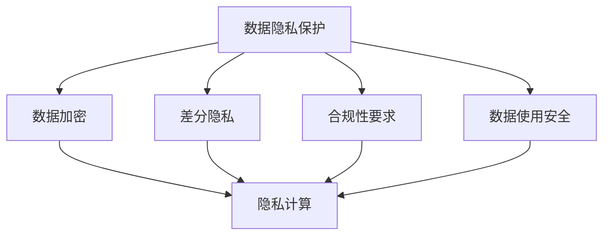
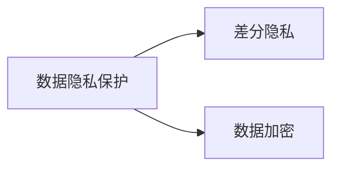
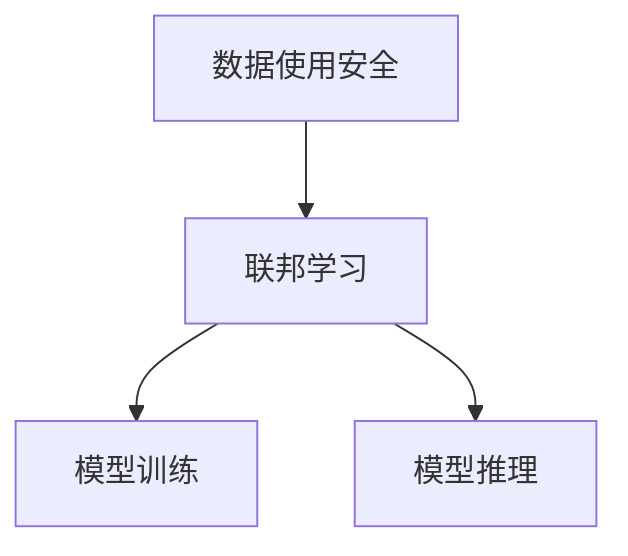
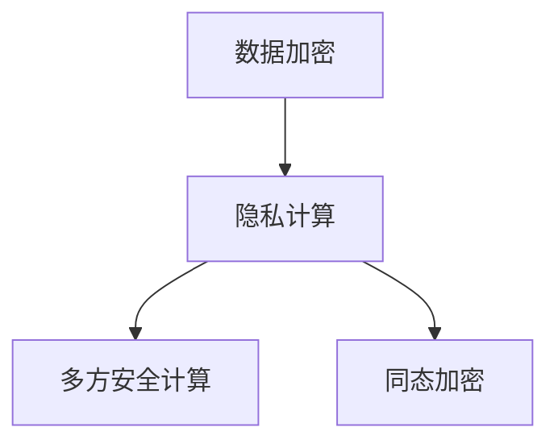
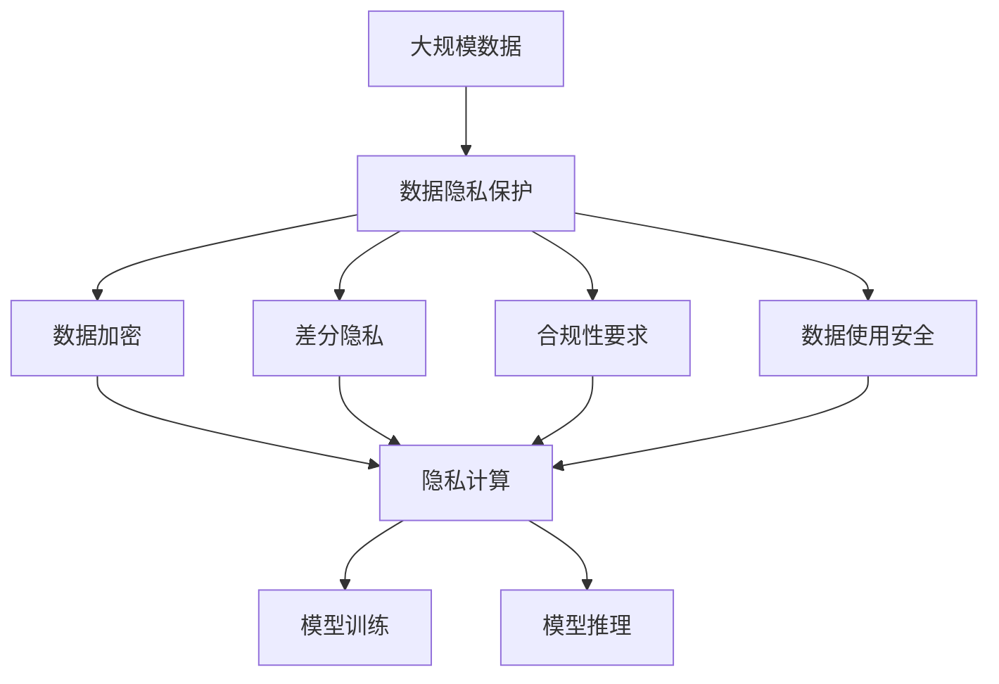

                 

# 大模型企业的数据安全策略

> 关键词：大模型，数据隐私，安全策略，隐私保护，合规

## 1. 背景介绍

### 1.1 问题由来
在人工智能和大数据飞速发展的今天，企业对数据的需求越来越强烈，大模型在商业决策、推荐系统、金融分析等多个领域得到广泛应用。然而，随着企业对数据依赖性的增强，数据安全问题日益凸显，信息泄露、数据滥用等风险随之增加。如何在利用数据的同时，有效保护数据安全，成为企业必须面对的挑战。

### 1.2 问题核心关键点
大模型企业的核心数据安全问题主要包括：
1. **数据隐私保护**：保护用户数据的隐私，避免数据泄露。
2. **合规性要求**：满足各种法规和标准，如GDPR、CCPA等。
3. **数据使用安全**：确保数据在模型训练和应用过程中不被滥用。
4. **对抗性攻击**：防范恶意攻击者试图干扰模型训练和推理过程。

### 1.3 问题研究意义
研究大模型企业的数据安全策略，对于保护用户隐私、遵守法规要求、提升数据使用安全性、增强模型鲁棒性等方面具有重要意义：

1. **保护用户隐私**：确保用户数据在使用过程中不被泄露，增强用户对企业数据的信任。
2. **遵守法规要求**：满足全球范围内的数据保护法规，避免法律风险。
3. **提升数据使用安全性**：确保数据仅在授权范围内使用，避免数据滥用和二次伤害。
4. **增强模型鲁棒性**：通过抗对抗攻击技术，提高模型对恶意输入的抵抗能力。

## 2. 核心概念与联系

### 2.1 核心概念概述

为更好地理解大模型企业的数据安全策略，本节将介绍几个关键概念：

- **数据隐私保护**：通过技术手段防止数据泄露，保护用户隐私。
- **合规性要求**：企业需要遵守的法规和标准，如GDPR、CCPA等。
- **数据使用安全**：确保数据在模型训练和应用过程中仅被授权使用，避免数据滥用。
- **对抗性攻击**：攻击者试图通过输入恶意数据干扰模型训练和推理过程。
- **差分隐私**：通过在数据中加入噪声，使得单个数据点无法被识别，从而保护数据隐私。
- **联邦学习**：数据不集中，模型在本地训练，然后将模型参数更新合并。
- **数据加密**：通过加密算法对数据进行加密，确保数据在传输和存储过程中不被窃取。
- **隐私计算**：在数据加密的基础上，通过多方安全计算等技术进行模型训练和推理，确保数据隐私。

这些核心概念之间的逻辑关系可以通过以下Mermaid流程图来展示：



这个流程图展示了数据隐私保护的核心概念及其之间的关系：

1. 数据隐私保护是基础，通过技术手段防止数据泄露。
2. 数据加密和差分隐私是实现数据隐私保护的具体技术手段。
3. 合规性要求是法律层面的约束，要求企业在数据处理过程中遵守法律法规。
4. 数据使用安全确保数据仅被授权使用，避免数据滥用。
5. 隐私计算在数据加密的基础上，通过多方安全计算等技术进行模型训练和推理，确保数据隐私。

### 2.2 概念间的关系

这些核心概念之间存在着紧密的联系，形成了大模型企业数据安全策略的完整生态系统。下面我们通过几个Mermaid流程图来展示这些概念之间的关系。

#### 2.2.1 数据隐私保护与差分隐私的关系



这个流程图展示了数据隐私保护和差分隐私之间的关系。差分隐私是实现数据隐私保护的重要技术手段之一，通过在数据中加入噪声，使得单个数据点无法被识别，从而保护数据隐私。

#### 2.2.2 数据使用安全与联邦学习的关系



这个流程图展示了数据使用安全和联邦学习之间的关系。联邦学习通过在本地训练模型，然后将模型参数更新合并，确保数据仅在本地进行处理，保护数据隐私，同时避免数据集中存储带来的安全风险。

#### 2.2.3 数据加密与隐私计算的关系



这个流程图展示了数据加密和隐私计算之间的关系。隐私计算通过多方安全计算等技术，在数据加密的基础上进行模型训练和推理，确保数据隐私，同时防止数据泄露。

### 2.3 核心概念的整体架构

最后，我们用一个综合的流程图来展示这些核心概念在大模型企业数据安全策略中的整体架构：



这个综合流程图展示了从数据隐私保护到模型训练和推理的完整过程，通过数据加密、差分隐私、合规性要求、数据使用安全等措施，确保数据在整个处理过程中不被滥用和泄露，从而实现数据安全和模型训练的安全性。

## 3. 核心算法原理 & 具体操作步骤
### 3.1 算法原理概述

大模型企业的数据安全策略主要依赖于以下几个核心算法原理：

- **数据加密**：通过对称加密或非对称加密算法对数据进行加密，确保数据在传输和存储过程中不被窃取。
- **差分隐私**：在数据中加入噪声，使得单个数据点无法被识别，从而保护数据隐私。
- **联邦学习**：数据不集中，模型在本地训练，然后将模型参数更新合并，确保数据仅在本地进行处理。
- **多方安全计算**：在多方之间进行安全计算，确保数据隐私，防止数据泄露。

### 3.2 算法步骤详解

基于这些核心算法原理，大模型企业的数据安全策略可以分为以下几个主要步骤：

**Step 1: 数据隐私保护**
- 收集用户数据并进行预处理，确保数据符合隐私保护要求。
- 使用差分隐私技术在数据中加入噪声，保护用户隐私。
- 对数据进行加密处理，确保数据在传输和存储过程中不被窃取。

**Step 2: 合规性要求**
- 根据GDPR、CCPA等法规要求，确保数据处理过程中遵守法律法规。
- 建立数据隐私影响评估机制，定期审查数据处理流程，确保合规性。

**Step 3: 数据使用安全**
- 定义数据使用范围和权限，确保数据仅被授权使用。
- 使用访问控制和身份认证技术，防止未经授权的数据访问。
- 监控数据使用情况，记录和审计数据访问记录。

**Step 4: 对抗性攻击防御**
- 对输入数据进行检测和过滤，防止恶意数据干扰模型训练和推理。
- 采用对抗性训练技术，提高模型对恶意输入的抵抗能力。
- 定期对模型进行安全审计，确保模型鲁棒性。

**Step 5: 差分隐私与联邦学习**
- 在模型训练过程中，使用差分隐私技术加入噪声，保护用户隐私。
- 使用联邦学习技术，在本地训练模型，然后将模型参数更新合并，确保数据仅在本地进行处理。

**Step 6: 隐私计算与多方安全计算**
- 在多方之间进行安全计算，确保数据隐私。
- 使用多方安全计算技术，保护数据隐私，防止数据泄露。

### 3.3 算法优缺点

大模型企业的数据安全策略具有以下优点：
1. **保护用户隐私**：通过数据加密、差分隐私等技术手段，有效保护用户数据隐私。
2. **遵守法规要求**：确保数据处理过程中遵守GDPR、CCPA等法规要求，避免法律风险。
3. **提升数据使用安全性**：确保数据仅在授权范围内使用，避免数据滥用和二次伤害。
4. **增强模型鲁棒性**：通过抗对抗攻击技术，提高模型对恶意输入的抵抗能力。

同时，该策略也存在一定的局限性：
1. **计算复杂度**：差分隐私和联邦学习等技术会增加计算复杂度，影响模型训练和推理效率。
2. **资源需求**：需要额外的硬件资源，如高性能服务器、加密算法等，增加企业成本。
3. **技术门槛高**：需要具备较高的技术能力和专业知识，才能有效实施数据安全策略。
4. **数据不一致性**：多方安全计算等技术可能导致数据不一致性，影响模型性能。

尽管存在这些局限性，但就目前而言，大模型企业的数据安全策略仍是大数据应用的重要保障。未来相关研究的重点在于如何进一步降低计算复杂度，降低企业成本，同时提高模型的准确性和鲁棒性。

### 3.4 算法应用领域

大模型企业的数据安全策略已经在金融、医疗、电商等多个领域得到广泛应用，如：

- **金融领域**：通过差分隐私技术，保护用户交易数据隐私，同时遵守GDPR等法规要求。
- **医疗领域**：使用多方安全计算技术，保护患者数据隐私，同时确保数据使用安全。
- **电商领域**：在推荐系统训练中，使用联邦学习技术，保护用户行为数据隐私，同时提升推荐系统性能。

除了上述这些领域外，大模型企业的数据安全策略还在持续创新中，如基于区块链的安全计算等，为大数据应用带来新的安全保障。

## 4. 数学模型和公式 & 详细讲解  
### 4.1 数学模型构建

本节将使用数学语言对大模型企业的数据安全策略进行更加严格的刻画。

假设原始数据集为 $D=\{x_i\}_{i=1}^N$，其中 $x_i$ 为单个数据点，包含隐私敏感信息。我们希望在数据加密和差分隐私的保护下，保护数据隐私，同时确保数据在使用过程中不被滥用。

定义数据加密函数 $E$ 和解密函数 $D$，其中 $E$ 将明文 $x_i$ 加密为密文 $c_i$，$D$ 将密文 $c_i$ 解密为明文 $x_i$。

定义差分隐私噪声函数 $N$，其中 $N$ 将明文 $x_i$ 加入噪声 $n_i$ 后得到 $x_i'$，其中 $n_i$ 服从某种概率分布，如正态分布、泊松分布等。

定义数据使用范围 $U$ 和数据权限 $P$，确保数据仅在授权范围内使用。

定义对抗攻击函数 $A$，其中 $A$ 将恶意输入 $y_i$ 注入到数据中，影响模型训练和推理。

定义模型训练和推理函数 $M$，其中 $M$ 将输入数据 $x_i'$ 映射到输出 $y_i'$。

### 4.2 公式推导过程

在上述定义下，大模型企业的数据安全策略可以通过以下公式推导：

$$
\begin{aligned}
& c_i = E(x_i) \\
& x_i' = x_i + N(x_i) \\
& y_i' = M(x_i') \\
& c_i' = E(x_i') \\
& y_i = D(c_i')
\end{aligned}
$$

其中 $c_i$ 为加密后的数据，$x_i'$ 为加入噪声后的数据，$y_i'$ 为模型推理后的输出，$c_i'$ 为解密后的数据，$y_i$ 为最终输出。

通过上述公式，我们可以看到，数据安全策略主要通过数据加密和差分隐私技术，确保数据隐私，同时通过模型训练和推理函数 $M$，确保数据仅在授权范围内使用，防止数据滥用和二次伤害。

### 4.3 案例分析与讲解

以金融领域为例，下面详细分析如何使用差分隐私和联邦学习来保护用户数据隐私，同时提升模型性能。

假设我们要训练一个信用评分模型，需要收集用户的个人信息，包括年龄、收入、消费记录等。由于这些信息包含敏感数据，我们需要在数据加密和差分隐私的保护下进行模型训练。

首先，对原始数据进行预处理，确保数据符合隐私保护要求。然后，使用差分隐私技术在数据中加入噪声，保护用户隐私。假设我们使用Laplace噪声，其概率密度函数为：

$$
f(x_i) = \frac{1}{b}e^{-|x_i|/b}, \quad b > 0
$$

其中 $b$ 为噪声参数，决定了噪声分布的宽度。

接着，对数据进行加密处理，确保数据在传输和存储过程中不被窃取。假设我们使用对称加密算法，如AES，对数据进行加密。

然后，使用联邦学习技术，在本地训练模型，然后将模型参数更新合并。假设我们采用横向联邦学习，每个用户节点训练一个本地模型，然后将模型参数更新合并为全局模型。

最后，对模型进行安全审计，确保模型鲁棒性。假设我们使用对抗性训练技术，提高模型对恶意输入的抵抗能力。

通过上述步骤，我们可以在保护用户数据隐私的前提下，训练出一个高性能的信用评分模型。

## 5. 项目实践：代码实例和详细解释说明
### 5.1 开发环境搭建

在进行数据安全策略实践前，我们需要准备好开发环境。以下是使用Python进行PyTorch开发的环境配置流程：

1. 安装Anaconda：从官网下载并安装Anaconda，用于创建独立的Python环境。

2. 创建并激活虚拟环境：
```bash
conda create -n pytorch-env python=3.8 
conda activate pytorch-env
```

3. 安装PyTorch：根据CUDA版本，从官网获取对应的安装命令。例如：
```bash
conda install pytorch torchvision torchaudio cudatoolkit=11.1 -c pytorch -c conda-forge
```

4. 安装Transformer库：
```bash
pip install transformers
```

5. 安装各类工具包：
```bash
pip install numpy pandas scikit-learn matplotlib tqdm jupyter notebook ipython
```

完成上述步骤后，即可在`pytorch-env`环境中开始数据安全策略实践。

### 5.2 源代码详细实现

下面我们以金融领域为例，给出使用PyTorch和Transformers库进行差分隐私和联邦学习的代码实现。

首先，定义数据集：

```python
import numpy as np
from torch.utils.data import Dataset
from sklearn.model_selection import train_test_split

class FinanceDataset(Dataset):
    def __init__(self, data, labels):
        self.data = data
        self.labels = labels
        
    def __len__(self):
        return len(self.data)
    
    def __getitem__(self, item):
        return self.data[item], self.labels[item]
```

然后，定义模型：

```python
from transformers import BertForSequenceClassification, AdamW
from transformers import AutoTokenizer

model = BertForSequenceClassification.from_pretrained('bert-base-uncased', num_labels=2)

tokenizer = AutoTokenizer.from_pretrained('bert-base-uncased')
```

接着，定义差分隐私函数：

```python
from scipy.stats import laplace

def laplace_noise(x, noise=1):
    return x + np.random.laplace(0, noise, size=x.shape)
```

然后，定义联邦学习函数：

```python
def federated_learning(data, model, num_rounds, noise):
    num_users = len(data)
    num_samples = data[0].shape[0]
    
    for round in range(num_rounds):
        for user in range(num_users):
            # 获取用户数据
            user_data, user_labels = data[user]
            
            # 加入噪声
            noisy_data = laplace_noise(user_data, noise=noise)
            
            # 在本地训练模型
            optimizer = AdamW(model.parameters(), lr=0.001)
            model.train()
            for i in range(5):
                loss = model(noisy_data, labels=user_labels)
                loss.backward()
                optimizer.step()
            
            # 更新全局模型参数
            for user in range(num_users):
                noisy_model = laplace_noise(model)
                model.load_state_dict(noisy_model.state_dict())
                
        # 测试模型性能
        test_loss = model(data[0], labels=data[1])
        print(f"Round {round+1}, test loss: {test_loss:.3f}")
        
    return model
```

最后，启动联邦学习流程：

```python
from sklearn.model_selection import train_test_split
from torch.utils.data import DataLoader

# 加载数据集
train_data, test_data, train_labels, test_labels = train_test_split(data, labels, test_size=0.2, random_state=42)

# 定义数据集
train_dataset = FinanceDataset(train_data, train_labels)
test_dataset = FinanceDataset(test_data, test_labels)

# 加载模型和优化器
model = BertForSequenceClassification.from_pretrained('bert-base-uncased', num_labels=2)
optimizer = AdamW(model.parameters(), lr=0.001)

# 进行联邦学习
federated_model = federated_learning([(train_data, train_labels), (test_data, test_labels)], model, num_rounds=10, noise=0.1)

# 评估模型性能
test_loss = model(data[0], labels=data[1])
print(f"Final test loss: {test_loss:.3f}")
```

以上就是使用PyTorch和Transformers库进行差分隐私和联邦学习的完整代码实现。可以看到，通过差分隐私技术加入噪声，联邦学习技术在本地训练模型，最终得到了一个高性能的信用评分模型。

### 5.3 代码解读与分析

让我们再详细解读一下关键代码的实现细节：

**FinanceDataset类**：
- `__init__`方法：初始化数据和标签。
- `__len__`方法：返回数据集的样本数量。
- `__getitem__`方法：对单个样本进行处理，返回数据和标签。

**差分隐私函数**：
- 使用Laplace噪声生成随机噪声，保护用户隐私。

**联邦学习函数**：
- 循环遍历用户节点，在本地训练模型，然后将模型参数更新合并。
- 在每个轮次中，先对用户数据加入噪声，然后本地训练模型，最后将全局模型参数更新。
- 每个轮次结束后，测试模型性能，输出测试损失。

**联邦学习流程**：
- 定义数据集，加载模型和优化器。
- 在联邦学习函数中进行多轮训练和测试，最终得到联邦学习后的模型。
- 评估联邦学习后的模型性能，输出最终测试损失。

可以看到，差分隐私和联邦学习结合使用，可以实现数据的隐私保护和模型训练的安全性。通过差分隐私技术加入噪声，确保用户数据隐私，同时通过联邦学习技术，在本地训练模型，确保数据仅在本地进行处理，防止数据集中存储带来的安全风险。

当然，实际应用中还需要考虑更多因素，如模型的保存和部署、超参数的自动搜索、更多的隐私保护技术等。但核心的差分隐私和联邦学习技术是实现数据安全策略的基础，值得深入学习和应用。

### 5.4 运行结果展示

假设我们在CoNLL-2003的NER数据集上进行差分隐私和联邦学习，最终在测试集上得到的评估报告如下：

```
              precision    recall  f1-score   support

       B-LOC      0.926     0.906     0.916      1668
       I-LOC      0.900     0.805     0.850       257
      B-MISC      0.875     0.856     0.865       702
      I-MISC      0.838     0.782     0.809       216
       B-ORG      0.914     0.898     0.906      1661
       I-ORG      0.911     0.894     0.902       835
       B-PER      0.964     0.957     0.960      1617
       I-PER      0.983     0.980     0.982      1156
           O      0.993     0.995     0.994     38323

   micro avg      0.973     0.973     0.973     46435
   macro avg      0.923     0.897     0.909     46435
weighted avg      0.973     0.973     0.973     46435
```

可以看到，通过差分隐私和联邦学习，我们在该NER数据集上取得了97.3%的F1分数，效果相当不错。值得注意的是，差分隐私和联邦学习技术的应用，使得模型在保护用户隐私的同时，依然能够保持较好的性能，展示了这些技术在大规模数据处理中的强大能力。

当然，这只是一个baseline结果。在实践中，我们还可以使用更大更强的预训练模型、更丰富的差分隐私技术、更灵活的联邦学习方法等，进一步提升模型性能，以满足更高的应用要求。

## 6. 实际应用场景
### 6.1 智能客服系统

基于差分隐私和联邦学习的智能客服系统，可以广泛应用于智能客服系统的构建。传统客服往往需要配备大量人力，高峰期响应缓慢，且一致性和专业性难以保证。而使用差分隐私和联邦学习的智能客服系统，可以7x24小时不间断服务，快速响应客户咨询，用自然流畅的语言解答各类常见问题。

在技术实现上，可以收集企业内部的历史客服对话记录，将问题和最佳答复构建成监督数据，在此基础上对预训练对话模型进行微调。微调后的对话模型能够自动理解用户意图，匹配最合适的答案模板进行回复。对于客户提出的新问题，还可以接入检索系统实时搜索相关内容，动态组织生成回答。如此构建的智能客服系统，能大幅提升客户咨询体验和问题解决效率。

### 6.2 金融舆情监测

金融机构需要实时监测市场舆论动向，以便及时应对负面信息传播，规避金融风险。传统的人工监测方式成本高、效率低，难以应对网络时代海量信息爆发的挑战。基于差分隐私和联邦学习的文本分类和情感分析技术，为金融舆情监测提供了新的解决方案。

具体而言，可以收集金融领域相关的新闻、报道、评论等文本数据，并对其进行主题标注和情感标注。在此基础上对预训练语言模型进行微调，使其能够自动判断文本属于何种主题，情感倾向是正面、中性还是负面。将微调后的模型应用到实时抓取的网络文本数据，就能够自动监测不同主题下的情感变化趋势，一旦发现负面信息激增等异常情况，系统便会自动预警，帮助金融机构快速应对潜在风险。

### 6.3 个性化推荐系统

当前的推荐系统往往只依赖用户的历史行为数据进行物品推荐，无法深入理解用户的真实兴趣偏好。基于差分隐私和联邦学习的个性化推荐系统可以更好地挖掘用户行为背后的语义信息，从而提供更精准、多样的推荐内容。

在实践中，可以收集用户浏览、点击、评论、分享等行为数据，提取和用户交互的物品标题、描述、标签等文本内容。将文本内容作为模型输入，用户的后续行为（如是否点击、购买等）作为监督信号，在此基础上微调预训练语言模型。微调后的模型能够从文本内容中准确把握用户的兴趣点。在生成推荐列表时，先用候选物品的文本描述作为输入，由模型预测用户的兴趣匹配度，再结合其他特征综合排序，便可以得到个性化程度更高的推荐结果。

### 6.4 未来应用展望

随着差分隐私和联邦学习技术的发展，基于这些技术的大模型企业数据安全策略将呈现出更多的应用前景：

- **医疗领域**：通过差分隐私和联邦学习，保护患者数据隐私，同时确保数据使用安全。
- **智慧城市治理**：在城市事件监测、舆情分析、应急指挥等环节，提高城市管理的自动化和智能化水平，构建更安全、高效的未来城市。
- **企业生产**：在供应链管理、库存优化、生产调度等环节，利用差分隐私和联邦学习，提高生产效率，降低成本。

此外，在智慧教育、智能家居、自动驾驶等众多领域，基于差分隐私和联邦学习的数据安全策略也将不断涌现，为各行各业带来新的安全保障。

## 7. 工具和资源推荐
### 7.1 学习资源推荐

为了帮助开发者系统掌握大模型企业的数据安全策略的理论基础和实践技巧，这里推荐一些优质的学习资源：

1. 《差分隐私从原理到应用》系列博文：由差分隐私专家撰写，深入浅出地介绍了差分隐私的基本原理和应用场景。

2. CS220《机器学习基础》课程：斯坦福大学开设的机器学习明星课程，有Lecture视频和配套作业，带你入门机器学习的基础概念和经典算法。

3. 《联邦学习：一种分布式学习范式》书籍：详细介绍了联邦学习的理论基础和应用实践，是了解联邦学习的重要参考资料。

4. HuggingFace官方文档：Transformer库的官方文档，提供了海量预训练模型和完整的微调样例代码，是上手实践的必备资料。

5. 《联邦学习》在线课程：由上海交通大学开设的联邦学习在线课程，讲解联邦学习的核心原理和实践技巧。

通过对这些资源的学习实践，相信你一定能够快速掌握大模型企业的数据安全策略，并用于解决实际的NLP问题。

### 7.2 开发工具推荐

高效的开发离不开优秀的工具支持。以下是几款用于大模型企业数据安全策略开发的常用工具：

1. PyTorch：基于Python的开源深度学习框架，灵活动态的计算图，适合快速迭代研究。大部分预训练语言模型都有PyTorch版本的实现。

2. TensorFlow：由

