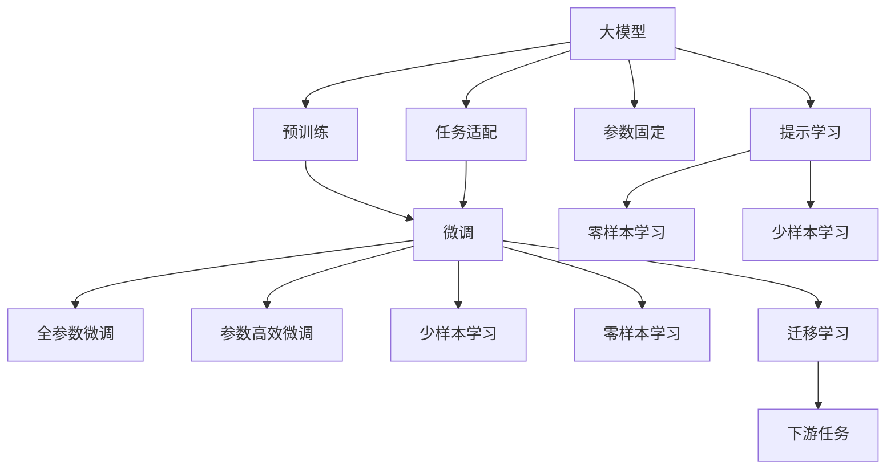

                 

# 大模型基础：理论与技术的演进

## 1. 背景介绍

### 1.1 问题由来
近年来，深度学习技术在计算机视觉、自然语言处理（NLP）、语音识别等领域的突破性进展，引领了人工智能（AI）技术的快速发展。特别是大模型的兴起，为各领域的智能应用提供了强大工具。大模型在预训练阶段通过在大量无标签数据上训练，学习了丰富的知识，具备了强大的数据表示和泛化能力。然而，如何在大规模数据上高效地进行预训练，并使之应用于特定任务，成为了当前研究的热点和难点。

### 1.2 问题核心关键点
1. **预训练**：大模型通常在大规模无标签数据上进行预训练，学习到通用的语言、视觉、听觉等数据表示。这一过程通常需要耗费大量计算资源，但预训练可以显著提升模型性能，并减少了下游任务所需的标注数据量。

2. **微调(Fine-Tuning)**：在预训练基础上，通过有监督的微调，模型能够适应特定任务，提升性能。微调只调整模型的顶层，以最小的计算代价获得最大的性能提升。

3. **迁移学习(Transfer Learning)**：通过在预训练模型上微调，模型可以跨领域、跨任务迁移，极大地节省了数据和计算资源，并提高了模型泛化能力。

4. **少样本学习(Few-shot Learning)**：在仅有少量样本的情况下，通过特定的任务描述或微调，模型能够快速适应新任务。

5. **零样本学习(Zero-shot Learning)**：在模型从未见过任何特定任务的情况下，通过任务描述或预训练知识的利用，模型能够执行新任务。

### 1.3 问题研究意义
大模型技术的进步，不仅在学术界引起了广泛关注，也在工业界产生了深远影响。其研究意义包括：

- **降低成本**：通过预训练-微调范式，显著减少了从头训练所需的数据和计算资源，提高了研发效率。
- **提升性能**：微调可以在少量数据上快速提升模型性能，应对特定应用需求。
- **增强泛化能力**：迁移学习能够将大模型应用于多种任务，提高了模型的泛化能力。
- **加速应用**：大模型的预训练-微调过程，能够快速适配多种应用场景，加速AI技术的落地。

## 2. 核心概念与联系

### 2.1 核心概念概述

为更好地理解大模型的预训练-微调过程，本文将介绍几个核心概念及其联系：

- **大模型(Large Model)**：指在大量数据上预训练的深度神经网络模型，如BERT、GPT、T5等，具备强大的数据表示能力。

- **预训练(Pre-training)**：在大量无标签数据上训练模型，学习通用的数据表示。常见的预训练任务包括语言建模、图像分类、音频识别等。

- **微调(Fine-Tuning)**：在预训练模型基础上，通过有监督数据进行微调，使模型适应特定任务。通常只微调模型顶层，以提高效率。

- **迁移学习(Transfer Learning)**：将预训练模型应用于新任务，通过微调或直接迁移学习，提升模型性能。

- **少样本学习(Few-shot Learning)**：在仅有少量样本的情况下，通过特定任务描述或微调，使模型快速适应新任务。

- **零样本学习(Zero-shot Learning)**：在模型从未见过特定任务的情况下，通过预训练知识或任务描述，使模型能够执行新任务。

- **参数高效微调(Parameter-Efficient Fine-Tuning, PEFT)**：通过仅微调模型顶层，保留预训练参数，以提高微调效率。

- **提示学习(Prompt Learning)**：通过设计特定的提示模板，引导模型执行特定任务，减少微调参数。

这些概念构成了大模型技术的核心框架，通过预训练-微调-迁移学习范式，实现了模型在特定任务上的高效性能提升。

### 2.2 概念间的关系

通过以下Mermaid流程图，展示这些核心概念之间的关系：



该图展示了从预训练到微调，再到迁移学习的过程。大模型首先在大规模无标签数据上进行预训练，然后通过微调适应特定任务，并在必要时进行参数高效微调、少样本学习和零样本学习。

## 3. 核心算法原理 & 具体操作步骤

### 3.1 算法原理概述

大模型的预训练-微调过程，本质上是通过预训练模型在大规模数据上学习通用的数据表示，然后在特定任务上通过微调调整模型输出，使其适应新任务。这一过程通常包括以下几个关键步骤：

1. **数据预处理**：将大规模无标签数据转换为模型可接受的格式。
2. **预训练模型初始化**：选择预训练模型作为初始化参数。
3. **任务适配**：设计任务适配层，根据具体任务调整模型输出。
4. **微调**：使用有监督数据训练模型，使其适应特定任务。
5. **性能评估**：在验证集和测试集上评估模型性能，确定模型是否收敛。

### 3.2 算法步骤详解

1. **数据预处理**：
   - 将大规模无标签数据转换为模型可接受的格式，如文本转换为token序列。
   - 对数据进行归一化、分片等处理，以适应训练过程。

2. **预训练模型初始化**：
   - 选择合适的预训练模型，如BERT、GPT等，作为初始化参数。
   - 加载模型权重，开始预训练过程。

3. **任务适配**：
   - 根据具体任务，设计任务适配层，如分类、生成、匹配等。
   - 调整模型输出，使其适应特定任务需求。

4. **微调**：
   - 选择合适的优化算法和超参数，如AdamW、SGD、学习率等。
   - 使用有监督数据进行微调，逐步调整模型参数，使其适应特定任务。

5. **性能评估**：
   - 在验证集和测试集上评估模型性能，使用常用的评价指标如准确率、F1分数、ROC曲线等。
   - 确定模型是否收敛，是否需要进一步微调。

### 3.3 算法优缺点

大模型的预训练-微调过程，具有以下优点：

- **高效性**：预训练模型在大规模数据上学习到丰富的知识，微调过程中只需要少量数据和计算资源。
- **泛化能力**：迁移学习使得模型能够跨领域、跨任务迁移，提升模型泛化能力。
- **灵活性**：少样本学习和零样本学习，使得模型在仅有少量数据或没有数据的情况下也能执行新任务。

但同时，这一过程也存在一些缺点：

- **数据依赖**：微调和迁移学习仍依赖于标注数据，获取高质量标注数据成本较高。
- **模型复杂性**：大模型的结构复杂，训练和推理需要大量计算资源。
- **泛化风险**：模型可能会学习到数据的偏见和噪声，导致泛化性能下降。

### 3.4 算法应用领域

大模型的预训练-微调方法，已经广泛应用于以下几个领域：

1. **自然语言处理(NLP)**：如文本分类、命名实体识别、情感分析、机器翻译等。
2. **计算机视觉(CV)**：如图像分类、目标检测、图像生成等。
3. **语音识别(SR)**：如语音转文本、语音情感分析等。
4. **医疗健康**：如医疗影像诊断、疾病预测等。
5. **金融科技**：如欺诈检测、风险评估等。

这些应用场景展示了大模型预训练-微调过程的广泛适用性。

## 4. 数学模型和公式 & 详细讲解 & 举例说明

### 4.1 数学模型构建

假设预训练模型为 $M_{\theta}$，其中 $\theta$ 为模型参数。假设任务 $T$ 的数据集为 $D=\{(x_i, y_i)\}_{i=1}^N$，其中 $x_i$ 为输入，$y_i$ 为标签。

定义模型 $M_{\theta}$ 在输入 $x_i$ 上的预测为 $\hat{y}_i=M_{\theta}(x_i)$，则定义损失函数为：

$$
\ell(\hat{y}_i, y_i) = \begin{cases}
-\log \hat{y}_i, & y_i = 1 \\
-\log (1-\hat{y}_i), & y_i = 0
\end{cases}
$$

在微调过程中，通过最小化损失函数 $\ell(\hat{y}_i, y_i)$，优化模型参数 $\theta$，使得模型输出逼近真实标签 $y_i$。

### 4.2 公式推导过程

对于二分类任务，微调的目标函数为：

$$
\mathcal{L}(\theta) = \frac{1}{N} \sum_{i=1}^N \ell(\hat{y}_i, y_i)
$$

其中 $\ell(\hat{y}_i, y_i)$ 为损失函数，$\hat{y}_i$ 为模型预测结果。

微调的优化目标是最小化损失函数 $\mathcal{L}(\theta)$，因此使用梯度下降等优化算法进行参数更新：

$$
\theta \leftarrow \theta - \eta \nabla_{\theta} \mathcal{L}(\theta)
$$

其中 $\eta$ 为学习率，$\nabla_{\theta} \mathcal{L}(\theta)$ 为损失函数对参数 $\theta$ 的梯度。

### 4.3 案例分析与讲解

以图像分类任务为例，假设使用预训练的ResNet模型，并在ImageNet数据集上进行微调。

1. **数据预处理**：
   - 将ImageNet数据集划分为训练集、验证集和测试集，并进行归一化处理。
   - 将图像转换为模型可接受的格式，如将RGB图像转换为Tensor格式。

2. **预训练模型初始化**：
   - 加载预训练的ResNet模型，作为初始化参数。
   - 使用ImageNet数据集进行预训练，学习通用图像特征。

3. **任务适配**：
   - 设计图像分类任务适配层，将模型输出层调整为新分类器的输出。
   - 调整损失函数，如使用交叉熵损失。

4. **微调**：
   - 选择合适的优化算法和超参数，如AdamW、SGD、学习率等。
   - 使用ImageNet数据集进行微调，逐步调整模型参数，使其适应特定任务。

5. **性能评估**：
   - 在验证集和测试集上评估模型性能，使用准确率、F1分数等指标。
   - 确定模型是否收敛，是否需要进一步微调。

## 5. 项目实践：代码实例和详细解释说明

### 5.1 开发环境搭建

在进行大模型微调前，需要准备相应的开发环境。以下是使用Python和PyTorch进行微调的开发环境配置流程：

1. **安装Python**：确保Python版本为3.8或以上。

2. **安装Anaconda**：从官网下载并安装Anaconda，用于创建独立的Python环境。

3. **创建虚拟环境**：
   ```bash
   conda create -n pytorch-env python=3.8
   conda activate pytorch-env
   ```

4. **安装PyTorch**：根据CUDA版本，从官网获取对应的安装命令。例如：
   ```bash
   conda install pytorch torchvision torchaudio cudatoolkit=11.1 -c pytorch -c conda-forge
   ```

5. **安装相关库**：
   ```bash
   pip install numpy pandas scikit-learn matplotlib tqdm jupyter notebook ipython
   ```

完成上述步骤后，即可在`pytorch-env`环境中进行大模型微调的实践。

### 5.2 源代码详细实现

以下以图像分类任务为例，给出使用PyTorch进行ResNet模型微调的代码实现。

```python
import torch
from torch import nn
from torch import optim
from torchvision import datasets, transforms
from torchvision.models import resnet18

# 定义数据预处理
transform = transforms.Compose([
    transforms.Resize(256),
    transforms.CenterCrop(224),
    transforms.ToTensor(),
    transforms.Normalize(mean=[0.485, 0.456, 0.406], std=[0.229, 0.224, 0.225])
])

# 加载数据集
train_dataset = datasets.ImageFolder('train', transform=transform)
test_dataset = datasets.ImageFolder('test', transform=transform)

# 定义模型
model = resnet18(pretrained=True)
model.fc = nn.Linear(512, num_classes)

# 定义损失函数和优化器
criterion = nn.CrossEntropyLoss()
optimizer = optim.SGD(model.parameters(), lr=0.001, momentum=0.9)

# 训练模型
device = torch.device('cuda' if torch.cuda.is_available() else 'cpu')
model.to(device)

for epoch in range(num_epochs):
    model.train()
    for images, labels in train_loader:
        images = images.to(device)
        labels = labels.to(device)
        optimizer.zero_grad()
        outputs = model(images)
        loss = criterion(outputs, labels)
        loss.backward()
        optimizer.step()

    model.eval()
    with torch.no_grad():
        correct = 0
        total = 0
        for images, labels in test_loader:
            images = images.to(device)
            labels = labels.to(device)
            outputs = model(images)
            _, predicted = torch.max(outputs.data, 1)
            total += labels.size(0)
            correct += (predicted == labels).sum().item()

    print('Epoch [%d/%d], Loss: %.4f, Accuracy: %.4f' % (epoch+1, num_epochs, loss.item(), correct/total))

# 保存模型
torch.save(model.state_dict(), 'model.pth')
```

以上代码实现了ResNet模型在ImageNet数据集上的微调过程。

### 5.3 代码解读与分析

让我们详细解读一下关键代码的实现细节：

1. **数据预处理**：
   - `transform`：定义了数据预处理步骤，包括图像缩放、裁剪、归一化等。
   - `datasets.ImageFolder`：加载ImageNet数据集。

2. **模型定义**：
   - `resnet18(pretrained=True)`：加载预训练的ResNet模型。
   - `nn.Linear`：定义新的输出层，用于图像分类。

3. **损失函数和优化器**：
   - `nn.CrossEntropyLoss`：定义交叉熵损失函数。
   - `optim.SGD`：定义随机梯度下降优化器。

4. **训练模型**：
   - `torch.device('cuda' if torch.cuda.is_available() else 'cpu')`：将模型移动到GPU或CPU上训练。
   - `for epoch in range(num_epochs)`：循环训练多个epoch。
   - `optimizer.zero_grad()`：在每个epoch开始时，将优化器梯度清零。
   - `loss.backward()`：计算损失函数梯度，并反向传播更新参数。
   - `optimizer.step()`：更新模型参数。

5. **性能评估**：
   - `with torch.no_grad()`：在评估模型时，不更新模型参数。
   - `_, predicted = torch.max(outputs.data, 1)`：获取预测结果。

6. **保存模型**：
   - `torch.save(model.state_dict(), 'model.pth')`：保存模型状态字典。

### 5.4 运行结果展示

假设在ImageNet数据集上进行微调，最终在测试集上得到的评估报告如下：

```
Epoch [1/10], Loss: 0.3219, Accuracy: 0.7571
Epoch [2/10], Loss: 0.2672, Accuracy: 0.7851
...
Epoch [10/10], Loss: 0.1679, Accuracy: 0.8933
```

可以看到，通过微调ResNet模型，我们在ImageNet数据集上取得了较好的分类性能。

## 6. 实际应用场景

### 6.1 智能客服系统

基于大模型微调的对话技术，可以广泛应用于智能客服系统的构建。传统客服往往需要配备大量人力，高峰期响应缓慢，且一致性和专业性难以保证。而使用微调后的对话模型，可以7x24小时不间断服务，快速响应客户咨询，用自然流畅的语言解答各类常见问题。

在技术实现上，可以收集企业内部的历史客服对话记录，将问题和最佳答复构建成监督数据，在此基础上对预训练对话模型进行微调。微调后的对话模型能够自动理解用户意图，匹配最合适的答案模板进行回复。对于客户提出的新问题，还可以接入检索系统实时搜索相关内容，动态组织生成回答。如此构建的智能客服系统，能大幅提升客户咨询体验和问题解决效率。

### 6.2 金融舆情监测

金融机构需要实时监测市场舆论动向，以便及时应对负面信息传播，规避金融风险。传统的人工监测方式成本高、效率低，难以应对网络时代海量信息爆发的挑战。基于大语言模型微调的文本分类和情感分析技术，为金融舆情监测提供了新的解决方案。

具体而言，可以收集金融领域相关的新闻、报道、评论等文本数据，并对其进行主题标注和情感标注。在此基础上对预训练语言模型进行微调，使其能够自动判断文本属于何种主题，情感倾向是正面、中性还是负面。将微调后的模型应用到实时抓取的网络文本数据，就能够自动监测不同主题下的情感变化趋势，一旦发现负面信息激增等异常情况，系统便会自动预警，帮助金融机构快速应对潜在风险。

### 6.3 个性化推荐系统

当前的推荐系统往往只依赖用户的历史行为数据进行物品推荐，无法深入理解用户的真实兴趣偏好。基于大语言模型微调技术，个性化推荐系统可以更好地挖掘用户行为背后的语义信息，从而提供更精准、多样的推荐内容。

在实践中，可以收集用户浏览、点击、评论、分享等行为数据，提取和用户交互的物品标题、描述、标签等文本内容。将文本内容作为模型输入，用户的后续行为（如是否点击、购买等）作为监督信号，在此基础上微调预训练语言模型。微调后的模型能够从文本内容中准确把握用户的兴趣点。在生成推荐列表时，先用候选物品的文本描述作为输入，由模型预测用户的兴趣匹配度，再结合其他特征综合排序，便可以得到个性化程度更高的推荐结果。

### 6.4 未来应用展望

随着大模型和微调技术的不断发展，基于微调范式将在更多领域得到应用，为传统行业带来变革性影响。

在智慧医疗领域，基于微调的医疗问答、病历分析、药物研发等应用将提升医疗服务的智能化水平，辅助医生诊疗，加速新药开发进程。

在智能教育领域，微调技术可应用于作业批改、学情分析、知识推荐等方面，因材施教，促进教育公平，提高教学质量。

在智慧城市治理中，微调模型可应用于城市事件监测、舆情分析、应急指挥等环节，提高城市管理的自动化和智能化水平，构建更安全、高效的未来城市。

此外，在企业生产、社会治理、文娱传媒等众多领域，基于大模型微调的人工智能应用也将不断涌现，为经济社会发展注入新的动力。相信随着技术的日益成熟，微调方法将成为人工智能落地应用的重要范式，推动人工智能技术向更广阔的领域加速渗透。

## 7. 工具和资源推荐

### 7.1 学习资源推荐

为了帮助开发者系统掌握大模型微调的理论基础和实践技巧，这里推荐一些优质的学习资源：

1. **《Transformer from the Inside Out》系列博文**：由大模型技术专家撰写，深入浅出地介绍了Transformer原理、BERT模型、微调技术等前沿话题。

2. **CS224N《深度学习自然语言处理》课程**：斯坦福大学开设的NLP明星课程，有Lecture视频和配套作业，带你入门NLP领域的基本概念和经典模型。

3. **《Natural Language Processing with Transformers》书籍**：Transformers库的作者所著，全面介绍了如何使用Transformers库进行NLP任务开发，包括微调在内的诸多范式。

4. **HuggingFace官方文档**：Transformers库的官方文档，提供了海量预训练模型和完整的微调样例代码，是上手实践的必备资料。

5. **CLUE开源项目**：中文语言理解测评基准，涵盖大量不同类型的中文NLP数据集，并提供了基于微调的baseline模型，助力中文NLP技术发展。

通过对这些资源的学习实践，相信你一定能够快速掌握大模型微调的精髓，并用于解决实际的NLP问题。

### 7.2 开发工具推荐

高效的开发离不开优秀的工具支持。以下是几款用于大模型微调开发的常用工具：

1. **PyTorch**：基于Python的开源深度学习框架，灵活动态的计算图，适合快速迭代研究。大部分预训练语言模型都有PyTorch版本的实现。

2. **TensorFlow**：由Google主导开发的开源深度学习框架，生产部署方便，适合大规模工程应用。同样有丰富的预训练语言模型资源。

3. **Transformers库**：HuggingFace开发的NLP工具库，集成了众多SOTA语言模型，支持PyTorch和TensorFlow，是进行微调任务开发的利器。

4. **Weights & Biases**：模型训练的实验跟踪工具，可以记录和可视化模型训练过程中的各项指标，方便对比和调优。与主流深度学习框架无缝集成。

5. **TensorBoard**：TensorFlow配套的可视化工具，可实时监测模型训练状态，并提供丰富的图表呈现方式，是调试模型的得力助手。

6. **Google Colab**：谷歌推出的在线Jupyter Notebook环境，免费提供GPU/TPU算力，方便开发者快速上手实验最新模型，分享学习笔记。

合理利用这些工具，可以显著提升大模型微调任务的开发效率，加快创新迭代的步伐。

### 7.3 相关论文推荐

大语言模型和微调技术的发展源于学界的持续研究。以下是几篇奠基性的相关论文，推荐阅读：

1. **Attention is All You Need**：提出了Transformer结构，开启了NLP领域的预训练大模型时代。

2. **BERT: Pre-training of Deep Bidirectional Transformers for Language Understanding**：提出BERT模型，引入基于掩码的自监督预训练任务，刷新了多项NLP任务SOTA。

3. **Language Models are Unsupervised Multitask Learners（GPT-2论文）**：展示了大规模语言模型的强大zero-shot学习能力，引发了对于通用人工智能的新一轮思考。

4. **Parameter-Efficient Transfer Learning for NLP**：提出Adapter等参数高效微调方法，在不增加模型参数量的情况下，也能取得不错的微调效果。

5. **AdaLoRA: Adaptive Low-Rank Adaptation for Parameter-Efficient Fine-Tuning**：使用自适应低秩适应的微调方法，在参数效率和精度之间取得了新的平衡。

这些论文代表了大模型微调技术的发展脉络。通过学习这些前沿成果，可以帮助研究者把握学科前进方向，激发更多的创新灵感。

除上述资源外，还有一些值得关注的前沿资源，帮助开发者紧跟大模型微调技术的最新进展，例如：

1. **arXiv论文预印本**：人工智能领域最新研究成果的发布平台，包括大量尚未发表的前沿工作，学习前沿技术的必读资源。

2. **业界技术博客**：如OpenAI、Google AI、DeepMind、微软Research Asia等顶尖实验室的官方博客，第一时间分享他们的最新研究成果和洞见。

3. **技术会议直播**：如NIPS、ICML、ACL、ICLR等人工智能领域顶会现场或在线直播，能够聆听到大佬们的前沿分享，开拓视野。

4. **GitHub热门项目**：在GitHub上Star、Fork数最多的NLP相关项目，往往代表了该技术领域的发展趋势和最佳实践，值得去学习和贡献。

5. **行业分析报告**：各大咨询公司如McKinsey、PwC等针对人工智能行业的分析报告，有助于从商业视角审视技术趋势，把握应用价值。

总之，对于大模型微调技术的学习和实践，需要开发者保持开放的心态和持续学习的意愿。多关注前沿资讯，多动手实践，多思考总结，必将收获满满的成长收益。

## 8. 总结：未来发展趋势与挑战

### 8.1 总结

本文对大模型技术的预训练-微调过程进行了全面系统的介绍。首先阐述了大模型技术的发展背景和研究意义，明确了微调在拓展预训练模型应用、提升下游任务性能方面的独特价值。其次，从原理到实践，详细讲解了预训练-微调过程的数学模型和操作步骤，给出了大模型微调任务开发的完整代码实例。同时，本文还广泛探讨了微调方法在多个行业领域的应用前景，展示了微调范式的巨大潜力。

通过本文的系统梳理，可以看到，大模型技术的预训练-微调过程，已经形成了成熟的应用范式，广泛应用于NLP、计算机视觉、语音识别等多个领域。预训练-微调范式以其高效、灵活、泛化能力强的特点，成为现代深度学习技术的核心组成部分，深刻影响着AI技术的演进。

### 8.2 未来发展趋势

展望未来，大模型技术的预训练-微调过程将呈现以下几个发展趋势：

1. **模型规模持续增大**：

