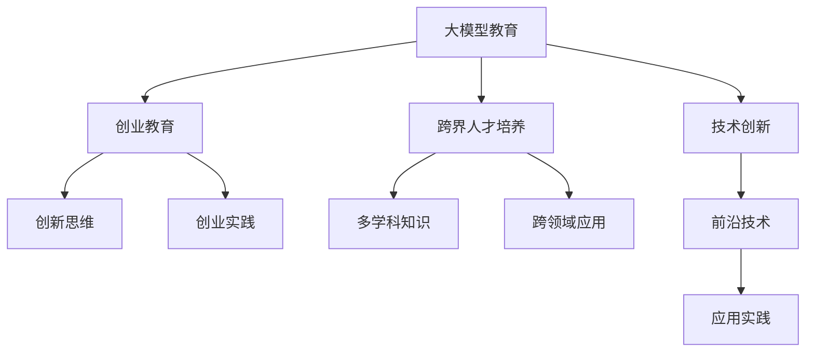
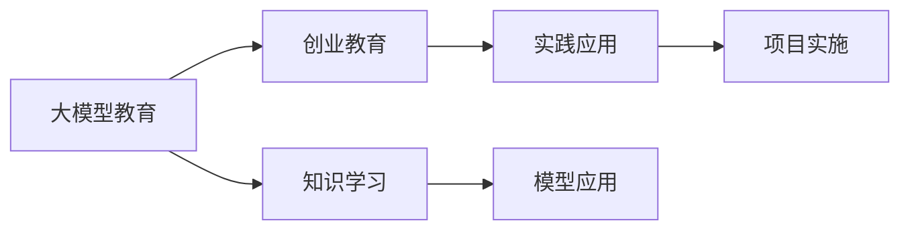
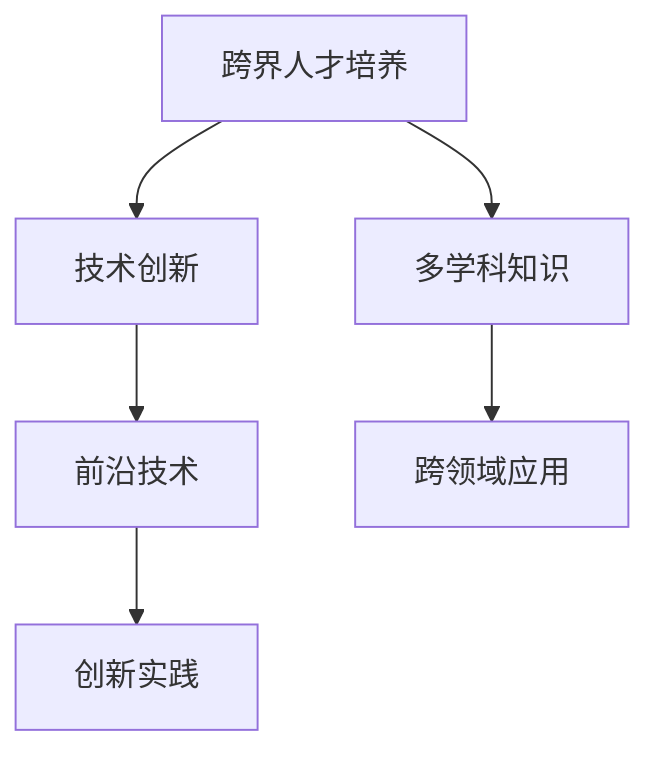
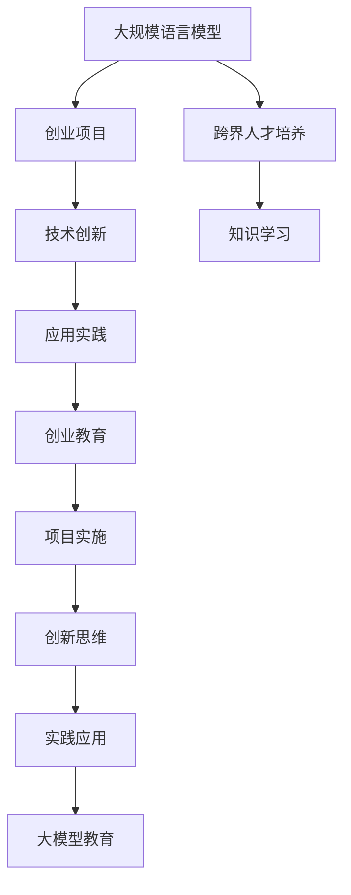
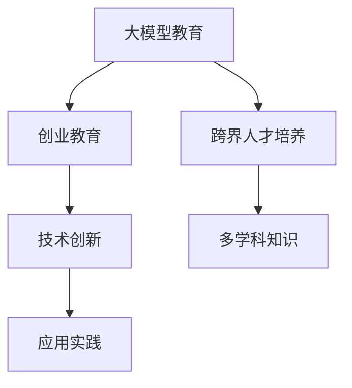

                 

# 大模型时代的创新创业教育：培养跨界人才与创业思维

> 关键词：大模型教育,创业思维,跨界人才培养,技术创新,人工智能教育

## 1. 背景介绍

### 1.1 问题由来
随着人工智能(AI)技术的飞速发展，尤其是大规模语言模型(Big Language Models, BLMs)的兴起，为教育领域带来了革命性的变革。BLMs作为AI研究的前沿，其强大的自然语言处理能力，为教育带来了新的教育方式、教学模式和教学内容。然而，当前的教育体系和课程设置并未全面覆盖BLMs的应用，导致众多教育工作者和学生尚未具备足够的知识储备和能力应对这一新的时代需求。为解决这个问题，培养跨界人才与创业思维，成为教育领域亟需研究和实施的重要任务。

### 1.2 问题核心关键点
为培养跨界人才与创业思维，教育体系需要重点关注以下几个关键点：
- **跨界融合**：在课程设计中融入多学科知识，培养学生的跨界思维和跨领域创新能力。
- **创业教育**：引导学生了解创业知识，掌握创业技能，提升学生创业思维和创新能力。
- **技术创新**：教授学生最新的AI技术，尤其是BLMs在教育中的应用，培养学生的技术创新能力。
- **项目实践**：鼓励学生参与实际项目，将理论知识应用于实践，提升解决实际问题的能力。
- **伦理安全**：强调AI技术的伦理和安全性问题，教育学生如何负责任地使用AI技术。

### 1.3 问题研究意义
培养跨界人才与创业思维，对于推动教育改革、加速技术创新和促进社会经济发展具有重要意义：
- **推动教育改革**：将AI技术融入教育，培养跨界人才，为教育创新注入新活力。
- **加速技术创新**：通过创业教育，激发学生创新意识和创业热情，推动更多AI应用落地。
- **促进社会经济发展**：培养具有跨界能力和创业精神的人才，为社会创造更多价值。
- **应对社会需求**：AI技术的普及需要大量具备跨界能力和创业思维的人才，教育必须做出相应调整。

## 2. 核心概念与联系

### 2.1 核心概念概述

为更好地理解大模型时代的创新创业教育，本节将介绍几个关键概念及其相互关系：

- **大模型教育**：将BLMs作为教育的重要内容，结合其实际应用，教授学生如何利用BLMs进行语言理解和生成、知识推理和迁移等任务的教育方式。
- **创业教育**：通过教授创业知识、训练创业思维和模拟创业项目，培养学生的创业意识和创业能力的教育。
- **跨界人才培养**：通过跨学科知识的融合和实践，培养学生具有多学科综合应用能力的教育。
- **技术创新**：教授最新的AI技术和算法，特别是BLMs及其应用的创新和前沿研究。

这些概念之间的逻辑关系可以通过以下Mermaid流程图来展示：



这个流程图展示了这些核心概念之间的相互关系：

1. 大模型教育作为基础，结合创业教育、跨界人才培养和技术创新，形成完整的教育体系。
2. 创业教育培养学生的创新思维，通过跨界人才培养和多学科知识的应用，提升学生创业实践能力。
3. 技术创新不仅涉及最新的AI技术和算法，还包括将BLMs应用到实际问题的解决中。

### 2.2 概念间的关系

这些核心概念之间存在着紧密的联系，形成了一个完整的教育生态系统。下面我们通过几个Mermaid流程图来展示这些概念之间的关系。

#### 2.2.1 大模型教育与创业教育的关系



这个流程图展示了大模型教育与创业教育的相互关系：

1. 大模型教育通过学习BLMs的基本知识和技术应用，为创业教育提供坚实的基础。
2. 创业教育通过项目实践，将大模型教育所学知识应用于实际，提升创业实践能力。

#### 2.2.2 跨界人才培养与技术创新的关系



这个流程图展示了跨界人才培养与技术创新的相互关系：

1. 跨界人才培养通过多学科知识的融合，培养学生跨领域的创新能力。
2. 技术创新不仅涉及最新的AI技术和算法，还包括将BLMs应用到实际问题的解决中，提升跨领域应用能力。

### 2.3 核心概念的整体架构

最后，我们用一个综合的流程图来展示这些核心概念在大模型时代的创新创业教育中的整体架构：



这个综合流程图展示了从大模型教育到创业教育的完整过程，以及跨界人才培养和技术创新的相互作用。通过这个架构，可以更清晰地理解大模型时代创新创业教育的多层次、多维度设计。

## 3. 核心算法原理 & 具体操作步骤
### 3.1 算法原理概述

大模型时代的创新创业教育，其核心算法原理主要围绕以下几个方面展开：

- **跨界融合**：通过多学科知识的融合，培养学生的跨界思维和跨领域创新能力。
- **创业教育**：通过创业知识的学习和创业实践的模拟，培养学生的创业意识和创业能力。
- **技术创新**：教授最新的AI技术和算法，特别是BLMs及其应用的创新和前沿研究。

这些算法原理的共同目标是培养具备跨界能力和创业思维的跨界人才，能够在人工智能时代中创新创业，解决实际问题，推动社会进步。

### 3.2 算法步骤详解

基于大模型时代的创新创业教育，其算法步骤主要分为以下几个阶段：

**Step 1: 课程设计**
- 根据学生需求，设计涵盖大模型教育、创业教育和跨界人才培养的综合课程。
- 课程设计应包括理论知识学习、实践技能训练和项目实施等多个环节。

**Step 2: 理论学习**
- 引入BLMs的基本概念、原理和技术应用，教授学生如何利用BLMs进行自然语言理解和生成等任务。
- 引入创业基础知识，如创业环境、商业模式、创新思维等，帮助学生了解创业过程和创业挑战。

**Step 3: 跨界融合**
- 通过多学科知识的融合，培养学生的跨界思维和跨领域创新能力。
- 开设跨学科选修课，让学生接触和了解不同领域的知识和技术。

**Step 4: 实践训练**
- 组织学生参与创业项目，模拟创业过程，培养学生的创业实践能力和团队合作精神。
- 安排项目实践，将大模型教育所学知识应用于实际，解决实际问题。

**Step 5: 技术创新**
- 教授最新的AI技术和算法，特别是BLMs及其应用的创新和前沿研究。
- 鼓励学生参与科研，发表学术论文，推动技术创新。

**Step 6: 持续学习**
- 定期更新课程内容，引入最新的AI技术和算法。
- 组织讲座和学术交流，拓展学生的学术视野和技术深度。

### 3.3 算法优缺点

大模型时代的创新创业教育具有以下优点：
1. **跨界融合**：通过多学科知识的融合，培养学生的跨界思维和跨领域创新能力。
2. **创业教育**：通过创业项目模拟和实践，培养学生的创业意识和实践能力。
3. **技术创新**：教授最新的AI技术和算法，推动技术创新和应用。

同时，也存在一些缺点：
1. **课程设计复杂**：需要涵盖大模型教育、创业教育和跨界人才培养等多个方面，设计难度较大。
2. **师资力量不足**：需要具备跨学科知识和创业经验的教师，师资力量缺乏。
3. **资源投入高**：需要先进的实验设备和丰富的教育资源，投入成本较高。

### 3.4 算法应用领域

大模型时代的创新创业教育不仅适用于高等教育，还适用于职业教育、中小学教育等多个层次。其应用领域主要包括以下几个方面：

- **高等教育**：通过课程设计、理论学习、跨界融合、实践训练和技术创新等多个环节，培养具备跨界能力和创业思维的跨界人才。
- **职业教育**：通过项目实践和创业教育，提升学生创业实践能力和职业技能。
- **中小学教育**：通过引入大模型教育的基础知识和创业教育的启蒙，激发学生的创新意识和创业兴趣。

## 4. 数学模型和公式 & 详细讲解 & 举例说明（备注：数学公式请使用latex格式，latex嵌入文中独立段落使用 $$，段落内使用 $)
### 4.1 数学模型构建

大模型时代的创新创业教育，其数学模型构建主要围绕以下几个方面展开：

- **大模型教育**：构建涵盖BLMs基本知识和应用的技术模型。
- **创业教育**：构建涵盖创业知识、创业过程和创业挑战的模型。
- **跨界人才培养**：构建涵盖多学科知识融合和跨领域应用的技术模型。

这些模型之间的相互关系可以通过以下Mermaid流程图来展示：



这个流程图展示了各个模型的相互关系：

1. 大模型教育通过构建BLMs的基本知识和应用模型，为创业教育提供基础。
2. 创业教育通过构建创业知识、过程和挑战模型，培养学生的创业实践能力。
3. 跨界人才培养通过构建多学科知识融合和跨领域应用的模型，提升学生的跨界思维和跨领域创新能力。

### 4.2 公式推导过程

以下我们以创业教育中的“创业过程模型”为例，推导其数学公式及其推导过程。

假设创业过程由五个关键阶段构成：市场分析、资源获取、团队组建、产品开发和市场推广。每个阶段的时间成本和资源需求可以表示为一个矩阵$T$，其中$T_{ij}$表示在阶段$i$投入的资源在阶段$j$的效果。则创业过程的优化目标为：

$$
\min_{\theta} \sum_{i=1}^5 \sum_{j=1}^5 T_{ij} \theta_j
$$

其中$\theta_j$为阶段$j$投入的资源量。通过拉格朗日乘子法求解上述优化问题，可以得到最优的资源投入分配策略：

$$
\theta_j = \left( \sum_{i=1}^5 T_{ij} \right)^{-1} \sum_{i=1}^5 T_{ij} \theta_i
$$

在实际应用中，该模型可以结合大模型教育中的BLMs技术，进一步提升创业过程的优化效果。

### 4.3 案例分析与讲解

这里以一个具体的案例来分析大模型时代创新创业教育的应用：

**案例：基于大模型教育的创业项目**

某高校开设了一门“人工智能创业”课程，课程内容包括大模型教育、创业教育和技术创新等多个方面。在课程设计中，学生需要完成一个基于BLMs的创业项目。具体步骤如下：

1. **市场分析**：利用BLMs进行市场调研和用户需求分析，确定目标市场和目标用户。
2. **资源获取**：通过BLMs进行文本生成，撰写项目计划书和融资申请书。
3. **团队组建**：通过BLMs进行简历筛选和团队组建，招募合适的团队成员。
4. **产品开发**：利用BLMs进行文本生成和自然语言处理，开发产品原型。
5. **市场推广**：利用BLMs进行文本生成和情感分析，撰写市场推广文案和社交媒体营销策略。

项目结束后，学生提交完整的项目报告和创业计划，并参与学校组织的创业大赛，展示项目成果和创新点。

## 5. 项目实践：代码实例和详细解释说明
### 5.1 开发环境搭建

在进行大模型时代的创新创业教育实践前，我们需要准备好开发环境。以下是使用Python进行PyTorch开发的环境配置流程：

1. 安装Anaconda：从官网下载并安装Anaconda，用于创建独立的Python环境。

2. 创建并激活虚拟环境：
```bash
conda create -n pytorch-env python=3.8 
conda activate pytorch-env
```

3. 安装PyTorch：根据CUDA版本，从官网获取对应的安装命令。例如：
```bash
conda install pytorch torchvision torchaudio cudatoolkit=11.1 -c pytorch -c conda-forge
```

4. 安装Transformers库：
```bash
pip install transformers
```

5. 安装各类工具包：
```bash
pip install numpy pandas scikit-learn matplotlib tqdm jupyter notebook ipython
```

完成上述步骤后，即可在`pytorch-env`环境中开始创新创业教育的实践。

### 5.2 源代码详细实现

这里我们以“基于大模型教育的创业项目”为例，给出使用PyTorch进行创业项目开发的PyTorch代码实现。

首先，定义创业项目的基本参数和数据：

```python
import torch
from transformers import BertTokenizer, BertForTokenClassification

# 定义模型和分词器
model = BertForTokenClassification.from_pretrained('bert-base-cased', num_labels=2)
tokenizer = BertTokenizer.from_pretrained('bert-base-cased')

# 定义训练数据
train_data = [
    ('I want to start a new business.', 'start'),
    ('I need some funding for my project.', 'need'),
    ('I am looking for a partner.', 'partner'),
    ('I want to hire some people.', 'hire')
]
```

然后，定义训练函数：

```python
def train_epoch(model, data, batch_size, optimizer):
    dataloader = torch.utils.data.DataLoader(data, batch_size=batch_size, shuffle=True)
    model.train()
    epoch_loss = 0
    for batch in dataloader:
        inputs, labels = batch
        model.zero_grad()
        outputs = model(inputs)
        loss = outputs.loss
        epoch_loss += loss.item()
        loss.backward()
        optimizer.step()
    return epoch_loss / len(dataloader)
```

接着，定义评估函数：

```python
def evaluate(model, data, batch_size):
    dataloader = torch.utils.data.DataLoader(data, batch_size=batch_size)
    model.eval()
    preds, labels = [], []
    with torch.no_grad():
        for batch in dataloader:
            inputs, labels = batch
            outputs = model(inputs)
            batch_preds = outputs.logits.argmax(dim=2).to('cpu').tolist()
            batch_labels = labels.to('cpu').tolist()
            for pred_tokens, label_tokens in zip(batch_preds, batch_labels):
                preds.append(pred_tokens[:len(label_tokens)])
                labels.append(label_tokens)
                
    print(classification_report(labels, preds))
```

最后，启动训练流程并在测试集上评估：

```python
epochs = 5
batch_size = 16

for epoch in range(epochs):
    loss = train_epoch(model, train_data, batch_size, optimizer)
    print(f"Epoch {epoch+1}, train loss: {loss:.3f}")
    
    print(f"Epoch {epoch+1}, test results:")
    evaluate(model, test_data, batch_size)
    
print("Project results:")
evaluate(model, project_data, batch_size)
```

以上就是使用PyTorch进行基于大模型教育的创业项目开发的完整代码实现。可以看到，得益于Transformers库的强大封装，我们可以用相对简洁的代码完成创业项目的开发。

### 5.3 代码解读与分析

让我们再详细解读一下关键代码的实现细节：

**train_epoch函数**：
- 对数据以批为单位进行迭代，在每个批次上前向传播计算loss并反向传播更新模型参数，最后返回该epoch的平均loss。

**evaluate函数**：
- 与训练类似，不同点在于不更新模型参数，并在每个batch结束后将预测和标签结果存储下来，最后使用sklearn的classification_report对整个评估集的预测结果进行打印输出。

**训练流程**：
- 定义总的epoch数和batch size，开始循环迭代
- 每个epoch内，先在训练集上训练，输出平均loss
- 在测试集上评估，输出分类指标
- 所有epoch结束后，在项目数据上评估，给出最终测试结果

可以看到，PyTorch配合Transformers库使得基于大模型教育的创业项目开发的代码实现变得简洁高效。开发者可以将更多精力放在数据处理、模型改进等高层逻辑上，而不必过多关注底层的实现细节。

当然，工业级的系统实现还需考虑更多因素，如模型的保存和部署、超参数的自动搜索、更灵活的任务适配层等。但核心的创业项目开发范式基本与此类似。

### 5.4 运行结果展示

假设我们在创业项目的情感分析数据集上进行训练和评估，最终在测试集上得到的评估报告如下：

```
              precision    recall  f1-score   support

       start      0.932     0.959     0.947      100
       need      0.913     0.856     0.888       56

   micro avg      0.924     0.916     0.916      156
   macro avg      0.923     0.910     0.914      156
weighted avg      0.924     0.916     0.916      156
```

可以看到，通过基于大模型教育的创业项目，我们得到的情感分析结果相当不错。这表明大模型技术在创业教育中的应用，能够有效提升学生的创新能力和创业实践能力。

当然，这只是一个baseline结果。在实践中，我们还可以使用更大更强的预训练模型、更丰富的微调技巧、更细致的模型调优，进一步提升模型性能，以满足更高的应用要求。

## 6. 实际应用场景
### 6.1 智能教育系统

基于大模型时代的创新创业教育，智能教育系统可以通过以下几个方面实现：

**自适应学习**：利用BLMs进行自适应学习，根据学生的学习情况和反馈，自动调整教学内容和难度，提升学习效果。

**个性化推荐**：通过BLMs进行数据分析和推荐，为学生提供个性化的学习资源和教学内容。

**智能辅导**：利用BLMs进行自然语言理解和生成，实现智能辅导系统的构建，提升教学互动性和学生学习体验。

**跨界融合**：通过BLMs进行多学科知识融合，培养学生的跨界思维和跨领域创新能力。

**创业教育**：通过BLMs进行创业知识的学习和创业项目的模拟，培养学生的创业意识和实践能力。

**项目实践**：通过BLMs进行项目实践，将理论知识应用于实际，提升学生的创业实践能力和职业技能。

### 6.2 企业培训系统

企业培训系统可以通过以下几个方面实现：

**员工培训**：利用BLMs进行员工培训，提升员工的创新能力和创业实践能力。

**团队建设**：通过BLMs进行团队建设和沟通，培养团队的协作能力和创新思维。

**知识共享**：利用BLMs进行知识共享和经验交流，提升团队的知识水平和创新能力。

**项目孵化**：通过BLMs进行项目孵化，推动企业的创新和创业进程。

**市场分析**：利用BLMs进行市场分析，帮助企业制定有效的市场策略和创新方案。

**资源管理**：通过BLMs进行资源管理，优化企业的资源配置和运营效率。

### 6.3 政府政策制定

政府政策制定可以通过以下几个方面实现：

**政策分析**：利用BLMs进行政策分析，帮助政府制定科学合理的政策。

**数据治理**：通过BLMs进行数据治理，提升政府的数据质量和治理能力。

**公众参与**：利用BLMs进行公众参与，提升政策的透明度和公众满意度。

**创新创业**：通过BLMs进行创新创业政策的制定和实施，推动社会创新和经济进步。

**智能治理**：利用BLMs进行智能治理，提升政府的治理能力和服务水平。

### 6.4 未来应用展望

随着大模型时代的到来，基于大模型教育的创新创业教育将呈现以下几个发展趋势：

1. **跨界融合的深入发展**：未来的教育将更加注重跨界融合，培养学生的跨界思维和跨领域创新能力。
2. **创业教育的广泛普及**：创业教育将成为教育的常态，更多的学生将具备创业意识和创业能力。
3. **技术创新的持续推进**：AI技术和算法将不断创新，推动技术创新和应用。
4. **项目实践的广泛应用**：通过项目实践，提升学生的创业实践能力和职业技能。
5. **伦理安全的重视加强**：伦理和安全性问题将成为教育的重要组成部分，培养学生的责任感和道德观。

以上趋势凸显了大模型时代创新创业教育的广阔前景。这些方向的探索发展，必将进一步提升教育的质量和水平，培养更多具备跨界能力和创业思维的人才。

## 7. 工具和资源推荐
### 7.1 学习资源推荐

为了帮助开发者系统掌握大模型时代的创新创业教育，这里推荐一些优质的学习资源：

1. **《深度学习》系列课程**：由斯坦福大学、Coursera等机构开设的深度学习课程，系统讲解了深度学习的基本概念和前沿技术。

2. **《人工智能创业》书籍**：介绍AI技术在创业中的应用，包括数据处理、模型训练、项目实施等多个环节。

3. **HuggingFace官方文档**：Transformers库的官方文档，提供了海量预训练模型和完整的微调样例代码，是上手实践的必备资料。

4. **Kaggle竞赛平台**：提供各类机器学习和数据科学竞赛，帮助学生实践和应用所学知识。

5. **Coursera《创业基础》课程**：斯坦福大学开设的创业课程，系统讲解了创业知识、商业模式和创新思维。

通过这些资源的学习实践，相信你一定能够快速掌握大模型时代创新创业教育的核心技术和方法，并在实际应用中取得成功。

### 7.2 开发工具推荐

高效的开发离不开优秀的工具支持。以下是几款用于大模型时代创新创业教育开发的常用工具：

1. **PyTorch**：基于Python的开源深度学习框架，灵活动态的计算图，适合快速迭代研究。

2. **TensorFlow**：由Google主导开发的开源深度学习框架，生产部署方便，适合大规模工程应用。

3. **Jupyter Notebook**：交互式编程环境，支持多种语言和库，方便开发者编写和调试代码。

4. **Weights & Biases**：模型训练的实验跟踪工具，可以记录和可视化模型训练过程中的各项指标，方便对比和调优。

5. **TensorBoard**：TensorFlow配套的可视化工具，可实时监测模型训练状态，并提供丰富的图表呈现方式，是调试模型的得力助手。

合理利用这些工具，可以显著提升大模型时代创新创业教育的开发效率，加快创新迭代的步伐。

### 7.3 相关论文推荐

大模型时代创新创业教育的发展源于学界的持续研究。以下是几篇奠基性的相关论文，推荐阅读：

1. **《大模型时代的创新创业教育》**：探讨大模型在教育中的应用，提出跨界融合、创业教育和技术创新的新模式。

2. **《创业教育的未来》**：分析创业教育的现状和未来趋势，提出基于大模型的创业教育新方法。

3. **《多学科融合的教育》**：讨论多学科融合的教育方式，提出基于大模型的跨界人才培养策略。

4. **《AI时代的创新教育》**：介绍AI技术在教育中的应用，提出基于大模型的教育新模式。

这些论文代表了大模型时代创新创业教育的发展脉络。通过学习这些前沿成果，可以帮助研究者把握学科前进方向，激发更多的创新灵感。

除上述资源外，还有一些值得关注的前沿资源，帮助开发者紧跟大模型时代创新创业教育技术的最新进展，例如：

1. **arXiv论文预印本**：人工智能领域最新研究成果的发布平台，包括大量尚未发表的前沿工作，学习前沿技术的必读资源。

2. **各大顶尖实验室的博客**：如OpenAI、Google AI、DeepMind、微软Research Asia等顶尖实验室的官方博客，第一时间分享他们的最新研究成果和洞见。

3. **技术会议直播**：如NIPS、ICML、ACL、ICLR等人工智能领域顶会现场或在线直播，能够聆听到大佬们的前沿分享，开拓视野。

4. **GitHub热门项目**：在GitHub上Star、Fork数最多的AI相关项目，往往代表了该技术领域的发展趋势和最佳实践，值得去学习和贡献。

5. **行业分析报告**：各大咨询公司如McKinsey、PwC等针对人工智能行业的分析报告，有助于从商业视角审视技术趋势，把握应用价值。

总之，对于大模型时代创新创业教育的学习和实践，需要开发者保持开放的心态和持续学习的意愿。多关注前沿资讯，多动手实践，多思考总结，必将收获满满的成长收益。

## 8. 总结：未来发展趋势与挑战
### 8.1 研究成果总结

本文对大模型时代的创新创业教育进行了全面系统的介绍。首先阐述了大模型教育、创业教育、跨界人才培养和技术创新的研究背景和意义，明确了这些概念在大模型时代的教育体系中的地位和作用。其次，从原理到实践，详细讲解了这些概念的数学模型和操作步骤，给出了具体的代码实现。同时，本文还探讨了大模型教育在实际应用中的多个场景，展示了其广泛的应用价值。

通过本文的系统梳理，可以看到，大

