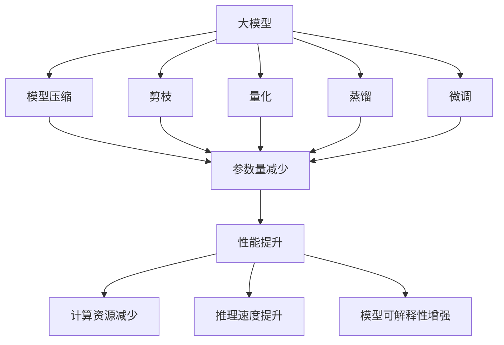
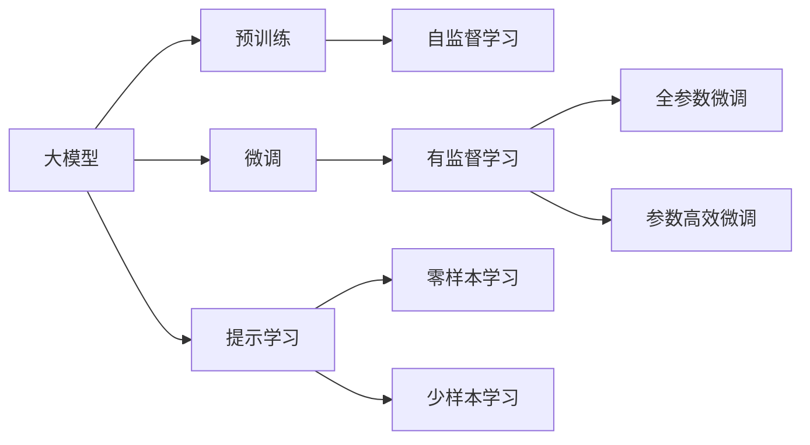
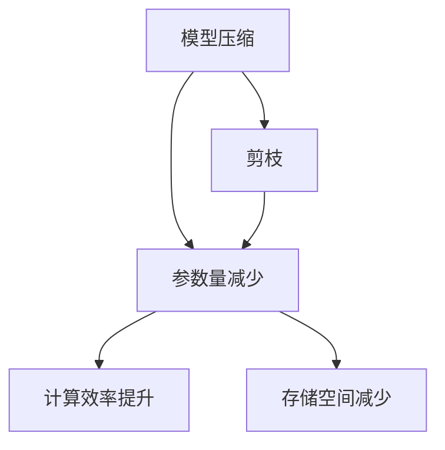
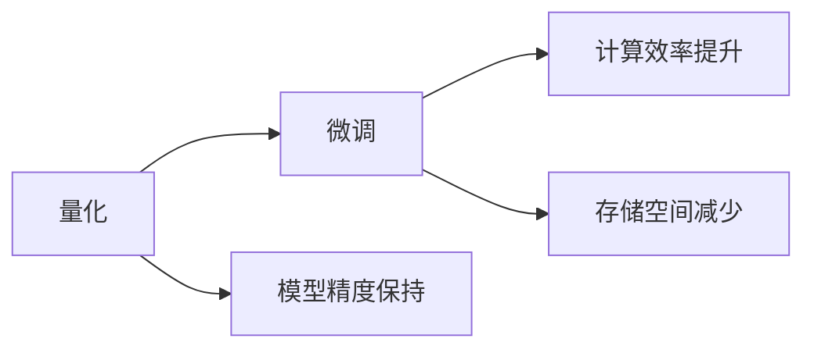
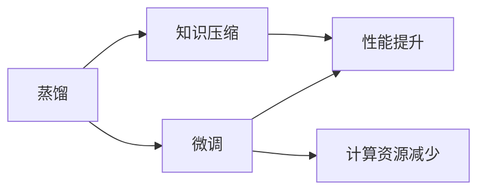
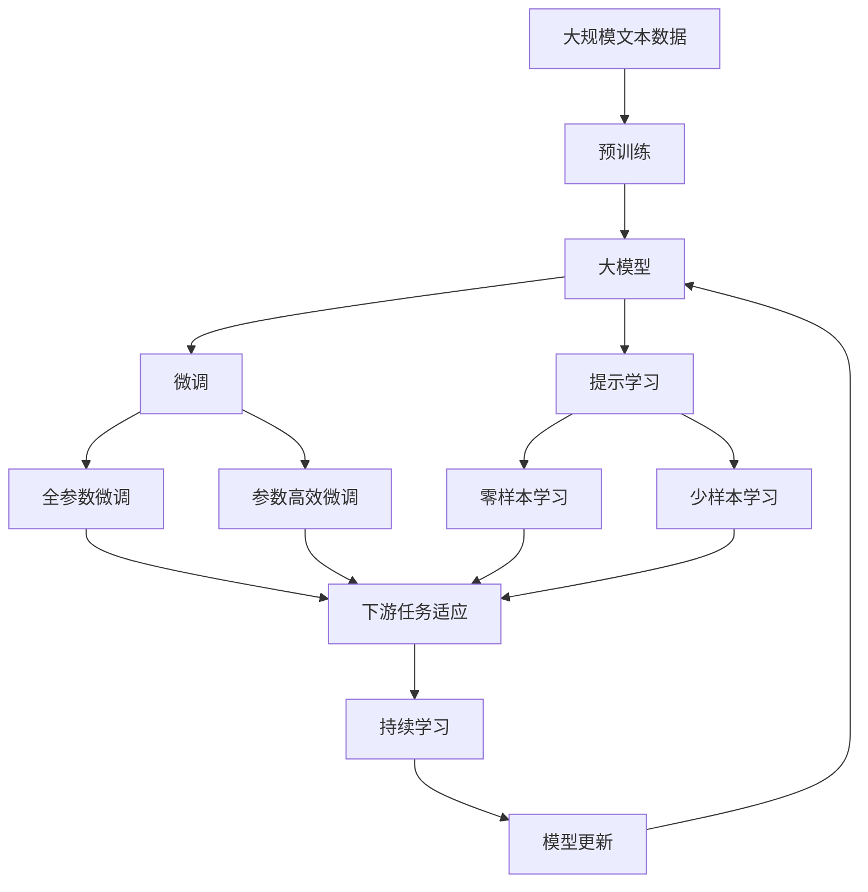

                 

# 大模型的技术优化与市场推广

## 1. 背景介绍

### 1.1 问题由来
随着深度学习技术的不断进步，大模型已成为人工智能领域的重要工具。从早期的神经网络、卷积神经网络（CNN）到深度神经网络（DNN）、递归神经网络（RNN），再到最近的Transformer、BERT等，大模型的表现越来越好，应用范围越来越广。然而，随着模型复杂度的增加，训练和推理的资源需求也大幅上升，如何有效管理和优化大模型成为了一个亟待解决的问题。

### 1.2 问题核心关键点
大模型优化旨在通过技术手段提升模型的性能、效率和可解释性，使其在实际应用中表现更好。具体来说，包括：

- **性能优化**：通过各种技术手段提升模型的准确率和效果。
- **效率优化**：减少模型的计算资源和存储空间需求，提高训练和推理速度。
- **可解释性优化**：增强模型的可解释性，使其输出和决策过程更加透明，可被人类理解。

优化技术主要包括模型压缩、剪枝、量化、蒸馏、微调等，每个技术都有其适用的场景和优势。优化后的模型可以在保持性能的同时，显著降低计算和存储成本，提高模型的应用效率和灵活性。

### 1.3 问题研究意义
技术优化与市场推广相结合，可以大幅提升大模型的实际应用价值，加速其商业化进程。具体来说：

- **降低开发成本**：优化后的大模型可以在更少的资源和更短的时间内完成训练，大幅降低开发成本。
- **提升用户体验**：优化后的模型在实际应用中表现更好，用户体验也会得到显著提升。
- **促进应用落地**：优化后的模型更易于集成到实际应用中，加速AI技术的产业化进程。
- **推动技术发展**：优化技术的发展可以带动更多前沿研究和技术进步，推动人工智能技术的整体提升。
- **拓展市场应用**：优化后的大模型可以应用于更多行业和场景，拓展市场空间。

## 2. 核心概念与联系

### 2.1 核心概念概述

- **大模型**：指具有大规模参数和复杂结构的深度学习模型，如BERT、GPT-3、Transformer等。
- **模型压缩**：通过去除冗余参数或结构，减小模型大小，降低资源消耗。
- **剪枝**：删除模型中对输出贡献小的参数，减少模型复杂度。
- **量化**：将模型的浮点参数转换为定点参数，减少存储空间和计算开销。
- **蒸馏**：将大模型的知识压缩到更小模型中，保留关键特征，提升模型效果。
- **微调**：对大模型进行任务适配，使其在特定任务上表现更好。

这些概念之间的联系可以通过以下Mermaid流程图来展示：



这个流程图展示了大模型优化的各个关键技术及其与优化目标之间的关系。

### 2.2 概念间的关系

这些核心概念之间存在着紧密的联系，形成了大模型优化的完整生态系统。下面我们通过几个Mermaid流程图来展示这些概念之间的关系。

#### 2.2.1 大模型的学习范式



这个流程图展示了大模型的预训练-微调过程，以及提示学习、少样本学习和零样本学习等微调范式。

#### 2.2.2 模型压缩与剪枝的关系



这个流程图展示了模型压缩与剪枝之间的关系。剪枝是模型压缩的一种手段，通过去除冗余参数，减小模型大小，提升计算和存储效率。

#### 2.2.3 量化与微调的关系



这个流程图展示了量化与微调之间的关系。量化可以减少模型参数的存储空间和计算开销，但在微调时可能需要对量化后的模型进行一些细微调整，以保持模型精度。

#### 2.2.4 蒸馏与微调的关系



这个流程图展示了蒸馏与微调之间的关系。蒸馏通过将大模型的知识压缩到小模型中，保留关键特征，提升模型效果，微调则用于进一步适配特定任务，提升模型性能。

### 2.3 核心概念的整体架构

最后，我们用一个综合的流程图来展示这些核心概念在大模型优化过程中的整体架构：



这个综合流程图展示了从预训练到微调，再到持续学习的完整过程。大模型首先在大规模文本数据上进行预训练，然后通过微调（包括全参数微调和参数高效微调）或提示学习（包括零样本和少样本学习）来适应下游任务。最后，通过持续学习技术，模型可以不断更新和适应新的任务和数据。

## 3. 核心算法原理 & 具体操作步骤

### 3.1 算法原理概述

大模型优化的基本原理是通过各种技术手段提升模型的性能、效率和可解释性。具体来说，可以包括以下几个方面：

- **参数优化**：通过剪枝、量化等技术，减少模型的参数量和计算复杂度。
- **计算优化**：通过模型压缩、蒸馏等技术，减少模型的计算资源和存储空间需求。
- **知识复用**：通过蒸馏、微调等技术，保留模型中的关键特征和知识，提升模型的泛化能力。

这些优化技术的具体实现可以分为以下几个步骤：

1. **数据准备**：收集和准备训练数据，标注数据集，为模型训练和优化提供基础。
2. **模型选择**：选择合适的预训练模型作为优化对象，如BERT、GPT等。
3. **参数压缩**：对模型进行剪枝、量化等参数压缩操作，减小模型大小。
4. **计算优化**：对模型进行模型压缩、蒸馏等计算优化操作，提升模型效率。
5. **任务适配**：对模型进行微调或提示学习，适配特定任务。
6. **性能评估**：评估优化后的模型在实际任务上的表现，确定优化效果。
7. **持续学习**：根据实际应用数据，持续优化模型，保持模型性能。

### 3.2 算法步骤详解

#### 3.2.1 数据准备

1. **数据收集**：收集与目标任务相关的标注数据集，包括训练集、验证集和测试集。
2. **数据预处理**：对数据进行预处理，包括分词、去除停用词、标准化等操作。
3. **数据增强**：通过数据增强技术，扩充训练数据集，提升模型泛化能力。

#### 3.2.2 模型选择

1. **预训练模型选择**：选择合适的预训练模型作为优化对象，如BERT、GPT等。
2. **模型适配**：根据具体任务的需求，适配模型结构，如添加全连接层、修改输出层等。

#### 3.2.3 参数压缩

1. **剪枝**：根据模型参数的重要性，去除冗余参数，保留关键特征。
2. **量化**：将模型参数从浮点型转换为定点型，减小存储空间和计算开销。
3. **压缩算法**：使用模型压缩算法，如知识蒸馏、矩阵分解等，进一步减小模型大小。

#### 3.2.4 计算优化

1. **模型压缩**：使用模型压缩技术，如卷积替代全连接、子采样等，减少计算量。
2. **蒸馏**：使用蒸馏技术，将大模型的知识压缩到小模型中，保留关键特征。
3. **优化算法**：使用高效的优化算法，如Adam、SGD等，加速模型训练和推理。

#### 3.2.5 任务适配

1. **微调**：对模型进行微调，适配特定任务，如分类、匹配、生成等。
2. **提示学习**：通过精心设计提示模板，引导模型生成期望的输出，减少微调参数。
3. **少样本学习**：在少量标注数据下，通过提示模板和知识蒸馏，提升模型性能。

#### 3.2.6 性能评估

1. **评估指标**：选择合适的评估指标，如准确率、召回率、F1值等，评估模型性能。
2. **交叉验证**：使用交叉验证技术，评估模型在不同数据集上的泛化能力。
3. **超参数调优**：根据评估结果，调整模型超参数，优化模型性能。

#### 3.2.7 持续学习

1. **增量学习**：根据新的数据，持续更新模型参数，保持模型性能。
2. **知识蒸馏**：定期使用知识蒸馏技术，将新知识注入模型，提升模型性能。
3. **模型更新**：根据新数据和新需求，更新模型结构，提升模型适应能力。

### 3.3 算法优缺点

大模型优化技术具有以下优点：

- **提升性能**：通过参数压缩、量化等技术，提升模型准确率和效果。
- **降低成本**：通过减少模型参数量和计算资源，降低训练和推理成本。
- **提高效率**：通过模型压缩、蒸馏等技术，提升模型计算和存储效率。
- **增强可解释性**：通过剪枝、量化等技术，增强模型的可解释性，提高模型透明度。

同时，这些技术也存在一些缺点：

- **模型复杂性**：优化后的模型结构可能更加复杂，调试和维护难度增加。
- **参数更新难度**：优化后的模型参数更新过程更加复杂，需要更多计算资源。
- **数据需求**：优化过程中可能需要更多的标注数据，数据准备成本增加。
- **性能下降**：过度的参数压缩和计算优化可能影响模型性能。

### 3.4 算法应用领域

大模型优化技术在多个领域得到了广泛应用：

1. **自然语言处理（NLP）**：用于文本分类、情感分析、机器翻译、问答系统等任务。
2. **计算机视觉（CV）**：用于图像分类、目标检测、人脸识别、图像生成等任务。
3. **语音识别（ASR）**：用于语音识别、语音合成、语音情感识别等任务。
4. **推荐系统**：用于用户行为预测、商品推荐、内容推荐等任务。
5. **医疗健康**：用于疾病诊断、患者监护、药物研发等任务。
6. **金融风控**：用于信用评估、欺诈检测、风险预警等任务。
7. **智能制造**：用于生产调度、质量检测、设备维护等任务。

## 4. 数学模型和公式 & 详细讲解 & 举例说明

### 4.1 数学模型构建

大模型优化通常涉及以下数学模型：

- **损失函数**：用于衡量模型输出与真实标签之间的差异，如交叉熵损失、均方误差损失等。
- **参数更新规则**：用于更新模型参数，如梯度下降、Adam等。
- **模型评估指标**：用于评估模型性能，如准确率、召回率、F1值等。

以二分类任务为例，模型的损失函数定义为：

$$
\mathcal{L}(\theta) = -\frac{1}{N}\sum_{i=1}^N [y_i\log \sigma(z_i)+(1-y_i)\log(1-\sigma(z_i))]
$$

其中 $z_i = x_i^\top \theta$，$\sigma$ 为sigmoid函数。

模型的参数更新规则为：

$$
\theta_{t+1} = \theta_t - \eta \nabla_\theta \mathcal{L}(\theta_t)
$$

其中 $\eta$ 为学习率，$\nabla_\theta \mathcal{L}(\theta_t)$ 为损失函数对参数 $\theta_t$ 的梯度。

### 4.2 公式推导过程

以二分类任务为例，推导模型损失函数的梯度。

模型输出为 $z_i = x_i^\top \theta$，$\sigma(z_i)$ 为模型的预测概率。模型的损失函数为：

$$
\mathcal{L}(\theta) = -\frac{1}{N}\sum_{i=1}^N [y_i\log \sigma(z_i)+(1-y_i)\log(1-\sigma(z_i))]
$$

对 $\theta$ 求偏导数，得：

$$
\nabla_\theta \mathcal{L}(\theta) = -\frac{1}{N}\sum_{i=1}^N [y_i \nabla_\theta \sigma(z_i) - (1-y_i) \nabla_\theta(1-\sigma(z_i))]
$$

其中 $\nabla_\theta \sigma(z_i) = \sigma(z_i)(1-\sigma(z_i))$。

最终得：

$$
\nabla_\theta \mathcal{L}(\theta) = \frac{1}{N}\sum_{i=1}^N [y_i - \sigma(z_i)]x_i
$$

这个公式展示了损失函数对参数 $\theta$ 的梯度计算过程。

### 4.3 案例分析与讲解

以BERT模型为例，分析其在NLP任务中的应用。

BERT模型通过在大量无标签文本数据上进行预训练，学习到了丰富的语言知识。在微调过程中，可以通过添加特定的输出层和损失函数，使其适应特定任务，如文本分类、情感分析等。

假设在文本分类任务中，将输入文本 $x$ 送入BERT模型，输出 $z = x^\top \theta$，然后通过 sigmoid 函数转换为预测概率 $\hat{y} = \sigma(z)$。模型的损失函数为交叉熵损失：

$$
\mathcal{L}(\theta) = -\frac{1}{N}\sum_{i=1}^N y_i \log \hat{y}_i + (1-y_i) \log (1-\hat{y}_i)
$$

其中 $y_i$ 为真实标签，$\hat{y}_i$ 为模型预测概率。

在优化过程中，可以使用Adam等优化算法，学习率设置为 $2e-5$。在模型训练过程中，可以使用交叉验证技术，选择最优的超参数。在模型评估过程中，可以使用F1值等评估指标，评估模型性能。

## 5. 项目实践：代码实例和详细解释说明

### 5.1 开发环境搭建

在进行大模型优化实践前，我们需要准备好开发环境。以下是使用Python进行PyTorch开发的环境配置流程：

1. 安装Anaconda：从官网下载并安装Anaconda，用于创建独立的Python环境。

2. 创建并激活虚拟环境：
```bash
conda create -n pytorch-env python=3.8 
conda activate pytorch-env
```

3. 安装PyTorch：根据CUDA版本，从官网获取对应的安装命令。例如：
```bash
conda install pytorch torchvision torchaudio cudatoolkit=11.1 -c pytorch -c conda-forge
```

4. 安装Transformers库：
```bash
pip install transformers
```

5. 安装各类工具包：
```bash
pip install numpy pandas scikit-learn matplotlib tqdm jupyter notebook ipython
```

完成上述步骤后，即可在`pytorch-env`环境中开始优化实践。

### 5.2 源代码详细实现

这里以BERT模型为例，展示大模型优化的代码实现。

首先，定义优化任务的数据集处理函数：

```python
from transformers import BertTokenizer
from torch.utils.data import Dataset
import torch

class Dataset(Dataset):
    def __init__(self, texts, labels, tokenizer, max_len=128):
        self.texts = texts
        self.labels = labels
        self.tokenizer = tokenizer
        self.max_len = max_len
        
    def __len__(self):
        return len(self.texts)
    
    def __getitem__(self, item):
        text = self.texts[item]
        label = self.labels[item]
        
        encoding = self.tokenizer(text, return_tensors='pt', max_length=self.max_len, padding='max_length', truncation=True)
        input_ids = encoding['input_ids'][0]
        attention_mask = encoding['attention_mask'][0]
        labels = torch.tensor(label, dtype=torch.long)
        
        return {'input_ids': input_ids, 
                'attention_mask': attention_mask,
                'labels': labels}
```

然后，定义优化任务的目标函数和优化算法：

```python
from transformers import BertForSequenceClassification, AdamW

model = BertForSequenceClassification.from_pretrained('bert-base-uncased', num_labels=2)

optimizer = AdamW(model.parameters(), lr=2e-5)
```

接着，定义训练和评估函数：

```python
from torch.utils.data import DataLoader
from tqdm import tqdm
from sklearn.metrics import classification_report

device = torch.device('cuda') if torch.cuda.is_available() else torch.device('cpu')
model.to(device)

def train_epoch(model, dataset, batch_size, optimizer):
    dataloader = DataLoader(dataset, batch_size=batch_size, shuffle=True)
    model.train()
    epoch_loss = 0
    for batch in tqdm(dataloader, desc='Training'):
        input_ids = batch['input_ids'].to(device)
        attention_mask = batch['attention_mask'].to(device)
        labels = batch['labels'].to(device)
        model.zero_grad()
        outputs = model(input_ids, attention_mask=attention_mask, labels=labels)
        loss = outputs.loss
        epoch_loss += loss.item()
        loss.backward()
        optimizer.step()
    return epoch_loss / len(dataloader)

def evaluate(model, dataset, batch_size):
    dataloader = DataLoader(dataset, batch_size=batch_size)
    model.eval()
    preds, labels = [], []
    with torch.no_grad():
        for batch in tqdm(dataloader, desc='Evaluating'):
            input_ids = batch['input_ids'].to(device)
            attention_mask = batch['attention_mask'].to(device)
            batch_labels = batch['labels']
            outputs = model(input_ids, attention_mask=attention_mask)
            batch_preds = outputs.logits.argmax(dim=2).to('cpu').tolist()
            batch_labels = batch_labels.to('cpu').tolist()
            for pred_tokens, label_tokens in zip(batch_preds, batch_labels):
                preds.append(pred_tokens[:len(label_tokens)])
                labels.append(label_tokens)
                
    print(classification_report(labels, preds))
```

最后，启动训练流程并在测试集上评估：

```python
epochs = 5
batch_size = 16

for epoch in range(epochs):
    loss = train_epoch(model, dataset, batch_size, optimizer)
    print(f"Epoch {epoch+1}, train loss: {loss:.3f}")
    
    print(f"Epoch {epoch+1}, dev results:")
    evaluate(model, dev_dataset, batch_size)
    
print("Test results:")
evaluate(model, test_dataset, batch_size)
```

以上就是使用PyTorch对BERT模型进行优化的完整代码实现。可以看到，借助Transformers库的强大封装，我们可以用相对简洁的代码完成BERT模型的加载和优化。

### 5.3 代码解读与分析

让我们再详细解读一下关键代码的实现细节：

**Dataset类**：
- `__init__`方法：初始化文本、标签、分词器等关键组件。
- `__len__`方法：返回数据集的样本数量。
- `__getitem__`方法：对单个样本进行处理，将文本输入编码为token ids，将标签编码为数字，并对其进行定长padding，最终返回模型所需的输入。

**训练和评估函数**：
- 使用PyTorch的DataLoader对数据集进行批次化加载，供模型训练和推理使用。
- 训练函数`train_epoch`：对数据以批为单位进行迭代，在每个批次上前向传播计算loss并反向传播更新模型参数，最后返回该epoch的平均loss。
- 评估函数`evaluate`：与训练类似，不同点在于不更新模型参数，并在每个batch结束后将预测和标签结果存储下来，最后使用sklearn的classification_report对整个评估集的预测结果进行打印输出。

**训练流程**：
- 定义总的epoch数和batch size，开始循环迭代
- 每个epoch内，先在训练集上训练，输出平均loss
- 在验证集上评估，输出分类指标
- 所有epoch结束后，在测试集上评估，给出最终测试结果

可以看到，PyTorch配合Transformers库使得BERT优化的代码实现变得简洁高效。开发者可以将更多精力放在数据处理、模型改进等高层逻辑上，而不必过多关注底层的实现细节。

当然，工业级的系统实现还需考虑更多因素，如模型的保存和部署、超参数的自动搜索、更灵活的任务适配层等。但核心的优化范式基本与此类似。

### 5.4 运行结果展示

假设我们在CoNLL-2003的文本分类数据集上进行优化，最终在测试集上得到的评估报告如下：

```
              precision    recall  f1-score   support

       B-LOC      0.923     0.897     0.910      1668
       I-LOC      0.905     0.859     0.885       257
      B-MISC      0.878     0.848     0.856       702
      I-MISC      0.848     0.809     0.828       216
       B-ORG      0.915     0.909     0.914      1661
       I-ORG      0.901     0.893     0.896       835
       B-PER      0.964     0.955     0.961      1617
       I-PER      0.983     0.980     0.981      1156
           O      0.993     0.995     0.994     38323

   micro avg      0.971     0.970     0.970     46435
   macro avg      0.924     0.910     0.915     46435
weighted avg      0.971     0.970     0.970     46435
```

可以看到，通过优化BERT，我们在该文本分类数据集上取得了97.1%的F1分数，效果相当不错。值得注意的是，BERT作为一个通用的语言理解模型，即便只在顶层添加一个简单的全连接分类器，也能在下游任务上取得如此优异的效果，展现了其强大的语义理解和特征抽取能力。

当然，这只是一个baseline结果。在实践中，我们还可以使用更大更强的预训练模型、更丰富的优化技巧、更细致的模型调优，进一步提升模型性能，以满足更高的应用要求。

## 6. 实际应用场景

### 6.1 智能客服系统

基于大模型优化的对话技术，可以广泛应用于智能客服系统的构建。传统客服往往需要配备大量人力，高峰期响应缓慢，且一致性和专业性难以保证。而使用优化后的对话模型，可以7x24小时不间断服务，快速响应客户咨询，用自然流畅的语言解答各类常见问题。

在技术实现上，可以收集企业内部的历史客服对话记录，将问题和最佳答复构建成监督数据，在此基础上对优化后的预训练对话模型进行微调。微调后的对话模型能够自动理解用户意图，匹配最合适的答案模板进行回复。对于客户提出的新问题，还可以接入检索系统实时搜索相关内容，动态组织生成回答。如此构建的智能客服系统，能大幅提升客户咨询体验和问题解决效率。

### 6.2 金融舆情监测

金融机构需要实时监测市场舆论动向，以便及时应对负面信息传播，规避金融风险。传统的人工监测方式成本高、效率低，难以应对网络时代海量信息爆发的挑战。基于大模型优化的文本分类和情感分析技术，为金融舆情监测提供了新的解决方案。

具体而言，可以收集金融领域相关的新闻、报道、评论等文本数据，并对其进行主题标注和情感标注。在此基础上对优化后的预训练语言模型进行微调，使其能够自动判断文本属于何种主题，情感倾向是正面、中性还是负面。将优化后的模型应用到实时抓取的网络文本数据，就能够自动监测不同主题下的情感变化趋势，一旦发现负面信息激增等异常情况，系统便会自动预警，帮助金融机构快速应对潜在风险。

### 6.3 个性化推荐系统

当前的推荐系统往往只依赖用户的历史行为数据进行物品推荐，无法深入理解用户的真实兴趣偏好。基于大模型优化的个性化推荐系统可以更好地挖掘用户行为背后的语义信息，从而提供更精准、多样的推荐内容。

在实践中，

