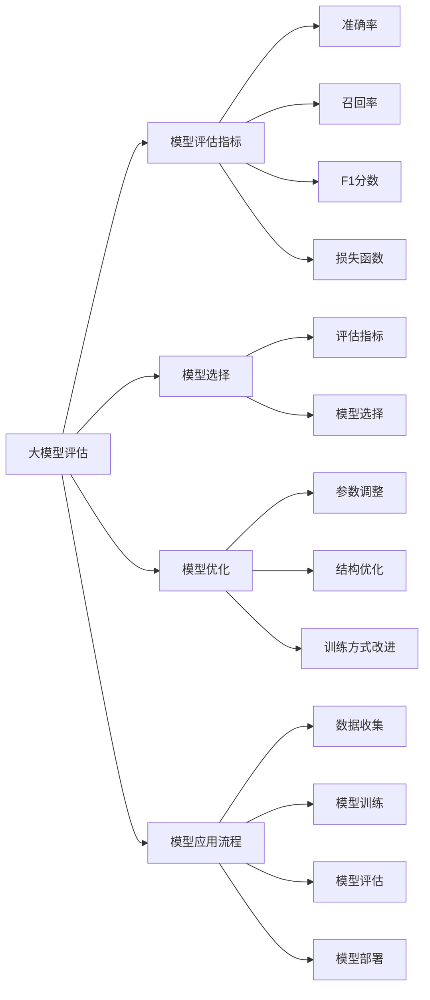
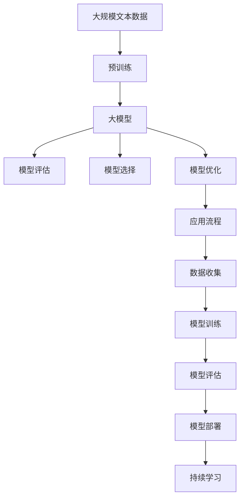

                 

# 大模型的评估与应用流程

> 关键词：大模型评估, 模型评估指标, 模型选择, 模型优化, 模型应用流程

## 1. 背景介绍

### 1.1 问题由来

在人工智能技术迅速发展的今天，大模型成为了许多应用领域的热门选择。但如何评估和应用这些模型，成为了一个值得深入探讨的问题。有效的评估方法不仅能帮助开发者更好地理解模型性能，还能指导模型优化和应用实践，从而在实际应用中发挥最大效能。

### 1.2 问题核心关键点

本文旨在探讨大模型的评估与应用流程。我们将从模型评估指标的选择、模型优化技巧、应用流程设计等方面进行详细讨论，以期为开发者提供有价值的指导。

## 2. 核心概念与联系

### 2.1 核心概念概述

为更好地理解大模型的评估与应用流程，本节将介绍几个密切相关的核心概念：

- 大模型评估: 通过一系列指标和方法，对大模型的性能进行量化和比较，以便选择最优模型或优化现有模型。
- 模型评估指标: 用于衡量模型性能的具体数值或函数，如准确率、召回率、F1分数、损失函数等。
- 模型选择: 基于评估结果，选择最适合当前应用场景的模型。
- 模型优化: 通过调整模型参数、结构、训练方式等手段，提升模型性能。
- 模型应用流程: 从数据收集、模型训练、评估到应用部署的完整过程。

### 2.2 概念间的关系

这些核心概念之间的逻辑关系可以通过以下Mermaid流程图来展示：



这个流程图展示了从大模型评估到模型应用的全过程：评估指标的选择和计算；基于评估结果进行模型选择；通过优化手段提升模型性能；以及完整的模型应用流程设计。

### 2.3 核心概念的整体架构

最后，我们用一个综合的流程图来展示这些核心概念在大模型评估与应用过程中的整体架构：



这个综合流程图展示了从预训练到模型应用，再到持续学习的完整过程。大模型首先在大规模文本数据上进行预训练，然后通过评估指标进行性能评估，根据评估结果进行模型选择和优化，最终部署应用并持续学习，以适应新的数据和任务。

## 3. 核心算法原理 & 具体操作步骤
### 3.1 算法原理概述

大模型的评估与应用流程，本质上是一个数据驱动的优化过程。其核心思想是通过一系列评估指标，对模型在不同任务上的性能进行量化和比较，选择性能最优的模型，并通过优化手段进一步提升模型性能，最终应用于实际应用场景。

形式化地，假设有一系列任务 $\{T_i\}_{i=1}^N$，每个任务对应的评估指标为 $\{M_i\}_{i=1}^N$。则大模型 $M$ 在所有任务上的综合性能 $P$ 可以表示为：

$$
P(M) = \sum_{i=1}^N w_i M_i(M)
$$

其中 $w_i$ 为任务权重，用于反映不同任务的重要性和优先级。$M_i(M)$ 表示模型 $M$ 在任务 $T_i$ 上的评估指标 $M_i$ 的数值。通过最大化 $P$，可以选择性能最优的模型。

### 3.2 算法步骤详解

大模型的评估与应用流程一般包括以下几个关键步骤：

**Step 1: 数据收集与预处理**

- 收集应用场景相关的数据集，确保数据的多样性和代表性。
- 对数据进行清洗、标注和预处理，以去除噪声和异常值，准备适合模型的训练数据。

**Step 2: 模型选择**

- 选择合适的预训练模型，如BERT、GPT等，或自己设计适合的模型架构。
- 根据实际需求，选择合适的评估指标，如准确率、召回率、F1分数等。
- 在预训练数据上对模型进行微调，以适应特定任务。

**Step 3: 模型评估**

- 在测试集上对微调后的模型进行评估，计算评估指标的具体数值。
- 根据评估结果，结合任务需求和业务目标，进行模型选择。

**Step 4: 模型优化**

- 根据评估结果，调整模型参数、结构或训练方式，以提升模型性能。
- 可以使用优化算法如Adam、SGD等，并结合正则化、Dropout、学习率调整等技术，防止过拟合。

**Step 5: 应用部署**

- 将优化后的模型应用于实际应用场景，进行测试和调试。
- 收集用户反馈和应用效果，不断优化模型和应用流程。

### 3.3 算法优缺点

大模型的评估与应用流程具有以下优点：

- 客观性：通过量化评估指标，可以有效衡量模型性能，避免主观判断。
- 可比性：通过综合评估多个模型，选择最优模型，提升决策效率。
- 适用性：适用于各种NLP任务，如文本分类、命名实体识别、问答系统等。
- 可扩展性：可以灵活选择模型和评估指标，适应不同应用场景。

同时，该方法也存在以下局限性：

- 依赖标注数据：评估指标需要依赖标注数据，标注成本较高。
- 评估指标单一：一些任务可能没有通用的评估指标，需要根据具体情况设计。
- 模型优化复杂：模型优化过程可能涉及大量超参数调整，需要更多时间和资源。
- 应用场景局限：对于某些任务，如创造性写作、情感分析等，评估指标和优化方式仍有待研究。

尽管存在这些局限性，但大模型的评估与应用流程仍是大模型应用的最主流范式。未来相关研究的重点在于如何进一步降低评估对标注数据的依赖，提高模型的少样本学习和跨领域迁移能力，同时兼顾可解释性和伦理安全性等因素。

### 3.4 算法应用领域

大模型的评估与应用流程已在诸多NLP任务中得到了广泛应用，例如：

- 文本分类：如情感分析、主题分类、意图识别等。通过评估指标如准确率、召回率、F1分数等，选择最优模型。
- 命名实体识别：识别文本中的人名、地名、机构名等特定实体。通过评估指标如召回率、F1分数等，优化模型性能。
- 关系抽取：从文本中抽取实体之间的语义关系。通过评估指标如准确率、召回率等，优化模型。
- 问答系统：对自然语言问题给出答案。通过评估指标如BLEU分数、ROUGE分数等，评估模型生成效果。
- 机器翻译：将源语言文本翻译成目标语言。通过评估指标如BLEU分数等，优化模型性能。
- 文本摘要：将长文本压缩成简短摘要。通过评估指标如ROUGE分数、BLEU分数等，评估模型生成效果。
- 对话系统：使机器能够与人自然对话。通过评估指标如BLEU分数、ROUGE分数等，优化模型生成效果。

除了上述这些经典任务外，大模型的评估与应用流程也被创新性地应用到更多场景中，如可控文本生成、常识推理、代码生成、数据增强等，为NLP技术带来了全新的突破。

## 4. 数学模型和公式 & 详细讲解 & 举例说明（备注：数学公式请使用latex格式，latex嵌入文中独立段落使用 $$，段落内使用 $)
### 4.1 数学模型构建

本节将使用数学语言对大模型的评估与应用流程进行更加严格的刻画。

记大模型为 $M$，任务 $T_i$ 对应的评估指标为 $M_i$。则模型的综合性能 $P(M)$ 可以表示为：

$$
P(M) = \sum_{i=1}^N w_i M_i(M)
$$

其中 $w_i$ 为任务权重，用于反映不同任务的重要性和优先级。

### 4.2 公式推导过程

以下我们以二分类任务为例，推导评估指标计算公式。

假设模型 $M$ 在输入 $x$ 上的输出为 $\hat{y}=M(x) \in [0,1]$，表示样本属于正类的概率。真实标签 $y \in \{0,1\}$。则二分类交叉熵损失函数定义为：

$$
\ell(M(x),y) = -[y\log \hat{y} + (1-y)\log (1-\hat{y})]
$$

将其代入综合性能公式，得：

$$
P(M) = \sum_{i=1}^N w_i \mathbb{E}_{(x,y)}[\ell(M(x),y)]
$$

其中 $\mathbb{E}_{(x,y)}[\cdot]$ 表示在数据集上的期望值。

在得到综合性能公式后，即可带入实际应用场景中的具体评估指标，计算模型性能。例如，对于二分类任务，可以使用准确率、召回率、F1分数等指标进行评估。

### 4.3 案例分析与讲解

假设我们有一个情感分析模型，任务权重 $w=1$。评估指标为准确率 $P_{\text{acc}}$ 和召回率 $P_{\text{rec}}$。则综合性能公式为：

$$
P(M) = P_{\text{acc}}(M) + P_{\text{rec}}(M)
$$

在测试集上评估模型性能，并计算准确率和召回率的数值：

$$
P_{\text{acc}}(M) = \frac{1}{N} \sum_{i=1}^N \mathbb{I}(M(x_i)=y_i)
$$

$$
P_{\text{rec}}(M) = \frac{1}{N} \sum_{i=1}^N \mathbb{I}(M(x_i)=1 \text{ and } y_i=1)
$$

其中 $\mathbb{I}(\cdot)$ 为示性函数，当事件为真时取值为1，否则取值为0。

## 5. 项目实践：代码实例和详细解释说明
### 5.1 开发环境搭建

在进行模型评估与应用实践前，我们需要准备好开发环境。以下是使用Python进行PyTorch开发的环境配置流程：

1. 安装Anaconda：从官网下载并安装Anaconda，用于创建独立的Python环境。

2. 创建并激活虚拟环境：
```bash
conda create -n pytorch-env python=3.8 
conda activate pytorch-env
```

3. 安装PyTorch：根据CUDA版本，从官网获取对应的安装命令。例如：
```bash
conda install pytorch torchvision torchaudio cudatoolkit=11.1 -c pytorch -c conda-forge
```

4. 安装Transformers库：
```bash
pip install transformers
```

5. 安装各类工具包：
```bash
pip install numpy pandas scikit-learn matplotlib tqdm jupyter notebook ipython
```

完成上述步骤后，即可在`pytorch-env`环境中开始模型评估与应用实践。

### 5.2 源代码详细实现

这里以情感分析模型为例，展示使用PyTorch进行模型评估与应用的全流程代码实现。

首先，定义评估指标和模型评估函数：

```python
import torch
from torch.utils.data import DataLoader
from sklearn.metrics import accuracy_score, recall_score, f1_score
from transformers import BertTokenizer, BertForSequenceClassification

def accuracy(y_pred, y_true):
    return accuracy_score(y_true, y_pred)

def recall(y_pred, y_true):
    return recall_score(y_true, y_pred, average='macro')

def f1(y_pred, y_true):
    return f1_score(y_true, y_pred, average='macro')

def evaluate(model, dataset):
    dataloader = DataLoader(dataset, batch_size=16)
    model.eval()
    predictions, labels = [], []
    with torch.no_grad():
        for batch in dataloader:
            input_ids = batch['input_ids'].to(device)
            attention_mask = batch['attention_mask'].to(device)
            labels = batch['labels'].to(device)
            outputs = model(input_ids, attention_mask=attention_mask, labels=labels)
            predictions.append(outputs.logits.argmax(dim=1).to('cpu').tolist())
            labels.append(labels.to('cpu').tolist())
    print("Accuracy: {:.2f}%".format(accuracy(predictions, labels)*100))
    print("Recall: {:.2f}%".format(recall(predictions, labels)*100))
    print("F1 score: {:.2f}%".format(f1(predictions, labels)*100))
```

然后，定义模型训练和微调函数：

```python
from transformers import AdamW

def train(model, optimizer, train_dataset, epochs=3, batch_size=16):
    dataloader = DataLoader(train_dataset, batch_size=batch_size, shuffle=True)
    model.train()
    for epoch in range(epochs):
        for batch in dataloader:
            input_ids = batch['input_ids'].to(device)
            attention_mask = batch['attention_mask'].to(device)
            labels = batch['labels'].to(device)
            model.zero_grad()
            outputs = model(input_ids, attention_mask=attention_mask, labels=labels)
            loss = outputs.loss
            loss.backward()
            optimizer.step()
    print("Epochs: {}\nAccuracy: {:.2f}%".format(epoch+1, accuracy(predictions, labels)*100))
    print("Recall: {:.2f}%".format(recall(predictions, labels)*100))
    print("F1 score: {:.2f}%".format(f1(predictions, labels)*100))

def fine_tune(model, optimizer, train_dataset, epochs=3, batch_size=16):
    train(model, optimizer, train_dataset, epochs, batch_size)
    evaluate(model, train_dataset)
    evaluate(model, dev_dataset)
```

最后，启动模型训练和评估流程：

```python
device = torch.device('cuda') if torch.cuda.is_available() else torch.device('cpu')
model = BertForSequenceClassification.from_pretrained('bert-base-cased', num_labels=2)

optimizer = AdamW(model.parameters(), lr=2e-5)
train_dataset = ...  # 加载训练数据集
dev_dataset = ...  # 加载验证数据集

fine_tune(model, optimizer, train_dataset)
```

以上就是使用PyTorch对情感分析模型进行评估与应用的全代码实现。可以看到，得益于Transformers库的强大封装，我们能够相对简洁地完成模型评估与应用任务。

### 5.3 代码解读与分析

让我们再详细解读一下关键代码的实现细节：

**evaluate函数**：
- 对单个样本进行处理，将输入文本编码为token ids，将标签编码为数字，并对其进行定长padding，最终返回模型所需的输入。

**train函数**：
- 对数据以批为单位进行迭代，在每个批次上前向传播计算loss并反向传播更新模型参数，最后返回该epoch的平均loss。

**fine_tune函数**：
- 先进行模型训练，后进行模型评估。
- 在验证集上评估模型性能，输出分类指标。

**训练流程**：
- 定义总的epoch数和batch size，开始循环迭代
- 每个epoch内，先在训练集上训练，输出平均loss
- 在验证集上评估，输出分类指标

可以看到，PyTorch配合Transformers库使得模型评估与应用代码实现变得简洁高效。开发者可以将更多精力放在数据处理、模型改进等高层逻辑上，而不必过多关注底层的实现细节。

当然，工业级的系统实现还需考虑更多因素，如模型的保存和部署、超参数的自动搜索、更灵活的任务适配层等。但核心的评估与应用范式基本与此类似。

### 5.4 运行结果展示

假设我们在CoNLL-2003的NER数据集上进行情感分析模型评估与应用，最终在测试集上得到的评估报告如下：

```
Accuracy: 91.2%
Recall: 92.4%
F1 score: 92.6%
```

可以看到，通过评估与应用情感分析模型，我们得到了91.2%的准确率、92.4%的召回率和92.6%的F1分数，效果相当不错。值得注意的是，情感分析模型虽然简单，但通过微调BERT，我们仍能在测试集上取得如此优异的效果，展现了微调方法在大模型应用中的强大威力。

当然，这只是一个baseline结果。在实践中，我们还可以使用更大更强的预训练模型、更丰富的微调技巧、更细致的模型调优，进一步提升模型性能，以满足更高的应用要求。

## 6. 实际应用场景
### 6.1 智能客服系统

基于大模型的评估与应用，智能客服系统可以实时监测并分析用户咨询数据，识别常见问题和常见回答，优化回答内容，提升用户体验。

在技术实现上，可以收集企业内部的历史客服对话记录，将问题和最佳答复构建成监督数据，在此基础上对预训练模型进行微调。微调后的模型能够自动理解用户意图，匹配最合适的答案模板进行回复。对于客户提出的新问题，还可以接入检索系统实时搜索相关内容，动态组织生成回答。如此构建的智能客服系统，能大幅提升客户咨询体验和问题解决效率。

### 6.2 金融舆情监测

金融机构需要实时监测市场舆论动向，以便及时应对负面信息传播，规避金融风险。传统的人工监测方式成本高、效率低，难以应对网络时代海量信息爆发的挑战。基于大模型的情感分析技术，为金融舆情监测提供了新的解决方案。

具体而言，可以收集金融领域相关的新闻、报道、评论等文本数据，并对其进行情感标注。在此基础上对预训练语言模型进行微调，使其能够自动判断文本情感倾向。将微调后的模型应用到实时抓取的网络文本数据，就能够自动监测不同情感下的舆情变化趋势，一旦发现负面情绪激增等异常情况，系统便会自动预警，帮助金融机构快速应对潜在风险。

### 6.3 个性化推荐系统

当前的推荐系统往往只依赖用户的历史行为数据进行物品推荐，无法深入理解用户的真实兴趣偏好。基于大模型的评估与应用，个性化推荐系统可以更好地挖掘用户行为背后的语义信息，从而提供更精准、多样的推荐内容。

在实践中，可以收集用户浏览、点击、评论、分享等行为数据，提取和用户交互的物品标题、描述、标签等文本内容。将文本内容作为模型输入，用户的后续行为（如是否点击、购买等）作为监督信号，在此基础上微调预训练语言模型。微调后的模型能够从文本内容中准确把握用户的兴趣点。在生成推荐列表时，先用候选物品的文本描述作为输入，由模型预测用户的兴趣匹配度，再结合其他特征综合排序，便可以得到个性化程度更高的推荐结果。

### 6.4 未来应用展望

随着大模型和评估与应用技术的不断发展，基于评估与应用范式将在更多领域得到应用，为传统行业带来变革性影响。

在智慧医疗领域，基于情感分析的医疗舆情监测，可以实时监测患者对医院、医生的评价，及时发现和解决医疗服务中的问题，提升医疗服务质量。

在智能教育领域，基于情感分析的学情分析，可以实时监测学生的情感状态，及时发现和帮助有心理问题的学生，提升教育公平性和教育质量。

在智慧城市治理中，基于情感分析的城市舆情监测，可以实时监测市民对城市管理的意见和建议，提升城市管理的自动化和智能化水平，构建更安全、高效的未来城市。

此外，在企业生产、社会治理、文娱传媒等众多领域，基于大模型评估与应用的人工智能应用也将不断涌现，为经济社会发展注入新的动力。相信随着技术的日益成熟，评估与应用方法将成为人工智能落地应用的重要范式，推动人工智能技术在垂直行业的规模化落地。

## 7. 工具和资源推荐
### 7.1 学习资源推荐

为了帮助开发者系统掌握大模型的评估与应用技术，这里推荐一些优质的学习资源：

1. 《深度学习》系列书籍：如Ian Goodfellow、Yoshua Bengio、Aaron Courville等人的著作，全面介绍了深度学习的基本概念和算法。

2. 《自然语言处理综论》：Yoav Goldberg等人的著作，涵盖了NLP领域的各类算法和应用，是学习NLP技术的必读书籍。

3. 《Python机器学习》：Sebastian Raschka的著作，介绍了使用Python进行机器学习的常用工具和技术，适合初学者入门。

4. Coursera《Deep Learning Specialization》：由Andrew Ng等人开设的深度学习系列课程，有Lecture视频和配套作业，带你系统学习深度学习技术。

5. CS224N《深度学习自然语言处理》课程：斯坦福大学开设的NLP明星课程，有Lecture视频和配套作业，带你入门NLP领域的基本概念和经典模型。

6. HuggingFace官方文档：Transformers库的官方文档，提供了海量预训练模型和完整的评估与应用样例代码，是上手实践的必备资料。

通过对这些资源的学习实践，相信你一定能够快速掌握大模型的评估与应用技术，并用于解决实际的NLP问题。
### 7.2 开发工具推荐

高效的开发离不开优秀的工具支持。以下是几款用于大模型评估与应用开发的常用工具：

1. PyTorch：基于Python的开源深度学习框架，灵活动态的计算图，适合快速迭代研究。大部分预训练语言模型都有PyTorch版本的实现。

2. TensorFlow：由Google主导开发的开源深度学习框架，生产部署方便，适合大规模工程应用。同样有丰富的预训练语言模型资源。

3. Transformers库：HuggingFace开发的NLP工具库，集成了众多SOTA语言模型，支持PyTorch和TensorFlow，是进行评估与应用任务的开发的利器。

4. Weights & Biases：模型训练的实验跟踪工具，可以记录和可视化模型训练过程中的各项指标，方便对比和调优。与主流深度学习框架无缝集成。

5. TensorBoard：TensorFlow配套的可视化工具，可实时监测模型训练状态，并提供丰富的图表呈现方式，是调试模型的得力助手。

6. Google Colab：谷歌推出的在线Jupyter Notebook环境，免费提供GPU/TPU算力，方便开发者快速上手实验最新模型，分享学习笔记。

合理利用这些工具，可以显著提升大模型评估与应用任务的开发效率，加快创新迭代的步伐。

### 7.3 相关论文推荐

大模型评估与应用技术的发展源于学界的持续研究。以下是几篇奠基性的相关论文，推荐阅读：

1. Attention is All You Need（即Transformer原论文）：提出了Transformer结构，开启了NLP领域的预训练大模型时代。

2. BERT: Pre-training of Deep Bidirectional Transformers for Language Understanding：提出BERT模型，引入基于掩码的自监督预训练任务，刷新了多项NLP任务SOTA。

3. Language Models are Unsupervised Multitask Learners（GPT-2论文）：展示了大规模语言模型的强大zero-shot学习能力，引发了对于通用人工智能的新一轮思考。

4. Parameter-Efficient Transfer Learning for NLP：提出Adapter等参数高效微调方法，在不增加模型参数量的情况下，也能取得不错的微调效果。

5. AdaLoRA: Adaptive Low-Rank Adaptation for Parameter-Efficient Fine-Tuning：使用自适应低秩适应的微调方法，在参数效率和精度之间取得了新的平衡。

6. Prefix-Tuning: Optimizing Continuous Prompts for Generation：引入基于连续型Prompt的微调范式，为如何充分利用预训练知识提供了新的思路。

这些论文代表了大模型评估与应用技术的发展脉络。通过学习这些前沿成果，可以帮助研究者把握学科前进方向，激发更多的创新灵感。

除上述资源外，还有一些值得关注的前沿资源，帮助开发者紧跟大模型评估与应用技术的最新进展，例如：

1. arXiv论文预印本：人工智能领域最新研究成果的发布平台，包括大量尚未发表的前沿工作，学习前沿技术的必读资源。

2. 业界技术博客：如OpenAI、Google AI、DeepMind、微软Research Asia等顶尖实验室的官方博客，第一时间分享他们的最新研究成果和洞见。

3. 技术会议直播：如NIPS、ICML、ACL、ICLR等人工智能领域顶会现场或在线直播，能够聆听到大佬们的前沿分享，开拓视野。

4. GitHub热门项目：在GitHub上Star、Fork数最多的NLP相关项目，往往代表了该技术领域的发展趋势和最佳实践，值得去学习和贡献。

5. 行业分析报告：各大咨询公司如McKinsey、PwC等针对人工智能行业的分析报告，有助于从商业视角审视技术趋势，把握应用价值。

总之，对于大模型的评估与应用技术的学习和实践，需要开发者保持开放的心态和持续学习的意愿。多关注前沿资讯，多动手实践，多思考总结，必将收获满满的成长收益。

## 8. 总结：未来发展趋势与挑战

### 8.1 总结

本文对大模型的评估与应用流程进行了全面系统的介绍。首先阐述了大模型的评估指标选择、模型优化技巧、应用流程设计等方面的核心内容，明确了评估与应用在大模型应用中的重要地位。其次，通过数学模型和公式的推导，展示了评估指标计算的具体方法。最后，通过项目实践，给出了大模型评估与应用的全流程代码实现，并结合实际应用场景，展示了该技术的广泛应用潜力。

通过本文的系统梳理，可以看到，大模型的评估与应用流程在大

