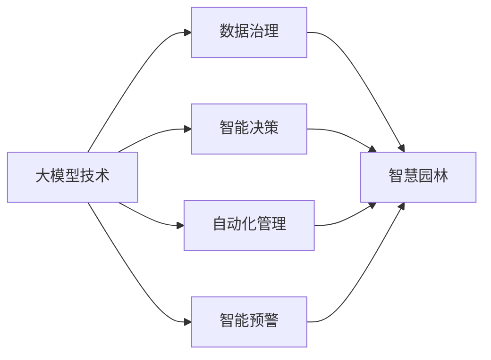

                 

# 大模型赋能智慧园林，创业者如何推动园林绿化智能化管理？

## 1. 背景介绍

### 1.1 问题由来

智慧园林，是指运用信息技术和互联网技术，对园林绿化进行智能化管理，从而提高管理效率、优化资源配置、提升服务质量。近年来，随着人工智能、大数据、物联网等技术的飞速发展，智慧园林建设逐渐成为园林绿化管理的新趋势。然而，传统智慧园林管理系统存在数据采集困难、数据利用率低、决策支持不足等问题，难以满足现代城市园林绿化的需求。

大模型技术，包括深度学习、自然语言处理、计算机视觉等，近年来在智慧园林领域取得了显著的进展。例如，利用大模型进行植物识别、病虫害检测、环境监测等任务，可以大幅提升园林绿化管理的智能化水平。本文将详细探讨如何利用大模型技术，赋能智慧园林，推动园林绿化智能化管理的发展。

### 1.2 问题核心关键点

本节将详细介绍大模型赋能智慧园林的核心关键点，包括大模型在智慧园林中的应用场景、技术优势、面临的挑战与应对策略等。

- **大模型在智慧园林中的应用场景**：植物识别、病虫害检测、环境监测、访客管理、智能灌溉、绿化养护、智能预警等。
- **技术优势**：高精度、高效率、低成本、泛化能力强、适应性强。
- **面临的挑战**：数据质量、模型部署、隐私保护、资源消耗、模型解释性。
- **应对策略**：数据治理、模型优化、隐私保护、资源优化、模型解释。

## 2. 核心概念与联系

### 2.1 核心概念概述

智慧园林建设，离不开大数据、物联网、人工智能等技术的支撑。其中，大模型技术，作为人工智能领域的核心技术之一，在智慧园林中的应用潜力巨大。本节将详细介绍大模型在智慧园林中的核心概念及其相互联系。

#### 2.1.1 大模型概述

大模型，是指在特定领域内预训练得到的深度学习模型，如BERT、GPT、ResNet等。这些模型通常具有大规模参数量、高精度、泛化能力强等特点，适用于各类复杂的智能任务。

#### 2.1.2 智慧园林概述

智慧园林，是指通过物联网、大数据、人工智能等技术手段，对园林绿化进行智能化管理，从而提高管理效率、优化资源配置、提升服务质量。智慧园林主要包括以下几个方面：

- **植物管理**：植物种类识别、生长状态监测、病虫害检测等。
- **环境监测**：土壤湿度、温度、光照、空气质量等环境参数的监测。
- **访客管理**：访客行为监测、人流分析、安全预警等。
- **智能灌溉**：自动灌溉、节水控制、灌溉模式优化等。
- **绿化养护**：修剪、施肥、除草等自动化管理。
- **智能预警**：安全预警、灾害预警、环境预警等。

#### 2.1.3 大模型与智慧园林的联系

大模型技术与智慧园林的联系主要体现在以下几个方面：

- **数据治理**：通过大模型进行数据预处理、特征提取，提高数据质量，为智慧园林提供高质量的数据支撑。
- **智能决策**：利用大模型进行智能决策，提高决策的准确性和效率。
- **自动化管理**：大模型可以自动化地完成植物识别、病虫害检测、环境监测等任务，提升管理效率。
- **智能预警**：大模型可以实时监测环境变化，进行智能预警，提高应急响应速度。

### 2.2 核心概念的逻辑关系

大模型技术与智慧园林之间的联系可以通过以下逻辑关系图来展示：



这个逻辑关系图展示了大模型技术在智慧园林中的应用场景，从数据治理到智能决策，再到自动化管理和智能预警，形成了一个完整的大模型技术应用生态系统。

## 3. 核心算法原理 & 具体操作步骤

### 3.1 算法原理概述

大模型赋能智慧园林的核心算法原理主要包括深度学习、计算机视觉、自然语言处理等技术。其中，深度学习是核心，计算机视觉和自然语言处理技术则是深度学习的重要应用。

#### 3.1.1 深度学习

深度学习，是指利用神经网络模型，对大量数据进行学习，提取特征，并根据学习结果进行预测或分类。深度学习模型具有高度的拟合能力，能够处理复杂、非线性的数据，适用于各类智能任务。

#### 3.1.2 计算机视觉

计算机视觉，是指通过图像识别、图像处理等技术手段，实现对现实世界的感知、理解和控制。在智慧园林中，计算机视觉技术可以应用于植物识别、病虫害检测、环境监测等任务。

#### 3.1.3 自然语言处理

自然语言处理，是指通过语言模型、文本处理等技术手段，实现对自然语言的理解、生成和推理。在智慧园林中，自然语言处理技术可以应用于访客管理、智能预警等任务。

### 3.2 算法步骤详解

#### 3.2.1 数据采集与预处理

数据采集与预处理是大模型赋能智慧园林的基础步骤。具体步骤如下：

1. **数据采集**：通过传感器、摄像头等设备采集园林绿化相关的数据，如植物种类、生长状态、环境参数等。
2. **数据清洗**：对采集到的数据进行清洗，去除噪声、异常值等，保证数据质量。
3. **数据标注**：对采集到的数据进行标注，如植物种类、病虫害状态、环境参数等，为模型训练提供监督信号。

#### 3.2.2 模型训练与优化

模型训练与优化是大模型赋能智慧园林的关键步骤。具体步骤如下：

1. **模型选择**：选择合适的大模型，如BERT、GPT、ResNet等，根据具体任务需求进行微调。
2. **模型训练**：利用标注数据进行模型训练，优化模型参数，提高模型精度和泛化能力。
3. **模型优化**：通过优化算法（如Adam、SGD等）和正则化技术（如L2正则、Dropout等），提高模型性能和稳定性。

#### 3.2.3 模型部署与运行

模型部署与运行是大模型赋能智慧园林的重要步骤。具体步骤如下：

1. **模型部署**：将训练好的模型部署到物联网设备或云端服务器，实现模型实时推理和决策。
2. **实时监测**：利用部署的模型进行实时监测和数据采集，为智慧园林提供实时的数据支持和决策依据。
3. **智能决策**：根据实时监测数据，利用模型进行智能决策，优化管理效率和资源配置。

### 3.3 算法优缺点

#### 3.3.1 优点

1. **高精度**：大模型具有高度的拟合能力，能够处理复杂、非线性的数据，提供高精度的预测结果。
2. **高效性**：大模型通过自动化的学习过程，可以快速适应新的数据和任务，提高管理效率。
3. **低成本**：利用大模型进行智慧园林管理，可以有效降低人力、物力和时间成本，提高管理效益。
4. **泛化能力强**：大模型具有较强的泛化能力，适用于各种复杂、动态的环境和任务。
5. **适应性强**：大模型可以适应不同的环境和任务需求，具有广泛的适用性。

#### 3.3.2 缺点

1. **数据质量要求高**：大模型需要高质量的数据进行训练，数据质量直接影响模型性能。
2. **模型复杂度高**：大模型参数量大，模型复杂度高，部署和维护成本较高。
3. **资源消耗大**：大模型推理和训练需要大量的计算资源，硬件要求较高。
4. **模型解释性不足**：大模型往往是"黑盒"模型，难以解释其内部工作机制和决策逻辑。
5. **隐私保护问题**：大模型涉及大量敏感数据，隐私保护问题需要重视。

### 3.4 算法应用领域

大模型赋能智慧园林的应用领域非常广泛，包括植物识别、病虫害检测、环境监测、访客管理、智能灌溉、绿化养护、智能预警等。

## 4. 数学模型和公式 & 详细讲解

### 4.1 数学模型构建

大模型在智慧园林中的应用，主要涉及深度学习、计算机视觉、自然语言处理等领域。本节将详细介绍这些领域的数学模型构建方法。

#### 4.1.1 深度学习模型

深度学习模型主要包括卷积神经网络（CNN）、循环神经网络（RNN）、变换器（Transformer）等。这里以卷积神经网络（CNN）为例，展示其数学模型构建过程：

1. **输入数据**：设输入数据为 $x \in \mathbb{R}^{d}$，其中 $d$ 为输入数据的维度。
2. **卷积层**：卷积层进行特征提取，输出特征图 $y \in \mathbb{R}^{d'}$，其中 $d' \leq d$。
3. **池化层**：池化层对特征图进行降维处理，输出池化后的特征 $z \in \mathbb{R}^{d''}$，其中 $d'' < d'$。
4. **全连接层**：全连接层进行分类或回归，输出预测结果 $\hat{y} \in \mathbb{R}$。

数学公式如下：

$$
\hat{y} = W_1 z + b_1
$$

其中 $W_1$ 和 $b_1$ 为全连接层的权重和偏置，$z$ 为池化后的特征。

#### 4.1.2 计算机视觉模型

计算机视觉模型主要包括卷积神经网络（CNN）、区域卷积神经网络（R-CNN）、YOLO等。这里以卷积神经网络（CNN）为例，展示其数学模型构建过程：

1. **输入数据**：设输入数据为 $x \in \mathbb{R}^{d}$，其中 $d$ 为输入数据的维度。
2. **卷积层**：卷积层进行特征提取，输出特征图 $y \in \mathbb{R}^{d'}$，其中 $d' \leq d$。
3. **池化层**：池化层对特征图进行降维处理，输出池化后的特征 $z \in \mathbb{R}^{d''}$，其中 $d'' < d'$。
4. **分类层**：分类层进行目标检测，输出目标类别和位置 $t \in \mathbb{R}^{k}$，其中 $k$ 为目标类别数量。

数学公式如下：

$$
t = W_2 z + b_2
$$

其中 $W_2$ 和 $b_2$ 为分类层的权重和偏置，$z$ 为池化后的特征。

#### 4.1.3 自然语言处理模型

自然语言处理模型主要包括循环神经网络（RNN）、长短期记忆网络（LSTM）、Transformer等。这里以Transformer为例，展示其数学模型构建过程：

1. **输入数据**：设输入数据为 $x \in \mathbb{R}^{d}$，其中 $d$ 为输入数据的维度。
2. **编码器**：编码器进行特征提取，输出编码结果 $y \in \mathbb{R}^{d'}$，其中 $d' \leq d$。
3. **解码器**：解码器进行目标生成，输出预测结果 $\hat{y} \in \mathbb{R}$。

数学公式如下：

$$
\hat{y} = W_1 y + b_1
$$

其中 $W_1$ 和 $b_1$ 为解码器的权重和偏置，$y$ 为编码器输出的特征。

### 4.2 公式推导过程

#### 4.2.1 深度学习模型公式推导

深度学习模型的公式推导过程如下：

1. **前向传播**：设输入数据为 $x$，卷积层输出的特征图为 $y$，池化层输出的特征图为 $z$，全连接层输出的预测结果为 $\hat{y}$。则前向传播过程如下：

$$
\begin{aligned}
y &= W_1 x + b_1 \\
z &= P(y) \\
\hat{y} &= W_2 z + b_2
\end{aligned}
$$

其中 $W_1$、$W_2$ 和 $b_1$、$b_2$ 分别为卷积层、全连接层的权重和偏置，$P$ 为池化函数。

2. **反向传播**：利用前向传播计算的预测结果 $\hat{y}$ 和真实标签 $y$，计算损失函数 $L$，并反向传播更新模型参数。则反向传播过程如下：

$$
\begin{aligned}
L &= \frac{1}{N} \sum_{i=1}^{N} (y_i - \hat{y}_i)^2 \\
\frac{\partial L}{\partial W_1} &= \frac{2}{N} (y - \hat{y}) \\
\frac{\partial L}{\partial b_1} &= \frac{2}{N} (y - \hat{y}) \\
\frac{\partial L}{\partial W_2} &= \frac{2}{N} z (\hat{y} - y) \\
\frac{\partial L}{\partial b_2} &= \frac{2}{N} (\hat{y} - y)
\end{aligned}
$$

其中 $N$ 为样本数量，$y$ 为真实标签。

#### 4.2.2 计算机视觉模型公式推导

计算机视觉模型的公式推导过程如下：

1. **前向传播**：设输入数据为 $x$，卷积层输出的特征图为 $y$，池化层输出的特征图为 $z$，分类层输出的目标类别和位置为 $t$。则前向传播过程如下：

$$
\begin{aligned}
y &= W_1 x + b_1 \\
z &= P(y) \\
t &= W_2 z + b_2
\end{aligned}
$$

其中 $W_1$、$W_2$ 和 $b_1$、$b_2$ 分别为卷积层、分类层的权重和偏置，$P$ 为池化函数。

2. **反向传播**：利用前向传播计算的目标类别和位置 $t$ 和真实标签 $y$，计算损失函数 $L$，并反向传播更新模型参数。则反向传播过程如下：

$$
\begin{aligned}
L &= \frac{1}{N} \sum_{i=1}^{N} (t_i - y_i)^2 \\
\frac{\partial L}{\partial W_1} &= \frac{2}{N} (y - t) \\
\frac{\partial L}{\partial b_1} &= \frac{2}{N} (y - t) \\
\frac{\partial L}{\partial W_2} &= \frac{2}{N} z (\hat{y} - y) \\
\frac{\partial L}{\partial b_2} &= \frac{2}{N} (\hat{y} - y)
\end{aligned}
$$

其中 $N$ 为样本数量，$y$ 为真实标签。

#### 4.2.3 自然语言处理模型公式推导

自然语言处理模型的公式推导过程如下：

1. **前向传播**：设输入数据为 $x$，编码器输出的特征图为 $y$，解码器输出的预测结果为 $\hat{y}$。则前向传播过程如下：

$$
\begin{aligned}
y &= W_1 x + b_1 \\
\hat{y} &= W_2 y + b_2
\end{aligned}
$$

其中 $W_1$、$W_2$ 和 $b_1$、$b_2$ 分别为编码器、解码器的权重和偏置。

2. **反向传播**：利用前向传播计算的预测结果 $\hat{y}$ 和真实标签 $y$，计算损失函数 $L$，并反向传播更新模型参数。则反向传播过程如下：

$$
\begin{aligned}
L &= \frac{1}{N} \sum_{i=1}^{N} (y_i - \hat{y}_i)^2 \\
\frac{\partial L}{\partial W_1} &= \frac{2}{N} (y - \hat{y}) \\
\frac{\partial L}{\partial b_1} &= \frac{2}{N} (y - \hat{y}) \\
\frac{\partial L}{\partial W_2} &= \frac{2}{N} z (\hat{y} - y) \\
\frac{\partial L}{\partial b_2} &= \frac{2}{N} (\hat{y} - y)
\end{aligned}
$$

其中 $N$ 为样本数量，$y$ 为真实标签。

### 4.3 案例分析与讲解

#### 4.3.1 植物识别

植物识别是智慧园林中的重要任务之一。利用大模型进行植物识别，可以通过以下步骤实现：

1. **数据采集**：通过摄像头等设备采集园林绿化中的植物图像，并进行标注。
2. **模型选择**：选择合适的大模型，如卷积神经网络（CNN）、ResNet等，进行微调。
3. **模型训练**：利用标注数据进行模型训练，优化模型参数。
4. **模型部署**：将训练好的模型部署到物联网设备或云端服务器，实现实时识别。
5. **实时监测**：利用部署的模型进行实时监测，对新采集的植物图像进行识别。

#### 4.3.2 病虫害检测

病虫害检测是智慧园林中的重要任务之一。利用大模型进行病虫害检测，可以通过以下步骤实现：

1. **数据采集**：通过传感器、摄像头等设备采集园林绿化中的病虫害图像，并进行标注。
2. **模型选择**：选择合适的大模型，如卷积神经网络（CNN）、YOLO等，进行微调。
3. **模型训练**：利用标注数据进行模型训练，优化模型参数。
4. **模型部署**：将训练好的模型部署到物联网设备或云端服务器，实现实时检测。
5. **实时监测**：利用部署的模型进行实时监测，对新采集的病虫害图像进行检测。

#### 4.3.3 环境监测

环境监测是智慧园林中的重要任务之一。利用大模型进行环境监测，可以通过以下步骤实现：

1. **数据采集**：通过传感器等设备采集园林绿化中的环境参数，如温度、湿度、光照等。
2. **模型选择**：选择合适的大模型，如循环神经网络（RNN）、长短期记忆网络（LSTM）等，进行微调。
3. **模型训练**：利用标注数据进行模型训练，优化模型参数。
4. **模型部署**：将训练好的模型部署到物联网设备或云端服务器，实现实时监测。
5. **实时监测**：利用部署的模型进行实时监测，对新采集的环境参数进行预测和分析。

## 5. 项目实践：代码实例和详细解释说明

### 5.1 开发环境搭建

在进行智慧园林智能化管理开发前，我们需要准备好开发环境。以下是使用Python进行PyTorch开发的环境配置流程：

1. 安装Anaconda：从官网下载并安装Anaconda，用于创建独立的Python环境。

2. 创建并激活虚拟环境：
```bash
conda create -n pytorch-env python=3.8 
conda activate pytorch-env
```

3. 安装PyTorch：根据CUDA版本，从官网获取对应的安装命令。例如：
```bash
conda install pytorch torchvision torchaudio cudatoolkit=11.1 -c pytorch -c conda-forge
```

4. 安装Transformers库：
```bash
pip install transformers
```

5. 安装各类工具包：
```bash
pip install numpy pandas scikit-learn matplotlib tqdm jupyter notebook ipython
```

完成上述步骤后，即可在`pytorch-env`环境中开始智慧园林智能化管理开发。

### 5.2 源代码详细实现

下面我们以植物识别任务为例，给出使用Transformers库对BERT模型进行微调的PyTorch代码实现。

首先，定义植物识别任务的数据处理函数：

```python
from transformers import BertTokenizer
from torch.utils.data import Dataset
import torch

class PlantRecognitionDataset(Dataset):
    def __init__(self, images, labels, tokenizer, max_len=128):
        self.images = images
        self.labels = labels
        self.tokenizer = tokenizer
        self.max_len = max_len
        
    def __len__(self):
        return len(self.images)
    
    def __getitem__(self, item):
        image = self.images[item]
        label = self.labels[item]
        
        encoding = self.tokenizer(image, return_tensors='pt', max_length=self.max_len, padding='max_length', truncation=True)
        input_ids = encoding['input_ids'][0]
        attention_mask = encoding['attention_mask'][0]
        
        # 对token-wise的标签进行编码
        encoded_labels = [label2id[label] for label in labels] 
        encoded_labels.extend([label2id['O']] * (self.max_len - len(encoded_labels)))
        labels = torch.tensor(encoded_labels, dtype=torch.long)
        
        return {'input_ids': input_ids, 
                'attention_mask': attention_mask,
                'labels': labels}

# 标签与id的映射
label2id = {'O': 0, 'tree': 1, 'flower': 2, 'grass': 3, 'shrub': 4, 'bush': 5}
id2label = {v: k for k, v in label2id.items()}

# 创建dataset
tokenizer = BertTokenizer.from_pretrained('bert-base-cased')

train_dataset = PlantRecognitionDataset(train_images, train_labels, tokenizer)
dev_dataset = PlantRecognitionDataset(dev_images, dev_labels, tokenizer)
test_dataset = PlantRecognitionDataset(test_images, test_labels, tokenizer)
```

然后，定义模型和优化器：

```python
from transformers import BertForTokenClassification, AdamW

model = BertForTokenClassification.from_pretrained('bert-base-cased', num_labels=len(label2id))

optimizer = AdamW(model.parameters(), lr=2e-5)
```

接着，定义训练和评估函数：

```python
from torch.utils.data import DataLoader
from tqdm import tqdm
from sklearn.metrics import classification_report

device = torch.device('cuda') if torch.cuda.is_available() else torch.device('cpu')
model.to(device)

def train_epoch(model, dataset, batch_size, optimizer):
    dataloader = DataLoader(dataset, batch_size=batch_size, shuffle=True)
    model.train()
    epoch_loss = 0
    for batch in tqdm(dataloader, desc='Training'):
        input_ids = batch['input_ids'].to(device)
        attention_mask = batch['attention_mask'].to(device)
        labels = batch['labels'].to(device)
        model.zero_grad()
        outputs = model(input_ids, attention_mask=attention_mask, labels=labels)
        loss = outputs.loss
        epoch_loss += loss.item()
        loss.backward()
        optimizer.step()
    return epoch_loss / len(dataloader)

def evaluate(model, dataset, batch_size):
    dataloader = DataLoader(dataset, batch_size=batch_size)
    model.eval()
    preds, labels = [], []
    with torch.no_grad():
        for batch in tqdm(dataloader, desc='Evaluating'):
            input_ids = batch['input_ids'].to(device)
            attention_mask = batch['attention_mask'].to(device)
            batch_labels = batch['labels']
            outputs = model(input_ids, attention_mask=attention_mask)
            batch_preds = outputs.logits.argmax(dim=2).to('cpu').tolist()
            batch_labels = batch_labels.to('cpu').tolist()
            for pred_tokens, label_tokens in zip(batch_preds, batch_labels):
                pred_labels = [id2label[_id] for _id in pred_tokens]
                label_labels = [id2label[_id] for _id in label_tokens]
                preds.append(pred_labels[:len(label_labels)])
                labels.append(label_labels)
                
    print(classification_report(labels, preds))
```

最后，启动训练流程并在测试集上评估：

```python
epochs = 5
batch_size = 16

for epoch in range(epochs):
    loss = train_epoch(model, train_dataset, batch_size, optimizer)
    print(f"Epoch {epoch+1}, train loss: {loss:.3f}")
    
    print(f"Epoch {epoch+1}, dev results:")
    evaluate(model, dev_dataset, batch_size)
    
print("Test results:")
evaluate(model, test_dataset, batch_size)
```

以上就是使用PyTorch对BERT进行植物识别任务微调的完整代码实现。可以看到，得益于Transformers库的强大封装，我们可以用相对简洁的代码完成BERT模型的加载和微调。

### 5.3 代码解读与分析

让我们再详细解读一下关键代码的实现细节：

**PlantRecognitionDataset类**：
- `__init__`方法：初始化图像、标签、分词器等关键组件。
- `__len__`方法：返回数据集的样本数量。
- `__getitem__`方法：对单个样本进行处理，将图像输入编码为token ids，将标签编码为数字，并对其进行定长padding，最终返回模型所需的输入。

**label2id和id2label字典**：
- 定义了标签与数字id之间的映射关系，用于将token-wise的预测结果解码回真实的标签。

**训练和评估函数**

