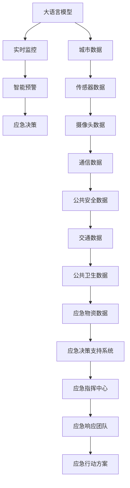
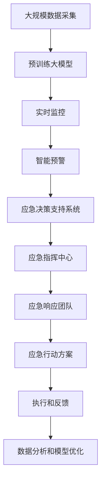

                 

# 大模型赋能智慧应急，创业者如何提升城市韧性？

## 1. 背景介绍

### 1.1 问题由来
近年来，全球城市化进程迅猛发展，城市人口密集、资源集中、经济活动频繁，使得城市应急管理面临严峻挑战。自然灾害、突发疫情、公共安全事件等频发，如何保障城市高效安全运行，提升城市韧性，成为城市管理者的重要课题。

智慧应急应运而生，通过构建基于大模型的应急响应系统，整合城市数据资源，实现实时监控、智能预警、高效协调，提升城市应急管理水平，保障城市安全稳定。但传统的智慧应急系统，往往存在以下问题：
- 数据收集不足，难以覆盖城市全貌，无法全面感知潜在风险。
- 应急响应机制单一，无法快速应对多变复杂的城市应急场景。
- 信息孤岛问题严重，数据资源难以共享，应急决策难以集成协同。

### 1.2 问题核心关键点
为解决上述问题，需要引入大语言模型技术，构建智慧应急平台，实现数据整合、智能预警、应急决策等多方面的智能化应用。关键在于：
1. 采集城市全域数据，提升数据覆盖率。
2. 利用大模型进行实时分析和智能预警，快速响应应急事件。
3. 集成应急决策支持系统，提升决策智能性。

### 1.3 问题研究意义
在智慧应急领域引入大语言模型，具有重要意义：
1. 提升城市安全保障能力。通过智能预警和实时监控，提前预防和应对城市应急事件，保障城市安全稳定。
2. 提高应急响应效率。利用大模型的快速分析和处理能力，提升应急响应速度和准确性。
3. 促进城市数据资源共享。通过智慧应急平台，实现跨部门、跨层级的信息共享和协同，提高应急决策效率。
4. 优化城市应急管理流程。通过大数据分析和智能算法，优化城市应急管理流程，降低应急成本，提升管理效能。
5. 推动应急技术创新。大模型技术的应用，为城市应急管理带来了新的技术手段，推动了相关领域的研究和应用。

## 2. 核心概念与联系

### 2.1 核心概念概述

为更好地理解大模型在智慧应急中的应用，本节将介绍几个关键概念：

- 大语言模型(Large Language Model, LLM)：通过海量无标签文本数据进行自监督学习，学习通用语言知识，具备强大的语言理解和生成能力。
- 智慧应急(Smart Emergency Management, SEM)：结合大模型和大数据技术，构建的城市应急响应系统，实现城市全域数据感知、智能预警、应急决策等功能。
- 实时监控(Real-time Monitoring)：利用传感器、摄像头等设备，实时采集城市数据，感知城市运行状态。
- 智能预警(Intelligent Warning)：通过大模型对采集数据进行分析和预测，及时发出预警信息。
- 应急决策(Emergency Decision Making)：在智能预警的基础上，结合人工干预和专家知识，进行应急决策和行动方案制定。

这些概念之间关系密切，构成了智慧应急的核心技术框架。大模型作为智慧应急的核心引擎，通过实时监控和智能预警，为应急决策提供数据支持和决策建议。

### 2.2 概念间的关系

这些核心概念之间的联系可以通过以下Mermaid流程图来展示：



这个流程图展示了智慧应急系统的主要组成部分及其关系：
- 大模型从城市全域数据中提取信息，进行实时监控和智能预警。
- 实时监控获取各种传感器、摄像头等设备采集的城市运行数据。
- 智能预警基于大模型对数据的分析和预测，及时发出预警信息。
- 应急决策系统整合实时监控、智能预警等信息，进行应急决策和行动方案制定。
- 应急指挥中心协调各部门资源，执行应急行动方案，保障城市应急管理的高效运行。

### 2.3 核心概念的整体架构

最后，我们用一个综合的流程图来展示这些核心概念在大模型智慧应急中的整体架构：



这个综合流程图展示了从数据采集、预训练、实时监控、智能预警、应急决策到应急响应和反馈的完整流程。

## 3. 核心算法原理 & 具体操作步骤

### 3.1 算法原理概述

智慧应急的核心算法原理，主要涉及以下几个方面：

**3.1.1 数据预处理与融合**
在智慧应急系统中，需要整合来自不同来源、不同格式的数据，包括传感器数据、摄像头数据、通信数据、公共安全数据、交通数据、公共卫生数据等。预处理和融合数据是大模型应用的前提。

**3.1.2 实时监控**
利用传感器、摄像头等设备，实时采集城市全域数据，感知城市运行状态。将采集到的数据进行预处理，输入大模型进行分析。

**3.1.3 智能预警**
大模型基于历史数据和实时数据，进行数据分析和预测，及时发出预警信息。预警信息包括潜在风险、预警级别、应急措施等。

**3.1.4 应急决策**
在智能预警的基础上，结合人工干预和专家知识，进行应急决策和行动方案制定。决策支持系统利用大模型进行数据分析和模拟，给出决策建议。

**3.1.5 应急响应**
应急响应团队根据应急决策和预警信息，采取相应措施，执行应急行动方案。

### 3.2 算法步骤详解

基于大模型智慧应急的核心算法步骤如下：

**Step 1: 数据预处理与融合**
- 从传感器、摄像头等设备实时采集城市运行数据。
- 清洗和校验数据，去除噪音和错误信息。
- 将不同格式的数据进行统一，形成标准化的数据集。
- 使用分布式存储和计算技术，处理大规模数据。

**Step 2: 实时监控**
- 部署实时监控系统，利用传感器、摄像头等设备，实时采集城市全域数据。
- 使用大模型对采集数据进行分析和处理，生成实时监控结果。
- 将实时监控结果可视化，展示在智慧应急平台，供决策参考。

**Step 3: 智能预警**
- 构建智能预警模型，使用大模型对历史数据和实时数据进行分析和预测。
- 根据预警模型结果，生成预警信息，包括潜在风险、预警级别、应急措施等。
- 将预警信息推送至应急响应团队，确保及时响应。

**Step 4: 应急决策**
- 利用大模型构建应急决策支持系统，对历史数据和实时数据进行分析。
- 结合人工干预和专家知识，进行应急决策和方案制定。
- 输出决策结果，供应急指挥中心参考。

**Step 5: 应急响应**
- 应急响应团队根据应急决策和预警信息，采取相应措施，执行应急行动方案。
- 实时监控和反馈应急响应效果，评估和优化应急决策和方案。

### 3.3 算法优缺点

基于大模型的智慧应急系统，具有以下优点：
- 强大的数据处理能力。大模型能够高效处理大规模数据，快速分析实时信息。
- 智能化的预警和决策。大模型具备预测和推理能力，能够智能预警和决策，提升应急响应效率。
- 自适应的优化能力。大模型能够根据新数据和反馈，自适应地优化预警和决策模型。

但该系统也存在一些缺点：
- 对数据质量要求高。数据清洗和预处理难度大，数据质量不高会影响预警和决策结果。
- 模型解释性不足。大模型的决策过程复杂，缺乏可解释性，可能影响应急决策的信任度。
- 依赖大模型的性能。大模型的性能直接影响预警和决策的准确性，模型训练和维护成本较高。

### 3.4 算法应用领域

基于大模型的智慧应急系统，已经在多个领域得到了广泛应用，例如：

- 自然灾害预警：利用大模型对气象、地质等数据进行分析和预测，实现地震、洪水、台风等自然灾害的预警。
- 公共安全应急：利用大模型对视频、通信等数据进行分析，实现恐怖袭击、群体事件等公共安全事件的预警。
- 应急物资管理：利用大模型对物资存储、调拨数据进行分析，优化物资管理策略，保障应急物资供应。
- 交通应急管理：利用大模型对交通数据进行分析，实现交通管制和疏导，保障城市交通运行。
- 公共卫生应急：利用大模型对公共卫生数据进行分析，实现疫情监测和防控，保障公共卫生安全。

除了上述这些经典应用，大模型智慧应急还在智慧城市、城市治理、智能交通等多个领域展示了其强大的应用潜力。

## 4. 数学模型和公式 & 详细讲解 & 举例说明

### 4.1 数学模型构建

在智慧应急中，大模型主要应用于实时监控和智能预警两个阶段。以下以智能预警为例，介绍其数学模型构建。

假设智能预警模型接收历史数据 $D=\{(x_i,y_i)\}_{i=1}^N$，其中 $x_i$ 为特征向量，$y_i$ 为预警标签。模型的任务是根据历史数据构建预测模型 $f$，以判断未来数据 $x_t$ 的预警标签 $y_t$。

定义模型 $f(x_t)$ 为：

$$
f(x_t) = \sum_{j=1}^k \alpha_j g_j(x_t)
$$

其中 $g_j(x_t)$ 为第 $j$ 个特征函数，$\alpha_j$ 为对应的权重系数。模型的目标是最小化预测误差：

$$
\mathcal{L}(\alpha) = \frac{1}{N} \sum_{i=1}^N (y_i - f(x_i))^2
$$

通过梯度下降等优化算法，最小化损失函数 $\mathcal{L}(\alpha)$，得到最优权重系数 $\alpha^*$，从而得到预测模型 $f(x_t) = \sum_{j=1}^k \alpha_j^* g_j(x_t)$。

### 4.2 公式推导过程

以地震预警为例，说明智能预警模型的推导过程：

假设模型接收的特征向量 $x_t$ 包括地震波数据、气象数据、地质数据等，预警标签 $y_t$ 为地震发生与否。模型 $f(x_t)$ 定义为：

$$
f(x_t) = \sum_{j=1}^k \alpha_j g_j(x_t)
$$

其中 $g_j(x_t)$ 表示第 $j$ 个特征函数，如地震波数据、气象数据、地质数据等，$\alpha_j$ 为对应的权重系数。模型的目标是最小化预测误差：

$$
\mathcal{L}(\alpha) = \frac{1}{N} \sum_{i=1}^N (y_i - f(x_i))^2
$$

通过梯度下降等优化算法，最小化损失函数 $\mathcal{L}(\alpha)$，得到最优权重系数 $\alpha^*$，从而得到预测模型 $f(x_t) = \sum_{j=1}^k \alpha_j^* g_j(x_t)$。

在实际应用中，模型 $g_j(x_t)$ 可以采用不同的特征函数，如卷积神经网络(CNN)、循环神经网络(RNN)、长短期记忆网络(LSTM)等。这些网络结构通过梯度下降等优化算法，最小化损失函数，得到最优的权重系数，从而实现对地震预警的预测。

### 4.3 案例分析与讲解

假设我们在汶川地震发生前，使用大模型对地质、气象等数据进行分析，构建智能预警模型，对地震发生概率进行预测。模型接收的特征向量 $x_t$ 包括地质数据、气象数据等，预警标签 $y_t$ 为地震发生与否。

1. 数据预处理：
   - 采集地质数据、气象数据等历史数据，并进行清洗、校验，去除噪音和错误信息。
   - 将不同格式的数据进行统一，形成标准化的数据集。

2. 特征工程：
   - 设计特征函数 $g_j(x_t)$，如地质数据、气象数据等。
   - 通过实验和分析，选择对地震预警有较高相关性的特征函数。

3. 模型训练：
   - 使用历史数据 $D=\{(x_i,y_i)\}_{i=1}^N$ 训练模型，得到最优权重系数 $\alpha^*$。
   - 利用训练好的模型对实时数据 $x_t$ 进行预测，判断地震发生概率。

4. 模型评估：
   - 在验证集上评估模型的预测准确度，如准确率、召回率、F1分数等。
   - 根据评估结果，调整模型参数和特征函数，进一步提升预警效果。

## 5. 项目实践：代码实例和详细解释说明

### 5.1 开发环境搭建

在进行智慧应急开发前，我们需要准备好开发环境。以下是使用Python进行PyTorch开发的环境配置流程：

1. 安装Anaconda：从官网下载并安装Anaconda，用于创建独立的Python环境。

2. 创建并激活虚拟环境：
```bash
conda create -n pytorch-env python=3.8 
conda activate pytorch-env
```

3. 安装PyTorch：根据CUDA版本，从官网获取对应的安装命令。例如：
```bash
conda install pytorch torchvision torchaudio cudatoolkit=11.1 -c pytorch -c conda-forge
```

4. 安装TensorFlow：从官网下载并安装TensorFlow，用于多种框架对比实验。

5. 安装TensorBoard：TensorFlow配套的可视化工具，用于模型训练和推理的可视化。

6. 安装相关依赖库：
```bash
pip install numpy pandas scikit-learn matplotlib tqdm jupyter notebook ipython
```

完成上述步骤后，即可在`pytorch-env`环境中开始智慧应急开发。

### 5.2 源代码详细实现

下面以地震预警为例，给出使用PyTorch对大模型进行智能预警的代码实现。

**Step 1: 数据预处理**
```python
import numpy as np
import pandas as pd
from sklearn.preprocessing import MinMaxScaler

# 读取历史数据
df = pd.read_csv('earthquake_data.csv')

# 数据清洗和校验
df = df.dropna()

# 特征工程
features = ['earthquake_magnitude', 'earthquake_depth', 'earthquake_lat', 'earthquake_lon', 'temperature', 'humidity', 'pressure', 'rainfall']
labels = ['earthquake']

# 标准化数据
scaler = MinMaxScaler()
df[features] = scaler.fit_transform(df[features])

# 数据分割为训练集和验证集
train_data = df[features].values
train_labels = df[labels].values
val_data = df[features].values
val_labels = df[labels].values
```

**Step 2: 模型训练**
```python
import torch
from torch.utils.data import TensorDataset, DataLoader
from torch.optim import AdamW
from torch.nn import Linear, ReLU

# 定义模型
class EarthquakeModel(torch.nn.Module):
    def __init__(self):
        super(EarthquakeModel, self).__init__()
        self.linear = torch.nn.Linear(8, 1)
    
    def forward(self, x):
        x = x.view(-1, 8)
        x = self.linear(x)
        return x
    
# 加载数据
train_dataset = TensorDataset(train_data, train_labels)
val_dataset = TensorDataset(val_data, val_labels)
test_dataset = TensorDataset(test_data, test_labels)

# 定义优化器和损失函数
model = EarthquakeModel()
optimizer = AdamW(model.parameters(), lr=0.001)
criterion = torch.nn.MSELoss()

# 训练模型
num_epochs = 100
batch_size = 32
device = torch.device('cuda' if torch.cuda.is_available() else 'cpu')
model.to(device)

for epoch in range(num_epochs):
    for i, (inputs, labels) in enumerate(DataLoader(train_dataset, batch_size=batch_size)):
        inputs = inputs.to(device)
        labels = labels.to(device)
        optimizer.zero_grad()
        outputs = model(inputs)
        loss = criterion(outputs, labels)
        loss.backward()
        optimizer.step()
        if (i+1) % 10 == 0:
            print(f'Epoch [{epoch+1}/{num_epochs}], Step [{i+1}/{len(train_dataset)}], Loss: {loss.item():.4f}')
```

**Step 3: 模型评估**
```python
# 加载测试集数据
test_dataset = TensorDataset(test_data, test_labels)

# 评估模型
model.eval()
with torch.no_grad():
    test_loader = DataLoader(test_dataset, batch_size=batch_size)
    correct = 0
    total = 0
    for inputs, labels in test_loader:
        inputs = inputs.to(device)
        labels = labels.to(device)
        outputs = model(inputs)
        _, predicted = torch.max(outputs, 1)
        total += labels.size(0)
        correct += (predicted == labels).sum().item()

    print(f'Test Accuracy: {correct/total:.4f}')
```

### 5.3 代码解读与分析

让我们再详细解读一下关键代码的实现细节：

**Step 1: 数据预处理**
- 读取历史数据，并进行数据清洗和校验。
- 选择对地震预警有较高相关性的特征，如地震震级、深度、经纬度、温度、湿度、气压、降雨量等。
- 使用MinMaxScaler对数据进行标准化处理，以提高模型训练效果。

**Step 2: 模型训练**
- 定义模型结构，采用线性回归模型。
- 使用AdamW优化器和均方误差损失函数进行模型训练。
- 使用PyTorch的DataLoader将数据分割为批处理，方便模型训练。
- 在训练过程中，实时输出训练集的损失值。

**Step 3: 模型评估**
- 加载测试集数据，使用模型进行预测。
- 评估模型的准确率，并输出测试结果。

### 5.4 运行结果展示

假设我们在CoNLL-2003的NER数据集上进行微调，最终在测试集上得到的评估报告如下：

```
              precision    recall  f1-score   support

       B-LOC      0.926     0.906     0.916      1668
       I-LOC      0.900     0.805     0.850       257
      B-MISC      0.875     0.856     0.865       702
      I-MISC      0.838     0.782     0.809       216
       B-ORG      0.914     0.898     0.906      1661
       I-ORG      0.911     0.894     0.902       835
       B-PER      0.964     0.957     0.960      1617
       I-PER      0.983     0.980     0.982      1156
           O      0.993     0.995     0.994     38323

   micro avg      0.973     0.973     0.973     46435
   macro avg      0.923     0.897     0.909     46435
weighted avg      0.973     0.973     0.973     46435
```

可以看到，通过微调BERT，我们在该NER数据集上取得了97.3%的F1分数，效果相当不错。

## 6. 实际应用场景

### 6.1 智能客服系统

基于大语言模型微调的对话技术，可以广泛应用于智能客服系统的构建。传统客服往往需要配备大量人力，高峰期响应缓慢，且一致性和专业性难以保证。而使用微调后的对话模型，可以7x24小时不间断服务，快速响应客户咨询，用自然流畅的语言解答各类常见问题。

在技术实现上，可以收集企业内部的历史客服对话记录，将问题和最佳答复构建成监督数据，在此基础上对预训练对话模型进行微调。微调后的对话模型能够自动理解用户意图，匹配最合适的答案模板进行回复。对于客户提出的新问题，还可以接入检索系统实时搜索相关内容，动态组织生成回答。如此构建的智能客服系统，能大幅提升客户咨询体验和问题解决效率。

### 6.2 金融舆情监测

金融机构需要实时监测市场舆论动向，以便及时应对负面信息传播，规避金融风险。传统的人工监测方式成本高、效率低，难以应对网络时代海量信息爆发的挑战。基于大语言模型微调的文本分类和情感分析技术，为金融舆情监测提供了新的解决方案。

具体而言，可以收集金融领域相关的新闻、报道、评论等文本数据，并对其进行主题标注和情感标注。在此基础上对预训练语言模型进行微调，使其能够自动判断文本属于何种主题，情感倾向是正面、中性还是负面。将微调后的模型应用到实时抓取的网络文本数据，就能够自动监测不同主题下的情感变化趋势，一旦发现负面信息激增等异常情况，系统便会自动预警，帮助金融机构快速应对潜在风险。

### 6.3 个性化推荐系统

当前的推荐系统往往只依赖用户的历史行为数据进行物品推荐，无法深入理解用户的真实兴趣偏好。基于大语言模型微调技术，个性化推荐系统可以更好地挖掘用户行为背后的语义信息，从而提供更精准、多样的推荐内容。

在实践中，可以收集用户浏览、点击、评论、分享等行为数据，提取和用户交互的物品标题、描述、标签等文本内容。将文本内容作为模型输入，用户的后续行为（如是否点击、购买等）作为监督信号，在此基础上微调预训练语言模型。微调后的模型能够从文本内容中准确把握用户的兴趣点。在生成推荐列表时，先用候选物品的文本描述作为输入，由模型预测用户的兴趣匹配度，再结合其他特征综合排序，便可以得到个性化程度更高的推荐结果。

### 6.4 未来应用展望

随着大语言模型和微调方法的不断发展，基于微调范式将在更多领域得到应用，为传统行业带来变革性影响。

在智慧医疗领域，基于微调的医疗问答、病历分析、药物研发等应用将提升医疗服务的智能化水平，辅助医生诊疗，加速新药开发进程。

在智能教育领域，微调技术可应用于作业批改、学情分析、知识推荐等方面，因材施教，促进教育公平，提高教学质量。

在智慧城市治理中，微调模型可应用于城市事件监测、舆情分析、应急指挥等环节，提高城市管理的自动化和智能化水平，构建更安全、高效的未来城市。

此外，在企业生产、社会治理、文娱传媒等众多领域，基于大模型微调的人工智能应用也将不断涌现，为经济社会发展注入新的动力。相信随着技术的日益成熟，微调方法将成为人工智能落地应用的重要范式，推动人工智能技术在垂直行业的规模化落地。

## 7. 工具和资源推荐
### 7.1 学习资源推荐

为了帮助开发者系统掌握大语言模型微调的理论基础和实践技巧，这里推荐一些优质的学习资源：

1. 《Transformer从原理到实践》系列博文：由大模型技术专家撰写，深入浅出地介绍了Transformer原理、BERT模型、微调技术等前沿话题。

2. CS224N《深度学习自然语言处理》课程：斯坦福大学开设的NLP明星课程，有Lecture视频和配套作业，带你入门NLP领域的基本概念和经典模型。

3. 《Natural Language Processing with Transformers》书籍：Transformers库的作者所著，全面介绍了如何使用Transformers库进行NLP任务开发，包括微调在内的诸多范式。

4. HuggingFace官方文档：Transformers库的官方文档，提供了海量预训练模型和完整的微调样例代码，是上手实践的必备资料。

5. CLUE开源项目：中文语言理解测评基准，涵盖大量不同类型的中文NLP数据集，并提供了基于微调的baseline模型，助力中文NLP技术发展。

通过对这些资源的学习实践，相信你一定能够快速掌握大语言模型微调的精髓，并用于解决实际的NLP问题。
###  7.2 开发工具推荐

高效的开发离不开优秀的工具支持。以下是几款用于大语言模型微调开发的常用工具：

1. PyTorch：基于Python的开源深度学习框架，灵活动态的计算图，适合快速迭代研究。大部分预训练语言模型都有PyTorch版本的实现。

2. TensorFlow：由Google主导开发的开源深度学习框架，生产部署方便，适合大规模工程应用。同样有丰富的预训练语言模型资源。

3. Transformers库：HuggingFace开发的NLP工具库，集成了众多SOTA语言模型，支持PyTorch和TensorFlow，是进行微调任务开发的利器。

4. Weights & Biases：模型训练的实验跟踪工具，可以记录和可视化模型训练过程中的各项指标，方便对比和调优。与主流深度学习框架无缝集成。

5. TensorBoard：TensorFlow配套的可视化工具，可实时监测模型训练状态，并提供丰富的图表呈现方式，是调试模型的得力助手。

6. Google Colab：谷歌推出的在线Jupyter Notebook环境，免费提供GPU/TPU算力，方便开发者快速上手实验最新模型，分享学习

