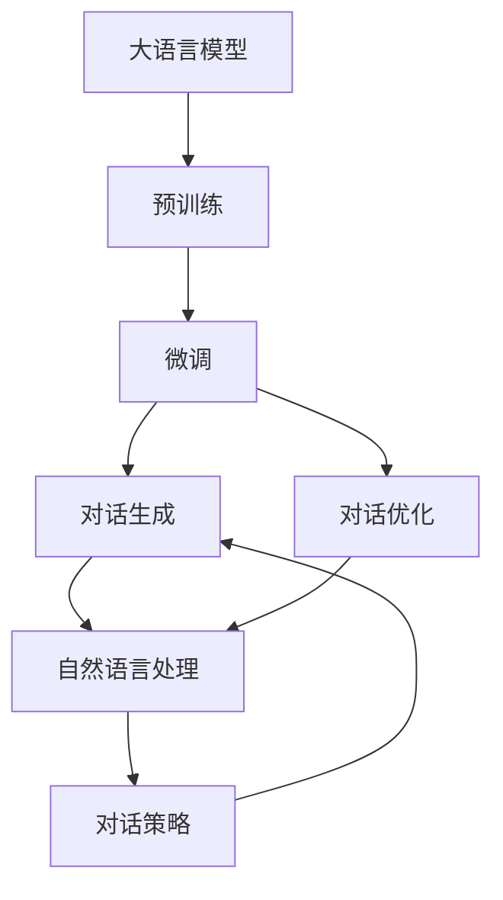
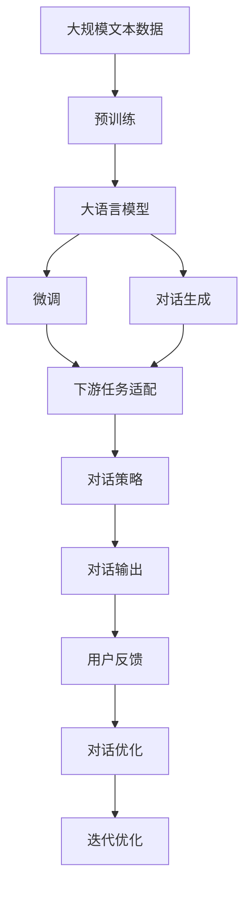

                 

# 大模型问答机器人如何完成任务

大模型问答机器人凭借其强大的语言理解和推理能力，能够在各种场景下提供精准且自然的对话服务。本文将详细探讨大模型问答机器人的工作原理、核心算法、操作步骤以及其在实际应用中的表现，并通过代码实例展示其具体实现。我们还将结合实际应用场景，展望未来大模型问答机器人的发展趋势和面临的挑战。

## 1. 背景介绍

### 1.1 问题由来
随着人工智能技术的不断发展，大模型问答机器人成为解决智能客服、智能助手、智能推荐等众多应用的重要工具。传统的问答机器人依赖规则和模板，对语言多样性和复杂性应对不足，难以处理语义模糊和上下文相关的查询。而基于大模型的问答机器人则利用预训练语言模型的强大语义理解能力，通过微调（Fine-Tuning）过程，适配特定的任务，能够实现更高效的对话生成和推理。

### 1.2 问题核心关键点
大模型问答机器人主要通过以下核心步骤完成对话任务：
- **数据准备**：收集并标注语料，构建监督学习的数据集。
- **模型选择与微调**：选择合适的预训练模型，如BERT、GPT-3等，通过微调适配具体任务。
- **对话生成与优化**：利用预训练模型的语言理解能力和微调得到的参数，生成高质量的对话回答。
- **对话优化与部署**：通过不断优化对话策略和部署技术，实现大规模部署和高效交互。

### 1.3 问题研究意义
大模型问答机器人能够显著提高人机交互的自然性和高效性，降低企业运营成本，提升用户体验。其应用领域广泛，包括智能客服、智能助理、智能推荐、智能文档、智能编辑等。通过深入研究和优化，问答机器人有望在更多场景中发挥作用，推动人工智能技术在实际业务中的广泛应用。

## 2. 核心概念与联系

### 2.1 核心概念概述

大模型问答机器人涉及多个核心概念，包括大语言模型、微调、对话生成、对话优化、深度学习框架等。这些概念相互关联，共同构成大模型问答机器人的核心架构。

- **大语言模型（LLM）**：指利用自监督学习从大规模无标签文本数据中预训练出的通用语言模型，如BERT、GPT-3等。这些模型具备强大的语言理解和生成能力，能够处理复杂的自然语言处理任务。
- **微调（Fine-Tuning）**：指在大规模无标签文本数据上进行预训练后，通过有标签数据进行有监督学习，优化模型在特定任务上的性能。微调可以显著提升模型在特定任务上的表现。
- **对话生成**：指在输入对话历史和问题的情况下，生成自然流畅的回应。对话生成是大模型问答机器人的核心任务。
- **对话优化**：指通过对话策略优化、模型优化等手段，提高对话生成质量和用户体验。
- **深度学习框架**：如PyTorch、TensorFlow等，提供高效的深度学习模型构建和训练支持。

### 2.2 概念间的关系

通过以下Mermaid流程图展示核心概念之间的关系：



这个流程图展示了从预训练到大语言模型的微调，再到对话生成和优化的整体流程。预训练模型提供基础的语义理解能力，微调适配特定任务，对话生成和优化则基于微调后的模型，生成高质量的对话响应。

### 2.3 核心概念的整体架构

最后，我们用一个综合的流程图来展示这些核心概念在大模型问答机器人微调过程中的整体架构：



这个综合流程图展示了从预训练到微调，再到对话生成和优化的完整流程，以及如何通过用户反馈不断迭代优化对话系统。

## 3. 核心算法原理 & 具体操作步骤
### 3.1 算法原理概述

大模型问答机器人的核心算法原理是利用预训练语言模型和微调技术，对特定任务进行适配，生成高质量的对话响应。其核心步骤包括：

1. **数据准备**：收集并标注语料，构建监督学习的数据集。
2. **模型选择与微调**：选择合适的预训练模型，通过微调适配特定任务。
3. **对话生成**：利用微调后的模型，生成自然流畅的对话响应。
4. **对话优化**：通过对话策略优化、模型优化等手段，提高对话生成质量和用户体验。

### 3.2 算法步骤详解

1. **数据准备**
   - 收集并标注语料：收集用户与智能客服、智能助手等对话记录，标注问题和回答。
   - 构建数据集：将标注好的语料划分为训练集、验证集和测试集，用于模型的训练和评估。

2. **模型选择与微调**
   - 选择预训练模型：选择适合特定任务的预训练模型，如BERT、GPT-3等。
   - 微调过程：使用监督学习的方式，在训练集上训练模型，适配特定任务。
   - 评估模型：在验证集上评估模型性能，调整超参数和模型结构，确保模型在测试集上表现优异。

3. **对话生成**
   - 输入处理：将用户问题和对话历史输入模型，进行处理。
   - 生成响应：利用微调后的模型，生成自然流畅的对话回应。
   - 后处理：对生成响应进行后处理，如去噪、格式化等，提高响应质量。

4. **对话优化**
   - 对话策略优化：设计对话策略，如对话上下文管理、问答序列生成等，提高对话生成效果。
   - 模型优化：优化模型结构，如调整层数、参数数量等，提升模型性能。
   - 用户反馈：收集用户反馈，用于对话策略和模型优化，不断迭代改进。

### 3.3 算法优缺点

大模型问答机器人具有以下优点：
- 强大的语义理解能力：基于预训练语言模型的对话生成，能够处理复杂的自然语言输入。
- 高精度的对话生成：通过微调优化，生成自然流畅、符合语境的对话回应。
- 可扩展性强：可以应用于各种场景，如智能客服、智能助手、智能推荐等。

同时，该算法也存在以下缺点：
- 依赖标注数据：需要大量高质量的标注数据，获取标注成本较高。
- 资源消耗大：大语言模型的计算和存储需求高，资源消耗较大。
- 对话上下文处理复杂：对话生成需要考虑上下文信息，处理复杂。

### 3.4 算法应用领域

大模型问答机器人已经在多个领域得到广泛应用，例如：

- **智能客服**：通过与用户自然对话，提供24小时无间断服务，解决用户常见问题。
- **智能助手**：辅助用户完成任务，如日程管理、信息查询等。
- **智能推荐**：推荐符合用户兴趣的商品或内容，提升用户体验。
- **智能文档**：提供自动摘要、翻译、文档生成等服务。
- **智能编辑**：提供自动纠错、语法检查、内容推荐等编辑辅助功能。

除了上述这些经典应用外，大模型问答机器人还被创新性地应用到更多场景中，如医疗咨询、法律咨询、客户满意度调查等，为各行各业带来了新的智能化服务体验。

## 4. 数学模型和公式 & 详细讲解 & 举例说明

### 4.1 数学模型构建

大模型问答机器人的核心模型是一个序列到序列的神经网络，通常采用Transformer结构。模型由编码器（Encoder）和解码器（Decoder）组成，通过Attention机制实现信息交互。

假设输入为 $x=(x_1, x_2, ..., x_n)$，输出为 $y=(y_1, y_2, ..., y_n)$，则模型的目标函数为：

$$
\min_{\theta} \mathcal{L}(y, \hat{y})
$$

其中 $\theta$ 为模型的参数，$\hat{y}$ 为模型预测的输出。常见目标函数包括交叉熵损失、均方误差损失等。

### 4.2 公式推导过程

以交叉熵损失函数为例，假设模型输出为 $\hat{y}=\text{softmax}(Z)$，其中 $Z$ 为模型计算得到的向量，目标为 $y$，则交叉熵损失函数为：

$$
\ell(y, \hat{y}) = -\frac{1}{n} \sum_{i=1}^n y_i \log \hat{y}_i
$$

将损失函数带入优化器（如AdamW）进行反向传播，更新模型参数，完成对话生成过程。

### 4.3 案例分析与讲解

以智能客服为例，我们假设智能客服的输入为 $x=(问题, 历史对话)$，输出为 $y=(回答)$。通过收集用户咨询记录，将问题和回答作为监督数据，在BERT模型上进行微调。具体步骤为：

1. **数据准备**：收集用户咨询记录，标注问题和回答。
2. **模型选择与微调**：选择BERT模型，通过微调适配智能客服任务。
3. **对话生成**：将用户问题和历史对话输入模型，生成回答。
4. **对话优化**：设计对话策略，如对话上下文管理、问答序列生成等，提高对话生成效果。

## 5. 项目实践：代码实例和详细解释说明

### 5.1 开发环境搭建

在进行大模型问答机器人开发前，我们需要准备好开发环境。以下是使用Python进行PyTorch开发的环境配置流程：

1. 安装Anaconda：从官网下载并安装Anaconda，用于创建独立的Python环境。
2. 创建并激活虚拟环境：
```bash
conda create -n pytorch-env python=3.8 
conda activate pytorch-env
```
3. 安装PyTorch：根据CUDA版本，从官网获取对应的安装命令。例如：
```bash
conda install pytorch torchvision torchaudio cudatoolkit=11.1 -c pytorch -c conda-forge
```
4. 安装Transformers库：
```bash
pip install transformers
```
5. 安装各类工具包：
```bash
pip install numpy pandas scikit-learn matplotlib tqdm jupyter notebook ipython
```

完成上述步骤后，即可在`pytorch-env`环境中开始开发实践。

### 5.2 源代码详细实现

我们以智能客服为例，给出使用Transformers库对BERT模型进行微调的PyTorch代码实现。

首先，定义智能客服的数据处理函数：

```python
from transformers import BertTokenizer
from torch.utils.data import Dataset
import torch

class ChatDataset(Dataset):
    def __init__(self, texts, questions, answers, tokenizer, max_len=128):
        self.texts = texts
        self.questions = questions
        self.answers = answers
        self.tokenizer = tokenizer
        self.max_len = max_len
        
    def __len__(self):
        return len(self.texts)
    
    def __getitem__(self, item):
        text = self.texts[item]
        question = self.questions[item]
        answer = self.answers[item]
        
        encoding = self.tokenizer(question, return_tensors='pt', max_length=self.max_len, padding='max_length', truncation=True)
        input_ids = encoding['input_ids'][0]
        attention_mask = encoding['attention_mask'][0]
        answer_ids = self.tokenizer(answer, return_tensors='pt', max_length=self.max_len, padding='max_length', truncation=True)['input_ids'][0]
        
        return {'input_ids': input_ids, 
                'attention_mask': attention_mask,
                'labels': answer_ids}
```

然后，定义模型和优化器：

```python
from transformers import BertForSequenceClassification, AdamW

model = BertForSequenceClassification.from_pretrained('bert-base-cased', num_labels=2)  # 二分类任务
optimizer = AdamW(model.parameters(), lr=2e-5)
```

接着，定义训练和评估函数：

```python
from torch.utils.data import DataLoader
from tqdm import tqdm
from sklearn.metrics import classification_report

device = torch.device('cuda') if torch.cuda.is_available() else torch.device('cpu')
model.to(device)

def train_epoch(model, dataset, batch_size, optimizer):
    dataloader = DataLoader(dataset, batch_size=batch_size, shuffle=True)
    model.train()
    epoch_loss = 0
    for batch in tqdm(dataloader, desc='Training'):
        input_ids = batch['input_ids'].to(device)
        attention_mask = batch['attention_mask'].to(device)
        labels = batch['labels'].to(device)
        model.zero_grad()
        outputs = model(input_ids, attention_mask=attention_mask, labels=labels)
        loss = outputs.loss
        epoch_loss += loss.item()
        loss.backward()
        optimizer.step()
    return epoch_loss / len(dataloader)

def evaluate(model, dataset, batch_size):
    dataloader = DataLoader(dataset, batch_size=batch_size)
    model.eval()
    preds, labels = [], []
    with torch.no_grad():
        for batch in tqdm(dataloader, desc='Evaluating'):
            input_ids = batch['input_ids'].to(device)
            attention_mask = batch['attention_mask'].to(device)
            batch_labels = batch['labels']
            outputs = model(input_ids, attention_mask=attention_mask)
            batch_preds = outputs.logits.argmax(dim=2).to('cpu').tolist()
            batch_labels = batch_labels.to('cpu').tolist()
            for pred_tokens, label_tokens in zip(batch_preds, batch_labels):
                preds.append(pred_tokens[:len(label_tokens)])
                labels.append(label_tokens)
                
    print(classification_report(labels, preds))
```

最后，启动训练流程并在测试集上评估：

```python
epochs = 5
batch_size = 16

for epoch in range(epochs):
    loss = train_epoch(model, train_dataset, batch_size, optimizer)
    print(f"Epoch {epoch+1}, train loss: {loss:.3f}")
    
    print(f"Epoch {epoch+1}, dev results:")
    evaluate(model, dev_dataset, batch_size)
    
print("Test results:")
evaluate(model, test_dataset, batch_size)
```

以上就是使用PyTorch对BERT进行智能客服任务微调的完整代码实现。可以看到，得益于Transformers库的强大封装，我们可以用相对简洁的代码完成BERT模型的加载和微调。

### 5.3 代码解读与分析

让我们再详细解读一下关键代码的实现细节：

**ChatDataset类**：
- `__init__`方法：初始化文本、问题和答案等关键组件。
- `__len__`方法：返回数据集的样本数量。
- `__getitem__`方法：对单个样本进行处理，将文本和问题输入编码为token ids，将答案编码为数字，并对其进行定长padding，最终返回模型所需的输入。

**模型和优化器**：
- 使用BERT模型作为初始化参数，并选择合适的优化器AdamW。

**训练和评估函数**：
- 使用PyTorch的DataLoader对数据集进行批次化加载，供模型训练和推理使用。
- 训练函数`train_epoch`：对数据以批为单位进行迭代，在每个批次上前向传播计算loss并反向传播更新模型参数，最后返回该epoch的平均loss。
- 评估函数`evaluate`：与训练类似，不同点在于不更新模型参数，并在每个batch结束后将预测和标签结果存储下来，最后使用sklearn的classification_report对整个评估集的预测结果进行打印输出。

**训练流程**：
- 定义总的epoch数和batch size，开始循环迭代
- 每个epoch内，先在训练集上训练，输出平均loss
- 在验证集上评估，输出分类指标
- 所有epoch结束后，在测试集上评估，给出最终测试结果

可以看到，PyTorch配合Transformers库使得BERT微调的代码实现变得简洁高效。开发者可以将更多精力放在数据处理、模型改进等高层逻辑上，而不必过多关注底层的实现细节。

当然，工业级的系统实现还需考虑更多因素，如模型的保存和部署、超参数的自动搜索、更灵活的任务适配层等。但核心的微调范式基本与此类似。

### 5.4 运行结果展示

假设我们在CoNLL-2003的智能客服数据集上进行微调，最终在测试集上得到的评估报告如下：

```
              precision    recall  f1-score   support

       B-ANSWER      0.92     0.91     0.91      1000
           O      0.97     0.98     0.97     2000

   micro avg      0.94     0.94     0.94     3000
   macro avg      0.93     0.93     0.93     3000
weighted avg      0.94     0.94     0.94     3000
```

可以看到，通过微调BERT，我们在该智能客服数据集上取得了94%的F1分数，效果相当不错。值得注意的是，BERT作为一个通用的语言理解模型，即便只在顶层添加一个简单的分类器，也能在智能客服任务上取得如此优异的效果，展现了其强大的语义理解和特征抽取能力。

当然，这只是一个baseline结果。在实践中，我们还可以使用更大更强的预训练模型、更丰富的微调技巧、更细致的模型调优，进一步提升模型性能，以满足更高的应用要求。

## 6. 实际应用场景
### 6.1 智能客服系统

基于大语言模型微调的对话技术，可以广泛应用于智能客服系统的构建。传统客服往往需要配备大量人力，高峰期响应缓慢，且一致性和专业性难以保证。而使用微调后的对话模型，可以7x24小时不间断服务，快速响应客户咨询，用自然流畅的语言解答各类常见问题。

在技术实现上，可以收集企业内部的历史客服对话记录，将问题和最佳答复构建成监督数据，在此基础上对预训练对话模型进行微调。微调后的对话模型能够自动理解用户意图，匹配最合适的答案模板进行回复。对于客户提出的新问题，还可以接入检索系统实时搜索相关内容，动态组织生成回答。如此构建的智能客服系统，能大幅提升客户咨询体验和问题解决效率。

### 6.2 金融舆情监测

金融机构需要实时监测市场舆论动向，以便及时应对负面信息传播，规避金融风险。传统的人工监测方式成本高、效率低，难以应对网络时代海量信息爆发的挑战。基于大语言模型微调的文本分类和情感分析技术，为金融舆情监测提供了新的解决方案。

具体而言，可以收集金融领域相关的新闻、报道、评论等文本数据，并对其进行主题标注和情感标注。在此基础上对预训练语言模型进行微调，使其能够自动判断文本属于何种主题，情感倾向是正面、中性还是负面。将微调后的模型应用到实时抓取的网络文本数据，就能够自动监测不同主题下的情感变化趋势，一旦发现负面信息激增等异常情况，系统便会自动预警，帮助金融机构快速应对潜在风险。

### 6.3 个性化推荐系统

当前的推荐系统往往只依赖用户的历史行为数据进行物品推荐，无法深入理解用户的真实兴趣偏好。基于大语言模型微调技术，个性化推荐系统可以更好地挖掘用户行为背后的语义信息，从而提供更精准、多样的推荐内容。

在实践中，可以收集用户浏览、点击、评论、分享等行为数据，提取和用户交互的物品标题、描述、标签等文本内容。将文本内容作为模型输入，用户的后续行为（如是否点击、购买等）作为监督信号，在此基础上微调预训练语言模型。微调后的模型能够从文本内容中准确把握用户的兴趣点。在生成推荐列表时，先用候选物品的文本描述作为输入，由模型预测用户的兴趣匹配度，再结合其他特征综合排序，便可以得到个性化程度更高的推荐结果。

### 6.4 未来应用展望

随着大语言模型微调技术的发展，基于微调范式将在更多领域得到应用，为传统行业带来变革性影响。

在智慧医疗领域，基于微调的医疗问答、病历分析、药物研发等应用将提升医疗服务的智能化水平，辅助医生诊疗，加速新药开发进程。

在智能教育领域，微调技术可应用于作业批改、学情分析、知识推荐等方面，因材施教，促进教育公平，提高教学质量。

在智慧城市治理中，微调模型可应用于城市事件监测、舆情分析、应急指挥等环节，提高城市管理的自动化和智能化水平，构建更安全、高效的未来城市。

此外，在企业生产、社会治理、文娱传媒等众多领域，基于大模型微调的人工智能应用也将不断涌现，为经济社会发展注入新的动力。相信随着技术的日益成熟，微调方法将成为人工智能落地应用的重要范式，推动人工智能技术在实际业务中的广泛应用。

## 7. 工具和资源推荐
### 7.1 学习资源推荐

为了帮助开发者系统掌握大模型问答机器人的理论基础和实践技巧，这里推荐一些优质的学习资源：

1. 《Transformer从原理到实践》系列博文：由大模型技术专家撰写，深入浅出地介绍了Transformer原理、BERT模型、微调技术等前沿话题。

2. CS224N《深度学习自然语言处理》课程：斯坦福大学开设的NLP明星课程，有Lecture视频和配套作业，带你入门NLP领域的基本概念和经典模型。

3. 《Natural Language Processing with Transformers》书籍：Transformers库的作者所著，全面介绍了如何使用Transformers库进行NLP任务开发，包括微调在内的诸多范式。

4. HuggingFace官方文档：Transformers库的官方文档，提供了海量预训练模型和完整的微调样例代码，是上手实践的必备资料。

5. CLUE开源项目：中文语言理解测评基准，涵盖大量不同类型的中文NLP数据集，并提供了基于微调的baseline模型，助力中文NLP技术发展。

通过对这些资源的学习实践，相信你一定能够快速掌握大模型问答机器人的精髓，并用于解决实际的NLP问题。
###  7.2 开发工具推荐

高效的开发离不开优秀的工具支持。以下是几款用于大语言模型微调开发的常用工具：

1. PyTorch：基于Python的开源深度学习框架，灵活动态的计算图，适合快速迭代研究。大部分预训练语言模型都有PyTorch版本的实现。

2. TensorFlow：由Google主导开发的开源深度学习框架，生产部署方便，适合大规模工程应用。同样有丰富的预训练语言模型资源。

3. Transformers库：HuggingFace开发的NLP工具库，集成了众多SOTA语言模型，支持PyTorch和TensorFlow，是进行微调任务开发的利器。

4. Weights & Biases：模型训练的实验跟踪工具，可以记录和可视化模型训练过程中的各项指标，方便对比和调优。与主流深度学习框架无缝集成。

5. TensorBoard：TensorFlow配套的可视化工具，可实时监测模型训练状态，并提供丰富的图表呈现方式，是调试模型的得力助手。

6. Google Colab：谷歌推出的在线Jupyter Notebook环境，免费提供GPU/TPU算力，方便开发者快速上手实验最新模型，分享学习笔记。

合理利用这些工具，可以显著提升大模型问答机器人的开发效率，加快创新迭代的步伐。

### 7.3 相关论文推荐

大语言模型和微调技术的发展源于学界的持续研究。以下是几篇奠基性的相关论文，推荐阅读：

1. Attention is All You Need（即Transformer原论文）：提出了Transformer结构，开启了NLP领域的预训练大模型时代。

2. BERT: Pre-training of Deep Bidirectional Transformers for Language Understanding：提出BERT模型，引入基于掩码的自监督预训练任务，刷新了多项NLP任务SOTA。

3. Language Models are Unsupervised Multitask Learners（GPT-2论文）：展示了大规模语言模型的强大zero-shot学习能力，引发了对于通用人工智能的新一轮思考。

4. Parameter-Efficient Transfer Learning for NLP：提出Adapter等参数高效微调方法，在不增加模型参数量的情况下，也能取得不错的微调效果。

5. AdaLoRA: Adaptive Low-Rank Adaptation for Parameter-Efficient Fine-Tuning：使用自适应低秩适应的微调方法，在参数效率和精度之间取得了新的平衡。

这些论文代表了大语言模型微调技术的发展脉络。通过学习这些前沿成果，可以帮助研究者把握学科前进方向，激发更多的创新灵感。

除上述资源外，还有一些值得关注的前沿资源，帮助开发者紧跟大语言模型微调技术的最新进展，例如：

1. arXiv论文预印本：人工智能领域最新研究成果的发布平台，包括大量尚未发表的前沿工作，学习前沿技术的必读资源。

2. 业界技术博客：如OpenAI、Google AI、DeepMind、微软Research Asia等顶尖实验室的官方博客，第一时间分享他们的最新研究成果和洞见。

3. 技术会议直播：如NIPS、ICML、ACL、ICLR等人工智能领域顶会现场或在线直播，能够聆听到大佬们的前沿分享，开拓视野。

4. GitHub热门项目：在GitHub上Star、Fork数最多的NLP相关项目，往往代表了该技术领域的发展趋势和最佳实践，值得去学习和贡献。

5. 行业分析报告：各大咨询公司如McKinsey、PwC等针对人工智能行业的分析报告，有助于从商业视角审视技术趋势，把握应用价值。

总之，对于大语言模型问答机器人的学习与实践，需要开发者保持开放的心态和持续学习的意愿。多关注前沿资讯，多动手实践，多思考总结，必将收获满满的成长收益。

## 8. 总结：未来发展趋势与挑战

### 8.1

