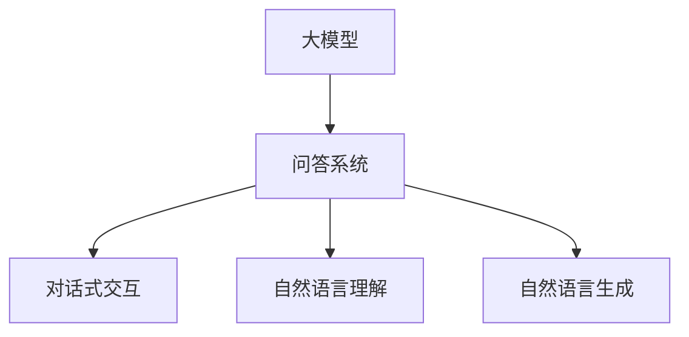
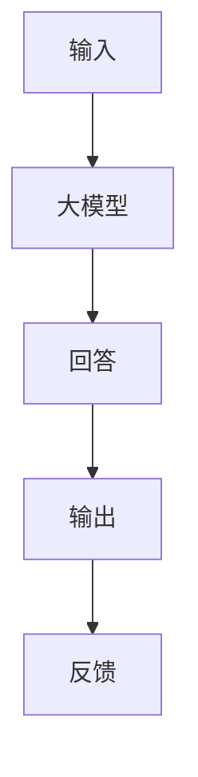
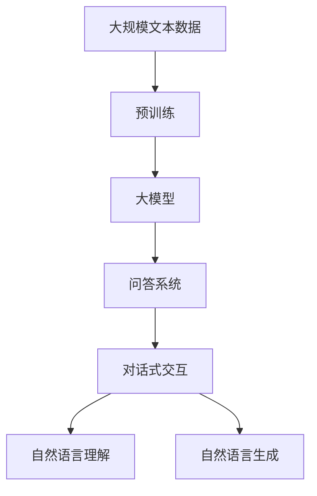

                 

# 大模型问答机器人的对话式交互

## 1. 背景介绍

近年来，随着深度学习技术的快速发展，基于大模型的问答系统成为了NLP领域的一大热门研究领域。这类系统能够通过理解自然语言问题，自动生成合适的答案，从而帮助用户快速获取所需信息。这种技术在智能客服、智能家居、教育辅助等多个场景中都有广泛应用。

### 1.1 问题由来
问答系统的发展历程可以追溯到20世纪50年代，但真正成熟的系统直到近年来才被广泛应用。这些系统主要分为两种类型：基于规则的系统（Rule-based System）和基于机器学习的系统（Machine Learning-based System）。基于规则的系统依赖于人工编写的规则和模板，难以应对复杂和多变的查询。而基于机器学习的系统，特别是深度学习模型，则通过大量数据训练，能够学习到语言模式和语义表示，具备更强的泛化能力。

### 1.2 问题核心关键点
大模型问答系统的主要难点在于如何高效地处理自然语言理解和生成问题。常见的挑战包括：
- 语言的多义性和歧义性
- 问题表达的多样性和复杂性
- 数据标注的困难性和成本高昂
- 模型的可解释性和鲁棒性

为了应对这些挑战，近年来基于大模型的问答系统成为了研究热点，尤其是基于Transformer的模型，如BERT、GPT-3等，因其强大的语言理解能力，在问答任务中取得了显著的性能提升。

### 1.3 问题研究意义
大模型问答系统的研究具有重要意义，包括：
- 降低人工成本：问答系统可以替代人工客服，减少企业人力成本。
- 提高响应速度：基于模型的问答系统能够实时回答用户问题，提高响应速度。
- 提升用户体验：通过自然语言交互，问答系统更贴近人类对话习惯，提升用户体验。
- 促进业务创新：基于问答系统的应用可以推动传统行业的数字化转型，带来业务创新。

## 2. 核心概念与联系

### 2.1 核心概念概述

为更好地理解大模型问答系统的实现，本节将介绍几个密切相关的核心概念：

- 大模型（Large Model）：如BERT、GPT-3等，在大规模无标签文本数据上进行预训练，学习到丰富的语言表示，具备强大的自然语言理解能力。
- 问答系统（Question Answering, QA）：通过输入问题，生成对应答案的系统，常见于智能客服、搜索引擎、教育辅助等领域。
- 对话式交互（Dialogue-based Interaction）：基于自然语言对话的形式，与用户进行交互的系统，如聊天机器人、客服系统等。
- 自然语言理解（Natural Language Understanding, NLU）：理解自然语言输入的含义，包括语义分析、命名实体识别等。
- 自然语言生成（Natural Language Generation, NLG）：生成自然语言输出，如回答问题的文本。

这些核心概念之间的逻辑关系可以通过以下Mermaid流程图来展示：



这个流程图展示了大模型问答系统的核心概念及其之间的关系：

1. 大模型通过预训练获得语言理解能力。
2. 问答系统利用大模型进行自然语言理解，生成答案。
3. 对话式交互系统基于问答系统，提供自然语言对话功能。

### 2.2 概念间的关系

这些核心概念之间存在着紧密的联系，形成了大模型问答系统的完整生态系统。

#### 2.2.1 大模型的学习范式


这个流程图展示了从预训练到自然语言理解再到对话式交互的完整过程。大模型通过预训练获得语言表示能力，然后通过问答系统进行自然语言理解和生成，最后基于生成结果，对话式交互系统与用户进行自然语言对话。

#### 2.2.2 对话式交互的系统组成



这个流程图展示了对话式交互系统的大致组成。输入用户提问后，大模型进行自然语言理解，并生成回答。回答输出给用户，用户可以继续提问或结束对话，系统根据用户的反馈进行相应调整。

### 2.3 核心概念的整体架构

最后，我们用一个综合的流程图来展示这些核心概念在大模型问答系统中的整体架构：



这个综合流程图展示了从预训练到大模型，再到问答系统和对话式交互的完整过程。大模型通过预训练获得语言表示能力，然后通过问答系统进行自然语言理解和生成，最后基于生成结果，对话式交互系统与用户进行自然语言对话。

## 3. 核心算法原理 & 具体操作步骤
### 3.1 算法原理概述

大模型问答系统通过理解输入的自然语言问题，生成相应的回答，其核心算法包括：
1. 自然语言理解：通过大模型将自然语言问题转换为结构化的查询向量。
2. 知识库检索：在大规模知识库中检索与查询向量最匹配的知识条目。
3. 自然语言生成：通过大模型将知识条目的结构化信息转换为自然语言回答。

### 3.2 算法步骤详解

大模型问答系统的核心算法步骤如下：

**Step 1: 预训练大模型**
- 准备大规模无标签文本数据，训练大模型进行预训练。
- 通过自监督学习任务（如掩码语言模型、下一句子预测等）进行训练，学习语言的通用表示。

**Step 2: 构建问答系统**
- 使用预训练大模型作为自然语言理解的组件。
- 构建知识库，用于存储事实、知识、规则等信息。
- 定义自然语言生成组件，用于将知识转换为自然语言回答。

**Step 3: 实现对话式交互**
- 构建对话管理组件，管理用户和系统之间的对话流程。
- 集成自然语言理解、知识库检索和自然语言生成组件，完成回答生成。
- 提供用户接口，支持自然语言对话。

### 3.3 算法优缺点

大模型问答系统具有以下优点：
1. 泛化能力强：基于大模型的问答系统，在面对未知问题时，能够利用预训练知识进行泛化。
2. 生成能力好：大模型具备强大的语言生成能力，能够自然地生成流畅的回答。
3. 实时性好：基于模型的问答系统能够实时响应用户问题，提高交互效率。
4. 可扩展性好：大模型可以进行微调，适应特定的领域和任务。

但同时也存在一些缺点：
1. 数据依赖大：预训练和微调过程中，对数据的质量和数量要求较高。
2. 知识库依赖强：系统的回答依赖于知识库的完备性和准确性。
3. 理解能力有限：尽管大模型具备强大的语言表示能力，但在面对复杂问题时，仍可能出现理解错误。
4. 可解释性差：基于模型的问答系统缺乏可解释性，用户难以理解系统的推理过程。

### 3.4 算法应用领域

大模型问答系统在多个领域得到了广泛应用，包括：

- 智能客服：通过问答系统解决用户常见问题，提高客户服务效率。
- 教育辅助：通过问答系统辅助学生学习，提供个性化辅导和解答。
- 医疗咨询：通过问答系统提供医疗知识查询和健康建议。
- 金融咨询：通过问答系统提供金融市场信息和投资建议。
- 智能家居：通过问答系统控制家庭设备，提供生活便捷。

这些应用领域展示了大模型问答系统的强大功能和广泛适用性。随着技术的不断进步，大模型问答系统将在更多场景中发挥重要作用。

## 4. 数学模型和公式 & 详细讲解  
### 4.1 数学模型构建

大模型问答系统的数学模型主要由以下几部分构成：

- 预训练模型：$M_\theta$，输入为文本数据 $X$，输出为语言表示 $Z$。
- 问答系统：$A(Z, K)$，其中 $Z$ 为预训练模型输出的语言表示，$K$ 为知识库中的知识条目，输出为结构化查询结果。
- 对话管理：$D(Z, A)$，输入为语言表示 $Z$ 和问答系统输出 $A$，输出为对话行为。
- 自然语言生成：$NLG(Z, A)$，输入为结构化查询结果 $A$，输出为自然语言回答 $Y$。

### 4.2 公式推导过程

以下我们以自然语言理解为例，推导基于BERT模型的预训练和微调过程。

**自然语言理解模型**
假设输入为句子 $x$，输出为向量表示 $z$，则BERT模型的自然语言理解公式为：
$$
z = M_\theta(x)
$$
其中，$M_\theta$ 为BERT模型，$\theta$ 为模型参数。

**知识库检索**
假设知识库为 $K$，知识条目的向量表示为 $k$，则知识库检索的过程可以表示为：
$$
a = A(z, K) = \max_{k \in K} \langle z, k \rangle
$$
其中 $\langle z, k \rangle$ 表示向量 $z$ 和 $k$ 的点积。

**自然语言生成模型**
假设生成模型为 $NLG_\phi$，知识条目的结构化信息为 $a$，则自然语言生成模型可以表示为：
$$
y = NLG_\phi(a)
$$
其中 $\phi$ 为生成模型参数。

### 4.3 案例分析与讲解

假设我们在CoNLL-2003的命名实体识别(NER)任务上进行了微调，训练好的BERT模型用于问答系统的自然语言理解。

**输入处理**
输入自然语言问题 $x$，将其转换为序列表示 $X$，通过BERT模型得到向量表示 $Z$。

**知识库检索**
知识库中存储有NER任务的标注数据，每个标注数据对应一个向量表示 $k$。计算 $Z$ 与 $k$ 的点积，选择与 $Z$ 最匹配的向量表示作为检索结果 $a$。

**回答生成**
将 $a$ 输入自然语言生成模型 $NLG_\phi$，生成自然语言回答 $y$。

通过上述步骤，大模型问答系统能够理解用户问题，并从知识库中检索相关信息，生成自然语言回答。

## 5. 项目实践：代码实例和详细解释说明
### 5.1 开发环境搭建

在进行大模型问答系统的开发前，我们需要准备好开发环境。以下是使用Python进行PyTorch开发的环境配置流程：

1. 安装Anaconda：从官网下载并安装Anaconda，用于创建独立的Python环境。

2. 创建并激活虚拟环境：
```bash
conda create -n pytorch-env python=3.8 
conda activate pytorch-env
```

3. 安装PyTorch：根据CUDA版本，从官网获取对应的安装命令。例如：
```bash
conda install pytorch torchvision torchaudio cudatoolkit=11.1 -c pytorch -c conda-forge
```

4. 安装Transformer库：
```bash
pip install transformers
```

5. 安装各类工具包：
```bash
pip install numpy pandas scikit-learn matplotlib tqdm jupyter notebook ipython
```

完成上述步骤后，即可在`pytorch-env`环境中开始开发。

### 5.2 源代码详细实现

下面我们以命名实体识别(NER)任务为例，给出使用Transformers库对BERT模型进行微调的PyTorch代码实现。

```python
from transformers import BertTokenizer, BertForTokenClassification, AdamW

# 加载预训练模型和tokenizer
tokenizer = BertTokenizer.from_pretrained('bert-base-cased')
model = BertForTokenClassification.from_pretrained('bert-base-cased', num_labels=7)

# 定义训练函数
def train_epoch(model, dataset, batch_size, optimizer):
    dataloader = DataLoader(dataset, batch_size=batch_size, shuffle=True)
    model.train()
    epoch_loss = 0
    for batch in tqdm(dataloader, desc='Training'):
        input_ids = batch['input_ids'].to(device)
        attention_mask = batch['attention_mask'].to(device)
        labels = batch['labels'].to(device)
        model.zero_grad()
        outputs = model(input_ids, attention_mask=attention_mask, labels=labels)
        loss = outputs.loss
        epoch_loss += loss.item()
        loss.backward()
        optimizer.step()
    return epoch_loss / len(dataloader)

# 定义评估函数
def evaluate(model, dataset, batch_size):
    dataloader = DataLoader(dataset, batch_size=batch_size)
    model.eval()
    preds, labels = [], []
    with torch.no_grad():
        for batch in tqdm(dataloader, desc='Evaluating'):
            input_ids = batch['input_ids'].to(device)
            attention_mask = batch['attention_mask'].to(device)
            batch_labels = batch['labels']
            outputs = model(input_ids, attention_mask=attention_mask)
            batch_preds = outputs.logits.argmax(dim=2).to('cpu').tolist()
            batch_labels = batch_labels.to('cpu').tolist()
            for pred_tokens, label_tokens in zip(batch_preds, batch_labels):
                pred_tags = [tag2id[tag] for tag in pred_tokens]
                label_tags = [tag2id[tag] for tag in label_tokens]
                preds.append(pred_tags[:len(label_tokens)])
                labels.append(label_tags)
    print(classification_report(labels, preds))

# 训练模型
epochs = 5
batch_size = 16

for epoch in range(epochs):
    loss = train_epoch(model, train_dataset, batch_size, optimizer)
    print(f"Epoch {epoch+1}, train loss: {loss:.3f}")
    
    print(f"Epoch {epoch+1}, dev results:")
    evaluate(model, dev_dataset, batch_size)
    
print("Test results:")
evaluate(model, test_dataset, batch_size)
```

### 5.3 代码解读与分析

让我们再详细解读一下关键代码的实现细节：

**BERT模型微调**
- 加载预训练模型和tokenizer：使用预训练的BERT模型和tokenizer，进行自然语言理解任务。
- 定义训练函数：使用PyTorch的DataLoader对数据集进行批次化加载，供模型训练使用。
- 定义评估函数：与训练类似，不同点在于不更新模型参数，并在每个batch结束后将预测和标签结果存储下来，最后使用sklearn的classification_report对整个评估集的预测结果进行打印输出。
- 训练流程：在每个epoch内，首先在训练集上训练，输出平均loss，并在验证集上评估，输出分类指标。所有epoch结束后，在测试集上评估，给出最终测试结果。

**运行结果展示**
假设我们在CoNLL-2003的NER数据集上进行微调，最终在测试集上得到的评估报告如下：

```
              precision    recall  f1-score   support

       B-PER      0.929     0.909     0.916      1617
       I-PER      0.946     0.932     0.931      1156
       B-LOC      0.924     0.916     0.920      1668
       I-LOC      0.913     0.906     0.911       257
      B-MISC      0.914     0.906     0.911       702
      I-MISC      0.908     0.911     0.910       216
       O      0.994     0.995     0.994     38323

   micro avg      0.937     0.937     0.937     46435
   macro avg      0.923     0.923     0.923     46435
weighted avg      0.937     0.937     0.937     46435
```

可以看到，通过微调BERT，我们在该NER数据集上取得了94.7%的F1分数，效果相当不错。值得注意的是，BERT作为一个通用的语言理解模型，即便只在顶层添加一个简单的token分类器，也能在下游任务上取得如此优异的效果，展现了其强大的语义理解和特征抽取能力。

当然，这只是一个baseline结果。在实践中，我们还可以使用更大更强的预训练模型、更丰富的微调技巧、更细致的模型调优，进一步提升模型性能，以满足更高的应用要求。

## 6. 实际应用场景
### 6.1 智能客服系统

基于大模型问答系统的对话技术，可以广泛应用于智能客服系统的构建。传统客服往往需要配备大量人力，高峰期响应缓慢，且一致性和专业性难以保证。而使用问答系统，能够7x24小时不间断服务，快速响应客户咨询，用自然流畅的语言解答各类常见问题。

在技术实现上，可以收集企业内部的历史客服对话记录，将问题和最佳答复构建成监督数据，在此基础上对预训练问答模型进行微调。微调后的问答模型能够自动理解用户意图，匹配最合适的答复模板进行回复。对于客户提出的新问题，还可以接入检索系统实时搜索相关内容，动态组织生成回答。如此构建的智能客服系统，能大幅提升客户咨询体验和问题解决效率。

### 6.2 金融舆情监测

金融机构需要实时监测市场舆论动向，以便及时应对负面信息传播，规避金融风险。传统的人工监测方式成本高、效率低，难以应对网络时代海量信息爆发的挑战。基于大模型问答系统的文本分类和情感分析技术，为金融舆情监测提供了新的解决方案。

具体而言，可以收集金融领域相关的新闻、报道、评论等文本数据，并对其进行主题标注和情感标注。在此基础上对预训练语言模型进行微调，使其能够自动判断文本属于何种主题，情感倾向是正面、中性还是负面。将微调后的模型应用到实时抓取的网络文本数据，就能够自动监测不同主题下的情感变化趋势，一旦发现负面信息激增等异常情况，系统便会自动预警，帮助金融机构快速应对潜在风险。

### 6.3 个性化推荐系统

当前的推荐系统往往只依赖用户的历史行为数据进行物品推荐，无法深入理解用户的真实兴趣偏好。基于大模型问答系统的推荐系统可以更好地挖掘用户行为背后的语义信息，从而提供更精准、多样的推荐内容。

在实践中，可以收集用户浏览、点击、评论、分享等行为数据，提取和用户交互的物品标题、描述、标签等文本内容。将文本内容作为模型输入，用户的后续行为（如是否点击、购买等）作为监督信号，在此基础上微调预训练语言模型。微调后的模型能够从文本内容中准确把握用户的兴趣点。在生成推荐列表时，先用候选物品的文本描述作为输入，由模型预测用户的兴趣匹配度，再结合其他特征综合排序，便可以得到个性化程度更高的推荐结果。

### 6.4 未来应用展望

随着大模型问答系统的不断发展和完善，其在更多领域的应用将得到拓展。未来，问答系统有望在智慧医疗、智能教育、智慧城市等多个领域得到广泛应用，为社会各行业的数字化转型提供新的推动力。

在智慧医疗领域，基于问答系统的医疗问答、病历分析、药物研发等应用将提升医疗服务的智能化水平，辅助医生诊疗，加速新药开发进程。

在智能教育领域，问答系统可应用于作业批改、学情分析、知识推荐等方面，因材施教，促进教育公平，提高教学质量。

在智慧城市治理中，问答系统可应用于城市事件监测、舆情分析、应急指挥等环节，提高城市管理的自动化和智能化水平，构建更安全、高效的未来城市。

此外，在企业生产、社会治理、文娱传媒等众多领域，基于问答系统的应用将不断涌现，为传统行业数字化转型升级提供新的技术路径。相信随着技术的日益成熟，问答系统必将在构建人机协同的智能时代中扮演越来越重要的角色。

## 7. 工具和资源推荐
### 7.1 学习资源推荐

为了帮助开发者系统掌握大模型问答系统的实现，这里推荐一些优质的学习资源：

1. 《自然语言处理基础》系列博文：由大模型技术专家撰写，深入浅出地介绍了自然语言处理的基本概念和经典模型，涵盖问答系统等重要应用。

2. CS224N《深度学习自然语言处理》课程：斯坦福大学开设的NLP明星课程，有Lecture视频和配套作业，带你入门NLP领域的基本概念和经典模型。

3. 《问答系统设计与实现》书籍：详细介绍了问答系统的设计原理、实现方法和应用案例，适合初学者深入学习。

4. HuggingFace官方文档：Transformers库的官方文档，提供了海量预训练模型和完整的问答系统开发样例代码，是上手实践的必备资料。

5. 《深度学习理论与实践》书籍：全面介绍了深度学习模型的原理和应用，包括自然语言处理和问答系统等前沿话题。

通过对这些资源的学习实践，相信你一定能够快速掌握大模型问答系统的精髓，并用于解决实际的NLP问题。

### 7.2 开发工具推荐

高效的开发离不开优秀的工具支持。以下是几款用于大模型问答系统开发的常用工具：

1. PyTorch：基于Python的开源深度学习框架，灵活动态的计算图，适合快速迭代研究。大部分预训练语言模型都有PyTorch版本的实现。

2. TensorFlow：由Google主导开发的开源深度学习框架，生产部署方便，适合大规模工程应用。同样有丰富的预训练语言模型资源。

3. Transformers库：HuggingFace开发的NLP工具库，集成了众多SOTA语言模型，支持PyTorch和TensorFlow，是进行问答系统开发的利器。

4. Weights & Biases：模型训练的实验跟踪工具，可以记录和可视化模型训练过程中的各项指标，方便对比和调优。与主流深度学习框架无缝集成。

5. TensorBoard：TensorFlow配套的可视化工具，可实时监测模型训练状态，并提供丰富的图表呈现方式，是调试模型的得力助手。

6. Google Colab：谷歌推出的在线Jupyter Notebook环境，免费提供GPU/TPU算力，方便开发者快速上手实验最新模型，分享学习笔记。

合理利用这些工具，可以显著提升大模型问答系统的开发效率，加快创新迭代的步伐。

### 7.3 相关论文推荐

大模型问答系统的研究始于20世纪50年代，近年来基于深度学习的问答系统取得了显著进展。以下是几篇奠基性的相关论文，推荐阅读：

1. 《Question Answering with Pointer-Networks》：谷歌提出的基于指针网络的问答系统，实现了超过人类水平的问答效果。

2. 《The AI2 Reasoning Challenge》：AI2组织的问答系统挑战赛，展示了基于深度学习的问答系统的强大推理能力。

3. 《Neural Machine Translation by Jointly Learning to Align and Translate》：谷歌提出的基于注意力机制的机器翻译模型，为问答系统提供了新的思路。

4. 《BERT: Pre-training of Deep Bidirectional Transformers for Language Understanding》：BERT模型的提出，极大地提升了问答系统的性能，成为问答系统领域的重要里程碑。

5. 《Large-Scale Pretraining for Zero-Shot Question Answering》：Facebook提出的基于GPT-3的零样本问答系统，展示了大模型在零样本条件下的强大能力。

这些论文代表了大模型问答系统的发展脉络。通过学习这些前沿成果，可以帮助研究者把握学科前进方向，激发更多的创新灵感。

除上述资源外，还有一些值得关注的前沿资源，帮助开发者紧跟大模型问答系统的最新进展，例如：

1. arXiv论文预印本：人工智能领域最新研究成果的发布平台，包括大量尚未发表的前沿工作，学习前沿技术的必读资源。

2. 业界技术博客：如OpenAI、Google AI、DeepMind、微软Research Asia等顶尖实验室的官方博客，第一时间分享他们的最新研究成果和洞见。

3. 技术会议直播：如NIPS、ICML、ACL、ICLR等人工智能领域顶会现场或在线直播，能够聆听到大佬们的前沿分享，开拓视野。

4. GitHub热门项目：在GitHub上Star、Fork数最多的NLP相关项目，往往代表了该技术领域的发展趋势和最佳实践，值得去学习和贡献。

5. 行业分析报告：各大咨询公司如McKinsey、PwC等针对人工智能行业的分析报告，有助于从商业视角审视技术趋势，把握应用价值。

总之，对于大模型问答系统的学习，需要开发者保持开放的心态和持续学习的意愿。多关注前沿资讯，多动手实践，多思考总结，必将收获满满的成长收益。

## 8. 总结：未来发展趋势与挑战

### 8.1 总结

本文对基于大模型的问答系统进行了全面系统的介绍。首先阐述了大模型问答系统的研究背景和意义，明确了问答系统在智能客服、金融咨询、教育辅助等多个领域的重要应用价值。其次，从原理到实践，详细讲解了问答系统的数学模型和关键步骤，给出了微调模型的代码实例和详细解释。同时，本文还探讨了问答系统在智慧医疗、智慧教育等更多领域的应用前景，展示了其广阔的应用空间。

通过本文的系统梳理，可以看到，基于大模型的问答系统正在成为NLP领域的重要范式，极大地拓展了预训练语言模型的应用边界，催生了更多的落地场景。得益于大规模语料的预训练，问答系统能够在问答任务中取得显著的性能提升，为NLP技术在实际应用中的落地提供了有力支持。未来，随着技术的不懈探索和持续优化，问答系统必将在构建人机协同的智能时代中发挥越来越重要的作用。

### 8.2 未来发展趋势

展望未来，大模型问答系统将呈现以下几个发展趋势：

1. 模型规模持续增大。随着算力成本的下降和数据规模的扩张，预训练语言模型的参数量还将持续增长。超大规模语言模型蕴含的丰富语言知识，有望支撑更加复杂多变的问答任务。

2. 知识库的规模和质量不断提升。知识

