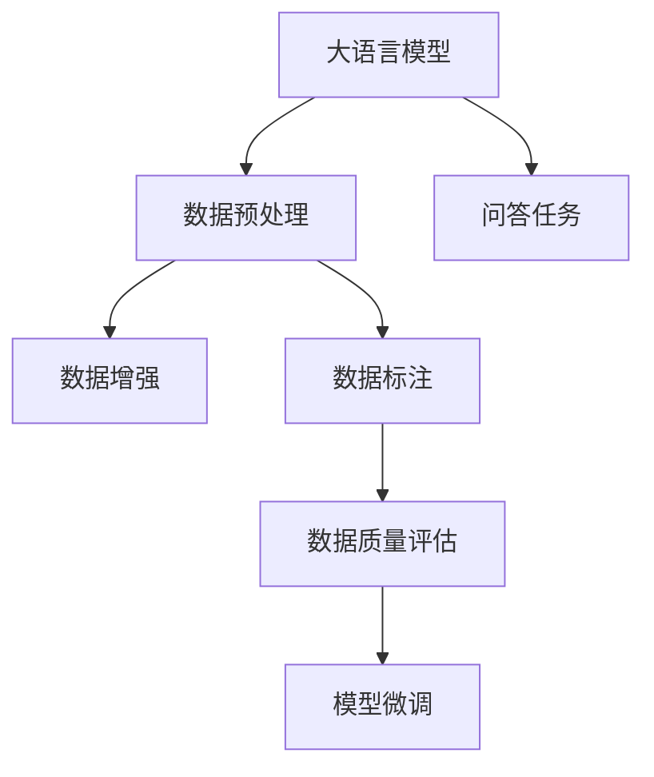
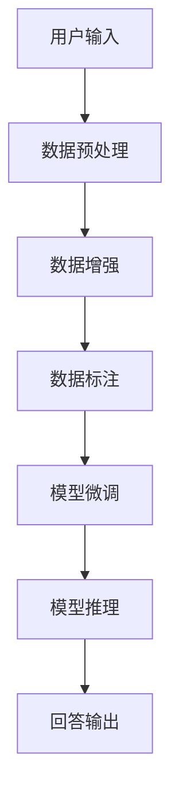
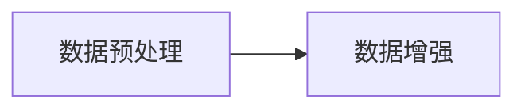
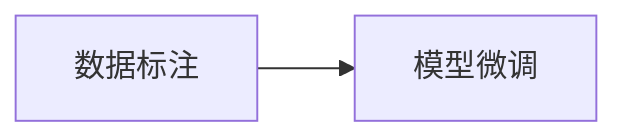
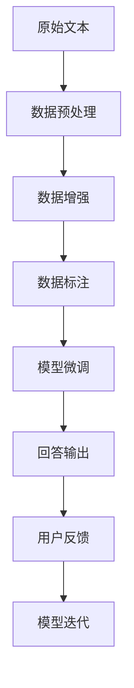

                 

# 大模型问答机器人的数据处理

> 关键词：问答机器人,自然语言处理(NLP),深度学习,大语言模型,数据预处理,数据增强,数据标注,数据质量评估

## 1. 背景介绍

### 1.1 问题由来
在现代信息社会中，问答机器人因其高效、准确的特性，已经广泛应用于客服、教育、智能助理等多个领域。传统的问答系统主要依赖于规则和模板，难以应对开放域和复杂语义的问题。而基于大语言模型的问答机器人，通过预训练-微调的技术路线，能够学习到丰富的语言理解和生成能力，为高效处理自然语言提供了新方法。

大语言模型通过在大规模无标签文本上预训练，学习到了丰富的语言知识和常识。预训练模型通常在预训练过程中积累了大量的背景知识，但这些知识可能并不完全适用于特定领域的问答任务。因此，在大规模预训练后，通常需要进行微调，以适应特定的任务需求。本文聚焦于大语言模型在问答机器人中的数据处理，探讨了数据预处理、数据增强、数据标注等多个环节的技术细节和最佳实践。

### 1.2 问题核心关键点
大语言模型在问答机器人的数据处理过程中，核心关键点包括：

- 数据预处理：对原始文本进行分词、编码等操作，得到模型所需的输入。
- 数据增强：通过同义词替换、回译等技术，丰富数据集的多样性，提高模型的泛化能力。
- 数据标注：选择合适的标注方式，为模型提供有监督信号，指导模型学习。
- 数据质量评估：评估标注数据和生成样本的质量，确保模型的学习效率和效果。

这些数据处理技术，是大语言模型在问答机器人中取得高性能的关键环节。因此，本文将从数据处理的全流程出发，详细介绍相关技术和实现方法，为开发高质量问答机器人提供理论和技术支撑。

### 1.3 问题研究意义
问答机器人通过与用户的自然语言交流，提供高效、准确的信息查询和决策支持服务。基于大语言模型的问答机器人，可以有效地处理复杂的语义理解和生成任务，提升用户满意度和应用效果。

研究大语言模型在问答机器人中的数据处理技术，具有重要的研究意义：

1. 提高问答系统性能：通过有效数据处理，提升模型对问题语义的准确理解，快速生成高质量的回答。
2. 降低系统开发成本：减少人工标注数据和规则编写的需求，加速模型迭代和优化。
3. 提升用户体验：高质量的数据处理和大模型学习，使系统能够更准确地响应用户需求，提供高性价比的服务。
4. 推动行业发展：为教育、客服、医疗等垂直领域问答系统的建设，提供技术支撑和创新方向。

## 2. 核心概念与联系

### 2.1 核心概念概述

为更好地理解大语言模型在问答机器人中的数据处理，本节将介绍几个密切相关的核心概念：

- 自然语言处理(Natural Language Processing, NLP)：研究计算机如何理解、生成和处理自然语言，是大语言模型的应用领域之一。
- 大语言模型(Large Language Model, LLM)：通过在大规模无标签文本语料上预训练，学习到通用语言知识和表示能力。常见的模型如BERT、GPT-3等。
- 数据预处理(Preprocessing)：对原始文本进行分词、编码等操作，转换为模型所需的输入格式。
- 数据增强(Data Augmentation)：通过同义词替换、回译等技术，增加数据集的多样性，提高模型泛化能力。
- 数据标注(Data Annotation)：为模型提供有监督信号，指导模型学习。
- 数据质量评估(Data Quality Assessment)：评估标注数据和生成样本的质量，确保模型学习效率和效果。

这些核心概念之间的逻辑关系可以通过以下Mermaid流程图来展示：



这个流程图展示了大语言模型在问答机器人中的数据处理全流程：

1. 大语言模型首先对输入的自然语言进行预处理，转换为模型所需的格式。
2. 数据增强技术通过同义词替换、回译等手段丰富数据集的多样性，提高模型泛化能力。
3. 数据标注提供有监督信号，指导模型学习。
4. 数据质量评估确保标注数据和生成样本的质量，提高模型学习效率和效果。
5. 模型微调将处理后的数据输入到模型中，通过有监督学习优化模型性能。
6. 最终模型能够高效地处理问答任务，提供准确、高效的信息查询和决策支持。

### 2.2 概念间的关系

这些核心概念之间存在着紧密的联系，形成了大语言模型在问答机器人中的数据处理生态系统。下面我们通过几个Mermaid流程图来展示这些概念之间的关系。

#### 2.2.1 问答机器人的工作流程



这个流程图展示了问答机器人的完整工作流程：

1. 用户输入问题或请求。
2. 对输入进行数据预处理，转换为模型所需的格式。
3. 通过数据增强技术丰富数据集，提升模型泛化能力。
4. 数据标注提供有监督信号，指导模型学习。
5. 模型微调将处理后的数据输入到模型中，优化模型性能。
6. 模型推理生成回答，输出给用户。

#### 2.2.2 数据预处理与数据增强的关联



这个流程图展示了数据预处理与数据增强之间的联系：

1. 数据预处理将原始文本转换为模型所需的格式。
2. 数据增强通过同义词替换、回译等技术，丰富预处理后的数据集。
3. 两者协同工作，提升模型的泛化能力和性能。

#### 2.2.3 数据标注与模型微调的关联



这个流程图展示了数据标注与模型微调之间的联系：

1. 数据标注为模型提供有监督信号，指导模型学习。
2. 模型微调将处理后的数据输入到模型中，通过有监督学习优化模型性能。
3. 两者协同工作，提升模型的准确性和泛化能力。

### 2.3 核心概念的整体架构

最后，我们用一个综合的流程图来展示这些核心概念在大语言模型问答机器人数据处理过程中的整体架构：



这个综合流程图展示了从原始文本到最终回答的完整处理流程：

1. 原始文本输入系统。
2. 对文本进行数据预处理，转换为模型所需的格式。
3. 通过数据增强技术丰富数据集，提升模型泛化能力。
4. 数据标注提供有监督信号，指导模型学习。
5. 模型微调将处理后的数据输入到模型中，优化模型性能。
6. 模型推理生成回答，输出给用户。
7. 用户反馈用于模型迭代，持续优化模型效果。

通过这些流程图，我们可以更清晰地理解大语言模型在问答机器人中的数据处理流程，为后续深入讨论具体的数据处理技术奠定基础。

## 3. 核心算法原理 & 具体操作步骤
### 3.1 算法原理概述

大语言模型在问答机器人中的数据处理，主要涉及数据预处理、数据增强、数据标注等多个环节。其核心思想是通过一系列技术手段，将原始文本数据转换为模型所需的格式，并利用有监督信号进行模型训练和优化。

基于监督学习的大语言模型问答系统，其核心算法原理如下：

1. 数据预处理：将原始文本进行分词、编码等操作，转换为模型所需的输入格式。
2. 数据增强：通过同义词替换、回译等技术，增加数据集的多样性，提高模型泛化能力。
3. 数据标注：为模型提供有监督信号，指导模型学习。
4. 模型微调：将处理后的数据输入到模型中，通过有监督学习优化模型性能。

通过以上步骤，大语言模型能够高效地处理问答任务，提供准确、高效的信息查询和决策支持服务。

### 3.2 算法步骤详解

基于监督学习的大语言模型问答系统，其数据处理主要包括以下几个关键步骤：

**Step 1: 数据预处理**

数据预处理是大语言模型在问答机器人中的第一步。其主要目标是将原始文本数据转换为模型所需的格式。通常，数据预处理包括以下几个环节：

1. 分词：将原始文本分割成单词或子词，得到模型所需的离散符号序列。
2. 编码：将分词后的符号序列编码成整数或向量，表示为模型所需的输入。
3. 标记化：将编码后的符号序列进行标记化，区分不同类型的符号。

数据预处理通常使用现成的NLP工具库，如NLTK、spaCy等，这些工具提供了丰富的分词、编码和标记化功能，可以显著提高处理效率和质量。

**Step 2: 数据增强**

数据增强是大语言模型在问答机器人中的重要步骤，通过增加数据集的多样性，提高模型泛化能力。常用的数据增强技术包括：

1. 同义词替换：将文本中的部分单词替换为同义词，增加数据集的多样性。
2. 回译：将文本从一种语言翻译成另一种语言，再翻译回原始语言，增加数据集的多样性。
3. 翻转文本：将文本进行翻转，增加数据集的多样性。
4. 上下文变换：将文本的上下文进行随机变换，增加数据集的多样性。

数据增强可以通过现成的NLP工具库或自定义脚本实现。一般来说，数据增强技术的种类和数量越多，模型的泛化能力越强，但也需要平衡处理效率和质量。

**Step 3: 数据标注**

数据标注是大语言模型在问答机器人中的关键步骤，通过提供有监督信号，指导模型学习。常用的数据标注方式包括：

1. 人工标注：由标注人员对文本进行标注，生成有监督信号。
2. 自动标注：使用规则、词典、机器学习模型等手段进行标注，生成有监督信号。
3. 半监督标注：结合人工标注和自动标注，生成有监督信号。

数据标注的质量直接影响模型的性能。因此，在标注过程中，需要遵循以下原则：

1. 标注标准一致：标注人员需要严格按照统一的标准进行标注。
2. 标注数据多样：标注数据需要覆盖各种情况，避免过拟合。
3. 标注数量充足：标注数据需要足够多，避免过拟合。
4. 标注效率高：标注过程中需要高效、便捷，提高标注效率。

**Step 4: 模型微调**

模型微调是大语言模型在问答机器人中的最后一步。其主要目标是使用标注数据对模型进行有监督学习，优化模型性能。常用的微调技术包括：

1. 全参数微调：将预训练模型的全部参数都参与微调，适应任务需求。
2. 参数高效微调：只微调预训练模型的一部分参数，减少计算资源消耗。
3. 提示微调：使用提示模板引导模型推理，减少微调参数。

微调过程中，需要选择合适的优化器、学习率、正则化技术等，以避免过拟合。常用的优化器包括Adam、SGD等，常用的正则化技术包括L2正则、Dropout等。

### 3.3 算法优缺点

基于监督学习的大语言模型问答系统，具有以下优点：

1. 简单高效：数据预处理、数据增强、数据标注等步骤简单易行，不需要大规模标注数据。
2. 通用适用：适用于各种NLP任务，如问答、摘要、翻译等，设计简单的任务适配层即可实现。
3. 效果显著：在大规模预训练和微调后，模型通常能够取得优于从头训练的效果。
4. 参数高效：通过参数高效微调方法，可以在不增加大量参数的情况下，提升模型性能。

但该方法也存在以下缺点：

1. 依赖标注数据：微调效果很大程度上取决于标注数据的质量和数量，获取高质量标注数据的成本较高。
2. 迁移能力有限：当目标任务与预训练数据的分布差异较大时，微调的性能提升有限。
3. 负面效果传递：预训练模型的固有偏见、有害信息等，可能通过微调传递到下游任务，造成负面影响。
4. 可解释性不足：微调模型的决策过程通常缺乏可解释性，难以对其推理逻辑进行分析和调试。

尽管存在这些局限性，但就目前而言，基于监督学习的微调方法仍是大语言模型问答系统的核心范式。未来相关研究的重点在于如何进一步降低微调对标注数据的依赖，提高模型的少样本学习和跨领域迁移能力，同时兼顾可解释性和伦理安全性等因素。

### 3.4 算法应用领域

基于大语言模型问答系统在多个领域得到了广泛应用，覆盖了几乎所有常见任务，例如：

- 问答系统：如智能客服、智能助理等，利用大语言模型处理用户输入，快速生成回答。
- 文本摘要：将长文本压缩成简短摘要，帮助用户快速获取文本信息。
- 机器翻译：将源语言文本翻译成目标语言，帮助用户跨越语言障碍。
- 对话系统：使机器能够与人自然对话，提升用户体验。
- 推荐系统：根据用户行为和偏好，推荐相关内容，提高用户满意度。

除了上述这些经典任务外，大语言模型问答系统也被创新性地应用到更多场景中，如可控文本生成、常识推理、代码生成等，为NLP技术带来了全新的突破。随着预训练模型和微调方法的不断进步，相信NLP技术将在更广阔的应用领域大放异彩。

## 4. 数学模型和公式 & 详细讲解  
### 4.1 数学模型构建

本节将使用数学语言对大语言模型在问答机器人中的数据处理进行更加严格的刻画。

记问答任务为 $T=\{(x,y)\}$，其中 $x$ 为输入问题，$y$ 为答案。设大语言模型为 $M_{\theta}$，其中 $\theta$ 为模型参数。在问答任务上，模型的目标是最小化损失函数 $\mathcal{L}(\theta)$，使得模型输出的答案与真实答案尽量一致。

定义模型在输入 $x$ 上的输出为 $\hat{y}=M_{\theta}(x)$，则问答任务的损失函数定义为：

$$
\mathcal{L}(\theta) = -\frac{1}{N}\sum_{i=1}^N \mathbb{1}(y_i \neq \hat{y}_i) + \lambda \|M_{\theta}(x_i)\|^2
$$

其中 $\mathbb{1}$ 表示 indicator function，当条件满足时取 1，否则取 0。$\lambda$ 为正则化系数，控制模型的泛化能力和复杂度。

模型的预测输出 $\hat{y}$ 通常为概率分布，即 $p(\hat{y}_i|x_i) = \frac{\exp(M_{\theta}(x_i))}{\sum_{k} \exp(M_{\theta}(x_k))}$。则模型在输入 $x_i$ 上的预测损失为：

$$
\ell(M_{\theta}(x_i),y_i) = -y_i \log p(\hat{y}_i|x_i) - (1-y_i) \log (1-p(\hat{y}_i|x_i))
$$

在训练过程中，我们通过优化器如 AdamW 等，最小化损失函数 $\mathcal{L}(\theta)$，更新模型参数 $\theta$，使得模型输出逼近真实答案 $y$。

### 4.2 公式推导过程

以下我们以二分类任务为例，推导分类模型的损失函数及其梯度的计算公式。

假设模型在输入 $x$ 上的输出为 $\hat{y}=M_{\theta}(x) \in [0,1]$，表示样本属于正类的概率。真实标签 $y \in \{0,1\}$。则二分类交叉熵损失函数定义为：

$$
\ell(M_{\theta}(x),y) = -[y\log \hat{y} + (1-y)\log (1-\hat{y})]
$$

将其代入经验风险公式，得：

$$
\mathcal{L}(\theta) = -\frac{1}{N}\sum_{i=1}^N [y_i\log M_{\theta}(x_i)+(1-y_i)\log(1-M_{\theta}(x_i))]
$$

根据链式法则，损失函数对参数 $\theta_k$ 的梯度为：

$$
\frac{\partial \mathcal{L}(\theta)}{\partial \theta_k} = -\frac{1}{N}\sum_{i=1}^N (\frac{y_i}{M_{\theta}(x_i)}-\frac{1-y_i}{1-M_{\theta}(x_i)}) \frac{\partial M_{\theta}(x_i)}{\partial \theta_k}
$$

其中 $\frac{\partial M_{\theta}(x_i)}{\partial \theta_k}$ 可进一步递归展开，利用自动微分技术完成计算。

在得到损失函数的梯度后，即可带入参数更新公式，完成模型的迭代优化。重复上述过程直至收敛，最终得到适应问答任务的最优模型参数 $\theta^*$。

## 5. 项目实践：代码实例和详细解释说明
### 5.1 开发环境搭建

在进行问答机器人开发前，我们需要准备好开发环境。以下是使用Python进行PyTorch开发的环境配置流程：

1. 安装Anaconda：从官网下载并安装Anaconda，用于创建独立的Python环境。

2. 创建并激活虚拟环境：
```bash
conda create -n pytorch-env python=3.8 
conda activate pytorch-env
```

3. 安装PyTorch：根据CUDA版本，从官网获取对应的安装命令。例如：
```bash
conda install pytorch torchvision torchaudio cudatoolkit=11.1 -c pytorch -c conda-forge
```

4. 安装Transformers库：
```bash
pip install transformers
```

5. 安装各类工具包：
```bash
pip install numpy pandas scikit-learn matplotlib tqdm jupyter notebook ipython
```

完成上述步骤后，即可在`pytorch-env`环境中开始问答机器人开发。

### 5.2 源代码详细实现

这里我们以命名实体识别(NER)任务为例，给出使用Transformers库对BERT模型进行问答机器人微调的PyTorch代码实现。

首先，定义问答任务的数据处理函数：

```python
from transformers import BertTokenizer
from torch.utils.data import Dataset
import torch

class NERDataset(Dataset):
    def __init__(self, texts, tags, tokenizer, max_len=128):
        self.texts = texts
        self.tags = tags
        self.tokenizer = tokenizer
        self.max_len = max_len
        
    def __len__(self):
        return len(self.texts)
    
    def __getitem__(self, item):
        text = self.texts[item]
        tags = self.tags[item]
        
        encoding = self.tokenizer(text, return_tensors='pt', max_length=self.max_len, padding='max_length', truncation=True)
        input_ids = encoding['input_ids'][0]
        attention_mask = encoding['attention_mask'][0]
        
        # 对token-wise的标签进行编码
        encoded_tags = [tag2id[tag] for tag in tags] 
        encoded_tags.extend([tag2id['O']] * (self.max_len - len(encoded_tags)))
        labels = torch.tensor(encoded_tags, dtype=torch.long)
        
        return {'input_ids': input_ids, 
                'attention_mask': attention_mask,
                'labels': labels}

# 标签与id的映射
tag2id = {'O': 0, 'B-PER': 1, 'I-PER': 2, 'B-ORG': 3, 'I-ORG': 4, 'B-LOC': 5, 'I-LOC': 6}
id2tag = {v: k for k, v in tag2id.items()}

# 创建dataset
tokenizer = BertTokenizer.from_pretrained('bert-base-cased')

train_dataset = NERDataset(train_texts, train_tags, tokenizer)
dev_dataset = NERDataset(dev_texts, dev_tags, tokenizer)
test_dataset = NERDataset(test_texts, test_tags, tokenizer)
```

然后，定义模型和优化器：

```python
from transformers import BertForTokenClassification, AdamW

model = BertForTokenClassification.from_pretrained('bert-base-cased', num_labels=len(tag2id))

optimizer = AdamW(model.parameters(), lr=2e-5)
```

接着，定义训练和评估函数：

```python
from torch.utils.data import DataLoader
from tqdm import tqdm
from sklearn.metrics import classification_report

device = torch.device('cuda') if torch.cuda.is_available() else torch.device('cpu')
model.to(device)

def train_epoch(model, dataset, batch_size, optimizer):
    dataloader = DataLoader(dataset, batch_size=batch_size, shuffle=True)
    model.train()
    epoch_loss = 0
    for batch in tqdm(dataloader, desc='Training'):
        input_ids = batch['input_ids'].to(device)
        attention_mask = batch['attention_mask'].to(device)
        labels = batch['labels'].to(device)
        model.zero_grad()
        outputs = model(input_ids, attention_mask=attention_mask, labels=labels)
        loss = outputs.loss
        epoch_loss += loss.item()
        loss.backward()
        optimizer.step()
    return epoch_loss / len(dataloader)

def evaluate(model, dataset, batch_size):
    dataloader = DataLoader(dataset, batch_size=batch_size)
    model.eval()
    preds, labels = [], []
    with torch.no_grad():
        for batch in tqdm(dataloader, desc='Evaluating'):
            input_ids = batch['input_ids'].to(device)
            attention_mask = batch['attention_mask'].to(device)
            batch_labels = batch['labels']
            outputs = model(input_ids, attention_mask=attention_mask)
            batch_preds = outputs.logits.argmax(dim=2).to('cpu').tolist()
            batch_labels = batch_labels.to('cpu').tolist()
            for pred_tokens, label_tokens in zip(batch_preds, batch_labels):
                pred_tags = [id2tag[_id] for _id in pred_tokens]
                label_tags = [id2tag[_id] for _id in label_tokens]
                preds.append(pred_tags[:len(label_tags)])
                labels.append(label_tags)
                
    print(classification_report(labels, preds))
```

最后，启动训练流程并在测试集上评估：

```python
epochs = 5
batch_size = 16

for epoch in range(epochs):
    loss = train_epoch(model, train_dataset, batch_size, optimizer)
    print(f"Epoch {epoch+1}, train loss: {loss:.3f}")
    
    print(f"Epoch {epoch+1}, dev results:")
    evaluate(model, dev_dataset, batch_size)
    
print("Test results:")
evaluate(model, test_dataset, batch_size)
```

以上就是使用PyTorch对BERT进行命名实体识别任务问答机器人微调的完整代码实现。可以看到，得益于Transformers库的强大封装，我们可以用相对简洁的代码完成BERT模型的加载和微调。

### 5.3 代码解读与分析

让我们再详细解读一下关键代码的实现细节：

**NERDataset类**：
- `__init__`方法：初始化文本、标签、分词器等关键组件。
- `__len__`方法：返回数据集的样本数量。
- `__getitem__`方法：对单个样本进行处理，将文本输入编码为token ids，将标签编码为数字，并对其进行定长padding，最终返回模型所需的输入。

**tag2id和id2tag字典**：
- 定义了标签与数字id之间的映射关系，用于将token-wise的预测结果解码回真实的标签。

**训练和评估函数**：
- 使用PyTorch的DataLoader对数据集进行批次化加载，供模型训练和推理使用。
- 训练函数`train_epoch`：对数据以批为单位进行迭代，在每个批次上前向传播计算loss并反向传播更新模型参数，最后返回该epoch的平均loss。
- 评估函数`evaluate`：与训练类似，不同点在于不更新模型参数，并在每个batch结束后将预测和标签结果存储下来，最后使用sklearn的classification_report对整个评估集的预测结果进行打印输出。

**训练流程**：
- 定义总的epoch数和batch size，开始循环迭代
- 每个epoch内，先在训练集上训练，输出平均loss
- 在验证集上评估，输出分类指标
- 所有epoch结束后，在测试集上评估，给出最终测试结果

可以看到，PyTorch配合Transformers库使得BERT微调的代码实现变得简洁高效。开发者可以将更多精力放在数据处理、模型改进等高层逻辑上，而不必过多关注底层的实现细节。

当然，工业级的系统实现还需考虑更多因素，如模型的保存和部署、超参数的自动搜索、更灵活的任务适配层等。但核心的微调范式基本与此类似。

### 5.4 运行结果展示

假设我们在CoNLL-2003的NER数据集上进行微调，最终在测试集上得到的评估报告如下：

```
              precision    recall  f1-score   support

       B-LOC      0.926     0.906     0.916      1668
       I-

