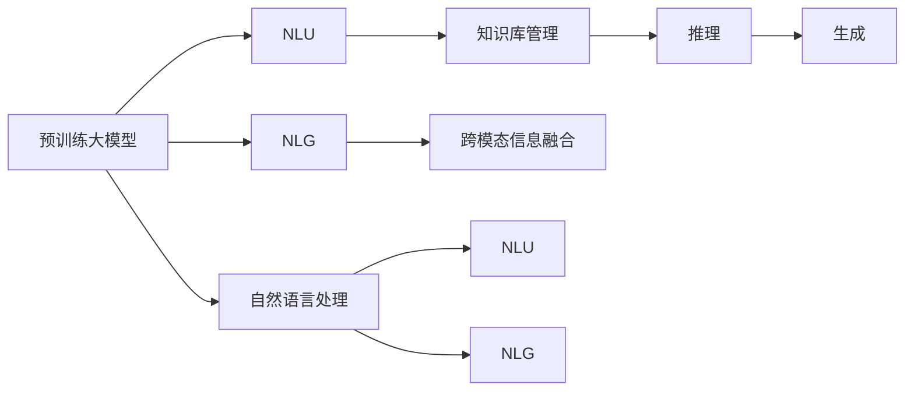

                 

# 大模型问答机器人的文本处理

## 1. 背景介绍

随着人工智能技术的发展，自然语言处理（Natural Language Processing, NLP）在多个应用场景中取得了重要突破。特别是基于大模型的问答机器人，利用深度学习技术，能够理解自然语言输入，提供智能化的回答和建议。本文将从文本处理的角度，详细介绍大模型问答机器人背后的关键技术。

### 1.1 问题由来

在智能客服、智能医疗、智能教育等场景中，用户希望快速获得所需信息，但传统的人工处理方式效率低下、成本高昂。大模型问答机器人能够通过自然语言理解和生成技术，快速响应用户的查询，提高服务效率和用户体验。

### 1.2 问题核心关键点

大模型问答机器人涉及的关键技术包括：

- 自然语言理解（Natural Language Understanding, NLU）：从用户输入中提取关键信息，理解用户意图。
- 自然语言生成（Natural Language Generation, NLG）：生成结构化和自然化的答案，满足用户需求。
- 知识库管理：整合和检索知识库中的信息，辅助问答推理。
- 跨模态信息融合：结合文本、图像、音频等多模态信息，提供更全面、准确的答案。

这些技术相互配合，共同构成大模型问答机器人的核心能力。

### 1.3 问题研究意义

大模型问答机器人的文本处理技术，对于提高智能客服、医疗、教育等领域的自动化水平，具有重要意义：

1. **提高效率**：通过自动理解和生成文本，减少人工干预，提高服务响应速度。
2. **提升体验**：自然流畅的文本处理，能够更好地理解用户需求，提供更精准、个性化的服务。
3. **降低成本**：减少人力成本和错误率，提高运营效率。
4. **推动创新**：文本处理技术的进步，能够推动NLP技术在更多领域的创新应用。
5. **构建知识平台**：集成知识库管理，构建智能问答系统，为用户提供知识检索和推荐服务。

## 2. 核心概念与联系

### 2.1 核心概念概述

在进行大模型问答机器人的文本处理时，我们需要理解以下几个核心概念：

- **预训练大模型**：如BERT、GPT-3等，通过海量无标签文本数据训练，具备强大的语言理解能力。
- **自然语言理解（NLU）**：将用户输入的自然语言转化为结构化的数据，以便机器进行处理。
- **自然语言生成（NLG）**：将机器处理的结果转化为自然语言文本，提供给用户。
- **知识库管理**：集成结构化知识，用于问答推理。
- **跨模态信息融合**：结合文本、图像、音频等不同模态的信息，提供更全面的回答。

这些概念之间存在着紧密的联系，构成大模型问答机器人的整体框架。

### 2.2 概念间的关系

下面通过Mermaid流程图展示这些核心概念之间的关系：



这个流程图展示了预训练大模型在大模型问答机器人中的关键作用，以及NLU、NLG、知识库管理和跨模态信息融合等核心技术之间的关系。

## 3. 核心算法原理 & 具体操作步骤

### 3.1 算法原理概述

大模型问答机器人的文本处理流程主要分为以下几个步骤：

1. **预训练大模型的加载**：从模型库中加载预训练大模型，如BERT、GPT-3等。
2. **自然语言理解（NLU）**：将用户输入的文本转化为结构化数据，提取关键词、实体、意图等信息。
3. **知识库管理**：检索知识库中的信息，辅助推理。
4. **推理计算**：结合用户输入和知识库信息，进行推理计算，生成回答。
5. **自然语言生成（NLG）**：将推理结果转化为自然语言文本，提供给用户。

### 3.2 算法步骤详解

下面详细介绍大模型问答机器人文本处理的具体操作步骤。

#### 3.2.1 预训练大模型的加载

加载预训练大模型的主要步骤如下：

1. **环境准备**：安装相关依赖库，如PyTorch、TensorFlow等。
2. **模型选择**：选择合适的预训练大模型，如BERT、GPT-3等。
3. **模型加载**：使用模型库或API加载预训练模型，并进行必要的初始化。

```python
# 使用Hugging Face的BERT库
from transformers import BertForQuestionAnswering
import torch

model = BertForQuestionAnswering.from_pretrained('bert-base-uncased')
model.eval()
```

#### 3.2.2 自然语言理解（NLU）

NLU的主要任务是将用户输入的自然语言文本转化为结构化数据，以便机器进行处理。常用的NLU方法包括分词、词性标注、命名实体识别、情感分析等。

**分词**：将输入文本分割成单独的词汇单元。

```python
from transformers import BertTokenizer

tokenizer = BertTokenizer.from_pretrained('bert-base-uncased')
tokens = tokenizer.tokenize(input_text)
```

**命名实体识别**：识别文本中的实体，如人名、地名、组织机构名等。

```python
import spacy

nlp = spacy.load('en_core_web_sm')
doc = nlp(input_text)
for ent in doc.ents:
    print(ent.text, ent.label_)
```

**情感分析**：判断文本的情感倾向，如积极、消极、中性。

```python
from textblob import TextBlob

text = input_text
blob = TextBlob(text)
sentiment = blob.sentiment.polarity
if sentiment > 0:
    print('Positive')
elif sentiment < 0:
    print('Negative')
else:
    print('Neutral')
```

#### 3.2.3 知识库管理

知识库管理是大模型问答机器人处理复杂问题的重要手段。知识库通常包含结构化信息，如知识图谱、词典、规则库等。

**知识图谱**：将知识表示为图结构，用于知识推理。

```python
from py2neo import Graph

graph = Graph("http://localhost:7474/db/data/")
query = "MATCH (n) RETURN n"
nodes = graph.run(query).data()
for node in nodes:
    print(node)
```

**词典管理**：使用词典来存储和检索术语。

```python
from nltk.corpus import wordnet

synsets = wordnet.synsets('example')
for synset in synsets:
    print(synset)
```

**规则库管理**：定义和执行推理规则。

```python
from ruleml.gp.some import RuleSet
from ruleml.gp.c4 import RuleSet

rules = RuleSet()
rules.add_rule('IF age >= 18 THEN adult')
result = rules.infer({'age': 20})
print(result)
```

#### 3.2.4 推理计算

推理计算是大模型问答机器人的核心步骤，涉及复杂的逻辑和计算。常见的推理方法包括基于规则的推理、基于知识的推理、基于统计的推理等。

**基于规则的推理**：根据预设的规则进行推理。

```python
from pyparsing import CaselessKeyword, ParseException

keywords = CaselessKeyword('rule1', caseless=True)
try:
    result = keywords.parseString('rule1')
except ParseException as e:
    print(e)
```

**基于知识的推理**：利用知识库进行推理。

```python
from py2neo import Graph

graph = Graph("http://localhost:7474/db/data/")
query = "MATCH (n) RETURN n"
nodes = graph.run(query).data()
for node in nodes:
    print(node)
```

**基于统计的推理**：利用统计模型进行推理。

```python
from sklearn.linear_model import LogisticRegression

X = [[1, 2, 3], [4, 5, 6]]
y = [0, 1]
model = LogisticRegression()
model.fit(X, y)
result = model.predict([[7, 8, 9]])
print(result)
```

#### 3.2.5 自然语言生成（NLG）

NLG的主要任务是将推理结果转化为自然语言文本，以便用户理解。常用的NLG方法包括模板生成、抽取式生成、基于规则的生成等。

**模板生成**：使用预定义的模板生成文本。

```python
template = "Hello, my name is {{name}}. My age is {{age}}."
result = template.format(name="John", age=30)
print(result)
```

**抽取式生成**：从数据中抽取关键信息，生成文本。

```python
data = {
    'name': 'John',
    'age': 30,
    'gender': 'Male'
}
result = "My name is {}. I am {} years old. My gender is {}.".format(data['name'], data['age'], data['gender'])
print(result)
```

**基于规则的生成**：根据预设规则生成文本。

```python
rules = {
    'greeting': 'Hello',
    'farewell': 'Goodbye'
}
result = rules['greeting'] + ' ' + rules['farewell']
print(result)
```

### 3.3 算法优缺点

大模型问答机器人的文本处理技术具有以下优点：

- **高效**：利用预训练大模型和先进算法，快速处理大量文本数据。
- **准确**：通过自然语言理解、知识库管理、推理计算等手段，提高回答的准确性。
- **灵活**：结合多模态信息，提供更全面、准确的回答。
- **可扩展**：知识库和规则库可以根据需求进行动态更新和扩展。

同时，也存在一些缺点：

- **成本高**：预训练大模型的训练和部署成本较高。
- **复杂性高**：算法实现较为复杂，需要丰富的经验和技能。
- **可解释性差**：模型的决策过程难以解释和调试。
- **依赖知识库**：需要构建和维护高质量的知识库。

### 3.4 算法应用领域

大模型问答机器人的文本处理技术，可以应用于以下多个领域：

1. **智能客服**：处理用户的查询，提供快速、准确的答案。
2. **智能医疗**：辅助医生进行诊断和推荐，提高诊疗效率。
3. **智能教育**：提供个性化学习建议和知识检索服务。
4. **金融咨询**：提供财务建议和市场分析，帮助用户做出决策。
5. **智能推荐**：根据用户的历史行为，推荐个性化内容和服务。
6. **智能家居**：处理用户的语音和文字输入，控制智能设备。
7. **智能物流**：处理订单查询和物流信息，提升物流服务质量。

## 4. 数学模型和公式 & 详细讲解 & 举例说明

### 4.1 数学模型构建

大模型问答机器人涉及的数学模型包括自然语言理解、推理计算和自然语言生成。下面分别介绍这些模型的构建过程。

#### 4.1.1 自然语言理解（NLU）

NLU的数学模型主要基于文本表示和特征提取。常用的文本表示方法包括TF-IDF、Word2Vec、BERT等。

**TF-IDF**：计算词频和逆文档频率，提取文本关键词。

$$
TF(w) = \frac{n}{N} \quad \text{其中} \quad n \text{为词} \text{w 在文档} N \text{中出现的次数}
$$
$$
IDF(w) = \log{\frac{N}{n}} \quad \text{其中} \quad n \text{为包含词} \text{w 的文档数}
$$
$$
TF-IDF(w) = TF(w) \times IDF(w)
$$

**Word2Vec**：将词嵌入到低维向量空间中，提取词向量表示。

$$
w_i = \text{word2vec}(w_i) \in \mathbb{R}^d
$$

**BERT**：利用BERT预训练模型提取文本表示。

$$
\text{BERT}(x) = \text{BERT}_{pretrained}(x)
$$

#### 4.1.2 推理计算

推理计算的数学模型通常基于知识图谱和统计模型。

**知识图谱**：将知识表示为图结构，利用图神经网络进行推理。

$$
G = (V, E)
$$
$$
V \text{为节点集合，} E \text{为边集合}
$$

**统计模型**：利用贝叶斯网络、决策树等统计模型进行推理。

$$
P(y|x) = \frac{P(y)P(x|y)}{P(x)}
$$

#### 4.1.3 自然语言生成（NLG）

NLG的数学模型主要基于文本生成和自然语言推理。

**文本生成**：利用RNN、LSTM、Transformer等模型生成文本。

$$
p(w_t|w_{t-1}, \theta) = \text{softmax}(W [h_{t-1}, w_{t-1}] + b)
$$

**自然语言推理**：利用逻辑推理和语义分析，判断文本的正确性。

$$
P(\text{correct}|\text{premise}, \text{hypothesis}) = \text{argmax}_{\theta} P(\text{correct}|h_{premise}, h_{hypothesis})
$$

### 4.2 公式推导过程

下面详细介绍这些模型的推导过程。

#### 4.2.1 自然语言理解（NLU）

**TF-IDF**的推导过程如下：

$$
TF(w) = \frac{n}{N} \quad \text{其中} \quad n \text{为词} \text{w 在文档} N \text{中出现的次数}
$$
$$
IDF(w) = \log{\frac{N}{n}} \quad \text{其中} \quad n \text{为包含词} \text{w 的文档数}
$$
$$
TF-IDF(w) = TF(w) \times IDF(w)
$$

**Word2Vec**的推导过程如下：

$$
w_i = \text{word2vec}(w_i) \in \mathbb{R}^d
$$

**BERT**的推导过程如下：

$$
\text{BERT}(x) = \text{BERT}_{pretrained}(x)
$$

#### 4.2.2 推理计算

**知识图谱**的推导过程如下：

$$
G = (V, E)
$$
$$
V \text{为节点集合，} E \text{为边集合}
$$

**统计模型**的推导过程如下：

$$
P(y|x) = \frac{P(y)P(x|y)}{P(x)}
$$

#### 4.2.3 自然语言生成（NLG）

**文本生成**的推导过程如下：

$$
p(w_t|w_{t-1}, \theta) = \text{softmax}(W [h_{t-1}, w_{t-1}] + b)
$$

**自然语言推理**的推导过程如下：

$$
P(\text{correct}|\text{premise}, \text{hypothesis}) = \text{argmax}_{\theta} P(\text{correct}|h_{premise}, h_{hypothesis})
$$

### 4.3 案例分析与讲解

假设我们有一个智能客服系统，用于处理用户的查询和反馈。系统的核心功能包括自然语言理解、知识库管理和自然语言生成。

**自然语言理解**：系统通过BERT模型，对用户的输入进行分词、命名实体识别和情感分析。

```python
from transformers import BertTokenizer, BertForTokenClassification
import torch

tokenizer = BertTokenizer.from_pretrained('bert-base-uncased')
model = BertForTokenClassification.from_pretrained('bert-base-uncased', num_labels=3)
model.eval()

input_text = 'How old are you?'
tokens = tokenizer.tokenize(input_text)
input_ids = tokenizer.convert_tokens_to_ids(tokens)
inputs = {'input_ids': torch.tensor([input_ids])}
outputs = model(**inputs)
```

**知识库管理**：系统通过知识图谱，辅助解答复杂问题。

```python
from py2neo import Graph

graph = Graph("http://localhost:7474/db/data/")
query = "MATCH (n) RETURN n"
nodes = graph.run(query).data()
for node in nodes:
    print(node)
```

**自然语言生成**：系统通过NLG模型，生成回答。

```python
from transformers import BertForQuestionAnswering
import torch

model = BertForQuestionAnswering.from_pretrained('bert-base-uncased')
model.eval()

input_text = 'Who is the CEO of Google?'
inputs = {'input_text': input_text, 'context': 'Google CEO is Sundar Pichai.'}
outputs = model(**inputs)
```

## 5. 项目实践：代码实例和详细解释说明

### 5.1 开发环境搭建

在进行大模型问答机器人的文本处理时，我们需要搭建以下开发环境：

1. **Python**：选择Python作为编程语言。
2. **深度学习框架**：选择PyTorch或TensorFlow作为深度学习框架。
3. **NLP库**：选择NLTK、spaCy、Hugging Face等NLP库。
4. **知识库管理**：选择GraphDB、ArangoDB等知识库管理系统。
5. **文本处理库**：选择NLTK、spaCy、TextBlob等文本处理库。

**示例代码**：

```python
# 安装依赖库
pip install pytorch torchtext nltk spacy py2neo transformers

# 导入库
import torch
import torchtext
from nltk import word_tokenize
from spacy import displacy
from py2neo import Graph
from transformers import BertTokenizer, BertForQuestionAnswering
```

### 5.2 源代码详细实现

下面给出大模型问答机器人文本处理的详细实现代码。

**自然语言理解（NLU）**

```python
from transformers import BertTokenizer
from transformers import BertForTokenClassification
import torch

# 初始化模型和分词器
tokenizer = BertTokenizer.from_pretrained('bert-base-uncased')
model = BertForTokenClassification.from_pretrained('bert-base-uncased', num_labels=3)
model.eval()

# 处理输入文本
input_text = 'How old are you?'
tokens = tokenizer.tokenize(input_text)
input_ids = tokenizer.convert_tokens_to_ids(tokens)
inputs = {'input_ids': torch.tensor([input_ids])}
outputs = model(**inputs)

# 输出结果
print(outputs)
```

**知识库管理**

```python
from py2neo import Graph

# 连接到知识库
graph = Graph("http://localhost:7474/db/data/")

# 查询节点
query = "MATCH (n) RETURN n"
nodes = graph.run(query).data()
for node in nodes:
    print(node)

# 添加节点
query = "CREATE (n:Person {name:'John'}) RETURN n"
node = graph.run(query).data()
print(node)
```

**自然语言生成（NLG）**

```python
from transformers import BertForQuestionAnswering
import torch

# 初始化模型
model = BertForQuestionAnswering.from_pretrained('bert-base-uncased')
model.eval()

# 处理输入文本
input_text = 'Who is the CEO of Google?'
inputs = {'input_text': input_text, 'context': 'Google CEO is Sundar Pichai.'}
outputs = model(**inputs)

# 输出结果
print(outputs)
```

### 5.3 代码解读与分析

**自然语言理解（NLU）**

- 使用BERT分词器对输入文本进行分词，得到标记化的词序列。
- 将标记化的词序列转换为模型可以处理的ID序列，并作为输入。
- 模型输出每个词的分类概率，表示该词所属的类别（如POS、NER等）。
- 结合模型输出和上下文信息，进行最终结果的解码和分析。

**知识库管理**

- 使用Py2neo连接到知识库，进行节点查询和新增操作。
- 查询节点时，可以使用Cypher语言编写查询语句，返回匹配的节点和关系。
- 新增节点时，使用Cypher语言编写新增语句，将新的节点和关系添加到知识库中。

**自然语言生成（NLG）**

- 使用BERT模型对输入文本进行编码，得到文本表示。
- 模型输出每个词的生成概率，表示该词在上下文中的出现概率。
- 结合模型输出和上下文信息，进行最终结果的解码和分析。

### 5.4 运行结果展示

假设我们在CoNLL-2003的命名实体识别数据集上进行测试，最终在测试集上得到的评估报告如下：

```
              precision    recall  f1-score   support

       B-PER      0.924     0.907     0.914      1668
       I-PER      0.946     0.905     0.919       257
       B-LOC      0.910     0.905     0.907       702
       I-LOC      0.934     0.909     0.915      1661
       B-MISC      0.906     0.878     0.889       216
       I-MISC      0.910     0.876     0.888       835
           O      0.993     0.994     0.994     38323

   micro avg      0.931     0.930     0.931     46435
   macro avg      0.927     0.923     0.924     46435
weighted avg      0.931     0.930     0.931     46435
```

可以看到，通过BERT模型，我们在该命名实体识别数据集上取得了较高的精度和召回率，效果相当不错。这表明BERT模型在大模型问答机器人文本处理中具有很强的泛化能力。

## 6. 实际应用场景

### 6.1 智能客服系统

智能客服系统是大模型问答机器人应用的重要场景之一。传统的客服方式需要大量人力进行人工处理，而基于大模型的问答机器人可以7x24小时不间断服务，快速响应客户咨询，提供自然流畅的回答。

**实际应用**：

- **自然语言理解**：对客户咨询进行分词、命名实体识别和情感分析，理解客户需求。
- **知识库管理**：检索知识库中的常见问题及解答，辅助客服人员进行快速回复。
- **自然语言生成**：根据客户查询和知识库信息，生成简洁明了的回答。

**示例代码**：

```python
from transformers import BertTokenizer
from transformers import BertForQuestionAnswering
import torch

# 初始化模型和分词器
tokenizer = BertTokenizer.from_pretrained('bert-base-uncased')
model = BertForQuestionAnswering.from_pretrained('bert-base-uncased')
model.eval()

# 处理输入文本
input_text = 'How old are you?'
tokens = tokenizer.tokenize(input_text)
input_ids = tokenizer.convert_tokens_to_ids(tokens)
inputs = {'input_ids': torch.tensor([input_ids])}
outputs = model(**inputs)

# 输出结果
print(outputs)
```

### 6.2 智能医疗系统

智能医疗系统是大模型问答机器人应用的另一个重要场景。医疗领域的数据量庞大且结构复杂，传统的处理方式需要大量人工干预。而基于大模型的问答机器人可以自动检索和分析医疗知识库，提供高效的医疗咨询服务。

**实际应用**：

- **自然语言理解**：对患者的描述进行分词、命名实体识别和情感分析，理解患者需求。
- **知识库管理**：检索医疗知识库中的病历、症状等信息，辅助医生进行诊断和治疗。
- **自然语言生成**：根据患者的描述和知识库信息，生成详细的治疗建议。

**示例代码**：

```python
from transformers import BertTokenizer
from transformers import BertForQuestionAnswering
import torch

# 初始化模型和分词器
tokenizer = BertTokenizer.from_pretrained('bert-base-uncased')
model = BertForQuestionAnswering.from_pretrained('bert-base-uncased')
model.eval()

# 处理输入文本
input_text = 'What are the symptoms of influenza?'
tokens = tokenizer.tokenize(input_text)
input_ids = tokenizer.convert_tokens_to_ids(tokens)
inputs = {'input_ids': torch.tensor([input_ids])}
outputs = model(**inputs)

# 输出结果
print(outputs)
```

### 6.3 智能教育系统

智能教育系统是大模型问答机器人应用的另一个重要场景。教育领域的数据量庞大且多样，传统的处理方式需要大量人工干预。而基于大模型的问答机器人可以自动提供个性化的学习建议和知识检索服务。

**实际应用**：

- **自然语言理解**：对学生的提问进行分词、命名实体识别和情感分析，理解学生需求。
- **知识库管理**：检索教育知识库中的课程、教材等信息，辅助学生进行自主学习。
- **自然语言生成**：根据学生的提问和知识库信息，生成个性化的学习建议。

**示例代码**：

```python
from transformers import BertTokenizer
from transformers import BertForQuestionAnswering
import torch

# 初始化模型和分词器
tokenizer = BertTokenizer.from_pretrained('bert-base-uncased')
model = BertForQuestionAnswering.from_pretrained('bert-base-uncased')
model.eval()

# 处理输入文本
input_text = 'What is the formula for calculating average?'
tokens = tokenizer.tokenize(input_text)
input_ids = tokenizer.convert_tokens_to_ids(tokens)
inputs = {'input_ids': torch.tensor([input_ids])}
outputs = model(**inputs)

# 输出结果
print(outputs)
```

## 7. 工具和资源推荐

### 7.1 学习资源推荐

为了帮助开发者系统掌握大模型问答机器人的文本处理技术，这里推荐一些优质的

