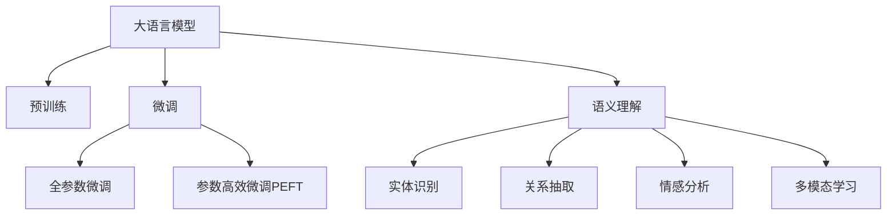
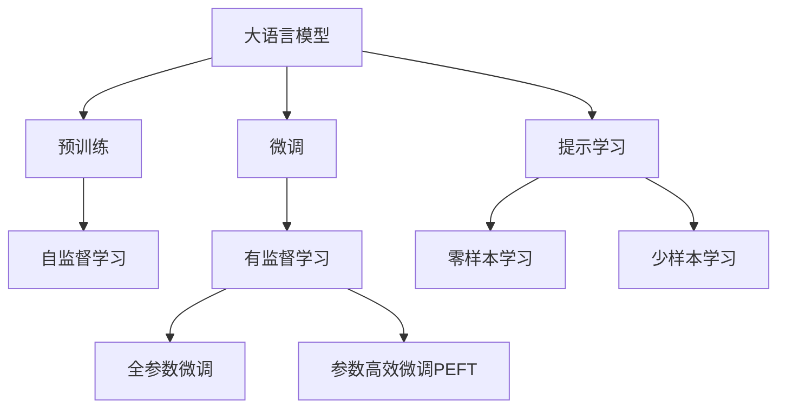
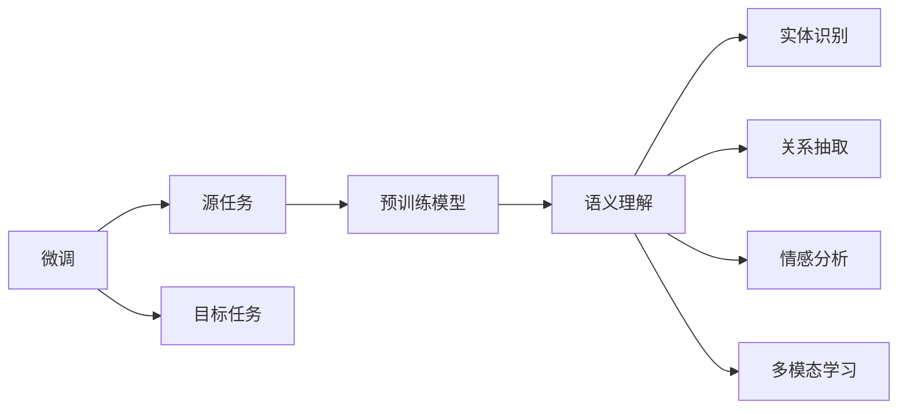
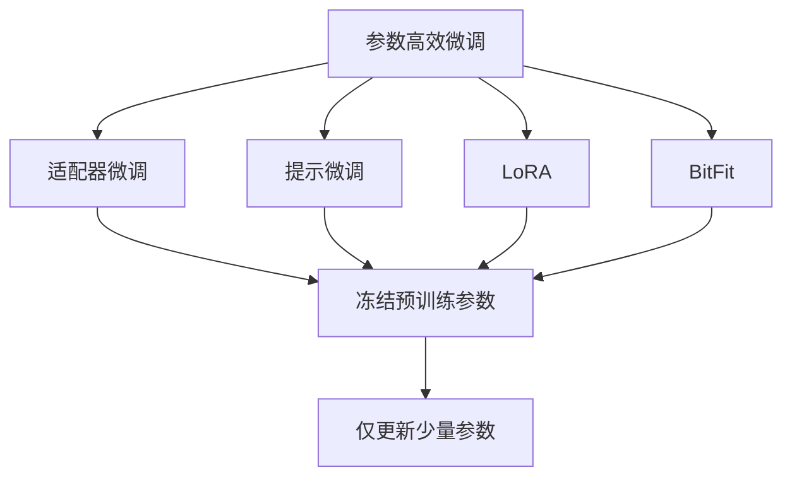
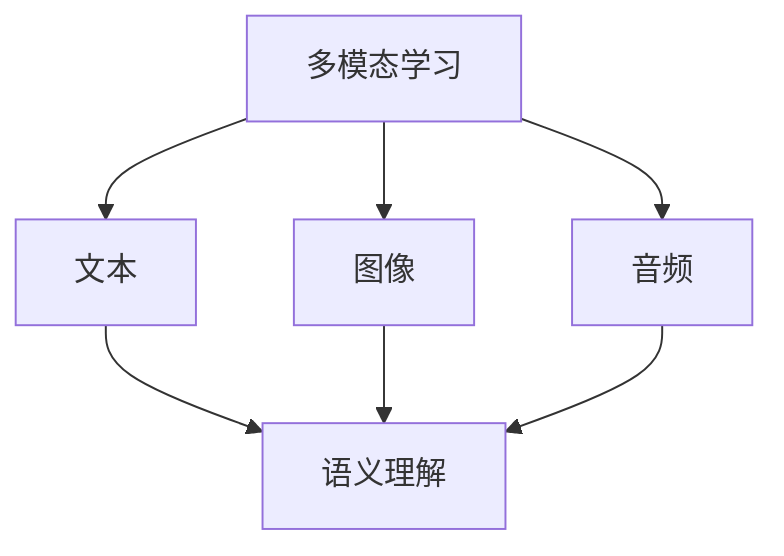
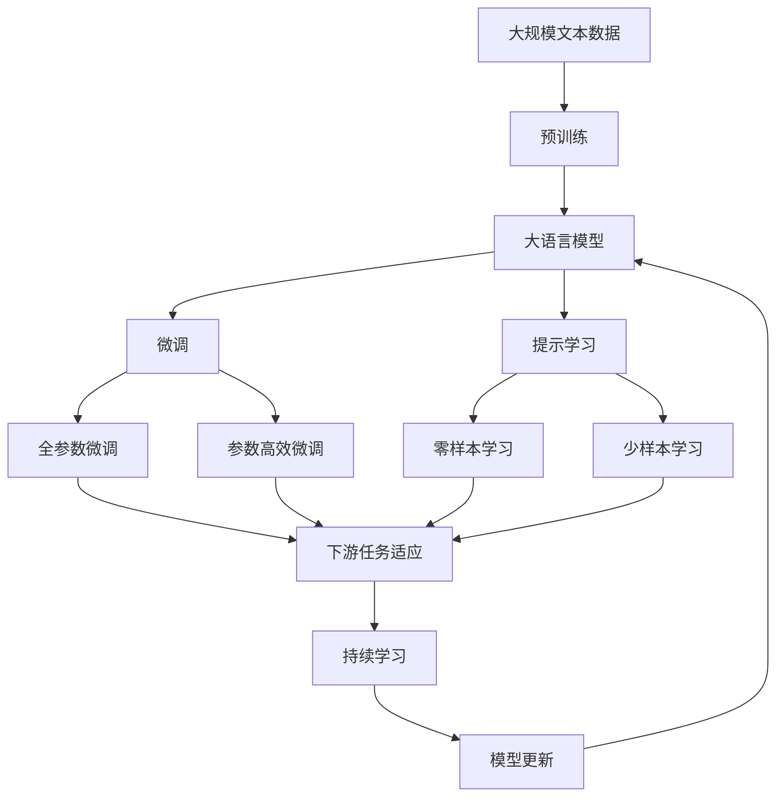

                 

# 大模型问答机器人的语义理解能力

## 1. 背景介绍

### 1.1 问题由来
在人工智能领域，自然语言处理（NLP）是一个重要的研究方向。其中，问答系统（QA）作为NLP的一个重要分支，近年来得到了快速的发展。问答系统不仅能够回答用户的自然语言查询，还能提供详细的解释和上下文信息。基于大语言模型的问答机器人更是将这一技术推向了新的高度，通过预训练模型和微调技术，使得问答系统具备了强大的语义理解和生成能力。

问答系统的核心在于如何理解用户的查询意图，并从海量数据中提取相关的信息进行回答。传统的问答系统通常依赖于规则或模板进行匹配，而基于大语言模型的问答机器人则可以通过预训练获得语言的通用表示，从而在微调过程中对特定任务进行优化，提升语义理解能力。

### 1.2 问题核心关键点
大语言模型在问答系统中的应用，主要依赖于以下两个核心关键点：

1. **预训练模型**：大语言模型通过在大规模无标签文本数据上进行预训练，学习到丰富的语言知识和语义表示。这些模型包括GPT、BERT等，能够处理复杂的自然语言理解和生成任务。

2. **微调技术**：在预训练模型的基础上，通过使用下游任务的少量标注数据进行微调，使得模型能够更好地适应特定任务。微调技术可以提升模型的任务准确率和泛化能力，使得模型在新的应用场景中也能表现优异。

这两个关键点共同构成了大模型问答系统的核心，使得其在问答任务中能够超越传统系统，提供更准确、更智能的回答。

### 1.3 问题研究意义
研究大模型问答机器人的语义理解能力，对于推动NLP技术的进步，提高问答系统的智能化水平，具有重要意义：

1. **提高问答准确率**：通过预训练和微调，大模型问答系统能够更好地理解用户的查询意图，提高回答的准确率和相关性。
2. **扩展应用场景**：大模型问答系统能够应用于各种场景，如智能客服、智能医疗、智能教育等，为用户提供更为便捷和高效的服务。
3. **降低开发成本**：相比于传统问答系统，大模型问答系统的开发和维护成本更低，能够快速部署到各种实际应用中。
4. **提升用户体验**：大模型问答系统能够提供更为自然和流畅的对话体验，使用户能够更自然地与机器进行交流。

## 2. 核心概念与联系

### 2.1 核心概念概述

为了更好地理解大模型问答机器人的语义理解能力，本节将介绍几个密切相关的核心概念：

- **大语言模型（Large Language Model, LLM）**：以自回归（如GPT）或自编码（如BERT）模型为代表的大规模预训练语言模型。通过在大规模无标签文本语料上进行预训练，学习到语言的通用表示，具备强大的语言理解和生成能力。

- **预训练（Pre-training）**：指在大规模无标签文本语料上，通过自监督学习任务训练通用语言模型的过程。常见的预训练任务包括言语建模、遮挡语言模型等。预训练使得模型学习到语言的通用表示。

- **微调（Fine-tuning）**：指在预训练模型的基础上，使用下游任务的少量标注数据，通过有监督地训练来优化模型在该任务上的性能。通常只需要调整顶层分类器或解码器，并以较小的学习率更新全部或部分的模型参数。

- **语义理解（Semantic Understanding）**：指机器理解文本中语义信息的能力，能够识别文本中的实体、关系、情感等信息，并根据上下文进行推理和生成。

- **自然语言生成（NLG）**：指机器根据给定的输入（如意图、上下文），生成符合语言规范的文本。自然语言生成是问答系统的重要组成部分，用于生成回答和上下文信息。

- **多模态学习（Multi-modal Learning）**：指机器能够同时处理文本、图像、音频等多种模态的信息，提升对复杂场景的语义理解能力。

这些核心概念之间的逻辑关系可以通过以下Mermaid流程图来展示：



这个流程图展示了大模型问答机器人的核心概念及其之间的关系：

1. 大语言模型通过预训练获得基础能力。
2. 微调是对预训练模型进行任务特定的优化，可以分为全参数微调和参数高效微调（PEFT）。
3. 语义理解是微调的核心能力，包括实体识别、关系抽取、情感分析等。
4. 自然语言生成是问答系统的核心输出方式，用于生成回答和上下文信息。
5. 多模态学习是提升语义理解能力的重要手段，可以同时处理文本、图像、音频等多种模态的信息。

这些核心概念共同构成了大模型问答机器人的语义理解框架，使其能够在各种问答任务中发挥强大的语义理解和生成能力。通过理解这些核心概念，我们可以更好地把握大模型问答系统的学习原理和优化方向。

### 2.2 概念间的关系

这些核心概念之间存在着紧密的联系，形成了大模型问答系统的完整生态系统。下面我们通过几个Mermaid流程图来展示这些概念之间的关系。

#### 2.2.1 大语言模型的学习范式



这个流程图展示了大语言模型的三种主要学习范式：预训练、微调和提示学习。预训练主要采用自监督学习方法，而微调则是有监督学习的过程。提示学习可以实现零样本和少样本学习。微调又可以分为全参数微调和参数高效微调两种方式。

#### 2.2.2 微调与语义理解的关系



这个流程图展示了微调的基本原理，以及它与语义理解的关系。微调涉及到源任务和目标任务，预训练模型在源任务上学习，然后通过微调适应各种目标任务。在微调过程中，模型的语义理解能力得到了提升。

#### 2.2.3 参数高效微调方法



这个流程图展示了几种常见的参数高效微调方法，包括适配器微调、提示微调、LoRA和BitFit。这些方法的共同特点是冻结大部分预训练参数，只更新少量参数，从而提高微调效率。

#### 2.2.4 多模态学习在大语言模型中的应用



这个流程图展示了多模态学习在大语言模型中的应用。多模态学习可以通过同时处理文本、图像、音频等多种模态的信息，提升对复杂场景的语义理解能力。

### 2.3 核心概念的整体架构

最后，我们用一个综合的流程图来展示这些核心概念在大模型问答机器人语义理解过程中的整体架构：



这个综合流程图展示了从预训练到微调，再到持续学习的完整过程。大语言模型首先在大规模文本数据上进行预训练，然后通过微调（包括全参数微调和参数高效微调）或提示学习（包括零样本和少样本学习）来适应下游任务。最后，通过持续学习技术，模型可以不断更新和适应新的任务和数据。 通过这些流程图，我们可以更清晰地理解大模型问答系统的学习原理和优化方向。

## 3. 核心算法原理 & 具体操作步骤
### 3.1 算法原理概述

基于大语言模型的问答系统，其核心在于如何将用户的查询意图映射到文本语料库中的相关信息，并生成符合语言规范的回答。形式化地，假设预训练模型为 $M_{\theta}$，其中 $\theta$ 为预训练得到的模型参数。给定一个查询 $q$ 和一个包含相关信息的数据库 $D=\{(x_i,y_i)\}_{i=1}^N$，其中 $x_i$ 为文本描述，$y_i$ 为相关的事实或实体信息，微调的目标是找到新的模型参数 $\hat{\theta}$，使得：

$$
\hat{\theta}=\mathop{\arg\min}_{\theta} \mathcal{L}(M_{\theta},D)
$$

其中 $\mathcal{L}$ 为针对问答任务的损失函数，用于衡量模型预测输出与真实标签之间的差异。常见的损失函数包括交叉熵损失、均方误差损失等。

通过梯度下降等优化算法，微调过程不断更新模型参数 $\theta$，最小化损失函数 $\mathcal{L}$，使得模型输出逼近真实标签。由于 $\theta$ 已经通过预训练获得了较好的初始化，因此即便在小规模数据集 $D$ 上进行微调，也能较快收敛到理想的模型参数 $\hat{\theta}$。

### 3.2 算法步骤详解

基于大语言模型的问答系统，一般包括以下几个关键步骤：

**Step 1: 准备预训练模型和数据集**
- 选择合适的预训练语言模型 $M_{\theta}$ 作为初始化参数，如 BERT、GPT等。
- 准备问答任务 $T$ 的数据集 $D$，划分为训练集、验证集和测试集。一般要求数据库与预训练数据的分布不要差异过大。

**Step 2: 添加任务适配层**
- 根据任务类型，在预训练模型顶层设计合适的输出层和损失函数。
- 对于实体抽取任务，通常在顶层添加序列标注器，并使用交叉熵损失函数。
- 对于问答生成任务，通常使用语言模型的解码器输出概率分布，并以负对数似然为损失函数。

**Step 3: 设置微调超参数**
- 选择合适的优化算法及其参数，如 AdamW、SGD 等，设置学习率、批大小、迭代轮数等。
- 设置正则化技术及强度，包括权重衰减、Dropout、Early Stopping等。
- 确定冻结预训练参数的策略，如仅微调顶层，或全部参数都参与微调。

**Step 4: 执行梯度训练**
- 将训练集数据分批次输入模型，前向传播计算损失函数。
- 反向传播计算参数梯度，根据设定的优化算法和学习率更新模型参数。
- 周期性在验证集上评估模型性能，根据性能指标决定是否触发 Early Stopping。
- 重复上述步骤直到满足预设的迭代轮数或 Early Stopping 条件。

**Step 5: 测试和部署**
- 在测试集上评估微调后模型 $M_{\hat{\theta}}$ 的性能，对比微调前后的精度提升。
- 使用微调后的模型对新样本进行推理预测，集成到实际的应用系统中。
- 持续收集新的数据，定期重新微调模型，以适应数据分布的变化。

以上是基于大语言模型的问答系统的一般流程。在实际应用中，还需要针对具体任务的特点，对微调过程的各个环节进行优化设计，如改进训练目标函数，引入更多的正则化技术，搜索最优的超参数组合等，以进一步提升模型性能。

### 3.3 算法优缺点

基于大语言模型的问答系统具有以下优点：

1. **快速适应新任务**：由于大语言模型已经通过预训练获得了广泛的语义理解能力，因此在微调过程中可以快速适应新的任务，并在少量的标注数据上取得不错的效果。
2. **提升问答准确率**：微调后的模型能够更好地理解用户的查询意图，提高回答的准确率和相关性。
3. **参数高效性**：在固定大部分预训练参数的情况下，仅更新少量的任务相关参数，可以显著提高微调效率，减少计算资源消耗。
4. **泛化能力强**：微调模型在处理新样本时，能够灵活地运用已有的知识，并结合新的信息进行推理和生成。

同时，该方法也存在一定的局限性：

1. **依赖标注数据**：微调的效果很大程度上取决于标注数据的质量和数量，获取高质量标注数据的成本较高。
2. **泛化能力有限**：当目标任务与预训练数据的分布差异较大时，微调的性能提升有限。
3. **过拟合风险**：微调模型容易过拟合，特别是在标注数据较少的情况下。
4. **可解释性不足**：微调模型的决策过程通常缺乏可解释性，难以对其推理逻辑进行分析和调试。

尽管存在这些局限性，但就目前而言，基于大语言模型的问答系统仍是最主流和有效的范式。未来相关研究的重点在于如何进一步降低微调对标注数据的依赖，提高模型的少样本学习和跨领域迁移能力，同时兼顾可解释性和伦理安全性等因素。

### 3.4 算法应用领域

基于大语言模型的问答系统已经在诸多领域得到应用，覆盖了几乎所有常见问答任务，例如：

- 智能客服系统：使用微调的问答机器人，可以7x24小时不间断服务，快速响应客户咨询，用自然流畅的语言解答各类常见问题。
- 医学咨询系统：基于微调的大模型问答系统，能够帮助患者解答健康问题，推荐就医方案，甚至在紧急情况下提供初步的医疗指导。
- 金融咨询系统：通过微调的问答机器人，用户可以获取金融市场的最新信息，进行股票、基金等投资咨询。
- 教育辅导系统：使用微调的问答机器人，能够提供个性化的学习指导和解答学生的疑问，提升学习效率。
- 智能家居系统：基于微调的问答机器人，可以与用户进行自然对话，控制家电、查询天气等信息。

除了上述这些经典任务外，大语言模型问答系统也被创新性地应用到更多场景中，如智能导航、智能客服、智能办公等，为NLP技术带来了全新的突破。随着预训练模型和微调方法的不断进步，相信NLP技术将在更广阔的应用领域大放异彩。

## 4. 数学模型和公式 & 详细讲解  
### 4.1 数学模型构建

本节将使用数学语言对基于大语言模型的问答系统进行更加严格的刻画。

记预训练语言模型为 $M_{\theta}$，其中 $\theta$ 为预训练得到的模型参数。假设问答任务 $T$ 的数据集为 $D=\{(x_i,y_i)\}_{i=1}^N$，其中 $x_i$ 为查询描述，$y_i$ 为相关的事实或实体信息。

定义模型 $M_{\theta}$ 在查询 $x$ 上的输出为 $q_{\theta}(x)$，则模型在数据集 $D$ 上的经验风险为：

$$
\mathcal{L}(\theta) = \frac{1}{N} \sum_{i=1}^N \ell(q_{\theta}(x_i),y_i)
$$

其中 $\ell$ 为损失函数，用于衡量模型预测输出与真实标签之间的差异。常见的损失函数包括交叉熵损失、均方误差损失等。

微调的优化目标是最小化经验风险，即找到最优参数：

$$
\theta^* = \mathop{\arg\min}_{\theta} \mathcal{L}(\theta)
$$

在实践中，我们通常使用基于梯度的优化算法（如SGD、Adam等）来近似求解上述最优化问题。设 $\eta$ 为学习率，$\lambda$ 为正则化系数，则参数的更新公式为：

$$
\theta \leftarrow \theta - \eta \nabla_{\theta}\mathcal{L}(\theta) - \eta\lambda\theta
$$

其中 $\nabla_{\theta}\mathcal{L}(\theta)$ 为损失函数对参数 $\theta$ 的梯度，可通过反向传播算法高效计算。

### 4.2 公式推导过程

以下我们以实体抽取任务为例，推导交叉熵损失函数及其梯度的计算公式。

假设模型 $M_{\theta}$ 在查询 $x$ 上的输出为 $q_{\theta}(x)$，表示模型对文本中实体的识别概率。真实标签 $y \in \{0,1\}^N$，其中 $y_i=1$ 表示文本 $x_i$ 中包含实体 $i$，否则 $y_i=0$。则交叉熵损失函数定义为：

$$
\ell(q_{\theta}(x),y) = -\frac{1}{N} \sum_{i=1}^N y_i\log q_{\theta}(x_i) + (1-y_i)\log (1-q_{\theta}(x_i))
$$

将其代入经验风险公式，得：

$$
\mathcal{L}(\theta) = -\frac{1}{N} \sum_{i=1}^N [y_i\log q_{\theta}(x_i)+(1-y_i)\log(1-q_{\theta}(x_i))]
$$

根据链式法则，损失函数对参数 $\theta_k$ 的梯度为：

$$
\frac{\partial \mathcal{L}(\theta)}{\partial \theta_k} = -\frac{1}{N}\sum_{i=1}^N (\frac{y_i}{q_{\theta}(x_i)}-\frac{1-y_i}{1-q_{\theta}(x_i)}) \frac{\partial q_{\theta}(x_i)}{\partial \theta_k}
$$

其中 $\frac{\partial q_{\theta}(x_i)}{\partial \theta_k}$ 可进一步递归展开，利用自动微分技术完成计算。

在得到损失函数的梯度后，即可带入参数更新公式，完成模型的迭代优化。重复上述过程直至收敛，最终得到适应问答任务的最优模型参数 $\theta^*$。

## 5. 项目实践：代码实例和详细解释说明
### 5.1 开发环境搭建

在进行问答系统开发前，我们需要准备好开发环境。以下是使用Python进行PyTorch开发的环境配置流程：

1. 安装Anaconda：从官网下载并安装Anaconda，用于创建独立的Python环境。

2. 创建并激活虚拟环境：
```bash
conda create -n pytorch-env python=3.8 
conda activate pytorch-env
```

3. 安装PyTorch：根据CUDA版本，从官网获取对应的安装命令。例如：
```bash
conda install pytorch torchvision torchaudio cudatoolkit=11.1 -c pytorch -c conda-forge
```

4. 安装Transformers库：
```bash
pip install transformers
```

5. 安装各类工具包：
```bash
pip install numpy pandas scikit-learn matplotlib tqdm jupyter notebook ipython
```

完成上述步骤后，即可在`pytorch-env`环境中开始问答系统开发。

### 5.2 源代码详细实现

这里我们以实体抽取任务为例，给出使用Transformers库对BERT模型进行微调的PyTorch代码实现。

首先，定义实体抽取任务的数据处理函数：

```python
from transformers import BertTokenizer
from torch.utils.data import Dataset
import torch

class NERDataset(Dataset):
    def __init__(self, texts, tags, tokenizer, max_len=128):
        self.texts = texts
        self.tags = tags
        self.tokenizer = tokenizer
        self.max_len = max_len
        
    def __len__(self):
        return len(self.texts)
    
    def __getitem__(self, item):
        text = self.texts[item]
        tags = self.tags[item]
        
        encoding = self.tokenizer(text, return_tensors='pt', max_length=self.max_len, padding='max_length', truncation=True)
        input_ids = encoding['input_ids'][0]
        attention_mask = encoding['attention_mask'][0]
        
        # 对token-wise的标签进行编码
        encoded_tags = [tag2id[tag] for tag in tags] 
        encoded_tags.extend([tag2id['O']] * (self.max_len - len(encoded_tags)))
        labels = torch.tensor(encoded_tags, dtype=torch.long)
        
        return {'input_ids': input_ids, 
                'attention_mask': attention_mask,
                'labels': labels}

# 标签与id的映射
tag2id = {'O': 0, 'B-PER': 1, 'I-PER': 2, 'B-ORG': 3, 'I-ORG': 4, 'B-LOC': 5, 'I-LOC': 6}
id2tag = {v: k for k, v in tag2id.items()}

# 创建dataset
tokenizer = BertTokenizer.from_pretrained('bert-base-cased')

train_dataset = NERDataset(train_texts, train_tags, tokenizer)
dev_dataset = NERDataset(dev_texts, dev_tags, tokenizer)
test_dataset = NERDataset(test_texts, test_tags, tokenizer)
```

然后，定义模型和优化器：

```python
from transformers import BertForTokenClassification, AdamW

model = BertForTokenClassification.from_pretrained('bert-base-cased', num_labels=len(tag2id))

optimizer = AdamW(model.parameters(), lr=2e-5)
```

接着，定义训练和评估函数：

```python
from torch.utils.data import DataLoader
from tqdm import tqdm
from sklearn.metrics import classification_report

device = torch.device('cuda') if torch.cuda.is_available() else torch.device('cpu')
model.to(device)

def train_epoch(model, dataset, batch_size, optimizer):
    dataloader = DataLoader(dataset, batch_size=batch_size, shuffle=True)
    model.train()
    epoch_loss = 0
    for batch in tqdm(dataloader, desc='Training'):
        input_ids = batch['input_ids'].to(device)
        attention_mask = batch['attention_mask'].to(device)
        labels = batch['labels'].to(device)
        model.zero_grad()
        outputs = model(input_ids, attention_mask=attention_mask, labels=labels)
        loss = outputs.loss
        epoch_loss += loss.item()
        loss.backward()
        optimizer.step()
    return epoch_loss / len(dataloader)

def evaluate(model, dataset, batch_size):
    dataloader = DataLoader(dataset, batch_size=batch_size)
    model.eval()
    preds, labels = [], []
    with torch.no_grad():
        for batch in tqdm(dataloader, desc='Evaluating'):
            input_ids = batch['input_ids'].to(device)
            attention_mask = batch['attention_mask'].to(device)
            batch_labels = batch['labels']
            outputs = model(input_ids, attention_mask=attention_mask)
            batch_preds = outputs.logits.argmax(dim=2).to('cpu').tolist()
            batch_labels = batch_labels.to('cpu').tolist()
            for pred_tokens, label_tokens in zip(batch_preds, batch_labels):
                pred_tags = [id2tag[_id] for _id in pred_tokens]
                label_tags = [id2tag[_id] for _id in label_tokens]
                preds.append(pred_tags[:len(label_tokens)])
                labels.append(label_tags)
                
    print(classification_report(labels, preds))
```

最后，启动训练流程并在测试集上评估：

```python
epochs = 5
batch_size = 16

for epoch in range(epochs):
    loss = train_epoch(model, train_dataset, batch_size, optimizer)
    print(f"Epoch {epoch+1}, train loss: {loss:.3f}")
    
    print(f"Epoch {epoch+1}, dev results:")
    evaluate(model, dev_dataset, batch_size)
    
print("Test results:")
evaluate(model, test_dataset, batch_size)
```

以上就是使用PyTorch对BERT进行实体抽取任务微调的完整代码实现。可以看到，得益于Transformers库的强大封装，我们可以用相对简洁的代码完成BERT模型的加载和微调。

### 5.3 代码解读与分析

让我们再详细解读一下关键代码的实现细节：

**NERDataset类**：
- `__init__`方法：初始化文本、标签、分词器等关键组件。
- `__len__`方法：返回数据集的样本数量。
- `__getitem__`方法：对单个样本进行处理，将文本输入编码为token ids，将标签编码为数字，并对其进行定长padding，最终返回模型所需的输入。

**tag2id和id2tag字典**：
- 定义了标签与数字id之间的映射关系，用于将token-wise的预测结果解码回真实的标签。

**训练和评估函数**：
- 使用PyTorch的DataLoader对数据集进行批次化加载，供模型训练和推理使用。
- 训练函数`train_epoch`：对数据以

